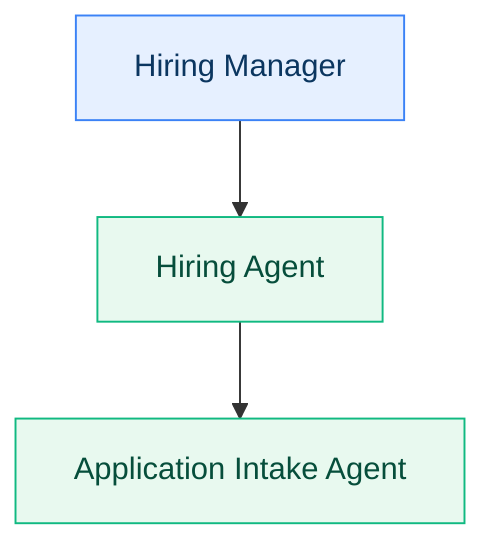

# Custom Components Reference

This document describes every custom component and special markdown syntax available in the Agent Academy documentation. These components are built on [VitePress](https://vitepress.dev/) with custom Vue plugins.

## Custom Vue components

### `<mission-meta />`

Renders a metadata card showing the mission's codename, difficulty rating, estimated time, and taxonomy pills (products, tags, industries). It reads all values directly from the page's YAML frontmatter — no props are needed.

**Usage:**

```markdown
# 🚨 Mission 01: Introduction to Agents

<mission-meta />
```

**Frontmatter fields used:**

| Field | What it renders |
|-------|-----------------|
| `codename` | 🕵️ badge with the operation name |
| `difficulty` | Star rating (⭐). Values are clamped between 1 and 5. |
| `time` | ⏱️ label with a pie-chart icon. The pie fills proportionally — 60 minutes = full circle. |
| `products` | Linked pills pointing to `/products/{slug}/` |
| `tags` | Linked pills pointing to `/tags/{slug}/` |
| `industries` | Linked pills pointing to `/industries/{slug}/` |

The component renders only when at least one of these fields is present. Label lookups use `docs/.vitepress/data/products.json`, `tags.json`, and `industries.json`.

**When to use:** Place immediately after the H1 title on every mission page (courses, Special Ops, and Cowork Collective).

---

### `<missions />`

Renders a filterable, paginated grid of mission cards. Each card shows the mission's section badge, title, difficulty stars, badge image, and date.

**Props:**

| Prop | Type | Default | Description |
|------|------|---------|-------------|
| `section` | string | — | Filter missions by section: `recruit`, `operative`, `special-ops`, `cowork-collective`, `commander-preview`. |
| `sort` | string | `"alphabetical"` | Sort field. Options: `"alphabetical"`, `"last-updated"`, `"level"`, `"first-added"`. |
| `order` | string | `"ascending"` | Sort direction: `"ascending"` or `"descending"`. |
| `maxRows` | number | — | Maximum rows per page. Enables pagination when set. |
| `filterable` | boolean | `true` | Show filter pills for tags, products, and industries. |
| `tag` | string | — | Pre-filter by a tag slug (for example `fundamentals`). |
| `product` | string | — | Pre-filter by a product slug (for example `copilot-studio`). |
| `industry` | string | — | Pre-filter by an industry slug (for example `it`). |

**Examples:**

Show all Special Ops missions, newest first:

```markdown
<missions section="special-ops" sort="first-added" order="descending" />
```

Show Recruit missions filtered to a specific tag:

```markdown
<missions section="recruit" filterable="true" tag="fundamentals" />
```

Show all missions with pagination (4 rows per page):

```markdown
<missions maxRows="4" />
```

**When to use:** On section landing pages (`docs/special-ops/index.md`, `docs/cowork-collective/index.md`, etc.) and any taxonomy pages that list missions.

---

### `<analytics-tag />`

Renders a tracking pixel image for page-level analytics.

**Props:**

| Prop | Type | Required | Description |
|------|------|----------|-------------|
| `section` | string | Yes | Analytics section name (for example `recruit`, `special-ops`, `cowork-collective`). |
| `mission` | string | No | Optional mission identifier for detailed tracking. |

**Examples:**

Track a landing page:

```markdown
<analytics-tag section="cowork-collective" />
```

Track a specific mission:

```markdown
<analytics-tag section="special-ops" mission="yaml-specialist" />
```

**When to use:** Place at the very end of every page, after all other content.

---

### `<breadcrumb />`

Renders a breadcrumb navigation trail on taxonomy pages (products, tags, industries).

**Props:**

| Prop | Type | Required | Description |
|------|------|----------|-------------|
| `section` | string | Yes | Taxonomy type: `"products"`, `"tags"`, or `"industries"`. |
| `label` | string | No | Current page label. When provided, creates a 3-level breadcrumb (Home > Section > Label). When omitted, creates a 2-level breadcrumb (Home > Section). |

**Example:**

```markdown
<breadcrumb section="tags" label="Fundamentals" />
```

**When to use:** At the top of taxonomy detail pages (for example `docs/tags/[slug].md`).

---

### `<page-dates />`

Renders a footer showing the page's creation date and last-edited date. Reads values from frontmatter — no props are needed.

**Frontmatter fields used:**

| Field | Format | What it renders |
|-------|--------|-----------------|
| `created-date` | ISO date (for example `2025-08-20`) | 📅 Created: August 20, 2025 |
| `last-edited-date` | ISO date (for example `2026-03-13`) | ✏️ Last updated: March 13, 2026 |

The component renders only when at least one of these fields exists. Dates are formatted as localized strings ("Month Day, Year").

**When to use:** This component is injected automatically by the custom VitePress theme into the doc footer slot. You do not need to add it manually.

---

### `<products-index />`

Renders a grid of all products from `docs/.vitepress/data/products.json` with icons from `docs/public/product-icons/` and mission counts.

**Props:** None.

**Example:**

```markdown
<products-index />
```

**When to use:** On the products overview page (`docs/products/index.md`).

---

### `<tags-index />`

Renders a grid of all tags from `docs/.vitepress/data/tags.json` with hardcoded SVG icons and mission counts.

**Props:** None.

**Example:**

```markdown
<tags-index />
```

**When to use:** On the tags overview page (`docs/tags/index.md`).

---

### `<industries-index />`

Renders a grid of all industries from `docs/.vitepress/data/industries.json` with mission counts.

**Props:** None.

**Example:**

```markdown
<industries-index />
```

**When to use:** On the industries overview page (`docs/industries/index.md`).

---

## Mermaid diagrams

Mermaid diagrams are rendered client-side with theme-aware styling (dark/light mode). Use the standard fenced code block syntax:

````markdown

````

### Recommended `classDef` styles

These class definitions provide consistent styling across diagrams:

| Class | Fill | Stroke | Text color | Purpose |
|-------|------|--------|------------|---------|
| `person` | `#e6f0ff` | `#3b82f6` | `#0b3660` | Humans / users |
| `agent` | `#e8f9ef` | `#10b981` | `#064e3b` | Agents / bots |
| `data` | `#f3f4f6` | `#6b7280` | `#111827` | Data stores / tables |

You can use any valid Mermaid syntax — flowcharts, sequence diagrams, state diagrams, and so on.

---

## GitHub alert callouts

VitePress supports GitHub-flavored alert syntax for callout boxes. Use these to highlight tips, warnings, and important information.

### Available callout types

**NOTE** — supplementary information that adds context:

```markdown
> [!NOTE]
> You can have up to 10 child agents per parent agent in Copilot Studio.
```

**TIP** — best practices and recommendations:

```markdown
> [!TIP] Best Practice
> Use child agents when you need tight control over the conversation flow
> and want to reuse specific capabilities across multiple scenarios.
```

**INFO** — conceptual definitions and background context:

```markdown
> [!INFO] Learn more
> Connected agents communicate through handoffs, passing context and
> conversation history between specialized agents.
```

**WARNING** — cautions the learner should be aware of:

```markdown
> [!WARNING]
> Be careful not to create circular references when connecting agents.
```

**IMPORTANT** — critical information the learner must not miss:

```markdown
> [!IMPORTANT]
> You need to be part of the Frontier preview program to complete this lab.
```

### Callout titles

Adding text after the type keyword sets a custom title:

```markdown
> [!TIP] Best Practice
> Content here — the title "Best Practice" replaces the default "TIP" label.
```

When no custom title is provided, the callout uses the type keyword as the title.

---

## VitePress built-in markdown features

### Custom heading anchors

Override the auto-generated heading anchor with a custom ID using `{#id}` syntax:

```markdown
# 🎯 Mission Brief {#mission-brief}
## 🔎 Objectives {#objectives}
```

This produces `<h1 id="mission-brief">` and `<h2 id="objectives">` regardless of the emoji or text content. Use this when the heading contains emoji or special characters that would produce an ugly auto-generated anchor.

### Image sizing

Control image dimensions using attribute syntax after the image:

```markdown
{ width="300" }
```

This sets the rendered width to 300 pixels. Use it for badge images and other graphics that should not render at full width.

### `v-pre` container

Prevent Vue template processing inside a block. Use this when your content contains double curly braces (`{{ }}`) that should be rendered as literal text instead of being interpreted as Vue template expressions:

```markdown
::: v-pre
{{ handlebars }} syntax will render literally, not as Vue template.
:::
```

This is needed in missions that discuss template languages, Power Fx expressions, or any code containing `{{ }}`.

---

## Dark / light mode classes

Two CSS utility classes control visibility based on the current color theme:

```html
<span class="dark-only">This text only appears in dark mode</span>
<span class="light-only">This text only appears in light mode</span>
```

Use these when you need to show different images or text depending on the user's theme. For example, providing separate light-background and dark-background versions of a diagram.

---

## Frontmatter reference

### All available fields

| Field | Type | Courses | Special Ops | Cowork Collective | Description |
|-------|------|---------|-------------|-------------------|-------------|
| `prev` | object | Required* | — | — | Previous mission navigation. Contains `text` and `link`. |
| `next` | object | Required* | — | — | Next mission navigation. Contains `text` and `link`. |
| `short-description` | string | Required | — | — | Brief mission description for course cards. |
| `description` | string | — | Required | Required | Mission description (min 10 chars). Used in mission grid cards. |
| `difficulty` | number | Required | Required | Required | Difficulty level (1–5). |
| `codename` | string | Required | — | — | Operation name in ALL CAPS. |
| `time` | number | Required | Required | Required | Estimated minutes to complete. |
| `section` | string | — | — | Required | Must be `cowork-collective` for Cowork Collective missions. |
| `badge` | string | — | Required | Required | Relative path to the badge image. |
| `tags` | string[] | Required | Required | Required | Tag slugs from `tags.json`. |
| `products` | string[] | Required | Required | Required | Product slugs from `products.json`. |
| `industries` | string[] | Required | Required | Required | Industry slugs from `industries.json`. |
| `created-date` | date | Required | Required | Required | ISO date of first publish. |
| `last-edited-date` | date | Required | Required | Required | ISO date of last edit. |
| `lastUpdated` | boolean | Optional | Optional | Optional | Set to `false` on landing/overview pages to hide the VitePress last-updated footer. |

*`prev` is not required on the first mission; `next` is not required on the last mission.

---

## Taxonomy slugs

Tags, products, and industries must use slugs defined in the data files under `docs/.vitepress/data/`. Using an undefined slug will cause the pill to render without a label.

### Tags (`docs/.vitepress/data/tags.json`)

<!-- markdownlint-disable MD013 -->
| Slug | Label |
|------|-------|
| `adaptive-cards` | Adaptive Cards |
| `ai-safety` | AI Safety |
| `automation` | Automation |
| `compliance` | Compliance |
| `completion` | Course Completion |
| `custom-skills` | Custom Skills |
| `declarative-agents` | Declarative Agents |
| `document-generation` | Document Generation |
| `feedback` | User Feedback |
| `finance` | Finance |
| `fundamentals` | Fundamentals |
| `grounding` | Grounding |
| `instructions` | Agent Instructions |
| `licensing` | Licensing |
| `mcp` | Model Context Protocol (MCP) |
| `models` | Model Selection |
| `multi-agent` | Multi-Agent |
| `multimodal` | Multimodal |
| `pac-cli` | Power Platform CLI |
| `prebuilt-agents` | Prebuilt Agents |
| `prompting` | Prompting |
| `publishing` | Publishing |
| `setup` | Environment Setup |
| `solutions` | Solutions |
| `topics` | Topics & Dialogs |
| `triggers` | Triggers |
| `yaml` | YAML |

### Products (`docs/.vitepress/data/products.json`)

| Slug | Label |
|------|-------|
| `azure` | Microsoft Azure |
| `copilot-cowork` | Copilot Cowork |
| `copilot-studio` | Microsoft Copilot Studio |
| `dataverse` | Microsoft Dataverse |
| `excel` | Microsoft Excel |
| `github-copilot` | GitHub Copilot |
| `microsoft-365` | Microsoft 365 |
| `microsoft-365-copilot` | Microsoft 365 Copilot |
| `microsoft-learn` | Microsoft Learn |
| `onedrive` | Microsoft OneDrive |
| `outlook` | Microsoft Outlook |
| `power-automate` | Power Automate |
| `power-platform` | Microsoft Power Platform |
| `sharepoint` | SharePoint |
| `teams` | Microsoft Teams |
| `visual-studio-code` | Visual Studio Code |
| `word` | Microsoft Word |

### Industries (`docs/.vitepress/data/industries.json`)

| Slug | Label |
|------|-------|
| `facilities` | Facilities |
| `financial-services` | Financial Services |
| `general` | General |
| `hr` | HR |
| `it` | IT |
| `security` | Security |
<!-- markdownlint-enable MD013 -->

To add a new tag, product, or industry, add an entry to the corresponding
JSON file. Product icons should be placed as SVG files in
`docs/public/product-icons/` with the slug as the filename.
