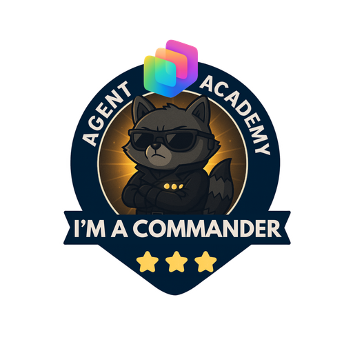

---
next:
  text: 'Advanced MCP Server Usage'
  link: '/commander-preview/01-advanced-mcp'
lastUpdated: false
---

# Welcome Commander (Preview)

> [!NOTE]
> ⚠️ This is a **preview** of the Commander curriculum. Content is under active development.

**Welcome, Commander.**  
Your elite mission, should you choose to accept it, is to master the most advanced capabilities of **Microsoft Copilot Studio** and lead the charge in building **production-ready, enterprise-scale agent solutions**.

This advanced training takes you beyond multi-agent orchestration into the cutting edge of agent development: from computer-using agents and code interpretation to voice-enabled experiences, governance, and deployment at scale.

## 🧬 Who This Is For {#who-this-is-for}

This elite course is ideal for:

- **Solution architects** designing enterprise-scale AI deployments
- **Developers** building production-ready, governed agent solutions
- **IT professionals** implementing advanced security and ALM practices
- **AI specialists** extending Copilot Studio with Azure AI and custom models
- Anyone ready to **command** the full breadth of Copilot Studio capabilities

## 🧭 Curriculum Overview {#curriculum-overview}

This academy is structured as a progressive series of advanced operations. Each mission deepens your mastery of enterprise agent capabilities.

| Mission | Title | Operation Briefing |
| --------- | ------- | ------------------- |
| `01` | 🔌 [Advanced MCP Server Usage](./01-advanced-mcp/index.md) | Connect to Dataverse MCP, add existing MCP servers, and explore the Power Apps MCP server |
| `02` | 🖥️ [Computer Using Agents (CUA)](./02-computer-using-agents/index.md) | Automate apps and websites with virtual mouse and keyboard interactions |
| `03` | 🐍 [Code Interpreter](./03-code-interpreter/index.md) | Run Python scripts in a sandbox for analysis, charting, and file generation |
| `04` | 🤝 [Human in the Loop (HITL)](./04-human-in-the-loop/index.md) | Create multi-stage approval flows mixing AI decisions and manual review |
| `05` | 🎙️ [Voice-enabled Agents](./05-voice-enabled-agents/index.md) | Build agents that handle phone calls, speech, and dual-tone multi-frequency (DTMF) input |
| `06` | 🌍 [Localization](./06-localization/index.md) | Build multilingual agents with language detection, dynamic switching, and time zone accommodation |
| `07` | 🧠 [Extend with Azure AI & BYOM](./07-azure-ai-byom/index.md) | Integrate Azure AI Search, Azure AI Foundry, and bring your own models |
| `08` | 📚 [Knowledge Deep Dive](./08-knowledge-deep-dive/index.md) | Optimize knowledge sources, connect SharePoint, and understand security |
| `09` | 🔄 [Handoff to Human Agents](./09-handoff-to-human/index.md) | Configure escalation to live agents with context transfer across supported engagement hubs |
| `10` | 🔐 [Governance Essentials with Authentication, Channels & DLP](./10-governance-auth-dlp/index.md) | Secure agent access with SSO, authentication, and DLP policies |
| `11` | 🧪 [Test, Monitor, Debug & Analytics](./11-test-monitor-debug/index.md) | Test panel, activity maps, conversation snapshots, automated agent evaluations, Analytics dashboards, custom telemetry, and Power BI reporting |
| `12` | 🚀 [Deploy Agents with Solutions & Pipelines](./12-deploy-solutions-pipelines/index.md) | Environment strategies, solutions, component collections, connections, sharing controls, and Pipelines |
| `13` | 🏁 [Next Steps and Best Practices](./13-next-steps-best-practices/index.md) | Apply implementation guides, Power CAT tools, and the Well-Architected Framework |

<analytics-tag section="commander-preview" />
