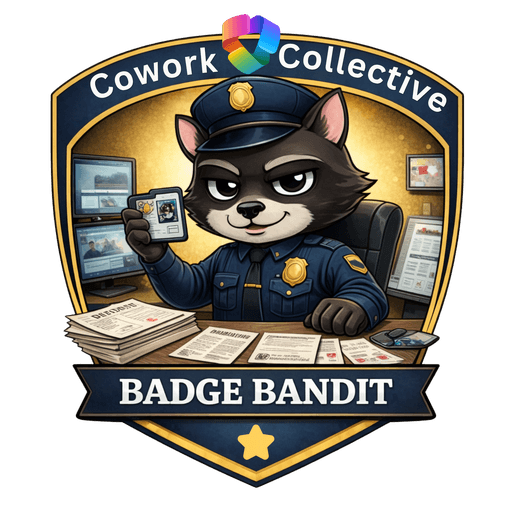
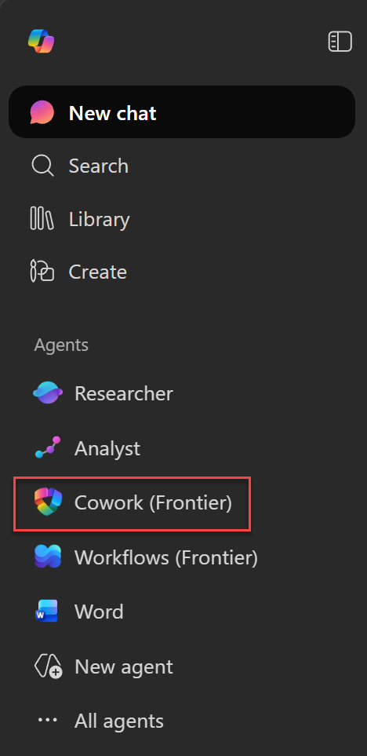
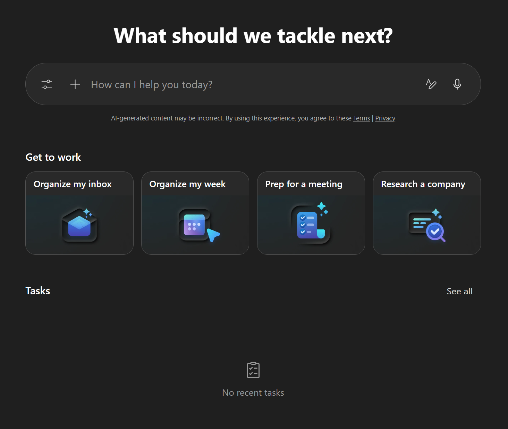
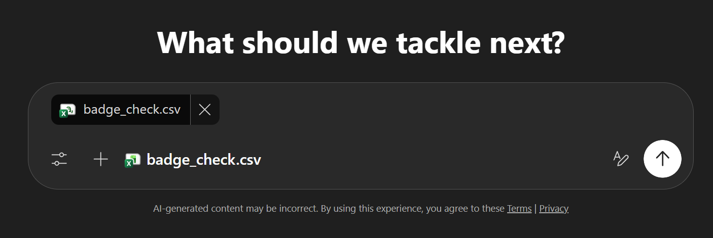
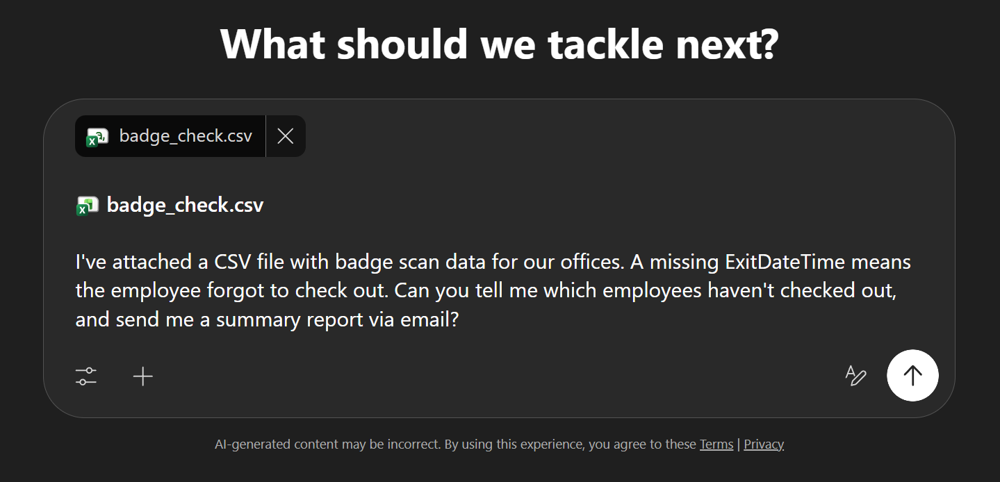
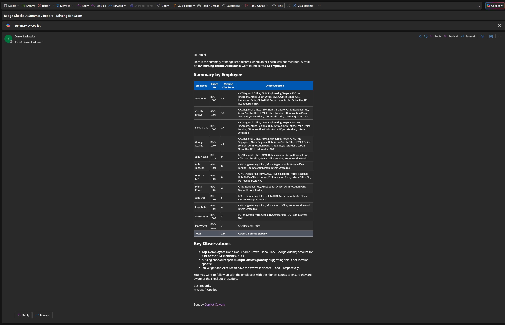
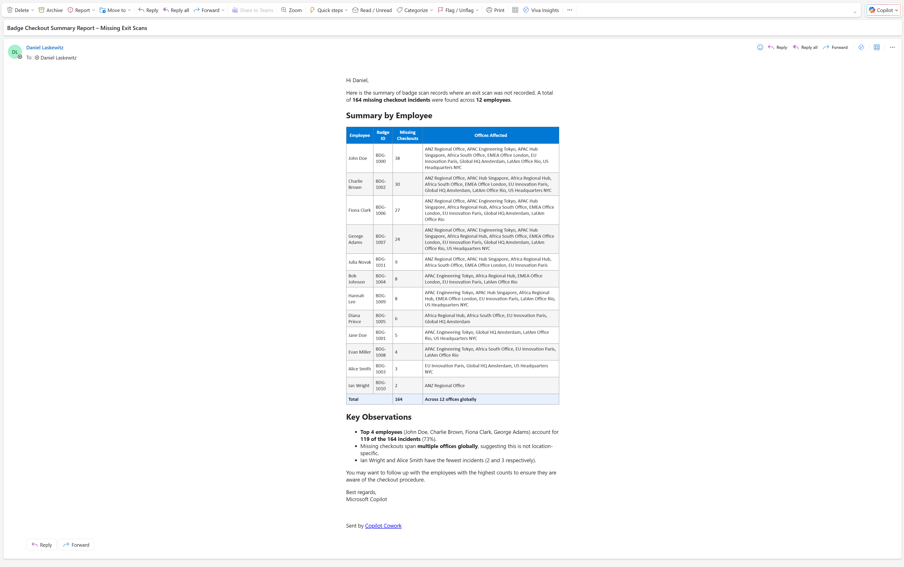
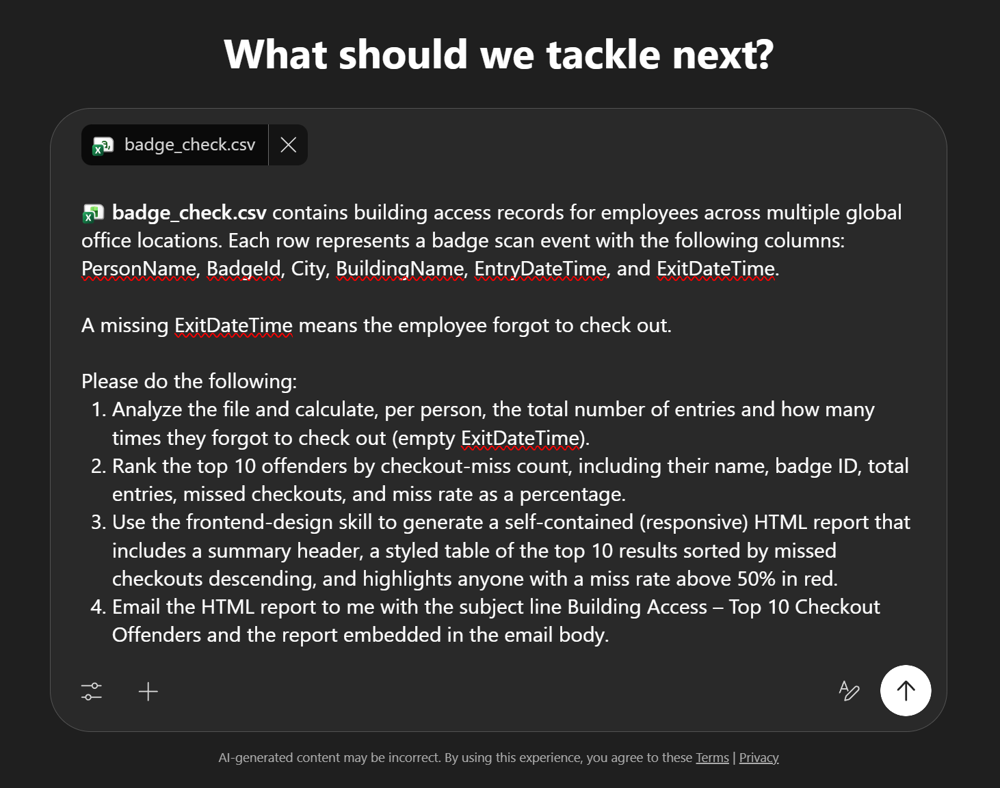
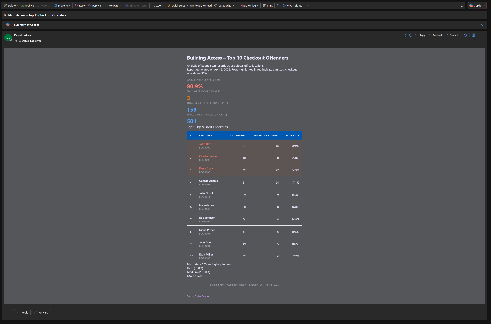
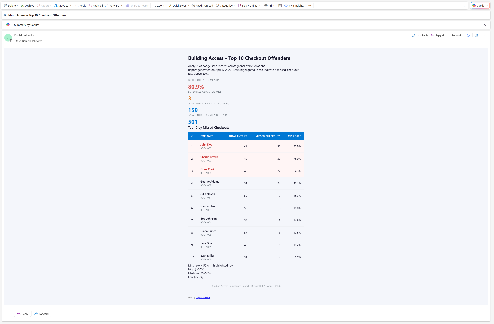

---
tags:
  - custom-skills
difficulty: 1
time: 25
description: >-
  Use Copilot Cowork to analyse badge scan data, identify checkout offenders,
  and email a styled HTML report.
section: cowork-collective
badge: ../assets/BadgeBandit-badge.png
products: [microsoft-365-copilot, copilot-cowork, onedrive, outlook]
industries:
  - facilities
  - security
created-date: 2026-04-06
last-edited-date: 2026-04-06
---
# 🏢 Badge Check

<mission-meta />

<!-- markdownlint-disable-next-line MD033 -->
<p align="center"></p>

**Welcome, agent.** Your mission — should you choose to accept it — is **Operation Badge Bandit**: track down employees who keep forgetting to badge out and get the results into your inbox using Copilot Cowork. 🔍

## 🔍 The Problem {#the-problem}

Building security depends on accurate badge data, but employees forget to badge out all the time. Finding repeat offenders in a CSV, formatting a report, and emailing it takes longer than it should.

## 📋 What You'll Produce {#what-youll-produce}

By the end of this mission, Copilot Cowork will have:

- ✅ Analyzed a badge scan CSV and identified employees who forgot to check out
- ✅ Sent you a summary report via email
- ✅ (With a custom skill) Sent a styled HTML report with color-coded tables that flag the worst offenders

## ⚙️ Prerequisites {#prerequisites}

- **Microsoft 365 Copilot license**: required to access Copilot Cowork ([learn more](https://learn.microsoft.com/copilot/microsoft-365/microsoft-365-copilot-licensing))
- **Microsoft 365 license**: required for Outlook (to receive the email report) and OneDrive (to store custom skills)
- **Anthropic models enabled on your tenant**: Copilot Cowork relies on Anthropic models. Ensure your admin has enabled them in the [Microsoft 365 admin center](https://admin.microsoft.com/)
- **Copilot Cowork access** via the [Microsoft 365 Frontier program](https://adoption.microsoft.com/copilot/frontier-program/)

## 🤝 What is Copilot Cowork? {#what-is-copilot-cowork}

Copilot Cowork is a new way to delegate work to Copilot. You describe what you need and it works across your Microsoft 365 environment to get it done.

It comes with 13 built-in skills:

- **Communication**: Draft and send emails, post to Teams channels, manage your inbox
- **Documents**: Create Word documents, Excel spreadsheets, PowerPoint presentations, and PDFs
- **Calendar**: Schedule meetings using natural language, manage calendar conflicts, get daily briefings
- **Search**: Find information and people across your organisation, perform deep research
- **Automation**: Run prompts on a schedule for recurring tasks

You can also add custom skills stored in OneDrive. It asks for your approval before taking any action.

## 🎯 The Scenario {#the-scenario}

You work in facilities security at a company with offices in multiple cities. Every employee badges in and out of their building, but some people forget to badge out at the end of the day. Your manager wants a report identifying repeat offenders so the security team can follow up. You've been handed a CSV export from the badge system and need to find out who keeps forgetting to check out, then email the results.

## 📁 Lab Assets {#lab-assets}

This mission uses one source file.

| File | What it contains |
| --- | --- |
| `badge_check.csv` | Building access records with employee names, badge IDs, office locations, and entry/exit timestamps. A missing `ExitDateTime` means the employee forgot to check out. |

📥 **Download lab assets:** [badge_check.csv](https://raw.githubusercontent.com/microsoft/agent-academy/main/docs/cowork-collective/badge-check/assets/badge_check.csv)

## 🧪 Lab 1.1 - Find the Offenders {#lab1-find-the-offenders}

In this first lab, upload the badge scan file and ask Copilot Cowork to identify who hasn't checked out.

1. Open [Microsoft 365 Copilot](https://m365.cloud.microsoft/chat/)

1. Select **Cowork (Frontier)**. If you don't see it, select **All agents** first

    

    You'll land on the Copilot Cowork homepage. From here you can type a new task at the top, try one of the "Get to work" samples, or pick up where you left off from the recent tasks list.

    

    > [!NOTE]
    > Your Copilot Cowork homepage may look slightly different depending on when you access it.

1. Drag and drop the **badge_check.csv** file into the conversation

    

1. Add a couple of new lines after the file attachment using **Shift + Enter** to make some space, then type the following message:

    ```text
    I've attached a CSV file with badge scan data for our offices. A missing ExitDateTime means the employee forgot to check out. Can you tell me which employees haven't checked out, and send me a summary report via email?
    ```

    

1. If it looks like the screenshot above, hit the white circle with the black arrow pointing up in the bottom-right corner to send.

1. Review the steps Copilot Cowork takes. It will analyse the file, identify who hasn't checked out, and send an email with the results.

    

1. Go to [outlook.office.com](https://outlook.office.com) and check your inbox. You should have an email from Copilot Cowork with a summary table of all employees, their badge IDs, missing checkout counts, and which offices were affected.

    {.dark-only}
    {.light-only}

    Verify the email contains:

    - **12 employees** listed in the summary table
    - **164 total** missing checkout incidents
    - **John Doe** at the top with the highest count (38)
    - Columns for Badge ID and Offices Affected

    > [!TIP]
    > If the report is missing employees or the counts look wrong, don't start over. Send a follow-up in the same conversation, like: *"The report is missing Ian Wright — can you recheck and resend?"* Copilot Cowork will correct and resend without regenerating everything.

You now have a working report in your inbox. Lab 2 builds on this with a formatted HTML report using a custom skill.

## 🧪 Lab 1.2 - Upgrade with a Custom Skill {#lab2-upgrade-with-a-custom-skill}

Copilot Cowork supports custom skills stored in your OneDrive. A skill is a `SKILL.md` file with instructions for a specific task. Copilot Cowork discovers your custom skills automatically at the start of each conversation and loads them as needed.

> [!NOTE]
> You can create up to 20 custom skills. Each `SKILL.md` file can be up to 1 MB.

### How Custom Skills Work

Each custom skill lives in its own subfolder under `/Documents/Cowork/Skills/` in your OneDrive. The `SKILL.md` file has two parts:

1. A **YAML frontmatter block** with a `name` and `description`. Copilot Cowork uses the description to decide when to load the skill
1. **Markdown instructions**: the actual behaviour you want Copilot Cowork to follow when the skill is active

```yaml
---
name: My Skill Name
description: A short description of when and why Cowork should use this skill.
---
Your skill instructions go here in plain Markdown.
Tell Cowork exactly how you want it to behave when this skill is active.
```

### Add the Skill

In this mission, you'll create a **frontend-design** skill that instructs Copilot Cowork to produce polished, self-contained HTML emails whenever it generates a report.

> [!NOTE]
> The **frontend-design** skill used in this mission is based on an open-source skill created by Anthropic, available on [skills.sh](https://skills.sh/anthropics/skills/frontend-design). It has been slightly modified to include responsive design requirements for email output.
> [Skills.sh](https://skills.sh) is a community site with skills you can use with AI tools like Copilot Cowork. Most are development-focused, but there are others worth browsing. Each skill goes through security checks, so you can review whether a skill has passed before using it.

1. Download the [SKILL.md](https://raw.githubusercontent.com/microsoft/agent-academy/main/docs/cowork-collective/badge-check/assets/SKILL.md) file and save it to your device

    The skill tells Copilot Cowork how to format HTML output: pick real fonts instead of system defaults, use a consistent color scheme, and make layouts work on both desktop and mobile. It also has guardrails against generic-looking output (no purple-on-white gradients, no cookie-cutter tables). The result is a report that actually looks like someone designed it.

1. Open **OneDrive** and navigate to `Documents`

1. Create the following folder structure (create each folder if it doesn't exist):

    ```text
    Documents/Cowork/skills/frontend-design/
    ```

1. Upload the `SKILL.md` file into the `frontend-design` folder

1. Copilot Cowork will automatically discover this skill at the start of your next conversation

### Run the Enhanced Mission

1. Open [Microsoft 365 Copilot](https://m365.cloud.microsoft/chat) and select **Cowork (Frontier)**

1. Start a **new conversation**

1. Add the following prompt to the text box (don't send it yet):

    ```text
    [file] contains building access records for employees across multiple global office
    locations. Each row represents a badge scan event with the following columns: PersonName, BadgeId, City,
    BuildingName, EntryDateTime, and ExitDateTime.

    A missing ExitDateTime means the employee forgot to check out.

    Please do the following:

    1. Analyze the file and calculate, per person, the total number of entries and how many times they forgot
       to check out (empty ExitDateTime).
    2. Rank the top 10 offenders by checkout-miss count, including their name, badge ID, total entries,
       missed checkouts, and miss rate as a percentage.
    3. Use the frontend-design skill to generate a self-contained (responsive) HTML report that includes a summary header, a styled table of
       the top 10 results sorted by missed checkouts descending, and highlights anyone with a miss rate above
       50% in red.
    4. Email the HTML report to me with the subject line Building Access – Top 10 Checkout Offenders and
       the report embedded in the email body.
    ```

    > [!NOTE]
    > When you paste the prompt, the formatting might look a bit off. You can clean it up by adding or removing any extra newlines.

    <!-- markdownlint-disable-next-line MD028 -->

    > [!TIP]
    > This prompt uses a pattern you can reuse for any data analysis: (1) describe the data format and columns, (2) define the analysis, (3) specify the output format and skill, (4) set the delivery method. Swap the file and analysis and the same structure works for any dataset.

1. Remove the `[file]` placeholder

1. Add the **badge_check.csv** file from last time by selecting `+` > `Upload images and files` > `select the file on your computer`

    

1. Send the prompt by hitting the white circle with the black arrow pointing up in the bottom-right corner

1. Watch the **frontend-design** skill load in the side panel. Copilot Cowork will now apply your HTML formatting rules

1. Go to [outlook.office.com](https://outlook.office.com) and check your inbox. You should now have a styled HTML report with the top 10 results, miss rates, and red highlights for anyone above 50%.

{.dark-only}
{.light-only}

### What Changed?

Open both emails side by side. The first one is a plain text table with all 12 employees. The second has styled rows, actual typography, and color coding for the worst offenders. Same CSV, same agent. The only difference is the skill file you added to OneDrive.

> [!TIP]
> Want to tweak the report? In the same conversation, try: *"Change the red highlight threshold from 50% to 30% and add a column showing each person's most frequent office."* Copilot Cowork will update the report and resend it.

## 🏆 Mission Accomplished {#mission-accomplished}

**Operation Badge Bandit is complete.** One CSV, two reports, one custom skill.

What you saw in action:

✅ **One conversation, full workflow**: You described the job. Copilot Cowork analyzed the data, built the report, and emailed it.

✅ **Custom skills change the output**: The same CSV went from a plain text table to a styled HTML report because of one skill file.

✅ **Nothing sends without your approval**: Copilot Cowork drafted the email and waited for you to review it first.

## 🏅 Claim your Badge Bandit badge {#claim-your-badge}

<!-- markdownlint-disable-next-line MD033 -->
<p align="center"></p>

Congrats, agent — mission accomplished! If you'd like to claim your badge for completing this mission, please submit your badge request:

[https://aka.ms/cowork-collective/badge-check/form](https://aka.ms/cowork-collective/badge-check/form)

Once reviewed, you'll get an email from Global AI Community with instructions to claim your badge.

## 📚 Related Content {#related-content}

- 📖 [Copilot Cowork overview — Microsoft Learn](https://learn.microsoft.com/copilot/microsoft-365/cowork/)
- 📖 [Get started with Copilot Cowork](https://learn.microsoft.com/copilot/microsoft-365/cowork/get-started)
- 📖 [Copilot Cowork skills and custom skills](https://learn.microsoft.com/copilot/microsoft-365/cowork/use-cowork#cowork-skills)
- 🚀 [Join the Microsoft 365 Copilot Frontier program](https://adoption.microsoft.com/copilot/frontier-program/)
- 📖 [Frontend Design skill (skills.sh)](https://skills.sh/anthropics/skills/frontend-design)

<analytics-tag section="cowork-collective" mission="badge-check" />
