---
tags:
  - compliance
  - finance
  - document-generation
difficulty: 1
time: 25
description: >-
  Use Copilot Cowork to turn four compliance documents into a complete audit
  package with a gap analysis and executive summary.
section: cowork-collective
badge: ../assets/AuditAce-badge.png
products:
  - microsoft-365-copilot
  - copilot-cowork
  - excel
  - word
industries:
  - financial-services
created-date: 2026-04-06
last-edited-date: 2026-04-06
---
# 🔒 The Compliance Packet

<mission-meta />

<!-- markdownlint-disable-next-line MD033 -->
<p align="center">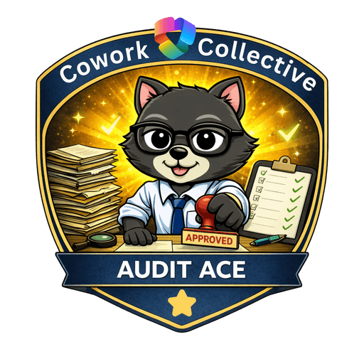</p>

**Welcome, agent.** Your mission — should you choose to accept it — is **Operation By the Book**.

Zava Financial Services has an external auditor arriving in two weeks. You have four internal documents: two policy files, a risk register with open findings, and an audit checklist. What you need is a complete audit package with an executive summary, gap analysis, and auditor cover letter, plus a briefing email drafted and ready for you to review and send.

Normally that's a full day of work. Here, it's one prompt and one deliberate send.

## 🔍 The Problem {#the-problem}

Compliance prep is document-heavy and cross-referential. You need to reconcile information across multiple files, write for different audiences, and produce outputs in specific formats without introducing errors that an auditor will catch.

## 📋 What You'll Produce {#what-youll-produce}

By the end of this mission, Cowork will have created:

- ✅ An **executive summary** (Word) synthesizing Zava's compliance posture across all four source files
- ✅ A **gap analysis** (Excel) mapping open risk register findings to audit checklist items, sorted by risk level
- ✅ An **auditor cover letter** (Word) addressed to Hartwell & Associates, signed by leadership
- ✅ A **leadership briefing email** that's drafted, reviewed by you, and sent from Outlook with your approval

## ⚙️ Prerequisites {#prerequisites}

- Active **Microsoft 365 Copilot** license with Cowork enabled
- The four sample files from this lab's `/assets/sample-files` folder downloaded to your device

> [!WARNING]
> Cowork requires Frontier enrollment for **both your user account and your tenant**. If Cowork isn't visible when you navigate to [m365.cloud.microsoft](https://m365.cloud.microsoft), ask your admin to check enrollment under **Copilot → Settings → Frontier** in the Microsoft 365 Admin Center.
>
> Before starting, open and skim all four sample files so you know what Cowork is working with.

## 🎯 The Scenario {#the-scenario}

You are a compliance analyst at **Zava Financial Services**, a mid-size financial services firm based in Chicago. An external audit by **Hartwell & Associates LLP** is scheduled for **October 14–18, 2026**, covering ISO 27001 and SOC 2 Type II controls. Your CISO (Chief Information Security Officer) needs a complete audit package ready for leadership review by end of week. You have four internal documents that describe Zava's current compliance posture. Your job: turn them into a professional audit package in a single Cowork session that you can use to brief leadership.

## 📁 Lab Assets {#lab-assets}

This mission provides all four source documents.

| File | What it contains | Download |
|------|------------------|----------|
| `data-retention-policy.docx` | Zava's data retention policy, version 2.3, covering retention schedules and legal hold procedures | [download](https://raw.githubusercontent.com/microsoft/agent-academy/main/docs/cowork-collective/compliance-packet/assets/sample-files/data-retention-policy.docx) |
| `zava-access-control-policy.docx` | Zava's access control policy, version 3.1, covering IAM, MFA, and privileged access | [download](https://raw.githubusercontent.com/microsoft/agent-academy/main/docs/cowork-collective/compliance-packet/assets/sample-files/zava-access-control-policy.docx) |
| `zava-risk-register.csv` | 12 open/partial risk findings (R-001 through R-012), each with Risk Level, Owner, Status, and remediation notes | [download](https://raw.githubusercontent.com/microsoft/agent-academy/main/docs/cowork-collective/compliance-packet/assets/sample-files/zava-risk-register.csv) |
| `zava-audit-checklist.csv` | 15 audit checklist items mapped to ISO 27001 and SOC 2 controls, each with a Readiness Status (Ready / In Progress / Not Ready) | [download](https://raw.githubusercontent.com/microsoft/agent-academy/main/docs/cowork-collective/compliance-packet/assets/sample-files/zava-audit-checklist.csv) |

## 🧪 Lab 1.1 - Open Cowork and Attach Your Files {#lab-1-1}

One habit worth building early: **attach files before you send your first message**. Files attached at the start are available to every step in the conversation. Files added later only apply from that point forward.

1. Navigate to [m365.cloud.microsoft](https://m365.cloud.microsoft) or open the **Microsoft 365 Copilot** desktop app
1. In the left navigation under **Agents**, select **Cowork**

    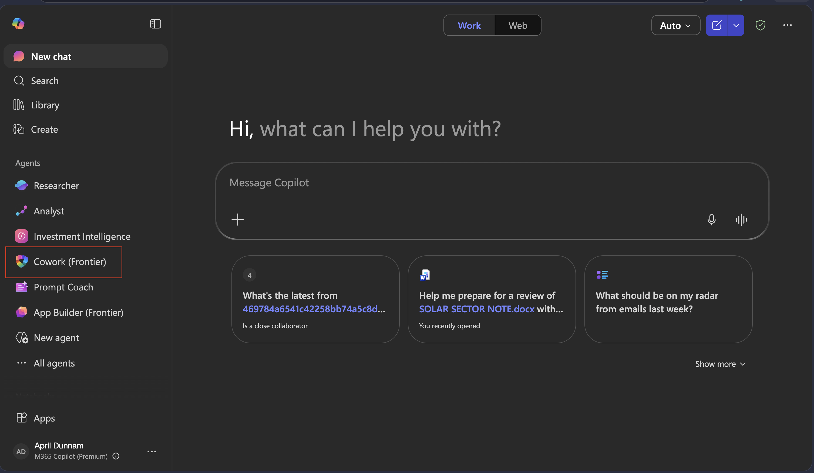

1. Before typing anything, attach all four sample files:
   - Select **Upload images and files** to upload from your device, OR
   - Select **Attach cloud files** if you've already moved them to OneDrive or SharePoint

    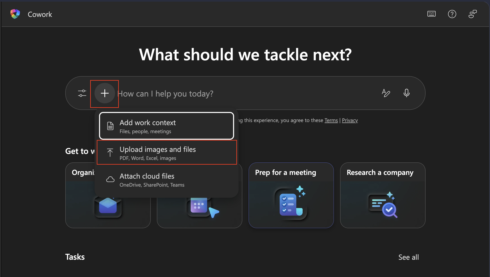

> [!NOTE]
> If you don't see Cowork in your left navigation, select **All agents** and search for it. If it still doesn't appear, your account may not have Frontier access (ask your admin)

## 🧪 Lab 1.2 - Send the Prompt {#lab-1-2}

With all four files attached, describe the complete job in one message. Tell Cowork what you want, and let it figure out how.

1. Copy and paste the following prompt, then send it:

```text
I'm a compliance analyst at Zava Financial Services preparing for an external audit by Hartwell & Associates LLP, scheduled for October 14–18, 2026. The audit covers ISO 27001 and SOC 2 Type II. My CISO needs a complete audit package ready for leadership review by end of week.

I've attached four documents that describe our current compliance posture. 
Use these as your only source of truth — do not add findings, owners, or policy details that aren't in the attached files.

Please produce three documents and one email draft:

1. EXECUTIVE SUMMARY (Word, save as: zava-audit-executive-summary.docx)
   Audience: CISO and C-suite. Tone: direct and professional, not alarmist.
   Include:
   - Overall compliance posture assessment based on the attached files
   - The highest-risk open findings with their actual Risk IDs from the register
   - Audit readiness breakdown by status count from the checklist
   - The control domains with highest exposure
   - A prioritized two-week action plan

2. GAP ANALYSIS (Excel, save as: zava-gap-analysis.xlsx)
   Map each open or partial finding from the Risk Register to its corresponding 
   audit checklist item. Include these columns:
   Risk ID | Risk Description | Risk Level | Related Audit Checklist Item | 
   Audit Readiness Status | Gap Summary | Recommended Action Before Audit | Owner
   Sort by Risk Level descending (Critical first).
   Add a summary row at the bottom showing counts by risk level.

3. AUDITOR COVER LETTER (Word, save as: zava-audit-cover-letter.docx)
   Addressed to: Hartwell & Associates LLP, Attention: Lead Auditor
   Signed by: Dana Olufsen (CCO) and Priya Nair (VP Information Security)
   Include:
   - Formal introduction of the enclosed audit package
   - Confirmation of audit scope (ISO 27001 + SOC 2 Type II, October 14–18, 2026)
   - Acknowledgment that certain remediation items are in progress, with 
     detail in the executive summary
   Format: formal business letter, today's date, closing: "Respectfully submitted"

4. LEADERSHIP BRIEFING EMAIL
   Subject: Audit Package Ready for Review — October 14 Engagement
   Include:
   - Reference to the October 14 audit date and Hartwell & Associates
   - The top 3 most urgent compliance gaps requiring executive attention 
     (cite the actual Risk IDs from the register)
   - A note that the full executive summary is attached
   - A request for a 30-minute alignment call this week
   Tone: concise — no more than 3 short paragraphs

```

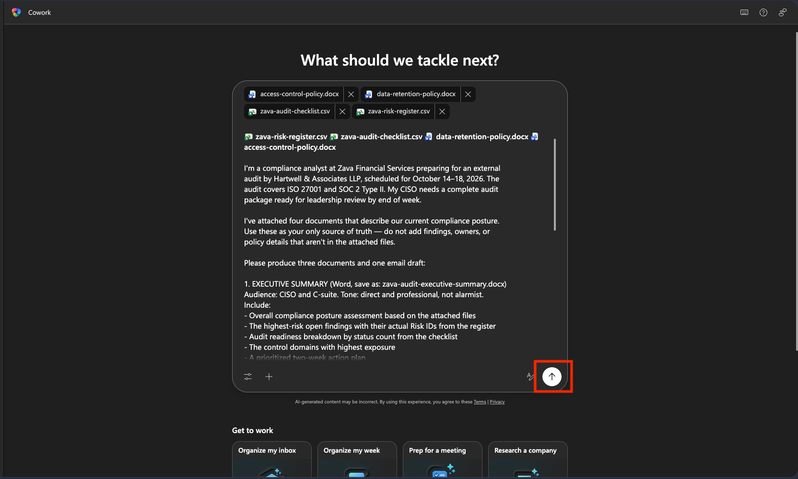

> [!TIP]
> The phrase "Use these as your only source of truth — do not add findings or owners that aren't in the attached files" is important. It's the instruction that keeps Cowork from pattern-matching to generic compliance content. Use this pattern any time accuracy is non-negotiable.

## 🧪 Lab 1.3 - Watch the Side Panel and Review Documents {#lab-1-3}

After sending, open the **side panel** and watch the **Progress** section update in real time. You'll see the skills Cowork activates appear as chips in the **Skills** section.

As Cowork completes each document, it will show them in the Outputs folder.

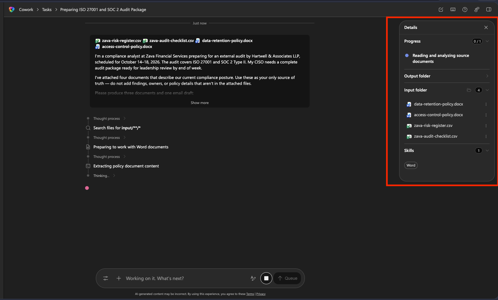

1. Click on the **Executive Summary** Output to open a preview directly in Cowork so you can review. Check against the source files and confirm the following:

    - Does it reference specific Risk IDs (R-001 through R-012)?
    - Are the readiness counts correct?
    - Are policy version numbers accurate? (Data Retention v2.3, Access Control v3.1)

    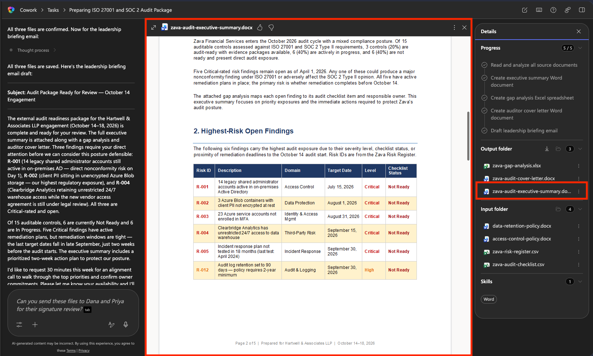

1. Open the **Gap Analysis** Output to open a preview directly in Cowork so you can review. Check against the source files and confirm the following:

    - Are all risk register findings represented?
    - Is it sorted Critical → High → Medium?
    - Are owners correct for each row? (Cross-reference with the risk register)
    - Does the summary row at the bottom show the right counts by risk level?

    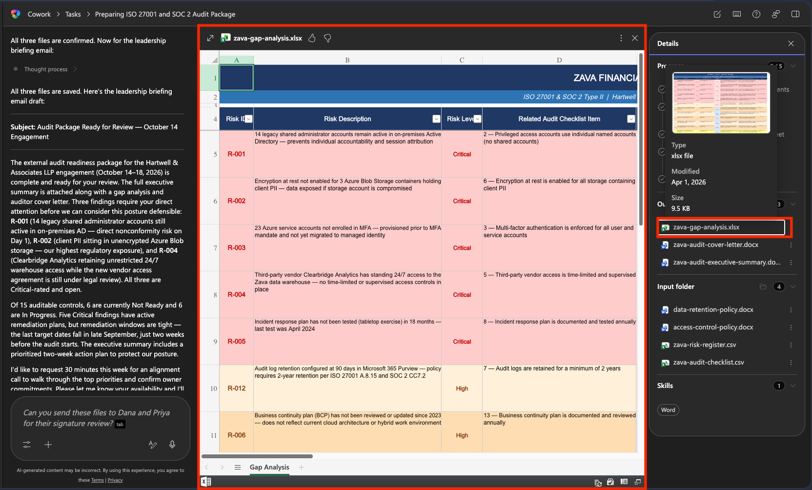

1. Open the **Cover Letter** Output to open a preview directly in Cowork so you can review. Check against the source files and confirm the following:

    - Correct addressee (Hartwell & Associates LLP)
    - Both signatories present (Dana Olufsen and Priya Nair)
    - Correct audit dates (October 14–18, 2026)
    - Formal business letter format with today's date

    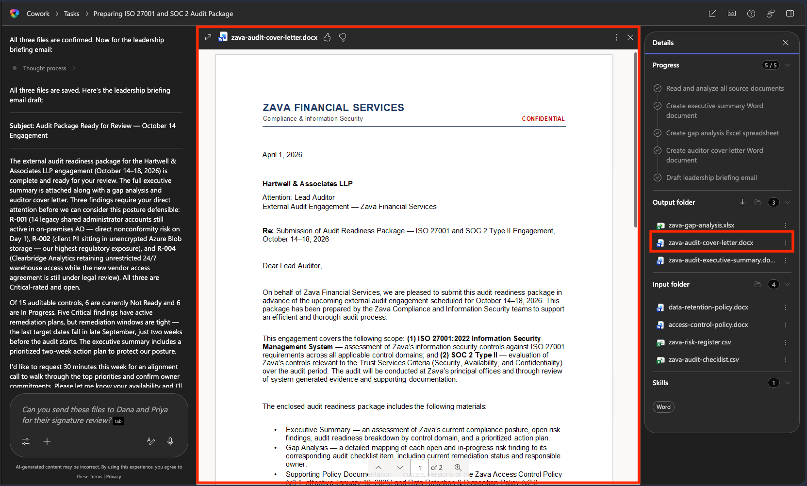

> [!NOTE]
> If something is wrong, fix it in the same conversation, don't start over. Use a targeted correction like: `"The gap analysis is missing R-012. Please add it mapped to audit checklist item #7, Risk Level High"` Cowork will update the file and show you the revised version.

## 🧪 Lab 1.4 - Review and Approve the Email {#lab-1-4}

After the three documents are complete, Cowork will present the leadership briefing email draft for your review.

1. Read the email carefully before doing anything else:

    - Do the **Risk IDs** cited match the highest-severity findings in your risk register?
    - Is the **tone** concise, professional, not alarmist?
    - Is the **call to action** clear (a 30-minute alignment call this week)?
    - Does it reference the **correct audit date** (October 14)?

1. If the email looks right, enter the following prompt asking Cowork to send the email:

    ```text
    Can you send this email and files to <insert your email here>
    ```

    > [!NOTE]
    > If anything needs changing, select **Reject** and tell Cowork what to fix

1. Cowork will draft a new email inline with the files attached that you can review before sending. Review the email then press **Send**

    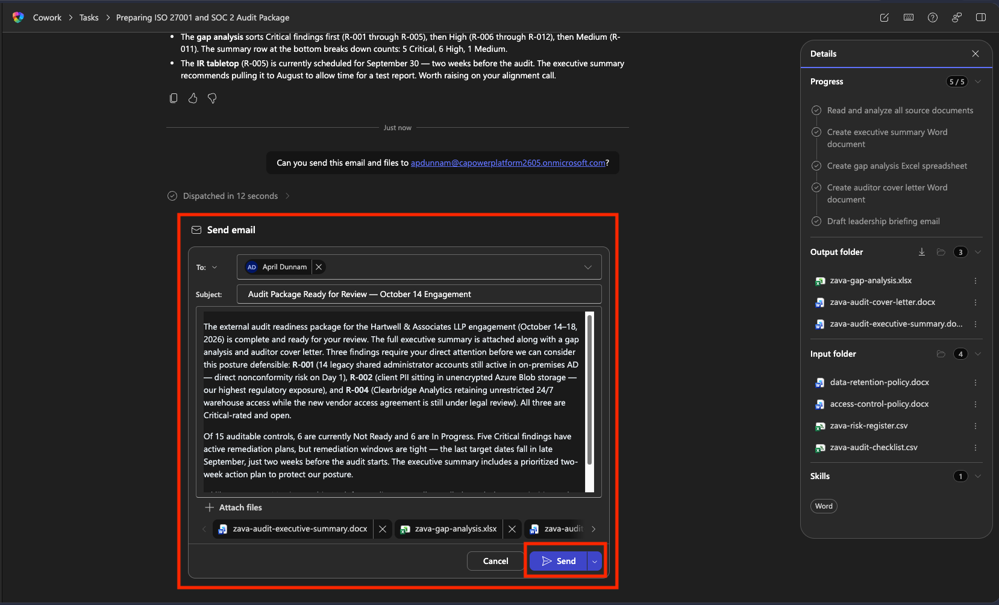

    > [!WARNING]
    > Once you **Approve**, the email is sent from your Outlook account to those recipients. For testing, please instruct Cowork to send the email to yourself so you can see the output and test that it was sent.

1. You'll get a confirmation in Cowork that the email was sent

    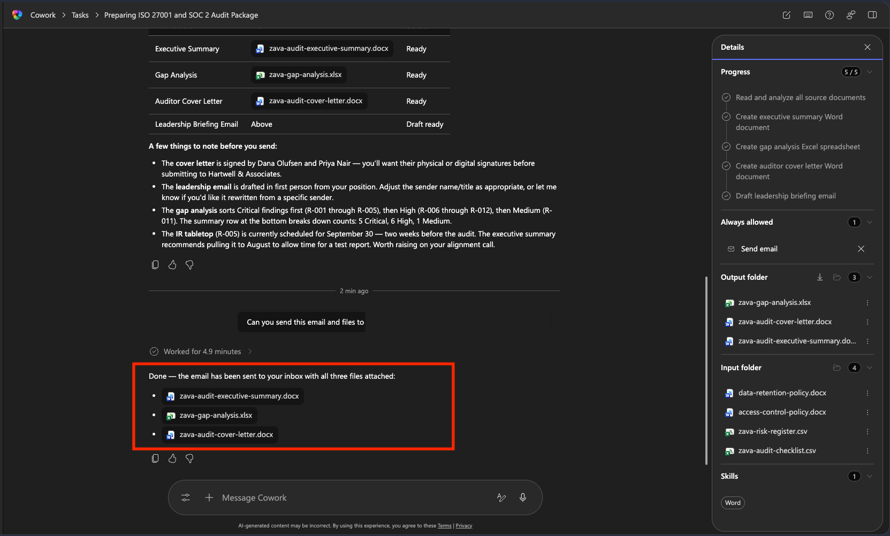

1. Check your email and review the email that was sent. For responsible AI purposes, it includes **Sent by Copilot Cowork** signature. It also included all of your attachments and marked the email as high importance.

    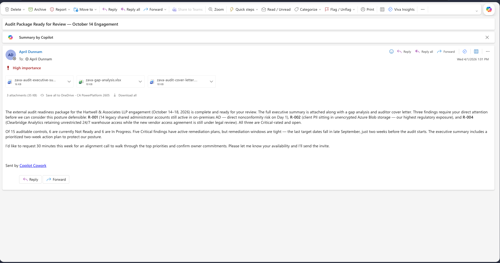

## 🏆 Mission Accomplished {#mission-accomplished}

**Operation By the Book is complete.** Four audit deliverables from one Cowork conversation.

What you saw in action:

✅ **Grounded output**: Cowork referenced actual Risk IDs, real policy versions, and named parties from your files.

✅ **One prompt, multiple documents**: You described the job once. Cowork handled cross-document coherence.

✅ **You approve before anything sends**: The email didn't go out until you read it, verified the Risk IDs, confirmed the recipients, and said go.

✅ **Fix in place, don't restart**: If anything was off, a targeted follow-up corrected it without regenerating everything.

## 🏅 Claim Your Badge {#claim-your-badge}

Congrats, agent — mission accomplished! If you'd like to claim your badge for completing this mission, please submit your badge request:

[https://aka.ms/cowork-collective/compliance-packet/form](https://aka.ms/cowork-collective/compliance-packet/form)

Once reviewed, you'll receive an email from Global AI Community with instructions to claim your badge.

## 📚 Related Content {#related-content}

- 📖 [Copilot Cowork overview — Microsoft Learn](https://learn.microsoft.com/copilot/microsoft-365/cowork/)
- 🚀 [Join the Microsoft 365 Copilot Frontier program](https://adoption.microsoft.com/copilot/frontier-program/)

<!-- markdownlint-disable-next-line MD033 -->
<analytics-tag section="cowork-collective" mission="compliance-packet" />
