---
tags:
  - automation
difficulty: 1
time: 20
description: >-
  Use Copilot Cowork to handle your entire out-of-office handoff — emails,
  meeting reschedules, and delegate setup — in one conversation.
section: cowork-collective
badge: ../assets/Vacay-badge.png
products:
  - microsoft-365-copilot
  - copilot-cowork
  - outlook
---
# 🏖️ Out of Office Vacation Handoff

<!-- markdownlint-disable MD033 -->
<mission-meta />
<!-- markdownlint-enable MD033 -->

<!-- markdownlint-disable-next-line MD033 -->
<p align="center">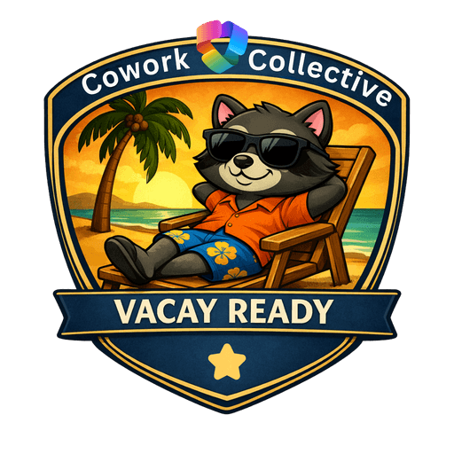</p>

**Welcome, agent.** Your mission — should you choose to accept it — is **Operation Clean Getaway**: hand off your entire out-of-office departure checklist to Copilot Cowork in a single conversation, and walk away knowing nothing will fall through the cracks while you're gone.

## 🔍 The Problem {#the-problem}

Taking time off is supposed to be relaxing. The prep work is anything but. Most people end up writing a hasty OOF message five minutes before they leave, declining meetings on their phone from the airport, and leaving teammates to guess who's covering what.

Prepping for out-of-office typically involves:

- Drafting an OOO auto-reply in Outlook settings
- Going through your calendar event by event to decline or delegate
- Typing up a handoff summary doc from scratch
- Sending a "I'm going OOO" Teams message to your team
- Doing all of this while your brain is already on vacation

Copilot Chat can help you *draft* any one of those things. But you still have to copy-paste between apps, remember each step, and do it all yourself.

Cowork handles the whole sequence. You describe the outcome ("I'm going on vacation for a week, get me ready"), and it builds a plan, works through each step, and asks for your approval before anything gets sent or changed.

## 📋 What You'll Produce {#what-youll-produce}

By the end of this mission, Cowork will have:

- ✅ Set your Outlook OOF auto-reply (with your approval)
- ✅ Proposed calendar actions for your upcoming meetings (decline, delegate, or reschedule)
- ✅ Drafted a Teams message to your team summarizing who's covering what
- ✅ Given you a step-by-step audit trail of everything it did

## ⚙️ Prerequisites {#prerequisites}

Before starting this mission, confirm you have:

- **Microsoft 365 Copilot license**: required to access Copilot Cowork ([learn more](https://learn.microsoft.com/copilot/microsoft-365/microsoft-365-copilot-licensing))
- **Microsoft 365 license**: required for Outlook, Teams and Microsoft Planner integration
- **Anthropic models enabled on your tenant**: Copilot Cowork relies on Anthropic models. Ensure your admin has enabled them in the [Microsoft 365 admin center](https://admin.microsoft.com/)
- **Microsoft 365 Copilot Cowork access** via the [Microsoft 365 Frontier program](https://adoption.microsoft.com/copilot/frontier-program/)

## 📝 A Note on Real Data vs. Seed Data {#real-data-vs-seed-data}

Cowork works best when it reads your actual M365 environment (your real emails, your real tasks, your real calendar). If you run this lab with in-flight work, the output will be specific and immediately useful.

If you're in a demo tenant or a clean environment, the seed data in Task 1 gives Cowork something realistic to work with. The tasks and emails are designed to include overdue items, at-risk deadlines, and things that are easy to forget about.

## 🎯 The Scenario {#the-scenario}

You're a project manager at **Zava**, a mid-size technology consulting firm. You're heading out on a week of vacation **Monday through Friday**. It's Thursday afternoon and you have about 30 minutes before you leave for the day. You have active projects, meetings on your calendar next week, and a team of people who need to know what's happening while you're gone.

You're going to hand the entire departure checklist to Cowork and walk out the door.

## 🌱 Lab 1.1 - Seed Your M365 Environment {#lab-1-seed-environment}

> [!NOTE]
> **Skip this task and go straight to Task 2 if you have real in-flight work and data to use.**

This task sets up realistic data across four M365 surfaces (Planner, Outlook, Teams, and your calendar) that Cowork will discover. The more you complete, the richer its output will be.

### ✅ 1.2 - Add Tasks to Microsoft Planner (or To Do) {#lab-1-2-add-tasks}

Add these 8 tasks to a Planner plan called **Zava PM Tasks** (create it if it doesn't exist), or to Microsoft To Do if you don't have Planner. Use the exact titles and due dates shown, they're designed so some fall during your OOO week, some are already overdue, and some are due right after you return.

> [!NOTE]
> For due dates: "OOO Monday" means the Monday you'll be out. "OOO Wednesday" is that Wednesday. "Return +1" is the Tuesday after you're back. Set dates relative to next week.

| Task Title                                                   | Due Date      | Priority | Notes to add                                                 |
| ------------------------------------------------------------ | ------------- | -------- | ------------------------------------------------------------ |
| Send revised project timeline to Morgan Connors — Clearwater | OOO Monday    | Urgent   | Morgan is waiting on this. Was supposed to go out last Friday. |
| Review and approve Phase 3 kickoff deck — Northgate          | OOO Tuesday   | High     | Priya needs sign-off before she presents Thursday            |
| Submit Q4 resource forecast to finance                       | OOO Wednesday | High     | Finance deadline — cannot slip. |
| Follow up on open contract renewal — Summit Financial        | OOO Thursday  | Medium   | Legal is waiting on my approval email to proceed             |
| Compile UAT feedback summary — Summit Financial              | OOO Friday    | High     | Jordan Lee is handling UAT but needs my summary template first |
| Complete compliance training (annual)                        | OOO Wednesday | Medium   | Overdue by 3 days already. System will auto-flag at 7 days.  |
| Draft agenda for May all-hands                               | Return +1     | Medium   | Priya needs it by end of first day back                      |
| Update project risk log — Clearwater                         | Return +2     | Low      | Add budget overrun flag before next steering committee       |

> [!TIP]
> You don't need to add all 8. Even 4 or 5 tasks gives Cowork enough to surface meaningful at-risk items.

### 📧 1.3 - Create Draft Emails in Outlook {#lab-1-3-draft-emails}

Create these 3 emails in your **Outlook Drafts folder**. Do not send them and leave them as drafts. Cowork will find them and flag them as "should go out before you leave."

**Draft 1:**

- **To:** your own email
- **Subject:** Revised Project Timeline — Clearwater Health Intranet
- **Body:** Hi Sandra, Apologies for the delay on this. Attached please find the revised project timeline reflecting the two-week extension following the content freeze. Key dates: content approvals due May 9, development complete May 23, UAT May 26–30, go-live June 6. Let me know if you have any questions. Best, Alex

**Draft 2:**

- **To:** your own email
- **Subject:** Contract Renewal — Approval to Proceed
- **Body:** Hi Raj, Following up on the contract renewal discussion from last week. I'm confirming approval to proceed with the terms as discussed. Please loop in legal on both sides to finalize paperwork. Target signature date: May 15. Thanks, Alex

**Draft 3:**

- **To:** your own email
- **Subject:** Q2 Resource Forecast — Draft for Review
- **Body:** Priya — attached is the Q2 resource forecast for your review before I submit to finance. I've flagged two items that need your input: the Clearwater contract extension adds 0.5 FTE through June, and I've penciled in one new hire for Q3 but that needs sign-off. Can you review by EOD tomorrow? Submitting Wednesday. — Alex

### 💬 1.4 - Plant a Teams Thread {#lab-1-4-teams-thread}

In any Teams channel you use (or create a channel called **Zava PM Team** for this lab), post the following message as yourself. This simulates an unresolved thread that needs a response before you leave.

**Post this message in Teams:**

> Quick question for the group — did we ever get final sign-off on the Phase 3 budget? I thought Dana was going to confirm last week but I don't see anything in my email. Need to know before the scope review Thursday.

Leave it unanswered. Cowork will find it and flag it as an open item.

### 📅 1.5 - Add Calendar Events {#lab-1-5-add-events}

Add these 5 meetings to your Outlook calendar for **next Monday through Friday**. Replace the attendee names with real people from your organization, or use your own email for all attendees if in a demo tenant.

| Day       | Time              | Title                               | Who                           |
| --------- | ----------------- | ----------------------------------- | ----------------------------- |
| Monday    | 10:00–10:30 AM    | Clearwater Health — Weekly Check-In | You + client contact          |
| Tuesday   | 9:00–9:30 AM      | Phase 3 Scope Review    | You + Priya + Marcus          |
| Wednesday | 3:00–3:30 PM      | Summit Financial — UAT Review       | You + Jordan + client contact |
| Thursday  | 2:00–3:00 PM      | 1:1 with Priya Nair                 | You + Priya                   |
| Friday    | 11:00 AM–12:00 PM | Zava PM Team Retrospective          | You + full PM team            |

> [!WARNING]
> **Replace all attendee names and emails with real people from your organization** before adding these events. Cowork will draft decline and delegation messages to these attendees. Fictional email addresses will bounce.

### 🗓️ 1.6 - Add a PTO Block to Your Calendar {#lab-1-6-add-calendar-block}

This is the event Cowork's scheduled automation will eventually detect.

- **Title:** [Insert Your Name] PTO — Out of Office
- **Date:** Next Monday through Friday (all day, marked as Out of Office)
- **Notes:** Returning [following Monday]. Will not have access to email.

## 🔎 Lab 2 - Cowork Discovery {#lab-2-cowork-discovery}

Here, you're not telling Cowork what your projects are. You're asking it to look across your M365 data and find out. Start with a discovery of what you need to wrap up before you go out of office.

1. Navigate to [m365.cloud.microsoft](https://m365.cloud.microsoft) or open the **Microsoft 365 Copilot** desktop app
1. In the left sidebar under **Agents**, select **Cowork**

    

    > [!NOTE]
    > If you don't see Cowork, select **All agents** and search for it. If it still doesn't appear, your account may not have Frontier access (check with your admin).

1. Do **not** attach any files. You want Cowork to read your live M365 data (email, calendar, tasks, Teams, etc). Copy and paste this prompt and send it:

```text
I'm going on vacation next Monday through Friday. Before we set anything 
up, I need you to look across my work and give me a complete picture of what I have at risk.

Please search across:
- My Outlook email — any unanswered threads, pending replies, or emails 
  sitting in my Drafts folder that haven't been sent
- My calendar — any meetings scheduled during my OOF week that need 
  a decision (decline, delegate, or reschedule)
- My Planner and To Do tasks — any tasks due during my OOF week or 
  within 3 days of my return, especially anything overdue or unassigned
- My recent Teams conversations — any open questions or unresolved 
  threads I'm part of that could become problems while I'm gone

Organize what you find into three categories:
🔴 MUST HANDLE BEFORE I LEAVE — things that will become problems if not addressed in the next 24 hours
🟡 NEEDS DELEGATION — things that are in flight and someone needs to own while I'm out
🟢 CAN WAIT — things that are safe to leave until I return

Do not take any action yet. Just show me the full picture first.
```
  
  > [!NOTE]
  > The phrase "Do not take any action yet" is important. It keeps this as a pure discovery pass you see everything Cowork found before it starts executing anything.

  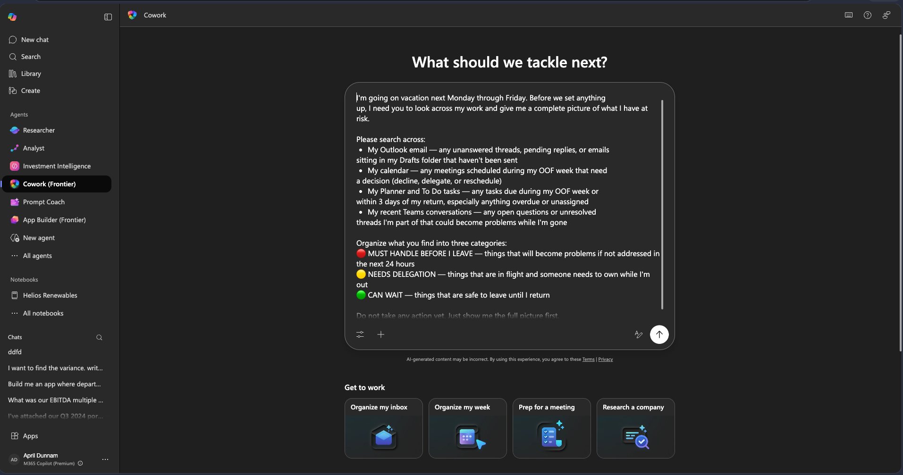

Cowork will come back with a structured risk report organized across your three categories. Review and ensure it returned all of the relevant results (either your real work items or the sample data you added in the previous step)

  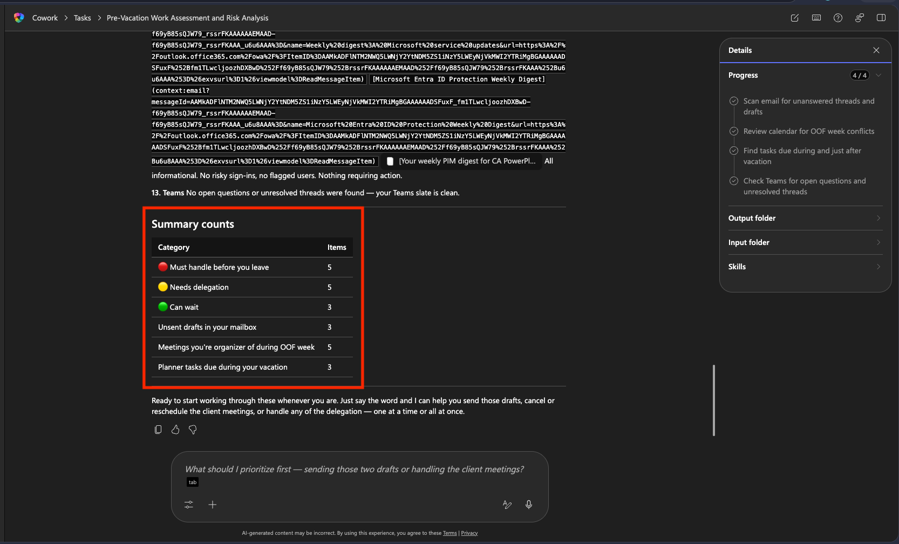

> [!TIP]
> Did Cowork find something you forgot about? The discovery pass catches things that slip through the cracks because they're scattered across too many places. If something is missing, prompt Cowork to look again.

## ▶️ Lab 3.1 - Execution {#lab-3-execution}

Now that you have the full picture, it's time to hand Cowork the action items.

1. Send in the following prompt:

    ```text
    That looks right. Go ahead and handle everything. Show me anything before it goes out, and get my approval before sending or posting anything.
    ```

1. Cowork will show you a structured plan, then execute step by step, pausing for your approval before each action. It will find your draft emails and ask for permission to send those.  Select the **Send as is** option here to take care of that.

    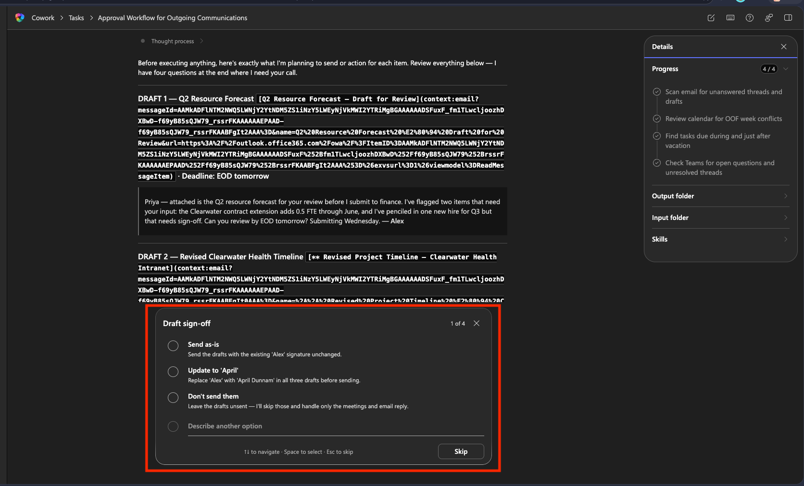

    > Note
    > If something needs changing, make the change inline in the card or reject and redirect Cowork on what you want to change. It will make the changes and reply with a new approval card.

1. For the conflicting meetings it found, it will ask you if you want to cancel and reschedule, cancel outright or delegate.  Select **cancel outright**. Click Next.

    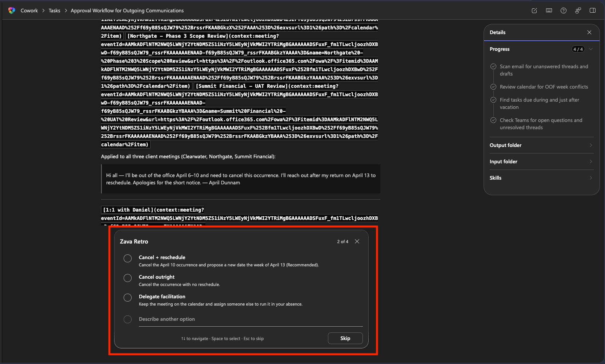

1. For the tasks that are due while you're out, Cowork will ask who you want to delegate those to and gives you a list of options from people on your team. Select someone from the list then click **Next**.

    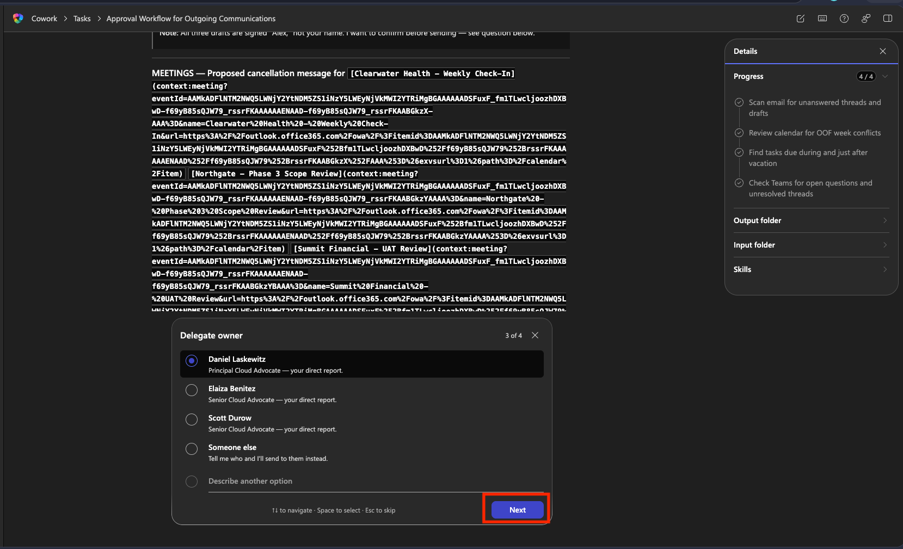

1. Cowork will use the person you designated to cover for you and draft an email listing all of the tasks you have and their due dates. Review this email and press **Send**.

    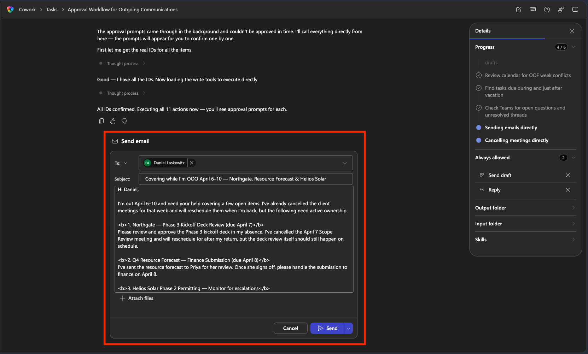

1. Cowork will then go through line by line and start cancelling your conflicting events. Review the draft messages and review the cancellation reason it drafted for you.

    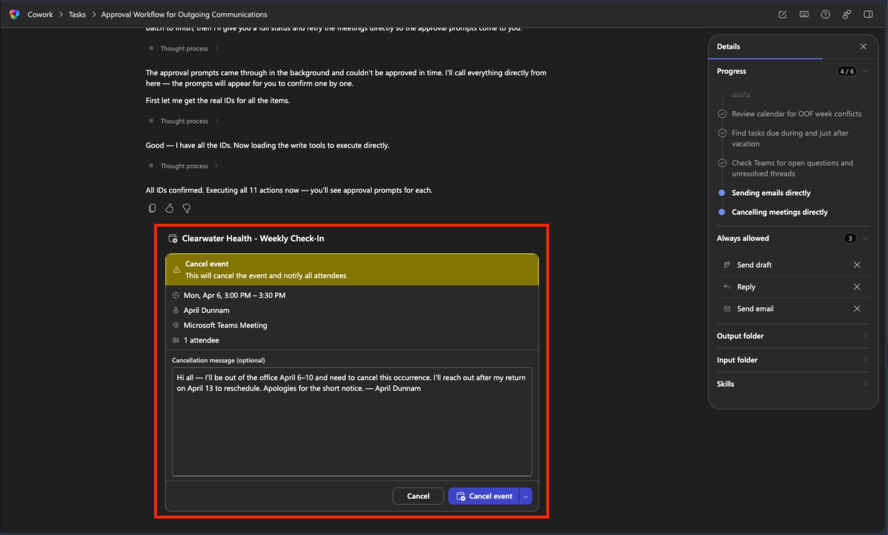

1. If you click the dropdown next to Cancel, you'll see an option for "always allow cancel event". This allows you to grant Cowork permission to perform this action without asking you for future events it finds in this process.

    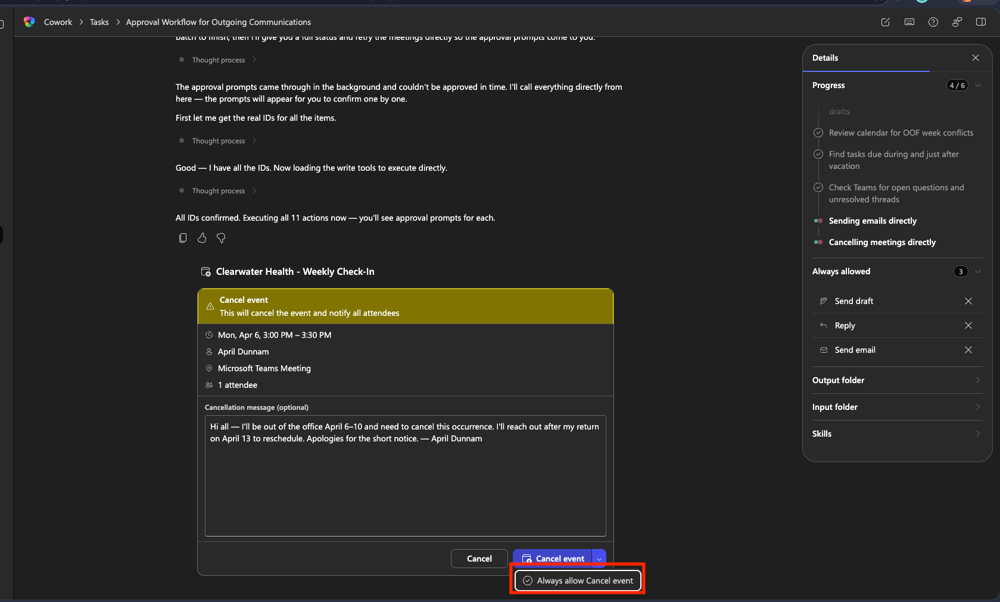

1. Now, Cowork will draft both an external and internal out of office message for you to review. Review the message, noticing the risk level and click **Approve** to set it up.

    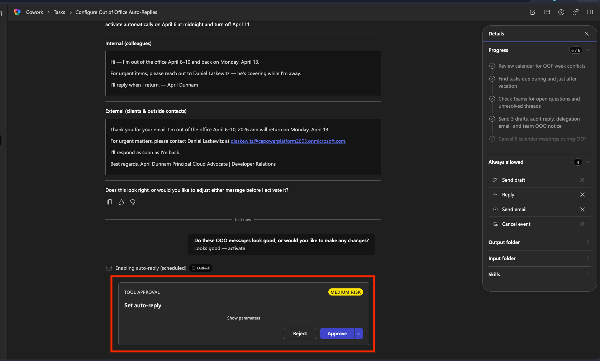

1. Once finished, Cowork will give you a recap summary of everything it did for you

    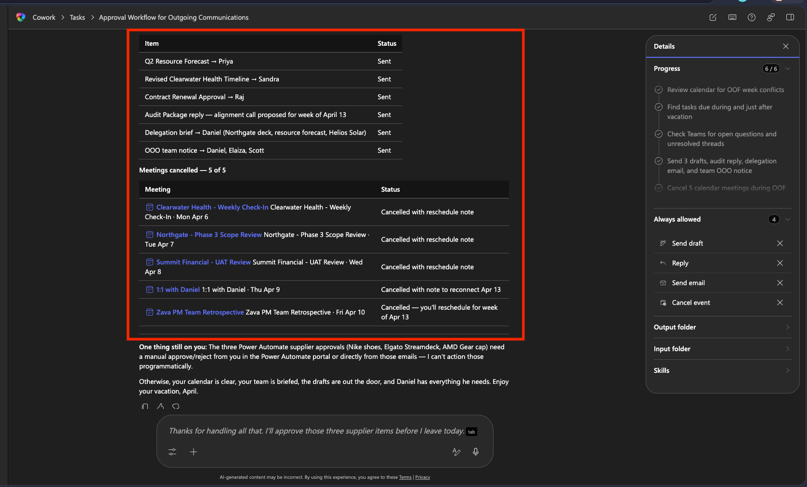

## ⭐ Bonus lab: Set Up the Automatic Two-Day Check {#bonus-lab-automated-check}

Now you can set it up to run on a schedule. Cowork checks your calendar every Monday morning. If it finds a PTO block starting within two business days, it kicks off the discovery pass and brings you the report.

1. In a **new Cowork conversation**, send this message:

```text
I'd like to set up a recurring scheduled check. Every Monday morning 
at 8:00 AM, please look at my calendar for the next week and 
check if I have any PTO, vacation, or out-of-office blocks starting 
within the next two to three business days.

If you find a PTO block starting within two business days, I need you to look across my work and give me a complete picture of what I have at risk.

Please search across:
- My Outlook email — any unanswered threads, pending replies, or emails 
  sitting in my Drafts folder that haven't been sent
- My calendar — any meetings scheduled during my OOF week that need 
  a decision (decline, delegate, or reschedule)
- My Planner and To Do tasks — any tasks due during my OOF week or 
  within 3 days of my return, especially anything overdue or unassigned
- My recent Teams conversations — any open questions or unresolved 
  threads I'm part of that could become problems while I'm gone

Organize what you find into three categories:
🔴 MUST HANDLE BEFORE I LEAVE — things that will become problems if not addressed in the next 24 hours
🟡 NEEDS DELEGATION — things that are in flight and someone needs to own while I'm out
🟢 CAN WAIT — things that are safe to leave until I return

If you find no upcoming PTO: do nothing and don't notify me.

Please set this up as a recurring scheduled prompt.
```

  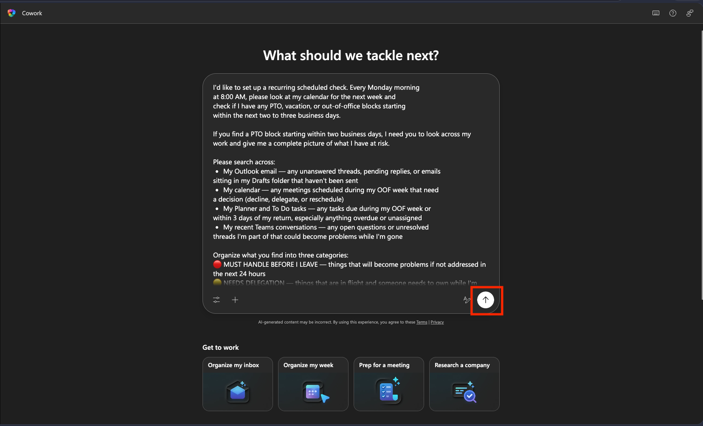

1. Cowork will give you an approval panel to review the scheduled automation. Make sure it has everything you need and click **Activate and run.** This will run the scheduled task now so you can verify the output.

  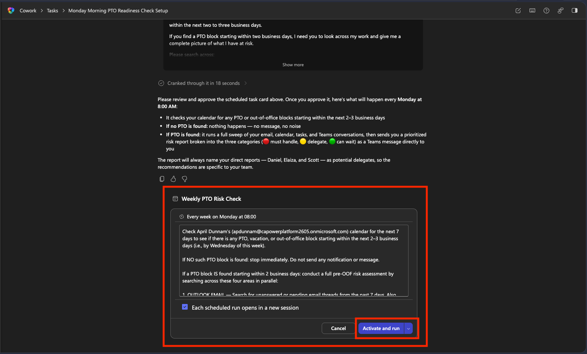

1. Watch as Cowork runs through all of your items to gather the risk check. In the Details panel you'll see there is a new "Scheduled" header with Active set to On, letting you know this is a recurring automation.
1. Since this is something you want to run automatically, when it asks about sending the assessment in Teams, select "Always allow post message" so it won't keep asking you before it sends.

  

1. Review the results. Your scheduled task will run every Monday morning from here on out.

## 🏆 Mission Accomplished {#mission-accomplished}

**Operation Clean Getaway is complete!**

What you built:

✅ **Discovery before execution**: Cowork scanned your live M365 environment and surfaced at-risk items without you compiling anything manually.

✅ **Approval at every step**: Nothing was sent, posted, or modified without your sign-off.

✅ **Automatic Monday check**: Every Monday morning, Cowork checks your calendar. If you have PTO coming up, it runs the discovery report on its own.

✅ **A reusable pattern**: The discovery-first prompt and the scheduled check work for any recurring personal workflow, not just OOO prep.

## 🏅 Claim Your Badge {#claim-your-badge}

Congrats, agent — mission accomplished! If you'd like to receive a badge, please submit your badge request here:

[https://aka.ms/cowork-collective/ooo-prep/form](https://aka.ms/cowork-collective/ooo-prep/form)

## 🏷️ Tags {#tags}

**Technology**: copilot-cowork, microsoft-365
**Industry**: general  
**Difficulty**: ⭐ (1 star — Beginner)

## 📚 Related Content {#related-content}

- 📖 [Copilot Cowork overview — Microsoft Learn](https://learn.microsoft.com/copilot/microsoft-365/cowork/)
- 🚀 [Join the Microsoft 365 Copilot Frontier program](https://adoption.microsoft.com/copilot/frontier-program/)

<!-- markdownlint-disable-next-line MD033 -->

