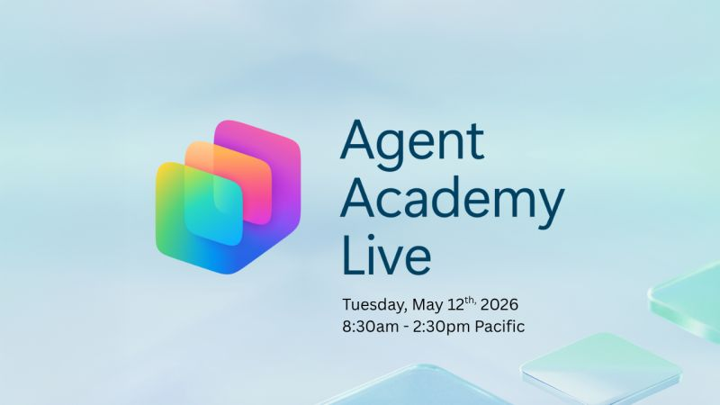

# Agent Academy Live

**May 12, 2026 | 8:30 AM – 2:30 PM PT**
Virtual, Free

Agent Academy Live is a one-day virtual conference designed to help developers, builders, and architects move from their first agent to production-ready solutions. Join Microsoft engineers, product leaders, MVPs, and community members for practical sessions on real agent patterns, governance, and architecture.

<action-button href="https://aka.ms/agent-academy-live/register" label="Register Now" icon="👉" />

::: tip Can't Attend Live?
Register to get the recordings even if you can’t attend live.
:::

## 📺 Watch Live

*The stream will kick off at 8:30am PT, Tuesday, May 12th, 2026.*

<!-- markdownlint-disable -->

  <iframe
    src="https://www.youtube.com/embed/KHJfukNZFUg"
    style="position: absolute; top: 0; left: 0; width: 100%; height: 100%;"
    frameborder="0"
    allow="accelerometer; autoplay; clipboard-write; encrypted-media; gyroscope; picture-in-picture"
    allowfullscreen>
  </iframe>

<!-- markdownlint-enable -->

## Who Should Attend

This event is built for:

- Builders and developers working with Microsoft Copilot Studio
- Solution architects designing AI-powered systems
- IT professionals evaluating agent platforms and governance
- Anyone who wants practical, real-world guidance for building agents
  that can actually ship to production

## 📅 Schedule

All times Pacific Time (PT).

<!-- markdownlint-disable-next-line MD033 -->
<SessionSchedule />

## Get Ready

New to Copilot Studio agents? Get up to speed with the
[Agent Academy curriculum](https://aka.ms/agent-academy) before the event
so you can hit the ground running.

## Register

Space is free and open to everyone. Register on Microsoft Reactor to
get the stream link, event reminders, and links to watch on demand.

<action-button
  href="https://aka.ms/agent-academy-live/register"
  label="Register Now"
  icon="👉"
/>

## Hack

Keep learning after the event and win prizes by participating in our
Agent Academy Hackathon May 12th - June 2nd!

<action-button
  href="https://aka.ms/agent-academy-hack"
  label="Learn More"
  icon="👉"
/>
