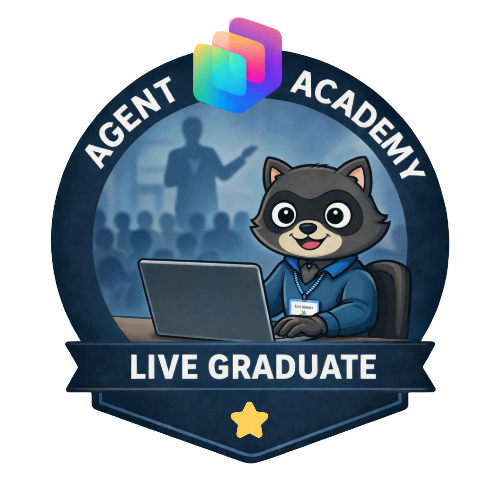
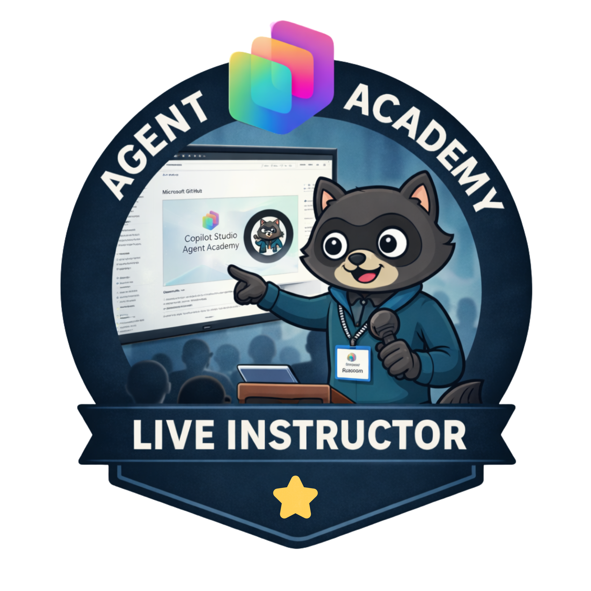

# Workshops

Bring Agent Academy to your team or your stage.

Agent Academy isn't just a self-paced curriculum, it's designed to be delivered live. Whether you're an MVP or community speaker running a conference workshop, or an organization looking to upskill your team, everything you need is here.

::: info 🎤 For speakers & MVPs
Take the Agent Academy curriculum to your next conference session or community event. The material is structured, hands-on, and built to be delivered.
:::

::: info 🏢 For organizations
Run Agent Academy as an internal workshop for your team. Get your developers, makers, and IT pros building real agents together with a facilitator guiding the way.
:::

::: info 🤝 Better together
Live delivery changes the learning dynamic. Questions get answered in real time, peers learn from each other, and teams leave with shared context and working agents.
:::

## Workshop schedule

Agent Academy workshops happening around the world, delivered by MVPs and community speakers. Want to add yours? [Get in touch.](mailto:poweradvocates@microsoft.com?subject=Agent%20Academy%20Workshop%20Listing%20Request)

| Date | Event | Location | Facilitators | Status |
|------|-------|----------|--------------|--------|
| Apr 15, 2026 | [Color Cloud Workshop](https://colorcloud.rocks/) | Hamburg, Germany | Nick Doelman & Ulrikke Akerbæk | ✅ Completed |
| Jun 29, 2026 | [European Power Platform Conference](https://espc.tech/conference/eppc-2026/) | Copenhagen, Denmark | Nick Doelman & Ulrikke Akerbæk | 🟢 Upcoming |
| Oct 2, 2026 | [Scottish Summit](https://scottishsummit.com/) | Edinburgh, Scotland | April Dunnam, Mats Necker & Daniel Laskewitz | 🟢 Upcoming |
| Oct 30, 2026 | [Power Platform Community Conference](https://powerplatformconf.com/#!/) | Las Vegas, NV | Scott Durow & Sheila Shahpari | 🟢 Upcoming |

## 🏅 Free badges for your participants

When you deliver an official Agent Academy workshop, we provide free digital badges for everyone in the room, both participants and facilitators, issued through the [Global AI Community](https://globalai.community).

| | Badge | Who earns it |
|---|---|---|
| {width=100} | **Live Graduate** | Every participant who completes the workshop |
| {width=100} | **Live Instructor** | Facilitators who deliver an official Agent Academy workshop |

### How to get badges for your event

1. **Email us** at [poweradvocates@microsoft.com](mailto:poweradvocates@microsoft.com?subject=Agent%20Academy%20Workshop%20Badge%20Request) to let us know you're delivering an Agent Academy workshop
1. **We'll send you forms** to collect participant and facilitator details
1. **Badges are issued** through the [Global AI Community](https://globalai.community) platform so participants will need to create a free account to receive theirs

::: tip
Let us know about your workshop as early as possible so we can get the forms to you in time to distribute to participants on the day.
:::

## Facilitator resources

Everything you need to deliver Agent Academy as a live workshop.

<!-- markdownlint-disable-next-line MD033 -->
<WorkshopsPage />

## Deliver Recruit with Power Up

We've partnered with the **Microsoft Power Up Program** to offer the Agent Academy Recruit path as part of their platform, making it easier than ever to facilitate this training for your organization.

Power Up provides participants with a **ready-to-use environment** so you can skip the setup entirely:

- No need for participants to use their own Microsoft 365 tenant
- No extra licenses required
- Required lab data is pre-configured and ready to go
- Built-in **office hours** and **discussion forums** so participants have support if they get stuck

[👉 Learn more about the Power Up Program](https://aka.ms/powerup)

