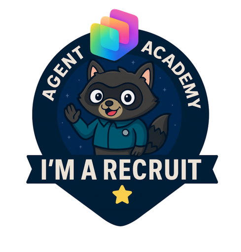
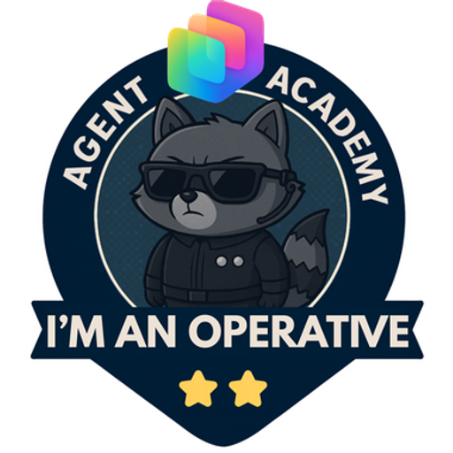
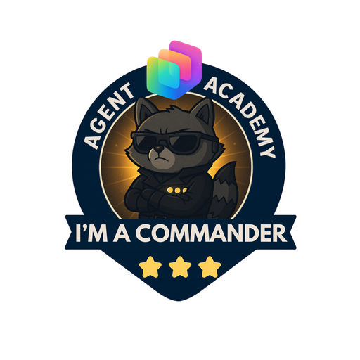

# Copilot Studio Agent Academy

**Welcome to Copilot Studio Agent Academy.**  

Your mission—should you choose to accept it—is to master the art of building agents using **Microsoft Copilot Studio**.

This hands-on training is your entry point into the **world of agents**: from grounded prompts to Adaptive Cards and agent flows, you'll learn how to build, scale, and deploy intelligent agents using real-world tools and use cases.

## 🏅 Rank Progression

The **Copilot Studio Agent Academy** is a multi-phase training program designed to build your skills across three agent ranks. Each level includes a badge and increasing responsibilities:

| Rank             | Level | Status                                                   | Visual                                                                            |
|------------------|:-----:|----------------------------------------------------------|-----------------------------------------------------------------------------------|
| 🟢 **Recruit**   | •     | [🚀 Get started](https://aka.ms/agent-academy-recruit)   | { width="300" }     |
| 🔵 **Operative** | ••    | [🚀 Get started](https://aka.ms/agent-academy-operative) | { width="300" } |
| 🟡 **Commander** | •••   | Coming Soon                                              | { width="300" } |

Each level builds on the last. Finish your Recruit mission, and stay tuned to level up your agent credentials.

## ⚠️ Before You Begin

### Progressive Difficulty

This training is designed to **increase in difficulty** as you progress. Each rank and each module within a rank builds on the last, introducing more advanced concepts and requiring deeper platform knowledge. **It is completely normal if you are unable to complete every module**. Go as far as your skills and environment allow, and come back when you're ready to tackle the next challenge.

### Environment & Licensing

**We do not provide environments for this training.** You are responsible for securing your own Microsoft 365, Power Platform and Copilot Studio environment.

We provide instructions for obtaining **free trials** (e.g., Microsoft 365 business tenant, Copilot Studio trial, Power Apps developer plan), but be aware:

- Trials have **time limits** and will eventually expire.
- After the trial period, a **paid license** is required to continue.

You are also welcome to use an **existing work or organizational account**, but your ability to complete certain modules depends on the features and permissions available in your environment.

For example:

- You need the ability to **upload and import solutions** into your environment.
- You need access to **Microsoft Dataverse**.
- For the MCP module, you need to be able to **join the Frontier program**.
- Some modules require **administrative permissions** to create agents and configure settings.

If a module requires a capability you don't have access to, you can **skip it** and move on, but keep in mind that many modules **build on previous ones**. Skipping a module may mean you're missing a dependency (like a solution, agent, or data) that later modules expect to be in place. You may be able to work around this, but in some cases it could block your progress on subsequent modules.

## 🎒 Other Courses

Looking to go deeper or explore related topics? Here are some recommended next steps:

- **Want to learn about other ways to build agents for Microsoft 365?** Check out [Copilot Developer Camp](https://microsoft.github.io/copilot-camp/), which covers building declarative agents, custom engine agents, and other extensibility patterns for Microsoft 365 Copilot.
- **Want to dive deeper into the Model Context Protocol (MCP)?** Explore [Model Context Protocol (MCP) for Beginners](https://github.com/microsoft/mcp-for-beginners) for a comprehensive introduction, or try the [Microsoft Copilot Studio <3 MCP Lab](https://aka.ms/mcsmcplab) for a hands-on walkthrough of connecting MCP servers to Copilot Studio.
- **Interested in the foundations of AI agents?** [AI Agents for Beginners](https://microsoft.github.io/ai-agents-for-beginners/) covers core concepts like agent design patterns, multi-agent systems, and agentic RAG from a broader, platform-agnostic perspective.

## 🚑 Issues

We really appreciate your feedback! Please use the [issues list](https://github.com/microsoft/agent-academy/issues) to share your comments and issues. Thanks!

## 📜 Code of Conduct

This project has adopted the [Microsoft Open Source Code of Conduct](https://opensource.microsoft.com/codeofconduct/).

> [!NOTE] Resources:
>
> - [Microsoft Open Source Code of Conduct](https://opensource.microsoft.com/codeofconduct/)
> - [Microsoft Code of Conduct FAQ](https://opensource.microsoft.com/codeofconduct/faq/)
> - Contact [opencode@microsoft.com](mailto:opencode@microsoft.com) with questions or concerns

[⭐️ Star our repo](https://github.com/microsoft/agent-academy){ .md-button .md-button--primary }

<!-- markdownlint-disable-next-line MD033 -->

