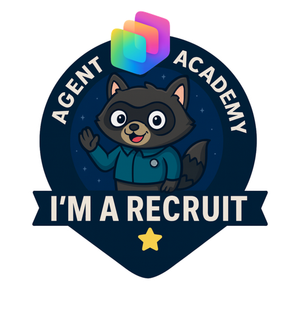
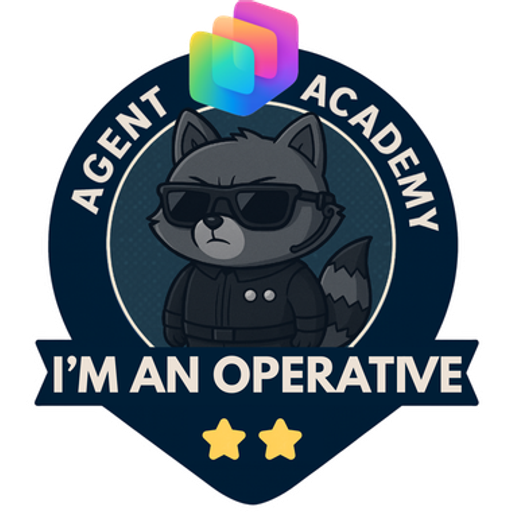

# Copilot Studio Agent Academy

**Welcome to Copilot Studio Agent Academy.**  

Agent Academy is a free, open-source training program for anyone who wants to build with Microsoft Copilot Studio or get more done with AI agents like Copilot Cowork.

If you're starting from zero, the curriculum tracks take you from "I've never touched Copilot Studio" to building production-ready agents with MCP integrations, multi-agent orchestration, and real automation.

If you already know the basics and want to go deep on something specific, the standalone labs let you jump straight to what matters, whether that's YAML, MCP servers, or Copilot Cowork use cases.

No fluff. No made-up scenarios. Just real tools, real patterns, and real agents.

## 🏆 Agent Academy Hackathon

**May 12 – June 2, 2026** · $12,000 in total prizes · Open to everyone

Apply what you've learned from Agent Academy to build real, working AI agents using Microsoft AI tools. Compete for prizes, earn recognition, and help shape the future of the Agent Academy curriculum.

<action-button href="./events/hackathon" label="Learn More" icon="🚀" />

## 🏅 Rank Progression {#rank-progression}

The **Copilot Studio Agent Academy** is a multi-phase training program designed to build your skills across three agent ranks. Each level includes a badge and increasing responsibilities:

| Rank             | Level | Status                                                                                         | Visual                                                                            |
|------------------|:-----:|------------------------------------------------------------------------------------------------|-----------------------------------------------------------------------------------|
| 🟢 **Recruit**   | •     | <action-button href="https://aka.ms/agent-academy-recruit" label="Get started" icon="🚀" />   | { width="300" }     |
| 🔵 **Operative** | ••    | <action-button href="https://aka.ms/agent-academy-operative" label="Get started" icon="🚀" /> | { width="300" } |
| 🟡 **Commander** | •••   | Coming Soon                                                                                    | { width="300" } |

Each level builds on the last. Finish your Recruit mission, and keep going to level up your agent credentials.

## 🎯 Special Ops {#special-ops}

**Special Ops** are standalone, one-off missions that focus on a specific topic or integration. These don't require completing any rank and can be tackled at any time, in any order. Think of them as side missions to sharpen a particular skill.
<action-button href="./special-ops/" label="View Special Ops" icon="🚀" />

## 🤝 Cowork Collective {#cowork-collective}

The **Cowork Collective** is a set of hands-on labs focused on **Copilot Cowork** inside M365 Copilot. It provides a new way to delegate work to Copilot so it can take action on your behalf across your Microsoft 365 environment. These missions are independent from the rank progression and can be completed at any time.

<action-button href="./cowork-collective/" label="View Cowork Collective" icon="🚀" />

## ⚠️ Before You Begin {#before-you-begin}

### Progressive Difficulty

This training is designed to **increase in difficulty** as you progress. Each rank and each module within a rank builds on the last, introducing more advanced concepts and requiring deeper platform knowledge. **It is completely normal if you are unable to complete every module**. Go as far as your skills and environment allow, and come back when you're ready to tackle the next challenge.

### Environment & Licensing

**We do not provide environments for this training.** You are responsible for securing your own Microsoft 365, Power Platform and Copilot Studio environment.

We provide instructions for obtaining **free trials** (e.g., Microsoft 365 business tenant, Copilot Studio trial, Power Apps developer plan), but be aware:

- Trials have **time limits** and will eventually expire.
- After the trial period, a **paid license** is required to continue.

You are also welcome to use an **existing work or organizational account**, but your ability to complete certain modules depends on the features and permissions available in your environment.

For example:

- You need the ability to **upload and import solutions** into your environment.
- You need access to **Microsoft Dataverse**.
- For the MCP module, you need to be able to **join the Frontier program**.
- Some modules require **administrative permissions** to create agents and configure settings.

If a module requires a capability you don't have access to, you can **skip it** and move on, but keep in mind that many modules **build on previous ones**. Skipping a module may mean you're missing a dependency (like a solution, agent, or data) that later modules expect to be in place. You may be able to work around this, but in some cases it could block your progress on subsequent modules.

::: tip 🚀 Want a more guided experience?
Prefer not to deal with environment setup, trial licenses, or expiring tenants? The **Microsoft Power Up Program** offers the Agent Academy Recruit path on their platform with a pre-configured environment, office hours, and discussion forums if you get stuck. A great option whether you're an individual learner or running this as a team. Same curriculum, just on Power Up's platform.

[👉 Try it on Power Up](https://aka.ms/powerup)
:::

## 🎒 Other Courses {#other-courses}

Looking to go deeper or explore related topics? Here are some recommended next steps:

- **Want to learn about other ways to build agents for Microsoft 365?** Check out [Copilot Developer Camp](https://microsoft.github.io/copilot-camp/), which covers building declarative agents, custom engine agents, and other extensibility patterns for Microsoft 365 Copilot.
- **Want to dive deeper into the Model Context Protocol (MCP)?** Explore [Model Context Protocol (MCP) for Beginners](https://github.com/microsoft/mcp-for-beginners) for a comprehensive introduction.
- **Interested in the foundations of AI agents?** [AI Agents for Beginners](https://microsoft.github.io/ai-agents-for-beginners/) covers core concepts like agent design patterns, multi-agent systems, and agentic RAG from a broader, platform-agnostic perspective.

## 🚑 Issues {#issues}

We really appreciate your feedback! Please use the [issues list](https://github.com/microsoft/agent-academy/issues) to share your comments and issues. Thanks!

## 📜 Code of Conduct {#code-of-conduct}

This project has adopted the [Microsoft Open Source Code of Conduct](https://opensource.microsoft.com/codeofconduct/).

> [!NOTE] Resources:
>
> - [Microsoft Open Source Code of Conduct](https://opensource.microsoft.com/codeofconduct/)
> - [Microsoft Code of Conduct FAQ](https://opensource.microsoft.com/codeofconduct/faq/)
> - Contact [opencode@microsoft.com](mailto:opencode@microsoft.com) with questions or concerns

## ⭐️ Star our repo {#star-our-repo}

If you find this training useful, star our repository on GitHub!

<action-button href="https://github.com/microsoft/agent-academy" label="Star on GitHub" icon="⭐️" />

<analytics-tag section="index" />
