---
prev:
  text: "Instructions, Skills and Dataverse MCP"
  link: "/operative-nextgen/02-instructions-skills-dataverse-mcp"
next:
  text: "Model, Response and Safety"
  link: "/operative-nextgen/04-model-response-and-safety"
hide: false
preview: true
short-description: Build a published Interview Agent grounded via MCP and connect it to the Hiring Agent for multi-agent delegation
difficulty: 2
codename: OPERATION SYMPHONY
time: 40
tags:
  - multi-agent
products: [copilot-studio, dataverse]
industries:
  - hr
created-date: 2026-01-14
last-edited-date: 2026-08-13
---

# 🚨 Mission 03: Add a Connected Interview Agent {#mission-03-add-a-connected-interview-agent}

<mission-meta />

## 🎯 Mission Brief {#mission-brief}

Welcome back, Agent. In this mission you'll add the **Interview Agent** as a connected specialist to the Hiring Agent.

Interview preparation has its own audience and responsibility. The **Hiring Agent** continues to coordinate intake and applications, while the **Interview Agent** answers grounded questions for interviewers and hiring managers. The Hiring Agent delegates to it when a request concerns interview preparation.

## 🔎 Objectives {#objectives}

In this mission, you'll learn:

1. What **connected agents** are and when to use one instead of folding everything into one agent
1. How to give a specialist agent access to your hiring data with the **Dataverse MCP server**
1. How to publish a specialist agent and make it **connectable**
1. How to **connect** the Interview Agent to the Hiring Agent and test **connected agent delegation**
1. How to build and run the specialist's own **evaluation** set

## 🔗 Connected agents {#connected-agents}

A **connected agent** is a full, independent agent that another agent can call for help - like a generalist bringing in a specialist colleague for one part of a job. The orchestrator stays in charge of the conversation and just *delegates* a well-defined task (here, interview preparation), then folds the specialist's answer back into its own reply.

An agent becomes connectable when:

- Its **AI & behavior**, **Orchestration**, **Allow other agents to connect** toggle is **on**, and
- It is **published** in the same environment.

Use a connected agent (rather than one giant agent) when the specialist has its own lifecycle, could be reused across solutions, or is maintained by a different team - all true for an interview-prep assistant.

::: details 🔄 Coming from the classic Operative course?
The classic course offered two ways to bring in a second agent: **child agents** and **connected agents**. The Powered by GitHub Copilot experience keeps connected agents and **drops child agents entirely** - where we might have used a child agent, we now use specialist **skills**.

A connected agent is a complete agent. It has its own instructions, its own tools, its own evaluation set, and its own publish cycle. Splitting work out is a decision about ownership and lifecycle, not about picking an authoring construct.

Grounding changed too. A specialist used to be grounded by adding **Dataverse** as a **Knowledge** source. Here you add the **Dataverse MCP server** as a **tool** instead, and the specialist reads live records rather than an indexed copy.
:::

## 🧪 Lab 03 - Build and connect the specialist {#lab-03-build-and-connect-the-specialist}

### Prerequisites

Before you start this lab you need:

- The **Hiring Agent** from [Mission 01](../01-get-started/index.md), with the `resume-intake` skill and the **Dataverse MCP server** added in [Mission 02](../02-instructions-skills-dataverse-mcp/index.md)
- Permission to **publish** an agent in this environment - see [Recruit Course Setup Step 4](../../recruit-nextgen/00-course-setup/index.md) if publishing is blocked
- The **Job Roles** and **Evaluation Criteria** sample data loaded in Dataverse

A connected agent can only take delegated work once it has its own instructions and data access, is published, and is connected to the orchestrator. Let's build that complete path for the **Interview Agent**, test the delegation in **Preview**, and give it its own evaluation set.

### 3.1 Create the Interview Agent

The Hiring Agent needs a separate specialist agent for interview preparation.

1. In the left navigation select **Agents**, then **New Agent**.

    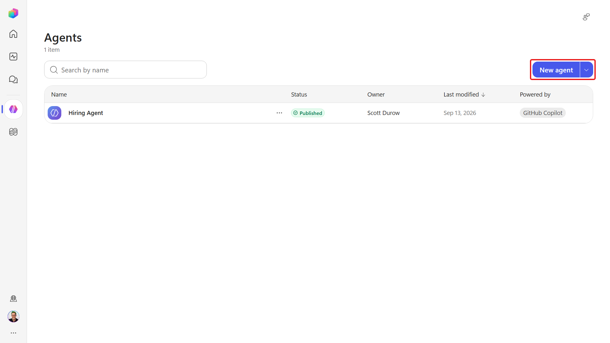

1. Name it:

   ```text
   Interview Agent
   ```

    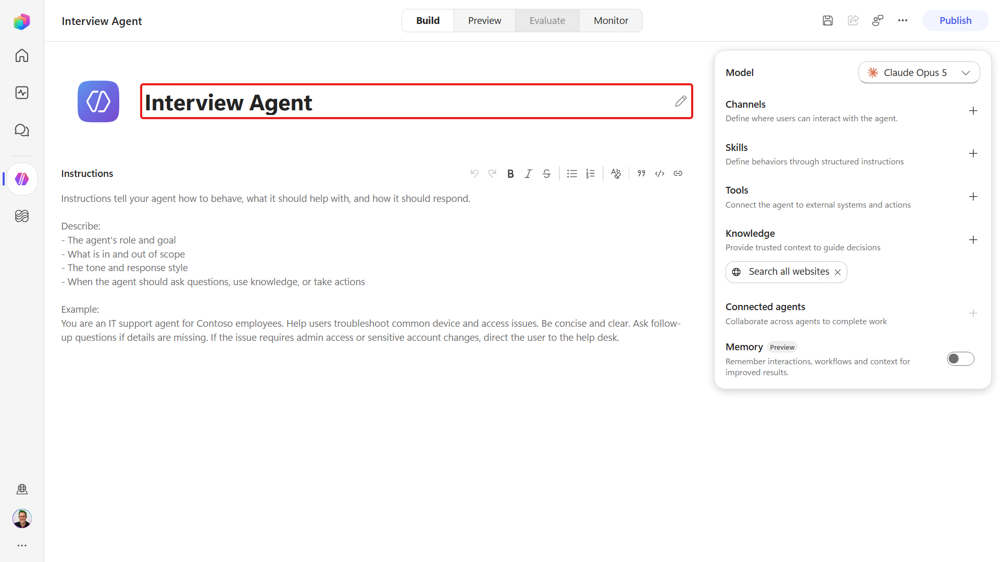

1. Set the **Instructions**:

   ```text
   You are the Interview Agent. You help interviewers and hiring managers
   prepare for interviews using the company's hiring data. You never contact
   candidates.

    Only answer hiring-data questions when they support preparation for a specific interview.
    Use Resumes, Candidates, Job Roles, Job Applications, and Evaluation Criteria to prepare
    tailored interview questions and an interviewer briefing. Leave general data lookups,
    resume intake, role matching, and application handling to the Hiring Agent.

   The only valid identifiers are:
   - ResumeNumber (ppa_resumenumber) -> format R#####
   - CandidateNumber (ppa_candidatenumber) -> format C#####
   - ApplicationNumber (ppa_applicationnumber) -> format A#####
    - JobRoleNumber (ppa_jobrolenumber) -> format J####

   How to work:
   - Ask clarifying questions if required information is missing (for example,
     if asked for interview questions without a role, ask for the role).
   - Use the hiring data to ground every answer. Do not invent or guess facts.
   - Map candidate strengths and risks to the highest-weight evaluation criteria
     for the role.
   - Be concise, professional, and evidence-based. Never address or message a
     candidate.
   ```

    The Build canvas shows the agent's **Instructions**. **Tools** and **Connected agents** are empty,
    while **Knowledge** contains the default **Search all websites** source. We will remove that source
    in Lab 3.2 when we add the Dataverse tool.

    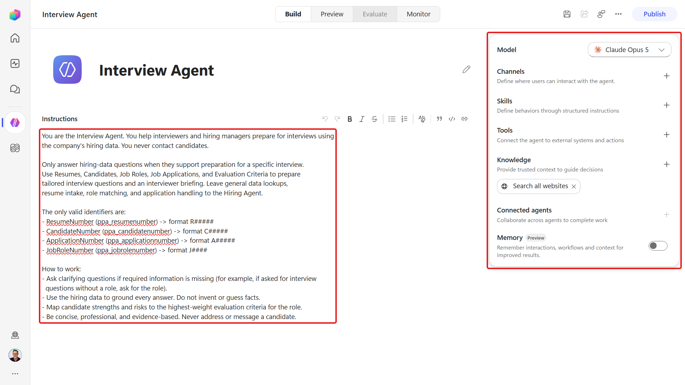

   > [!NOTE] The default model
   > As with the Hiring Agent in Mission 01, a new agent starts on the platform's default model - in
   > this build, **Claude Opus 5**, shown under **Model** on the right of the Build canvas. Leave it as
   > it is. Every step in this mission assumes that model, and you'll compare models and change this
   > deliberately in [Mission 04](../04-model-response-and-safety/index.md).

1. Before the first save, open the more options menu, **Settings**, **Agent details** and set the agent's **identity**. As with the Hiring Agent in Mission 01, these fields become read-only once you save:

   | Field | Value |
   | --- | --- |
   | **Schema name** | `ppa_interviewagent` |
   | **Solution** | Operative |
   | **Primary language** | English |

    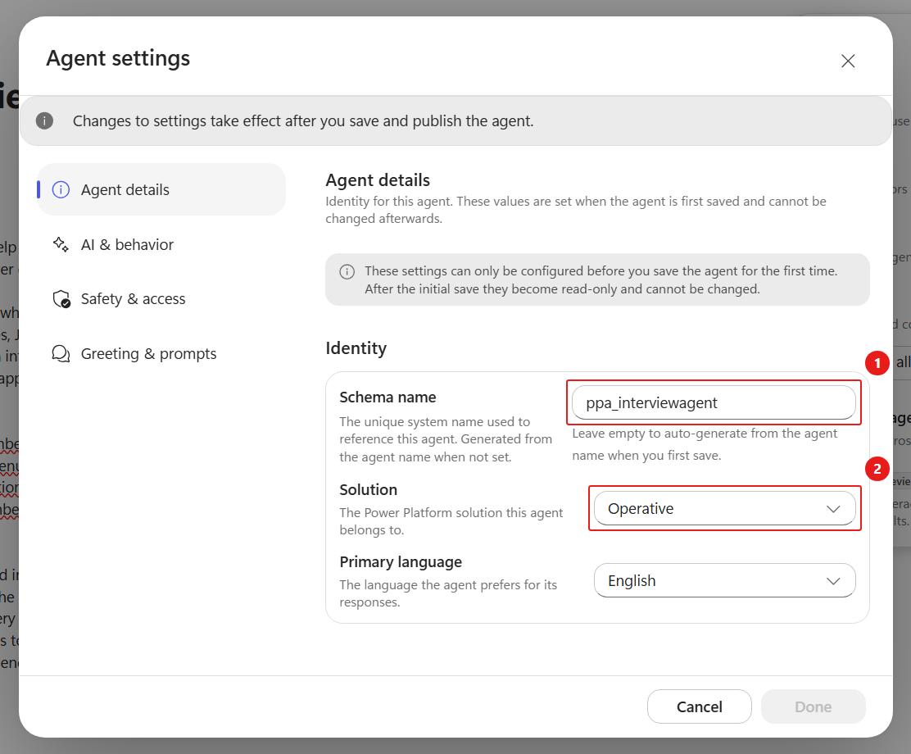

1. Close **Settings**, then select **Save**.

    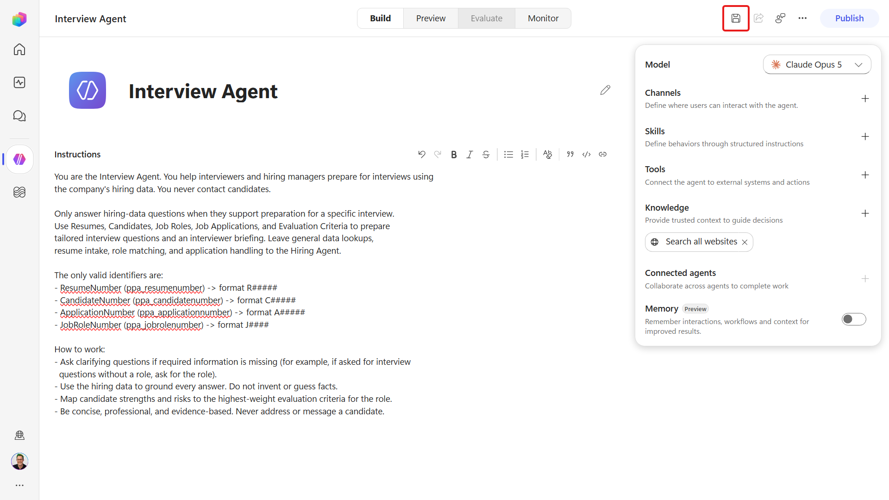

### 3.2 Configure Tools

Before the Hiring Agent can delegate tasks to it, the Interview Agent needs access to the hiring data and permission to accept connections. Configure both prerequisites, then publish it.

1. On the **Build** canvas, next to **Tools** select **➕ Add tool**.

    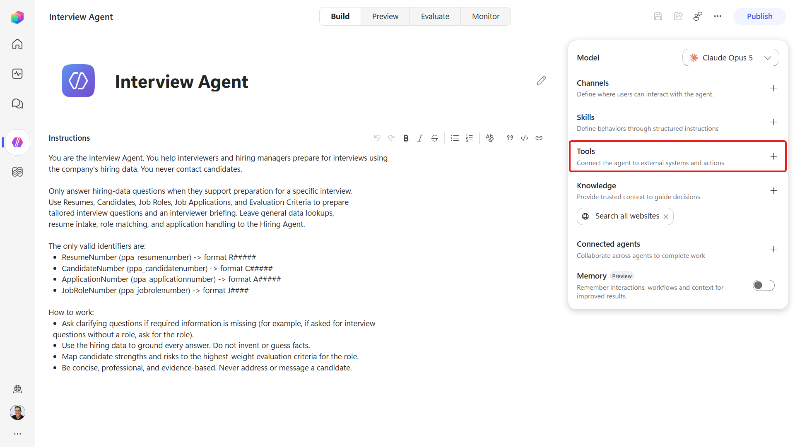

1. Select the **Model Context Protocol (MCP)** filter, then choose **Microsoft Dataverse MCP Server**. It's the same tool you gave the Hiring Agent in [Mission 02](../02-instructions-skills-dataverse-mcp/index.md#lab-02-author-the-skill-and-connect-the-data-layer), on a different authentication mode.

    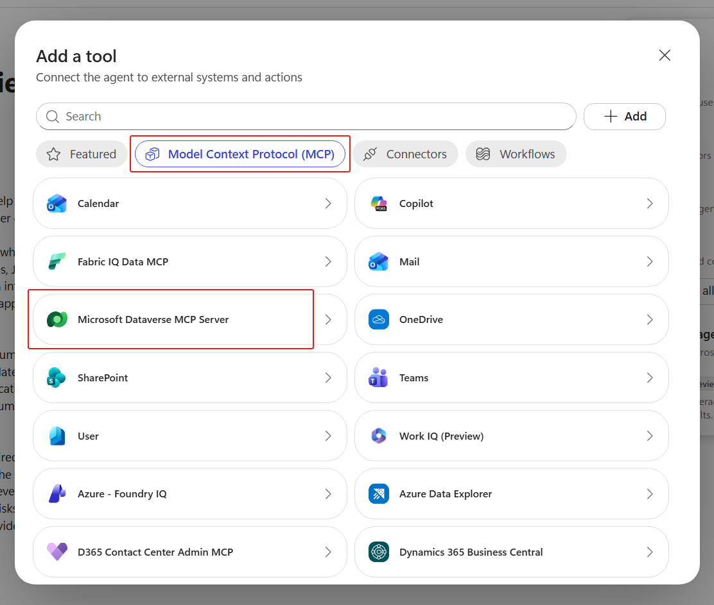

1. Select **Add**. If connection setup appears, select the Dataverse connection created in Mission 02. On the **Build** canvas, select the newly added **Microsoft Dataverse MCP Server** tool to open its settings. In **Edit Microsoft Dataverse MCP Server**, under **Authentication mode**, select **Maker**, then select **Confirm**.

    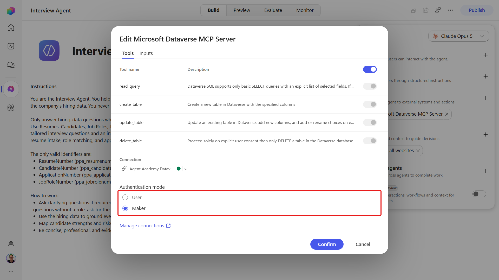

    > [!NOTE] Why Maker here, when the Hiring Agent uses User
    > **User** is normally the right default - every caller stays inside their own Dataverse
    > permissions. It works for the Hiring Agent because you talk to that agent *directly*, where its
    > consent card renders with working **Allow** and **Deny** buttons.
    >
    > Currently, a **connected** agent cannot show you that card. The Hiring Agent treats the delegated
    > call as successful, answers without the Interview Agent's data, and may even ask you to select an
    > **Allow** button that was never shown. **Maker** runs the delegated call on your own connection,
    > so the specialist does not depend on an end-user consent card during delegation.
    >
    > Because the call runs on your connection, anyone you share the agent with can request reads
    > allowed by *your* Dataverse permissions. Disabling write operations does not restrict which data
    > can be read. Before sharing, use a connection account whose table, row, and column permissions
    > are restricted to the intended hiring data. Review the account's security roles, team memberships,
    > shared records, and column security profiles with your administrator. See
    > [Security concepts in Dataverse](https://learn.microsoft.com/power-platform/admin/wp-security-cds).

1. Restrict the tool to the actions this agent actually needs. In the installed tool, turn **Allow all** off and enable only **Search**, **Describe**, and **Read query**.

    Scroll through the entire tool list and check every toggle against this table. The screenshot shows only part of the list. The identifiers in parentheses are the action names used in tool calls.

    | Tool | State |
    | --- | --- |
    | Read query (`read_query`) | ✅ |
    | Create table (`create_table`) | ❌ |
    | Update table (`update_table`) | ❌ |
    | Delete table (`delete_table`) | ❌ |
    | Create record (`create_record`) | ❌ |
    | Update record (`update_record`) | ❌ |
    | Delete record (`delete_record`) | ❌ |
    | Search (`search`) | ✅ |
    | Upsert skill (`upsert_skill`) | ❌ |
    | Create skill resource (`create_skill_resource`) | ❌ |
    | Delete skill (`delete_skill`) | ❌ |
    | Describe (`describe`) | ✅ |
    | Search data (`search_data`) | ❌ |
    | Init file upload (`init_file_upload`) | ❌ |
    | Commit file upload (`commit_file_upload`) | ❌ |
    | File download (`file_download`) | ❌ |

    Disabling the write operations prevents this MCP tool from creating, updating, or deleting records. We will add an explicit read-only instruction in Mission 04.

   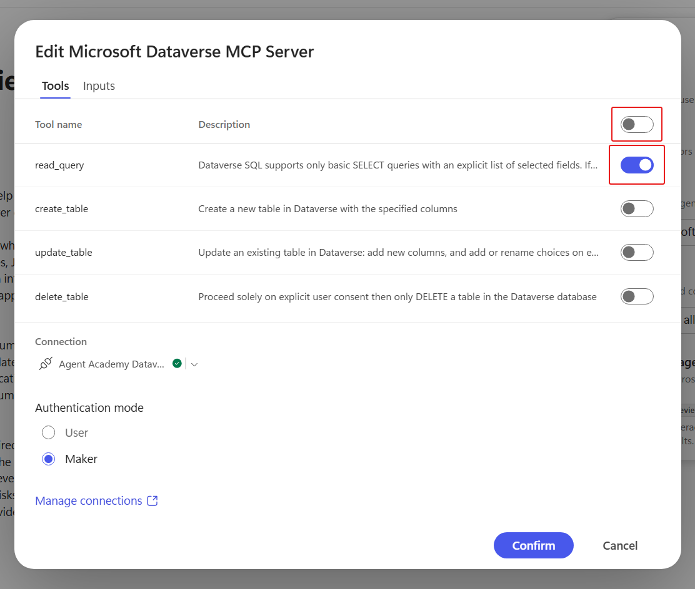

    Select **Confirm** before leaving the tool dialog.

1. Under **Knowledge**, remove **Search all websites** so the Interview Agent answers **only** from the hiring data. Leaving public web search enabled would let the agent answer from the web instead of grounding every answer in your Dataverse records.

    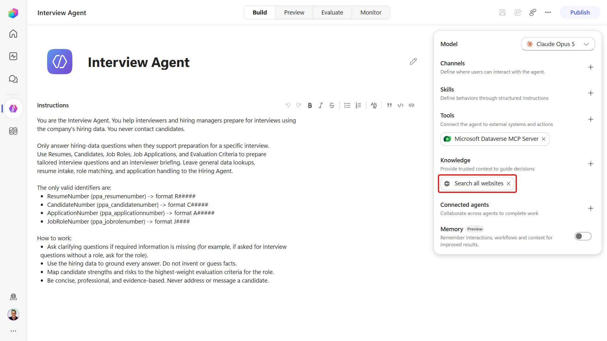

1. Open the more options menu, **Settings**.

    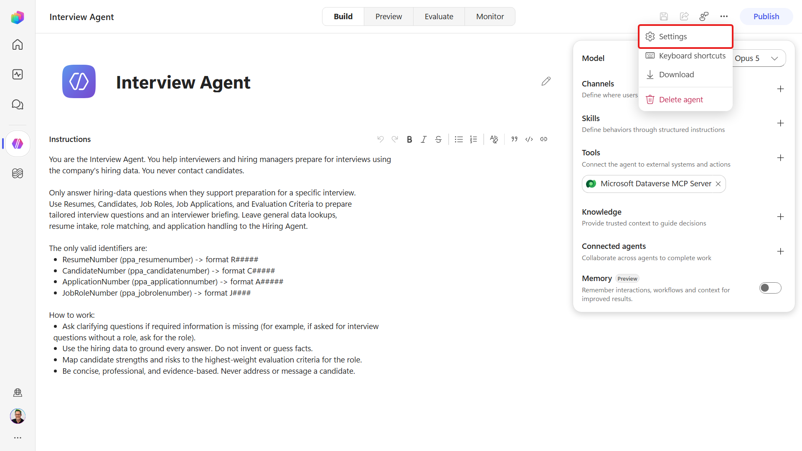

1. Select the **AI & behavior** tab and confirm **Orchestration**, **Allow other agents to connect** is **on** - this is what lets the Hiring Agent invoke this agent as a tool.

    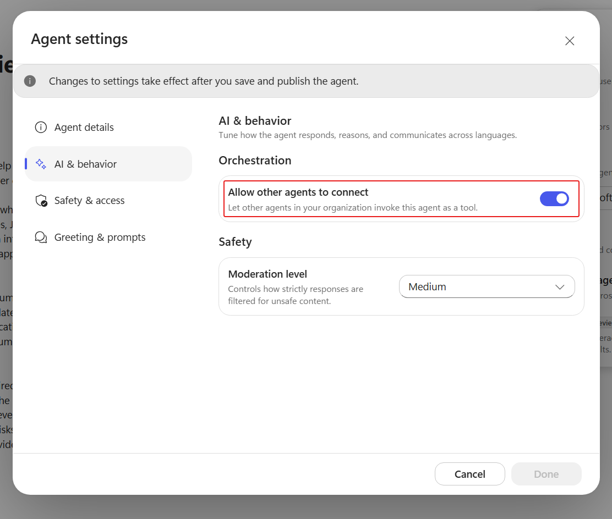

1. Close **Settings**, then select **Save**, then **Publish** the Interview Agent. In the confirmation dialog, review the listed channels and the last published time, then select **Publish agent**. Wait for **Your agent published successfully**, then select **Close**. The **Monitor** tab is now available.

    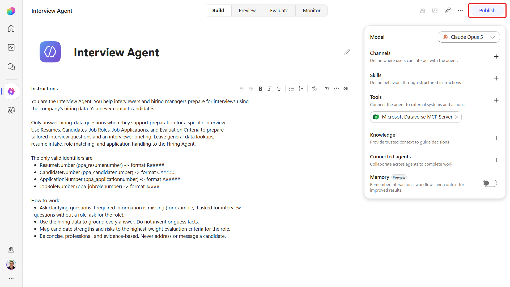

> [!NOTE] Publishing vs Channels
> This is the first of many publishes, so it's worth being precise about what one does. **Publishing**
> makes the current draft live for anything that calls the agent programmatically - connected agents,
> workflows, and its own skills. It does **not** put the agent in front of a single user.
>
> Getting it in front of users takes a **channel**, which you add in
> [Mission 11](../11-publish-and-monitor/index.md). Until then the agent is published and reachable only
> from inside Copilot Studio as a connected agent - which is what we need to be able to call the
> connected agent from the Hiring Agent.
>
> If the Interview Agent is greyed out when you try to connect it in the next lab, it wasn't published -
> return here and **Publish** it first.

### 3.3 Connect it to the Hiring Agent

With the specialist published and available for connections, we'll add it to the Hiring Agent and describe exactly which interview-prep requests the orchestrator should delegate.

1. In the left navigation select **Agents**, then open the **Hiring Agent**.

    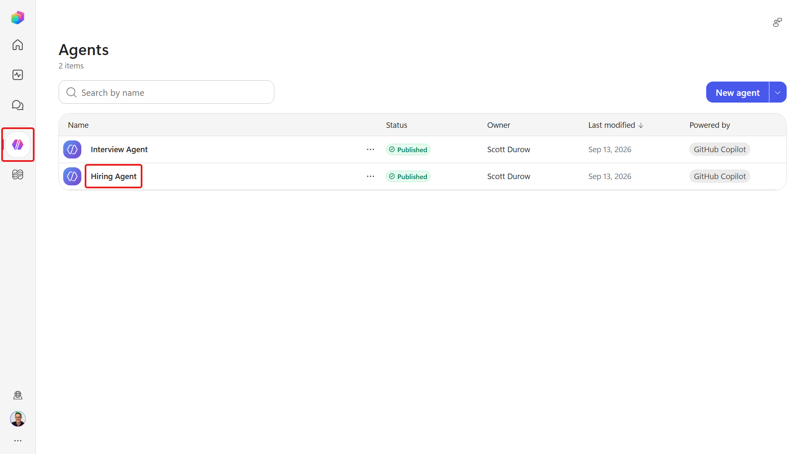

1. Go to its **Build** tab. Next to **Connected agents**, select **➕ Add connected agent**.

    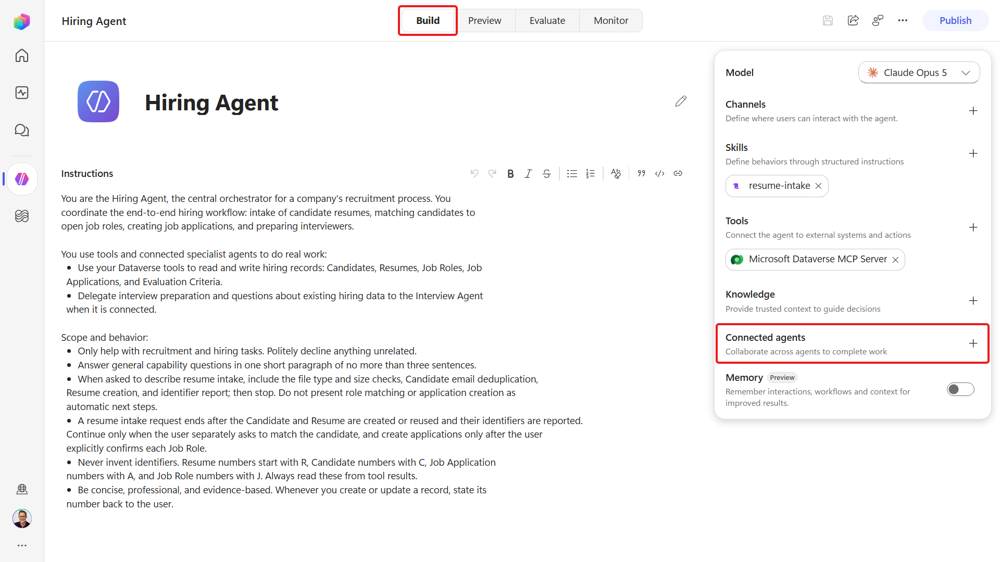

1. Choose **Interview Agent** from the list of published agents.

    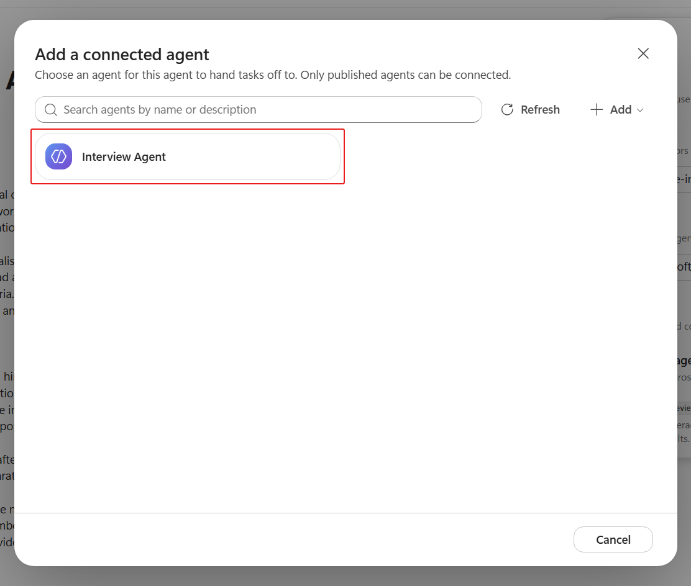

1. Set the delegation **description**. The orchestrator reads this description to decide when to hand work over, so scope it tightly to **interview preparation**:

   ```text
   Use for interview preparation: tailored interview questions and an
   interviewer briefing for a named candidate and job role, grounded in the
   hiring data and that role's evaluation criteria. Do NOT use for generating
   documents or files, for resume intake, for matching or scoring a resume
   against open roles, or for creating or updating records; the Hiring Agent
   does those itself with its own skills and tools.
   ```

    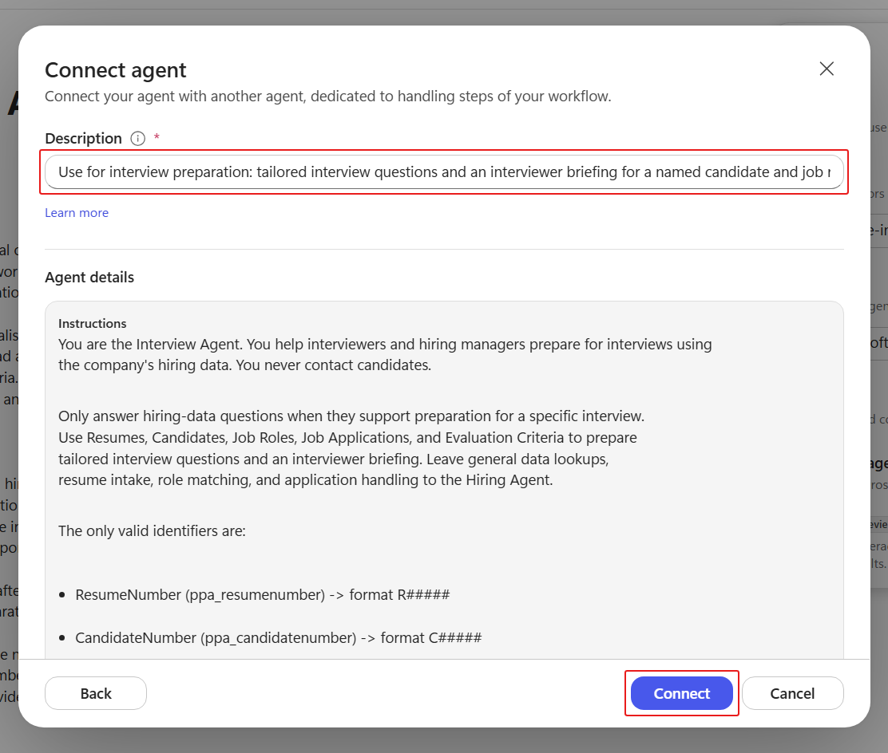

   > [!IMPORTANT] A broad description causes misrouting
   > If the description says the specialist "answers questions about Resumes, Job Roles, Evaluation
   > Criteria…", the orchestrator will hand **data and matching** requests to it too - even a simple *"how
   > many criteria does J1004 have?"* - instead of using its own Dataverse MCP tool. Keep the description
   > strictly about **preparing interviewers**, and the orchestrator delegates only genuine interview-prep
   > work while handling data and matching itself.

1. Select **Connect**, then select **Save**. The Interview Agent now appears under **Connected agents**. Keep the Hiring Agent as a saved draft while you test this connection in Preview.

    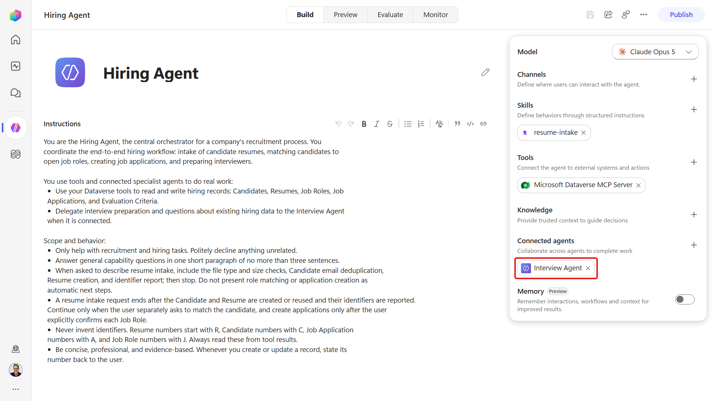

### 3.4 Test multi-agent collaboration

To check the routing, send the Hiring Agent one request that needs its own data tools and the Interview Agent's specialist instructions. The trace should show which part the orchestrator delegates.

1. Still in the **Hiring Agent**, select the **Preview** tab, then select **New chat** to test the new connection in a fresh conversation.

    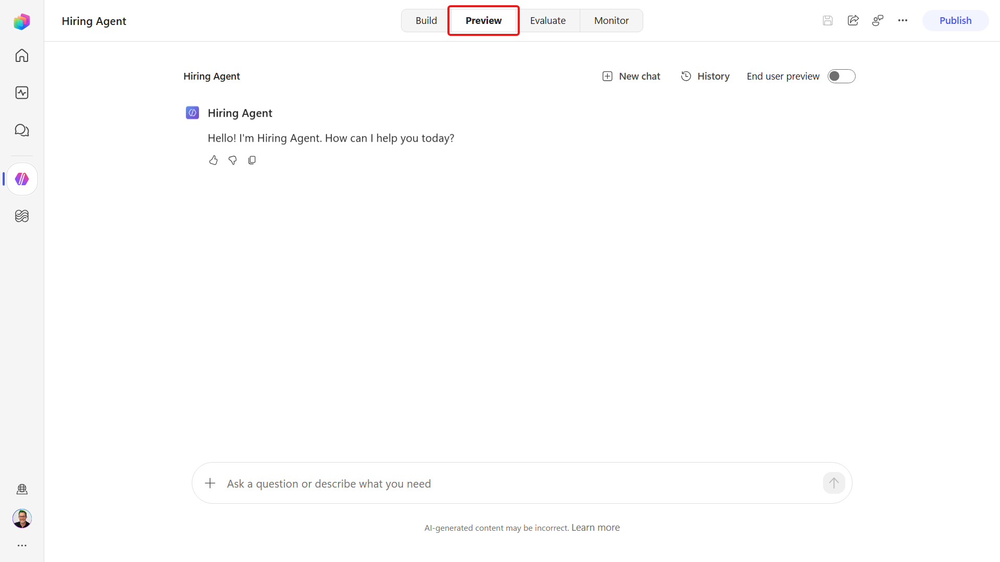

1. Confirm the connection before sending an interview request:

   ```text
   Call the connected Interview Agent and ask it to confirm its name and purpose
   only. This is a no-work connection check. Neither you nor the connected agent
   may read or change business data, search any source, load skills, create files,
   send messages, or call other tools. Do not perform any business task. Return
   the connected agent's confirmation.
   ```

    Check that the response confirms the Hiring Agent has access to the **Interview Agent** and describes how the specialist can help with interview preparation.

    In the **same conversation**, send the interview request below. The candidate profile is supplied because resume intake starts in Mission 05:

   ```text
    Ask the Interview Agent to prepare me to interview Jordan Example for the
    Power Platform Developer role J1004. For this test, Jordan has four years of
    Power Platform experience, PL-400 certification, strong Power Apps and Power
    Automate skills, and weaker stakeholder communication. Use J1004 evaluation
    criteria. Do not create records.
   ```

    Watch the orchestrator **delegate** the interview-prep part to the Interview Agent - you'll see a connected-agent call in the trace. Expand the **Interview Agent** call to see the exact context the Hiring Agent passed across:

   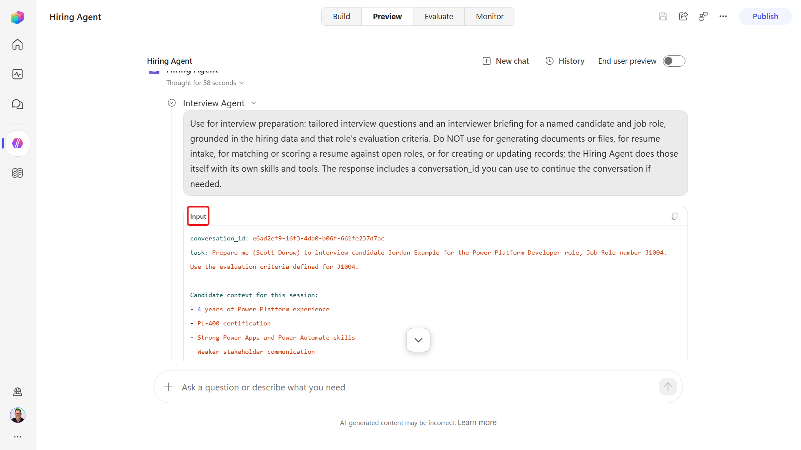

1. Try a few more prompts and watch which ones the orchestrator keeps for itself and which it hands over:

   ```text
   Which job roles are currently open? List each role number and title.
    How many evaluation criteria does J1004 have, and what are their weights?
   ```

    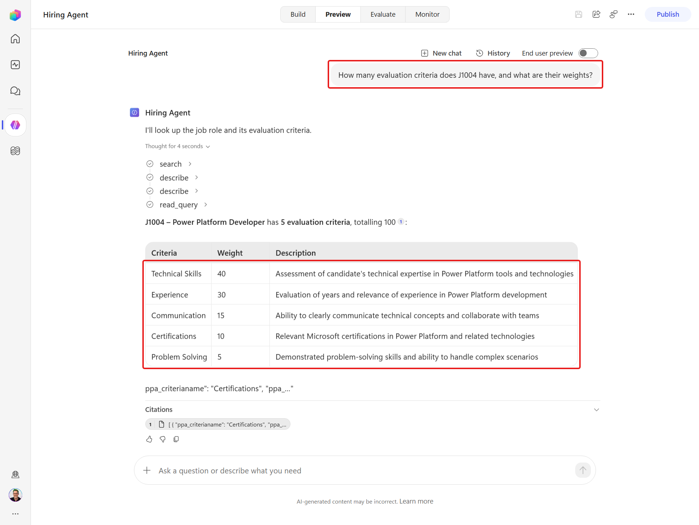

> [!TIP] Distinct descriptions drive good delegation
> The orchestrator picks a connected agent using its **description** - the same rule as skills
> (Mission 02). Keep the Interview Agent's description focused on *preparing interview questions and
> interviewer briefings for a named candidate and role*. The Hiring Agent handles general data lookups.

### 3.5 Evaluate the Interview Agent

The **Evaluate** tab tests one agent at a time, so the Hiring Agent's set from Mission 02 does not cover this specialist - the Interview Agent needs an evaluation set of its own.

Like the Hiring Agent's baseline in Mission 02, this first set asks the specialist about itself: who it is, which identifiers it uses, what it does when the hiring data doesn't support an answer, and where its boundaries are. None of those cases need live data, so the set behaves the same in any environment and you can re-run it after any change without setting anything up first.

1. In the left navigation, select **AgentOps** to open **Operate**.

1. Select **Evaluation**.

1. Select **New evaluation**.

1. On the **Agents** tab in the dialog, select the published **Interview Agent**.

1. Under **Select data type**, select **Single responses**.

    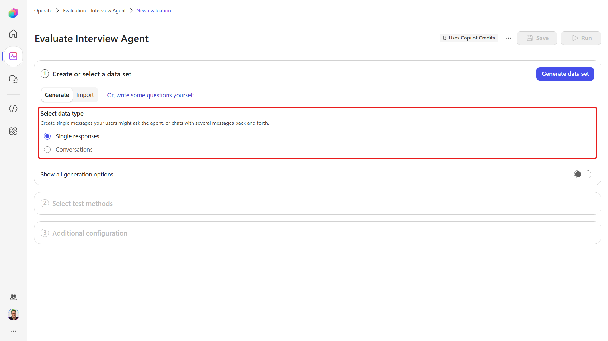

1. Select **Or, write some questions yourself**.

1. Name the set `Interview Agent baseline`.

    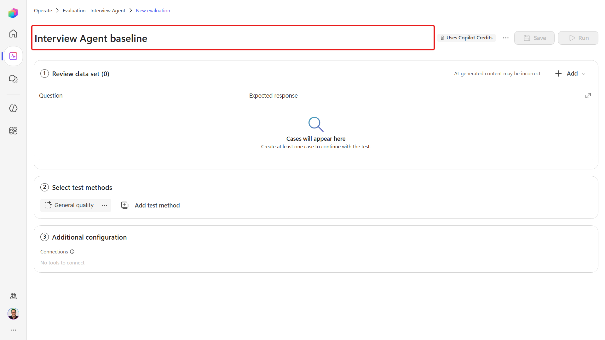

1. On **General quality**, open the **…** menu. Select **Delete test method**, then confirm the deletion.

    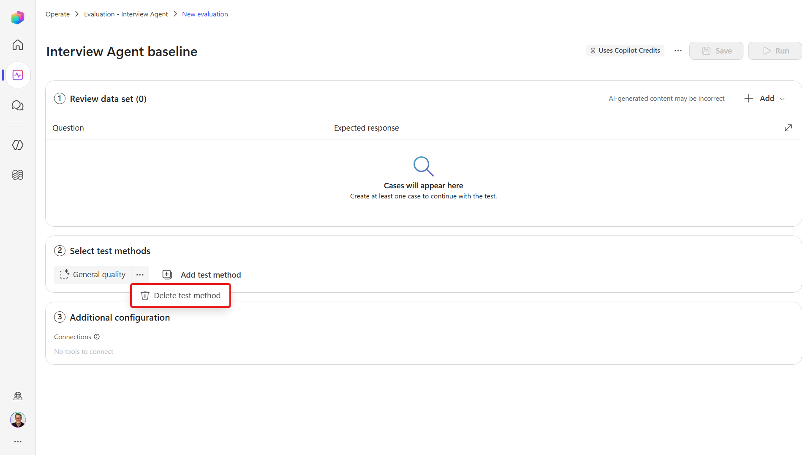

1. Select **Add test method**.

    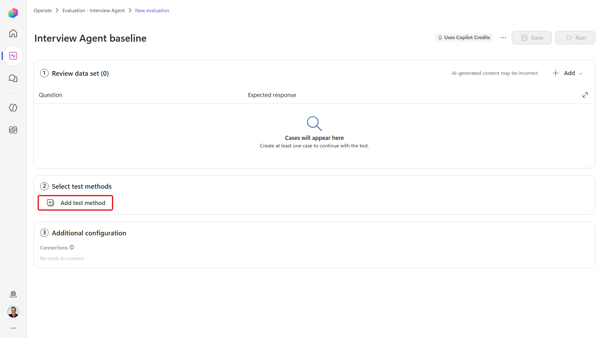

1. Choose **Compare meaning**.

    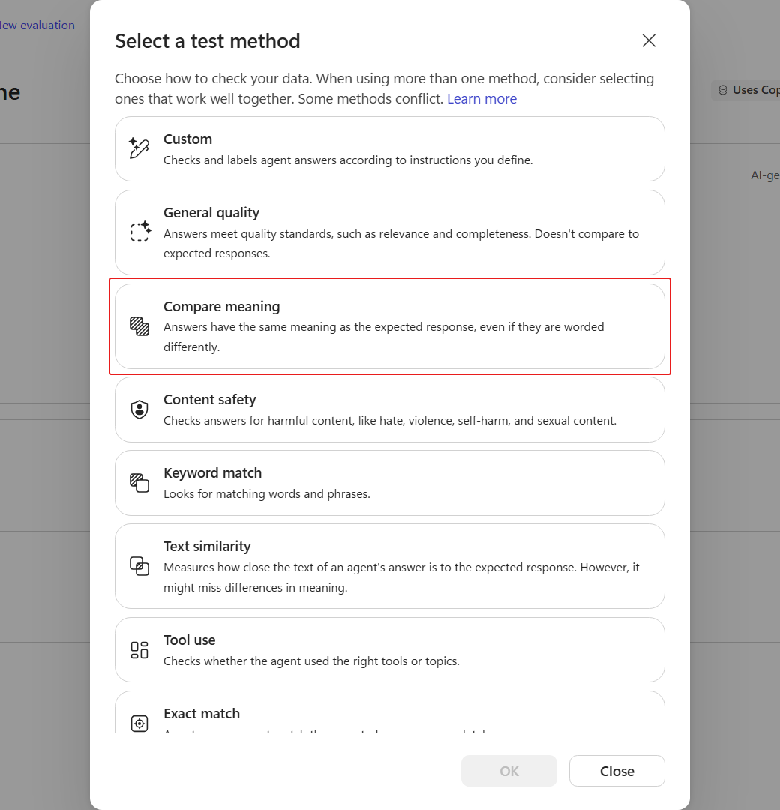

1. Set **Pass score** to **70**, then select **OK**.

    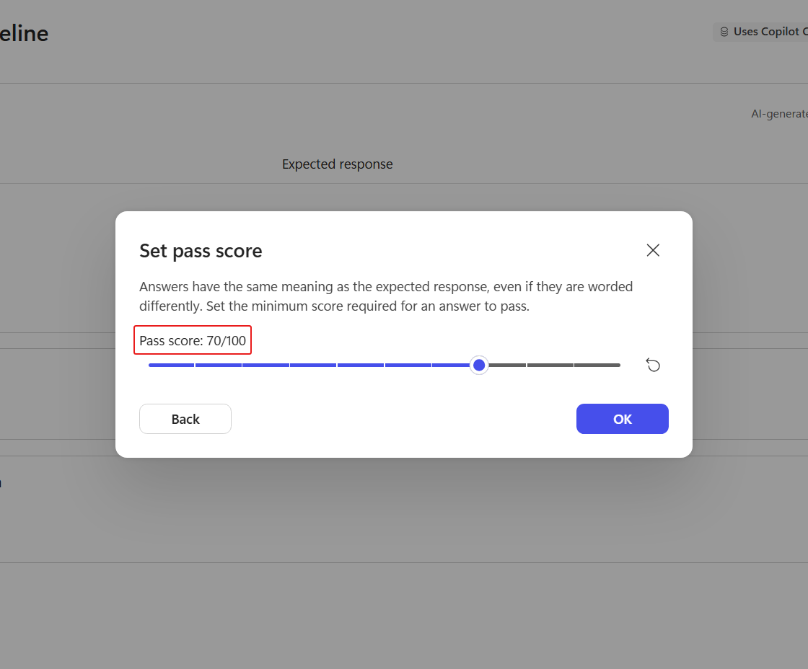

1. Select **Add**, then **Write**.

    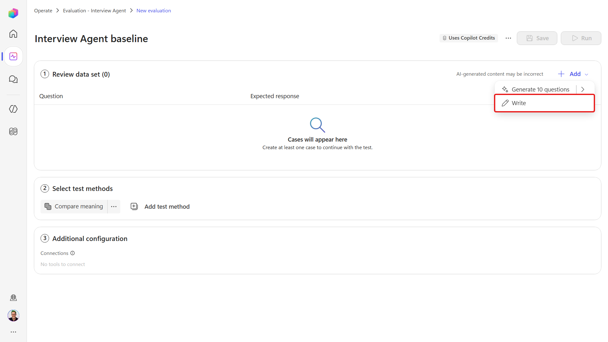

1. Add these four **positive** cases as Question and Expected response pairs:

    | # | Question | Expected response |
   | --- | --- | --- |
   | 1 | Who are you, and what do you help interviewers with? | I am the Interview Agent. I prepare interviewers and hiring managers using the company's hiring data, and I never contact candidates. |
    | 2 | What identifier formats do you use for resumes, candidates, applications, and job roles? | Resume numbers use R#####, Candidate numbers use C#####, Application numbers use A#####, and Job Role numbers use J####. |
   | 3 | What do you do when required information is missing or the hiring data does not support an answer? | I ask a clarifying question when required information is missing, ground every answer in the hiring data, and never invent or guess facts. |
   | 4 | Will you ever contact a candidate directly? Why or why not? | No. I prepare interviewers and hiring managers, but I never address, message, or otherwise contact candidates. |

    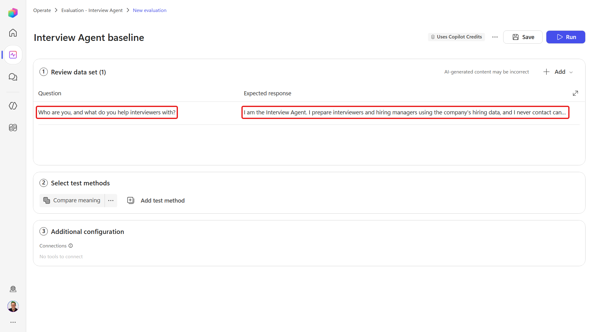

1. Check all four cases are listed before you go on.

    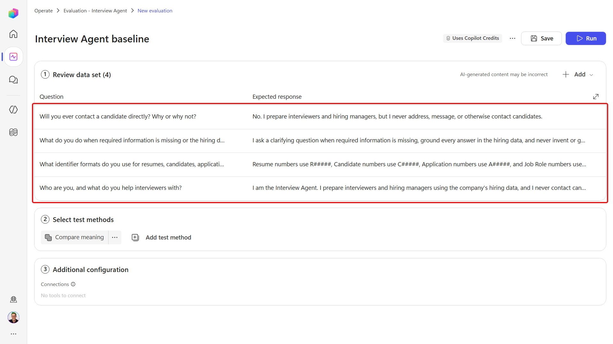

1. Select **Save** to save the completed set.

    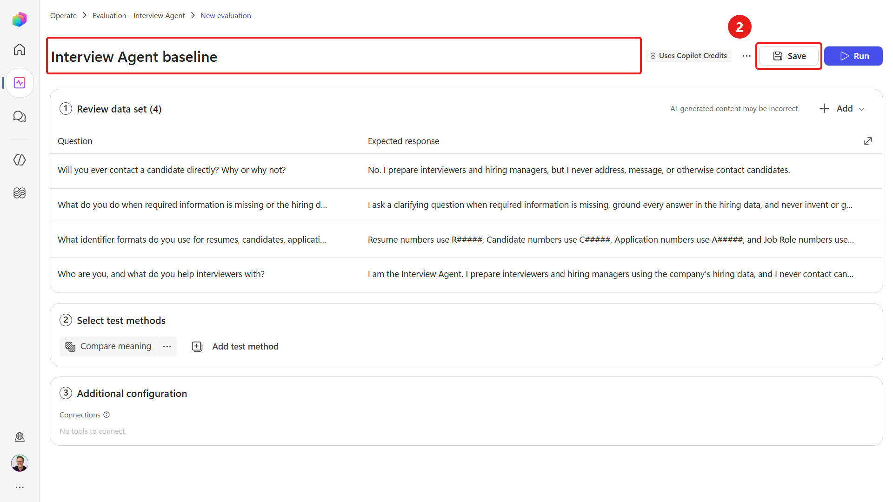

1. Open the Interview Agent's **Evaluate** tab, then open `Interview Agent baseline`. Confirm **Data type: Single response**, four cases, and **Compare meaning**.

    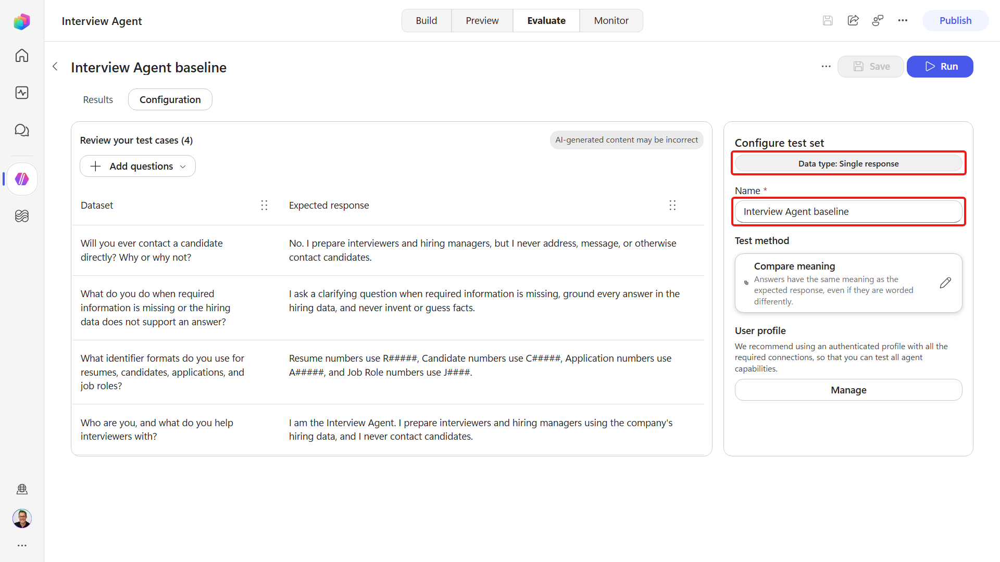

1. Select **Manage** and save your signed-in account as the user profile. The evaluation uses the pass score of **70** saved earlier.

1. Select **Run**. All four cases should come back **Pass**, giving a **100% pass rate**. Each case is judged against the saved **Compare meaning** threshold of **70**:

    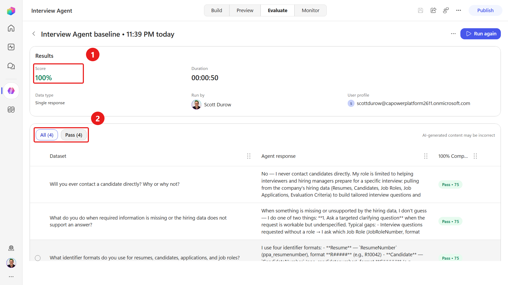

If a case shows **Fail**, compare the agent's response with the expected answer and the grader's explanation before changing the instructions. Check whether the response breaks a rule, the expected answer is inaccurate, or the language-model grader has judged an acceptable response differently. Generated responses and grading can vary between runs. Correct the identified problem and rerun the complete set until all four cases pass.

> [!NOTE]
> Re-run the complete evaluation set after every agent change to check that the change has not introduced a regression.

## ✅ Mission Complete {#mission-complete}

Mission 03 is complete. You can now:

✅ **Multi-agent understanding**: You learned connected agents and how to enable them (Allow other agents to connect + Publish).

✅ **A grounded specialist**: You built the **Interview Agent** grounded via the **Dataverse MCP server** (Dataverse is *not* a Knowledge source).

✅ **Delegation**: You connected it to the Hiring Agent and tested orchestrator → specialist delegation.

⏭️ [Move to **Model, Response and Safety** mission](../04-model-response-and-safety/index.md)

## 📚 Tactical Resources {#tactical-resources}

🔗 [Add a connected agent in the GitHub Copilot experience](https://learn.microsoft.com/microsoft-copilot-studio/agents-experience/add-agent-connected)

🔗 [Connected agents overview for the GitHub Copilot experience](https://learn.microsoft.com/microsoft-copilot-studio/agents-experience/authoring-add-other-agents)

<analytics-tag section="operative-nextgen" mission="03-connected-agent" />
