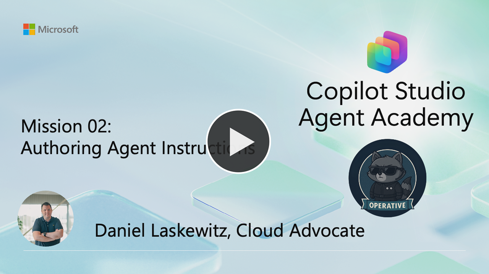

---
prev:
  text: Get started with the Hiring Agent
  link: /operative/01-get-started
next:
  text: Multi-Agent Systems
  link: /operative/03-multi-agent
short-description: Master precise agent communication and behavior control
difficulty: 2
codename: OPERATION SECRET DIRECTIVE
time: 20
tags:
  - instructions
  - prompting
products:
  - copilot-studio
industries:
  - hr
created-date: 2026-01-14
last-edited-date: 2026-03-11
---
# 🕵️‍♂️ Mission 02: Authoring Agent Instructions {#mission-02-authoring-agent-instructions}

<mission-meta />

🎥 **Watch the Walkthrough**

## 🎯 Mission Brief {#mission-brief}

Agent, your next assignment is **Operation Secret Directive**, a focused training mission on agent communication and control.

This mission is not a hands-on lab. Instead, it gives you the foundational knowledge you’ll need to write clear, effective instructions for your agents in later exercises. You’ll learn how well-written instructions influence agent behavior, decision-making, and tool usage, and why small wording choices can dramatically change outcomes.

Your objective is to understand how to author precise, actionable instructions and high-quality descriptions that help agents interpret their role, select the right tools and knowledge sources, and respond accurately to user queries. These skills form the backbone of every successful agent you’ll build going forward.

Think of this as advanced training in agent behavior and intent shaping. Just as a field operative relies on clear mission parameters, AI agents depend on carefully crafted instructions to act with clarity, consistency, and purpose in real-world scenarios.

## 🔎 Objectives {#objectives}

In this mission, you'll learn:

1. The art and science of writing agent instructions in Copilot Studio
1. How to direct agents to use tools, knowledge sources, and collaborate with other agents
1. How to ensure your agents act with precision, transparency, and efficiency

## 📝 Writing Agent Instructions {#writing-agent-instructions}

Writing effective agent instructions is the key to successful agent behavior. Instructions are used by agents to:

- Decide which tool, topic, or knowledge source to use for a user query or autonomous trigger
- Fill in inputs for any tool based on the available context
- Generate a response to the end user

### How Instructions Work

Instructions must be grounded in the tools, topics, and knowledge sources configured for your agent. Agents cannot act on instructions for resources they do not have. For example, if you instruct your agent to search a website FAQ, you must add that FAQ as a knowledge source.

You can reference specific tools, topics, variables, or Power Fx expressions using `/` in your instructions. This helps the agent know exactly what to use and when.

### What to Include in Instructions

- Add instructions for cases where you want to guide the agent’s choices, especially when ambiguity is possible.
- Use instructions to set guardrails, such as restricting topics or specifying response formats.
- Give hints for filling tool inputs, e.g., "Use the email address from the contact field of the lead when helping the user to draft an email."
- Specify how responses should be formatted, e.g., "Always give responses about order status in a table format."
- Use constraints to limit agent actions, e.g., "Only respond to requests about employee benefits."

### Practical Examples

- "Use the FAQ documents only if the question is not relevant to Hours, Appointments, or Billing."
- "Only use the ticket creation topic for creating tickets; for other requests related to fixing issues, use the troubleshooting topic."
- "Always give responses about order status in a table format."

### Testing and Refining

- After editing instructions, use the test pane to validate agent behavior.
- Update and publish changes as needed.

### Advanced Guidance

- Number or bullet list your instructions and specify that they must be followed in order.
- Use markdown formatting for readability and to help generative AI process your instructions.
- If you want your agent to be highly specific, consider creating a topic for that use case.
- Use exact names for tools and topics in instructions to avoid confusion.

### Safety and Moderation

- Limit what tools the agent should use when referencing knowledge sources.
- Limit what parameters should be used for tools (e.g., only email a specified list of individuals).
- Use instructions to protect against unwanted behavior or content filtering issues.

## ✍️ Authoring Descriptions for Tools, Topics, and Agents {#authoring-descriptions-for-tools-topics-and-agents}

High-quality descriptions are essential for generative orchestration. Your agent uses these descriptions to select the right tools, topics, and agents to respond to user queries and triggers. Follow these best practices:

- **Use Simple, Direct Language**: Avoid jargon, slang, or overly technical terms. Write in active voice and present tense.
- **Be Specific and Relevant**: Include keywords related to the functionality and user intent. Make sure descriptions clearly differentiate similar tools or topics to avoid ambiguity.
- **Keep It Short and Informative**: Limit descriptions to one or two sentences. Summarize what the tool, topic, or agent does and how it benefits the user.
- **Use Unique, Descriptive Names**: Avoid generic names. For example, use "Weather Forecast for Tomorrow" instead of just "Weather".
- **List Actions or Considerations**: Use bulleted or numbered lists for clarity when describing multiple features or steps.
- **Test for Overlap**: If multiple topics have similar descriptions, your agent may invoke them all. Test and revise to prevent overlap.

!!! example "Good and Bad Description Examples"
    **Good:** This topic provides weather information for any location in the world for the next day. It provides the temperature. It doesn't get the current weather for today.
    **Bad:** This tool can answer questions. *(Too vague)*

## 🛠️ Best Practices for Instructions and Descriptions {#best-practices-for-instructions-and-descriptions}

To make your instructions and descriptions truly effective, keep these principles in mind:

- Use active voice and present tense (e.g., "This tool provides weather information").
- Avoid jargon, slang, or unnecessary technical terms unless necessary for the audience.
- Use bulleted or numbered lists to separate actions, features, or considerations.
- Include keywords that match the user's intent and the tool or topic's functionality.
- Ensure distinct names and descriptions for similar resources to avoid confusion and overlap.

## 🗂️ Example Instruction Structure {#example-instruction-structure}

When writing instructions, consider the following structure for clarity and completeness:

1. **Overview**: Briefly describe the agent’s mission and role
1. **Process Steps**: List the main steps the agent should follow
1. **Collaboration Points**: Indicate when to call other agents or use specific tools
1. **Safety and Moderation**: Include any compliance or safety requirements
1. **Feedback Loop**: Specify how the agent should collect feedback or escalate issues

## 🎉 Mission Complete {#mission-complete}

Mission 02 is completed! You now have:

✅ **Instruction Mastery**: Learned how to write clear, actionable agent instructions  
✅ **Strategic Guidance**: Directed agents to use tools and collaborate effectively  
✅ **Operational Clarity**: Ensured agents act with precision and transparency

You will put your new instruction skills to practice in the upcoming lessons.

Next up is [Mission 03](../03-multi-agent/index.md): Building multi-agent systems.

## 📚 Tactical Resources {#tactical-resources}

📖 [Microsoft Copilot Studio - Authoring Instructions](https://learn.microsoft.com/microsoft-copilot-studio/authoring-instructions)
  
📖 [Guidance for Generative Mode](https://learn.microsoft.com/microsoft-copilot-studio/guidance/generative-mode-guidance)

<analytics-tag section="operative" mission="02-agent-instructions" />
