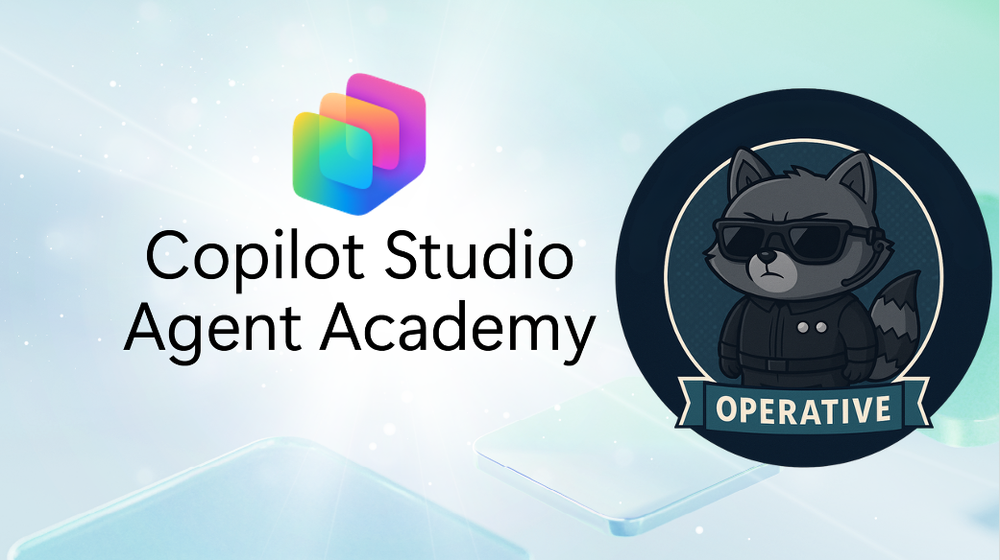

---
next:
  text: 'Get started with the Hiring Agent'
  link: '/operative/01-get-started'
lastUpdated: false
created-date: 2026-01-14
last-edited-date: 2026-02-13
---

# Welcome Operative

**Welcome, Operative.**  
Your advanced mission—should you choose to accept it—is to master the art of building **enterprise-grade multi-agent systems** using **Microsoft Copilot Studio**.

This intensive training takes you beyond basic agent creation into the sophisticated world of **multi-agent orchestration**: from hiring automation to AI safety, you'll learn to build, coordinate, and deploy intelligent agent ecosystems using real-world enterprise scenarios.

## 🎯 Mission Objective {#mission-objective}

By completing the Agent Academy Operative program, you'll be able to:

- Design and implement **multi-agent systems** for complex business scenarios
- Master **agent orchestration** and collaboration patterns
- Implement **AI safety and content moderation** in production systems
- Build **multi-modal prompts** for document processing, creation and analysis
- Configure **governance and testing**

## 🧪 Prerequisites {#prerequisites}

Before starting this mission, you'll need:

- Have completed the **[Agent Academy Recruit](https://microsoft.github.io/agent-academy/recruit/)** training
- A Microsoft Power Platform environment with **Copilot Studio** license or trial
- Access to **Microsoft Dataverse**
- Administrative permissions to create solutions and agents
- Access to the [Frontier Program](https://adoption.microsoft.com/files/copilot/Frontier_Getting-started-guide.pdf)

> [!NOTE]
> **Need to set up an environment?** The Operative course does **not** include its own environment setup — if you need to create a trial Microsoft 365 tenant, get a Copilot Studio trial, or configure a Power Apps developer environment, follow **Steps 1–4** in the [Recruit Course Setup](https://microsoft.github.io/agent-academy/recruit/00-course-setup/). You do **not** need to complete Step 5 (SharePoint site creation) for the Operative course.
>
> If you already have a Microsoft 365 business tenant with Power Platform and Copilot Studio access, you're good to go.

## 🧬 Who This Is For {#who-this-is-for}

This advanced course is ideal for:

- **Solution architects** designing enterprise AI systems
- **Developers** building production-ready agent solutions
- **IT professionals** implementing AI governance and safety
- **Business analysts** creating complex automation workflows
- Anyone ready to **level up** from basic agents to enterprise systems

## 🧭 Curriculum Overview {#curriculum-overview}

This academy is structured as a progressive series of field operations—each mission builds upon the previous to create a comprehensive hiring automation system.

| Mission | Title | Operation Briefing |
| --------- | ------- | ------------------- |
| `01` | 🚨 [Get started with the Hiring Agent](./01-get-started/index.md) | Deploy foundational infrastructure and create your central orchestrator agent |
| `02` | 📝 [Authoring Agent Instructions](./02-agent-instructions/index.md) | Master precise agent communication and behavior control |
| `03` | 🎭 [Make your agent multi-agent ready with connected agents](./03-multi-agent/index.md) | Transform single agent into coordinated multi-agent system |
| `04` | ⚡ [Automate your agent with Triggers](./04-automate-triggers/index.md) | Implement autonomous agent behaviors with event-driven triggers |
| `05` | 💬 [Understanding Agent Models and Response Formatting](./05-model-selection/index.md) | Customize agent models for maximum impact and engagement |
| `06` | 🛡️ [Content Moderation and AI Safety Essentials](./06-ai-safety/index.md) | Implement enterprise-grade safety and compliance measures |
| `07` | 🎨 [Extracting Resume Contents with Multi-Modal Prompts](./07-multimodal-prompts/index.md) | Process documents and images with advanced AI capabilities |
| `08` | 🗄️ [Prompts - Dataverse Grounding](./08-dataverse-grounding/index.md) | Ground agents in enterprise data for accurate responses |
| `09` | 🧠 [Generating an Interview Prep Document](./09-document-generation/index.md) | Implement document generation in AI prompts |
| `10` | 📄 [Integrate with MCP Servers](./10-mcp/index.md) | Integrate with out of the box MCP servers |
| `11` | 📊 [Obtain User Feedback with Adaptive Cards](./11-obtain-user-feedback/index.md) | Collect and process user feedback for continuous improvement |
| `12` | 🏅 [Course Completion Badges](./course-completion-badges-operative/index.md) | Claim your Operative badge and celebrate your achievement |

> [!NOTE]
> ✅ Completing this curriculum earns you the **Operative** badge.  
> 🔓 **Commander** will be unlocked in future phases.

<analytics-tag section="operative" />
