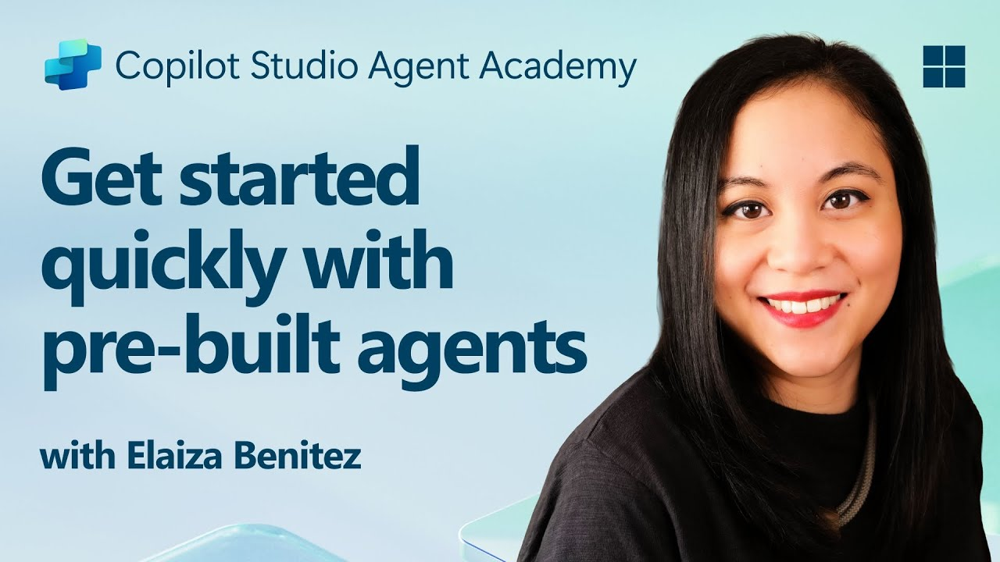

---
prev:
  text: Creating a Solution for Your Agent
  link: /recruit/04-creating-a-solution
next:
  text: Create a custom agent using natural language with AI
  link: /recruit/06-create-agent-from-conversation
short-description: Use and customize a template agent to accelerate setup
difficulty: 1
codename: OPERATION SAFE TRAVELS
time: 30
tags:
  - prebuilt-agents
products:
  - copilot-studio
  - microsoft-365
  - teams
created-date: 2026-01-14
last-edited-date: 2026-03-11
---
# 🧰 Mission 05: Using a Pre-Built Agent   {#mission-05-using-a-pre-built-agent}

<mission-meta />

🎥 **Watch the Walkthrough**

## 🎯 Mission Brief {#mission-brief}

Welcome to your next mission in the Copilot Studio Agent Academy. You're about to explore the world of **pre-built agents**—intelligent, purpose-driven agents created by Microsoft to accelerate your deployment and reduce time to value.

Rather than building from scratch, pre-built agents (also called **agent templates**) give you a head start by providing ready-to-use scenarios that you can customize and deploy in minutes.

In this mission, you’ll deploy the **Safe Travels** agent—an agent that helps your users prepare for business travel, understand company policies, and streamline planning.

## 🧭 Objectives {#objectives}

Your goals for this mission are:

1. Understand what pre-built agents are and why they matter  
1. Deploy the **Safe Travels** agent template  
1. Customize the agent’s responses and content  
1. Test and publish the agent  

## 🧠 What Are Pre-Built Agents? {#what-are-pre-built-agents}

Pre-built agents are turnkey AI agents created by Microsoft that:

- Address common business needs (like travel, HR, IT support)
- Include fully functioning topics, trigger phrases, instructions and sample knowledge.
- Can be edited, extended, and grounded with your own data

These agents are perfect for getting started quickly or learning how agents are structured.

## 🧪 Lab 05: Quickly get started with a pre-built agent {#lab-05-quickly-get-started-with-a-pre-built-agent}

We're now going to learn how to select a pre-built agent and customize it.

We're going to stick with the example from earlier, where we're going to create a solution in the dedicated Copilot Studio environment to build our IT helpdesk agent in.

Let's begin!

### 5.1 Launch Copilot Studio

1. Navigate to [https://copilotstudio.microsoft.com](https://copilotstudio.microsoft.com)

1. Sign in with your Microsoft 365 work or school account

> [!WARNING]
> You must be in a tenant where Copilot Studio is enabled. If you don’t see Copilot Studio, revisit [Mission 00](../00-course-setup/index.md) to complete your setup.

### 5.2 Choose the Safe Travels Agent Template

1. From the Copilot Studio homepage, click **+ Create**
    

1. Scroll down to the **Start with an agent template** section

1. Find and select **Safe Travels**

    

1. Notice that the template comes pre-loaded with a description, instructions and knowledge.

    

1. Click **Create**

    

This will create a new agent in your environment based on the Safe Travels configuration.

### 5.3 Customize the Agent

Now that the agent is created, let’s tailor it to your organization:

1. Now we'll equip the agent with an additional knowledge source so it can answer questions about Europe travel. To do this, scroll down to the **knowledge** section and select **Add knowledge**

    

1. Select **Public websites**

    

1. In the text input, paste **<https://european-union.europa.eu/>** and select **Add**

    

1. Select **Add to agent**

    

### 5.4 Test and Publish

1. Click **Test** in the top-right to launch the test window  

1. Try phrases like:

    - `“Do I need a visa to travel from the US to Amsterdam?”`
    - `“How long does it take to get a US Passport?”`
    - `“Where is the closest US embassy in Valencia, Spain?”`

1. Confirm the agent responds with accurate and helpful information and observe the Activity Map to see where it retrieved the information.

    

1. When ready, click **Publish**

    

1. Select **Publish** again in the dialog box
    

1. Optionally, add the agent to Microsoft Teams using the built-in **Channels** feature.

> [!NOTE] 🧳 Bonus Objective
> Try grounding the Safe Travels agent with a SharePoint site or FAQ file to make it more relevant to your company’s travel policies.

## ✅ Mission Complete {#mission-complete}

You've now successfully:

- Deployed a Microsoft pre-built agent  
- Customized the agent
- Tested and published your own version of the **Safe Travels** agent template

⏭️ [Move to **Creating a custom agent from scratch** lesson](../06-create-agent-from-conversation/index.md).

<analytics-tag section="recruit" mission="05-using-prebuilt-agents" />
