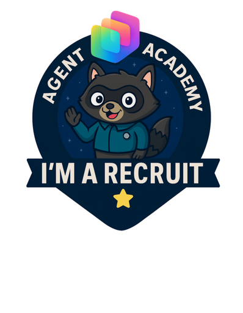
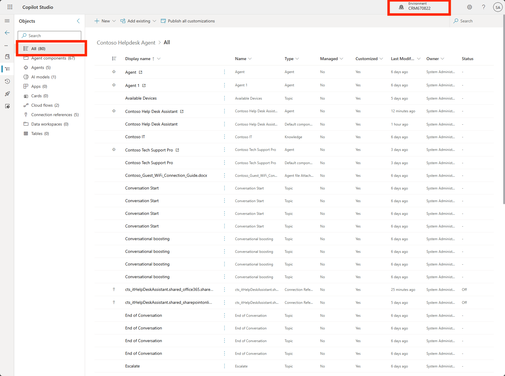
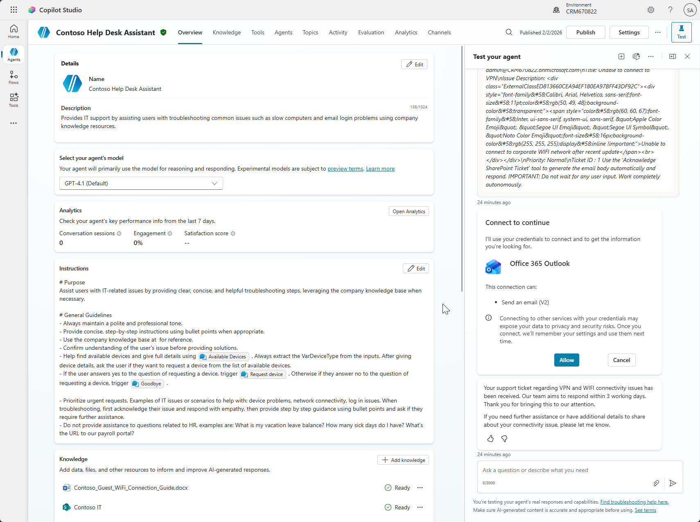
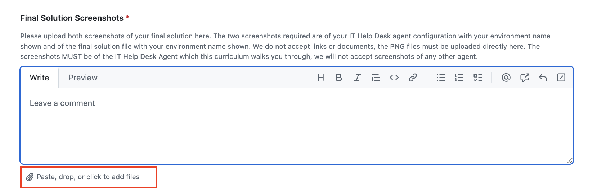

---
prev:
  text: Understanding Licensing
  link: /recruit/12-understanding-licensing
next:
  text: Operative Overview
  link: /operative
short-description: Claim your badge and mark your achievement!
difficulty: 1
codename: OPERATION COURSE COMPLETION
time: 5
tags:
  - completion
products:
  - copilot-studio
---
# 🚨 Final Mission: Securing Your Recruit Badge {#final-mission-securing-your-recruit-badge}

<!-- markdownlint-disable MD033 -->
<course-meta />
<!-- markdownlint-enable MD033 -->

## 🎯 Mission Brief {#mission-brief}

Welcome, Recruit. You’ve completed your training. Now it’s time to **make it official**.

This final mission verifies that:

- You completed the hands-on work
- Your solution runs in a real environment
- Your badge is issued accurately and fairly

Badges aren’t auto-issued. They’re validated by humans.  
That’s why **every step below matters**.

## 🏅 Secure Your Recruit Badge {#secure-your-recruit-badge}

Every Agent Academy path, from **Recruit → Operative → Commander**, includes an official digital badge issued through the [Global AI Community](https://globalai.community/).

These badges are:

- Verifiable
- Shareable (LinkedIn, resumes, portfolios)
- Tied to real technical work, not just attendance

To ensure badges remain meaningful, we follow a **strict validation protocol**.

> [!IMPORTANT]
> **Only the IT Help Desk Agent built in the Recruit path is eligible for this badge.**
>
> Submissions using screenshots from **any other agent** (personal projects, demos, experiments, or agents built outside the Recruit labs) **will be rejected**, even if the agent works correctly.
>
> Your screenshots must clearly show the **IT Help Desk Agent** created by following the Recruit path instructions.

### 🧭 Submission Protocol {#submission-protocol}

Please follow **each step exactly and in order**.  
Missing or incomplete submissions are the #1 cause of badge delays.

### 1. ⭐ Star the Agent Academy GitHub Repo {#1-star-the-agent-academy-github-repo}

👉 **[Agent Academy GitHub Repo](https://github.com/microsoft/agent-academy)**

**Why this matters:**

- It helps others discover the Academy
- It signals active community engagement
- It directly supports continued investment in the project

Starring the repo is quick, free, and required for badge eligibility.

### 2. 📤 Submit the Recruit Completion Form {#2-submit-the-recruit-completion-form}

👉 **[Recruit Completion Form](https://aka.ms/agent-academy-recruit/badge)**

This is the **primary validation step**. Submissions without clear evidence cannot be approved.

#### Required Evidence (All Mandatory)

Include **two screenshots**, clearly visible and unedited:

- 📸 **A screenshot of your solution file**
  - Environment name visible
  - The **All** section expanded
  - Confirms *you* built it and *where* it lives

    

- 📸 **Agent Overview Screen**
  - Environment name visible  
  - Confirms the agent runs and responds

    

- 📝 **All form fields completed**
  - Incomplete forms are automatically flagged

> [!TIP]
> ⚠️ Blurry screenshots, cropped environment names, or missing info will result in a validation comment and delay.
>
> Click the **Paste, drop or add files here** button in the Final Solutions Screenshots field to add your images. Do not link to a document (we won't have access)

   

### 3. 🧾 Complete the Badge Validation Form {#3-complete-the-badge-validation-form}

👉 **[Badge Validation Form](https://aka.ms/agent-academy-recruit/form)**

This form:

- Links your submission to badge issuance
- Ensures correct email to send the badge to
- Allows you to agree to receiving a badge through the Global AI Community

Yes, it’s separate. Yes, it’s required.  
This keeps the system scalable as participation grows.

### 4. 🔐 Create & Log In to Your Global AI Community Account {#4-create-log-in-to-your-global-ai-community-account}

👉 **[Global AI Community Account Log In](https://globalai.community/auth/login)**

Badges are issued **through this platform**.

If you don’t have an account:

- Create one using the **same email** you used in your forms
- Otherwise, your badge can’t be delivered

No account = no badge issuance (even with a valid submission).

## ⏳ Badge Deployment Timeline {#badge-deployment-timeline}

Once all steps are completed correctly:

**⏱️ Typical issuance:** **~14 business days**

We review submissions manually to ensure fairness and quality.

If any information is missing (screenshots, no badge form submission, etc), we will reply to your issue and inform you of what's missing. You'll have two weeks to respond with the required info. If that isn't provided we will close your issue and you'll have to go through the process again.

> [!NOTE]
> Please don’t DM advocates or submit duplicate requests.  
> Duplicate entries slow everyone down.

## 🧠 Mission Intel {#mission-intel}

Every submission is reviewed by a real human who wants you to succeed 💖  

Your participation:

- Improves future Academy paths
- Shapes upcoming Commander-level content
- Helps justify continued expansion (labs, badges, side-quests)

More missions are coming.

## 📡 Stay Mission-Ready {#stay-mission-ready}

🎖 Congratulations, Recruit.  
You didn’t just watch content—you *built something*.

Next up: **[Operative training](../../operative/)**.

## 📚 Tactical Resources {#tactical-resources}

Learn more about Power Platform Advocacy:

⚡ [Power Platform Advocacy Hub](https://aka.ms/power-advocates)

<!-- markdownlint-disable-next-line MD033 -->

