# Microsoft Copilot Studio ➕ Docusign MCP

Welcome, agent. Your objective is simple: reuse what already works. Connect Docusign MCP server to your Copilot Studio agent, and invoke a Maestro workflow to execute an _already-operational_ document automation workflow. You gather the intel. Maestro runs the op. Minimal new logic. Maximum leverage.

## 🎯 Mission Brief

TBC

## 🔎 Objectives

In this mission, you'll learn:

1. How to create Docusign Web Forms, Document Templates and a Maestro workflow
1. How to add the Docusign MCP server as a tool to your agent
1. How to add the Outlook MCP server as a tool to your agent
1. How to invoke the Maestro workflow from the agent
1. How to provide inputs in natural language for the Maestro workflow

## ❓ What is Docusign?

TBC

### Why should I use it?

TBC

## 🧪 Docusign MCP lab

For this Special Ops mission, we're going to:

- 1.0 Create templates and a Maestro workflow in docusign
- 2.0 Build an agent and add the Docusign MCP server as a tool in Copilot Studio
- 3.0 Add the Outlook MCP server as a tool in Copilot Studio
- 4.0 Test end-to-end

### ✅ Prerequisites

To complete this Special Ops mission, you'll need the following outlined in this section.

#### Docusign

- Sign up for a free **Docusign developer account**
  - Browse to [https://developers.docusign.com](https://developers.docusign.com)
  - Create a new **App and key** under **Admin**
  - In your **App and key**,
    - add a new **Secret** and _securely_ save the value as you'll be copying and pasting the value when we add the Docusign MCP server as a tool in a later lab exercise
    - scroll down to the **Allowed HTTP Methods** section and tick all the checkboxes for `GET`, `POST`, `PUT`, `DELETE` and `HEAD`
    - **Save** your app and key

#### Microsoft

- Copilot Studio license
- Access to a Microsoft Power Platform environment
- Administrative permissions to create solutions and agents
- A SharePoint site where you have permissions to create a new folder in the Documents library - this will be used in a Maestro workflow step

> [!TIP] Prerequisites help:
> If you need help getting a Copilot Studio license, please reference the [Recruit Course Setup lab](./../../recruit/00-course-setup/index.md) which walks you through setting up a Power Platform environment with a Copilot Studio trial.

#### Two email addresses

You'll need two different email addresses to complete this lab:

- Email address to use as the employee
- Email address to use as the hiring manager

### 1.1 Create a Docusign Web Form

> [!IMPORTANT]
> You need a Docusign developer account to complete these Docusign lab exercises. Follow the steps outlined in the above **Prerequisites** section.

1. From the Home page of Docusign developers portal, select **Templates**.

    

1. On the left hand side navigation pane, select **Start**. Select **Web Forms** followed by **Create Web Form**.

    

1. We'll now be asked how we want to create our Web Form. Select **Start From Scratch**.

    

1. Enter a name for the Web Form. For example,

    ```text
    Request for your contact information
    ```

    

1. The Web Form designer will next appear. This is where we can add pages and fields to the Web Form. By default there will be 3 pages - Welcome page, Untitled page, Thank you page.

    In the **Welcome page** update the following fields,

    **Page title**

    ```text
    👋🏻 Hey there!
    ```

    **Page subtitle**

    ```text
    As we kick-off the next stage in sending you an offer, we need some details from you.

    Please complete this form and shortly after you'll receive an Employment Agreement and Offer Letter.
    ```

    

1. Next, select the **Untitled** page and update the following fields,

    **Page title**

    ```text
    Your name
    ```

    **Page subtitle**

    ```text
    Please provide us with your name
    ```

    **API reference name**

    ```text
    Step_CandidateName
    ```

    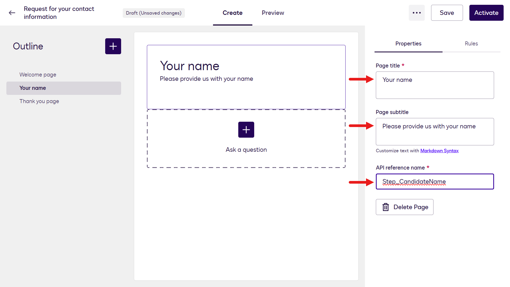

1. We're now going to add fields to this page. Select the **plus icon** below the page title section in the middle of the designer.

    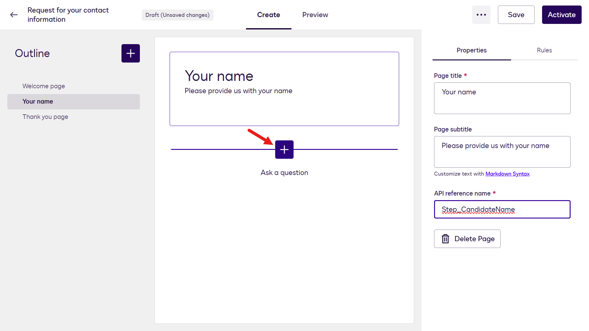

1. Select **Text Field**.

    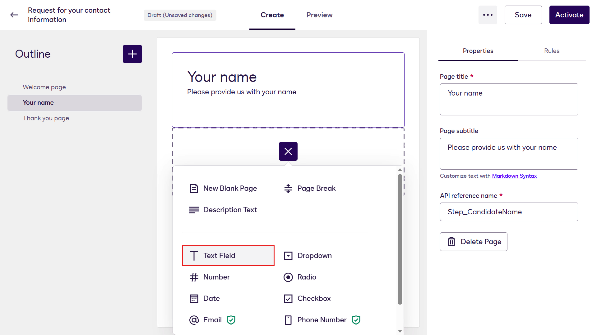

1. You'll now see different attributes of the field. The following are the attributes of the field to update,

    | Field name    | Field description | Required field | API reference name    |
    |---------------|-------------------|----------------|-----------------------|
    | `First Name`  | `Your first name` | Yes            | `TextBox_FirstName`   |

    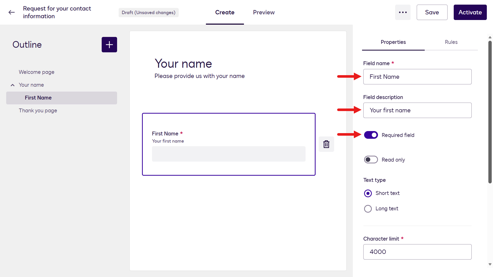

    

1. We'll repeat the same steps to add the remaining **Text Fields**. Select the **plus icon** and add new **Text Fields** using the following attributes for each one,

    | Field name    | Field description  | Required field | API reference name   |
    |---------------|--------------------|----------------|----------------------|
    | `Middle Name` | `Your middle name` | No             | `TextBox_MiddleName` |
    | `Surname`     | `Your surname`     | Yes            | `TextBox_Surname`    |
    | `Full Name`   | `Your fullname`    | Yes            | `TextBox_FullName`   |

    After the **Text Fields** have been added, select the **plus icon** on the left hand side pane and select **New Blank Page**.

    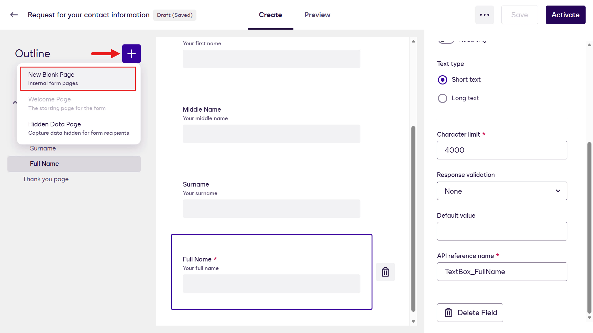

1. Update the following fields for the new page,

    **Page title**

    ```text
    Address
    ```

    **Page subtitle**

    ```text
    Please provide us with your physical address
    ```

    **API reference name**

    ```text
    Step_CandidateAddress
    ```

    We'll repeat the same steps to add the remaining **Text Fields**. Select the **plus icon** and add new **Text Fields** using the following attributes for each one,

    | Field name    | Field description  | Required field | API reference name   |
    |---------------|--------------------|----------------|----------------------|
    | `Middle Name` | `Your middle name` | No             | `TextBox_MiddleName` |
    | `Surname`     | `Your surname`     | Yes            | `TextBox_Surname`    |
    | `Full Name`   | `Your fullname`    | Yes            | `TextBox_FullName`   |

    

1. After the **Text Fields** have been added, select the **Thank you page** on the left hand side pane.

    

1. Update the following fields for the **Thank you page**.

    **Page title**

    ```text
    ✨ Thank you
    ```

    **Page subtitle**

    ```text
    We've received your form. Expect an email soon with documents to sign.
    ```

    

1. Great, you've now finished configuring the Web Form. Let's take a look at what the Web Form will look like for the end user, select **Preview**.

    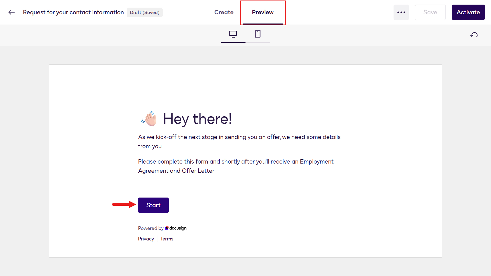

1. The Web Form is now enabled in preview mode where you can complete each page with the required information. Complete the **Your Name page** by entering a name and select **Next**.

    

1. The next page to complete is the **Address page**.

    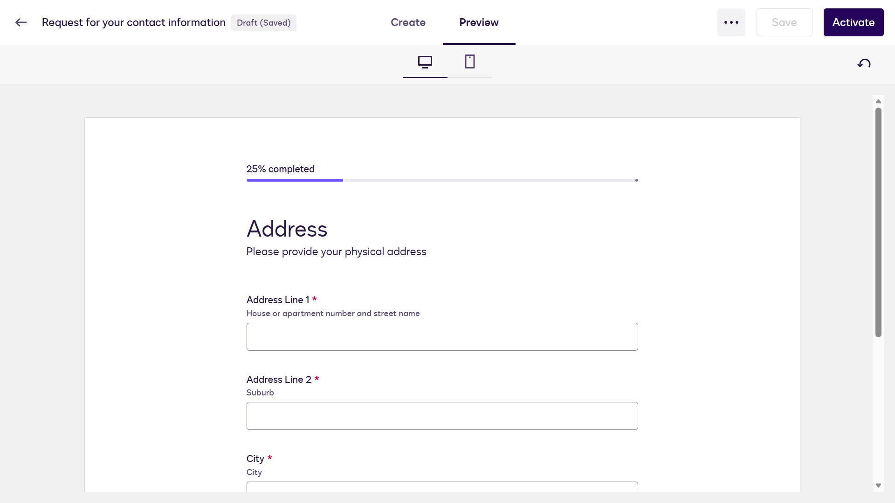

1. Complete the **Address page** with information and select **Next**.

    

1. You'll then see a summary of the information entered for the two pages to review.

    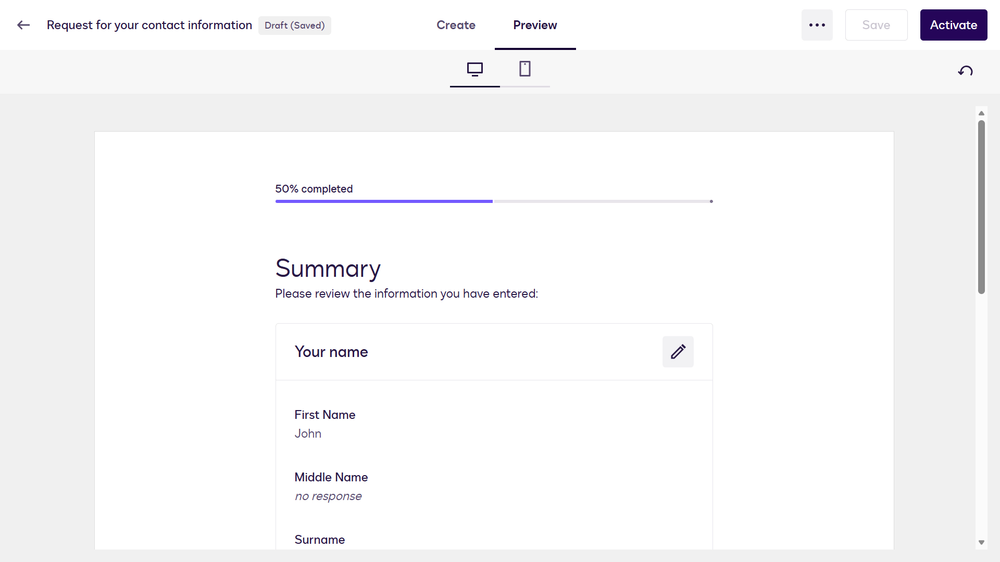

1. Scroll down and select **Next**.

    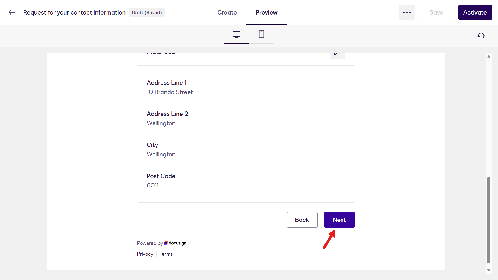

1. An error will appear next, this is fine as it's due to the web form being in preview mode. Select **Create**.

    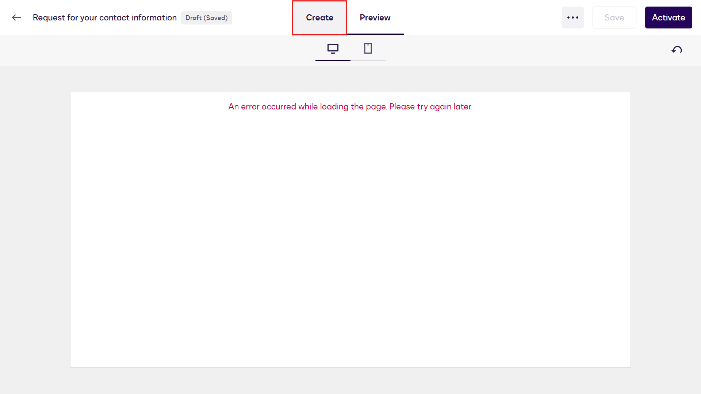

1. We'll now activate the web form. Select **Activate** on the upper right of the designer.

    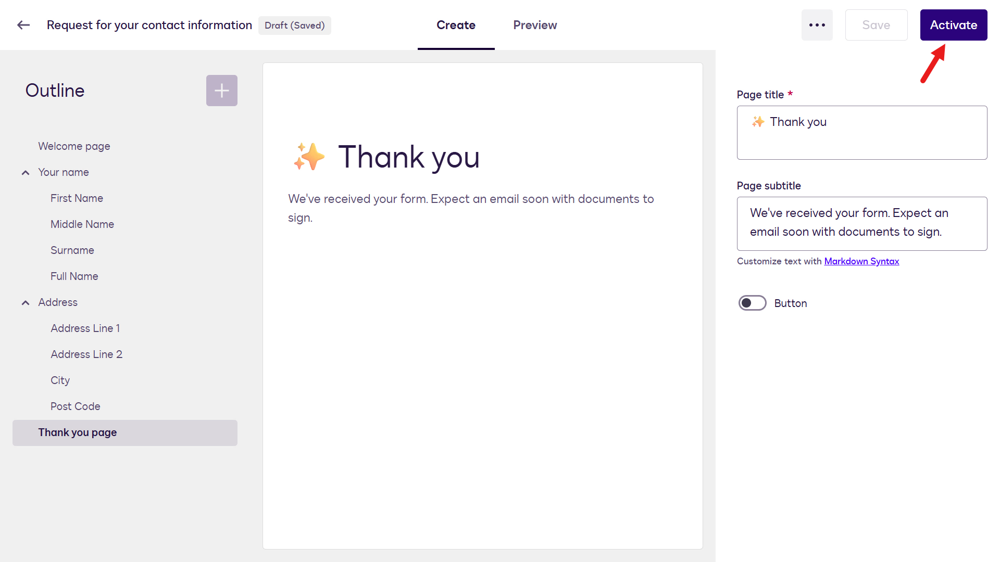

1. A confirmation modal will appear with an **Access setting** field. We'll leave this as **Public** as the web form we'll be used in a step in the Maestro workflow we'll create in a later lab exercise. Select **Activate**.

    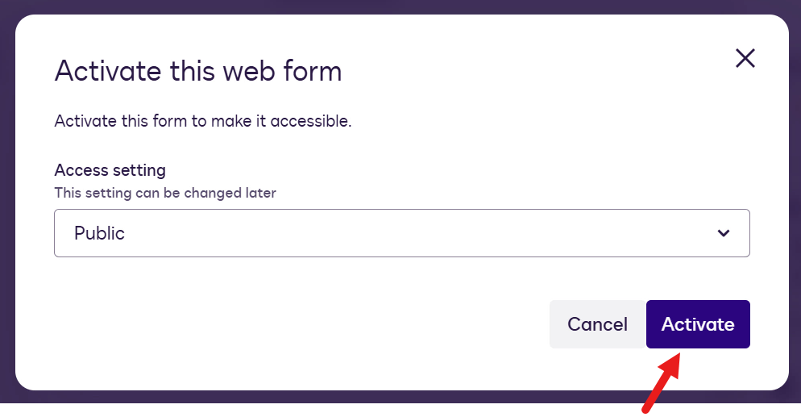

1. A confirmation message will appear to let you know that the web form has been successfully activated. Select **Go to Web Forms**.

    

1. The Web Form will appear with a status of **Active**. Hooray, you've built a web form! 👏🏻

    

### 1.2 Create Document Templates

A Document Template is a reusable setup for sending agreements that lets you pre‑define documents, recipient roles, routing order, and messages, so you can quickly create and send consistent envelopes without starting from scratch each time.

In this lab exercise, we'll create two Document Templates

1. An employment agreement - [download the sample employment agreement](assets/Sample%20Employment%20Agreement.docx)
1. An employee offer letter - [download the sample offer letter](assets/Sample%20Offer%20Letter.docx)

These document templates will be used in the next lab exercise when we create a Maestro workflow.

Let's begin!!! ⤵️

1. Navigate to **Templates** and select **Document Templates** in the left hand side menu pane. Select **Create**.

    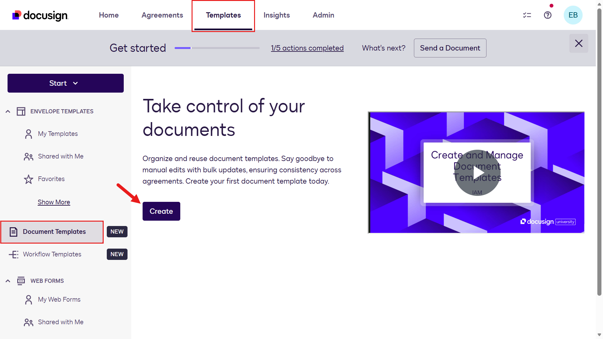

1. We can now select files to upload. Select **Upload**.

    

1. Select the Sample Employment Agreement file. [Download the Sample Employment Agreement](assets/Sample%20Employment%20Agreement.docx) if you haven't already.

    

1. The **Name** field is automatically populated with the file name. In the **Agreement Type** field, select the **chevron icon** and scroll down to the **Human Resources** list of values, select **Offer Letter**.

    

1. Next we'll define the roles for the document template. On the **Fields** left hand side pane, select the **chevron icon** by **Sender 1** and select **Edit recipients**.

    ::: info What is a "Role" in a template? :thinking:
    A role is a placeholder in a template that represents an individual who will act on the document, such as signing or approving. Roles define _who_ is involved and _what action_ they take, while allowing the actual recipient to be assigned when the template is used.

    🐦 **What roles are used for**

    - Define who participates in the agreement
    - Enable reusability of templates across multiple envelopes
    - Allow documents and fields to be prepared without knowing the final recipients

    When someone uses the template, they assign real people (name and email) to each predefined role before sending.
    :::

    

1. Rename the **Signer 1** role to,

    ```text
    Hiring Manager
    ```

    Add a new recipient and name the role as,

    ```text
    Employee
    ```

    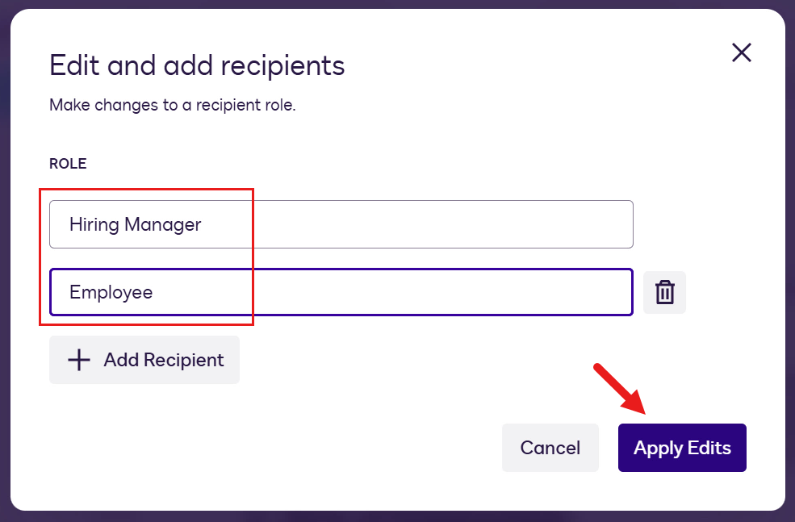

1. Next, we'll replace placeholders in the document with fields. We'll start by switching to the **Sender** role.

    ::: info What is a "Field" in a template? :thinking:
    A field is an interactive element added to a document that captures or displays information for a recipient. Fields are placed on documents so recipients can take action, such as signing or entering data when the envelope is sent.

    🐦 **What fields are used for**

    - Collect recipient input (for example, signatures or entered information)
    - Assign actions to specific recipients or roles (fields are tied to the individual who must act)
    - Pre‑fill information in documents when setting up a template

    In short:
    Fields define where and how recipients interact with the document during the signing process.

    The two fields types we'll be using in this lab exercise are,

    - Standard Fields: Displays the set of primary, out-of-the-box fields that you can add to your document.
    - Custom Fields: User-defined fields created to capture specific data not covered by standard options.
    :::

    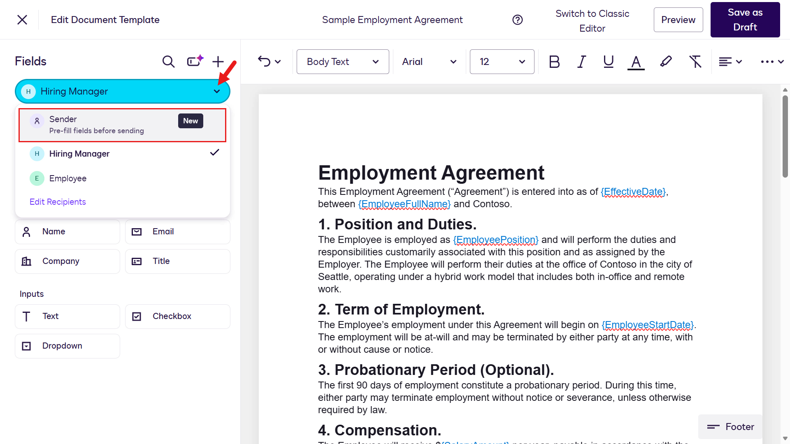

1. Each of the sample documents have blue colored text to easily identify the placeholders of where we'll be adding fields to the template. This is for the purpose of learning and completing the lab exercise so keep in mind you would not have colored text in _Production-used_ templates.

    Highlight the first placeholder `{EffectiveDate}` and select the standard field, **Effective Date**, on the left hand side menu.

    

1. Once selected, the **Effective Date** field will now be added to the template.

    

1. The next field we'll add is a custom field. Highlight the `{EmployeeFullName}`placeholder and select the **+ icon** in the **Fields** pane. Select **Field**.

    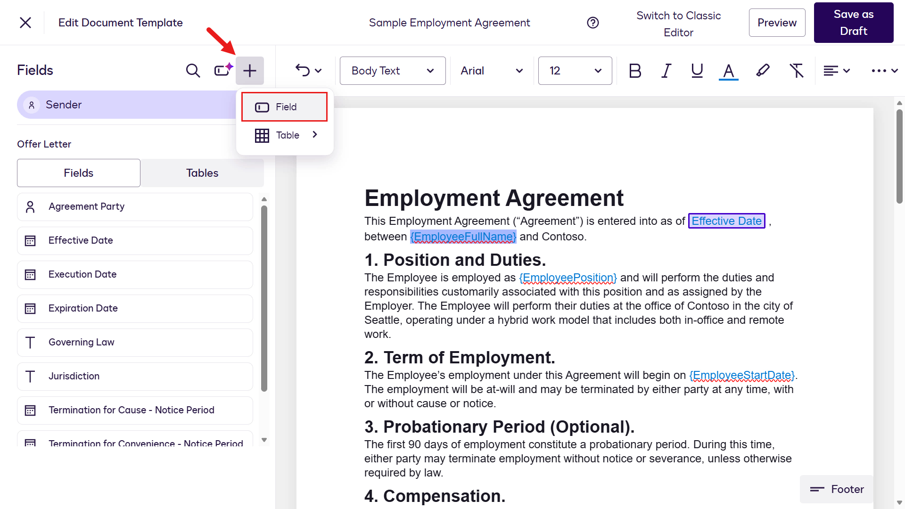

1. In the field attribute fly-out pane, enter the following in the **Field Name**.

    ```text
    Employee Full Name
    ```

    As you type a value into **Field Name**, the template designer searches for an existing field with the same name. If no results are found, you’ll have the option to create a new custom field using the entered value.

    Select the **plus icon** to create a new custom field for Employee Full Name.

    

1. Let's now configure the rest of the attributes. Enter the following in the **Field Description**,

    ```text
    The full name of the employee
    ```

    Enable the **Required Field** option to ensure this field must be completed.

    By default the **Field type** is **Text**. We'll keep as **Text**.

    

1. **Save** the **Employee Full Name** custom field.

    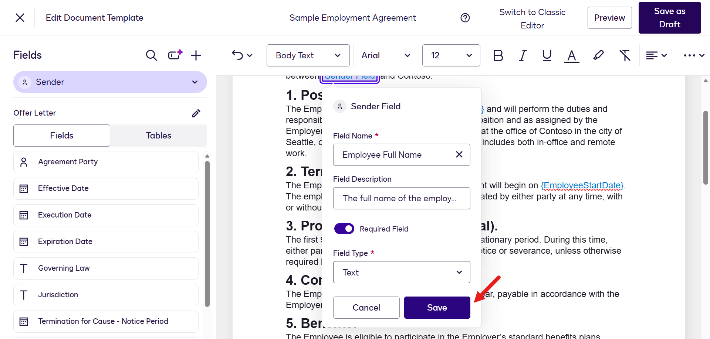

1. Repeat the same steps to add the remaining custom fields, using them in place of the Sender role placeholders.

    | Placeholder              | Field name             | Field description                      | Required field | API reference name         |
    |--------------------------|------------------------|----------------------------------------|----------------|----------------------------|
    | **{EmployeePosition}**   | `Employee Position`    | `Position the employee is fulfilling`  | Yes            | Text                       |
    | **{EmployeeStartDate}**  | `Employee Start Date`  | `The start date of the employee`       | Yes            | Text                       |
    | **{SalaryAmount}**       | `Salary`               | `The salary of the employee`           | Yes            | Text                       |

    

1. Next, we'll add the **Employee Full Name** field to the _**16. Signatures**_ section of the template. Highlight the `{EmployeeFullName}` placeholder and select the corresponding field in the **Fields** left hand side pane.

    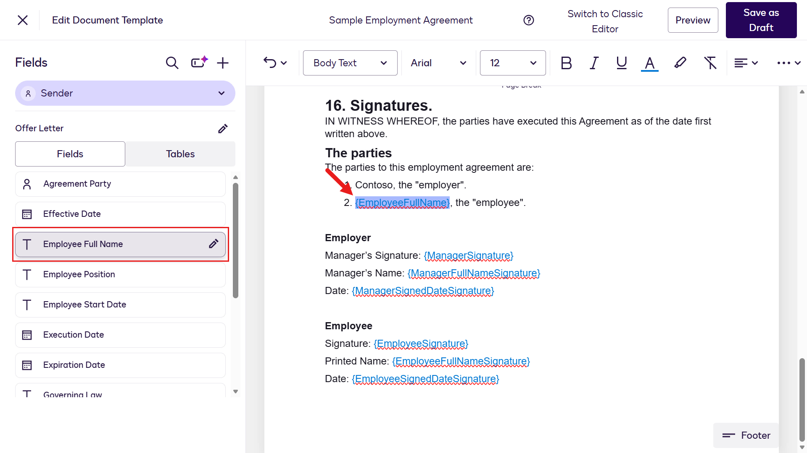

1. We'll now switch to the **Hiring Manager** role to define the fields that this recipient should complete.  On the **Fields** left hand side pane, select the **chevron icon** by **Sender** and select **Hiring Manager**.

    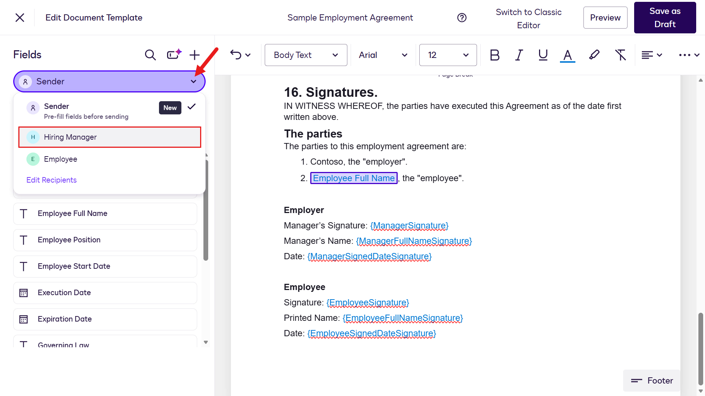

1. Highlight the `{ManagerSignature}` placeholder and select **Signature** in the **Fields** left hand side pane.

    

1. The **Signature** field will now be added.

    

1. Repeat the same steps to add the remaining fields for the **Hiring Manager** role and the **Employee** role.

    ::: tip :computer_mouse: Don't forget to switch roles
    Remember to switch to the Employee role using the chevron icon in the Fields left hand side pane.

    
    :::

    | Role            | Placeholder                          | Field       |
    |-----------------|--------------------------------------|-------------|
    | Hiring Manager  | **{ManagerFullNameSignature}**       | Name        |
    | Hiring Manager  | **{ManagerSignedDateSignature}**     | Date Signed |
    | Employee        | **{EmployeeSignature}**              | Signature   |
    | Employee        | **{EmployeeFullNameSignature}**      | Name        |
    | Employee        | **{EmployeeSignedDateSignature}**    | Date Signed |

1. The Template should now look like the following after the fields for the **Hiring Manager** and **Employee** roles have been added.

    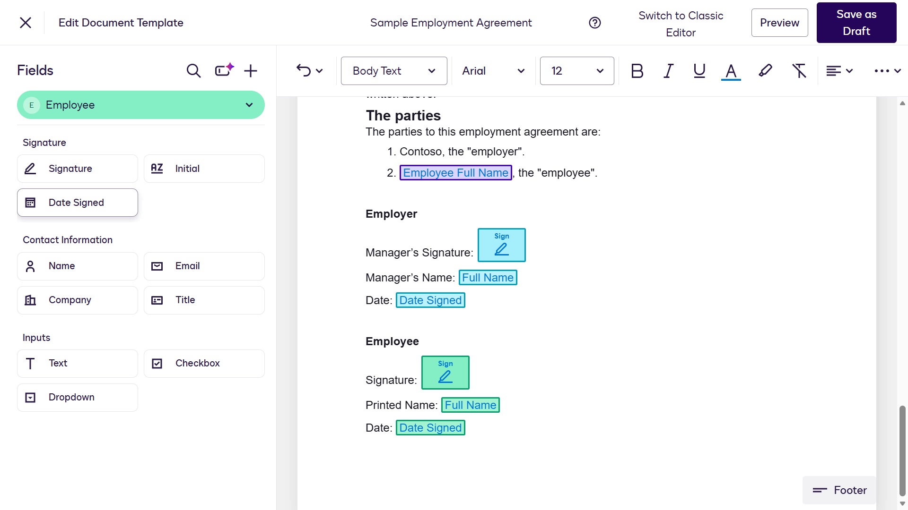

> [!NOTE]
> 🚧 This mission is under construction. Check back soon for the full walkthrough.
