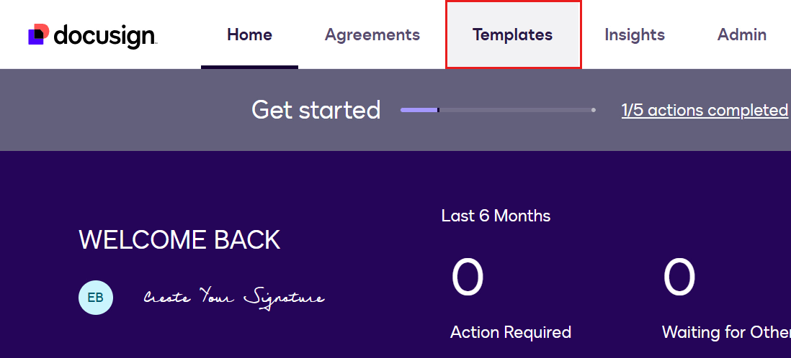
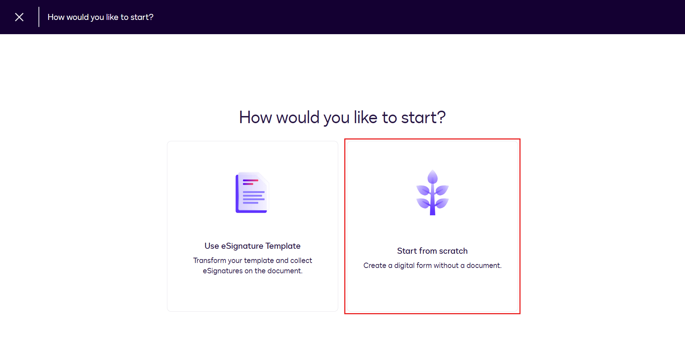
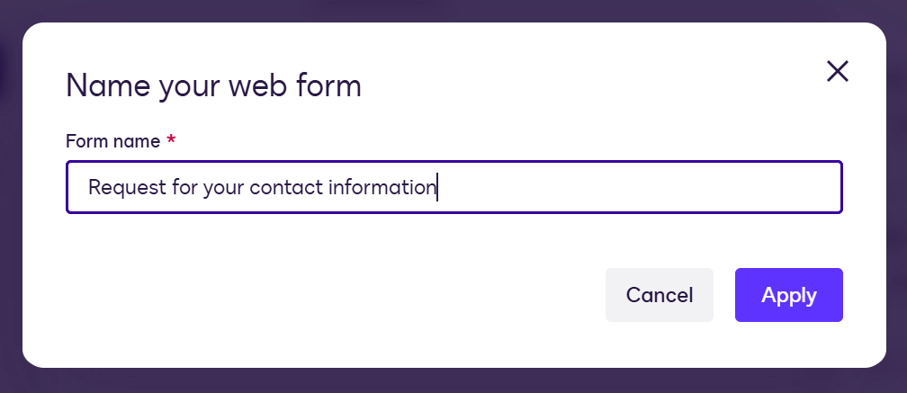

# Microsoft Copilot Studio ➕ Docusign MCP

Welcome, agent. Your objective is simple: reuse what already works. Connect Docusign MCP server to your Copilot Studio agent, and invoke a Maestro workflow to execute an _already-operational_ document automation workflow. You gather the intel. Maestro runs the op. Minimal new logic. Maximum leverage.

## 🎯 Mission Brief

TBC

## 🔎 Objectives

In this mission, you'll learn:

1. How to create Docusign Web Forms, Document Templates and a Maestro workflow
1. How to add the Docusign MCP server as a tool to your agent
1. How to add the Outlook MCP server as a tool to your agent
1. How to invoke the Maestro workflow from the agent
1. How to provide inputs in natural language for the Maestro workflow

## ❓ What is Docusign?

TBC

### Why should I use it?

TBC

## 🧪 Docusign MCP lab

For this Special Ops mission, we're going to:

- 1.0 Create templates and a Maestro workflow in docusign
- 2.0 Build an agent and add the Docusign MCP server as a tool in Copilot Studio
- 3.0 Add the Outlook MCP server as a tool in Copilot Studio
- 4.0 Test end-to-end

### ✅ Prerequisites

To complete this Special Ops mission, you'll need the following outlined in this section.

#### Docusign

- Sign up for a free **Docusign developer account** - browse to [https://developers.docusign.com](https://developers.docusign.com)

#### Microsoft

- Copilot Studio license
- Access to a Microsoft Power Platform environment
- Administrative permissions to create solutions and agents
- A SharePoint site where you have permissions to create a new folder in the Documents library - this will be used in a Maestro workflow step

> [!TIP] Prerequisites help:
> If you need help getting a Copilot Studio license, please reference the [Recruit Course Setup lab](./../../recruit/00-course-setup/index.md) which walks you through setting up a Power Platform environment with a Copilot Studio trial.

#### Two email addresses

You'll need two different email addresses to complete this lab:

- Email address to use as the employee
- Email address to use as the hiring manager

### 1.1 Create a Docusign Web Form

> [!IMPORTANT]
> You need a Docusign developer account to complete these Docusign lab exercises. Sign up for free at [https://developers.docusign.com](https://developers.docusign.com)

1. From the Home page of Docusign developers portal, select **Templates**.

    

1. On the left hand side navigation pane, select **Start**. Select **Web Forms** followed by **Create Web Form**.

    

1. We'll now be asked how we want to create our Web Form. Select **Start From Scratch**.

    

1. Enter a name for the Web Form. For example,

    ```text
    Request for your contact information
    ```

    

1. The Web Form designer will next appear. This is where we can add pages and fields to the Web Form. By default there will be 3 pages - Welcome page, Untitled page, Thank you page.

    In the **Welcome page** update the following fields,

    **Page title**

    ```text
    👋🏻 Hey there!
    ```

    **Page subtitle**

    ```text
    As we kick-off the next stage in sending you an offer, we need some details from you.

    Please complete this form and shortly after you'll receive an Employment Agreement and Offer Letter.
    ```

1. Next, select the **Untitled** page and update the following fields,

    **Page title**

    ```text
    Your name
    ```

    **Page subtitle**

    ```text
    Please provide us with your name
    ```

    **API reference name**

    ```text
    CandidateName
    ```

> [!NOTE]
> 🚧 This mission is under construction. Check back soon for the full walkthrough.
