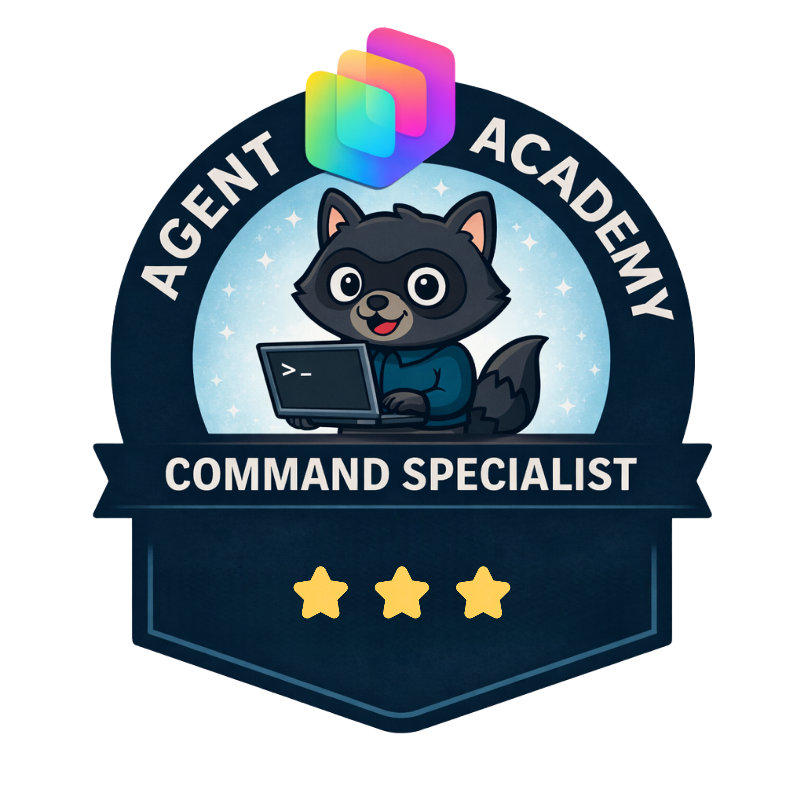

# Special Ops

Special Ops are focused, one-off missions designed to sharpen your skills in a specific area.

If you want comprehensive, end-to-end training, explore the Courses sections first. Courses are full programs where each mission builds on the previous one, helping you develop deep, connected understanding over time.

Special Ops missions are different by design: they are standalone labs for targeted learning. A mission might focus on a specific tool (for example, MCP), a practical integration pattern, or an industry-specific scenario.

Use Special Ops when you need fast, practical training on a defined topic.

## Special Ops Missions

<!-- markdownlint-disable MD033 -->
| Mission | Badge | Difficulty | Time |
| --- | --- | --- | --- |
| [Microsoft Copilot Studio ❤️ MCP](./mcs-mcp/index.md) |  | ⭐⭐⭐ | ~30 min |
| [Microsoft Learn Docs MCP](./ms-learn-mcp/index.md) |  | ⭐ | ~15 min |
| [Power Platform CLI MCP Server](./pac-cli-mcp/index.md) |  | ⭐⭐⭐ | ~30 min |

<!-- markdownlint-enable MD033 -->
More Special Ops missions will be added here soon!
