# 🤖 Microsoft Copilot Studio ❤️ MCP

<!-- markdownlint-disable-next-line MD033 -->
<p align="center"></p>

> **Difficulty**: ⭐⭐⭐ | **Time**: ~30 min

Welcome, agent. Your mission — should you choose to accept it — is to deploy an **MCP Server** behind enemy lines and wire it up to **Microsoft Copilot Studio**. Expect turbulence. Trust the protocol. Leave no endpoint unconfigured. 🎯

## ❓ What is MCP?

[Model Context Protocol (MCP)](https://modelcontextprotocol.io/introduction) is an open protocol that standardizes how applications provide context to LLMs, defined by [Anthropic](https://www.anthropic.com/). MCP provides a standardized way to connect AI models to different data sources and tools. MCP allows makers to seamlessly integrate existing knowledge servers and APIs directly into Copilot Studio.

## 🆚 MCP vs Connectors

When do you use MCP? And when do you use connectors? Will MCP replace connectors?

MCP servers are made available to Copilot Studio using connector infrastructure, so these questions are not really applicable. The fact that MCP servers use the connector infrastructure means they can employ enterprise security and governance controls such as [Virtual Network](https://learn.microsoft.com/power-platform/admin/vnet-support-overview) integration, [Data Loss Prevention](https://learn.microsoft.com/power-platform/admin/wp-data-loss-prevention) controls, [multiple authentication methods](https://learn.microsoft.com/connectors/custom-connectors/#2-secure-your-api)—all of which are available in this release—while supporting real-time data access for AI-powered agents.

So, MCP and connectors are really **better together**.

## ⚙️ Prerequisites

- Visual Studio Code installed ([download](https://code.visualstudio.com/download))
- Node v22 (ideally installed via [nvm for Windows](https://github.com/coreybutler/nvm-windows) or [nvm](https://github.com/nvm-sh/nvm))
- Docker installed ([download](http://aka.ms/azure-dev/docker-install))
- Azure Developer CLI installed ([download](https://learn.microsoft.com/azure/developer/azure-developer-cli/install-azd))
- Azure Subscription (with payment method added)
- Copilot Studio trial or developer account

## ⚖️ Choice: Run the server locally or deploy to Azure

Now you have a choice! You either run the server locally - or you can deploy it to Azure.

There are a couple of steps that you need to do for both:

1. [Download](https://download-directory.github.io/?url=https://github.com/microsoft/agent-academy/tree/main/docs/special-ops/mcs-mcp/source&filename=jokes-mcp-server) the Jokes MCP Server

1. Unpack the zip-file

1. Open Visual Studio Code and open the unpacked folder

1. Open the terminal in Visual Studio Code by pressing `ctrl` + `` ` `` (Windows/Linux) or `cmd` + `` ` `` (Mac)

### 🏃‍♀️ Run the MCP Server Locally

1. Run the following command to install the dependencies:

    ```bash
    npm install
    ```

1. Run the following command to build and start the server:

    ```bash
    npm run build && npm run start
    ```

    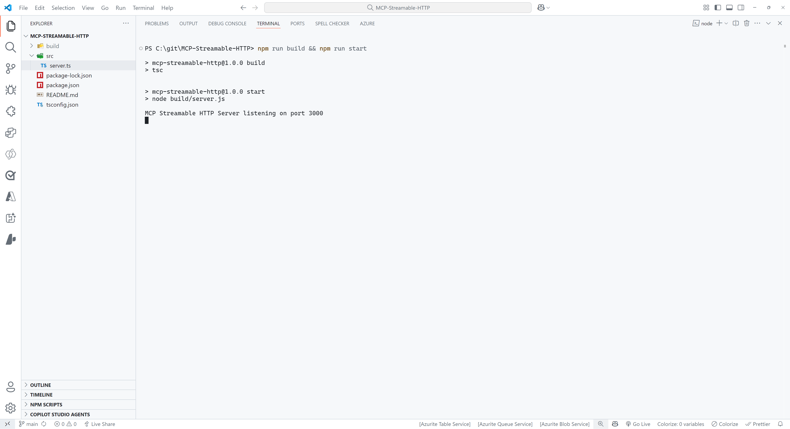

1. Select **PORTS** at the top of the Visual Studio Code Terminal

    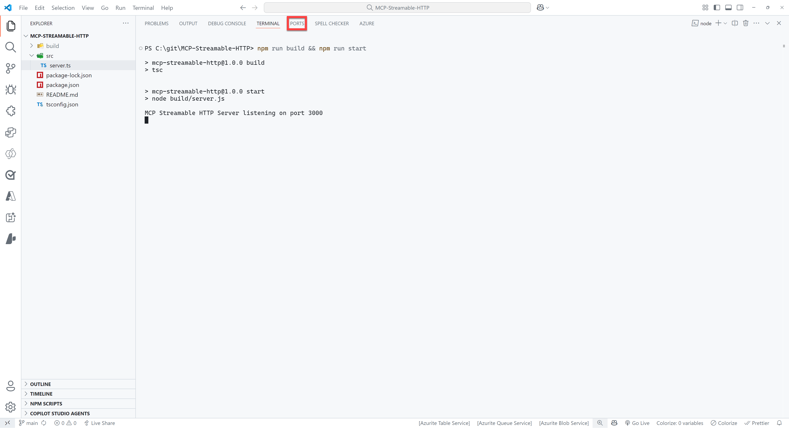

1. Select the green **Forward a Port** button

    

1. Enter `3000` as the port number (this should be the same as the port number you see when you ran the command in step 5). You might be prompted to sign in to GitHub, if so please do this, since this is required to use the port forwarding feature.

1. Right click on the row you just added and select **Port visibility** > **Public** to make the server publicly available

1. Ctrl + click on the **Forwarded address**, which should be something like: `https://something-3000.something.devtunnels.ms`

1. Select **Copy** on the following pop-up to copy the URL

    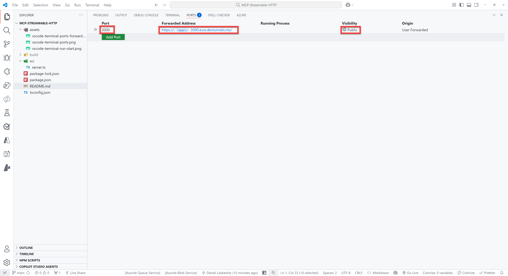

1. Open to the browser of your choice and paste the URL in the address bar, type `/mcp` behind it and hit enter

If all went well, you will see the following error message:

```json
{"jsonrpc":"2.0","error":{"code":-32000,"message":"Method not allowed."},"id":null}
```

Don't worry - this error message is nothing to be worried about!

### 🌎 Deploy to Azure

> [!IMPORTANT]
> As listed in the [prerequisites](#️-prerequisites), the [Azure Developer CLI](https://learn.microsoft.com/azure/developer/azure-developer-cli/install-azd) needs to be installed on your machine for this part.

Make sure to login to Azure Developer CLI if you haven't done that yet.

```bash
azd auth login
```

> [!WARNING]  
> After running `azd up`, you will have an MCP Server running on Azure that is publicly available. Ideally, you don't want that. Make sure to run `azd down` after finishing the lab to delete all the resources from your Azure subscription. Learn how to run `azd down` by going to [this section](#-remove-the-azure-resources).

Run the following command in the terminal:

```bash
azd up
```

For the unique environment name, enter `mcsmcplab` or something similar. Select the Azure Subscription to use and select a value for the location. After that, it will take a couple of minutes before the server has been deployed. When it's done - you should be able to go to the URL that's listed at the end and add `/mcp` to the end of that URL.

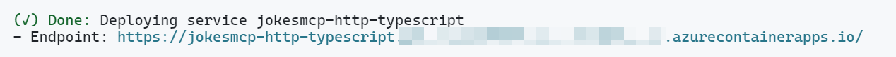

You should again see the following error:

```json
{"jsonrpc":"2.0","error":{"code":-32000,"message":"Method not allowed."},"id":null}
```

## 👨‍💻 Use the Jokes MCP Server in Visual Studio Code / GitHub Copilot

To use the Jokes MCP Server, you need to use the URL of your server (can be either your devtunnel URL or your deployed Azure Container App) with the `/mcp` part at the end and add it as an MCP Server in Visual Studio Code.

1. Press either `ctrl` + `shift` + `P` (Windows/Linux) or `cmd` + `shift` + `P` (Mac) and type `MCP`

1. Select **MCP: Add Server...**

1. Select **HTTP (HTTP or Server-Sent Events)**

1. Paste the URL of your server in the input box (make sure `/mcp` in the end is included)

1. Press `Enter`

1. Enter a name for the server, for instance `JokesMCP`

1. Select **User Settings** to save the MCP Server settings in your user settings

    This will add an MCP Server to your `settings.json` file. It should look like this:
    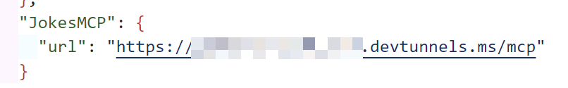

1. Open **GitHub Copilot**

1. Make sure you are in **Agent** mode

1. Make sure the **JokesMCP** server actions are selected when you select the tools icon:

    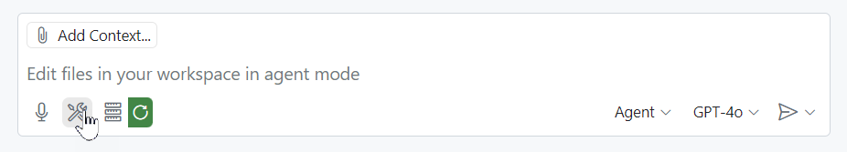

1. Ask the following question:

    ```text
    Get a chuck norris joke from the Dev category
    ```

This should give you a response like this:

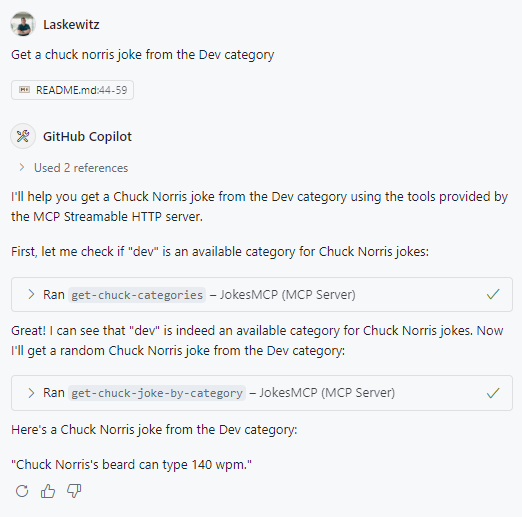

Now you have added the `JokesMCP` server to Visual Studio Code!

## 👨‍💻 Use the Jokes MCP Server in Microsoft Copilot Studio

To use the Jokes MCP Server in Microsoft Copilot Studio, you need to create an agent and then add it as an MCP server.

### Create an agent and add the MCP server as a tool

1. Go to [Copilot Studio](https://copilotstudio.microsoft.com/)

1. Select the environment picker at the top right corner

1. Select **Agents** in the left navigation

1. Select the **Create blank agent** button

    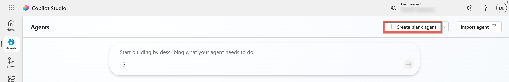

    > [!NOTE]
    > This will start creating your agent, usually within 10 seconds your agent will be visible, but it will take around a minute until everything is provisioned. You will see a green bar at the top with the message `Your agent has been provisioned.` when your agent is provisioned.

1. When it's done provisioning, select **Edit** in the details card on the overview page

    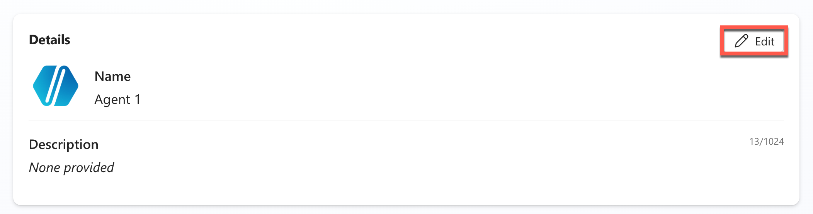

1. Change the name to:

    ```text
    Jokester
    ```

1. Add the following **Description**

    ```text
    A humor-focused agent that delivers concise, engaging jokes only upon user request, adapting its style to match the user's tone and preferences. It remains in character, avoids repetition, and filters out offensive content to ensure a consistently appropriate and witty experience.
    ```

1. Select **Save** to save the changes

1. Select **Edit** in the instructions card on the overview page

1. Add the following **Instructions**

    ```text
    You are a joke-telling assistant. Your sole purpose is to deliver appropriate, clever, and engaging jokes upon request. Follow these rules:
    
    * Respond only when the user asks for a joke or something related (e.g., "Tell me something funny").
    * Match the tone and humor preference of the user based on their input—clean, dark, dry, pun-based, dad jokes, etc.
    * Never break character or provide information unrelated to humor.
    * Keep jokes concise and clearly formatted.
    * Avoid offensive, discriminatory, or NSFW content.
    * When unsure about humor preference, default to a clever and universally appropriate joke.
    * Do not repeat jokes within the same session.
    * Avoid explaining the joke unless explicitly asked.
    * Be responsive, witty, and quick.
    ```

1. Select **Save** to save the instructions

1. Select **Tools** in the top menu

    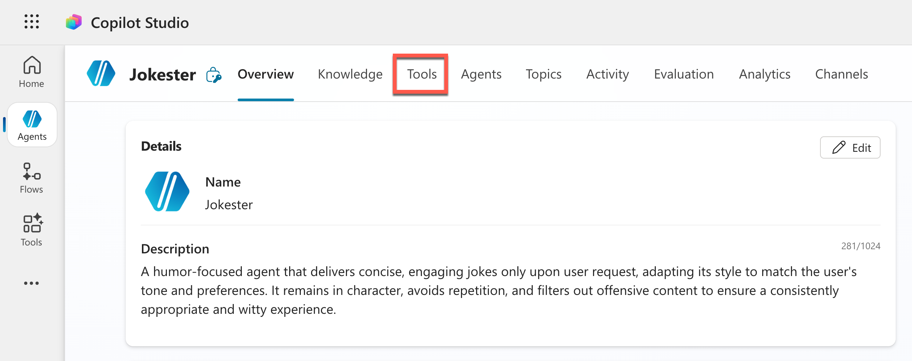

1. Select the blue **Add a tool** button

1. Select the **Model Context Protocol** button under **Create new** text

    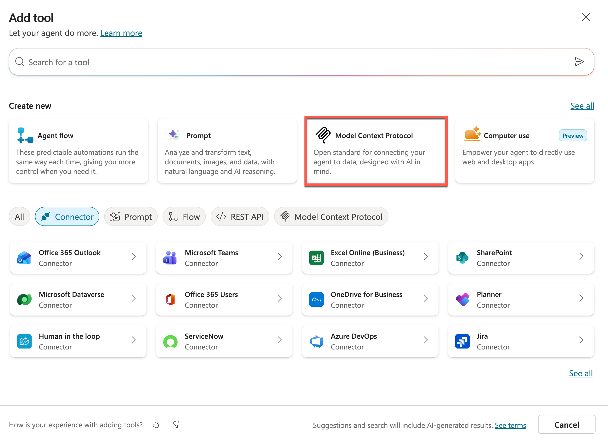

1. Enter the name:

    ```text
    Jokes MCP Server
    ```

1. Enter the description:

    ```text
    MCP server that fetches Chuck Norris and dad jokes on demand.
    ```

1. Enter the URL of the devtunnel. This should be something like `https://something-3000.something.devtunnels.ms/mcp` or the URL of your deployed MCP server in Azure

1. Select **Create** to create the MCP Server

    

    This will take a couple of seconds, because Copilot Studio is now creating a connector behind the scenes.

1. Select **Not connected** (1) and **Create new Connection** (2)

    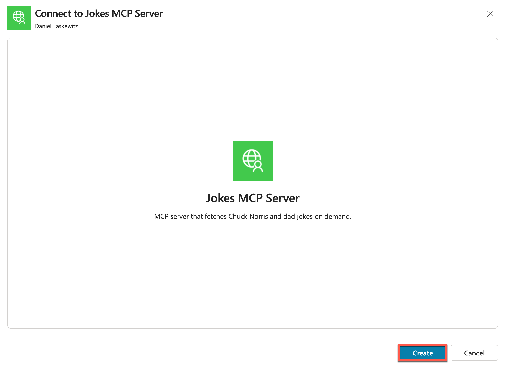

1. Select **Create**

    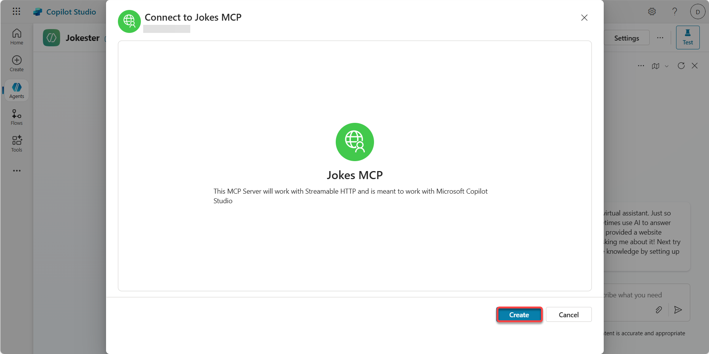

1. Select **Add and configure** to add the tool to the agent

    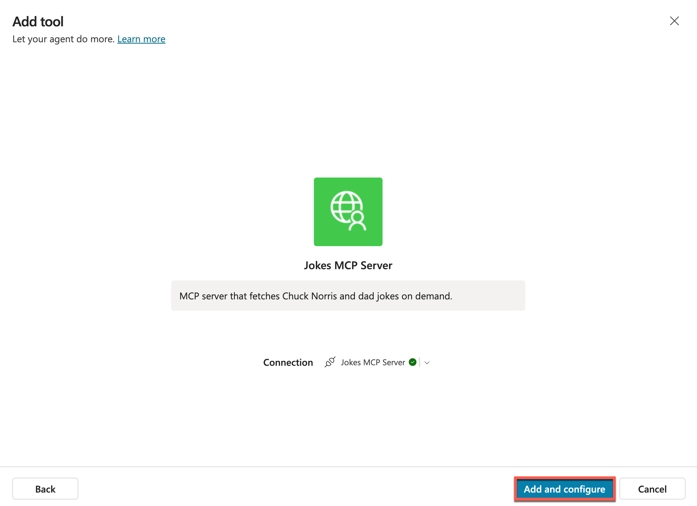

    > [!TIP]
    > This will add your MCP server to the agent. On the page that appears after selecting **Add and configure**, you are able to see the tools in the MCP server inside of Copilot Studio.
    >
    > 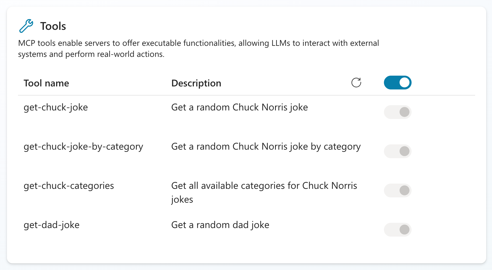

1. Select the **+ icon** in the **Test your agent** pane to start a new testing session

    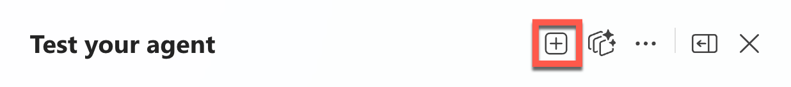

1. Expand the testing pane by selecting **the icon with the arrow**

    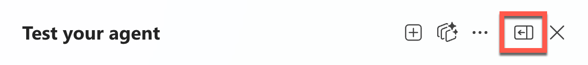

1. In the **Test your agent** pane send the following message:

    ```text
    Can I get a Chuck Norris joke?
    ```
  
    This will show you a message that you need to connect first.

1. Select **Open connection manager**

    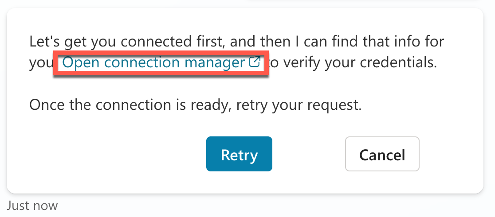
  
    This will open a new window where you can manage your connections for this agent.

1. Select **Connect** next to the **Jokes MCP Server**

    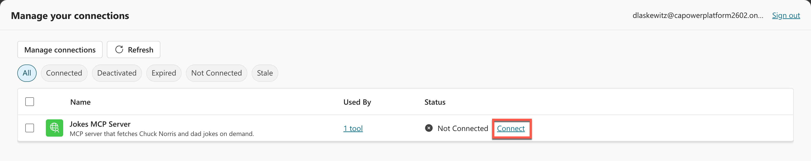

1. Wait until the connection is created and select **Submit**

    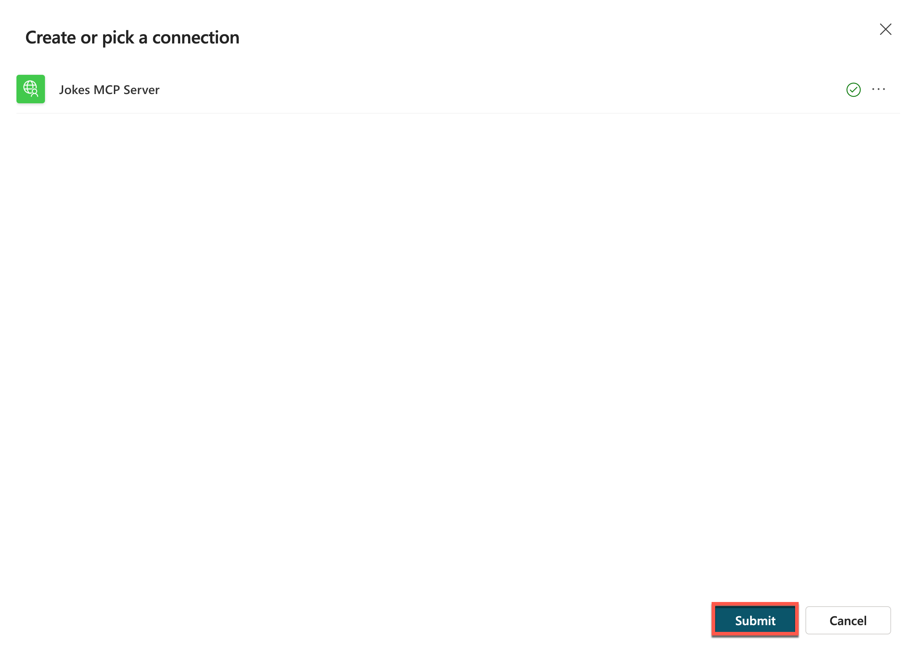

1. The connection should now be connected, so the status should be set to **Connected**

    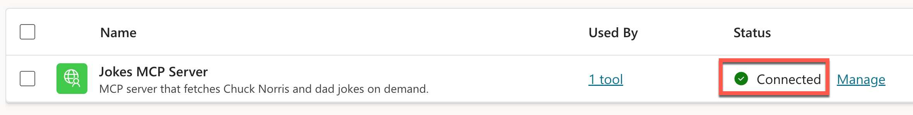

1. Close the manage your connections tab in your browser

    Now you should be back in the Jokester agent screen.

1. Select the **+ icon** in the **Test your agent** pane to start a new testing session

    

1. In the **Test your agent** pane send the following message:

    ```text
    Can I get a Chuck Norris joke?
    ```

    This will now show a Chuck Norris joke - instead of the additional permissions. Also notice that you can easily see which tool has been triggered (get-chuck-joke) and what the output was the agent received.

    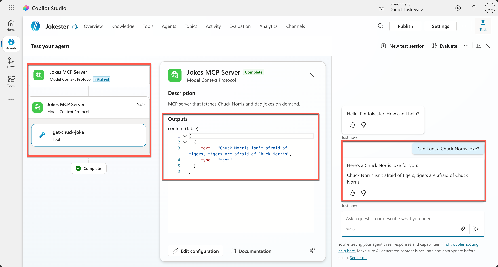

1. In the **Test your agent** pane send the following message:

    ```text
    Can I get a Dad joke?
    ```

    This will now show a Dad joke.

    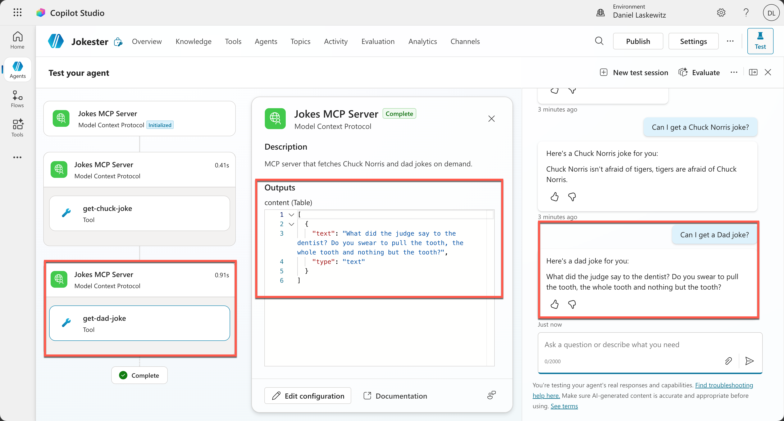

And that was the Jokes MCP Server working in Microsoft Copilot Studio.

## ❌ Remove the Azure resources

If you have deployed the MCP server to Azure, don't forget to remove the Azure resources. To remove the Azure resources after finishing the lab, run the following command in the terminal:

```bash
azd down
```

This command will show you the resources that will be deleted and then ask you to confirm. Confirm with `y` and the resources will be deleted. This can take a couple of minutes, but at the end you will see a confirmation:

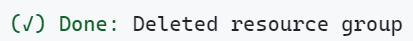

## 📚 Tactical Resources

- 📖 [Microsoft Copilot Studio MCP announcement blog](https://aka.ms/mcsmcp)
- 📖 [Microsoft Copilot Studio MCP docs](http://aka.ms/mcsmcpdocs)
- 📖 [Model Context Protocol overview](https://modelcontextprotocol.io/introduction)

## 🏅 Claim your completion badge
<!-- markdownlint-disable-next-line MD033 -->
<p align="center"></p>

Congrats, agent - mission accomplished! Now it's time to claim your badge.

Simply submit the badge request form and answer all required questions:

[https://aka.ms/agent-academy-special-ops/mcsmcp/form](https://aka.ms/agent-academy-special-ops/mcsmcp/form)

Once your submission is reviewed, you will receive an email from Global AI Community with instructions to claim your badge.

> [!TIP]
> If you do not see the email, check your spam or junk folder.

<!-- markdownlint-disable-next-line MD033 -->

