---
tags:
  - mcp
difficulty: 1
time: 15
description: >-
  Connect the Microsoft Learn Docs MCP Server to a Copilot Studio agent for
  real-time documentation access.
badge: ./assets/Academy_LearnMCP_Badge.png
products:
  - copilot-studio
  - microsoft-learn
industries:
  - it
created-date: 2026-03-12
last-edited-date: 2026-03-17
---

# 📚 Microsoft Learn MCP Server {#microsoft-learn-mcp-server}

<mission-meta />

<!-- markdownlint-disable-next-line MD033 -->
<p align="center">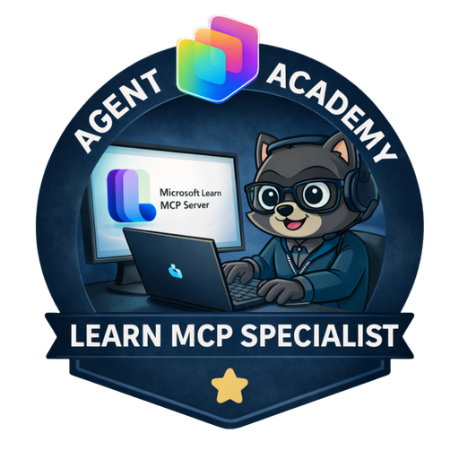</p>

Welcome, agent. Your mission — should you choose to accept it — is **Operation Open Book**: connect the **Microsoft Learn Docs MCP Server** to a Copilot Studio agent, giving it real-time access to the entire Microsoft Learn documentation library. No more agents responding with outdated or hallucinated product information. Your agent is about to become the most well-read operative in the field. 📖🎯

## 🔧 What You'll Build {#what-youll-build}

- A Copilot Studio agent connected to the hosted Microsoft Learn Docs MCP Server
- A working MCP connection that surfaces `microsoft_docs_search` and related tools to your agent
- An agent capable of accurately answering questions about any Microsoft product using live documentation

## ⚙️ Prerequisites {#prerequisites}

- Microsoft Copilot Studio trial or paid account. If you don't have an account, check out the [course setup](https://microsoft.github.io/agent-academy/recruit/00-course-setup/) instructions to see how to get a free trial.

> [!NOTE]
> No local tooling required. The Microsoft Learn MCP Server is a **remote, hosted server**. This is one of the easiest ways to get started with MCP in Copilot Studio.

### What is the Microsoft Learn MCP Server?

Think of the Microsoft Learn MCP Server as a **live library card for your agent**. Instead of painstakingly adding individual Microsoft documentation sources as knowledge, you hand the agent a permanent card that lets it walk into the Microsoft Learn library and look anything up — right when a user asks.

The server is openly hosted by Microsoft at:

```text
https://learn.microsoft.com/api/mcp
```

It implements the Model Context Protocol (MCP), an open standard that gives AI models a consistent way to call external tools. Because the Microsoft Learn server is **remote and publicly accessible**, you don't need to write a single line of backend code to use it. You just point Copilot Studio at the endpoint and start querying.

### What can it do?

Once connected, the server exposes tools your agent can invoke during a conversation. The primary tool is `microsoft_docs_search`, which queries the full Microsoft Learn documentation index and returns relevant content. Your agent can use this to:

- Answer questions about Power Platform, Azure, Microsoft 365, and more
- Return links to official, up-to-date documentation pages
- Reduce hallucinations by grounding responses in real Microsoft content

There is also a `microsoft_code_sample_search` tool which browses Learn for relevant sample code to use.

### Why this matters

Without external grounding, agents rely on model memory, which can be outdated. But even adding the Microsoft Learn root URL as static knowledge has limits: it depends on periodic indexing, may miss deep or newly published pages, and does not perform live, intent-based retrieval for each question. The Microsoft Learn MCP Server solves that by letting your agent run real-time documentation searches at response time, so answers are based on the latest relevant pages, including newly released guidance and product updates.

## 🎯 The Scenario {#the-scenario}

Zava is building an internal agent to support employees with Microsoft 365, Azure, and Power Platform questions. Rather than manually curating a knowledge base of Microsoft product docs, the team wants their agent to pull answers directly from Microsoft Learn in real time — always accurate, always current. You are the agent builder tasked with wiring this up.

## 🧪 Lab 1.1 - Create the Support Agent {#lab-11-create-the-support-agent}

The first step is to create a new Copilot Studio agent that will serve as the foundation for your Microsoft Learn-powered helpdesk.

1. Navigate to [Microsoft Copilot Studio](https://copilotstudio.microsoft.com) and sign in.

1. Select **Create Agent** on the home page.

    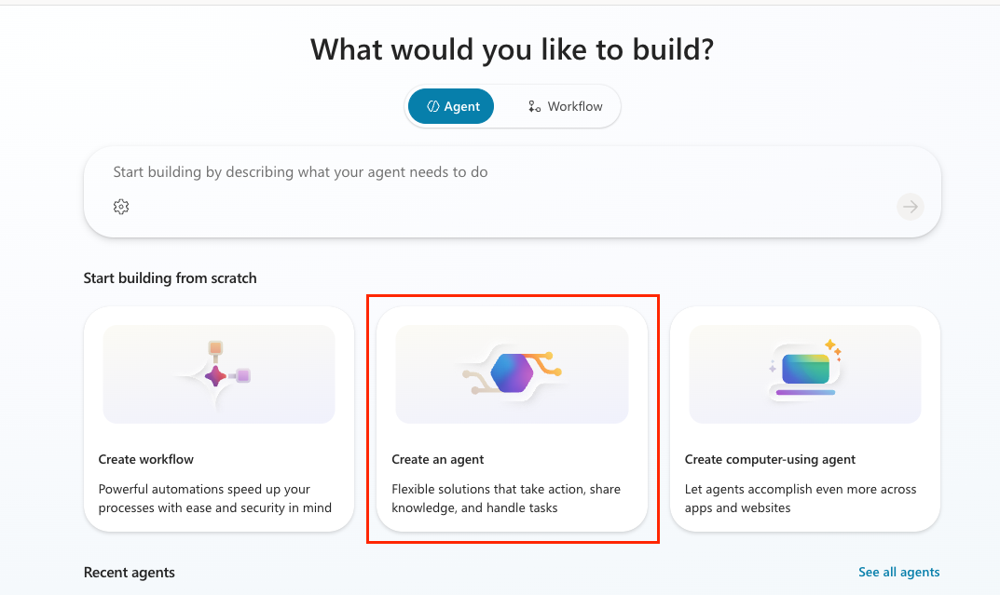

1. Select **Edit** in the Details section

    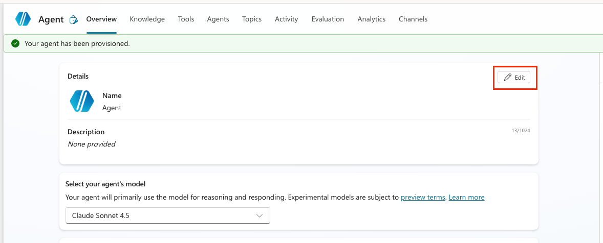

1. Enter the following in the **Name** field:

    ```text
    Microsoft Product Support Assistant
    ```

1. Enter the following in the **Description** field:

    ```text
    An agent that answers questions about Microsoft products by searching live Microsoft Learn documentation.
    ```

1. Select **Save**

    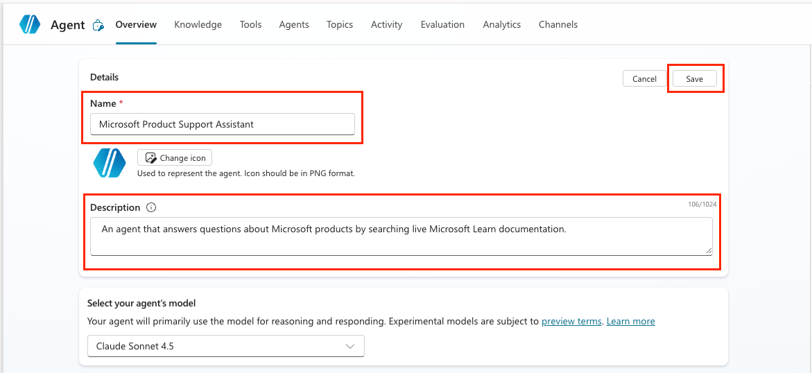

## 🧪 Lab 1.2 - Connect the Microsoft Learn Docs MCP Server {#lab-12-connect-the-microsoft-learn-docs-mcp-server}

Next, you'll add the Microsoft Learn Docs MCP Server as a tool in Copilot Studio, making its tools available to your agent.

1. Select the **Add tool** button in the Tools section.

    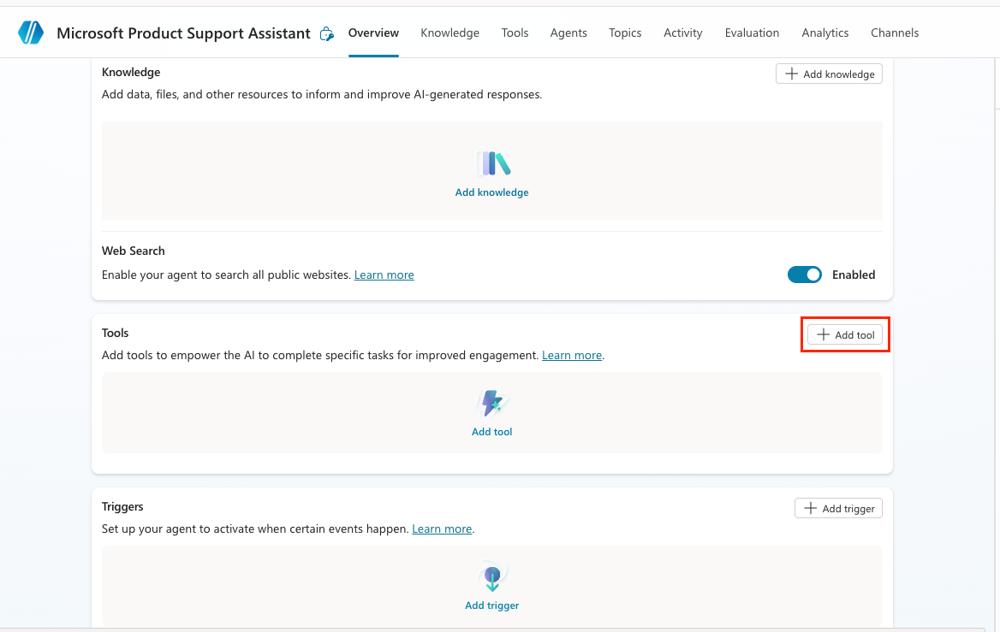

1. Select the **Model Context Protocol** tab and search for `Microsoft Learn`. Select the **Microsoft Learn Docs MCP Server** from the list of options.

    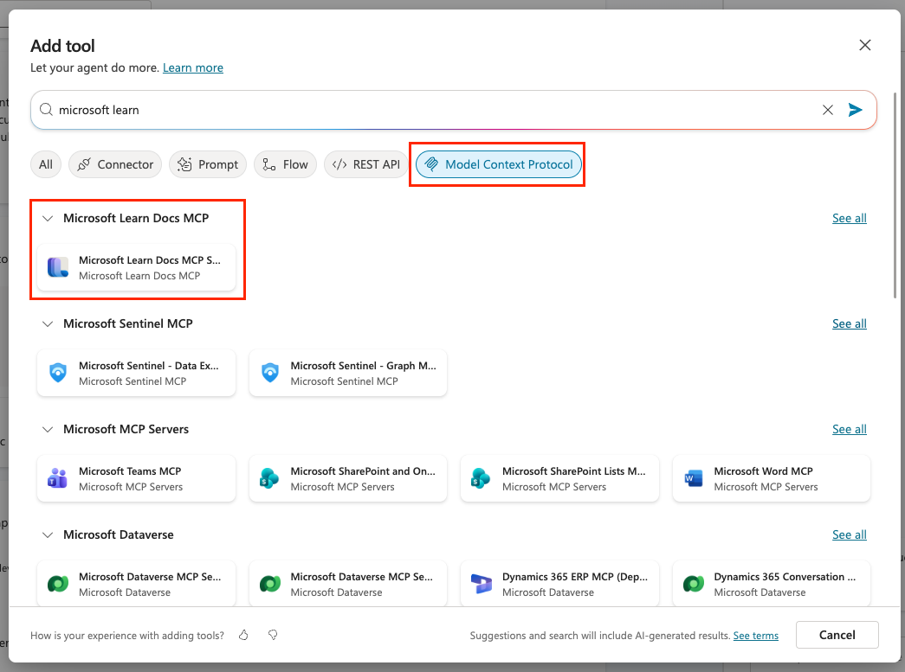

1. Select the dropdown next to **Connection** and select **Create new connection** to create a new connection to the MCP server.

    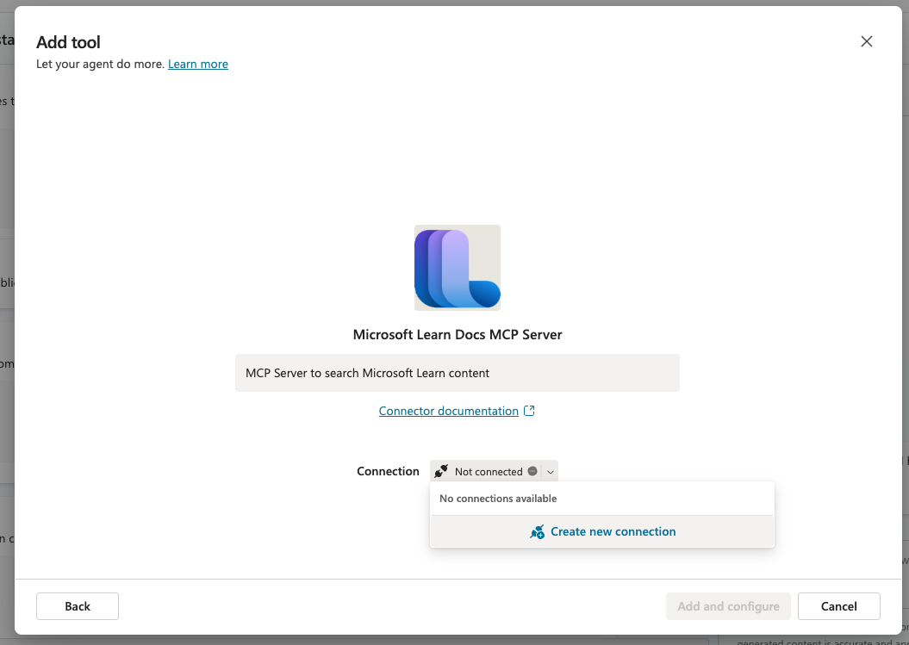

1. Select **Create** to create the connection

    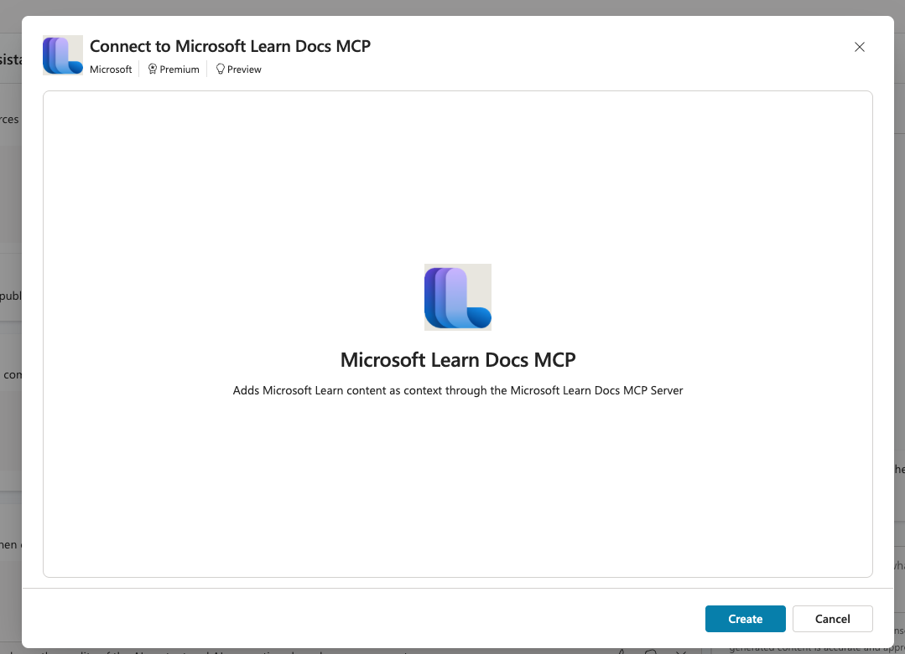

1. Select **Add and configure**

    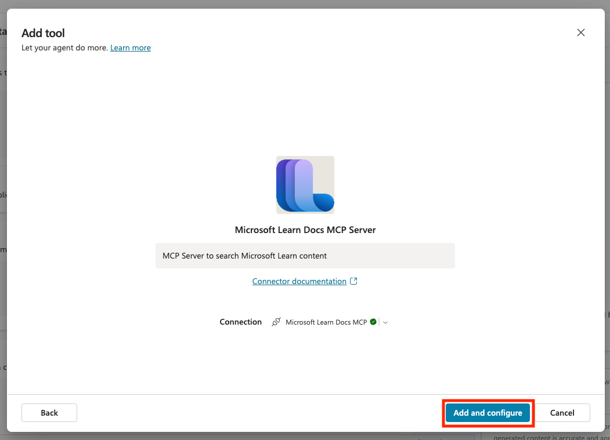

1. You'll be taken to the MCP details screen. Scroll down to the **Tools** section and notice that this comes with three separate tools and how you can enable and disable which tools you want to allow the agent to use by toggling them on and off.

    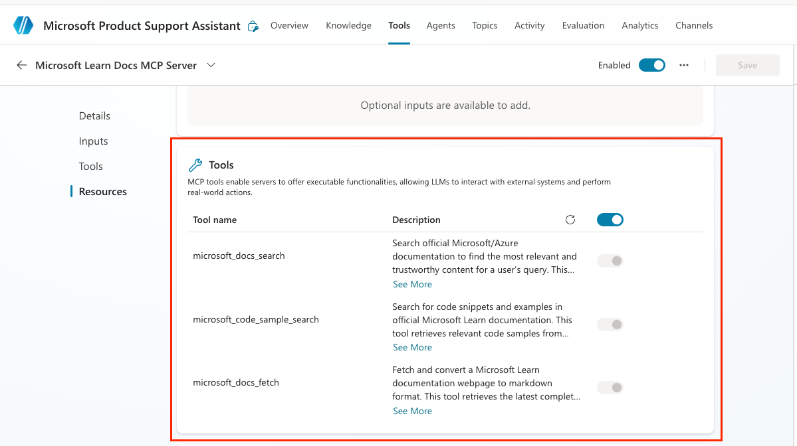

## 🧪 Lab 1.3 - Add Instructions {#lab-13-add-instructions}

Now that we have the Learn MCP server added, we need to add instructions for the agent so it knows what it's supposed to do.

1. Select the **Overview** tab to go back to the overview screen for your agent.

1. Select **Edit** next to the Instructions section.

    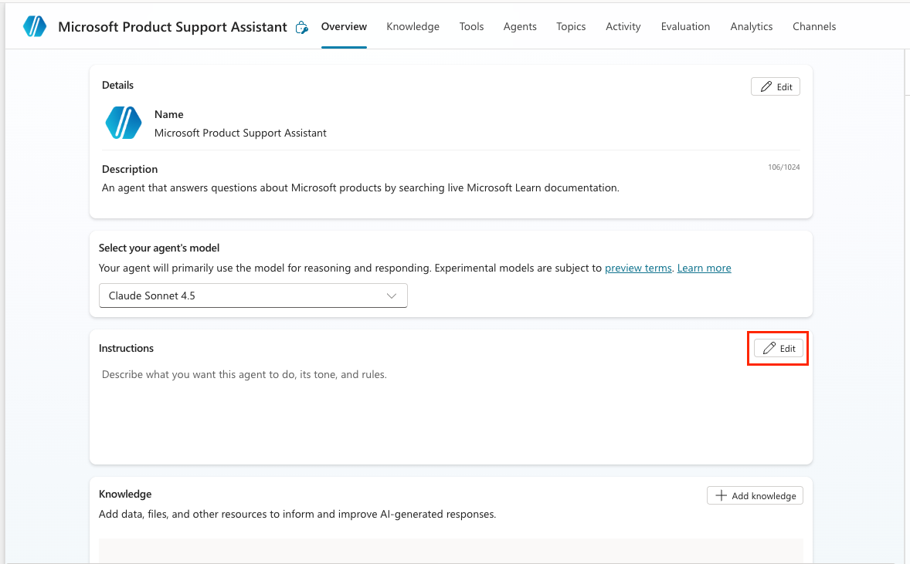

1. Enter the following in the **Instructions** field:

    ```text
    You are a helpful Microsoft documentation assistant. When a user asks a question about any Microsoft product, service, or technology, use the microsoft_docs_search tool to find relevant, accurate information from Microsoft Learn. If a user asks a question about a code sample, use the microsoft_code_sample_search tool to find a relevant code sample. Always cite the source documentation URL in your response. If the search does not return a relevant result, tell the user and suggest they visit https://learn.microsoft.com directly.
    ```

> [!TIP]
> Strong instructions are critical when using MCP tools. The instruction to "use the microsoft_docs_search tool" explicitly tells the agent to invoke the MCP tool rather than relying on any built-in knowledge you might have added.

1. Select **Save**

    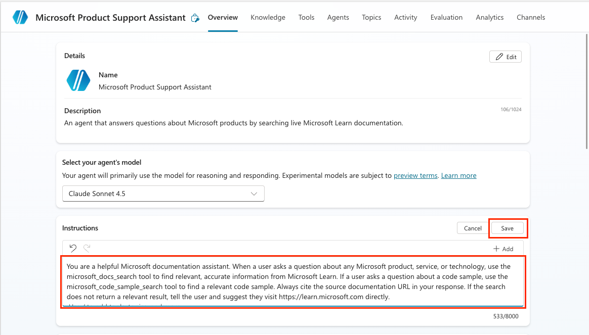

## 🧪 Lab 1.4 - Test Your Agent {#lab-14-test-your-agent}

Time to see your documentation-powered agent in action.

1. Select **Test** in the top-right corner to open the test panel.

1. Send the following message:

    ```text
    What types of agents can I build in Copilot Studio?
    ```

1. The first time you run the agent, it might ask you to verify your connection to the MCP server. If you see this, select the **Open Connection Manager** text.

    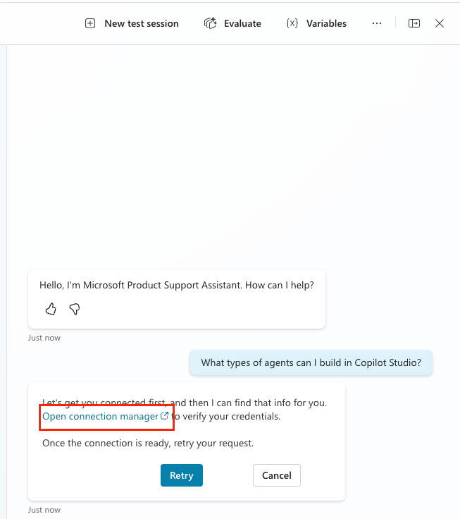

1. Select the **Connect** option to connect to the MCP Server.

    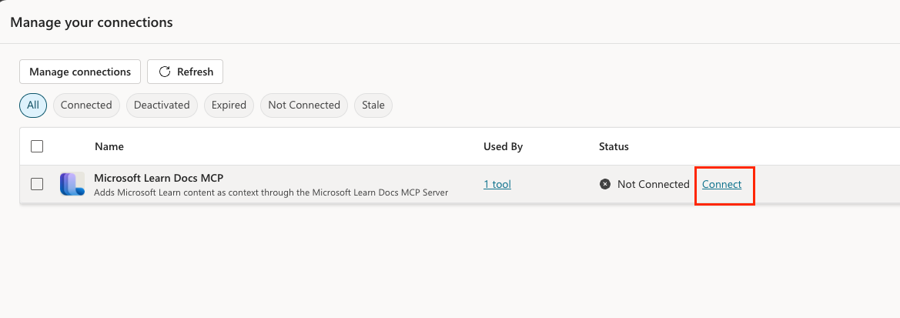

1. Select **Submit**

    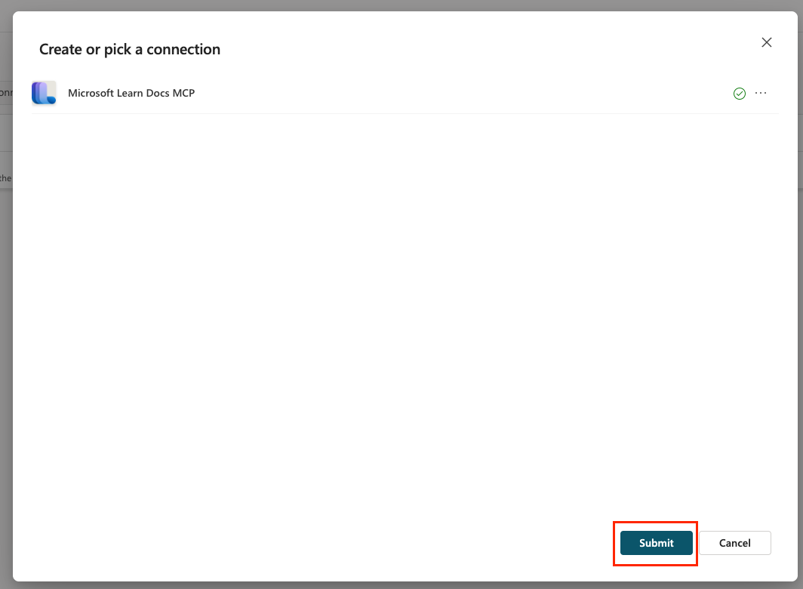

1. Verify that you see the **Connected** status. Close out of the connections window and go back to your agent.

    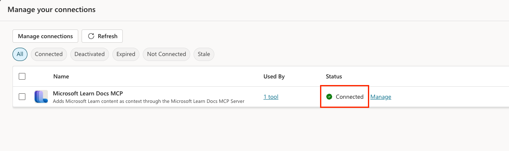

1. Select **Retry** in your test window

    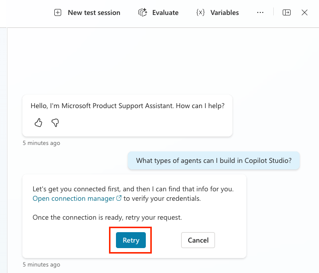

1. Observe the agent's response. It should:
    - Invoke the `microsoft_docs_search` tool from the MCP server and return a grounded answer with a link to the Microsoft Learn documentation page

    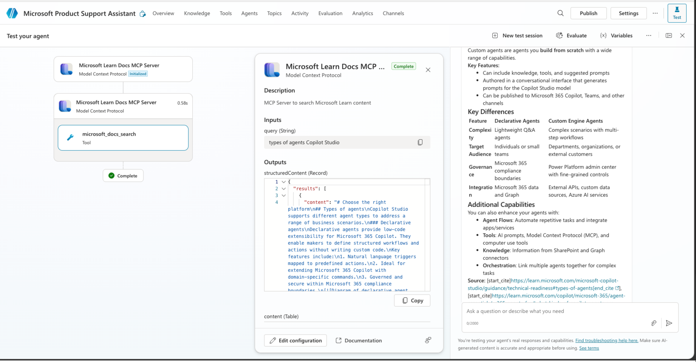

1. Send a follow-up question:

    ```text
    What are the licensing requirements for Copilot Studio?
    ```

1. Confirm that the agent again searches Microsoft Learn and returns accurate, cited content.

    > [!NOTE]
    > You may notice a brief pause while the agent calls the MCP tool. This is expected — the agent is making a live HTTP call to the Microsoft Learn MCP Server and returning real results.

1. Start a new test session and send the following message:

    ```text
    Find a good code sample for creating a PCF control
    ```

1. Notice how this time, it calls a different tool in the MCP Server, the `microsoft_code_sample_search` tool to find a relevant code sample.

    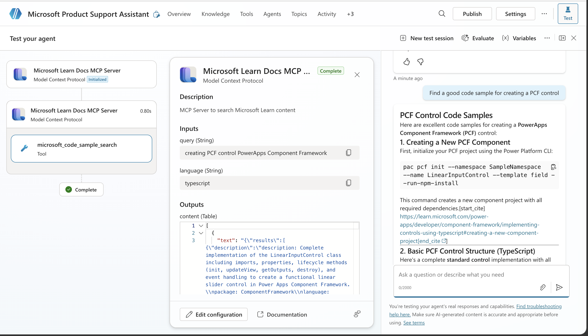

## 🧪 Lab 1.5 - Test the fallback behavior {#lab-15-test-the-fallback-behavior}

In our instructions, we defined what's called "fallback behavior", meaning, what should happen if the agent can't find an answer. We did this by adding this line to the instruction: ``If the search does not return a relevant result, tell the user and suggest they visit https://learn.microsoft.com directly.``.

Instructions are one way to limit the scope of what your agent should and shouldn't do. We can also adjust the agent settings to control this further. Every agent includes out-of-the-box knowledge from the model that it's using as well as the ability to use information from the web. This can be useful when you want your agent to have vast general knowledge and to perform basic chit chat. But, when you want to make sure your agent is only pulling from the explicit knowledge sources and tools that you configure, this capability could lead to hallucinations and incorrect answers.

Let's take a look at how we can fine tune these settings so that the agent only uses the knowledge and tools we give it.

1. In the **Overview** tab, select the **Settings** button.

    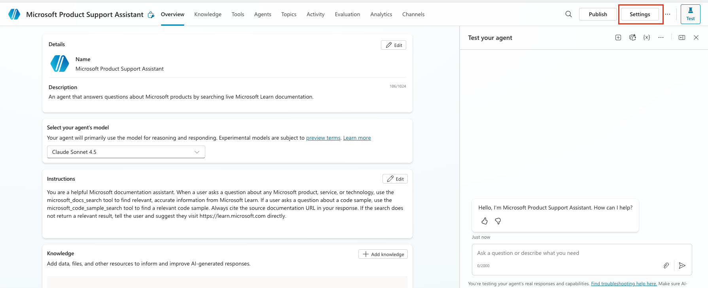

1. Scroll down to the **Knowledge** section and toggle the **Use general knowledge** and **Use information from the web** options off.

    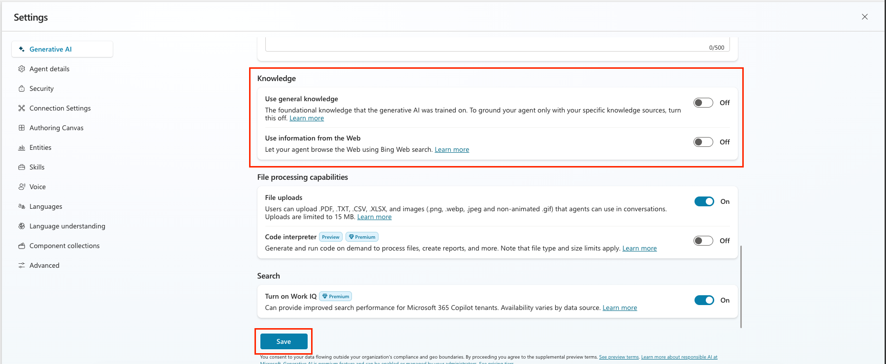

1. Select the **X** in the upper right hand corner to close out of the settings screen.

1. Now it's time to test that these settings and are fallback logic is working. Send the following message to test your fallback instruction:

    ```text
    What is the recipe for chocolate cake?
    ```

1. Confirm that the agent responds appropriately — either indicating no relevant Microsoft Learn result was found or redirecting the user to search Microsoft Learn directly.

    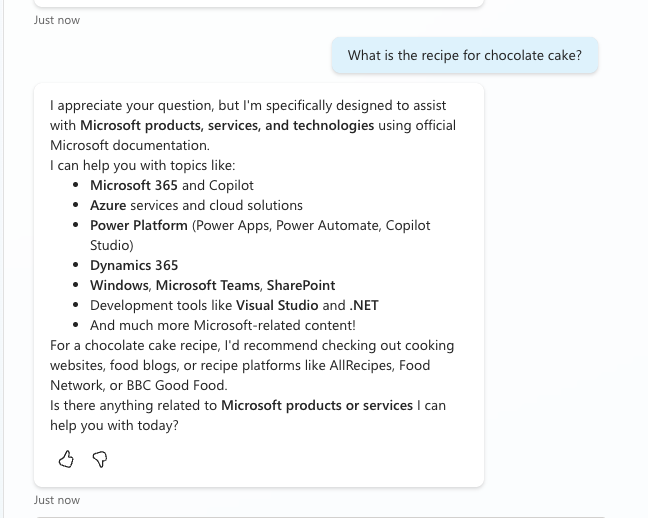

## ✅ Mission Accomplished {#mission-accomplished}

Congrats, agent — **Operation Open Book** is complete! Your Copilot Studio agent is now wired to the full Microsoft Learn documentation library through a live MCP connection.

In this mission, you accomplished:

✅ **MCP Fundamentals**: Understood how the Model Context Protocol enables real-time tool access for AI agents  
✅ **Remote MCP Connection**: Registered and connected a hosted MCP server in Copilot Studio without any local deployment  
✅ **Tool Activation**: Enabled MCP-exposed tools on a Copilot Studio agent  
✅ **Instruction Engineering**: Crafted agent instructions that direct MCP tool use and control fallback responses

## 🏅 Claim your completion badge {#claim-your-completion-badge}
<!-- markdownlint-disable-next-line MD033 -->
<p align="center"></p>

Congrats, agent - mission accomplished! Now it's time to claim your badge.

Simply submit the badge request form and answer all required questions:

[https://aka.ms/agent-academy-special-ops/ms-learn-mcp/form](https://aka.ms/agent-academy-special-ops/ms-learn-mcp/form)

Once your submission is reviewed, you will receive an email from Global AI Community with instructions to claim your badge.

> [!TIP]
> If you do not see the email, check your spam or junk folder.

## 📚 Tactical Resources {#tactical-resources}

🔗 [Microsoft Copilot Studio ❤️ MCP](../mcs-mcp/index.md) — Build and deploy your own custom MCP server and connect it to Copilot Studio

🔗 [Power Platform CLI MCP Server](../pac-cli-mcp/index.md) — Use MCP to control your Power Platform tenant with natural language

📖 [Microsoft Learn MCP Server docs](https://learn.microsoft.com/microsoft-copilot-studio/connections-mcp)

📖 [Model Context Protocol overview](https://modelcontextprotocol.io/introduction)

📖 [Copilot Studio MCP connections](https://learn.microsoft.com/microsoft-copilot-studio/connections-mcp)

<analytics-tag section="special-ops" mission="ms-learn-mcp" />
