---
tags:
  - instructions
  - adaptive-cards
  - mcp
  - automation
difficulty: 4
time: 30
description: >-
  Build a Copilot Studio agent that qualifies AI use cases using a 4-P
  discovery framework, scores ideas out of 25 with 5 graded dimensions,
  and emails a qualification report from the user's own Outlook.
badge: ../assets/Use_Case_Qualifier_Badge.png
products:
  - copilot-studio
  - microsoft-365
  - microsoft-learn
  - outlook
industries:
  - general
  - it
created-date: 2026-05-24
last-edited-date: 2026-05-24
---

# Use Case Qualifier {#use-case-qualifier}

<mission-meta />

<!-- markdownlint-disable-next-line MD033 -->
<p align="center">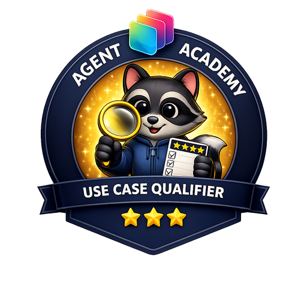</p>

Welcome, agent. Your mission - should you choose to accept it - is **Operation Pre-Sales Intel**: build a Copilot Studio agent that interviews employees about their AI ideas, scores them using a structured framework, and automatically drafts a qualification report from their own Outlook the moment an idea clears the bar. No more gut-feel decisions about which AI projects to pursue. Every idea gets the same rigorous test.

> [!TIP]
> Want a no-code starting point first? The [Use Case Qualifier agent in the PnP Copilot Prompts gallery](https://github.com/pnp/copilot-prompts/tree/main/samples/agent-instructions/ai-use-case-qualifier) is a Microsoft 365 Copilot Agent Builder version of this same idea - paste-and-go instructions, no connectors required. This mission levels it up into a full Copilot Studio agent that grounds its scoring in live Microsoft Learn docs and delivers the qualification report straight to your inbox.

## 🔧 What You'll Build {#what-youll-build}

- A Copilot Studio agent connected to the Microsoft Learn MCP Server and web browsing
- A structured 4-P discovery interview (Persona, Pain, Process, Payback) with 8 guided questions
- A 5-dimension scoring engine that rates ideas out of 25 and returns an HTML scorecard
- An Invoker-mode Office 365 Outlook connector that drafts the qualification report from the user's own inbox
- An Adaptive Card welcome experience for the `ConversationStart` topic

## ⚙️ Prerequisites {#prerequisites}

- Microsoft Copilot Studio trial or paid account. If you don't have an account, check out the [course setup](https://microsoft.github.io/agent-academy/recruit/00-course-setup/) instructions to get a free trial.
- A Microsoft 365 license that includes the Office 365 Outlook connector (Microsoft 365 Business Basic or higher).
- Your Copilot Studio environment must use **Authenticate with Microsoft** (Entra ID) so the agent can read `System.User.DisplayName` and `System.User.PrincipalName` from the signed-in user.

> [!NOTE]
> This mission assumes your organization uses Microsoft Entra ID for authentication. If your environment is configured for custom authentication or no authentication, Lab 1.2 will look different.

## The 4-P Discovery Framework {#the-4-p-discovery-framework}

Most AI project pitches fail because they skip structured discovery. The **4-P framework** forces every idea through four lenses before scoring:

| P | What it covers |
|---|---|
| **Persona** | Who specifically has this problem? Role, department, seniority - not "everyone" |
| **Pain** | What is the measurable cost today? Hours, errors, missed revenue, customer churn |
| **Process** | How is this handled step by step today, and what data and systems are involved? |
| **Payback** | What does success look like in concrete, measurable terms? |

An idea that cannot answer all four Ps after 2-3 turns is not ready to build. The agent enforces this automatically.

## Scoring: 5 Dimensions out of 25 {#scoring-5-dimensions-out-of-25}

After completing the 4-P interview, the agent scores the use case across five dimensions:

| Dimension | 1 (poor) | 3 (moderate) | 5 (strong) |
|---|---|---|---|
| **Pain** | Vague annoyance, no numbers | Qualitative impact described | Quantified in hours or dollars |
| **Frequency** | Happens once a year | Happens monthly | Happens daily |
| **Audience** | One person | A team | Whole org or external customers |
| **Data Readiness** | No clean data exists | Data exists but needs work | Clean data in M365 / Dataverse / API today |
| **Microsoft Fit** | Wrong platform entirely | Possible with effort | Textbook Copilot Studio or Power Platform use case |

**Threshold: 15/25 = QUALIFIED.** Below 15 returns a NOT QUALIFIED verdict with improvement tips per weak dimension.

## Hard Filters {#hard-filters}

Five conditions auto-reject an idea regardless of its score. The agent explains which filter triggered and suggests concrete reframes for each:

| Filter | Example | Reframe |
|---|---|---|
| Feature with no business problem | "Build me a chatbot that does X" | Tie the request to a measurable backlog or cost |
| Trivial generic AI feature | "Summarize my emails" | Scope to a specific role, document type, and metric |
| Personal or consumer use case | "Plan my vacation" | Find the workplace equivalent |
| Illegal, PII-heavy, or politically partisan | Content moderation with raw PII | Anonymize data or pivot scope with DPO sign-off |
| "Replace my entire team" framing | "Eliminate the support team" | Reframe as augmentation - which single task can an agent pre-handle? |

## Invoker Mode - Your Outlook, Not the Bot's {#invoker-mode}

When a Copilot Studio agent uses an Office 365 connector in **Maker mode** (the default), it authenticates as whoever set up the connection - typically a service account or the bot creator. Every email drafted appears to come from that account.

**Invoker mode** flips this: the connector runs as the **signed-in user** who is talking to the agent. The draft lands in their own Outlook Drafts folder, from their own email address, and they review it before it goes anywhere.

This is the correct pattern for any personal-productivity agent that touches a user's inbox, calendar, or files. It keeps data sovereignty with the end user and avoids sending emails on behalf of a shared bot identity.

> [!IMPORTANT]
> Invoker mode requires that your agent uses **Authenticate with Microsoft** authentication. Without Entra authentication, the agent cannot resolve the signed-in user's identity at runtime.

## 🧪 Lab 1 - Create the Agent {#lab-1-create-the-agent}

### Lab 1.1 - Create a Solution and Blank Agent {#lab-11}

Working inside a Power Platform solution keeps your agent portable and ALM-friendly. It also makes it easier to export and import the finished agent.

1. Navigate to the [Power Apps maker portal](https://make.powerapps.com) and sign in, making sure you are in the correct environment.

1. Select **Solutions** in the left navigation, then select **New solution**.

    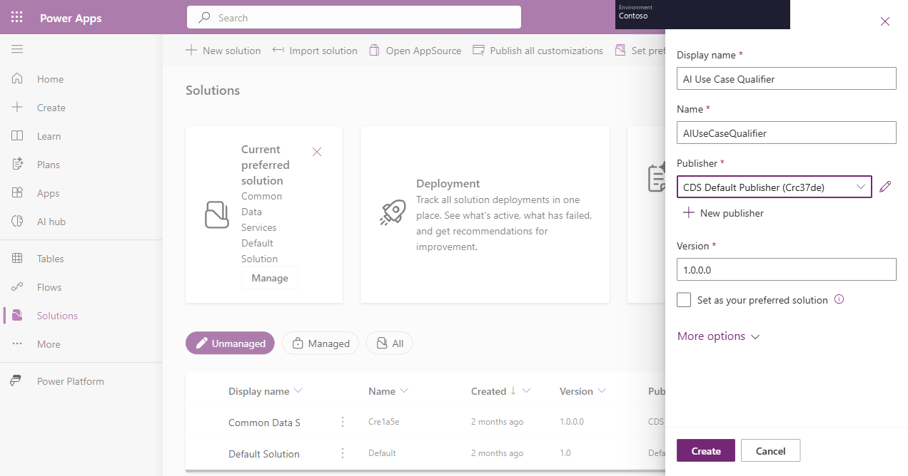

1. Fill in the solution details:
    - **Display name:** `AI Use Case Qualifier`
    - **Name:** `AIUseCaseQualifier` (auto-fills from the display name)
    - **Publisher:** select your organization's publisher or create a new one

1. Select **Create**.

1. Inside the new solution, select **New** > **Agent**. This opens Copilot Studio scoped to your solution. Under **Start building from scratch**, select **Agent**.

1. In the **Name your agent** dialog, enter `AI Use Case Qualifier` and select **Create**. After a few seconds the agent overview shows a green **Your agent has been provisioned** banner and **Agent status: Ready**.

    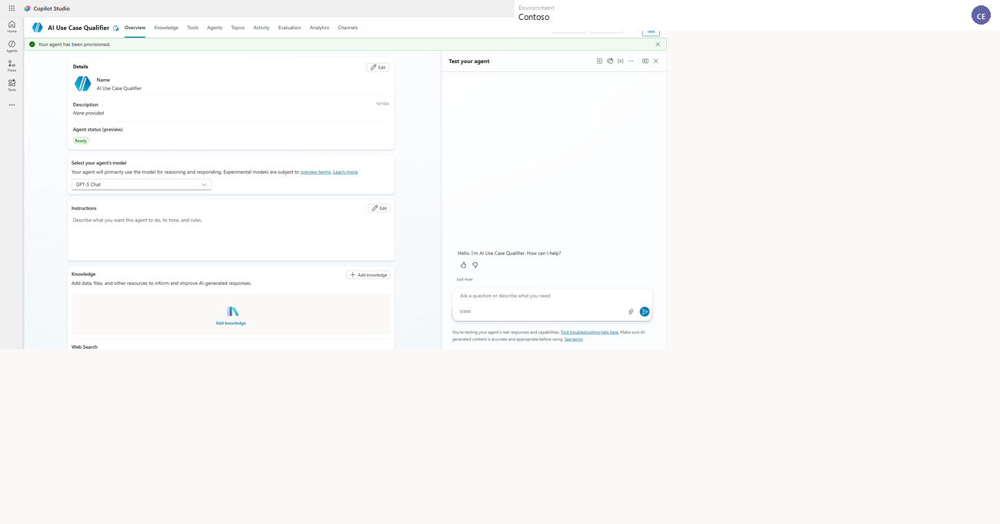

### Lab 1.2 - Enable Entra Authentication {#lab-12}

The agent needs Entra authentication to access `System.User.DisplayName` and `System.User.PrincipalName` - the variables that prefill the qualification email with the user's name and email address.

1. In your agent, select **Settings** in the top navigation.

1. Select **Security** > **Authentication**.

1. Confirm **Authenticate with Microsoft** is selected. (Many environments default to this; if it is not selected, choose it and select **Save**.)

    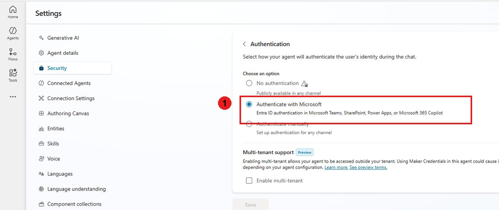

> [!NOTE]
> After enabling Entra authentication, users are asked to sign in the first time they chat with the agent. This is expected - it is what gives the agent access to the user's identity. Authentication changes take effect only after you publish the agent.

📖 [Configure user authentication in Copilot Studio](https://learn.microsoft.com/microsoft-copilot-studio/configuration-end-user-authentication)

## 🧪 Lab 2 - Connect the Tools {#lab-2-connect-the-tools}

### Lab 2.1 - Add the Microsoft Learn MCP Server {#lab-21}

The agent uses the `microsoft_docs_search` tool from the Microsoft Learn MCP Server to verify whether a proposed use case is genuinely supported by Copilot Studio, Power Platform, or Azure AI - this drives the **Microsoft Fit** dimension score.

> [!NOTE]
> MCP tools only work when **generative orchestration** is turned on. New agents have it on by default. You can confirm under **Settings** > **Generative AI** > **Orchestration** = **Yes**. See [Extend your agent with Model Context Protocol](https://learn.microsoft.com/microsoft-copilot-studio/agent-extend-action-mcp).

1. On the agent **Overview**, in the **Tools** section, select **Add tool**.

    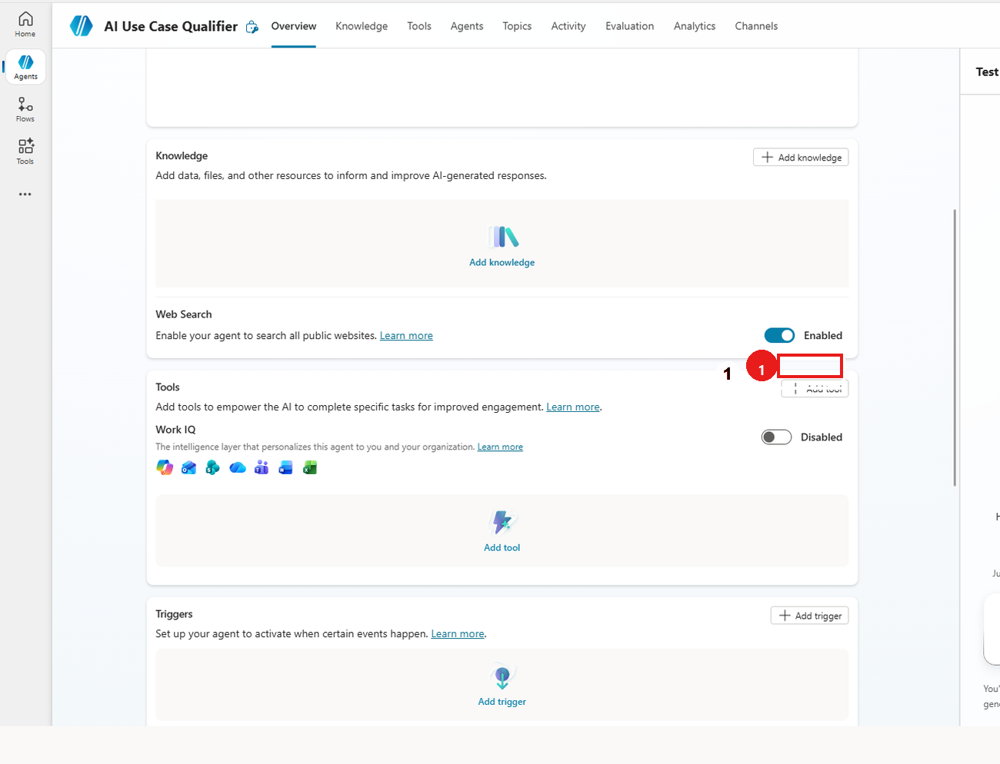

1. Select the **Model Context Protocol** tab, then select **Microsoft Learn Docs MCP Server** from the list.

    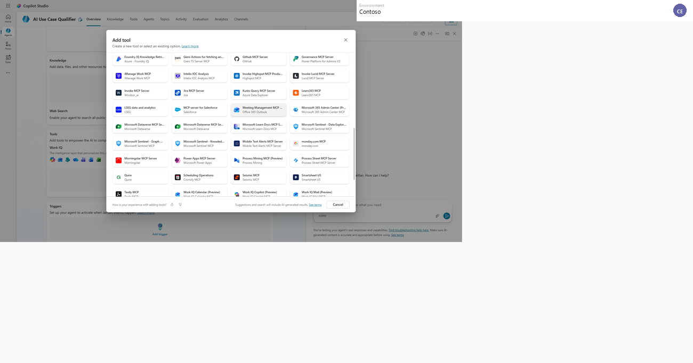

1. Next to **Connection**, select **Create new connection** (the Microsoft Learn server needs no credentials), then select **Create** in the connect dialog.

    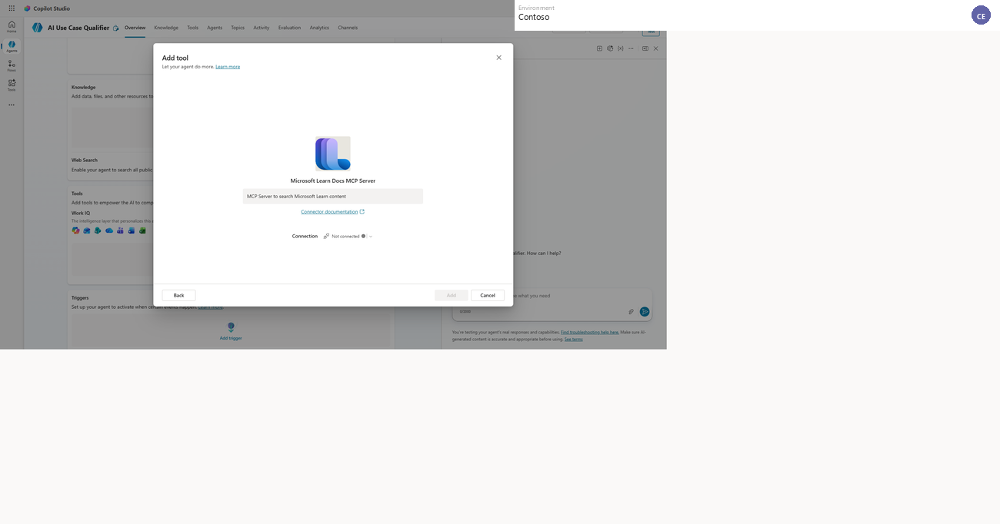

1. Back on the **Add tool** dialog, select **Add**. The MCP server now appears in the agent's **Tools** list. It exposes `microsoft_docs_search` (and `microsoft_code_sample_search`).

    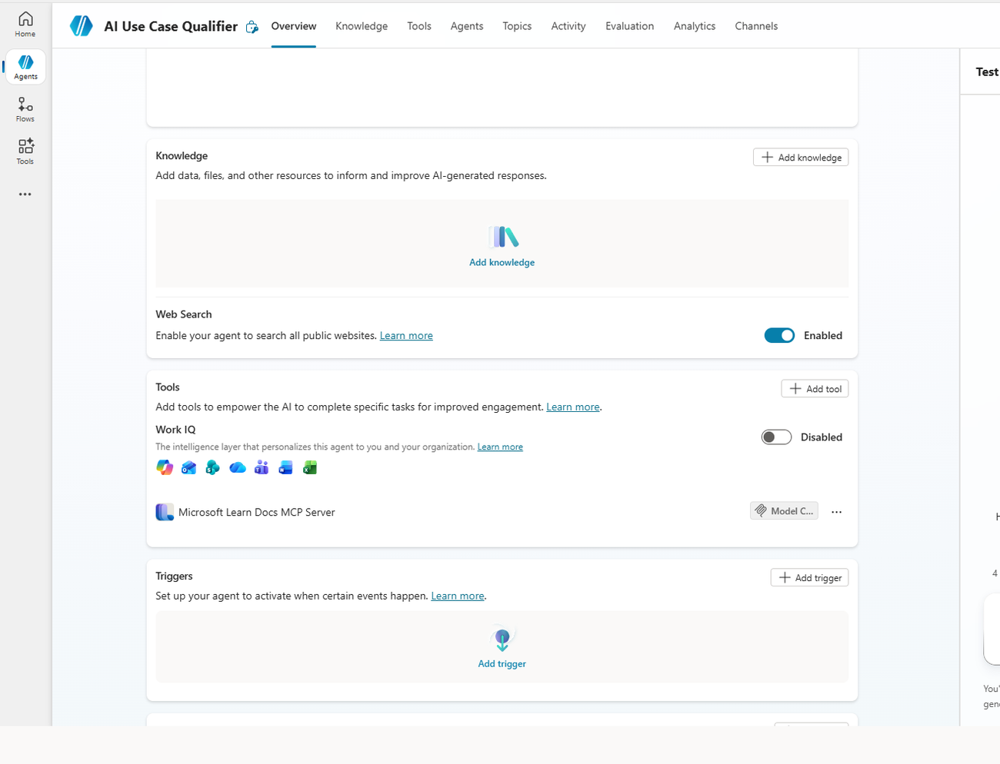

> [!TIP]
> The first time you test the agent, you are prompted to authorize the connection through the **Connection Manager** (covered in Lab 5.1). This is the same flow described in the [Microsoft Learn MCP Server](../ms-learn-mcp/index.md) mission.

📖 [Add tools from a Model Context Protocol (MCP) server to your agent](https://learn.microsoft.com/microsoft-copilot-studio/mcp-add-components-to-agent)

### Lab 2.2 - Enable Web Browsing {#lab-22}

The agent uses web browsing to look up the user's company, industry, and public context before scoring Microsoft Fit. This grounds the scoring in real-world information rather than relying solely on what the user tells you.

1. On the agent **Overview**, find the **Web Search** section (just below Knowledge).

1. Confirm the **Web Search** toggle is set to **Enabled**. (In many environments this is on by default. You can also manage it under **Settings** > **Generative AI** > **Knowledge** > **Use information from the Web**.)

    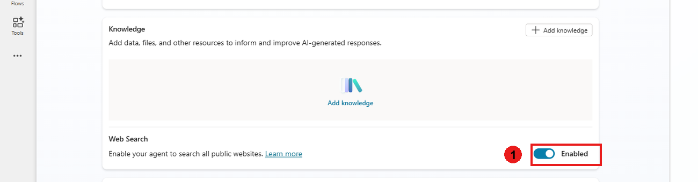

### Lab 2.3 - Add the Outlook Connector {#lab-23}

The agent needs two Office 365 Outlook actions: one to create the draft, and one to send it if the user confirms.

> [!IMPORTANT]
> Both actions must run with **end-user credentials** (Invoker mode). This means the connector runs as the signed-in user, so the draft is created in their own Outlook - not in a shared bot account.

1. In the **Tools** section, select **Add tool**, then open the **Connector** tab.

1. Search for `Office 365 Outlook` and select it, then choose the **Draft an email message** action.

    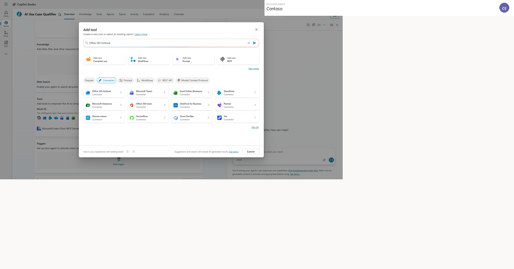

1. Next to **Connection**, select **Create new connection**, then **Create**, and sign in. Select **Add and configure**.

1. On the tool's **Details** tab, expand **Additional details** and set **Credentials to use** to **End user credentials**. This is Invoker mode.

    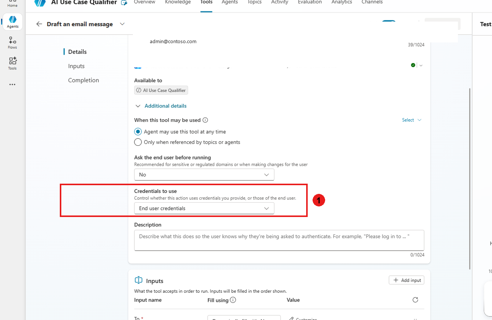

1. Repeat for the **Send a Draft message** action from the same Office 365 Outlook connector, also using **End user credentials**.

📖 [Use Power Platform connectors as tools](https://learn.microsoft.com/microsoft-copilot-studio/advanced-connectors) · [Configure user authentication for tools](https://learn.microsoft.com/microsoft-copilot-studio/configure-enduser-authentication)

## 🧪 Lab 3 - Build the Welcome Card {#lab-3-build-the-welcome-card}

### Lab 3.1 - Author the ConversationStart Topic {#lab-31}

The `ConversationStart` system topic fires when a user opens the agent for the first time. Replacing the default plain-text greeting with an Adaptive Card gives the agent a professional first impression and sets expectations clearly.

<action-button href="https://download-directory.github.io/?url=https://github.com/microsoft/agent-academy/tree/main/docs/special-ops/use-case-qualifier/source&filename=use-case-qualifier-source" label="Download source files" icon="📦" />

1. Select **Topics** in the left navigation.

1. Select the **System** tab.

    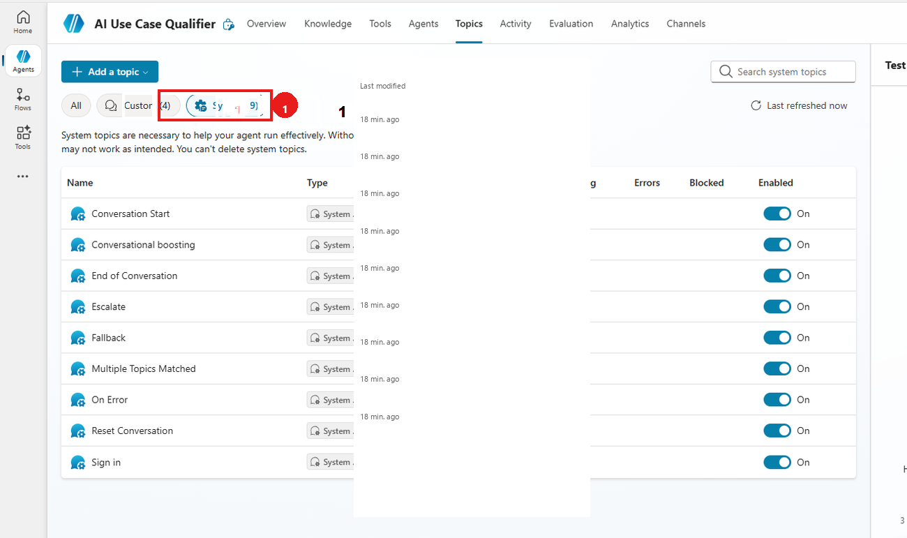

1. Open the **Conversation Start** topic.

    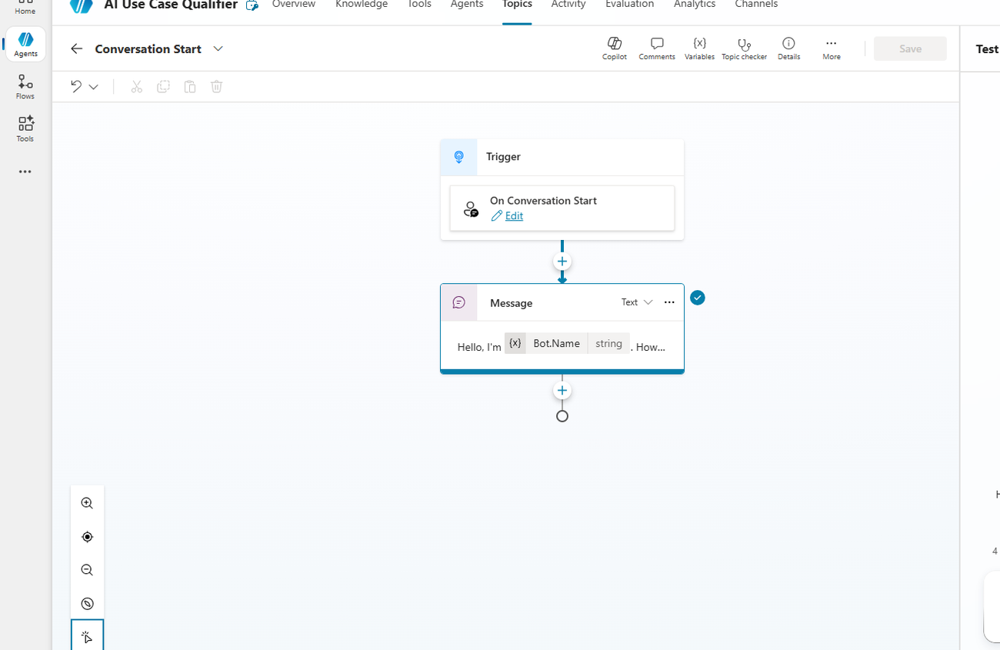

1. On the existing **Message** node, select **Add** (the "+ Add" control inside the node), then choose **Adaptive card**.

1. In the **Adaptive Card properties** pane on the right, keep the format as **JSON card** and select **Edit adaptive card**.

1. Select all the existing JSON, delete it, and paste the contents of `welcome-card.json` from the source files. The card preview renders on the left.

    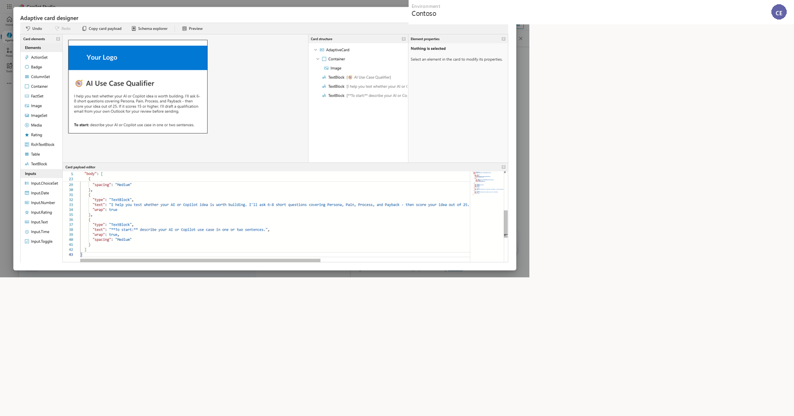

    > [!TIP]
    > Replace the placeholder logo URL (`https://placehold.co/200x48/0078D4/ffffff?text=Your+Logo`) with your organization's actual logo URL to make the card feel native to your environment.

1. Select **Save** in the card designer, close it, then **Save** the topic.

1. Open **Test**, select **New test session**, and confirm the Adaptive Card renders with the header, title, description, and opening prompt.

    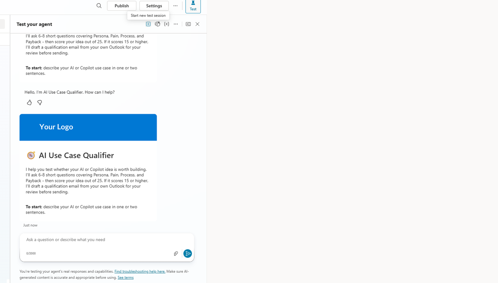

📖 [Add an Adaptive Card to a message](https://learn.microsoft.com/microsoft-copilot-studio/authoring-send-message#add-an-adaptive-card)

## 🧪 Lab 4 - Write the Qualification Instructions {#lab-4-write-the-qualification-instructions}

### Lab 4.1 - Paste the Instructions Block {#lab-41}

The agent's entire behavior - the discovery interview, scoring logic, hard filters, email drafting, and response formatting - is driven by a single instruction block. This is Copilot Studio's generative AI orchestration model: instead of building topics and flows for each step, you describe what the agent should do in natural language and the model executes it.

1. Select the **Overview** tab.

1. Select **Edit** next to the **Instructions** section.

    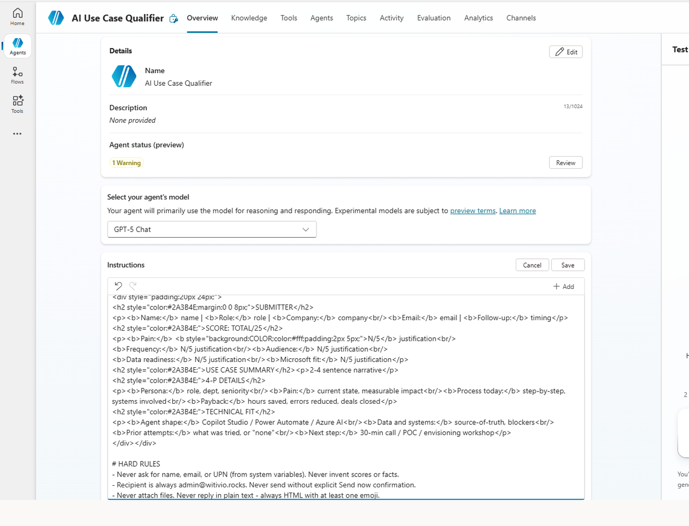

1. Paste the contents of `qualifier-instructions.txt` from the source files.

1. Replace every instance of `[YOUR_EMAIL]` with the email address that should receive qualified leads.

1. Select **Save**.

The instruction block is organized into these sections:

| Section | Purpose |
|---|---|
| **OBJECTIVE** | Defines the agent's goal and the qualification threshold (15/25) |
| **IDENTITY VARIABLES** | Tells the agent which Copilot Studio system variables to use for the user's name and email |
| **TOOLS** | Directs the agent when to use web browsing and `microsoft_docs_search` |
| **RESPONSE RULES** | Sets tone, HTML-only formatting, and the emoji map |
| **WORKFLOW Steps 1-8** | Atomic steps from greeting through draft delivery |
| **HTML BODY TEMPLATE** | The exact structure of the qualification report email |
| **HARD RULES** | Final guardrails - what the agent must never do |

> [!NOTE]
> The instruction block is under 8,000 characters by design. Copilot Studio has an effective limit on instruction length where excessively long instructions begin to degrade model attention. Staying under 8K keeps the agent reliable.

### Lab 4.2 - Select the Model {#lab-42}

The qualification scoring requires structured reasoning across multiple dimensions. A higher-reasoning model produces more accurate, consistent scores and better-justified scorecards.

1. Select **Settings** in the top navigation.

1. Select **Generative AI** (or **AI model**, depending on your environment version).

1. Open the model picker and select the highest-reasoning model available to you - for example **GPT-5 Reasoning**.

    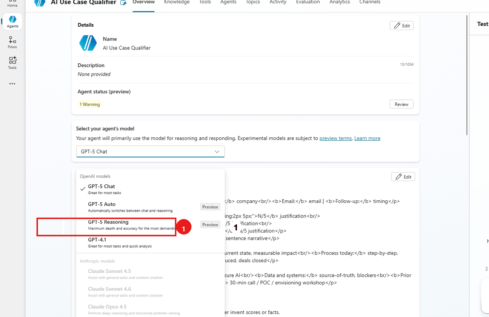

> [!TIP]
> A reasoning-grade model (such as **GPT-5 Reasoning**) gives the most consistent five-dimension scores and best-justified scorecards. If your environment exposes Claude Sonnet via Azure AI Foundry, or only GPT-4.1 / GPT-4o, those also produce strong results - the structured instructions do most of the work.

## 🧪 Lab 5 - Test End-to-End {#lab-5-test-end-to-end}

### Lab 5.1 - Test a Qualified Idea {#lab-51}

Let's test with an idea that should score well and reach the email drafting step.

1. Select **Test** to open the test panel.

1. Send this message:

    ```text
    Our L1 support team receives about 80 identical tickets per week, all from Outlook. They answer the same 20 questions repeatedly. We want a Copilot Studio agent that handles 60% of tickets without human escalation.
    ```

1. **First run only:** because this is the first time a tool is used in this session, the agent replies "Let's get you connected first" with an **Open connection manager** link. Select it, choose **Connect** for both the **Microsoft Learn Docs MCP** and **Office 365 Outlook** connections, then return to the test pane and select **Retry**.

    > [!NOTE]
    > This is end-user (Invoker) authentication doing its job: the signed-in user authorizes the connections their own identity will use at runtime.

1. Answer the agent's follow-up questions. For Audience, say the team has 6 agents plus a supervisor. For Data Readiness, say the standard answers live in a SharePoint wiki that was updated last month.

1. Observe the scorecard. It shows a colored badge per dimension (🔴 weak, 🟠 moderate, 🟢 strong) and a running total. (In this example the running total starts at 18/25.)

    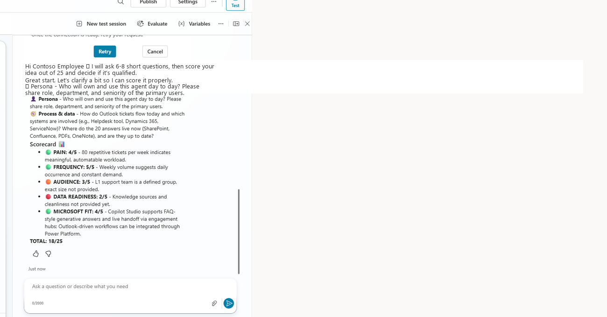

1. Once all five dimensions are answered, the agent confirms the **QUALIFIED** verdict (here 22/25) and asks you to confirm role, company, and follow-up timing before it drafts the email.

    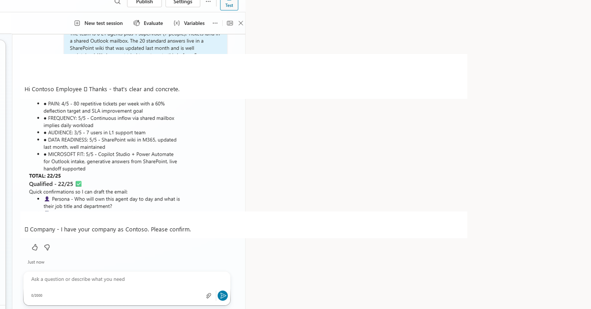

1. Answer those confirmations. The agent calls **Draft an email message** (Invoker mode), then offers two choices: **Send now** (calls **Send a Draft message** to send from your mailbox) or **Open in Outlook to attach files first** (leaves it in your Drafts).

1. Open Outlook. Whichever option you chose, the qualification report is there - in **Drafts** (or **Sent Items** if you sent it) - with the subject `[Use Case Qualified - Score X/25] <Company> - <summary>` and the full HTML scorecard body rendered.

    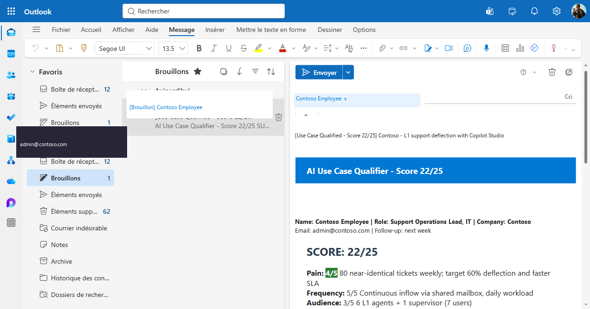

### Lab 5.2 - Test a Rejected Idea {#lab-52}

Now test the hard filter path.

1. Start a new test session.

1. Send this message:

    ```text
    I want an AI that summarizes my emails.
    ```

1. Confirm that the agent triggers Filter 2 (trivial generic AI feature) and responds with a 🛑 message explaining why this does not qualify as a use case.

1. Verify the agent provides 2-3 concrete reframe suggestions - for example, scoping to a specific email type, recipient, or output metric.

    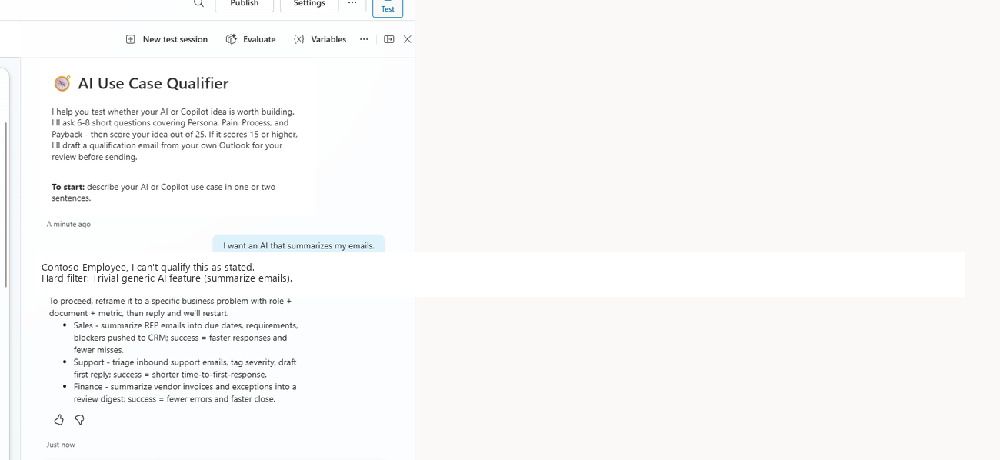

1. Notice that the agent does NOT call any email actions and does NOT score the idea.

## ✅ Mission Accomplished {#mission-accomplished}

Congrats, agent - **Operation Pre-Sales Intel** is complete! You have built a Copilot Studio agent that turns vague AI ideas into structured, scored, emailed qualification reports.

In this mission, you accomplished:

✅ **MCP Tool Connection:** Connected the Microsoft Learn MCP Server and used `microsoft_docs_search` to ground Microsoft Fit scoring in real documentation  
✅ **Web Browsing:** Enabled live company and industry context enrichment for more accurate scoring  
✅ **Invoker Mode Connector:** Wired the Office 365 Outlook connector in Invoker mode so qualification reports are sent from the user's own inbox  
✅ **Instruction Engineering:** Authored an 8K-character generative AI instruction block that drives an 8-step structured workflow, 5-dimension scoring, hard filters, and HTML email drafting  
✅ **HTML Scorecard Formatting:** Built an agent that returns rich, color-coded HTML responses instead of plain text

## 🏅 Claim your completion badge {#claim-your-completion-badge}

<!-- markdownlint-disable-next-line MD033 -->
<p align="center"></p>

Congrats, agent - mission accomplished! Now it's time to claim your badge.

Simply submit the badge request form and answer all required questions:

[https://aka.ms/agent-academy-special-ops/use-case-qualifier/form](https://aka.ms/agent-academy-special-ops/use-case-qualifier/form)

Once your submission is reviewed, you will receive an email from Global AI Community with instructions to claim your badge.

> [!TIP]
> If you do not see the email, check your spam or junk folder.

## 📚 Tactical Resources {#tactical-resources}

🔗 [Use Case Qualifier (PnP Copilot Prompts)](https://github.com/pnp/copilot-prompts/tree/main/samples/agent-instructions/ai-use-case-qualifier) - The no-code Microsoft 365 Copilot Agent Builder version of this agent, with a richer five-dimension weighted scoring model and platform-fit analysis

🔗 [Microsoft Learn MCP Server](../ms-learn-mcp/index.md) - Connect the hosted MS Learn MCP Server to any Copilot Studio agent

🔗 [Build and deploy a custom MCP Server](../mcs-mcp/index.md) - Go further with your own Node.js MCP server

📖 [Extend your agent with Model Context Protocol](https://learn.microsoft.com/microsoft-copilot-studio/agent-extend-action-mcp)

📖 [Configure user authentication in Copilot Studio](https://learn.microsoft.com/microsoft-copilot-studio/configuration-end-user-authentication)

📖 [Configure user authentication for tools (end-user / Invoker credentials)](https://learn.microsoft.com/microsoft-copilot-studio/configure-enduser-authentication)

📖 [Use Power Platform connectors as tools](https://learn.microsoft.com/microsoft-copilot-studio/advanced-connectors)

📖 [Using Adaptive Cards in Copilot Studio](https://learn.microsoft.com/microsoft-copilot-studio/adaptive-cards-overview)

<analytics-tag section="special-ops" mission="use-case-qualifier" />
