---
tags:
    - YAML
    - Copilot Studio
    - VS Code
    - GitHub Copilot
difficulty: 3
---

# 🧬 YAML Specialist

<!-- markdownlint-disable-next-line MD033 -->
<p align="center"></p>

> **Difficulty**: ⭐⭐⭐ | **Time**: ~60 min

Welcome, agent. Your mission - should you choose to accept it - is to become a **YAML Specialist** - an operative who builds and extends Microsoft Copilot Studio agents entirely from Visual Studio Code using the Copilot Studio YAML agent definition language. You're going deep cover: cloning agents, writing topics in raw YAML, wiring up knowledge sources, and pushing changes back to the cloud - all from your local command center. With GitHub Copilot as your handler, you'll iterate at speeds the web UI can't match. 🎯

**Mission objectives:**

- Set up the Copilot Studio VS Code extension and clone an agent to your local machine
- Understand the YAML agent definition file structure - topics, actions, triggers, and knowledge
- Write and edit YAML topics by hand with IntelliSense validation
- Leverage GitHub Copilot Agent Mode with specialized skills to generate and refine agent YAML
- Synchronize local changes back to Copilot Studio and test the agent in the cloud
- Add public website knowledge sources and guardrails to harden the agent

## ⚙️ Prerequisites

This mission assumes you have completed the [Operative course](/operative/) and have a working Copilot Studio environment. In addition, make sure you have the following installed:

- **Visual Studio Code** - Download and install from [code.visualstudio.com](https://code.visualstudio.com/). Select the installer for your operating system (Windows, macOS, or Linux).
- **GitHub Copilot extension for VS Code** - The free tier works for this mission. Install from the [VS Code Marketplace](https://marketplace.visualstudio.com/items?itemName=GitHub.copilot) or search for **GitHub Copilot** in the VS Code Extensions panel (`Ctrl+Shift+X`). Sign in with your GitHub account when prompted.
- **GitHub CLI** - Download and install from [cli.github.com](https://cli.github.com/). On Windows, use the MSI installer. Verify the install by opening a terminal and running `gh --version`.
- **Node.js (LTS)** - Required by the Copilot Studio VS Code extension. Download from [nodejs.org](https://nodejs.org/). Choose the **LTS** version. Verify with `node --version` in a terminal.

> [!TIP]
> If you already have VS Code installed, you can install the GitHub Copilot and Copilot Studio extensions later during the hands-on labs. The labs walk you through each extension installation step by step.

## ❓ What is YAML Authoring for Copilot Studio?

> [!INFO] What is YAML?
> YAML is a simple text format for storing structured information. Think of it like a well-organized outline - instead of using curly braces or angle brackets, YAML uses **indentation** (spaces) to show how things are nested. This makes it easy to read even if you've never seen it before. For example:
>
> ```yaml
> name: Travel Agent
> language: English
> settings:
>   greeting: Hello! How can I help you travel safely?
>   topics:
>     - safety-tips
>     - cultural-advice
> ```
>
> Notice how `settings` is indented under the main level, and `greeting` and `topics` are indented further inside `settings`. That's really all there is to it - **names on the left, values on the right, separated by a colon, with indentation showing structure**. YAML files use the `.yaml` or `.yml` extension. In Copilot Studio, every part of your agent - topics, tools, triggers, and settings - is stored in YAML files.

Every Copilot Studio agent has a definition - a set of YAML files that describe its personality, topics, tools, knowledge sources, and triggers. When you build an agent in the Copilot Studio web UI, you're really editing these YAML files behind the scenes. The web canvas provides a visual representation, but the **source of truth** is always YAML.

> [!TIP]
> You can peek at the YAML behind any topic or tool directly in the web canvas. Open a topic, then select **Open code editor** in the toolbar to see the raw YAML. This is a great way to learn the schema before moving to VS Code.

The Copilot Studio extension for Visual Studio Code gives you direct access to these agent definition files. You can:

- **Clone** an agent from the cloud to your local file system
- **Edit** topics, instructions, knowledge, and tools using structured YAML with IntelliSense
- **Apply** your changes back to the cloud for testing
- **Version control** your agent definitions with Git

This is how professional agent developers work - treating agent definitions as code, collaborating through pull requests, and iterating rapidly with AI assistance.

## 🆚 Web UI vs YAML Authoring: When to Use Each

| Aspect | Web UI (Copilot Studio) | YAML Authoring (VS Code) |
| --- | --- | --- |
| **Best for** | Visual exploration, quick prototyping | Large-scale development, team collaboration |
| **Editing speed** | Point-and-select, one node at a time | Full-text search, bulk edits across files |
| **Version control** | Manual snapshots via solutions | Full Git integration with diffs and PRs |
| **AI assistance** | Copilot in the canvas | GitHub Copilot Agent Mode with specialized skills |
| **Collaboration** | One author at a time per topic | Multiple developers via Git branches |
| **Testing** | Built-in test pane | Apply changes, then test in Copilot Studio |
| **Learning curve** | Low - visual and guided | Medium - requires YAML and VS Code familiarity |

> [!TIP]
> You don't have to choose one or the other. Many teams use the web UI for initial prototyping and switch to YAML authoring for production-grade development. Changes made in the web UI can be pulled down with a **Get** operation, and local YAML changes can be pushed up with **Apply**.

## 📁 The Agent Definition File Structure

When you clone a Copilot Studio agent, the extension creates a structured directory on your machine. Understanding this structure is important:

```text
my-agent/
├── actions/                       # Connectors and tools
│   ├── DevOpsAction.mcs.yml
│   └── GetItems.mcs.yml
├── knowledge/files/               # Uploaded knowledge documents
│   ├── source1.yaml
│   └── source2.yaml
├── topics/                        # Conversation topics (YAML)
│   ├── greeting.mcs.yaml
│   ├── help.mcs.yaml
│   └── escalate.mcs.yaml
├── workflows/                     # Power Automate flows
│   └── GetDevOpsItems/
│       ├── metadata.yaml
│       └── workflow.json
├── agent.mcs.yaml                 # Main agent definition
├── icon.png                       # Agent icon
└── settings.mcs.yml               # Configuration settings
```

**Key files to know:**

| File / Folder | Purpose |
| --- | --- |
| `agent.mcs.yaml` | Main agent definition - name, description, instructions, and schema |
| `topics/` | Each `.mcs.yaml` file is a topic with triggers, actions, and conversation logic |
| `actions/` | Tool definitions - connectors, REST APIs, MCP servers |
| `knowledge/files/` | Uploaded knowledge documents |
| `settings.mcs.yml` | Agent configuration and orchestration settings |
| `workflows/` | Power Automate cloud flows used as tools |
| `trigger/` | Event-based triggers (schedules, conditions) |

## 🔧 YAML Topic Anatomy

Topics are the conversation building blocks of your agent. Each topic is an `AdaptiveDialog` written in YAML. Here's the anatomy of a simple greeting topic:

```yaml
kind: AdaptiveDialog
beginDialog:
  kind: OnConversationStart
  id: main
  actions:
    - kind: SendActivity
      id: sendMessage_greeting
      activity:
        text:
          - Hello, I'm {System.Bot.Name}. How can I help?
        speak:
          - Hello and thank you for calling {System.Bot.Name}.
```

**Key YAML elements:**

- **`kind`** - The node type (`AdaptiveDialog`, `SendActivity`, `Question`, `ConditionGroup`, etc.)
- **`id`** - A unique identifier for each node
- **`actions`** - An ordered list of steps the topic executes
- **`variable`** - Variable assignment using `init:Topic.VariableName` syntax
- **`entity`** - Entity type for question nodes (e.g., `BooleanPrebuiltEntity`, `StringPrebuiltEntity`)
- **`condition`** - Power Fx expressions for conditional logic (prefixed with `=`)

### Questions and Variables

```yaml
- kind: Question
  id: question_askName
  alwaysPrompt: true
  variable: init:Topic.UserName
  prompt: What is your name?
  entity: StringPrebuiltEntity
```

### Conditional Logic with Power Fx

```yaml
- kind: ConditionGroup
  id: condition_checkResponse
  conditions:
    - id: condition_yes
      condition: =Topic.Continue = true
      actions:
        - kind: SendActivity
          id: sendMessage_continue
          activity: Go ahead. I'm listening.
    - id: condition_no
      condition: =Topic.Continue = false
      actions:
        - kind: SendActivity
          id: sendMessage_goodbye
          activity: Goodbye! Have a great day.
```

> [!NOTE]
> Power Fx expressions in conditions must be prefixed with `=`. This tells the YAML parser that the value is an expression, not a literal string.

## 💪 1. Set Up Your Arsenal

In this section, you'll create a Travel Agent in Copilot Studio and clone it to your local machine using the VS Code extension.

### ⚙️ 1.1 Create a Solution and Agent in Copilot Studio

First, create a dedicated solution and a blank Travel Agent. This gives you a real agent to work with throughout the mission.

1. Navigate to [Copilot Studio](https://copilotstudio.microsoft.com)

1. Verify your **environment** is correct by checking the environment selector in the top-right corner. If you need to change it, select the environment name and choose your developer or sandbox environment.

1. Select **...** in the left navigation and select **Solutions**  
    

1. Select **New Solution**

1. Configure the solution with the following settings:

    | Setting | Value |
    | --- | --- |
    | Display Name | `Travel Agent` |
    | Publisher | Select **New publisher** |

1. Configure the new publisher:

    | Setting | Value |
    | --- | --- |
    | Display Name | `Travel Agent` |
    | Name | `TravelAgent` |
    | Prefix | `ta` |

1. Select **Save** on the publisher dialog

1. Check **Set as your preferred solution**

1. Select **Create**  
    

1. Navigate back to Copilot Studio by selecting the **Copilot Studio** logo in the top-left

1. Select **Agents** in the left navigation

1. Select **+ Create blank agent** and then select **Advanced Create** at the bottom of the dialog  
     

1. Configure the agent with the following settings:

     | Setting | Value |
     | --- | --- |
     | Language | `English (United States)` |
     | Solution | `Travel Agent` |
     | Schema name | `ta_travelagent` |

1. Select **Confirm and create**  
     

1. Wait until the agent is finished provisioning - a green bar displays the message **Your agent has been provisioned**
     

1. Select **Edit** in the **Details** section, and update the name to be `Travel Agent`

1. Select **Save**

1. Select **Edit** in the **Instructions** section on the overview page

1. Enter the following instructions:

     ```text
     You are a travel assistant for company employees. Help them prepare for
     business trips by providing destination-specific travel advice, safety
     information, and cultural tips. Always be helpful, concise, and professional.
     ```

1. Select **Save**  
     

### 💾 1.2 Install the Copilot Studio VS Code Extension

Next, install the Copilot Studio extension for VS Code.

1. Open **Visual Studio Code** (download from [code.visualstudio.com](https://code.visualstudio.com/) if not installed)
1. Select the **Extensions** icon in the Activity Bar on the left side (or press `Ctrl+Shift+X`)
1. In the search bar, type **Copilot Studio**
1. Locate the extension published by **Microsoft** and select **Install**  
    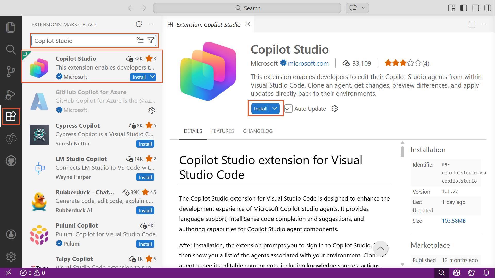
1. Wait for the installation to complete - VS Code may prompt you to reload
1. Select the **Copilot Studio** icon that now appears in the Activity Bar
1. Select **Allow** when prompted in the popup notification asking "The extension 'Copilot Studio' wants to sign in using Microsoft"
1. Select your account to sign in with, and enter your credentials and complete any multi-factor authentication
1. Return to VS Code - inside the **Copilot studio** panel, collapse the **Getting Started** section and expand the **Agents** section
1. Your environments and agents should now be listed after a short loading delay  
    

> [!IMPORTANT]
> You need read and write access to the Copilot Studio environment where your Travel Agent lives. If you don't see your agent in the Agents pane, verify you're signed in with the correct account and select the right environment from the dropdown.

### 🤖 1.3 Clone the Travel Agent to Your Local Machine

Now clone your agent to a local folder so you can work with the YAML files directly.

1. Select your target **environment** from the dropdown menu

1. Locate the **Travel Agent** (or the name you gave your agent) in the agent list

1. Right-click on the agent name and select **Clone agent**  
    

1. In the file picker dialog, navigate to an appropriate folder (or create a new folder like `travel-agent`)

1. Select the **Select Folder** button

1. Wait for the cloning process to complete - a progress notification appears, followed by a success message: **Agent Cloned successfully**  
    

1. Verify the cloned file structure in the VS Code **Explorer** panel - you should see `agent.mcs.yaml`, the `topics/` folder, and other definition files  
    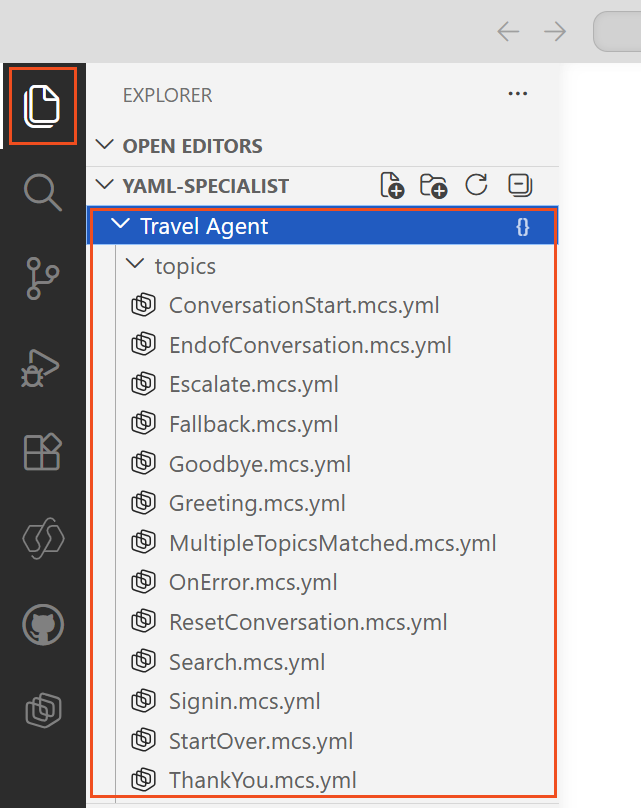

> [!NOTE]
> The clone operation downloads the full agent definition - topics, actions, knowledge, workflows, triggers, and configuration. This is your local working copy. Changes you make here won't affect the cloud agent until you explicitly **Apply** them.

### 👨‍💻 1.4 Explore the Agent Definition

Before making changes, take a look at what was cloned.

1. Open `agent.mcs.yaml` in the Explorer - this is the main agent definition containing the name, description, and instructions

1. Review the `topics/` folder - each `.mcs.yaml` file represents a conversation topic

1. Open any existing topic file and examine the YAML structure - notice the `kind`, `id`, and `actions` properties

1. Open `settings.mcs.yml` - this contains orchestration and configuration settings

1. Press `Ctrl+Space` inside any YAML file to see IntelliSense suggestions from the Copilot Studio extension

1. Press `Ctrl+Shift+M` to open the **Problems** pane - the extension validates your YAML in real-time and flags errors with red underlines

> [!TIP]
> Use `Ctrl+F` to search across your entire agent definition. This is much faster than navigating between topics in the web UI, especially for agents with dozens of topics and tools.

## 💪 2. Enable GitHub Copilot with Copilot Studio Skills

GitHub Copilot is a powerful ally, but out of the box it doesn't know the Copilot Studio YAML schema. By installing specialized **agent skills**, you give GitHub Copilot deep knowledge of the YAML agent definition language - enabling it to generate valid topics, actions, and configurations on demand.

### 🤖 2.1 Enable GitHub Copilot

1. Ensure you have a [GitHub Copilot subscription](https://docs.github.com/en/copilot/get-started/quickstart?tool=vscode) - the free tier works for this mission

1. Open VS Code and verify the **GitHub Copilot Chat** extension is installed (check the Extensions panel or press `Ctrl+Shift+X` and search for **GitHub Copilot**)

1. Sign in to GitHub if prompted

1. Open the **Chat** panel by selecting the Chat icon in the Activity Bar or pressing `Ctrl+Alt+I`  
    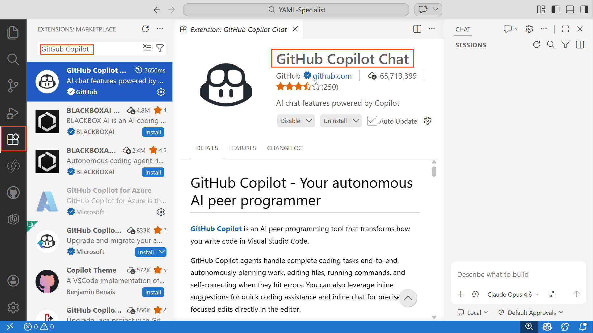

1. Verify you are in **Agent** mode by checking the mode selector at the top of the chat panel - select **Agent** if a different mode is shown  
    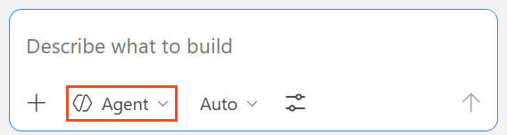
    Agent mode allows GitHub Copilot to use tools, read files, run terminal commands, and interact with extensions. This is the mode required for the Copilot Studio skills to function.

### 💾 2.2 Install the Copilot Studio Skills

The [skills-for-copilot-studio](https://github.com/microsoft/skills-for-copilot-studio) repository from Microsoft contains specialized skills that teach GitHub Copilot how to author valid Copilot Studio YAML. The skills cover creating and editing topics, actions, knowledge sources, and global variables.

1. Open a terminal in VS Code (press `` Ctrl+` ``)

1. Clone the skills repository to a folder **relative to your agent project**:

    ```bash
    gh repo clone microsoft/skills-for-copilot-studio "../skills-for-copilot-studio"
    ```

    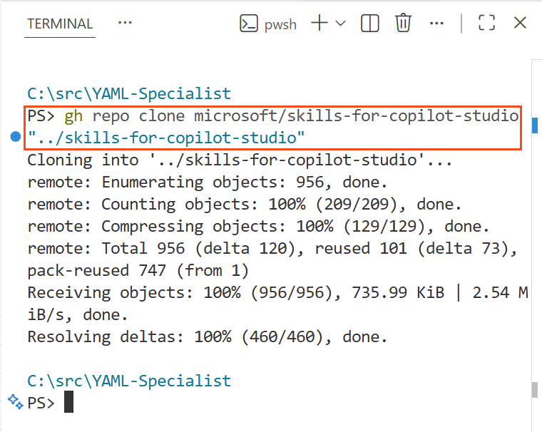

1. Open VS Code **Settings** (`Ctrl+,`)

1. Search for **chat.pluginLocations**

1. Select **Add Item**

1. Enter the following path as the **Item** and set the **Value** to `true`:

    ```text
    ..\skills-for-copilot-studio
    ```

1. Verify the skills are loaded by opening the **Extensions** panel, selecting the filter icon, and choosing **Agent Plugins** - you should see the `skills-for-copilot-studio` entry  
    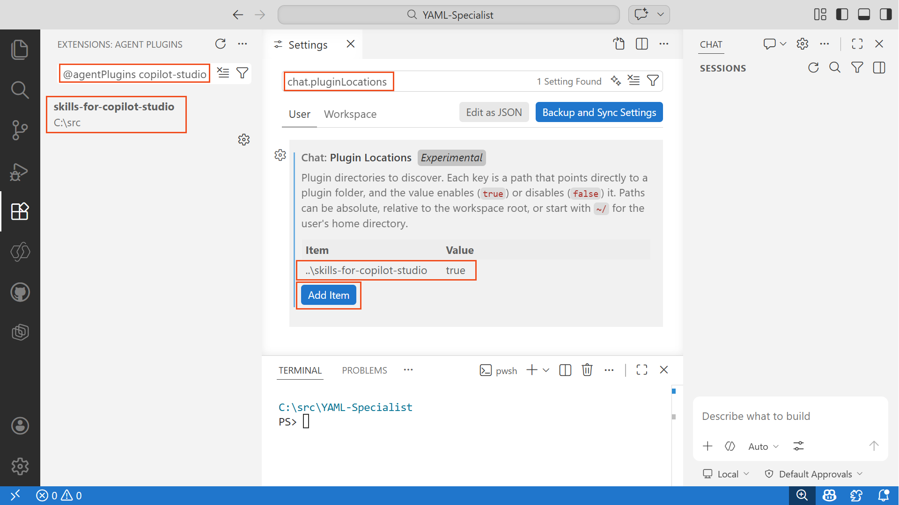

> [!TIP]
> When you use GitHub Copilot in Agent mode, it can now invoke the Copilot Studio skills to produce schema-compliant YAML. The skills understand the full agent definition language including topics, variables, entities, conditions, Power Fx functions, and more.

## 💪 3. Build a ConversationInit Topic with AI

You'll use GitHub Copilot with the Copilot Studio skills to generate a `ConversationInit` topic. This topic detects the user's country from their timezone and personalizes the travel experience.

### 🤖 3.1 Generate the ConversationInit Topic

1. Open the **GitHub Copilot Chat** panel (`Ctrl+Alt+I`). You can use the **Maximize Secondary Side Bar** icon to maximize the chat window.

1. Verify you are in **Agent** mode

1. Enter the following prompt:

    ```text
    Create a ConversationInit topic that detects the user's country from
    System.Conversation.LocalTimeZone using AnswerQuestionWithAI, shows them
    the result, and asks them to confirm or correct it using AnswerQuestionWithAI. Store the confirmed
    country in Global.UserCountry. Update the agent instructions to use
    {Global.UserCountry} for tailored travel advice. Be sure to initialize the value of Global.UserCountry to be DEFAULT inside the ConversationStart Topic.
    ```

1. Wait for GitHub Copilot to generate the YAML - it creates a new `.mcs.yaml` file in the `topics/` folder, and likely edit the `agent.mcs.yml` and add a new variable definition  
    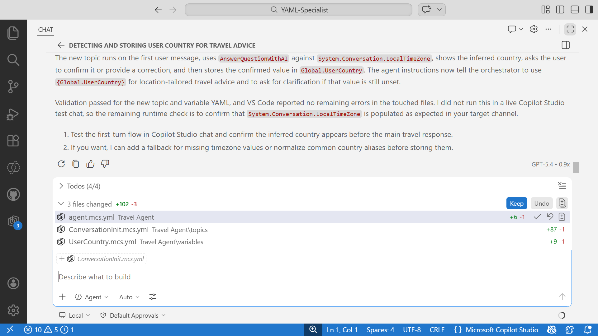

1. At various points during the chat process, you will see GitHub Copilot reading both the current workspace files, and the Copilot Studio Skills in order to learn about how to perform the task you have given it. You can select the file references to view the skill instructions that are being used. Each file is in Markdown format (`SKILL.md`)  
    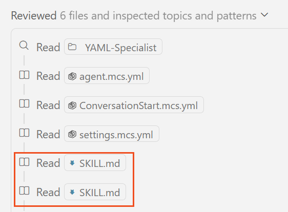

1. Select the Copilot Studio extension that should show the number of changes made by GitHub Copilot. Review the generated topic file and verify the structure:

    - A `kind: AdaptiveDialog` at the top
    - An appropriate trigger (e.g., `OnActivity`)
    - Use of `AnswerQuestionWithAI` to infer the country from the timezone
    - A `Question` node asking the user to confirm or correct the detected country
    - Storage of the result in `Global.UserCountry`  
        

1. You can select **Keep** or **Undo** to accept or reject the changes made by the agent. Here is an example of the content that might have been generated

    ```yaml
    # Name: Conversation Init
    # This system topic runs on the first user message to confirm the user's country for travel advice.
    kind: AdaptiveDialog
    modelDescription: null
    beginDialog:
      kind: OnActivity
      id: main
      type: Message
      condition: =Or(IsBlank(Global.UserCountry), Global.UserCountry = "DEFAULT")
      actions:
        - kind: AnswerQuestionWithAI
          id: answerQuestion_L9f2Qs
          autoSend: false
          variable: init:Topic.InferredCountry
          userInput: '=Concatenate("Infer the single most likely country from this timezone identifier: ", System.Conversation.LocalTimeZone)'
          additionalInstructions: |-
            Return only a single country name in plain text.
            If the timezone could map to multiple countries or the value is missing, return Unknown.
            Do not include any explanation or punctuation.
    
        - kind: ConditionGroup
          id: conditionGroup_9mY2La
          conditions:
            - id: conditionItem_2wJ7Pr
              condition: =Topic.InferredCountry = "Unknown"
              actions:
                - kind: SendActivity
                  id: sendMessage_1rNd8V
                  activity: I couldn't confidently infer your country from your timezone. Please tell me your country or region.
    
                - kind: Question
                  id: question_6xQm4C
                  alwaysPrompt: true
                  interruptionPolicy:
                    allowInterruption: false
                  variable: Topic.UnknownCountryResponse
                  prompt: What country or region should I use for your travel advice?
                  entity: StringPrebuiltEntity
    
                - kind: AnswerQuestionWithAI
                  id: answerQuestion_7mHg2P
                  autoSend: false
                  variable: Topic.UnknownCountryNormalized
                  userInput: '=Concatenate("Extract the country name from this user response: ", Topic.UnknownCountryResponse)'
                  additionalInstructions: |-
                    Return only a single country name in plain text.
                    If no country is provided, return Unknown.
                    Do not include any explanation or punctuation.
    
                - kind: SetVariable
                  id: setVariable_3pTk7M
                  variable: Global.UserCountry
                  value: =If(Topic.UnknownCountryNormalized = "Unknown", "DEFAULT", Topic.UnknownCountryNormalized)
    
          elseActions:
            - kind: SendActivity
              id: sendMessage_5bHv2N
              activity: I inferred that your country is {Topic.InferredCountry} based on your timezone. Is that correct?
    
            - kind: Question
              id: question_8cLs5D
              alwaysPrompt: true
              interruptionPolicy:
                allowInterruption: false
              variable: Topic.CountryConfirmationResponse
              prompt: Is that correct? Reply with yes, or provide the country I should use instead.
              entity: StringPrebuiltEntity
    
            - kind: AnswerQuestionWithAI
              id: answerQuestion_3qRt6Y
              autoSend: false
              variable: Topic.ConfirmedCountry
              userInput: '=Concatenate("Inferred country: ", Topic.InferredCountry, ". User response: ", Topic.CountryConfirmationResponse)'
              additionalInstructions: |-
                Decide the final country to use.
                If the user confirms, return the inferred country exactly.
                If the user provides a correction, return only the corrected country name.
                If unclear, return Unknown.
                Return plain text only with no punctuation.
    
            - kind: SetVariable
              id: setVariable_6dXp9J
              variable: Global.UserCountry
              value: =If(Topic.ConfirmedCountry = "Unknown", Topic.InferredCountry, Topic.ConfirmedCountry)
    
        - kind: SendActivity
          id: sendMessage_4vJc6X
          activity: Thanks. I'll use {Global.UserCountry} to tailor travel advice in this conversation.
    ```

1. Check the **Problems** pane (`Ctrl+Shift+M`) for any YAML validation errors. You can ignore any errors in the skills-for-copilot-studio folder. Only concentrate on the files that are edited by the agent

1. Fix any errors flagged by the extension. These will be usually underlined in a squiggly red line. You can simply ask GitHub Copilot to fix the errors.  
    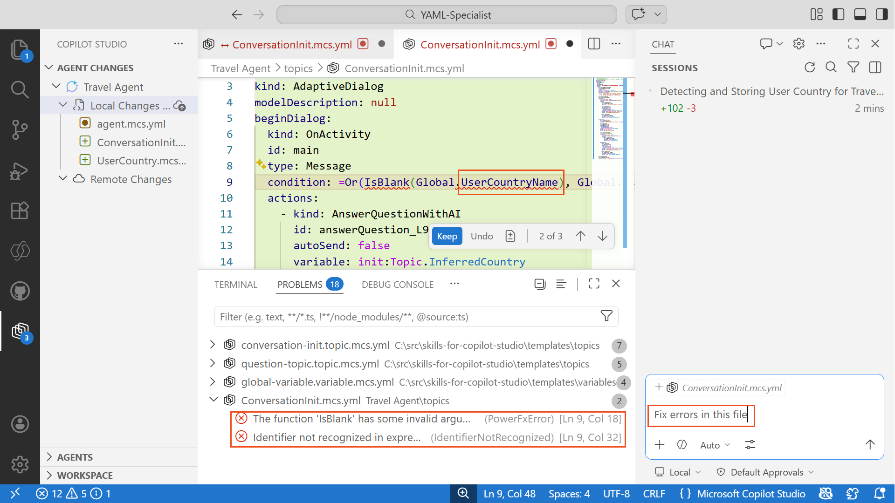

> [!WARNING]
> AI-generated YAML may contain errors. Always validate the output using the Problems pane before applying changes. If you see errors, paste the error message into the chat and ask GitHub Copilot to fix them.

### 🔎 3.2 Review the Updated Agent Instructions

GitHub Copilot should also have updated the `agent.mcs.yaml` file to reference `{Global.UserCountry}` in the instructions (or something similar)

1. Open `agent.mcs.yaml` in the Explorer
1. Locate the `instructions` section and look for references to `{Global.UserCountry}`
1. This is a reference to a variable to ensure that the instructions are specific to the current user's location.

## 💪 4. Add Knowledge Sources and Guardrails

A travel agent is only as good as its intel. In this section, you'll use GitHub Copilot to add public website knowledge sources and safety guardrails.

### 🤖 4.1 Add Knowledge Sources via AI

1. Open the **GitHub Copilot Chat** panel

1. Enter the following prompt:

    ```text
    Add public website knowledge sources for Lonely Planet, TripAdvisor,
    US State Department travel advisories (travel.state.gov), UK government
    foreign travel advice, and CDC travel health information. Add guardrails
    to the agent instructions: travel topics only, no bookings, no medical
    advice, cite sources for safety information.
    ```

1. Review the changes GitHub Copilot proposes - it should modify knowledge configuration files and update the agent instructions  
    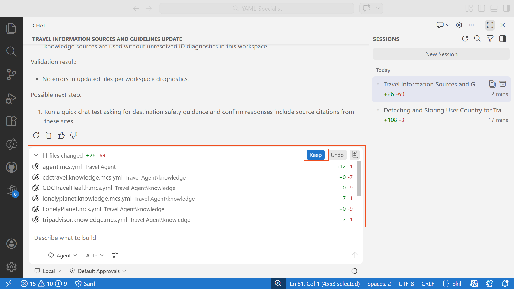

1. Verify the knowledge sources appear in the agent definition or knowledge folder, and select **Keep**

1. Open `agent.mcs.yaml` and confirm that guardrails have been added to the instructions

## 💪 5. Apply Changes and Test

In this section, you'll upload your local changes to Copilot Studio and test the agent.

### 🚀 5.1 Preview and Apply Changes

The Copilot Studio extension provides three synchronization operations:

| Operation | Direction | Description |
| --- | --- | --- |
| **Preview** | Cloud → Local | Check for remote changes without modifying local files |
| **Get** | Cloud → Local | Download and apply remote changes, with conflict resolution |
| **Apply** | Local → Cloud | Upload local changes to Copilot Studio (does not publish) |

1. Select the **Copilot Studio** icon in the Activity Bar

1. In the **Agent Changes** pane, select **Preview** to check for any remote changes made since you cloned  
    

1. The extension will eventually report **Successfully completed previewing changes**. If remote changes exist, select **Get** to download them and resolve any conflicts before proceeding.

1. Review your local changes listed under **Local Changes** - you should see the new topic file, updated agent instructions, and knowledge source changes

1. Select **Apply changes**, and then select your agent name. This will upload your local changes to Copilot Studio  
    

1. Wait for the apply operation to complete - a success notification confirms your changes are live: **Successfully completed applying changes**

> [!IMPORTANT]
> The **Apply** operation uploads your changes to the live agent definition but does **not** publish the agent. You can test changes in the Copilot Studio test pane immediately after applying. To make the agent available to end users on channels, you still need to **Publish** from Copilot Studio.

### 🧪 5.2 Test the Agent in Copilot Studio

1. Navigate to [Copilot Studio](https://copilotstudio.microsoft.com)

1. Re-open your **Travel Agent** (or simply refresh the window you had open previously)

1. Select the **Test your agent** pane on the right side

1. Select the **+** icon to start a new conversation

1. Ask a travel-related question:

    ```text
    I'm planning a business trip to Tokyo next month. What should I know about safety and cultural etiquette?
    ```

1. Verify the agent provides destination-specific advice, cites sources, and respects the guardrails  
    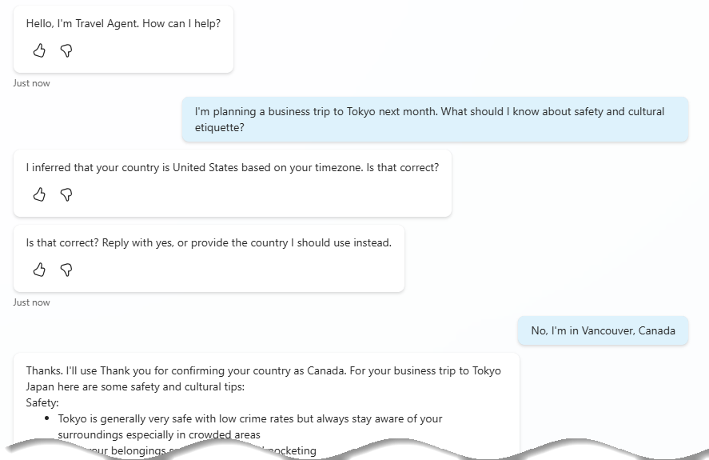

> [!TIP]
> If the agent doesn't behave as expected, return to VS Code, adjust the YAML, and **Apply** again. This rapid iterate-and-test cycle of multiple related source files in one go, is one of the key tactical advantages of YAML authoring - precise edits in code with results in seconds.

## 💡 YAML Authoring Best Practices

Here are some practical tips for YAML agent development.

### Naming Conventions

**Files:**

- Use kebab-case: `conversation-init.topic.mcs.yaml`
- Be descriptive: `travel-safety-check.topic.mcs.yaml` not `topic1.yaml`
- Use the type suffix: `.topic.yaml`, `.tool.yaml`, `.trigger.yaml`

**IDs and variables:**

- Use camelCase: `userCountry`, `travelDestination`
- Be descriptive: `checkTravelAdvisory` not `check1`
- Avoid abbreviations: `destinationCountry` not `dest`

### Comments for Complex Logic

```yaml
# Check if user confirmed their country or provided a correction
# If confirmed, proceed with the detected country
# If corrected, update the Global.UserCountry variable
- kind: ConditionGroup
  id: condition_countryConfirm
  conditions:
    - id: condition_confirmed
      condition: =Topic.CountryConfirmed = true
```

### Troubleshooting YAML

| Pitfall | Symptom | Fix |
| --- | --- | --- |
| Wrong indentation | Validation errors, broken topics | Use 2-space indentation consistently |
| Missing `id` on nodes | Apply fails or duplicate IDs | Give every node a unique `id` |
| Missing `=` prefix on conditions | Condition treated as literal string | Always prefix Power Fx expressions with `=` |
| Using tabs instead of spaces | Parser errors | Configure VS Code to insert spaces for YAML files |
| Periods in topic names | Solution export fails | Avoid `.` in topic display names |

## 📚 Further Intel

📖 [Overview of the Copilot Studio VS Code Extension](https://learn.microsoft.com/microsoft-copilot-studio/visual-studio-code-extension-overview?WT.mc_id=power-XXXXXX-scottdurow)

📖 [Install and Configure the VS Code Extension](https://learn.microsoft.com/microsoft-copilot-studio/visual-studio-code-extension-install-configure?WT.mc_id=power-XXXXXX-scottdurow)

📖 [Clone Your Agent in VS Code](https://learn.microsoft.com/microsoft-copilot-studio/visual-studio-code-extension-clone-agent?WT.mc_id=power-XXXXXX-scottdurow)

📖 [Edit Agent Components in VS Code](https://learn.microsoft.com/microsoft-copilot-studio/visual-studio-code-extension-edit-agent-components?WT.mc_id=power-XXXXXX-scottdurow)

📖 [Synchronize Your Changes](https://learn.microsoft.com/microsoft-copilot-studio/visual-studio-code-extension-synchronization?WT.mc_id=power-XXXXXX-scottdurow)

📖 [Use the Code Editor for YAML in Topics](https://learn.microsoft.com/microsoft-copilot-studio/guidance/topics-code-editor?WT.mc_id=power-XXXXXX-scottdurow)

📖 [Add a Public Website as a Knowledge Source](https://learn.microsoft.com/microsoft-copilot-studio/knowledge-add-public-website?WT.mc_id=power-XXXXXX-scottdurow)

📖 [Safe Travels Agent Template](https://learn.microsoft.com/microsoft-copilot-studio/template-safe-travels?WT.mc_id=power-XXXXXX-scottdurow)

📖 [Topics Overview in Copilot Studio](https://learn.microsoft.com/microsoft-copilot-studio/guidance/topics-overview?WT.mc_id=power-XXXXXX-scottdurow)

📖 [Create and Edit Topics](https://learn.microsoft.com/microsoft-copilot-studio/authoring-create-edit-topics?WT.mc_id=power-XXXXXX-scottdurow)

🔗 [Copilot Studio VS Code Extension - GitHub Issues](https://github.com/microsoft/vscode-copilotstudio/issues)

🔗 [Skills for Copilot Studio - GitHub Repository](https://github.com/microsoft/skills-for-copilot-studio)

🔗 [Copilot Studio Extension - VS Code Marketplace](https://marketplace.visualstudio.com/items?itemName=ms-CopilotStudio.vscode-copilotstudio)

## 🏅 Claim your completion badge

<!-- markdownlint-disable-next-line MD033 -->
<p align="center"></p>

Congrats, agent - mission accomplished! Now it's time to claim your badge.

Simply submit the badge request form and answer all required questions:

[https://aka.ms/agent-academy-special-ops/yaml-specialist/form](https://aka.ms/agent-academy-special-ops/yaml-specialist/form)

Once your submission is reviewed, you will receive an email from Global AI Community with instructions to claim your badge.

> [!TIP]
> If you do not see the email, check your spam or junk folder.

<!-- markdownlint-disable-next-line MD033 -->

