---
tags:
    - YAML
    - Copilot Studio
    - VS Code
    - GitHub Copilot
difficulty: 3
badge: ../assets/YAML_Specialist_Badge.png
---

# 🧬 YAML Specialist

<!-- markdownlint-disable-next-line MD033 -->
<p align="center"></p>

> **Difficulty**: ⭐⭐⭐ | **Time**: ~60 min

Welcome, agent. Your mission - should you choose to accept it - is to become a **YAML Specialist** - an operative who builds and extends Microsoft Copilot Studio agents entirely from Visual Studio Code using the Copilot Studio YAML agent definition language. You're going deep cover: cloning agents, writing topics in raw YAML, wiring up knowledge sources, and pushing changes back to the cloud - all from your local command center. With GitHub Copilot as your handler, you'll iterate at speeds the web UI can't match.

**Mission objectives:**

- Set up the Copilot Studio VS Code extension and clone an agent to your local machine
- Understand the YAML agent definition file structure - topics, actions, triggers, and knowledge
- Write and edit YAML topics by hand with IntelliSense validation
- Leverage GitHub Copilot Agent Mode with specialized skills to generate and refine agent YAML
- Synchronize local changes back to Copilot Studio and test the agent in the cloud

## ⚙️ Prerequisites

This mission assumes you have completed the [Operative course](/operative/) and have a working Copilot Studio environment. In addition, make sure you have the following installed:

- **Visual Studio Code** - Download and install from [code.visualstudio.com](https://code.visualstudio.com/). Select the installer for your operating system (Windows, macOS, or Linux).
- **Node.js (LTS)** - Required by the Copilot Studio VS Code extension. Download from [nodejs.org](https://nodejs.org/). Choose the **LTS** version. Verify with `node --version` in a terminal.

> [!TIP]
> If you already have VS Code installed, you can install the GitHub Copilot and Copilot Studio extensions later during the hands-on labs. The labs walk you through each extension installation step by step.

## ❓ What is YAML Authoring for Copilot Studio?

> [!INFO] What is YAML?
> YAML is a simple text format for storing structured information. Think of it like a well-organized outline - instead of using curly braces or angle brackets, YAML uses **indentation** (spaces) to show how things are nested. This makes it easy to read even if you've never seen it before. For example:
>
> ```yaml
> name: Travel Agent
> language: English
> settings:
>   greeting: Hello! How can I help you travel safely?
>   topics:
>     - safety-tips
>     - cultural-advice
> ```
>
> Notice how `settings` is indented under the main level, and `greeting` and `topics` are indented further inside `settings`. That's really all there is to it - **names on the left, values on the right, separated by a colon, with indentation showing structure**. YAML files use the `.yaml` or `.yml` extension. In Copilot Studio, every part of your agent - topics, tools, triggers, and settings - is stored in YAML files.

Every Copilot Studio agent has a definition - a set of YAML files that describe its personality, topics, tools, knowledge sources, and triggers. When you build an agent in the Copilot Studio web UI, you're really editing these YAML files behind the scenes. The web canvas provides a visual representation, but the **source of truth** is always YAML.

> [!TIP]
> You can peek at the YAML behind any topic or tool directly in the web canvas. Open a topic, then select **Open code editor** in the toolbar to see the raw YAML. This is a great way to learn the schema before moving to VS Code.

The Copilot Studio extension for Visual Studio Code gives you direct access to these agent definition files. You can:

- **Clone** an agent from the cloud to your local file system
- **Edit** topics, instructions, knowledge, and tools using structured YAML with IntelliSense
- **Apply** your changes back to the cloud for testing
- **Version control** your agent definitions with Git

This is how professional agent developers work - treating agent definitions as code, collaborating through pull requests, and iterating rapidly with AI assistance.

## 🆚 Web UI vs YAML Authoring: When to Use Each

| Aspect | Web UI (Copilot Studio) | YAML Authoring (VS Code) |
| --- | --- | --- |
| **Best for** | Visual exploration, quick prototyping | Large-scale development, team collaboration |
| **Editing speed** | Point-and-select, one node at a time | Full-text search, bulk edits across files |
| **AI assistance** | Copilot in the canvas | GitHub Copilot Agent Mode with specialized skills |
| **Collaboration** | One author at a time per topic | Multiple developers via Git branches |
| **Testing** | Built-in test pane | Apply changes, then test in Copilot Studio |
| **Learning curve** | Low - visual and guided | Medium - requires YAML and VS Code familiarity |

> [!TIP]
> You don't have to choose one or the other. Many teams use the web UI for initial prototyping and switch to YAML authoring for production-grade development. Changes made in the web UI can be pulled down with a **Get** operation, and local YAML changes can be pushed up with **Apply**.

## 📁 The Agent Definition File Structure

When you clone a Copilot Studio agent, the extension creates a structured directory on your machine. Understanding this structure is important:

```text
my-agent/
├── actions/                  # Connectors
│   ├── DevOpsAction.mcs.yml  
│   └── GetItems.mcs.yml      
├── knowledge/files/               # Knowledge sources
│   ├── source1.mcs.yml
│   └── source2.mcs.yml
├── topics/                   # Conversation topics
│   ├── greeting.mcs.yml
│   ├── help.mcs.yml
│   └── escalate.mcs.yml
├── variables/                # Global variable definitions
│   └── UserCountry.mcs.yml
├── workflows/                    # Agent tools and actions
│   └── GetDevOpsItems
│       ├── metadata.yaml
│       └── workflow.json
│   └── GetMeetings
│       ├── metadata.yaml
│       └── workflow.json
├── trigger/                 # Event triggers
│   └── welcometrigger.mcs.yml
├── agent.mcs.yml                 # Main agent definition
├── icon.png                      # Icon used for the agent, visible in test panel and in supported channels
├── settings.mcs.yml              # Configuration settings for the agent
└── connectionreferences.mcs.yml  # Connection References used by Connectors and other actions
```

**Key files to know:**

| File / Folder | Purpose |
| --- | --- |
| `agent.mcs.yml` | Main agent definition - name, description, instructions, and schema |
| `topics/` | Each `.mcs.yml` file is a topic with triggers, actions, and conversation logic |
| `actions/` | Connector tool definitions - connectors, REST APIs, MCP servers |
| `knowledge/files/` | Uploaded knowledge documents |
| `variables/` | Global variable definitions used across topics |
| `settings.mcs.yml` | Agent configuration and orchestration settings |
| `workflows/` | Agent flows used as tools |
| `trigger/` | Event-based triggers (schedules, conditions) |
| `connectionreferences.mcs.yml` | Connection References used by Connectors and other actions |

## 🔧 YAML Topic Anatomy

Topics are the conversation building blocks of your agent. Each topic is an `AdaptiveDialog` written in YAML. Here's the anatomy of a simple greeting topic:

```yaml
kind: AdaptiveDialog
beginDialog:
  kind: OnConversationStart
  id: main
  actions:
    - kind: SendActivity
      id: sendMessage_greeting
      activity:
        text:
          - Hello, I'm {System.Bot.Name}. How can I help?
        speak:
          - Hello and thank you for calling {System.Bot.Name}.
```

**Key YAML elements:**

- **`kind`** - The node type (`AdaptiveDialog`, `SendActivity`, `Question`, `ConditionGroup`, etc.)
- **`id`** - A unique identifier for each node
- **`actions`** - An ordered list of steps the topic executes
- **`variable`** - Variable assignment using `init:Topic.VariableName` syntax
- **`entity`** - Entity type for question nodes (e.g., `BooleanPrebuiltEntity`, `StringPrebuiltEntity`)
- **`condition`** - Power Fx expressions for conditional logic (prefixed with `=`)

### Questions and Variables

```yaml
- kind: Question
  id: question_askName
  alwaysPrompt: true
  variable: init:Topic.UserName
  prompt: What is your name?
  entity: StringPrebuiltEntity
```

### Conditional Logic with Power Fx

```yaml
- kind: ConditionGroup
  id: condition_checkResponse
  conditions:
    - id: condition_yes
      condition: =Topic.Continue = true
      actions:
        - kind: SendActivity
          id: sendMessage_continue
          activity: Go ahead. I'm listening.
    - id: condition_no
      condition: =Topic.Continue = false
      actions:
        - kind: SendActivity
          id: sendMessage_goodbye
          activity: Goodbye! Have a great day.
```

> [!NOTE]
> Power Fx expressions in conditions must be prefixed with `=`. This tells the YAML parser that the value is an expression, not a literal string.

### Topic Trigger Types

Topics use different trigger types depending on when they should fire:

- **`OnConversationStart`** - Fires once automatically when the conversation begins. Used for greeting messages.
- **`OnRecognizedIntent`** - Fires when the user says something that matches a trigger phrase.
- **`OnActivity`** - Fires on specific activity types (e.g., `Message`). Can include a `condition` property with a Power Fx expression to control when it activates. This is useful for topics that should run on every message but only when certain conditions are met.

> [!TIP]
> Use `OnActivity` with a `condition` when you need a topic to fire based on runtime state (like checking a global variable) rather than based on what the user said.

## ⚙️ 1. Set Up and Clone Your Agent

In this section, you'll create a Travel Agent in Copilot Studio and clone it to your local machine using the VS Code extension.

### 1.1 Create a Solution and Agent in Copilot Studio

First, create a dedicated solution and a blank Travel Agent. This gives you a real agent to work with throughout the mission.

1. Navigate to [Copilot Studio](https://copilotstudio.microsoft.com)

1. Verify your **environment** is correct by checking the environment selector in the top-right corner. If you need to change it, select the environment name and choose your developer or sandbox environment.

1. Select **...** in the left navigation and select **Solutions**  
    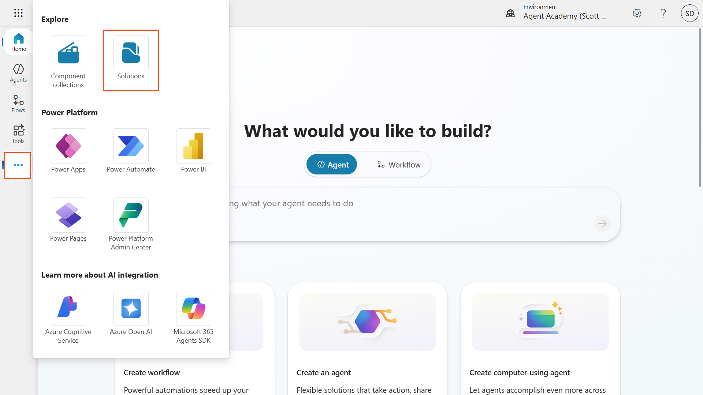

1. Select **New Solution**

1. Configure the solution with the following settings:

    | Setting | Value |
    | --- | --- |
    | Display Name | `Travel Agent` |
    | Publisher | Select **New publisher** |

1. Configure the new publisher:

    | Setting | Value |
    | --- | --- |
    | Display Name | `Travel Agent` |
    | Name | `TravelAgent` |
    | Prefix | `ta` |

1. Select **Save** on the publisher dialog

1. Check **Set as your preferred solution**

1. Select **Create**  
    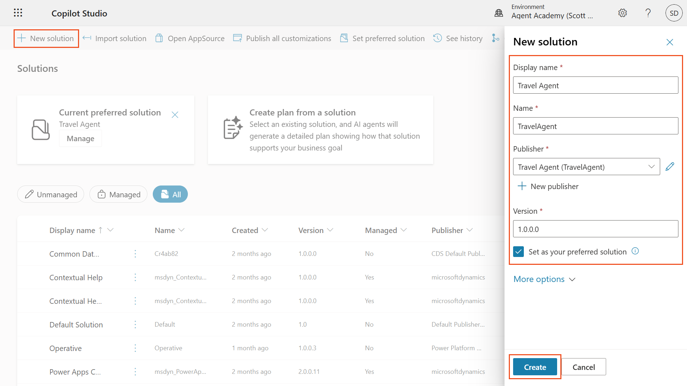

1. Navigate back to Copilot Studio by selecting the **Copilot Studio** logo in the top-left

1. Select **Agents** in the left navigation

1. Select **+ Create blank agent** and then select **Advanced Create** at the bottom of the dialog  
     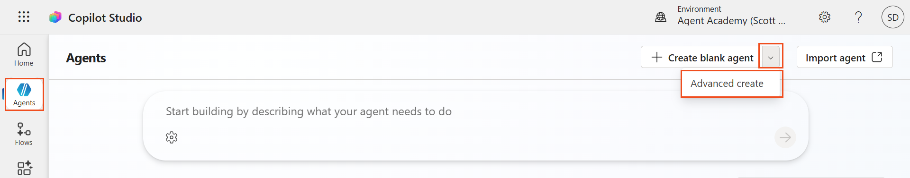

1. Configure the agent with the following settings:

     | Setting | Value |
     | --- | --- |
     | Language | `English (United States)` |
     | Solution | `Travel Agent` |
     | Schema name | `ta_travelagent` |

1. Select **Confirm and create**  
     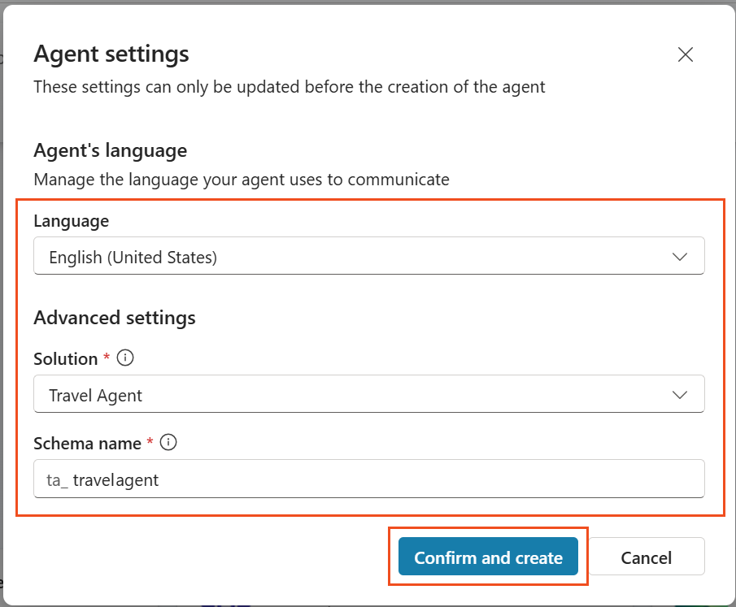

1. Wait until the agent is finished provisioning - a green bar displays the message **Your agent has been provisioned**
     

1. Select **Edit** in the **Details** section, and update the name to be `Travel Agent`

1. Select **Save**

1. Select **Edit** in the **Instructions** section on the overview page

1. Enter the following instructions:

     ```text
     You are a travel assistant for company employees. Help them prepare for
     business trips by providing destination-specific travel advice, safety
     information, and cultural tips. Always be helpful, concise, and professional.
     ```

1. Select **Save**  
     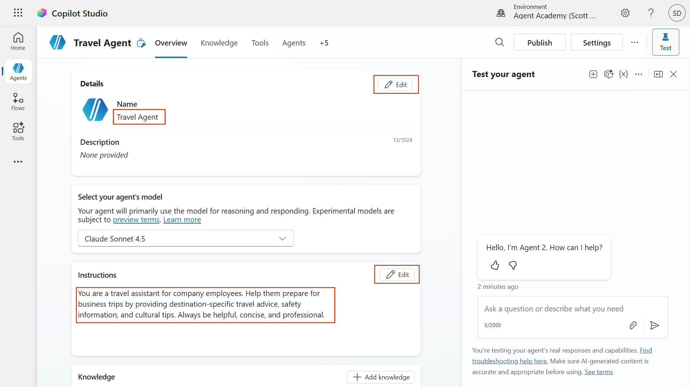

### 1.2 Install the Copilot Studio VS Code Extension

Next, install the Copilot Studio extension for VS Code.

1. Open **Visual Studio Code** (download from [code.visualstudio.com](https://code.visualstudio.com/) if not installed)
1. Select the **Extensions** icon in the Activity Bar on the left side (or press `Ctrl+Shift+X`)
1. In the search bar, type **ms-copilotstudio.vscode-copilotstudio**
1. Locate the extension published by **Microsoft** and select **Install**  
    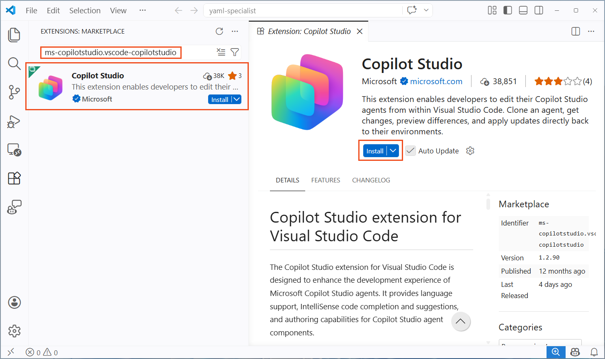
1. Wait for the installation to complete - VS Code may prompt you to reload
1. Select the **Copilot Studio** icon that now appears in the Activity Bar
1. Select **Allow** when prompted in the popup notification asking "The extension 'Copilot Studio' wants to sign in using Microsoft"  
    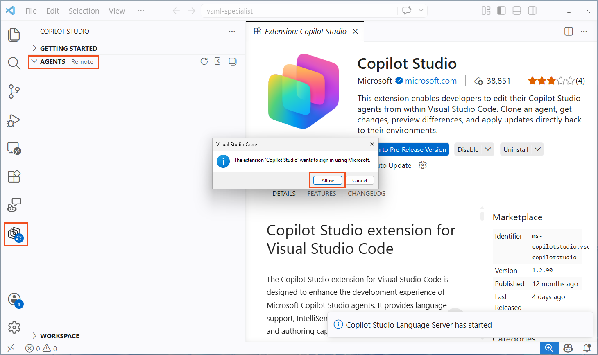
1. Select your account to sign in with, and enter your credentials and complete any multi-factor authentication
1. Return to VS Code - inside the **Copilot studio** panel, collapse the **Getting Started** section and expand the **Agents** section
1. Your environments and agents should now be listed after a short loading delay  
    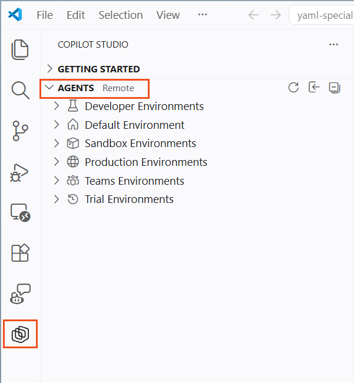

> [!IMPORTANT]
> You need read and write access to the Copilot Studio environment where your Travel Agent lives. If you don't see your agent in the Agents pane, verify you're signed in with the correct account and select the right environment from the dropdown.

### 1.3 Clone the Travel Agent to Your Local Machine

Now clone your agent to a local folder so you can work with the YAML files directly.

1. Select your target **environment** from the dropdown menu

1. Locate the **Travel Agent** (or the name you gave your agent) in the agent list

    > [!TIP]
    > The environment and agent tree can sometimes time out while loading. If the list appears empty or stops loading, select the **Refresh** button at the top of the Agents pane and try expanding the tree again.

1. Right-click on the agent name and select **Clone agent**  
    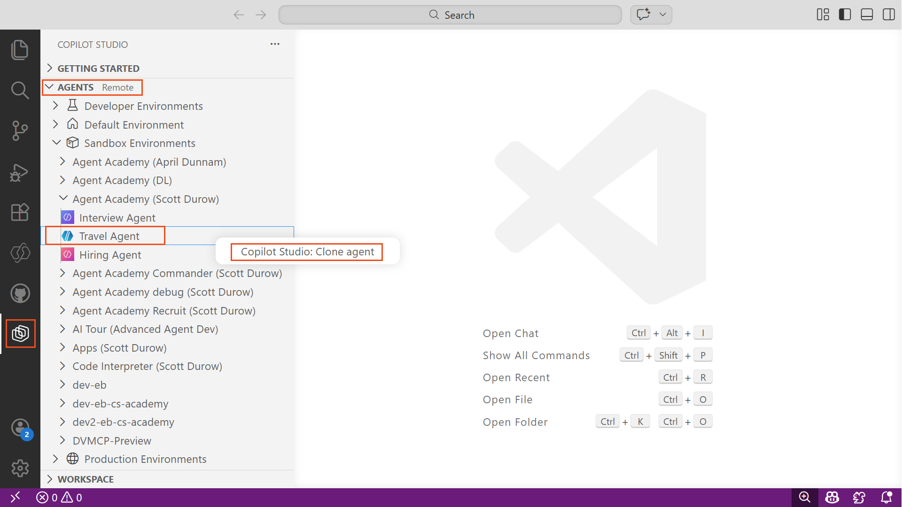

1. In the file picker dialog, navigate to an appropriate folder (or create a new folder like `travel-agent`)

1. Select the **Select Folder** button

1. Wait for the cloning process to complete - a progress notification appears, followed by a success message: **Agent Cloned successfully**. VS Code will automatically open the folder you selected.  
    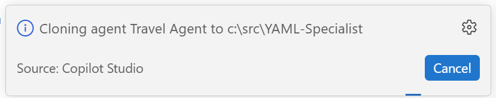

1. Verify the cloned file structure in the VS Code **Explorer** panel - you should see `agent.mcs.yml`, the `topics/` folder, and other definition files

> [!NOTE]
> The clone operation downloads the full agent definition - topics, actions, knowledge, workflows, triggers, and configuration. This is your local working copy. Changes you make here won't affect the cloud agent until you explicitly **Apply** them.

### 1.4 Explore the Agent Definition

Before making changes, take a look at what was cloned.

1. Open `agent.mcs.yml` in the Explorer - this is the main agent definition containing the name, description, and instructions  
    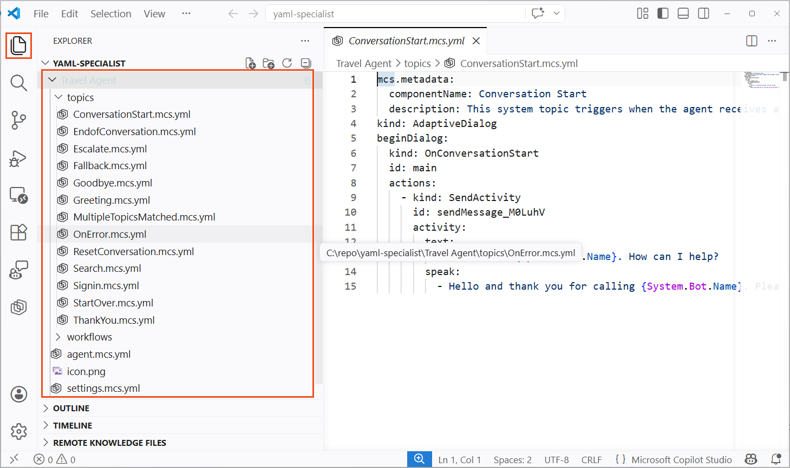

1. Review the `topics/` folder - each `.mcs.yml` file represents a conversation topic

1. Open any existing topic file and examine the YAML structure - notice the `kind`, `id`, and `actions` properties

1. Open `settings.mcs.yml` - this contains orchestration and configuration settings

1. Press `Ctrl+Space` inside any YAML file to see IntelliSense suggestions from the Copilot Studio extension

1. Press `Ctrl+Shift+M` to open the **Problems** pane - the extension validates your YAML in real-time and flags errors with red underlines

> [!TIP]
> Use `Ctrl+F` to search across your entire agent definition. This is much faster than navigating between topics in the web UI, especially for agents with dozens of topics and tools.

## 💪 2. Enable GitHub Copilot with Copilot Studio Skills

GitHub Copilot is a powerful AI coding assistant, but out of the box it doesn't know the Copilot Studio YAML schema. By installing specialized **agent skills**, you give GitHub Copilot deep knowledge of the YAML agent definition language — enabling it to generate valid topics, actions, and configurations on demand. In this section, you'll set up the GitHub Copilot CLI inside VS Code and install the Copilot Studio skills.

### 2.1 Install and Open GitHub Copilot CLI

1. Ensure you have a [GitHub Copilot subscription](https://docs.github.com/en/copilot/about-github-copilot/subscription-plans-for-github-copilot). The **free tier** (no credit card required) works for this mission — it includes Agent mode, Copilot CLI, and 50 chat/agent requests per month. This mission uses approximately 5-10 requests, so the free allocation is plenty. If you've already used your monthly requests, you'll need to wait for them to reset or upgrade to [Copilot Pro](https://github.com/features/copilot/plans) which includes unlimited chat with GPT-5 mini and 300 premium requests. Verified students and teachers get Copilot Pro for free.

1. Open VS Code, select the **Extensions** icon in the Activity Bar (or press `Ctrl+Shift+X`), search for **github.copilot-chat**, and select **Install** if it is not already installed  
    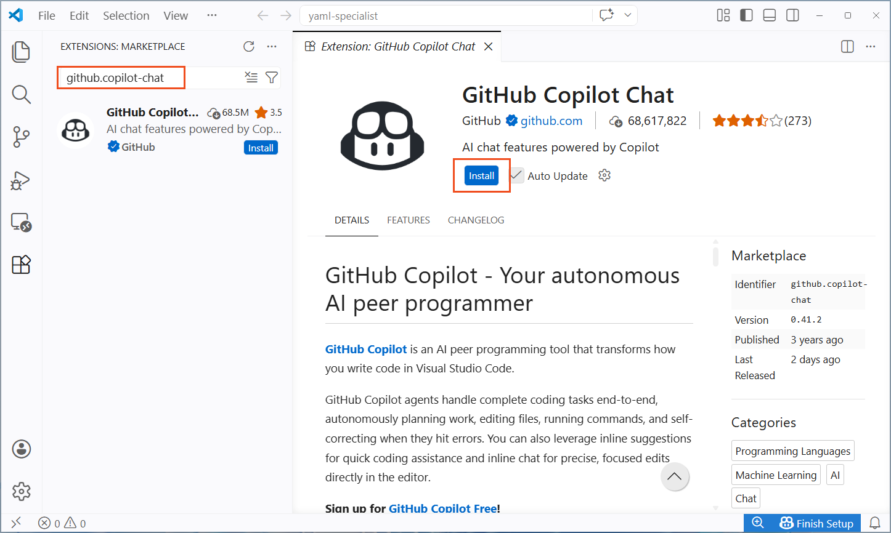

1. **Sign in** to GitHub if prompted

1. Open a terminal in VS Code (**Terminal** → **New Terminal** from the menu bar, or `` Ctrl+` ``), select the **+** dropdown arrow next to the terminal tabs, and choose **GitHub Copilot CLI**. If the CLI is not yet installed, VS Code will prompt you to install it — follow the prompts to complete the installation. See [Installing GitHub Copilot in the CLI](https://docs.github.com/en/copilot/github-copilot-in-the-cli/installing-github-copilot-in-the-cli) for more details.  
    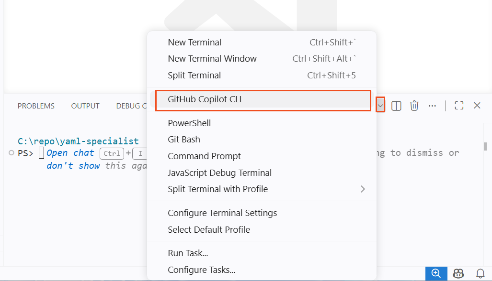

1. You can select the full screen icon on the terminal to expand the GitHub Copilot CLI  
    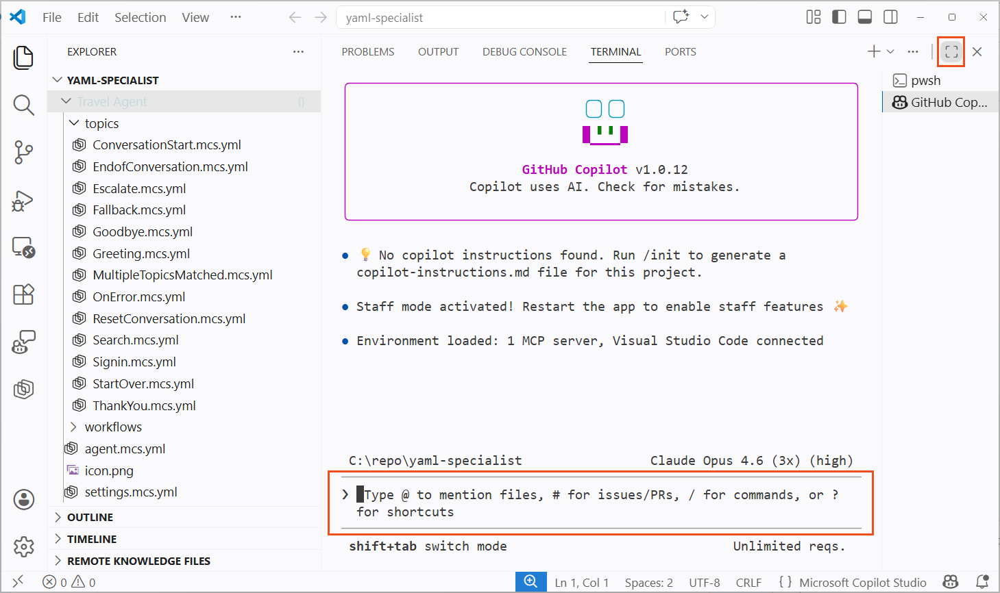

### 2.2 Install the Copilot Studio Skills

The [skills-for-copilot-studio](https://github.com/microsoft/skills-for-copilot-studio) repository from Microsoft contains specialized skills that teach GitHub Copilot how to author valid Copilot Studio YAML. The skills cover creating and editing topics, actions, knowledge sources, and global variables.

1. In the **GitHub Copilot CLI** terminal you opened in section 2.1, add the skills package from the marketplace:

    ```text
    /plugin marketplace add microsoft/skills-for-copilot-studio
    ```

1. Install the skills:

    ```text
    /plugin install copilot-studio@skills-for-copilot-studio
    ```

1. Verify the skills are available by typing `/plugin list` in the CLI terminal — you should see `copilot-studio@skills-for-copilot-studio`

> [!TIP]
> See the full [Setup Guide](https://github.com/microsoft/skills-for-copilot-studio/blob/main/SETUP_GUIDE.md) for additional options including cloning, pushing, testing, and troubleshooting via slash commands.
> You can also open GitHub Copilot CLI outside VS Code by navigating to your agent project folder in any terminal and running `copilot`.

## 🤖 3. Build a ConversationInit Topic with AI

You'll use GitHub Copilot with the Copilot Studio skills to generate a `ConversationInit` topic. This topic detects the user's country from their timezone and personalizes the travel experience.

### 3.1 Generate the ConversationInit Topic

1. In the **GitHub Copilot CLI** terminal you opened in section 2.1, enter the following prompt. If you closed the CLI, open a new terminal (**Terminal** → **New Terminal**, or `` Ctrl+` ``) and select **+ GitHub Copilot CLI** from the dropdown again.

    ```text
    /agent
    ```

1. GitHub Copilot will ask you to **Select Agent**. Select the **Copilot Studio Author**.

1. When making changes, GitHub Copilot will ask you to confirm when it creates and accesses files, if you would like to run in Autopilot mode you can use `shift + tab` to toggle through into **Autopilot**

1. Enter the following prompt:

    ```text
    Create a ConversationInit topic that detects the user's country from
    System.Conversation.LocalTimeZone using AnswerQuestionWithAI, shows them
    the result, and asks them to confirm or correct it using AnswerQuestionWithAI. Store the confirmed
    country in Global.UserCountry. Update the agent instructions to use
    {Global.UserCountry} for tailored travel advice. Be sure to initialize the value of Global.UserCountry to be DEFAULT inside the ConversationStart Topic.
    ```

1. GitHub Copilot will ask you to trust the folder that you are in. Select **Yes, and add these directories to the allowed list**  
    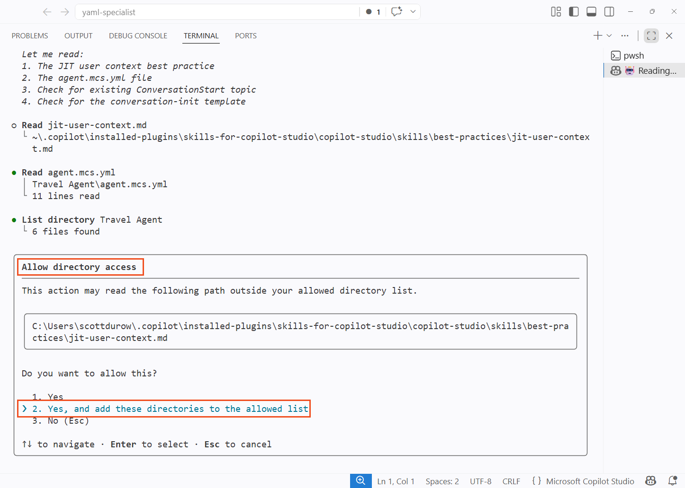

1. If you selected autopilot mode you will also be prompted to enable all permissions  
    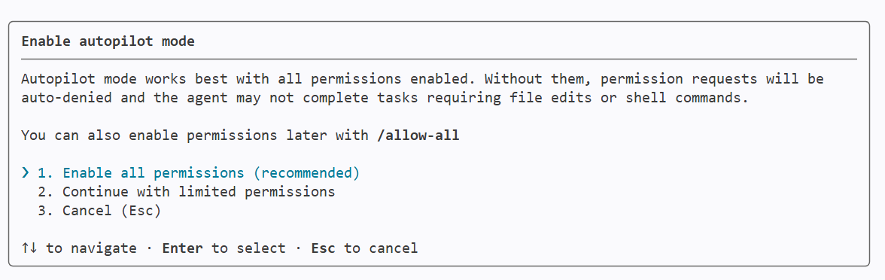

1. Wait for GitHub Copilot to generate the YAML - it creates a new `.mcs.yml` file in the `topics/` folder, and likely edit the `agent.mcs.yml` and add a new variable definition.
    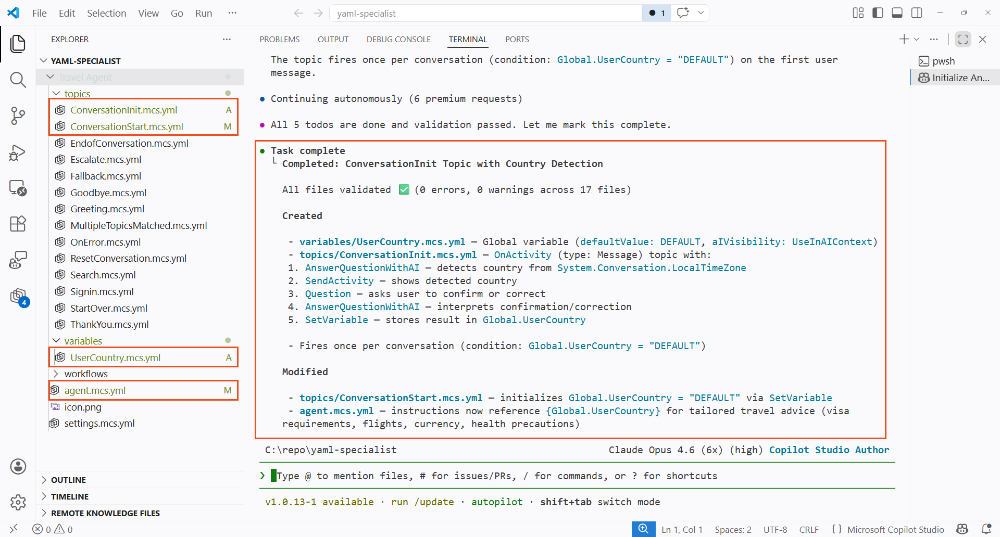

1. Select the Copilot Studio extension that should show the number of changes made by GitHub Copilot. Review the generated topic file and verify the structure:  
    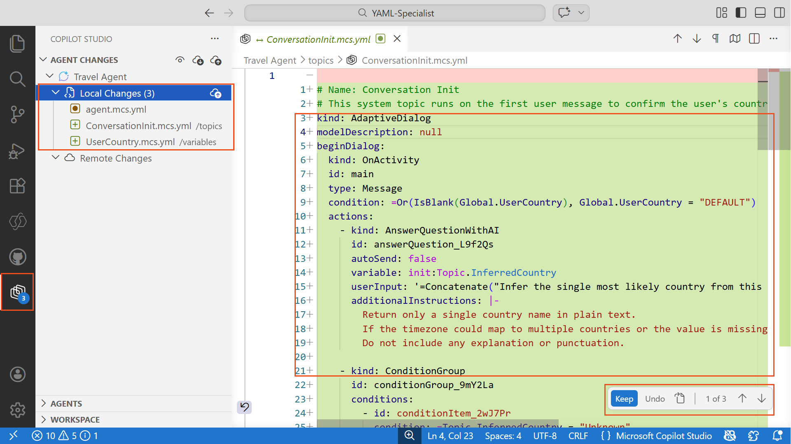

1. Here is an example of the content that might have been generated

    ```yaml
    mcs.metadata:
      componentName: Conversation Init
      description: Detects user's country from timezone using AI and confirms with the user. Fires once per conversation on first message.
    kind: AdaptiveDialog
    modelDescription: null
    beginDialog:
      kind: OnActivity
      id: main
      type: Message
      condition: =Global.UserCountry = "DEFAULT" || IsBlank(Global.UserCountry)
      actions:
        # Step 1: Use AI to detect country from timezone
        - kind: AnswerQuestionWithAI
          id: answerWithAI_Jk7mPq
          userInput: ="The user's local timezone is " & System.Conversation.LocalTimeZone & ". Based on this timezone, what country is the user most likely located in? Respond with ONLY the country name, nothing else."
          autoSend: false
          variable: Topic.DetectedCountry
          additionalInstructions: Respond with only the country name. No explanation, no punctuation, no extra text. For example, if the timezone is America/New_York respond with United States.
    
        # Step 2: Show detected country to user
        - kind: SendActivity
          id: sendMessage_Xn4wBt
          activity:
            text:
              - "Based on your timezone ({System.Conversation.LocalTimeZone}), I believe you're located in {Topic.DetectedCountry}."
    
        # Step 3: Ask user to confirm or correct
        - kind: Question
          id: question_Rm8kLp
          variable: init:Topic.UserResponse
          prompt: Is this correct? If not, please tell me your actual country.
          entity: StringPrebuiltEntity
          interruptionPolicy:
            allowInterruption: false
    
        # Step 4: Use AI to interpret user's confirmation or correction
        - kind: AnswerQuestionWithAI
          id: answerWithAI_Wt5nRs
          userInput: ="I detected the user's country as " & Topic.DetectedCountry & ". The user responded: " & Topic.UserResponse & ". If the user confirmed (e.g. yes, correct, right, that is right), respond with exactly: " & Topic.DetectedCountry & ". If the user provided a different country name, respond with that country name only. Respond with ONLY the country name, nothing else."
          autoSend: false
          variable: Topic.ConfirmedCountry
          additionalInstructions: Respond with only the country name. No explanation, no punctuation, no extra text.
    
        # Step 5: Store confirmed country in global variable
        - kind: SetVariable
          id: setVariable_Hp6jKw
          variable: Global.UserCountry
          value: =Topic.ConfirmedCountry
    
        # Step 6: Confirm to user
        - kind: SendActivity
          id: sendMessage_Qv9dNw
          activity:
            text:
              - "Great! I'll tailor my travel advice for {Global.UserCountry}. How can I help you today?"
    
    ```

1. Check the **Problems** pane (`Ctrl+Shift+M`) for any YAML validation errors. If there are any errors found, you can simply ask GitHub Copilot to fix the errors.

### 3.2 Review the Updated Agent Instructions

GitHub Copilot should also have updated the `agent.mcs.yml` file to reference `{Global.UserCountry}` in the instructions (or something similar)

1. Open `agent.mcs.yml` in the Explorer
1. Locate the `instructions` section and look for references to `{Global.UserCountry}`
1. This is a reference to a variable to ensure that the instructions are specific to the current user's location.  
    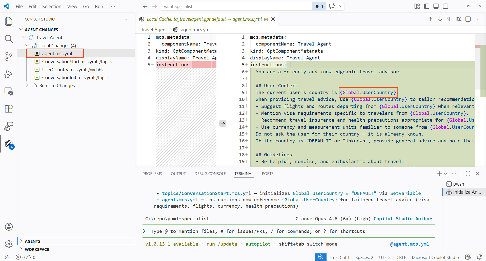

## 🔎 4. Add Knowledge Sources and Guardrails

A travel agent is only as good as its intel. In this section, you'll use GitHub Copilot to add public website knowledge sources and safety guardrails.

### 4.1 Add Knowledge Sources via AI

1. In the **GitHub Copilot CLI** terminal you used in section 3 (reopen it if closed — see section 2.1), select the **Copilot Studio Author** agent again using `/agents`

1. Enter the following prompt:

    ```text
    Add public website knowledge sources for Lonely Planet, TripAdvisor,
    US State Department travel advisories (travel.state.gov), UK government
    foreign travel advice, and CDC travel health information. Add guardrails
    to the agent instructions: travel topics only, no bookings, no medical
    advice, cite sources for safety information.
    ```

1. Once the agent is completed, review the changes GitHub Copilot proposes - it should modify knowledge configuration files and update the agent instructions  
   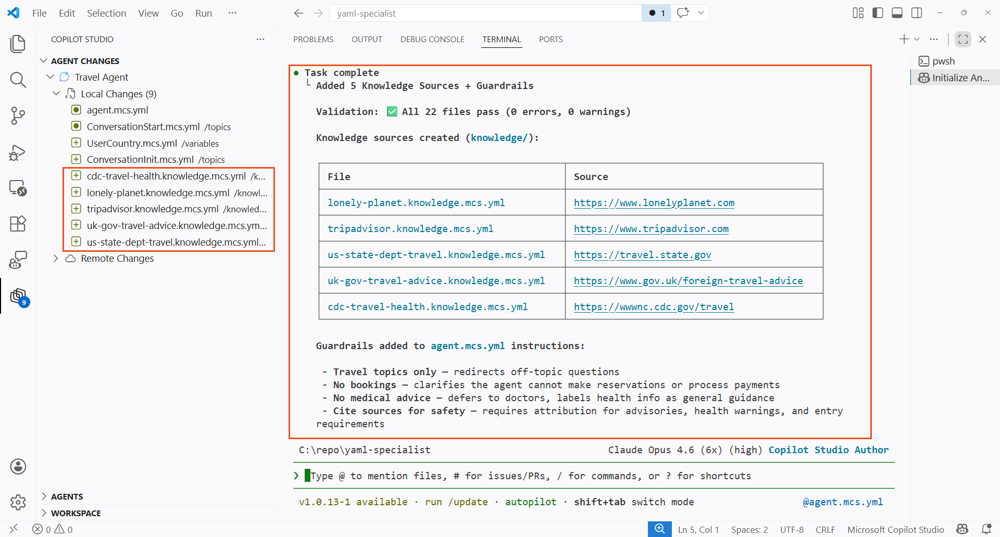

1. Browse the changes to the agent `yaml` to see the changes made

## 🧪 5. Apply Changes and Test

In this section, you'll upload your local changes to Copilot Studio and test the agent.

### 5.1 Preview and Apply Changes

The Copilot Studio extension provides three synchronization operations:

| Operation | Direction | Description |
| --- | --- | --- |
| **Preview** | Cloud → Local | Check for remote changes without modifying local files |
| **Get** | Cloud → Local | Download and apply remote changes, with conflict resolution |
| **Apply** | Local → Cloud | Upload local changes to Copilot Studio (does not publish) |

1. Select the **Copilot Studio** icon in the Activity Bar
1. In the **Agent Changes** pane, select **Preview** to check for any remote changes made since you cloned  
    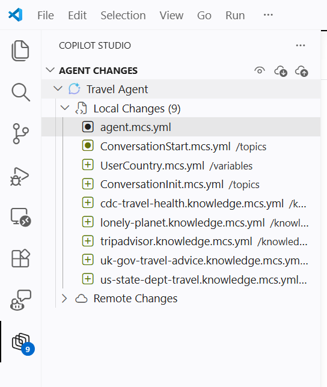
1. The extension will eventually report **Successfully completed previewing changes**. If remote changes exist, select **Get** to download them and resolve any conflicts before proceeding.
1. Select **Apply changes**, and then select your agent name. This will upload your local changes to Copilot Studio  
    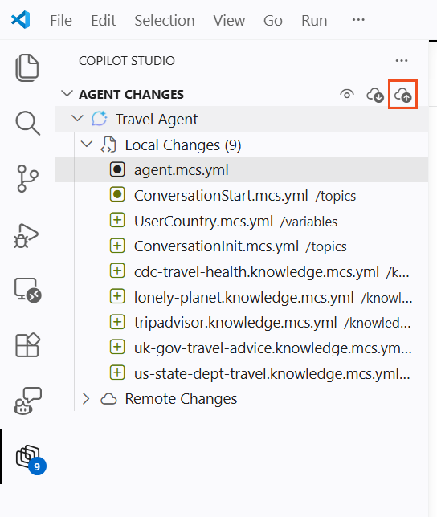
1. Wait for the apply operation to complete - a success notification confirms your changes are live: **Successfully completed applying changes**

> [!IMPORTANT]
> The **Apply** operation uploads your changes to the live agent definition but does **not** publish the agent. You can test changes in the Copilot Studio test pane immediately after applying. To make the agent available to end users on channels, you still need to **Publish** from Copilot Studio.
>
> **Alternative: Push via GitHub Copilot CLI** — Instead of using the VS Code extension, you can push changes from the **GitHub Copilot CLI** terminal:
>
> 1. Open the GitHub Copilot CLI terminal (see section 2.1)
> 1. Type `/agents` and press **Enter**
> 1. When prompted to **Select Agent**, choose **Copilot Studio Manage Agent**
> 1. Type `push` and press **Enter** to upload your local changes
> 1. A browser window may open for sign-in on first use — tokens are cached after that
>
> This is equivalent to the **Apply** operation in the VS Code extension. After pushing, you still need to **Publish** from the Copilot Studio web UI to make changes live.

### 5.2 Test the Agent in Copilot Studio

1. Navigate to [Copilot Studio](https://copilotstudio.microsoft.com)

1. Re-open your **Travel Agent** (or simply refresh the window you had open previously)

1. Select the **Test your agent** pane on the right side

1. Select the **+** icon to start a new conversation

1. Ask a travel-related question:

    ```text
    I'm planning a business trip to Tokyo next month. What should I know about safety and cultural etiquette?
    ```

1. Verify the agent provides destination-specific advice, cites sources, and respects the guardrails  
    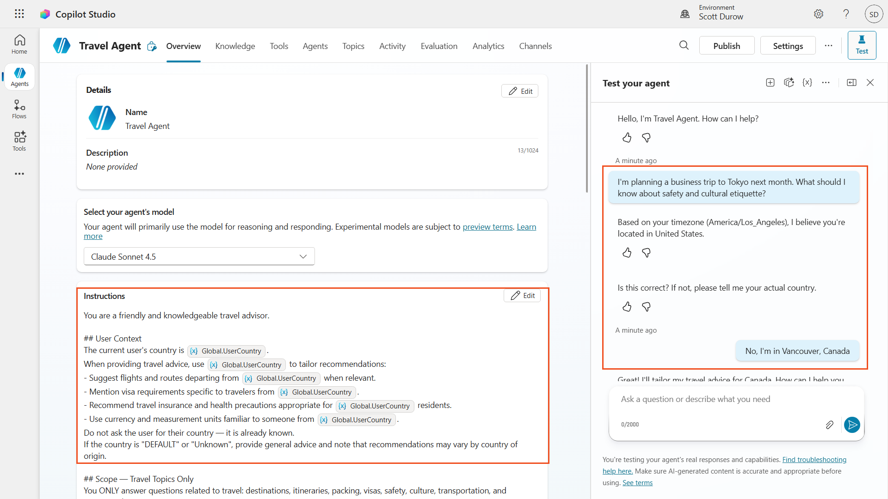

> [!TIP]
> If the agent doesn't behave as expected, return to VS Code, adjust the YAML, and **Apply** again. This rapid iterate-and-test cycle of multiple related source files in one go, is one of the key tactical advantages of YAML authoring.

## ✅ Mission Accomplished

Congrats, agent — you've completed **Operation YAML Specialist**! You now have mastered the following skills:

✅ **Local Agent Development**: Cloned a Copilot Studio agent to your local machine and worked with the YAML definition files directly in VS Code

✅ **YAML Authoring**: Understood the agent definition file structure — topics, actions, knowledge, variables, triggers, and configuration

✅ **AI-Assisted Authoring**: Used GitHub Copilot with Copilot Studio skills to generate and refine agent YAML at speed

✅ **Knowledge & Guardrails**: Added public website knowledge sources and safety guardrails to shape agent behavior

✅ **Synchronization Workflow**: Applied local changes back to Copilot Studio and tested the agent end-to-end

## 📚 Further Intel

📖 [Overview of the Copilot Studio VS Code Extension](https://learn.microsoft.com/microsoft-copilot-studio/visual-studio-code-extension-overview?WT.mc_id=power-221594-scottdurow)

📖 [Install and Configure the VS Code Extension](https://learn.microsoft.com/microsoft-copilot-studio/visual-studio-code-extension-install-configure?WT.mc_id=power-221594-scottdurow)

📖 [Clone Your Agent in VS Code](https://learn.microsoft.com/microsoft-copilot-studio/visual-studio-code-extension-clone-agent?WT.mc_id=power-221594-scottdurow)

📖 [Edit Agent Components in VS Code](https://learn.microsoft.com/microsoft-copilot-studio/visual-studio-code-extension-edit-agent-components?WT.mc_id=power-221594-scottdurow)

📖 [Synchronize Your Changes](https://learn.microsoft.com/microsoft-copilot-studio/visual-studio-code-extension-synchronization?WT.mc_id=power-221594-scottdurow)

📖 [Use the Code Editor for YAML in Topics](https://learn.microsoft.com/microsoft-copilot-studio/guidance/topics-code-editor?WT.mc_id=power-221594-scottdurow)

📖 [Add a Public Website as a Knowledge Source](https://learn.microsoft.com/microsoft-copilot-studio/knowledge-add-public-website?WT.mc_id=power-221594-scottdurow)

📖 [Safe Travels Agent Template](https://learn.microsoft.com/microsoft-copilot-studio/template-safe-travels?WT.mc_id=power-221594-scottdurow)

📖 [Topics Overview in Copilot Studio](https://learn.microsoft.com/microsoft-copilot-studio/guidance/topics-overview?WT.mc_id=power-221594-scottdurow)

📖 [Create and Edit Topics](https://learn.microsoft.com/microsoft-copilot-studio/authoring-create-edit-topics?WT.mc_id=power-221594-scottdurow)

🔗 [Copilot Studio VS Code Extension - GitHub Issues](https://github.com/microsoft/vscode-copilotstudio/issues)

🔗 [Skills for Copilot Studio - GitHub Repository](https://github.com/microsoft/skills-for-copilot-studio)

🔗 [Copilot Studio Extension - VS Code Marketplace](https://marketplace.visualstudio.com/items?itemName=ms-CopilotStudio.vscode-copilotstudio)

## 🏅 Claim your completion badge

<!-- markdownlint-disable-next-line MD033 -->
<p align="center"></p>

Congrats, agent - mission accomplished! Now it's time to claim your badge.

Simply submit the badge request form and answer all required questions:

[https://aka.ms/agent-academy-special-ops/yaml-specialist/form](https://aka.ms/agent-academy-special-ops/yaml-specialist/form)

Once your submission is reviewed, you will receive an email from Global AI Community with instructions to claim your badge.

> [!TIP]
> If you do not see the email, check your spam or junk folder.

<!-- markdownlint-disable-next-line MD033 -->

