<!--
CO_OP_TRANSLATOR_METADATA:
{
  "original_hash": "9dceeba2eae2bb73e328602a060eddab",
  "translation_date": "2025-10-17T19:05:58+00:00",
  "source_file": "docs/recruit/11-publish-your-agent/README.md",
  "language_code": "de"
}
-->
# 🚨 Mission 11: Veröffentliche deinen Agenten

## 🕵️‍♂️ CODENAME: `OPERATION VERÖFFENTLICHEN VERÖFFENTLICHEN VERÖFFENTLICHEN`

> **⏱️ Zeitfenster der Operation:** `~30 Minuten`  

🎥 **Schau dir die Anleitung an**

[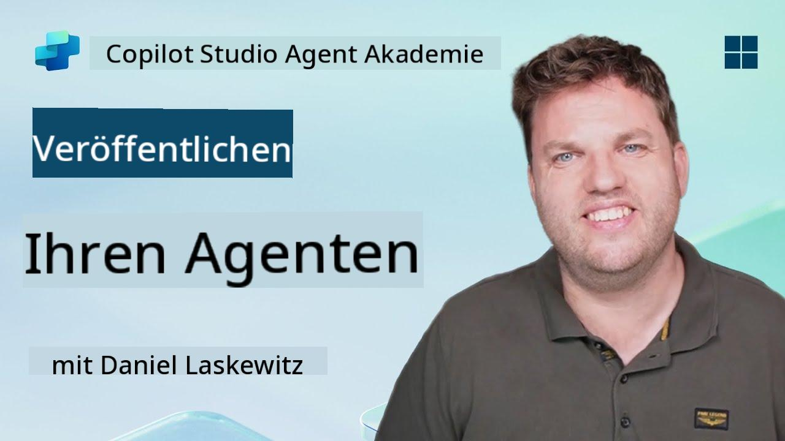](https://www.youtube.com/watch?v=eVZmljhYlSI "Schau dir die Anleitung auf YouTube an")

## 🎯 Missionsbeschreibung

Nach der erfolgreichen Bewältigung einer Reihe von anspruchsvollen Modulen bist du, Agent Maker, nun bereit für den entscheidenden Schritt: die Veröffentlichung deines Agenten. Es ist an der Zeit, deine Kreation für Nutzer in Microsoft Teams und Microsoft 365 Copilot zugänglich zu machen.

Dein Agent – ausgestattet mit einer klaren Mission, leistungsstarken Tools und Zugriff auf wichtige Wissensquellen – ist bereit, zu helfen. Mit Microsoft Copilot Studio kannst du deinen Agenten bereitstellen, damit er echte Nutzer direkt dort unterstützt, wo sie arbeiten.

Lass uns deinen Agenten in Aktion bringen.

## 🔎 Ziele

📖 In dieser Lektion lernst du:

1. Warum es wichtig ist, deinen Agenten zu veröffentlichen
1. Was passiert, wenn du deinen Agenten veröffentlichst
1. Wie du einen Kanal hinzufügst (Microsoft Teams & Microsoft 365 Copilot)
1. Wie du den Agenten in Microsoft Teams hinzufügst
1. Wie du den Agenten für deine gesamte Organisation in Microsoft Teams verfügbar machst

## 🚀 Einen Agenten veröffentlichen

Jedes Mal, wenn du in Copilot Studio an einem Agenten arbeitest, kannst du ihn durch das Hinzufügen von Wissen oder Tools aktualisieren. Sobald du mit allen Änderungen fertig bist und gründlich getestet hast, bist du bereit, ihn zu veröffentlichen. Die Veröffentlichung stellt sicher, dass die neuesten Updates live sind. Wenn du deinen Agenten mit neuen Tools aktualisierst und nicht auf die Schaltfläche „Veröffentlichen“ klickst, sind die Änderungen für die Endnutzer noch nicht verfügbar.

Stelle sicher, dass du immer auf die Schaltfläche „Veröffentlichen“ klickst, wenn du die Updates für die Nutzer deines Agenten bereitstellen möchtest. Dein Agent kann Kanäle hinzugefügt haben, und wenn du auf „Veröffentlichen“ klickst, sind die Updates für alle Kanäle verfügbar, die du dem Agenten hinzugefügt hast.

## ⚙️ Kanäle konfigurieren

Kanäle bestimmen, wo deine Nutzer auf deinen Agenten zugreifen und mit ihm interagieren können. Nachdem du deinen Agenten veröffentlicht hast, kannst du ihn in mehreren Kanälen verfügbar machen. Jeder Kanal kann die Inhalte deines Agenten unterschiedlich darstellen.

Du kannst deinen Agenten zu folgenden Kanälen hinzufügen:

- **Microsoft Teams und Microsoft 365 Copilot** - Mach deinen Agenten in Teams-Chats und -Meetings sowie in Microsoft 365 Copilot-Erlebnissen verfügbar ([Mehr erfahren](https://learn.microsoft.com/microsoft-copilot-studio/publication-add-bot-to-microsoft-teams))
- **Demo-Website** - Teste deinen Agenten auf einer von Copilot Studio bereitgestellten Demo-Website ([Mehr erfahren](https://learn.microsoft.com/microsoft-copilot-studio/publication-connect-bot-to-web-channels))
- **Eigene Website** - Bette deinen Agenten direkt in deine eigene Website ein ([Mehr erfahren](https://learn.microsoft.com/microsoft-copilot-studio/publication-connect-bot-to-web-channels))
- **Mobile App** - Integriere deinen Agenten in eine eigene mobile Anwendung ([Mehr erfahren](https://learn.microsoft.com/microsoft-copilot-studio/publication-connect-bot-to-custom-application))
- **SharePoint** - Füge deinen Agenten zu SharePoint-Seiten hinzu, um Dokumenten- und Seitenunterstützung zu bieten ([Mehr erfahren](https://learn.microsoft.com/microsoft-copilot-studio/publication-add-bot-to-sharepoint))
- **Facebook Messenger** - Verbinde dich mit Nutzern über die Messaging-Plattform von Facebook ([Mehr erfahren](https://learn.microsoft.com/microsoft-copilot-studio/publication-add-bot-to-facebook))
- **Power Pages** - Integriere deinen Agenten in Power Pages-Websites ([Mehr erfahren](https://learn.microsoft.com/microsoft-copilot-studio/publication-add-bot-to-power-pages))
- **Azure Bot Service-Kanäle** - Greife auf zusätzliche Kanäle wie Slack, Telegram, Twilio SMS und mehr zu ([Mehr erfahren](https://learn.microsoft.com/microsoft-copilot-studio/publication-connect-bot-to-azure-bot-service-channels))

Um einen Kanal hinzuzufügen, navigiere zur Registerkarte **Kanäle** in deinem Agenten und wähle den Kanal aus, den du konfigurieren möchtest. Jeder Kanal hat spezifische Einrichtungsvoraussetzungen und kann zusätzliche Authentifizierungs- oder Konfigurationsschritte erfordern.

## 📺 Kanal-Erlebnisse

Verschiedene Kanäle bieten unterschiedliche Nutzererlebnisse. Wenn du einen Agenten für mehrere Kanäle erstellst, solltest du dir der Unterschiede zwischen den Kanälen bewusst sein. Es ist immer eine gute Strategie, deinen Agenten in mehreren Kanälen zu testen, um sicherzustellen, dass er wirklich das tut, was du beabsichtigt hast.

| Erlebnis                          | Website       | Teams und Microsoft 365 Copilot         | Facebook                 | Dynamics Omnichannel für Kundenservice                      |
| --------------------------------- | ------------- | --------------------------------------- | ------------------------ | ----------------------------------------------------------- |
| [Kundenzufriedenheitsumfrage][1]  | Adaptive Card | Nur Text                                | Nur Text                 | Nur Text                                                    |
| [Mehrfachauswahl-Optionen][1]     | Unterstützt   | [Unterstützt bis zu sechs (als Hero Card)][4] | [Unterstützt bis zu 13][6] | [Teilweise unterstützt][8]                                  |
| [Markdown][2]                     | Unterstützt   | [Teilweise unterstützt][5]              | [Teilweise unterstützt][7] | [Teilweise unterstützt][9]                                  |
| [Willkommensnachricht][1]         | Unterstützt   | Unterstützt                             | Nicht unterstützt        | Unterstützt für [Chat][10]. Nicht unterstützt für andere Kanäle. |
| [Meintest du][3]                  | Unterstützt   | Unterstützt                             | Unterstützt              | Unterstützt für [Microsoft Teams][11], [Chat][10], Facebook und textbasierte Kanäle (SMS über [TeleSign][12] und [Twilio][13], [WhatsApp][14], [WeChat][15] und [Twitter][16]). Vorgeschlagene Aktionen werden als reine Textliste angezeigt; Nutzer müssen eine Option erneut eingeben, um zu antworten. |

[1]: https://learn.microsoft.com/microsoft-copilot-studio/authoring-create-edit-topics  
[2]: https://daringfireball.net/projects/markdown/  
[3]: https://learn.microsoft.com/microsoft-copilot-studio/advanced-ai-features  
[4]: https://learn.microsoft.com/microsoftteams/platform/concepts/cards/cards-reference#hero-card  
[5]: https://learn.microsoft.com/microsoftteams/platform/bots/how-to/format-your-bot-messages#text-only-messages  
[6]: https://developers.facebook.com/docs/messenger-platform/send-messages/quick-replies/  
[7]: https://www.facebook.com/help/147348452522644?helpref=related  
[8]: https://learn.microsoft.com/dynamics365/customer-service/asynchronous-channels#suggested-actions-support  
[9]: https://learn.microsoft.com/dynamics365/customer-service/asynchronous-channels#preview-support-for-formatted-messages  
[10]: https://learn.microsoft.com/dynamics365/customer-service/set-up-chat-widget  
[11]: https://learn.microsoft.com/dynamics365/customer-service/configure-microsoft-teams  
[12]: https://learn.microsoft.com/dynamics365/customer-service/configure-sms-channel  
[13]: https://learn.microsoft.com/dynamics365/customer-service/configure-sms-channel-twilio  
[14]: https://learn.microsoft.com/dynamics365/customer-service/configure-whatsapp-channel  
[15]: https://learn.microsoft.com/dynamics365/customer-service/configure-wechat-channel  
[16]: https://learn.microsoft.com/dynamics365/customer-service/configure-twitter-channel  

> [!NOTE]  
> Es gibt einige Beispiele dafür, wie du unterschiedliche Logik für verschiedene Kanäle verwenden kannst. Ein Beispiel dafür findest du im Power Platform Snippets Repository:  
>  
> Henry Jammes hat ein Beispiel geteilt, wie man eine andere Adaptive Card anzeigt, wenn der Kanal Microsoft Teams ist. ([Link zum Beispiel](https://github.com/pnp/powerplatform-snippets/blob/main/copilot-studio/multiple-topics-matched-topic/source/multiple-topics-matched.yaml#L40))

## 🧪 Lab 11: Veröffentliche deinen Agenten in Teams und Microsoft 365 Copilot

### 🎯 Anwendungsfall

Dein Contoso IT Helpdesk-Agent ist jetzt vollständig konfiguriert und mit leistungsstarken Funktionen ausgestattet – er kann auf SharePoint-Wissensquellen zugreifen, Support-Tickets erstellen, proaktive Benachrichtigungen senden und intelligent auf Nutzeranfragen reagieren. Allerdings sind all diese Funktionen derzeit nur in der Entwicklungsumgebung verfügbar, in der du sie erstellt hast.

**Die Herausforderung:** Endnutzer können die Fähigkeiten deines Agenten nicht nutzen, bis er ordnungsgemäß veröffentlicht und über die Kanäle zugänglich gemacht wird, in denen sie tatsächlich arbeiten.

**Die Lösung:** Die Veröffentlichung deines Agenten stellt sicher, dass die neueste Version – mit all deinen aktuellen Updates, neuen Themen, erweiterten Wissensquellen und konfigurierten Abläufen – für echte Nutzer verfügbar ist. Ohne Veröffentlichung würden die Nutzer weiterhin mit einer älteren Version deines Agenten interagieren, der möglicherweise wichtige Funktionen fehlen.

Das Hinzufügen des Teams- und Microsoft 365 Copilot-Kanals ist ebenso entscheidend, weil:

- **Teams-Integration**: Die Mitarbeiter deiner Organisation verbringen den Großteil ihres Arbeitstages mit Zusammenarbeit, Meetings und Kommunikation in Microsoft Teams. Indem du deinen Agenten zu Teams hinzufügst, können Nutzer IT-Support erhalten, ohne ihre primäre Arbeitsumgebung zu verlassen.

- **Microsoft 365 Copilot**: Nutzer können direkt in ihrer Microsoft 365 Copilot-Umgebung auf deinen spezialisierten IT-Helpdesk-Agenten zugreifen, was ihn nahtlos in ihren täglichen Arbeitsablauf in Office-Anwendungen integriert.

- **Zentraler Zugriff**: Anstatt sich separate Websites oder Anwendungen merken zu müssen, können Nutzer über die Plattformen, die sie bereits verwenden, auf IT-Support zugreifen, was die Nutzung erleichtert und die Akzeptanz erhöht.

Diese Mission verwandelt deine Entwicklungsarbeit in eine produktionsreife Lösung, die echten Mehrwert für die Endnutzer deiner Organisation bietet.

### Voraussetzungen

Bevor du mit diesem Lab beginnst, stelle sicher, dass du:

- ✅ Die vorherigen Labs abgeschlossen und einen vollständig konfigurierten Contoso Helpdesk-Agenten hast
- ✅ Deinen Agenten getestet hast und er bereit für den Produktionseinsatz ist
- ✅ Berechtigungen in deiner Copilot Studio-Umgebung hast, um Agenten zu veröffentlichen
- ✅ Zugriff auf Microsoft Teams in deiner Organisation hast

### 11.1 Veröffentliche deinen Agenten

Jetzt, da die Arbeit an deinem Agenten abgeschlossen ist, müssen wir sicherstellen, dass alle unsere Arbeit für die Endnutzer verfügbar ist, die deinen Agenten verwenden werden. Um sicherzustellen, dass die Inhalte für alle Nutzer verfügbar sind, müssen wir deinen Agenten veröffentlichen.

1. Gehe zum Contoso Helpdesk-Agenten in Copilot Studio (über das [Copilot Studio Maker-Portal](https://copilotstudio.microsoft.com))

    In Copilot Studio ist es einfach, deinen Agenten zu veröffentlichen. Du kannst einfach die Schaltfläche „Veröffentlichen“ oben in der Agentenübersicht auswählen.

    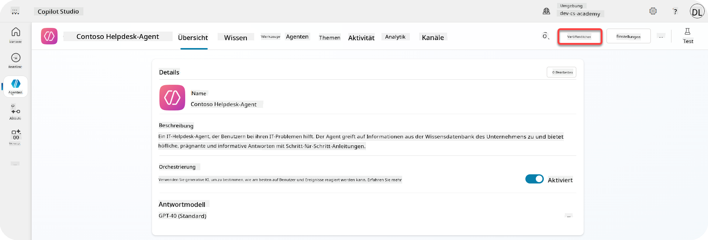

1. Wähle die Schaltfläche **Veröffentlichen** in deinem Agenten

    Es öffnet sich das Veröffentlichungs-Popup, um zu bestätigen, dass du deinen Agenten wirklich veröffentlichen möchtest.

    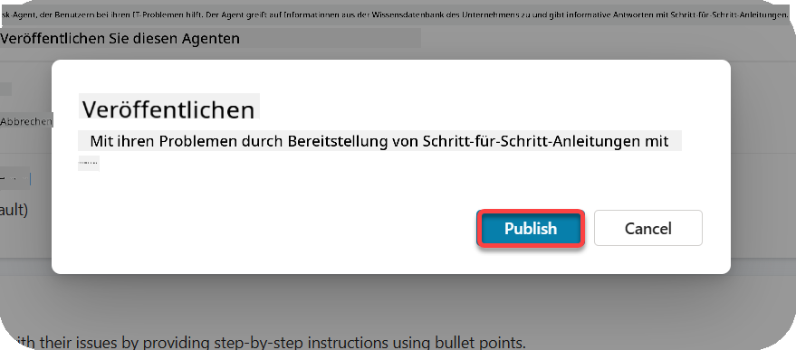

1. Wähle **Veröffentlichen**, um die Veröffentlichung deines Agenten zu bestätigen

    Jetzt wird eine Nachricht angezeigt, dass dein Agent veröffentlicht wird. Du musst das Popup nicht geöffnet lassen. Du wirst benachrichtigt, wenn der Agent veröffentlicht wurde.

    

    Sobald die Veröffentlichung abgeschlossen ist, siehst du die Benachrichtigung oben auf der Agentenseite.

    

Aber – wir haben den Agenten nur veröffentlicht, ihn aber noch nicht zu einem Kanal hinzugefügt. Lass uns das jetzt erledigen!

### 11.2 Füge den Teams- und Microsoft 365 Copilot-Kanal hinzu

1. Um den Teams- und Microsoft 365 Copilot-Kanal zu unserem Agenten hinzuzufügen, müssen wir **Kanal** in der oberen Navigation des Agenten auswählen

    

    Hier können wir alle Kanäle sehen, die wir zu diesem Agenten hinzufügen können.

1. Wähle **Teams und Microsoft 365**

    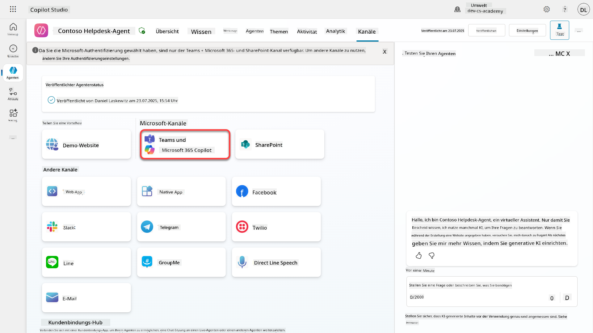

1. Wähle **Kanal hinzufügen**, um den Assistenten abzuschließen und den Kanal zum Agenten hinzuzufügen

    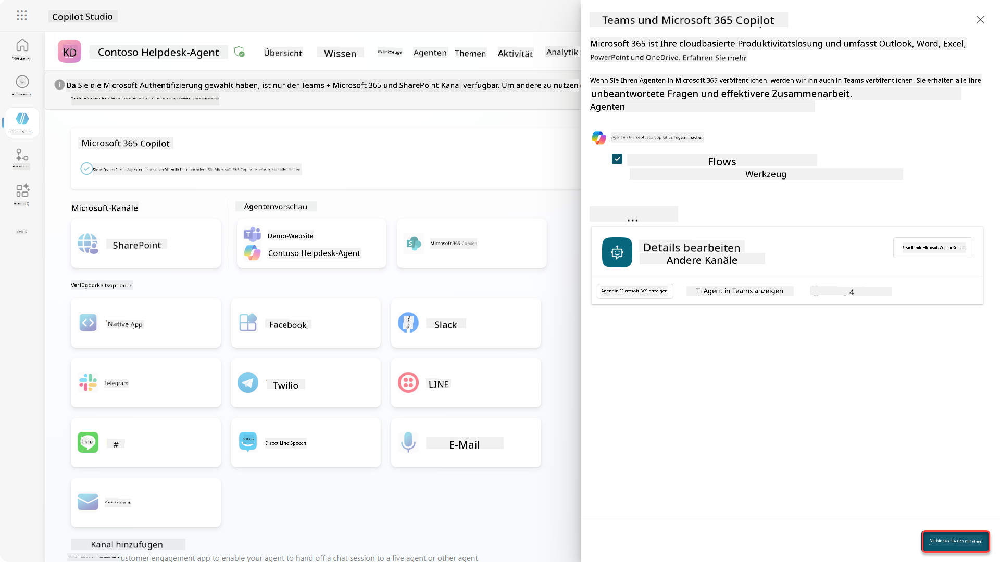

    Es dauert eine Weile, bis der Kanal hinzugefügt ist. Sobald er hinzugefügt wurde, erscheint eine grüne Benachrichtigung oben in der Seitenleiste.

    

1. Wähle **Agent in Teams anzeigen**, um einen neuen Tab zu öffnen

    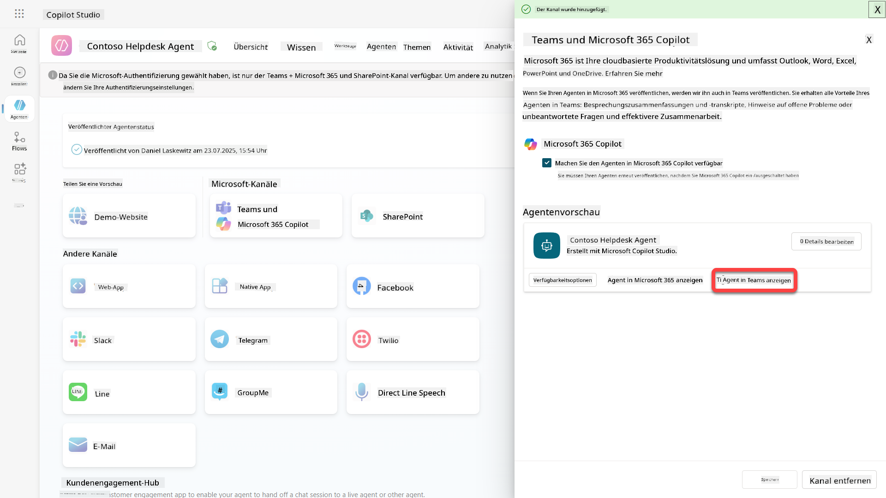

1. Wähle **Hinzufügen**, um den Contoso Helpdesk-Agenten zu Teams hinzuzufügen

    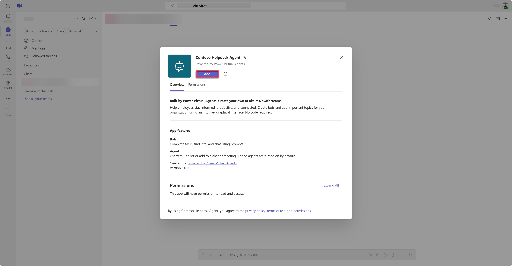

    Dies dauert eine Weile. Danach sollte der folgende Bildschirm angezeigt werden:

    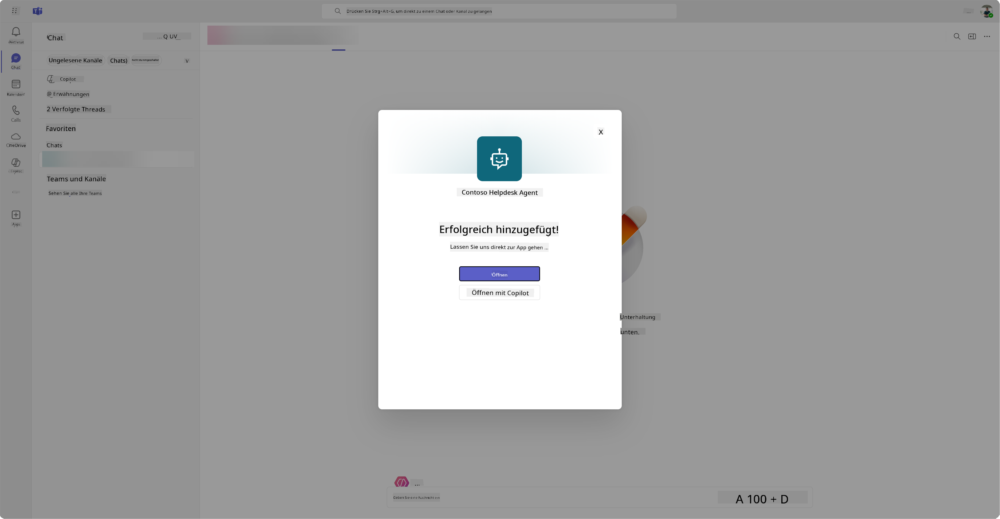

1. Wähle **Öffnen**, um den Agenten in Teams zu öffnen

    Dadurch wird der Agent in Teams als Teams-App geöffnet.

    

Jetzt haben wir den Agenten veröffentlicht, damit er in Microsoft Teams funktioniert, aber du möchtest ihn vielleicht für mehr Personen verfügbar machen.

### 11.3 Mach den Agenten für alle Nutzer im Tenant verfügbar

1. Schließe den Browser-Tab, in dem der Contoso Helpdesk-Agent geöffnet ist

    Dadurch solltest du zurück zu Copilot Studio gelangen, wo die Seitenleiste für Teams und Microsoft 365 Copilot noch geöffnet ist. Wir haben den Agenten jetzt nur in Teams geöffnet, aber hier können wir noch viel mehr tun. Wir können die Details des Agenten bearbeiten, ihn für mehr Nutzer bereitstellen und mehr.

1. Wähle **Details bearbeiten**

    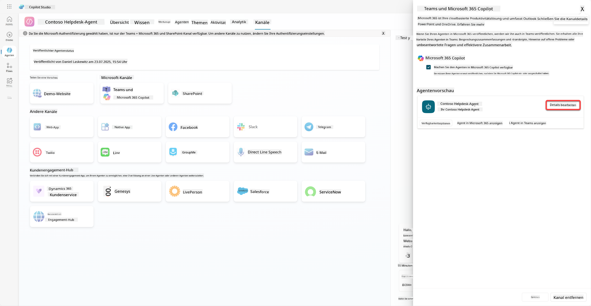
Dies öffnet ein Fenster, in dem wir eine Reihe von Details und Einstellungen des Agenten ändern können. Wir können grundlegende Details wie das Symbol, die Hintergrundfarbe des Symbols und die Beschreibungen ändern. Außerdem können wir hier Teams-Einstellungen ändern (zum Beispiel, ob ein Benutzer den Agenten zu einem Team hinzufügen darf oder ob dieser Agent in Gruppen- und Besprechungschats verwendet werden kann). Wenn Sie *mehr* auswählen, können Sie auch Entwicklerdetails wie den Entwicklernamen, die Website, die Datenschutzerklärung und die Nutzungsbedingungen ändern.

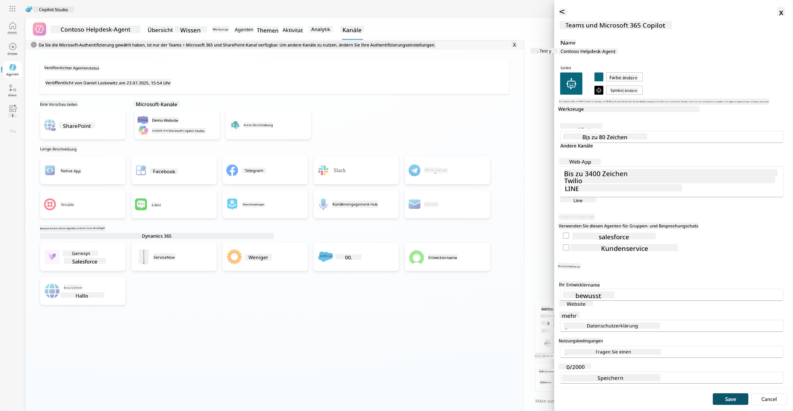

1. Wählen Sie **Abbrechen**, um das Bearbeitungsfenster zu schließen.

1. Wählen Sie **Verfügbarkeitsoptionen**.

Dies öffnet das Fenster für Verfügbarkeitsoptionen, in dem Sie einen Link kopieren können, um ihn an Benutzer zu senden, damit sie diesen Agenten verwenden können (denken Sie daran, Sie müssen den Agenten auch mit dem Benutzer teilen). Außerdem können Sie eine Datei herunterladen, um Ihren Agenten dem Microsoft Teams- oder Microsoft 365-Store hinzuzufügen. Um den Agenten im Store anzuzeigen, gibt es weitere Optionen: Sie können ihn Ihren Teamkollegen und geteilten Benutzern anzeigen (damit er im Abschnitt *Erstellt mit Power Platform* erscheint) oder ihn allen in Ihrer Organisation anzeigen (dies erfordert die Genehmigung eines Administrators).

1. Wählen Sie **Allen in meiner Organisation anzeigen**.

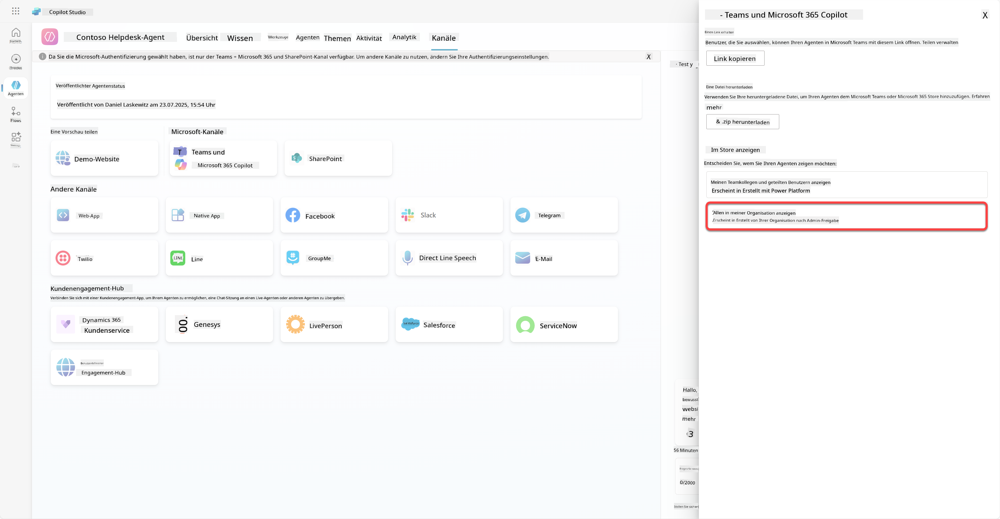

1. Wählen Sie **Zur Genehmigung einreichen**.

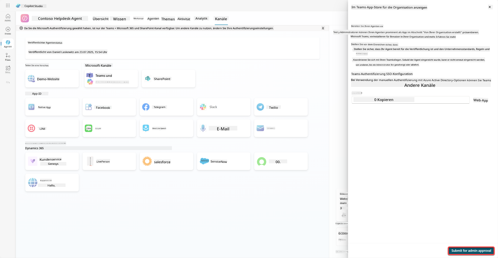

Nun muss Ihr Administrator Ihre Agenteneinreichung genehmigen. Dies kann er tun, indem er zum Teams Admin Center geht und den Contoso Helpdesk Agent unter Apps sucht. Im Screenshot sehen Sie, was der Administrator im Teams Admin Center sehen würde.

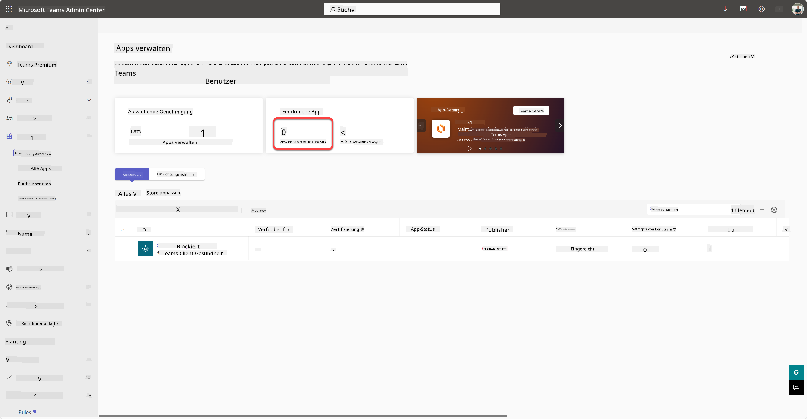

Der Administrator muss den Contoso Helpdesk Agent auswählen und *Veröffentlichen* wählen, um den Contoso Helpdesk Agent für alle zu veröffentlichen.

Sobald der Administrator die Agenteneinreichung veröffentlicht hat, können Sie Copilot Studio aktualisieren und sollten das Banner *Verfügbar im App-Store* in den Verfügbarkeitsoptionen sehen.

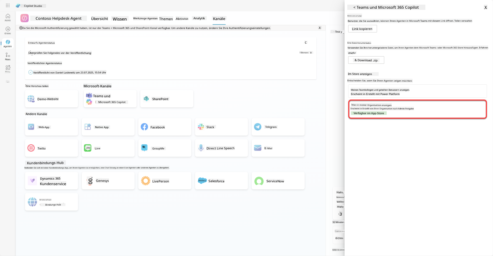

Es gibt hier noch weitere Möglichkeiten. Ihr Administrator kann die globale Einrichtungsrichtlinie ändern und den Contoso Helpdesk Agent für alle im Tenant automatisch installieren. Darüber hinaus können Sie den Contoso Helpdesk Agent an die linke Navigationsleiste anheften, sodass jeder einfachen Zugriff darauf hat.

## ✅ Mission abgeschlossen

🎉 **Herzlichen Glückwunsch!** Sie haben Ihren Agenten erfolgreich veröffentlicht und ihn zu Teams und Microsoft 365 Copilot hinzugefügt! Als Nächstes folgt die letzte Mission des Kurses: Das Verständnis von Lizenzierung.

⏭️ [Weiter zur Lektion **Verständnis von Lizenzierung**](../12-understanding-licensing/README.md)

## 📚 Taktische Ressourcen

🔗 [Dokumentation zu Veröffentlichungskanälen](https://learn.microsoft.com/microsoft-copilot-studio/publication-fundamentals-publish-channels)

---

**Haftungsausschluss**:  
Dieses Dokument wurde mit dem KI-Übersetzungsdienst [Co-op Translator](https://github.com/Azure/co-op-translator) übersetzt. Obwohl wir uns um Genauigkeit bemühen, beachten Sie bitte, dass automatisierte Übersetzungen Fehler oder Ungenauigkeiten enthalten können. Das Originaldokument in seiner ursprünglichen Sprache sollte als maßgebliche Quelle betrachtet werden. Für kritische Informationen wird eine professionelle menschliche Übersetzung empfohlen. Wir übernehmen keine Haftung für Missverständnisse oder Fehlinterpretationen, die sich aus der Nutzung dieser Übersetzung ergeben.