<!--
CO_OP_TRANSLATOR_METADATA:
{
  "original_hash": "4fb913dfc3bbc71506dd3602c4b8e6ed",
  "translation_date": "2025-10-17T19:19:35+00:00",
  "source_file": "docs/operative-preview/02-multi-agent/README.md",
  "language_code": "es"
}
-->
# 🚨 Misión 02: Agentes Conectados

--8<-- "disclaimer.md"

## 🕵️‍♂️ NOMBRE CLAVE: `OPERACIÓN SINFONÍA`

> **⏱️ Ventana de Tiempo de la Operación:** `~45 minutos`

## 🎯 Resumen de la Misión

Bienvenido de nuevo, Agente. En la Misión 01, construiste tu Agente de Contratación principal: una base sólida para gestionar flujos de trabajo de reclutamiento. Pero un solo agente tiene sus límites.

Tu asignación, si decides aceptarla, es **Operación Sinfonía**: transformar tu único agente en un sistema de **agentes múltiples**: un equipo orquestado de agentes especializados que trabajen juntos para manejar desafíos complejos de contratación. Piensa en ello como una actualización de un operador solitario a comandar una fuerza de tarea especializada.

Como una orquesta sinfónica donde cada músico toca su parte en perfecta armonía, agregarás dos especialistas críticos a tu Agente de Contratación existente: un Agente de Recepción de Solicitudes para procesar currículums automáticamente y un Agente de Preparación de Entrevistas para crear materiales completos de entrevistas. Estos agentes trabajarán juntos sin problemas bajo tu principal orquestador.

## 🔎 Objetivos

En esta misión, aprenderás:

1. Cuándo usar **agentes secundarios** frente a **agentes conectados**  
1. Cómo diseñar **arquitecturas de agentes múltiples** que escalen  
1. Crear **agentes secundarios** para tareas específicas  
1. Establecer **patrones de comunicación** entre agentes  
1. Construir el Agente de Recepción de Solicitudes y el Agente de Preparación de Entrevistas  

## 🧠 ¿Qué son los agentes conectados?

En Copilot Studio, no estás limitado a construir agentes únicos y monolíticos. Puedes crear **sistemas de agentes múltiples**: redes de agentes especializados que trabajan juntos para manejar flujos de trabajo complejos.

Piensa en ello como una organización del mundo real: en lugar de que una persona haga todo, tienes especialistas que sobresalen en tareas específicas y colaboran cuando es necesario.

### Por qué los sistemas de agentes múltiples son importantes

- **Escalabilidad:** Cada agente puede desarrollarse, probarse y mantenerse de manera independiente por diferentes equipos.  
- **Especialización:** Los agentes pueden enfocarse en lo que hacen mejor. Tal vez uno para procesamiento de datos, otro para interacción con usuarios, otro para toma de decisiones.  
- **Flexibilidad:** Puedes combinar y reutilizar agentes en diferentes proyectos y evolucionar tu sistema de manera incremental.  
- **Mantenibilidad:** Los cambios en un agente no necesariamente afectan a otros, haciendo que las actualizaciones sean más seguras y fáciles.

### Ejemplo del mundo real: Proceso de contratación

Considera nuestro flujo de trabajo de contratación: múltiples agentes podrían trabajar juntos con las siguientes responsabilidades:

- **Recepción de currículums** requiere habilidades de análisis de documentos y extracción de datos  
- **Evaluación** implica evaluar currículums de candidatos y compararlos con los requisitos del puesto  
- **Preparación de entrevistas** necesita un razonamiento profundo sobre la adecuación del candidato  
- **Comunicación con candidatos** requiere habilidades empáticas de comunicación  

En lugar de construir un agente masivo que intente manejar todas estas habilidades diferentes, puedes crear agentes especializados para cada área y orquestarlos juntos.

## 🔗 Agentes secundarios vs agentes conectados: La diferencia clave

Copilot Studio ofrece dos formas de construir sistemas de agentes múltiples, cada una con casos de uso distintos:

### ↘️ Agentes secundarios

Los agentes secundarios son **especialistas ligeros** que viven dentro de tu agente principal. Piensa en ellos como equipos especializados dentro del mismo departamento.

#### Detalles técnicos clave

- Los agentes secundarios viven dentro del agente principal y tienen una única página de configuración.  
- Las herramientas y el conocimiento están **almacenados en el agente principal**, pero configurados para estar "Disponibles para" el agente secundario.  
- Los agentes secundarios **comparten los temas** de su agente principal. Los temas pueden ser referenciados por las instrucciones del agente secundario.  
- Los agentes secundarios **no necesitan publicación separada**: están automáticamente disponibles dentro de su agente principal una vez creados. Esto facilita las pruebas porque los cambios en el agente principal y los agentes secundarios pueden realizarse en el **mismo espacio de trabajo compartido**.

#### Usa agentes secundarios cuando

- Un solo equipo gestiona toda la solución  
- Quieres organizar lógicamente herramientas y conocimientos en sub-agentes  
- No necesitas autenticación o implementación separada para cada agente  
- Los agentes no serán publicados por separado ni utilizados de manera independiente  
- No necesitas reutilizar agentes en múltiples soluciones  

**Ejemplo:** Un agente de soporte técnico con agentes secundarios para:

- Procedimientos de restablecimiento de contraseñas  
- Solución de problemas de hardware  
- Guías de instalación de software  

### 🔀 Agentes conectados

Los agentes conectados son **agentes independientes y completos** con los que tu agente principal puede colaborar. Piensa en ellos como departamentos separados que trabajan juntos en un proyecto.

#### Detalles técnicos clave

- Los agentes conectados tienen **sus propios temas** y flujos de conversación. Operan de manera independiente con sus propias configuraciones, lógica y ciclo de vida de implementación.  
- Los agentes conectados **deben ser publicados** antes de que puedan ser añadidos y utilizados por otros agentes.  
- Durante las pruebas, los cambios en el agente conectado deben ser publicados antes de que puedan ser utilizados por el agente que los llama.

#### Usa agentes conectados cuando

- Múltiples equipos desarrollan y mantienen diferentes agentes de manera independiente  
- Los agentes necesitan sus propias configuraciones, autenticación y canales de implementación  
- Quieres publicar y mantener agentes por separado con gestión independiente del ciclo de vida de la aplicación (ALM) para cada agente  
- Los agentes deben ser reutilizables en múltiples soluciones  

**Ejemplo:** Un sistema de servicio al cliente que se conecta a:

- Un agente de facturación separado mantenido por el equipo de finanzas  
- Un agente de soporte técnico separado mantenido por el equipo de producto  
- Un agente de devoluciones separado mantenido por el equipo de operaciones  

!!! tip "Consejo"
    ¡Puedes mezclar ambos enfoques! Por ejemplo, tu agente principal podría conectarse a agentes externos de otros equipos mientras también tiene sus propios agentes secundarios para tareas internas especializadas.

## 🎯 Patrones de arquitectura de agentes múltiples

Al diseñar sistemas de agentes múltiples, emergen varios patrones basados en cómo interactúan los agentes:

| Patrón               | Descripción                                                                 | Mejor para                                                      |
|----------------------|-----------------------------------------------------------------------------|-----------------------------------------------------------------|
| **Hub and Spoke**    | Un agente orquestador principal coordina con múltiples agentes especializados. El orquestador maneja la interacción con el usuario y delega tareas a agentes secundarios o conectados. | Flujos de trabajo complejos donde un agente coordina tareas especializadas |
| **Pipeline**         | Los agentes pasan el trabajo secuencialmente de uno al siguiente, cada uno agregando valor antes de pasar a la siguiente etapa. | Procesos lineales como el procesamiento de solicitudes (recepción → evaluación → entrevista → decisión) |
| **Colaborativo**     | Los agentes trabajan juntos simultáneamente en diferentes aspectos del mismo problema, compartiendo contexto y resultados. | Análisis complejo que requiere múltiples perspectivas o áreas de especialización |

!!! tip "Consejo"
    Incluso podrías tener una combinación de dos o más de estos patrones.

## 💬 Comunicación entre agentes y compartición de contexto

Cuando los agentes trabajan juntos, necesitan compartir información de manera efectiva. Así es como funciona en Copilot Studio:

### Historial de conversación

Por defecto, cuando un agente principal llama a un agente secundario o conectado, puede pasar el **historial de conversación**. Esto le da al agente especialista el contexto completo sobre lo que el usuario ha estado discutiendo.

Puedes desactivar esto por razones de seguridad o rendimiento, por ejemplo, si el agente especialista solo necesita completar una tarea específica sin necesitar el contexto completo de la conversación. Esto puede ser una buena defensa contra **filtraciones de datos**.

### Instrucciones explícitas

Tu agente principal puede dar **instrucciones específicas** a los agentes secundarios o conectados. Por ejemplo: "Procesa este currículum y resume sus habilidades para el puesto de Desarrollador Senior."

### Valores de retorno

Los agentes pueden devolver información estructurada al agente que los llama, permitiendo que el agente principal use esa información en pasos posteriores o la comparta con otros agentes.

### Integración con Dataverse

Para escenarios más complejos, los agentes pueden compartir información a través de **Dataverse** u otros almacenes de datos, permitiendo una compartición de contexto persistente a través de múltiples interacciones.

## ↘️Agente secundario: Agente de Recepción de Solicitudes

Comencemos a construir nuestro sistema de contratación de agentes múltiples. Nuestro primer especialista será el **Agente de Recepción de Solicitudes**: un agente secundario responsable de procesar currículums y la información de los candidatos.

```mermaid
---
config:
  layout: elk
  look: neo
---
flowchart TB
 subgraph People["People"]
    direction TB
        HiringManager["Hiring Manager"]
        Interviewers["Interviewers"]
  end
 subgraph Agents["Agents"]
    direction LR
        ApplicationIntakeAgent["Application Intake Agent<br>(Child)"]
        InterviewAgent["Interview Agent<br>(Connected)"]
        HRAgent["HR Agent"]
  end
    HiringManager -- Upload CV --> HRAgent
    HRAgent -- Upload Resume, Create Candidate, Match to Job Roles --> ApplicationIntakeAgent
    ApplicationIntakeAgent -- Create Resume, Upsert Candidate, Create Job Application --> Dataverse["Dataverse"]
    ApplicationIntakeAgent -- Store Resume file in file column --> Dataverse
    HiringManager -- Ask for summaries --> HRAgent
    Interviewers -- Request interview pack --> HRAgent
    HRAgent -- Generate interview pack and summarize data --> InterviewAgent
    InterviewAgent -- Read all Candidate, Resume, Job Roles, Evaluation Criteria Data --> Dataverse
     HiringManager:::person
     Interviewers:::person
     ApplicationIntakeAgent:::agent
     InterviewAgent:::agent
     HRAgent:::agent
     Dataverse:::data
    classDef person fill:#e6f0ff,stroke:#3b82f6,color:#0b3660
    classDef agent fill:#e8f9ef,stroke:#10b981,color:#064e3b
    classDef data  fill:#f3f4f6,stroke:#6b7280,color:#111827
```

### 🤝Responsabilidades del Agente de Recepción de Solicitudes

- **Analizar contenido de currículums** de PDFs proporcionados a través del chat interactivo (en una misión futura aprenderás cómo procesar currículums de manera autónoma).  
- **Extraer datos estructurados** (nombre, habilidades, experiencia, educación)  
- **Emparejar candidatos con roles abiertos** según las calificaciones y la carta de presentación  
- **Almacenar información de candidatos** en Dataverse para procesamiento posterior  
- **Eliminar duplicados de solicitudes** para evitar crear el mismo candidato dos veces, emparejando con registros existentes usando la dirección de correo electrónico extraída del currículum.  

### ⭐Por qué debería ser un agente secundario

El Agente de Recepción de Solicitudes encaja perfectamente como un agente secundario porque:

- Está especializado en procesamiento de documentos y extracción de datos  
- No necesita publicación separada  
- Es parte de nuestra solución general de contratación gestionada por el mismo equipo  
- Se enfoca en un disparador específico (nuevo currículum recibido) y es invocado desde el Agente de Contratación.

## 🔀Agente conectado: Agente de Preparación de Entrevistas  

Nuestro segundo especialista será el **Agente de Preparación de Entrevistas**: un agente conectado que ayuda a crear materiales completos de entrevistas y evalúa las respuestas de los candidatos.

### 🤝Responsabilidades del Agente de Preparación de Entrevistas

- **Crear paquetes de entrevistas** con información de la empresa, requisitos del puesto y criterios de evaluación  
- **Generar preguntas de entrevista** adaptadas a roles específicos y antecedentes de los candidatos  
- **Responder preguntas generales** sobre los roles de trabajo y las solicitudes para la comunicación con las partes interesadas  

### ⭐Por qué debería ser un agente conectado

El Agente de Preparación de Entrevistas funciona mejor como un agente conectado porque:

- El equipo de adquisición de talento podría querer usarlo de manera independiente en múltiples procesos de contratación  
- Necesita su propia base de conocimientos sobre mejores prácticas de entrevistas y criterios de evaluación  
- Diferentes gerentes de contratación podrían querer personalizar su comportamiento para sus equipos  
- Podría reutilizarse para puestos internos, no solo para contrataciones externas  

## 🧪Laboratorio 2.1: Añadiendo el Agente de Recepción de Solicitudes

¿Listo para poner la teoría en práctica? Vamos a añadir nuestro primer agente secundario a tu Agente de Contratación existente.

### Requisitos previos para completar esta misión

Necesitarás **ya sea**:

- **Haber completado la Misión 01** y tener tu Agente de Contratación listo, **O**  
- **Importar la solución inicial de la Misión 02** si estás comenzando desde cero o necesitas ponerte al día. [Descargar Solución Inicial de la Misión 02](https://aka.ms/agent-academy)

!!! note "Importación de Solución y Datos de Ejemplo"
    Si estás usando la solución inicial, consulta [Misión 01](../01-get-started/README.md) para obtener instrucciones detalladas sobre cómo importar soluciones y datos de ejemplo en tu entorno.

### 2.1.1 Configuración de la solución

1. Dentro de Copilot Studio, selecciona los puntos suspensivos (...) debajo de Herramientas en la navegación izquierda.  
1. Selecciona **Soluciones**.  
    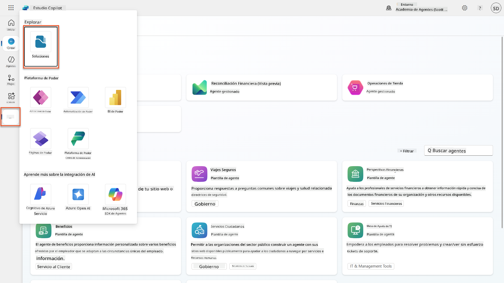  
1. Localiza tu solución Operativa, selecciona los **puntos suspensivos (...)** junto a ella y elige **Establecer solución preferida**. Esto asegurará que todo tu trabajo se agregue a esta solución.  
    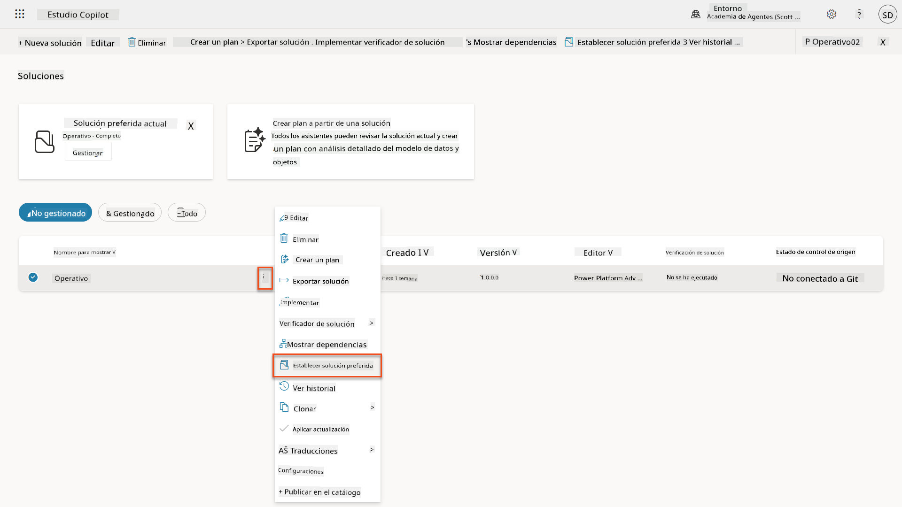

### 2.1.2 Configura las instrucciones del agente de contratación

1. **Navega** a Copilot Studio. Asegúrate de que tu entorno esté seleccionado en el selector de entorno en la parte superior derecha.  

1. Abre tu **Agente de Contratación** de la Misión 01  

1. Selecciona **Editar** en la sección **Instrucciones** de la pestaña **Resumen**, y añade las siguientes instrucciones al principio:

    ```text
    You are the central orchestrator for the hiring process. You coordinate activities, provide summaries, and delegate work to specialized agents.
    ```

1. Selecciona **Guardar**  
    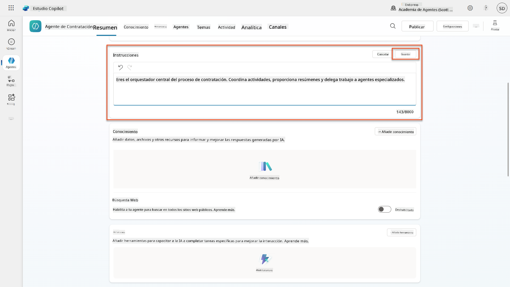

1. Selecciona **Configuración** (arriba a la derecha)  

1. Asegúrate de que las siguientes configuraciones estén activadas:

    | Configuración | Valor |
    |---------------|-------|
    | Usar orquestación de IA generativa para las respuestas del agente | **Sí** |
    | Moderación de contenido | **Moderado** |
    | Usar conocimiento general | **Desactivado** |
    | Usar información de la Web | **Desactivado** |
    | Carga de archivos | **Activado** |

  
  


### 2.1.3 Añade el agente secundario de Recepción de Solicitudes

1. **Navega** a la pestaña **Agentes** dentro de tu Agente de Contratación: aquí es donde añadirás agentes especializados.  

1. Selecciona **+ Añadir** y luego **Crear un agente**. Nota que esto está etiquetado como "*Crear un agente ligero que vive dentro de tu agente actual y hereda sus configuraciones. Ideal para desglosar lógica compleja* "  
    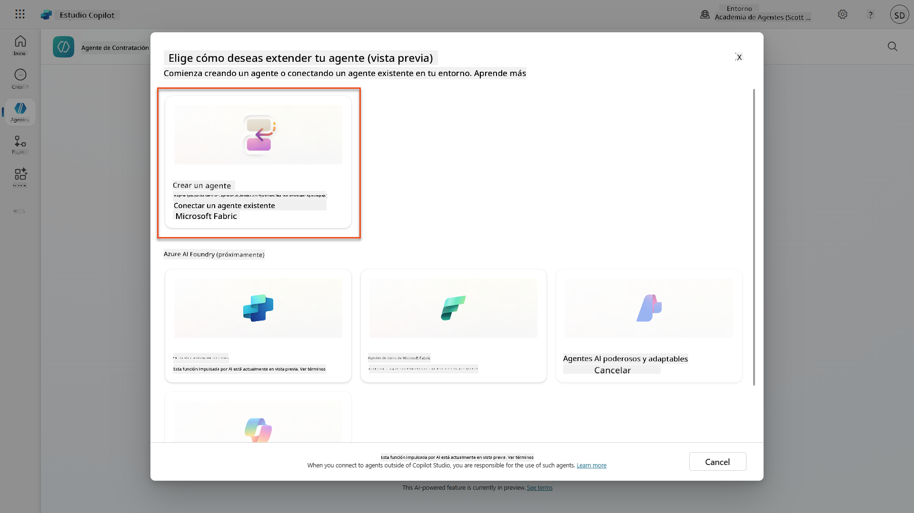

1. **Nombra** tu agente `Agente de Recepción de Solicitudes`  

1. Selecciona **El agente elige** - Basado en la descripción en el menú desplegable **¿Cuándo se usará esto?**. Estas opciones son similares a los disparadores que pueden configurarse para los temas.  

1. Establece la **Descripción** como:

    ```text
    Processes incoming resumes and stores candidates in the system
    ```

    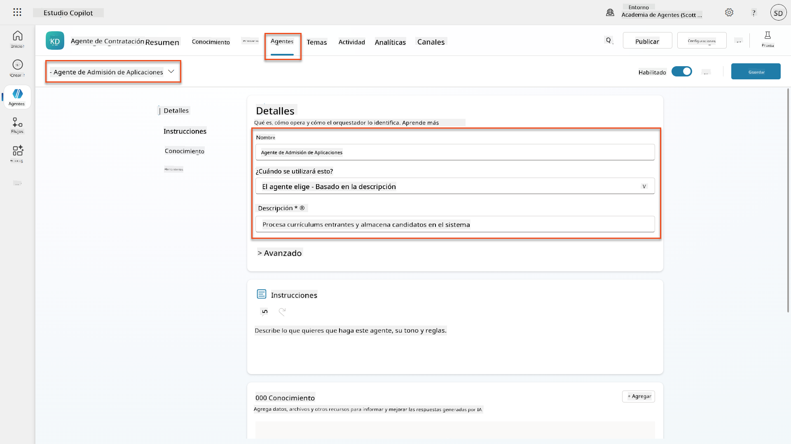

1. Expande **Avanzado**, y establece la Prioridad en `10000`. Esto asegurará que más adelante el Agente de Entrevistas se utilice para responder preguntas generales antes que este. También se podría establecer una condición aquí, como asegurarse de que haya al menos un archivo adjunto.  

1. Asegúrate de que el interruptor **Búsqueda Web** esté configurado como **Desactivado**. Esto se debe a que solo queremos usar la información proporcionada por el agente principal.  

1. Selecciona **Guardar**

### 2.1.4 Configura el flujo del agente de carga de currículums

Los agentes no pueden realizar ninguna acción sin que se les proporcionen herramientas o temas.
Estamos utilizando las **herramientas de flujo de agentes** en lugar de Temas para el paso *Subir currículum* porque este proceso de backend de múltiples pasos requiere una ejecución determinista e integración con sistemas externos. Mientras que los Temas son mejores para guiar el diálogo conversacional, los Flujos de Agentes proporcionan la automatización estructurada necesaria para manejar de manera confiable el procesamiento de archivos, la validación de datos y las actualizaciones de bases de datos (insertar nuevos o actualizar existentes) sin depender de la interacción del usuario.

1. Ubica la sección **Herramientas** dentro de la página del Agente de Admisión de Solicitudes.  
   **Importante:** No es la pestaña Herramientas del agente principal, sino que se encuentra desplazándote hacia abajo debajo de las instrucciones del agente secundario.

1. Selecciona **+ Agregar**  
   

1. Selecciona **+ Nueva herramienta**  
   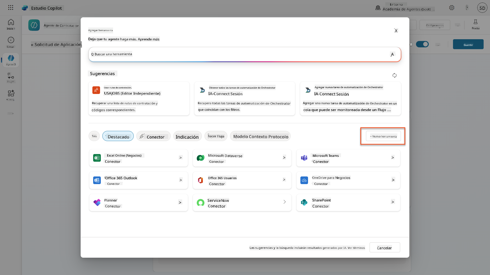

1. Selecciona **Flujo de agente**.  
   Se abrirá el diseñador de Flujos de Agentes, aquí es donde agregaremos la lógica para subir currículums.  
   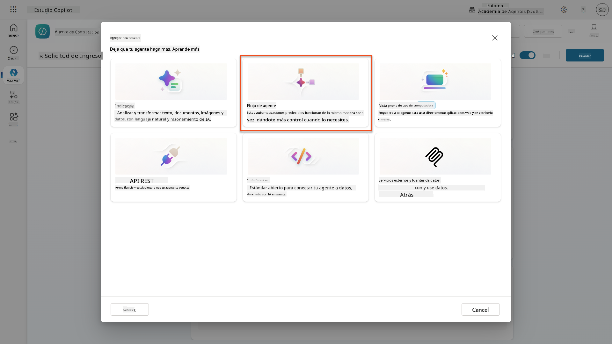

1. Selecciona el nodo **Cuando un agente llama al flujo**, y selecciona **+ Agregar** una entrada para los siguientes parámetros, asegurándote de agregar tanto el nombre como la descripción.

    | Tipo  | Nombre     | Descripción                                                                                                   |
    |-------|------------|---------------------------------------------------------------------------------------------------------------|
    | Archivo | Currículum | El archivo PDF del currículum                                                                                 |
    | Texto  | Mensaje    | Extrae un mensaje estilo carta de presentación del contexto. El mensaje debe tener menos de 2000 caracteres.   |
    | Texto  | CorreoUsuario | La dirección de correo electrónico de donde proviene el currículum. Será el usuario que sube el currículum en el chat, o la dirección de correo si se recibe por email. |

    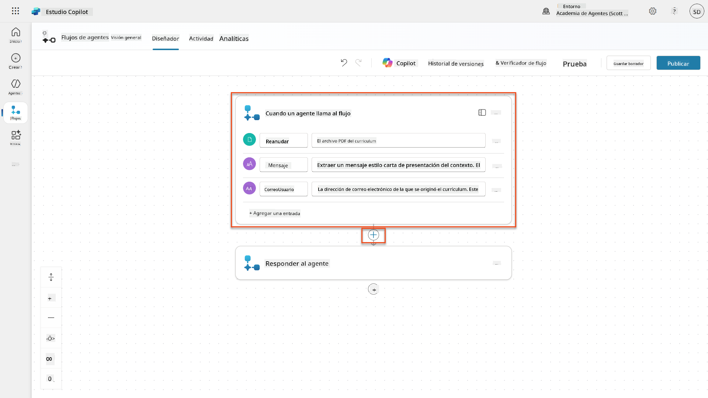

1. Selecciona el **icono +** debajo del nodo de activación, busca `Dataverse`, selecciona **Ver más** junto a Microsoft Dataverse, y luego selecciona la acción **Agregar una nueva fila** en la sección **Microsoft Dataverse**  
    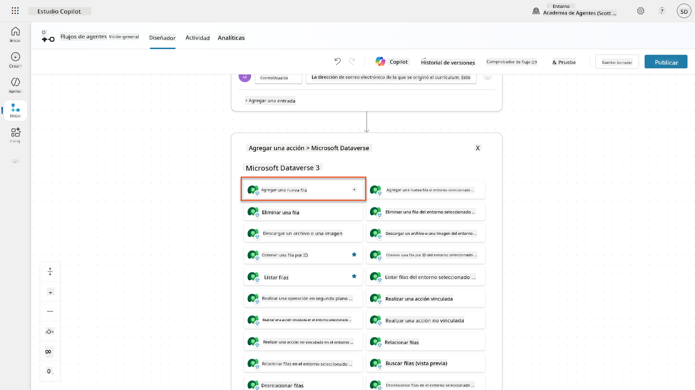

1. Nombra el nodo como **Crear Currículum**, seleccionando los **tres puntos (...)**, y seleccionando **Renombrar**  
    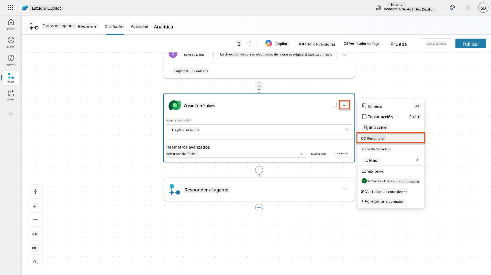

1. Establece el **Nombre de la tabla** como **Currículums**, luego selecciona **Mostrar todo**, para mostrar todos los parámetros.

1. Configura las siguientes **propiedades**:

    | Propiedad                 | Cómo configurarla               | Detalles / Expresión                                         |
    | ------------------------ | ------------------------------- | ------------------------------------------------------------ |
    | **Título del currículum** | Datos dinámicos (icono de rayo) | **Cuando un agente llama al flujo** → **Nombre del currículum** Si no ves el nombre del currículum, asegúrate de haber configurado el parámetro Currículum como tipo de dato. |
    | **Carta de presentación** | Expresión (icono fx)            | `if(greater(length(triggerBody()?['text']), 2000), substring(triggerBody()?['text'], 0, 2000), triggerBody()?['text'])` |
    | **Dirección de correo fuente** | Datos dinámicos (icono de rayo) | **Cuando un agente llama al flujo** → **CorreoUsuario**             |
    | **Fecha de subida**       | Expresión (icono fx)            | `utcNow()`                                                   |

    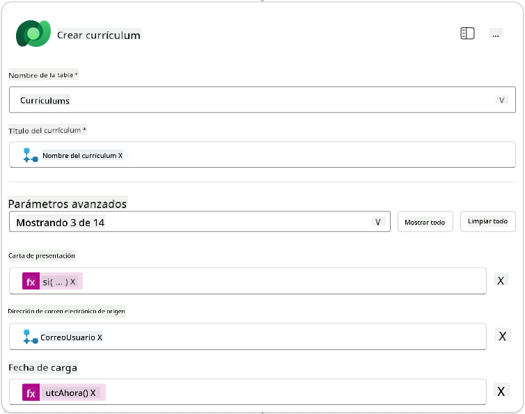

1. Selecciona el **icono +** debajo del nodo Crear Currículum, busca `Dataverse`, selecciona **Ver más** junto a Microsoft Dataverse, y luego selecciona la acción **Subir un archivo o una imagen**.  
   **Importante:** Asegúrate de no seleccionar la acción Subir un archivo o una imagen al entorno seleccionado.

1. Nombra el nodo como **Subir archivo de currículum**, seleccionando los **tres puntos (...)**, y seleccionando **Renombrar**

1. Configura las siguientes **propiedades**:

     | Propiedad | Cómo configurarla | Detalles |
     |----------|-------------------|---------|
     | **Nombre del contenido** | Datos dinámicos (icono de rayo) | Cuando un agente llama al flujo → Nombre del currículum |
     | **Nombre de la tabla** | Seleccionar | Currículums |
     | **ID de fila** | Datos dinámicos (icono de rayo) | Crear Currículum → Ver más → Currículum |
     | **Nombre de columna** | Seleccionar | Currículum PDF |
     | **Contenido** | Datos dinámicos (icono de rayo) | Cuando un agente llama al flujo → Currículum contentBytes |

     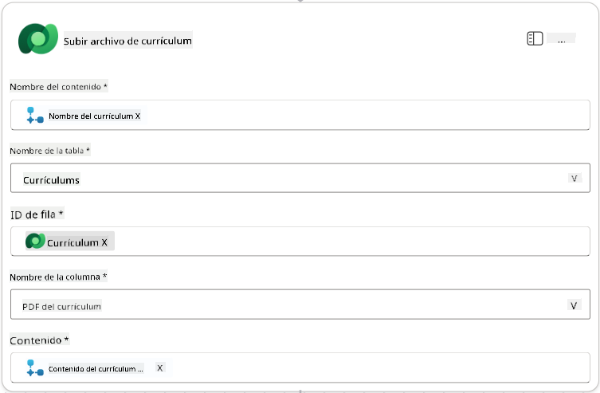

1. Selecciona el nodo **Responder al agente**, y luego selecciona **+ Agregar una salida**

     | Propiedad | Cómo configurarla | Detalles |
     |----------|-------------------|---------|
     | **Tipo** | Seleccionar | `Texto` |
     | **Nombre** | Introducir | `NúmeroCurrículum` |
     | **Valor** | Datos dinámicos (icono de rayo) | Crear Currículum → Ver más → Número de currículum |
     | **Descripción** | Introducir | `El [NúmeroCurrículum] del currículum creado` |

     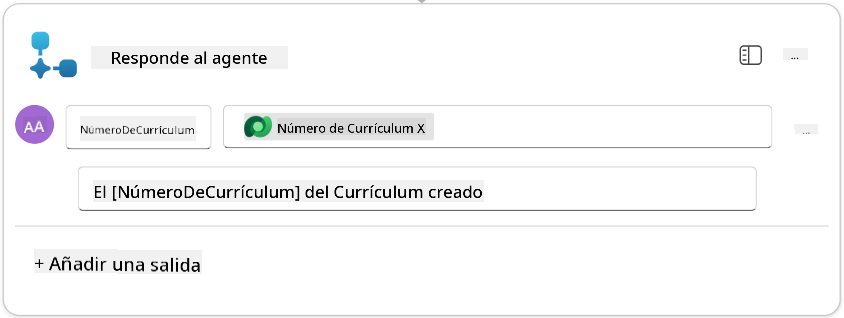

1. Selecciona **Guardar borrador** en la parte superior derecha  
     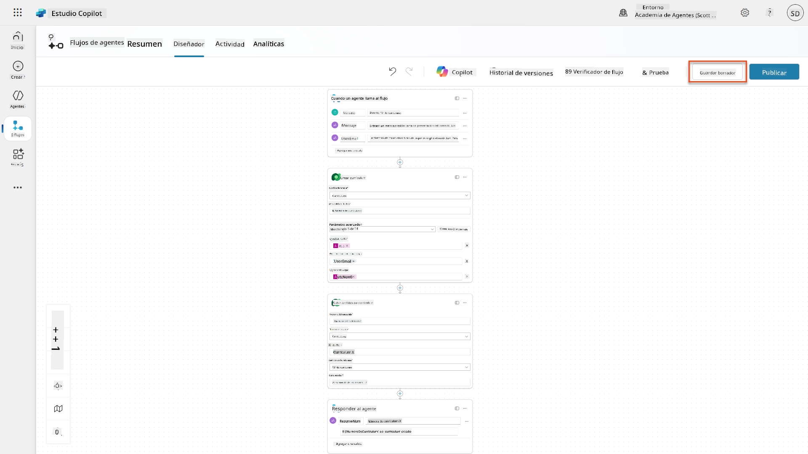

1. Selecciona la pestaña **Resumen**, selecciona **Editar** en el panel **Detalles**

     1. **Nombre del flujo**:`Subida de currículum`
     1. **Descripción**:`Sube un currículum cuando se le indique`

     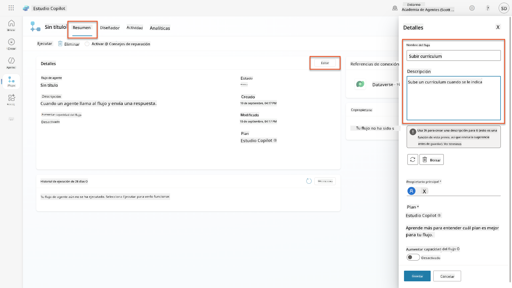

1. Selecciona nuevamente la pestaña **Diseñador**, y selecciona **Publicar**.  
     

### 2.1.5 Conectar el flujo a tu agente

Ahora conectarás el flujo publicado a tu Agente de Admisión de Solicitudes.

1. Navega de regreso al **Agente de Contratación** y selecciona la pestaña **Agentes**. Abre el **Agente de Admisión de Solicitudes**, y luego ubica el panel **Herramientas**.  
    

1. Selecciona **+ Agregar**

1. Selecciona el filtro **Flujo**, y busca `Subida de currículum`. Selecciona el flujo **Subida de currículum**, y luego **Agregar y configurar**.

1. Configura los siguientes parámetros:

    | Parámetro | Valor |
    |-----------|-------|
    | **Descripción** | `Sube un currículum cuando se le indique. REGLA ESTRICTA: Solo llama a esta herramienta cuando se haga referencia en el formulario "Subida de currículum" y haya adjuntos` |
    | **Detalles adicionales → Cuándo se puede usar esta herramienta** | `solo cuando se haga referencia por temas o agentes` |
    | **Entradas → Agregar entrada** | `contentBytes` |
    | **Entradas → Agregar entrada** | `name` |

    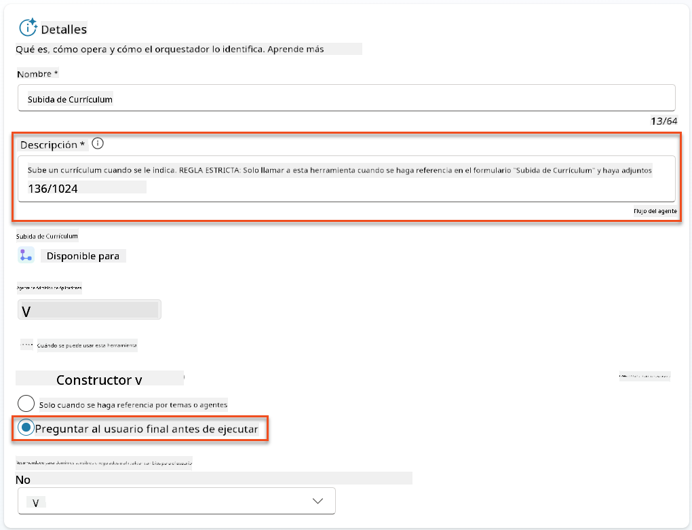

    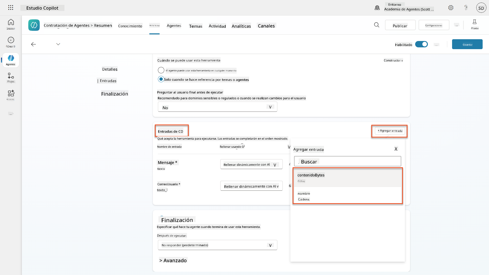

1. Luego configura las propiedades de las entradas como sigue:

    | Parámetro de entrada | Propiedad | Detalles |
    |---------------------|----------|---------|
    | **contentBytes** | Rellenar usando | Valor personalizado |
    |                  | Valor (...→Fórmula→Insertar) | `First(System.Activity.Attachments).Content` |
    | **name** | Rellenar usando | Valor personalizado |
    |          | Valor (...→Fórmula→Insertar) | `First(System.Activity.Attachments).Name` |
    | **Mensaje** | Personalizar | Configurar ajustes personalizados |
    |             | Descripción | `Extrae un mensaje estilo carta de presentación del contexto. Asegúrate de no solicitar al usuario y crea al menos una carta de presentación mínima a partir del contexto disponible. REGLA ESTRICTA: el mensaje debe tener menos de 2000 caracteres.` |
    |             | Cuántos reintentos | No repetir |
    |             | Acción si no se encuentra entidad | Establecer variable a valor |
    |             | Valor predeterminado de la entidad | Subida de currículum |
    | **CorreoUsuario** | Rellenar usando | Valor personalizado |
    |  | Valor (...→Fórmula→Insertar) | `System.User.Email` |

    

1. Selecciona **Guardar**

### 2.1.6 Definir instrucciones del agente

1. Regresa al **Agente de Admisión de Solicitudes** seleccionando la pestaña **Agentes**, y luego ubica el panel **Instrucciones**.

1. En el campo **Instrucciones**, pega la siguiente guía clara para tu agente secundario:

    ```text
    You are tasked with managing incoming Resumes, Candidate information, and creating Job Applications.  
    Only use tools if the step exactly matches the defined process. Otherwise, indicate you cannot help.  
    
    Process for Resume Upload via Chat  
    1. Upload Resume  
      - Trigger only if /System.Activity.Attachments contains exactly one new resume.  
      - If more than one file, instruct the user to upload one at a time and stop.  
      - Call /Upload Resume once. Never upload more than once for the same message.  
    
    2. Post-Upload  
      - Always output the [ResumeNumber] (R#####).  
    ```

1. Donde las instrucciones incluyan una barra diagonal (/), selecciona el texto que sigue a la / y selecciona el nombre resuelto. Haz esto para:

    - `System.Activity.Attachments` (Variable)
    - `Subir currículum` (Herramienta)

    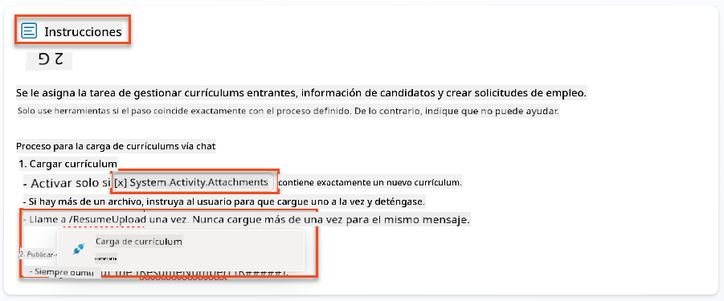

1. Selecciona **Guardar**

### 2.1.7 Prueba tu Agente de Admisión de Solicitudes

Ahora vamos a verificar que tu primer miembro de la orquesta funcione correctamente.

1. **Descarga** los [currículums de prueba.](https://download-directory.github.io/?url=https://github.com/microsoft/agent-academy/tree/main/operative/sample-data/resumes&filename=operative_sampledata)

1. **Activa** el panel de prueba seleccionando **Probar**.

1. **Sube** dos currículums en el chat de prueba, y escribe el mensaje `Procesa estos currículums`

    - El agente debería devolver un mensaje similar a *Solo se puede subir un currículum a la vez. Por favor, sube un currículum para continuar.*

    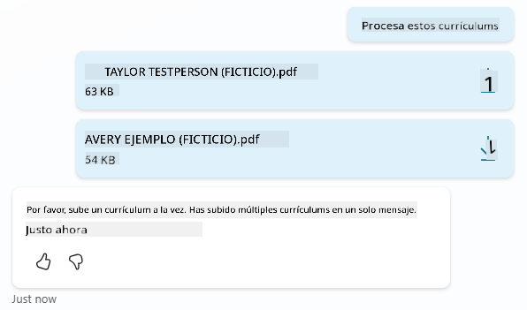

1. Intenta subir **solo un currículum**, con el mensaje `Procesa este currículum`

    - El agente debería entonces dar un mensaje similar a *El currículum de Avery Ejemplo se ha subido exitosamente. El número de currículum es R10026.*

1. En el **Mapa de actividad**, deberías ver al **Agente de Admisión de Solicitudes** manejando la subida del currículum.  
    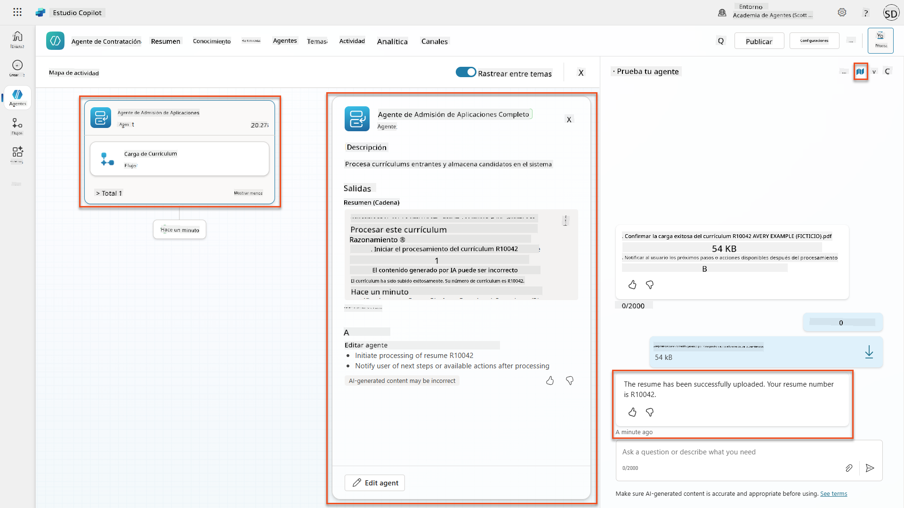

1. Navega a make.powerapps.com → Asegúrate de que tu entorno esté seleccionado en la esquina superior derecha del Selector de Entorno.

1. Selecciona **Apps** → Hiring Hub → menú de tres puntos (...) → **Jugar**  
    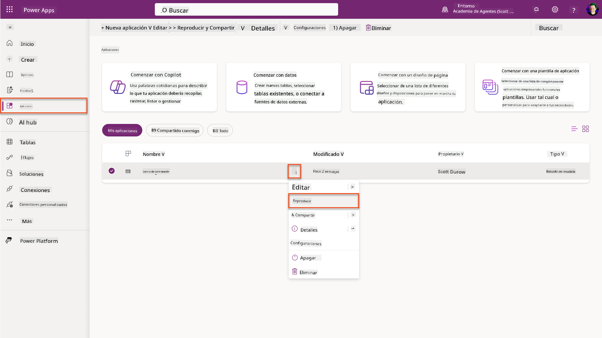

    Nota: Si el botón de jugar está deshabilitado, significa que no has publicado tu solución desde la Misión 01. Selecciona **Soluciones** → **Publicar todas las personalizaciones**.

1. Navega a **Currículums**, y verifica que el archivo del currículum esté subido y la carta de presentación esté configurada correctamente.  
    

## 🧪Laboratorio 2.2: Agregar el agente conectado de preparación para entrevistas

Ahora vamos a crear nuestro agente conectado para la preparación de entrevistas y agregarlo a tu Agente de Contratación existente.

### 2.2.1 Crear el agente conectado de entrevistas

1. **Navega** a Copilot Studio. Asegúrate de que tu entorno aún esté seleccionado en la esquina superior derecha del Selector de Entorno.

1. Abre tu **Agente de Contratación**

1. Navega a la pestaña Agente, y selecciona **+ Agregar un agente**

1. Selecciona **Conectar un agente existente** → **Copilot Studio**

1. Selecciona **+ Nuevo agente**

### 2.2.2 Configurar ajustes básicos

1. Selecciona la pestaña **Configurar**, e introduce las siguientes propiedades:

    - **Nombre**: `Agente de Entrevistas`
    - **Descripción**: `Asiste en el proceso de entrevistas.`

1. Instrucciones:

    ```text
    You are the Interview Agent. You help interviewers and hiring managers prepare for interviews. You never contact candidates. 
    Use Knowledge to help with interview preparation. 
    
    The only valid identifiers are:
      - ResumeNumber (ppa_resumenumber)→ format R#####
      - CandidateNumber (ppa_candidatenumber)→ format C#####
      - ApplicationNumber (ppa_applicationnumber)→ format A#####
      - JobRoleNumber (ppa_jobrolenumber)→ format J#####
    
    Examples you handle
      - Give me a summary of ...
      - Help me prepare to interview candidates for the Power Platform Developer role
      - Create interview assistance for the candidates for Power Platform Developer
      - Give targeted questions for Candidate Alex Johnson focusing on the criteria for the Job Application
      
    How to work:
        You are expected to ask clarification questions if required information for queries is not provided
        - If asked for interview help without providing a job role, ask for it
        - If asking for interview questions, ask for the candidate and job role if not provided.
    
    General behavior
    - Do not invent or guess facts
    - Be concise, professional, and evidence-based
    - Map strengths and risks to the highest-weight criteria
    - If data is missing (e.g., no resume), state what is missing and ask for clarification
    - Never address or message a candidate
    ```

1. Cambia **Búsqueda web** a **Deshabilitado**

1. Selecciona **Crear**  
    

### 2.2.3 Configurar acceso a datos y publicar

1. En la sección **Conocimiento**, selecciona **+ Agregar conocimiento**  
    
1. Selecciona **Dataverse**  
    
1. En el **cuadro de búsqueda**, escribe `ppa_`. Este es el prefijo de las tablas que importaste previamente.
1. **Selecciona** las 5 tablas (Candidato, Criterios de Evaluación, Solicitud de Empleo, Rol de Trabajo, Currículum)
1. Selecciona **Agregar al agente**  
    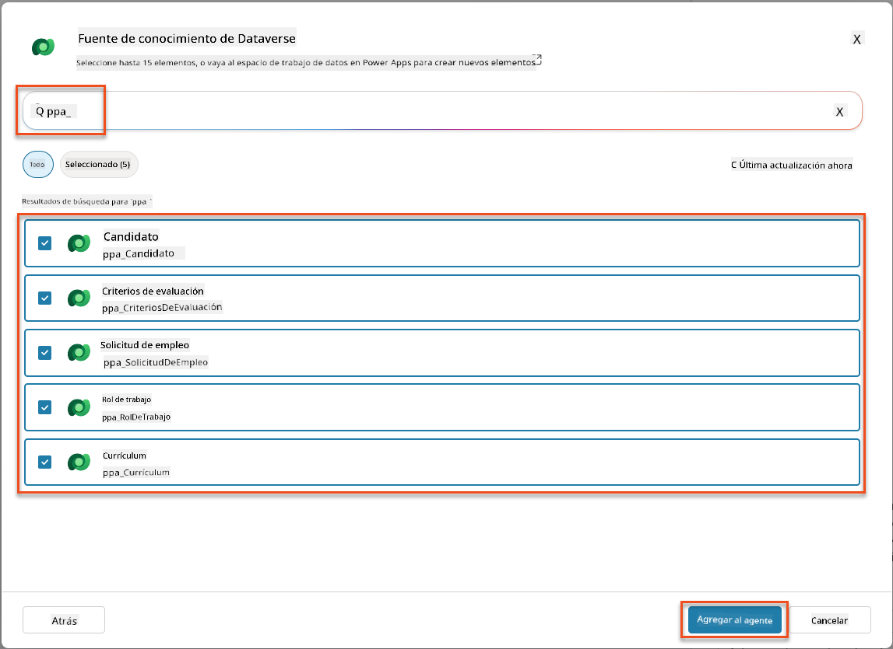
1. Selecciona **Configuración**, en el Agente de Entrevistas, y establece los siguientes ajustes:

    - **Permitir que otros agentes se conecten y usen este:** `Activado`
    - **Usar conocimiento general**: `Desactivado`
    - **Subidas de archivos**: `Desactivado`
    - **Nivel de moderación de contenido:** `Medio`
1. Selecciona **Guardar**
1. Selecciona **Publicar**, y espera a que se complete la publicación.

### 2.2.4 Conectar el Agente de Preparación de Entrevistas a tu Agente de Contratación

1. Navega de regreso a tu **Agente de Contratación**

1. Selecciona la pestaña **Agentes**

1. Usa el **+Agregar un agente** → **Copilot Studio**, para agregar el **Agente de Entrevistas**. Establece la descripción como:
    ```text
    Assists with the interview process and provides information about Resumes, Candidates, Job Roles, and Evaluation Criteria.
    ```

    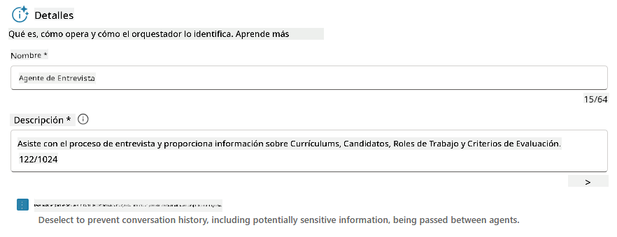
    Observa que la opción Pasar el historial de conversación a este agente está marcada. Esto permite que el agente principal proporcione todo el contexto al agente conectado.

1. Selecciona **Agregar agente**

1. Asegúrate de que ves tanto el **Agente de Admisión de Aplicaciones** como el **Agente de Entrevista**. Observa cómo uno es un agente hijo y el otro es un agente conectado.  
    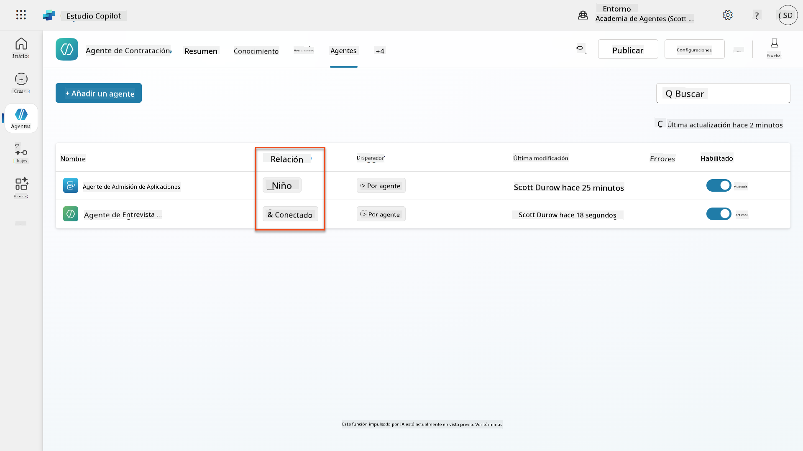

### 2.2.5 Prueba de colaboración entre múltiples agentes

1. **Activa** el panel de prueba seleccionando **Prueba**.

1. **Carga** uno de los currículums de prueba y escribe la siguiente descripción que indica al agente principal qué puede delegar al agente conectado:

    ```text
    Upload this resume, then show me open job roles, each with a description of the evaluation criteria, then use this to match the resume to at least one suitable job role even if not a perfect match.
    ```

    

1. Observa cómo el Agente de Contratación delegó la carga al agente hijo y luego pidió al Agente de Entrevista que proporcionara un resumen y una coincidencia de roles laborales utilizando su conocimiento.  
   Prueba diferentes formas de hacer preguntas sobre currículums, roles laborales y criterios de evaluación.  
   **Ejemplos:**

    ```text
    Give me a summary of active resumes
    ```

    ```text
    Summarize resume R10044
    ```

    ```text
    Which active resumes are suitable for the Power Platform Developer role?
    ```

## 🎉 Misión completada

¡Excelente trabajo, Agente! **Operación Sinfonía** está ahora completa. Has transformado exitosamente tu Agente de Contratación único en una sofisticada orquesta de múltiples agentes con capacidades especializadas.

Esto es lo que has logrado en esta misión:

**✅ Dominio de la arquitectura de múltiples agentes**  
Ahora entiendes cuándo usar agentes hijos frente a agentes conectados y cómo diseñar sistemas que escalen.

**✅ Agente hijo de Admisión de Aplicaciones**  
Has añadido un agente hijo especializado a tu Agente de Contratación que procesa currículums, extrae datos de candidatos y almacena información en Dataverse.

**✅ Agente conectado de Preparación para Entrevistas**  
Has creado un agente conectado reutilizable para la preparación de entrevistas y lo has conectado exitosamente a tu Agente de Contratación.

**✅ Comunicación entre agentes**  
Has visto cómo tu agente principal puede coordinarse con agentes especialistas, compartir contexto y orquestar flujos de trabajo complejos.

**✅ Base para la autonomía**  
Tu sistema de contratación mejorado está ahora listo para las funciones avanzadas que añadiremos en las próximas misiones: activadores autónomos, moderación de contenido y razonamiento profundo.

🚀**Próximo paso:** En tu próxima misión, aprenderás cómo configurar tu agente para procesar currículums de correos electrónicos de forma autónoma.

⏩[Ir a la Misión 03: Automatiza tu agente con activadores](../03-automate-triggers/README.md)

## 📚 Recursos tácticos

📖 [Agregar otros agentes (vista previa)](https://learn.microsoft.com/microsoft-copilot-studio/authoring-add-other-agents?WT.mc_id=power-182762-scottdurow)

📖 [Agregar herramientas a agentes personalizados](https://learn.microsoft.com/microsoft-copilot-studio/advanced-plugin-actions?WT.mc_id=power-182762-scottdurow)

📖 [Trabajar con Dataverse en Copilot Studio](https://learn.microsoft.com/microsoft-copilot-studio/knowledge-add-dataverse?WT.mc_id=power-182762-scottdurow)

📖 [Descripción general de flujos de agentes](https://learn.microsoft.com/microsoft-copilot-studio/flows-overview?WT.mc_id=power-182762-scottdurow)

📖 [Crear una solución](https://learn.microsoft.com/power-platform/alm/solution-concepts-alm?WT.mc_id=power-182762-scottdurow)

📖 [Guía de ALM de soluciones de Power Platform](https://learn.microsoft.com/power-platform/alm/overview-alm?WT.mc_id=power-182762-scottdurow)

📺 [Colaboración entre agentes en Copilot Studio](https://youtu.be/d-oD3pApHAg?si=rwIHKhJTkjSvhTHw)

---

**Descargo de responsabilidad**:  
Este documento ha sido traducido utilizando el servicio de traducción automática [Co-op Translator](https://github.com/Azure/co-op-translator). Aunque nos esforzamos por lograr precisión, tenga en cuenta que las traducciones automáticas pueden contener errores o imprecisiones. El documento original en su idioma nativo debe considerarse la fuente autorizada. Para información crítica, se recomienda una traducción profesional realizada por humanos. No nos hacemos responsables de malentendidos o interpretaciones erróneas que surjan del uso de esta traducción.