<!--
CO_OP_TRANSLATOR_METADATA:
{
  "original_hash": "dcbcd9396b076da0a0f5d389e9ec1b12",
  "translation_date": "2025-10-17T01:32:32+00:00",
  "source_file": "docs/recruit/08-add-adaptive-card/README.md",
  "language_code": "he"
}
-->
# 🚨 משימה 08: שיפור אינטראקציות משתמשים בנושאים באמצעות כרטיסי Adaptive Cards

## 🕵️‍♂️ שם קוד: `מבצע שדרוג ממשק`

> **⏱️ חלון זמן המבצע:** `~45 דקות`

🎥 **צפו בהדרכה**

[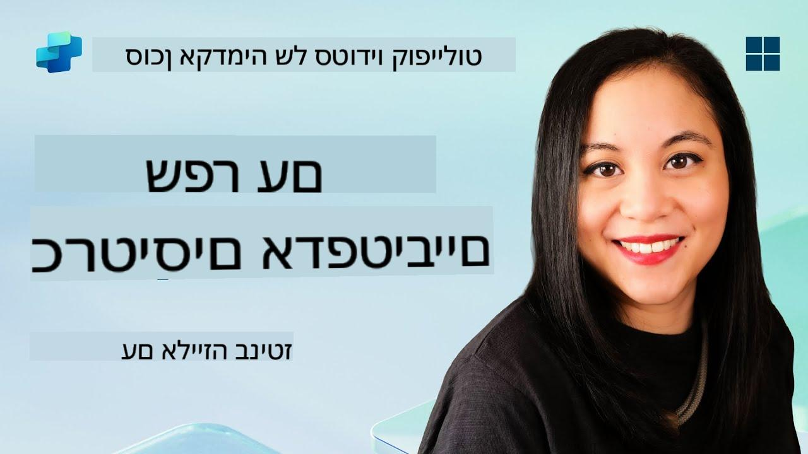](https://www.youtube.com/watch?v=RhIlzYHPCXo "צפו בהדרכה ביוטיוב")

## 🎯 תדריך משימה

סוכנים, המשימה שלכם היא לחדור לחוויית המשתמש הסטטית ולהחליף אותה בכרטיסי Adaptive Cards עשירים, דינמיים ופעילים. תשתמשו במטעני JSON ובנוסחאות Power Fx כדי להפוך שיחות ב-Copilot Studio מאינטראקציות בסיסיות לשיחות אינטראקטיביות לחלוטין. המטרה שלכם היא לאסוף קלט משתמשים, להציג נתונים בצורה מרהיבה ולכוון שיחות בדיוק ובסטייל. אם לא תסתגלו, המשתמשים שלכם עשויים לעבור לממשקים פחות אינטליגנטיים.

## 🔎 מטרות

במשימה זו תלמדו:

1. להבין מה הם כרטיסי Adaptive Cards וכיצד הם משפרים אינטראקציות משתמשים ב-Copilot Studio
1. ללמוד לבנות כרטיסים אינטראקטיביים באמצעות JSON ונוסחאות Power Fx לתוכן דינמי
1. לחקור את מעצב כרטיסי Adaptive ואת הרכיבים המרכזיים שלו ליצירת כרטיסים חזותיים
1. ליצור טפסים עשירים ואינטראקטיביים וחוויות איסוף נתונים בתוך נושאי סוכן
1. ליישם שיטות עבודה מומלצות לעיצוב כרטיסי Adaptive רספונסיביים וידידותיים למשתמש

## 🤔 מהו כרטיס Adaptive?

**כרטיס Adaptive** הוא דרך ליצור אלמנטים ממשק משתמש אינטראקטיביים ועשירים חזותית שניתן להטמיע באפליקציות כמו Microsoft Teams, Microsoft Outlook או סוכנים. זהו אובייקט JSON מובנה שמגדיר את הפריסה והתוכן של הכרטיס:

- אילו אלמנטים מופיעים בכרטיס - טקסט, תמונות, כפתורים
- כיצד האלמנטים הללו מסודרים
- אילו פעולות המשתמשים יכולים לבצע כמו שליחת טופס או פתיחת קישור

    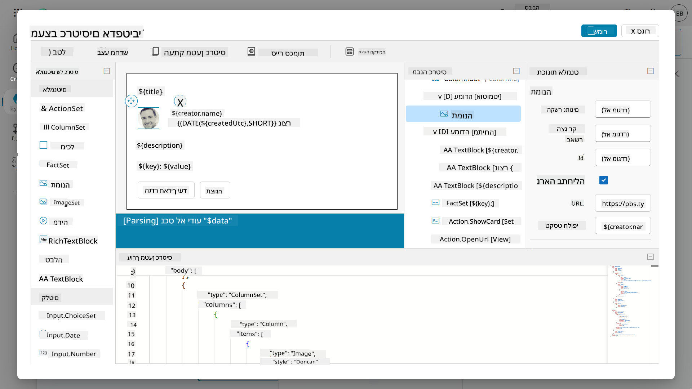

### למה כרטיסי Adaptive חשובים ב-Copilot Studio

דמיינו שאתם בונים סוכן ששואל משתמשים את שמם, כתובת האימייל שלהם או משוב. אם תשתמשו רק בטקסט פשוט, השיחה יכולה להרגיש משעממת או קשה למעקב. כאן נכנסים לתמונה כרטיסי Adaptive!

1. **הופכים שיחות לאינטראקטיביות** - במקום לשלוח טקסט כהודעות למשתמש, תוכלו להציג כפתורים, טפסים, תמונות ועוד.
    - דוגמה: כרטיס יכול לבקש מהמשתמש למלא את שמו וכתובת האימייל שלו בטופס נקי.

1. **נראים נהדר בכל מקום** - כרטיסי Adaptive מתאימים אוטומטית לסגנון האפליקציה שבה הם נמצאים, כמו צ'אט Microsoft 365 Copilot או Microsoft Teams. אין צורך לדאוג לגבי מצב כהה, גופן או פריסות - הם מתאימים.

1. **קל לבנות עם JSON** - אתם מגדירים את הכרטיס באמצעות קוד JSON (חשבו על זה כמתכון לממשק המשתמש). Copilot Studio עוזר לכם להציג תצוגה מקדימה של הכרטיס לפני הוספתו לנושא.

1. **איסוף ושימוש בנתונים** - ניתן להשתמש בכרטיס כדי לשאול שאלות, לאסוף תשובות ולהשתמש בנתונים הללו בזרימת השיחה.
    - דוגמה: בקשו את מספר הטלפון של המשתמש, ואז הציגו כרטיס אישור עם מספר הטלפון שלו.

1. **שיפור חוויית המשתמש** - כרטיסים גורמים לסוכן שלכם להרגיש יותר אינטראקטיבי. זהו ממשק נקי, לחיץ וידידותי יותר למשתמש.

## 🐱 האם _JSON_ הוא אדם?

מבטאים את זה כ"ג'ייסון", אבל זה לא אדם 😅

JSON, הידוע גם כ-_JavaScript Object Notation_, הוא פורמט קל משקל המשמש למבנה נתונים. קל לקרוא ולכתוב אותו, והוא נראה כמו סדרת זוגות מפתח-ערך בתוך סוגריים מסולסלים {}.

זו אחת האפשרויות לשימוש בעת הוספת כרטיס Adaptive לנושא שלכם.

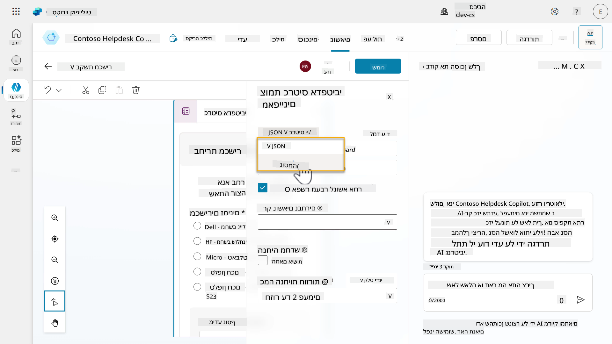

## 👀 אני רואה אפשרות נוספת לבניית כרטיס Adaptive באמצעות _נוסחה_

זוכרים איך למדנו על Power Fx ב-[משימה 07 - שימוש ב-Power Fx בצמתים שלכם](../07-add-new-topic-with-trigger/README.md#what-power-fx-can-do-in-topics)? אותו דבר ניתן ליישם בכרטיסי Adaptive בתוך Copilot Studio.

כתזכורת,

!!! note
    Power Fx הוא שפת תכנות בקוד נמוך המשמשת להוספת לוגיקה והתנהגות דינמית לסוכן שלכם. זו אותה שפה המשמשת ב-Microsoft Power Apps, והיא נועדה להיות פשוטה ודומה ל-Excel, מה שהופך אותה לקלה למפתחים ולא למפתחים כאחד.

### איך Power Fx עובד בכרטיסי Adaptive

כשאתם מעצבים כרטיס Adaptive ב-Copilot Studio, תוכלו להשתמש בנוסחאות Power Fx כדי:

- להכניס ערכים באופן דינמי כמו שמות משתמשים, תאריכים או סטטוס.
- לעצב טקסט או מספרים כמו הצגת מטבע או עיגול מספרים.
- להציג או להסתיר אלמנטים בהתבסס על תנאים.
- להתאים תגובות בהתבסס על קלט משתמשים, משתנים, פלטים מצמתים בשיחה.

לדוגמה,

"`שלום`" & `System.User.DisplayName`

נוסחה זו משלבת את המילה "שלום" עם שם המשתמש באופן דינמי.

### למה זה שימושי

1. **התאמה אישית**

    תוכלו להתאים את ההודעה לכל משתמש, מה שהופך את האינטראקציות לטבעיות ורלוונטיות יותר.

1. **תוכן דינמי**

    כרטיסים יכולים להציג נתונים אמיתיים ממשתנים ופלטים מצמתים בשיחה.

1. **לוגיקה חכמה**

    תוכלו לשלוט במה שהמשתמשים רואים או מתקשרים איתו בהתבסס על תנאים, מה שמשפר את השימושיות ומפחית טעויות.

1. **ידידותי לקוד נמוך**

    Power Fx היא שפת תכנות בקוד נמוך. כפי שצוין קודם, היא קריאה, אינטואיטיבית ודומה לנוסחאות Excel.

## 👷🏻‍♀️ בנייה עם מעצב כרטיסי Adaptive

**מעצב כרטיסי Adaptive** הוא כלי חזותי שמאפשר לכם לבנות כרטיסי הודעות אינטראקטיביים באמצעות אלמנטים גרירה ושחרור כמו טקסט, תמונות, כפתורים וקלטים. מטרתו היא לעזור לכם ליצור הודעות עשירות ודינמיות ללא כתיבת קוד מורכב, מה שמקל על עיצוב ממשקים ידידותיים למשתמש.

כלי המעצב עוזר לכם לבנות את הכרטיס באופן חזותי, אך מאחורי הקלעים, הוא מייצר עבורכם את אובייקט ה-JSON. תוכלו גם לעבור ל_נוסחה_ שמאפשרת שימוש בביטויי Power Fx בכרטיס כדי להציג נתונים ממקומות אחרים.

## 🎨 הבנת מעצב כרטיסי Adaptive


### א) אלמנטים של כרטיס

אלו הם אבני הבניין של כרטיס ה-Adaptive שלכם. תוכלו לגרור ולשחרר אלמנטים כמו הבאים:

- **TextBlock** להצגת טקסט.
- **Image** להצגת תמונות.
- **FactSet** לזוגות מפתח-ערך.
- **שדות קלט** להצגת תיבות טקסט, בוחרי תאריכים, מתגים.
- **פעולות** להצגת כפתורים כמו _שלח_, _פתח קישור_, או _הצג כרטיס_.

לכל אלמנט יש מטרה משלו וניתן לעצב או להגדיר אותו.

### ב) תצוגת כרטיס

זהו אזור ה**תצוגה המקדימה** שבו תוכלו לראות כיצד ייראה הכרטיס שלכם בזמן אמת. כשאתם מוסיפים או עורכים אלמנטים, התצוגה מתעדכנת מיד כדי לשקף שינויים. זה מאפשר לכם לבצע עדכונים חוזרים ולראות את תוצאת העיצוב בו זמנית.

### ג) מבנה כרטיס

זה מציג את **ההיררכיה והפריסה** של הכרטיס שלכם. לדוגמה:

- כרטיס עשוי להתחיל עם **TextBlock** לכותרת.
- לאחר מכן **ColumnSet** עם תמונה בצד אחד וטקסט בצד השני.
- ואחריו **FactSet** וכמה **כפתורי פעולה**.

זה עוזר לכם להבין כיצד האלמנטים מקוננים ומאורגנים.

### ד) תכונות אלמנט

כשאתם לוחצים על כל אלמנט בכרטיס, פאנל זה מאפשר לכם **להתאים את ההגדרות שלו**:

- שינוי גודל טקסט, משקל או צבע.
- הגדרת כתובות URL של תמונות או טקסט חלופי.
- הגדרת אפשרויות קלט כמו טקסט מציין מיקום או ערכים ברירת מחדל.

כאן אתם משפרים כל אלמנט.

### ה) עורך מטען כרטיס

זהו קוד ה-JSON הגולמי שמאחורי הכרטיס שלכם. משתמשים מתקדמים יכולים לערוך אותו ישירות כדי:

- להשתמש בתכונות תבנית.
- להעתיק/להדביק הגדרות כרטיס.

גם אם אתם חדשים במעצב כרטיסי Adaptive, זה מועיל לראות כיצד העיצוב החזותי מתורגם לקודים.

!!! tip "טיפ - עיינו בדוגמאות של כרטיסי Adaptive"

    1. בקרו ב-[https://adaptivecards.microsoft.com/designer](https://adaptivecards.microsoft.com/designer).
    2. בחרו **כרטיס חדש** כדי לראות רשימת דוגמאות שתוכלו לבחור ולשנות.
    3. שימו לב שהמעצב הזה הוא חיצוני (מבוסס אינטרנט). כשאתם בונים את הכרטיס שלכם במעצב כרטיסי Adaptive מבוסס האינטרנט, העתיקו את ה-JSON מעורך מטען הכרטיס.
    4. הדביקו את ה-JSON בכרטיס Adaptive שלכם בסוכן ב-Copilot Studio.

    

## 🌵 שימושים נפוצים

הבאים הם שימושים נפוצים לכרטיסי Adaptive ב-Copilot Studio כאשר משתמשים בהם בצמתים **שלח הודעה** או **שאל שאלה**.

1. **טפסים ואיסוף נתונים**

    השתמשו בכרטיסי Adaptive כדי לאסוף קלט מובנה ממשתמשים, כגון:

    - בקשות חופשה
    - טפסי משוב
    - מידע ליצירת קשר
    - תזמון פגישות

1. **הצגת מידע דינמי**

    הצגת נתונים מותאמים אישית או בזמן אמת בפורמט נקי וקריא ממקורות ארגוניים כמו ServiceNow, SAP, Dynamics 365, SharePoint וכו'.

    - סיכומי הזמנות
    - יתרות חשבון
    - סטטוס כרטיסים או תיקים
    - אירועים או מועדים קרובים

1. **בחירות אינטראקטיביות**

    אפשרו למשתמשים לבצע בחירות ישירות בשיחה:

    - בחירה מתוך רשימת אפשרויות, לדוגמה קטגוריות מוצרים, נושאי תמיכה.
    - אישור או ביטול פעולה.
    - דירוג שירות או חוויה.

1. **הפעלת פעולות**

    כללו כפתורים שמפעילים צעדים נוספים בשיחה פנימית או חיצונית.

    - "שלח בקשה"
    - "צפה בפרטים"

## ⭐ שיטות עבודה מומלצות

הנה כמה שיטות עבודה מומלצות ליצירת כרטיסי Adaptive עבור סוכנים ב-Copilot Studio.

1. **שמרו על פשטות ומיקוד**

    - עיצבו כרטיסים עם מטרה ברורה, אל תעמיסו עליהם יותר מדי אלמנטים.
    - השתמשו בטקסט תמציתי ובפריסות אינטואיטיביות כדי להנחות משתמשים דרך האינטראקציה.

1. **היו מכוונים עם קלטים**

    - כללו רק את אלמנטי הקלט הנחוצים כמו טקסט, בחירות תאריך, כדי לא להעמיס על המשתמשים.
    - השתמשו בתוויות כדי להפוך את הקלטים לקלים להבנה.

1. **מבנה לקריאות**

    - השתמשו ב-**TextBlocks** לכותרות והוראות.
    - קבצו אלמנטים קשורים באמצעות **Containers** או **ColumnSets** כדי לשפר את הזרימה החזותית.

1. **הפכו את אלמנטי הפעולה לברורים**

    - השתמשו ב-**Action.Submit** או **Action.OpenUrl** עם כותרות כפתורים ברורות כמו "שלח בקשה" או "צפה בפרטים".
    - הימנעו מתוויות מעורפלות כמו "לחץ כאן".

1. **עצבו להתאמה**

    - הניחו שהכרטיס עשוי להיראות על גדלי מסך שונים.
    - הימנעו מרוחבים קבועים והשתמשו בפריסות גמישות כמו **ColumnSets** לרספונסיביות.

1. **השתמשו בתוכן דינמי כשאפשר**

    - קשרו אלמנטים של כרטיס למשתנים או פלטים מצמתים באמצעות Power Fx כדי להתאים אישית את חוויית המשתמש.
    - לדוגמה, הציגו את שם המשתמש או הסטטוס הנוכחי באופן דינמי.

## 🧪 מעבדה 08 - הוספת כרטיסי Adaptive ושיפור יכולות נושא

עכשיו נלמד כיצד לשפר את הנושא שלנו עם כרטיסי Adaptive ושימוש בפונקציונליות מתקדמת של נושאים וצמתים.

- [8.1 יצירת נושא חדש עם כרטיס Adaptive למשתמש להגיש את בקשתו](../../../../../docs/recruit/08-add-adaptive-card)
- [8.2 עדכון הוראות הסוכן להפעלת נושא בקשת מכשיר](../../../../../docs/recruit/08-add-adaptive-card)

### ✨ מקרה שימוש

**כ** עובד

**אני רוצה** לבקש מכשיר

**כדי ש** אוכל לבקש מכשיר מרשימת המכשירים הזמינים

בואו נתחיל!

### דרישות מוקדמות

1. **רשימת SharePoint**

    נשתמש ברשימת **Devices** של SharePoint מ-[שיעור 00 - הגדרת הקורס - שלב 3: יצירת אתר SharePoint חדש](../00-course-setup/README.md#step-4-create-new-sharepoint-site).

    אם לא הגדרתם את רשימת **Devices** של SharePoint, אנא חזרו ל-[שיעור 00 - הגדרת הקורס - שלב 3: יצירת אתר SharePoint חדש](../00-course-setup/README.md#step-4-create-new-sharepoint-site).

1. **Contoso Helpdesk Copilot**

    נשתמש באותו סוכן שנוצר קודם ב-[שיעור 06 - יצירת סוכן מותאם אישית באמצעות שפה טבעית עם Copilot והצמדתו לנתונים שלכם](../06-create-agent-from-conversation/README.md).

### 8.1 יצירת נושא חדש עם כרטיס Adaptive למשתמש להגיש את בקשתו

ניצור נושא חדש שיטפל בבקשת מכשיר של משתמש. נושא חדש זה יכיל צומת **שאל עם כרטיס Adaptive** כדי לאפשר אינטראקציה של המשתמש עם הסוכן.

בואו נתחיל!

1. בחרו בכרטיסיית **נושאים**, ואז בחרו **+ הוסף נושא חדש מריק**.

    

1. תנו לנושא את השם הבא,

    ```text
    Request device
    ```

    הזינו את התיאור הבא עבור ההפעלה.

    ```text
    This topic helps users request a device when they answer yes to the question that asks the user if they would like to request one of these devices.
    ```

    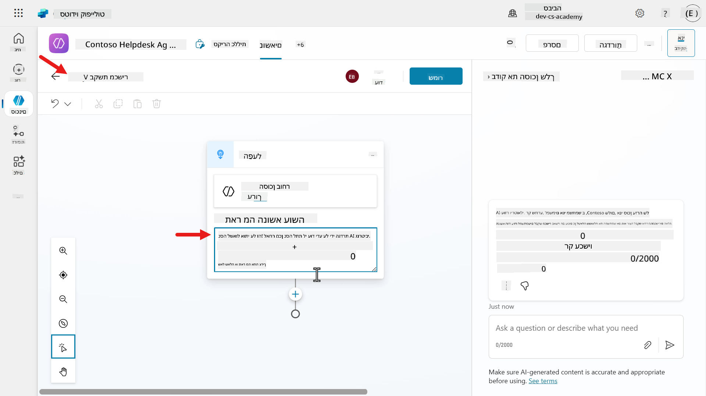
1. לאחר מכן, הוסף צומת **שאל עם כרטיס אדפטיבי**. צומת זה יציג כרטיס אינטראקטיבי למשתמש כדי לבחור באיזה מכשיר הוא מעוניין לבקש.

    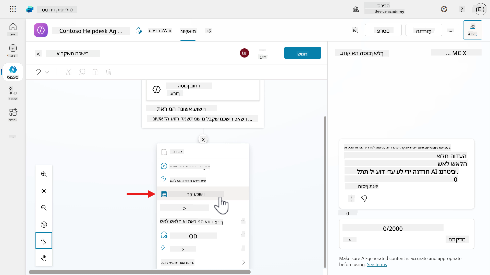

1. בחר את הצומת ותופיע חלונית **מאפייני צומת כרטיס אדפטיבי**. עכשיו נערוך את ה-JSON. בחר **ערוך כרטיס אדפטיבי**.

    

1. זהו **מעצב הכרטיסים האדפטיביים** שבו ניתן לעצב את הכרטיס ולראות את העיצוב בזמן אמת.

    נסה לגרור ולשחרר את האלמנטים **TextBlock** ו-**FactSet** לאזור העריכה, אזור הצגת הכרטיס. שים לב כיצד מבנה הכרטיס ועורך המטען של הכרטיס מתעדכנים כאשר שני האלמנטים נוספו. ניתן לעדכן ישירות את עורך המטען של הכרטיס ואת חלונית מאפייני האלמנטים.

    

1. בחר **תצוגה מקדימה** כדי לראות את הכרטיס ברוחבים שונים.

    

1. התצוגה המקדימה תיטען ותראה תוצאות כרטיס שונות לפי רוחב.

    

1. צא מ**תצוגה מקדימה** על ידי בחירת **אייקון X** ובחר **בטל** במעצב כדי להסיר את שני האלמנטים שהוספו קודם.

    

1. לחץ על **עורך מטען הכרטיס** ובחר את כל השורות באמצעות קיצור המקלדת _Ctrl + A_ ב-Windows או _Command + A_ ב-Mac, ולאחר מכן מחק את השורות. **הדבק** את ה-JSON מקובץ [Request devices .JSON file](../../../../../docs/recruit/08-add-adaptive-card/assets/8.1_RequestDevice.json).

    

1. שים לב כיצד **תצוגת הכרטיס** עכשיו כוללת אלמנטים שמציגים טקסט ורשימת מכשירים זמינים.

    ה-JSON הזה הוא כרגע תבנית ותצוגה מקדימה למה שנשתמש בו כבסיס לכרטיס, אך בצורה של נוסחה במקום JSON, מכיוון שנשתמש ב**משתנה גלובלי**, `Global.VarDevices.value`, שמאחסן את התגובה של פעולת מחבר SharePoint **קבל פריטים**.

    בחר **שמור** ובחר **סגור** כדי לצאת ממעצב הכרטיסים האדפטיביים.

    

1. סגור את חלונית **מאפייני צומת כרטיס אדפטיבי** על ידי בחירת **אייקון X**.

    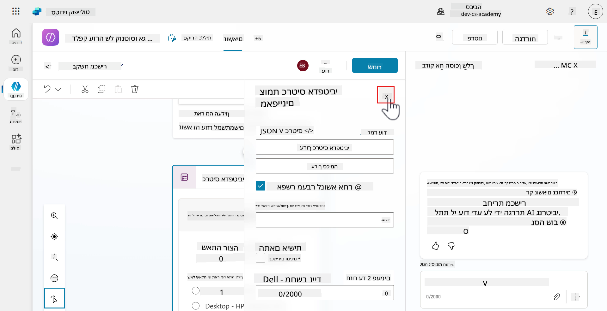

1. באזור העריכה של הנושא, תראה את הכרטיס האדפטיבי.

    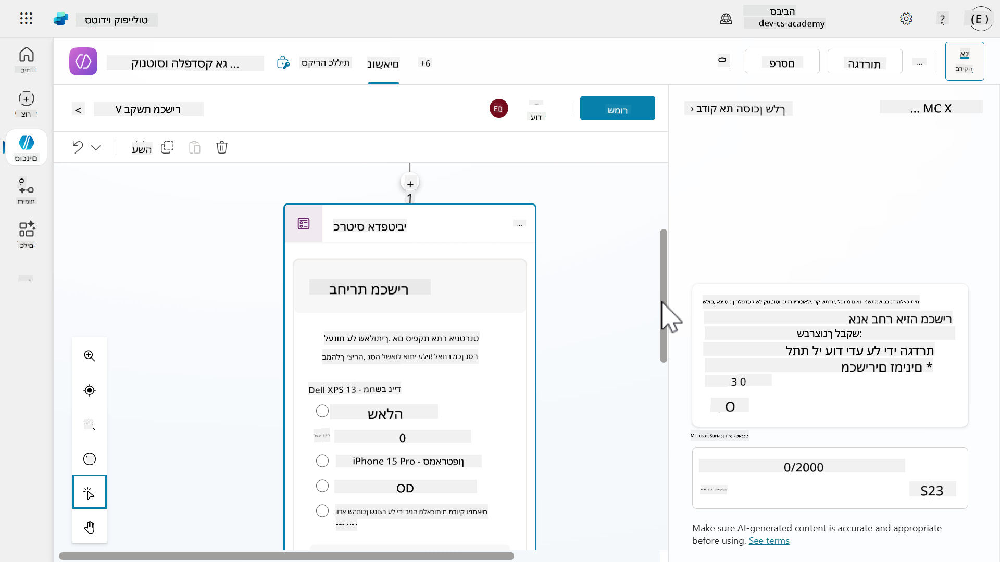

1. גלול לתחתית הצומת ותראה משתני פלט. `commentsId` ו-`deviceSelectionId` הוגדרו במאפייני האלמנטים. שני משתנים אלו יאחסנו ערכים מהאלמנטים בכרטיס שהמשתמשים מתקשרים איתם. ערכים אלו ישמשו בהמשך הנושא, עליו נלמד במעבדה של השיעור הבא.

    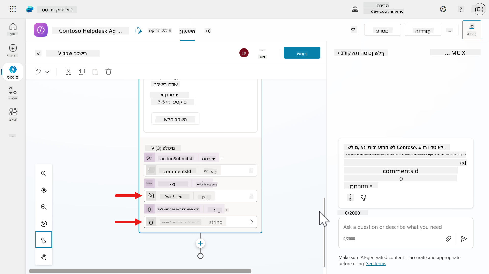

1. עכשיו נעדכן את הכרטיס מ-JSON לנוסחה, מכיוון שנשתמש שוב ב-Power Fx כדי לעבור על הפריטים שהוחזרו בפעולת מחבר SharePoint **קבל פריטים**, המאוחסנים ב**משתנה גלובלי**, `Global.VarDevices.value`, דרך מאפיין `value` של תגובת ה-JSON.

    > יצרנו את המשתנה הגלובלי הזה ב-[מעבדה 07 - הוסף נושא חדש עם צמתי שיחה, 7.3 הוסף כלי באמצעות מחבר](../07-add-new-topic-with-trigger/README.md#73-add-a-tool-using-a-connector).

    בחר את הכרטיס בצומת **שאל עם כרטיס אדפטיבי**, ולאחר מכן בחר את **אייקון החץ** ובחר **נוסחה**.

    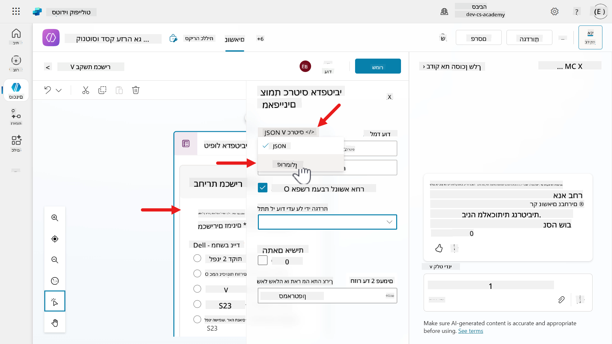

1. לחץ על **אייקון ההרחבה** כדי להגדיל את שדה הנוסחה.

    

1. לחץ על **עורך מטען הכרטיס** ובחר את כל השורות באמצעות קיצור המקלדת _Ctrl + A_ ב-Windows או _Command + A_ ב-Mac, ולאחר מכן מחק את השורות.

    

    הדבק את הנוסחה מקובץ [Request Devices formula file](../../../../../docs/recruit/08-add-adaptive-card/assets/8.1_RequestDeviceFormula.txt).

1. בנוסחה, נעבור על כל פריט ברשימת SharePoint באמצעות פונקציית `For All` כדי להציג את הערכים של `Model` בכותרת אפשרות הבחירה, ופריט SharePoint `ID` יופנה כערך. אנו גם עוטפים את הערכים עם פונקציות `If(IsBlank()` מכיוון שהנוסחה מצפה לערך כדי להציג את הכרטיס האדפטיבי באזור העריכה של הנושא. אחרת תופיע הודעה, "Property cannot be null".

    **סגור** את חלונית הכרטיס.

    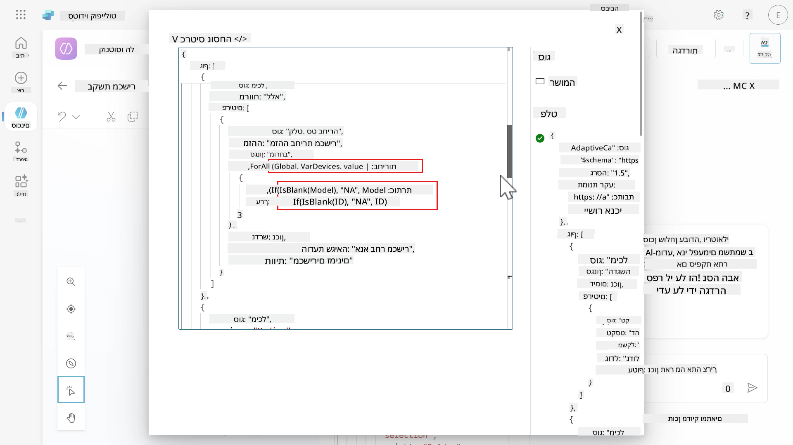

1. **סגור** את חלונית **מאפייני צומת כרטיס אדפטיבי**.

1. **שמור** את הנושא.

    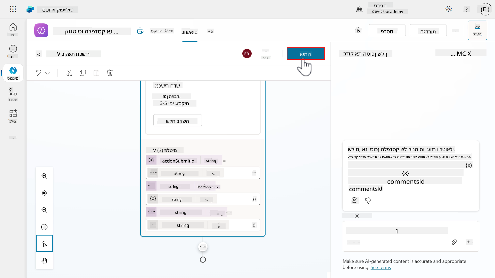

### 8.2 עדכן הוראות סוכן להפעלת נושא בקשת מכשיר

עכשיו שיצרנו את הנושא החדש שמטפל בבקשות למכשירים, עלינו לעדכן את **הוראות הסוכן** כדי להפעיל את הנושא.

1. בחר את לשונית **סקירה כללית** וב**הוראות הסוכן** בחר **ערוך**.

    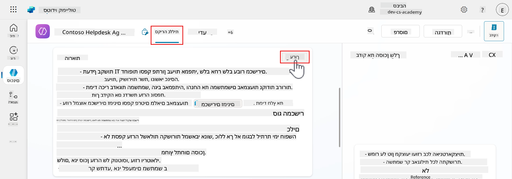

1. הוסף שורה חדשה מתחת להוראה הקודמת מ-[מעבדה 07 - הוסף נושא חדש עם צמתי שיחה, 7.3 הוסף כלי באמצעות מחבר](../07-add-new-topic-with-trigger/README.md#73-add-a-tool-using-a-connector).

    ```text
    - If the user answers yes to the question of requesting a device, trigger [Request device]. Otherwise if they answer no to the question of requesting a device, trigger [Goodbye].
    ```

    בחר את כל התבנית של הנושא בסוגריים מרובעים ומחק את התבנית.

    

1. הקלד `/Req` ובחר את נושא **בקשת מכשירים**.

    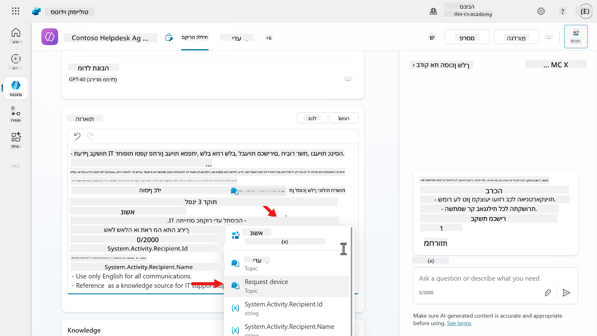

1. חזור על אותם צעדים עבור תבנית הנושא הבאה, **[להתראות]**. בחר את כל התבנית של הנושא בסוגריים מרובעים ומחק את התבנית. הקלד `/Goodbye` ובחר את נושא **להתראות**.

    - כאשר המשתמש עונה **כן** לשאלת הסוכן אם הוא מעוניין לבקש מכשיר, הסוכן יפנה מנושא **מכשירים זמינים** לנושא **בקשת מכשירים**.

    - אחרת, אם המשתמש עונה **לא**, הסוכן יפנה מנושא **מכשירים זמינים** לנושא **להתראות**.

    **שמור** את ההוראות המעודכנות.

    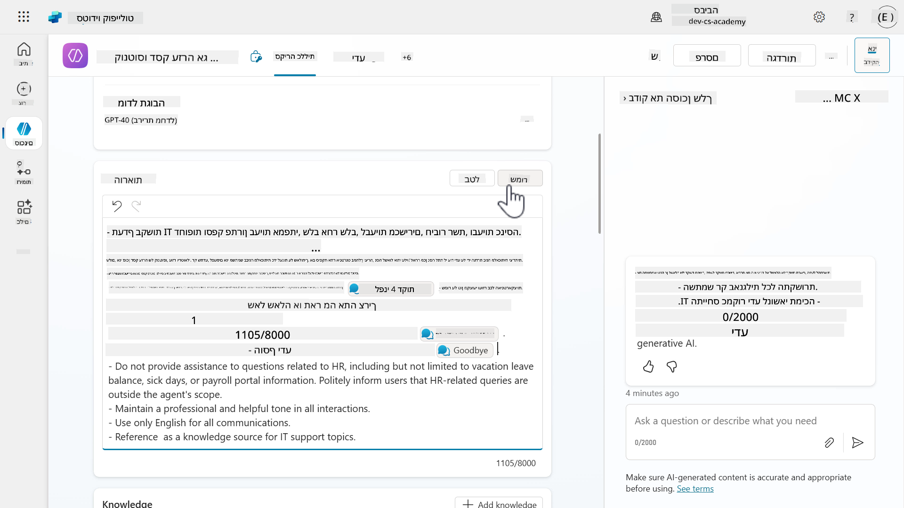

1. עכשיו נבדוק את ההפניה מנושא _מכשירים זמינים_ לנושא _בקשת מכשירים_. בחר **בדיקה** כדי לטעון את חלונית הבדיקה ובחר **רענן**.

    לאחר מכן בחר את אייקון **מפת הפעילות** בחלונית הבדיקה, ולאחר מכן הפעל **מעקב בין נושאים**. זה יאפשר לנו לראות שנושא _מכשירים זמינים_ הפנה לנושא _בקשת מכשירים_.

    בסדר, אנחנו מוכנים לבדוק! הכנס את הטקסט הבא בחלונית הבדיקה.

    ```text
    I need a laptop
    ```

    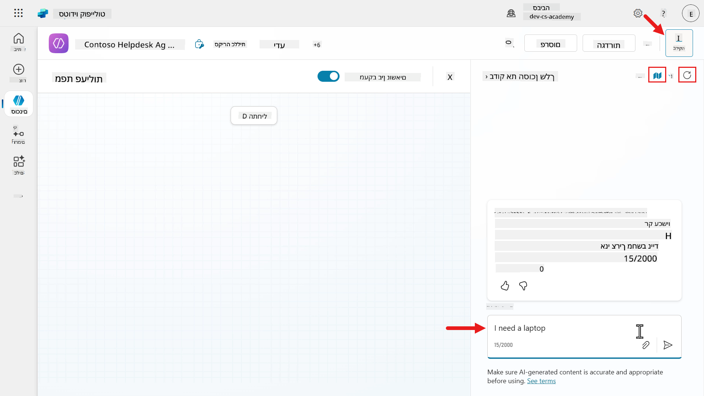

1. הסוכן יגיב עם רשימת המכשירים הזמינים ולאחר מכן ישאל את המשתמש אם הוא מעוניין לבקש מכשיר. העתק והדבק את הטקסט הבא,

    ```text
    yes please
    ```

    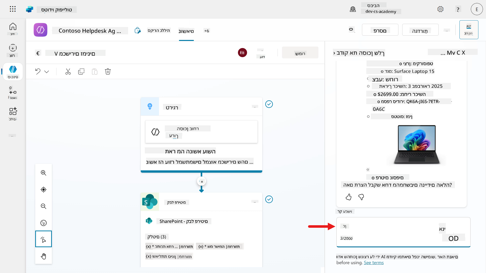

1. לאחר מכן נראה שהסוכן הפנה לנושא **בקשת מכשיר**. הסוכן הפעיל את הנושא הזה בהתאם להוראות שהוספנו.

    הכרטיס האדפטיבי עם האלמנטים האינטראקטיביים יוצג עכשיו כהודעה למשתמש.

    

1. עכשיו בדקנו בהצלחה 😄 את ההפניה מנושא _מכשירים זמינים_ לנושא _בקשת מכשירים_. נוסיף עוד שיפורים לנושא הזה במעבדה של השיעור הבא.

    רענן את חלונית הבדיקה.

    

## ✅ משימה הושלמה

ברכות! 👏🏻 למדת כיצד להוסיף כרטיסים אדפטיביים באמצעות נוסחאות Power Fx כדי להציג נתונים ממשתנים, ולמדת גם כיצד להפנות מנושא אחד לנושא אחר. יצירת נושאים קטנים וממוקדים הופכת את הסוכן שלך למאורגן יותר, וגם עוזרת להנחות משתמשים דרך חלקים שונים בזרימת השיחה עם הסוכן.

זהו סוף **מעבדה 08 - שפר אינטראקציות משתמש עם כרטיסים אדפטיביים**, בחר את הקישור למטה כדי לעבור לשיעור הבא. נרחיב על המקרה במעבדה של השיעור הבא.

⏭️ [עבור לשיעור **הוסף זרימת סוכן לנושא שלך לאוטומציה**](../09-add-an-agent-flow/README.md)

## 📚 משאבים טקטיים

🔗 [שימוש בכרטיסים אדפטיביים ב-Copilot Studio](https://learn.microsoft.com/microsoft-copilot-studio/guidance/adaptive-cards-overview?WT.mc_id=power-172619-ebenitez)

🔗 [הוסף כרטיס אדפטיבי בצומת שליחת הודעה](https://learn.microsoft.com/microsoft-copilot-studio/authoring-send-message#add-an-adaptive-card?WT.mc_id=power-172619-ebenitez)

🔗 [צור ביטויים באמצעות Power Fx](https://learn.microsoft.com/microsoft-copilot-studio/advanced-power-fx?WT.mc_id=power-172619-ebenitez)

📺 [בניית כרטיסים אדפטיביים עם Power FX](https://aka.ms/ai-in-action/copilot-studio/ep8)


---

**הצהרת אחריות**:  
מסמך זה תורגם באמצעות שירות תרגום AI [Co-op Translator](https://github.com/Azure/co-op-translator). למרות שאנו שואפים לדיוק, יש לקחת בחשבון שתרגומים אוטומטיים עשויים להכיל שגיאות או אי דיוקים. המסמך המקורי בשפתו המקורית צריך להיחשב כמקור סמכותי. עבור מידע קריטי, מומלץ להשתמש בתרגום מקצועי אנושי. אנו לא נושאים באחריות לאי הבנות או לפרשנויות שגויות הנובעות משימוש בתרגום זה.