<!--
CO_OP_TRANSLATOR_METADATA:
{
  "original_hash": "dcbcd9396b076da0a0f5d389e9ec1b12",
  "translation_date": "2025-10-17T17:12:46+00:00",
  "source_file": "docs/recruit/08-add-adaptive-card/README.md",
  "language_code": "id"
}
-->
# 🚨 Misi 08: Tingkatkan interaksi pengguna di Topik dengan Adaptive Cards

## 🕵️‍♂️ NAMA KODE: `OPERASI PENINGKATAN ANTARMUKA`

> **⏱️ Jangka Waktu Operasi:** `~45 menit`

🎥 **Tonton Panduan**

[](https://www.youtube.com/watch?v=RhIlzYHPCXo "Tonton panduan di YouTube")

## 🎯  Ringkasan Misi

Agen, misi Anda adalah menyusup ke pengalaman pengguna yang statis dan menggantinya dengan Adaptive Cards yang kaya, dinamis, dan dapat ditindaklanjuti. Anda akan menggunakan payload JSON dan rumus Power Fx untuk mengubah percakapan di Copilot Studio dari sekadar tanya jawab menjadi interaksi yang sepenuhnya interaktif. Tujuan Anda adalah mengumpulkan input pengguna, menyajikan data dengan indah, dan mengarahkan percakapan dengan presisi dan gaya. Gagal beradaptasi, dan pengguna Anda mungkin beralih ke antarmuka yang kurang cerdas.

## 🔎 Tujuan

Dalam misi ini, Anda akan belajar:

1. Memahami apa itu Adaptive Cards dan bagaimana mereka meningkatkan interaksi pengguna di Copilot Studio
1. Belajar membuat kartu interaktif menggunakan JSON dan rumus Power Fx untuk konten dinamis
1. Mengeksplorasi Adaptive Card Designer dan komponen utamanya untuk pembuatan kartu visual
1. Membuat formulir interaktif yang kaya dan pengalaman pengumpulan data dalam topik agen
1. Menerapkan praktik terbaik untuk merancang kartu adaptif yang responsif dan ramah pengguna

## 🤔 Apa itu Adaptive Card?

**Adaptive Card** adalah cara untuk membuat elemen UI interaktif dan kaya visual yang dapat disematkan dalam aplikasi seperti Microsoft Teams, Microsoft Outlook, atau agen. Ini adalah objek JSON terstruktur yang mendefinisikan tata letak dan konten kartu:

- Elemen apa yang muncul di kartu - teks, gambar, tombol
- Bagaimana elemen-elemen tersebut diatur
- Tindakan apa yang dapat dilakukan pengguna seperti mengirimkan formulir atau membuka tautan

    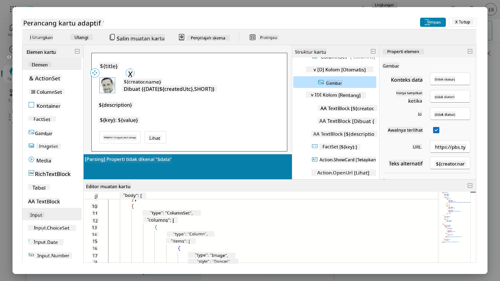

### Mengapa Adaptive Cards penting di Copilot Studio

Bayangkan Anda sedang membangun agen yang meminta nama, email, atau umpan balik dari pengguna. Jika Anda hanya menggunakan teks biasa, percakapan bisa terasa membosankan atau sulit diikuti. Di sinilah Adaptive Cards berperan!

1. **Membuat percakapan interaktif** - alih-alih mengirim teks sebagai pesan kepada pengguna, Anda dapat menampilkan tombol, formulir, gambar, dan lainnya.
    - Contoh: sebuah kartu dapat meminta pengguna untuk mengisi nama dan email mereka dalam formulir yang rapi.

1. **Tampil bagus di mana saja** - Adaptive Cards secara otomatis menyesuaikan gaya aplikasi tempat mereka berada, seperti obrolan Microsoft 365 Copilot atau Microsoft Teams. Anda tidak perlu khawatir tentang mode gelap, font, atau tata letak - semuanya menyesuaikan.

1. **Mudah dibuat dengan JSON** - Anda mendefinisikan kartu menggunakan kode JSON (anggap saja sebagai _resep_ untuk UI). Copilot Studio membantu Anda melihat pratinjau kartu sebelum menambahkannya ke topik.

1. **Mengumpulkan dan menggunakan data** - Anda dapat menggunakan kartu untuk mengajukan pertanyaan, mengumpulkan jawaban, dan menggunakan data tersebut dalam alur percakapan.
    - Contoh: Meminta nomor telepon pengguna, lalu menampilkan kartu konfirmasi dengan nomor telepon mereka.

1. **Meningkatkan pengalaman pengguna** - kartu membuat agen Anda terasa lebih interaktif. Ini adalah jenis antarmuka yang lebih bersih, dapat diklik, dan ramah pengguna.

## 🐱 Apakah _JSON_ itu orang?

Diucapkan sebagai "Jason," ini bukan orang 😅

JSON, atau dikenal sebagai _JavaScript Object Notation_ adalah format ringan yang digunakan untuk menyusun data. Mudah dibaca dan ditulis, dan terlihat seperti serangkaian pasangan kunci-nilai di dalam kurung kurawal {}.

Ini adalah salah satu opsi yang dapat digunakan saat menambahkan kartu adaptif ke topik Anda.

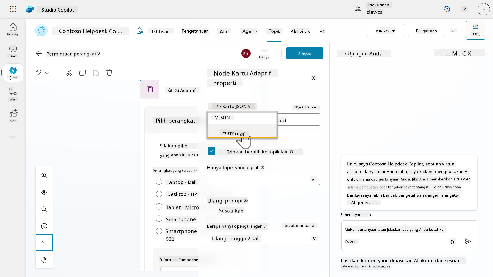

## 👀 Saya melihat opsi lain untuk membuat kartu adaptif menggunakan _formula_

Ingat bagaimana kita belajar tentang Power Fx di [Misi 07 - Menggunakan Power Fx di node Anda](../07-add-new-topic-with-trigger/README.md#what-power-fx-can-do-in-topics) Hal yang sama dapat diterapkan dalam Adaptive Cards di Copilot Studio.

Sebagai pengingat,

!!! note
    Power Fx adalah bahasa pemrograman low-code yang digunakan untuk menambahkan logika dan perilaku dinamis ke agen Anda. Ini adalah bahasa yang sama yang digunakan di Microsoft Power Apps, dan dirancang agar sederhana dan mirip dengan Excel, sehingga mudah dipahami oleh pengembang maupun non-pengembang.

### Cara kerja Power Fx dalam Adaptive Cards

Saat Anda merancang Adaptive Card di Copilot Studio, Anda dapat menggunakan rumus Power Fx untuk:

- Menyisipkan nilai secara dinamis seperti nama pengguna, tanggal, atau status.
- Memformat teks atau angka seperti menampilkan mata uang atau membulatkan angka.
- Menampilkan atau menyembunyikan elemen berdasarkan kondisi.
- Menyesuaikan respons berdasarkan input pengguna, variabel, keluaran dari node percakapan.

Sebagai contoh,

"`Hello`" & `System.User.DisplayName`

Formula ini menggabungkan kata "Hello" dengan nama pengguna secara dinamis.

### Mengapa ini berguna

1. **Personalisasi**

    Anda dapat menyesuaikan pesan untuk setiap pengguna, membuat interaksi terasa lebih alami dan relevan.

1. **Konten dinamis**

    Kartu dapat menampilkan data nyata dari variabel dan keluaran dari node percakapan.

1. **Logika pintar**

    Anda dapat mengontrol apa yang dilihat atau berinteraksi oleh pengguna berdasarkan kondisi, meningkatkan kegunaan dan mengurangi kesalahan.

1. **Ramah low-code**

    Power Fx adalah bahasa pemrograman low-code. Seperti yang disebutkan sebelumnya, ini mudah dibaca, intuitif, dan mirip dengan rumus Excel.

## 👷🏻‍♀️ Membangun dengan Adaptive Card Designer

**Adaptive Card Designer** adalah alat visual yang memungkinkan Anda membuat kartu pesan interaktif menggunakan elemen drag-and-drop seperti teks, gambar, tombol, dan input. Tujuannya adalah membantu Anda membuat pesan yang kaya dan dinamis tanpa menulis kode yang kompleks, sehingga lebih mudah merancang antarmuka yang ramah pengguna.

Alat desainer membantu Anda membangun kartu secara visual, tetapi di balik layar, ia menghasilkan objek JSON untuk Anda. Anda juga dapat beralih ke _formula_ yang memungkinkan ekspresi Power Fx digunakan dalam kartu untuk menampilkan data dari tempat lain.

## 🎨 Memahami Adaptive Card Designer


### A) Elemen Kartu

Ini adalah blok bangunan dari kartu adaptif Anda. Anda dapat menyeret dan melepaskan elemen seperti berikut:

- **TextBlock** untuk menampilkan teks.
- **Image** untuk menampilkan gambar.
- **FactSet** untuk pasangan kunci-nilai.
- **Input fields** untuk menampilkan kotak teks, pemilih tanggal, toggle.
- **Actions** untuk menampilkan tombol seperti _Submit_, _Open URL_, atau _Show Card_.

Setiap elemen memiliki tujuan sendiri dan dapat diatur atau dikonfigurasi.

### B) Penampil Kartu

Ini adalah area **Pratinjau** di mana Anda melihat bagaimana kartu Anda akan terlihat secara real-time. Saat Anda menambahkan atau mengedit elemen, penampil akan diperbarui secara instan untuk mencerminkan perubahan. Ini memungkinkan Anda membuat pembaruan iteratif dan melihat hasil desain secara bersamaan.

### C) Struktur Kartu

Ini menunjukkan **hierarki dan tata letak** kartu Anda. Sebagai contoh:

- Sebuah kartu mungkin dimulai dengan **TextBlock** untuk judul.
- Kemudian **ColumnSet** dengan gambar di satu sisi dan teks di sisi lain.
- Diikuti oleh **FactSet** dan beberapa **Tombol Tindakan**.

Ini membantu Anda memahami bagaimana elemen-elemen tersebut bersarang dan diatur.

### D) Properti Elemen

Saat Anda mengklik elemen apa pun di kartu, panel ini memungkinkan Anda **menyesuaikan pengaturannya**:

- Mengubah ukuran teks, berat, atau warna.
- Menetapkan URL gambar atau teks alternatif.
- Mengonfigurasi opsi input seperti teks placeholder atau nilai default.

Di sinilah Anda menyempurnakan setiap elemen.

### E) Editor Payload Kartu

Ini adalah kode JSON mentah di balik kartu Anda. Pengguna tingkat lanjut dapat mengedit ini secara langsung untuk:

- Menggunakan fitur templating.
- Menyalin/menempelkan definisi kartu.

Bahkan jika Anda baru mengenal desainer kartu adaptif, ini berguna untuk melihat bagaimana desain visual diterjemahkan menjadi kode.

!!! tip "Tip - Lihat contoh Adaptive Card"

    1. Jelajahi [https://adaptivecards.microsoft.com/designer](https://adaptivecards.microsoft.com/designer).
    2. Pilih **Kartu Baru** untuk melihat daftar contoh yang dapat Anda pilih dan modifikasi.
    3. Perhatikan bahwa desainer ini bersifat eksternal (berbasis web). Saat Anda membuat kartu di Adaptive Card Designer berbasis web, salin JSON dari Editor Payload Kartu.
    4. Tempel JSON ke kartu adaptif Anda di agen Anda di Copilot Studio.

    

## 🌵 Kasus penggunaan umum

Berikut adalah kasus penggunaan umum untuk Adaptive Cards di Copilot Studio saat digunakan di node **Kirim pesan** atau **Ajukan pertanyaan**.

1. **Formulir dan pengumpulan data**

    Gunakan kartu adaptif untuk mengumpulkan input terstruktur dari pengguna, seperti:

    - Permintaan cuti
    - Formulir umpan balik
    - Informasi kontak
    - Penjadwalan janji temu

1. **Menampilkan informasi dinamis**

    Menampilkan data yang dipersonalisasi atau real-time kepada pengguna dalam format yang bersih dan mudah dibaca dari sumber perusahaan seperti ServiceNow, SAP, Dynamics 365, SharePoint, dll.

    - Ringkasan pesanan
    - Saldo akun
    - Status tiket atau kasus
    - Acara atau tenggat waktu yang akan datang

1. **Pilihan interaktif**

    Biarkan pengguna membuat pilihan langsung dalam percakapan:

    - Memilih dari daftar opsi, misalnya kategori produk, topik dukungan.
    - Mengonfirmasi atau membatalkan tindakan.
    - Memberi peringkat layanan atau pengalaman.

1. **Memicu tindakan**

    Sertakan tombol yang memicu langkah lebih lanjut dalam percakapan secara internal atau eksternal.

    - "Kirim permintaan"
    - "Lihat detail"

## ⭐ Praktik terbaik

Berikut adalah beberapa praktik terbaik untuk membuat Adaptive Cards untuk agen di Copilot Studio.

1. **Sederhana dan fokus**

    - Rancang kartu dengan tujuan yang jelas, jangan membebani mereka dengan terlalu banyak elemen.
    - Gunakan teks yang ringkas dan tata letak yang intuitif untuk memandu pengguna melalui interaksi.

1. **Berhati-hati dengan input**

    - Sertakan hanya elemen input yang diperlukan seperti teks, pilihan tanggal, untuk menghindari membebani pengguna.
    - Gunakan label untuk membuat input mudah dipahami.

1. **Struktur untuk keterbacaan**

    - Gunakan **TextBlocks** untuk judul dan instruksi.
    - Kelompokkan elemen terkait menggunakan **Containers** atau **ColumnSets** untuk meningkatkan alur visual.

1. **Buat elemen Tindakan jelas**

    - Gunakan **Action.Submit** dan atau **Action.OpenUrl** dengan judul tombol yang jelas seperti "Kirim Permintaan" atau "Lihat Detail"
    - Hindari label yang tidak jelas seperti "Klik di sini"

1. **Rancang untuk adaptabilitas**

    - Asumsikan kartu dapat dilihat di berbagai ukuran layar.
    - Hindari lebar tetap dan gunakan tata letak fleksibel seperti **ColumnSets** untuk responsivitas.

1. **Gunakan konten dinamis jika memungkinkan**

    - Hubungkan elemen kartu ke variabel atau keluaran dari node menggunakan Power Fx untuk mempersonalisasi pengalaman pengguna.
    - Misalnya, tampilkan nama pengguna atau status saat ini secara dinamis.

## 🧪 Lab 08 - Tambahkan kartu adaptif dan tingkatkan kemampuan topik

Sekarang kita akan belajar bagaimana meningkatkan topik kita dengan kartu adaptif dan menggunakan fungsionalitas lanjutan dari topik dan node.

- [8.1 Buat topik baru dengan kartu adaptif untuk pengguna mengirimkan permintaan mereka](../../../../../docs/recruit/08-add-adaptive-card)
- [8.2 Perbarui instruksi agen untuk memanggil topik Permintaan perangkat](../../../../../docs/recruit/08-add-adaptive-card)

### ✨ Kasus penggunaan

**Sebagai** karyawan

**Saya ingin** meminta perangkat

**Agar saya** dapat meminta perangkat dari daftar perangkat yang tersedia

Mari kita mulai!

### Prasyarat

1. **Daftar SharePoint**

    Kita akan menggunakan daftar **Devices** di SharePoint dari [Pelajaran 00 - Pengaturan Kursus - Langkah 3: Buat situs SharePoint baru](../00-course-setup/README.md#step-4-create-new-sharepoint-site).

    Jika Anda belum membuat daftar **Devices** di SharePoint, silakan kembali ke [Pelajaran 00 - Pengaturan Kursus - Langkah 3: Buat situs SharePoint baru](../00-course-setup/README.md#step-4-create-new-sharepoint-site).

1. **Contoso Helpdesk Copilot**

    Kita akan menggunakan agen yang sama yang dibuat sebelumnya di [Pelajaran 06 - Buat agen khusus menggunakan bahasa alami dengan Copilot dan menghubungkannya dengan data Anda](../06-create-agent-from-conversation/README.md).

### 8.1 Buat topik baru dengan kartu adaptif untuk pengguna mengirimkan permintaan mereka

Kita akan membuat topik baru yang akan menangani permintaan perangkat pengguna. Topik baru ini akan berisi node **Tanya dengan kartu adaptif** untuk memungkinkan interaksi pengguna dengan agen.

Mari kita mulai!

1. Pilih tab **Topik**, lalu pilih **+ Tambahkan topik dari kosong**.

    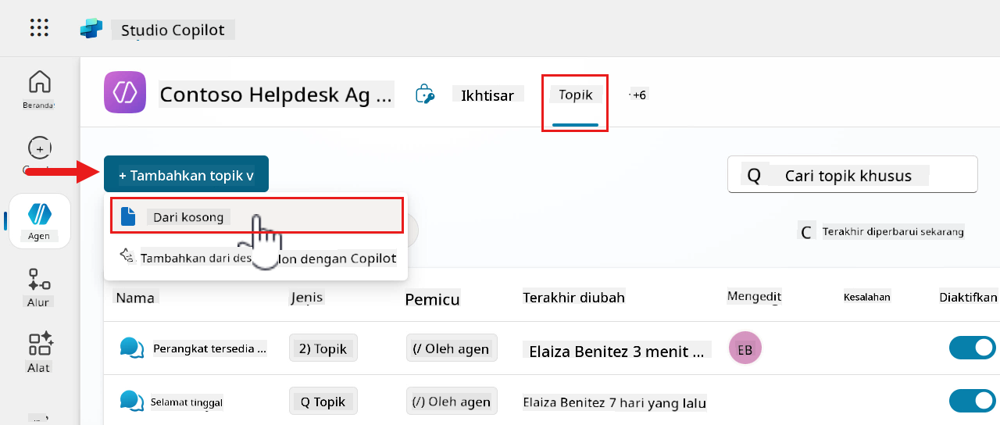

1. Beri nama topik sebagai berikut,

    ```text
    Request device
    ```

    Masukkan deskripsi berikut sebagai pemicu.

    ```text
    This topic helps users request a device when they answer yes to the question that asks the user if they would like to request one of these devices.
    ```

    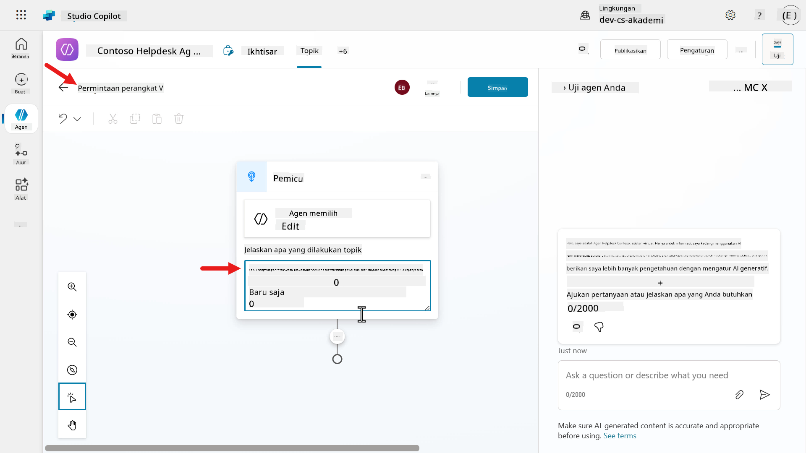
1. Selanjutnya, tambahkan node **Ask with adaptive card**. Node ini akan menampilkan kartu interaktif kepada pengguna untuk memilih perangkat yang ingin mereka minta.

    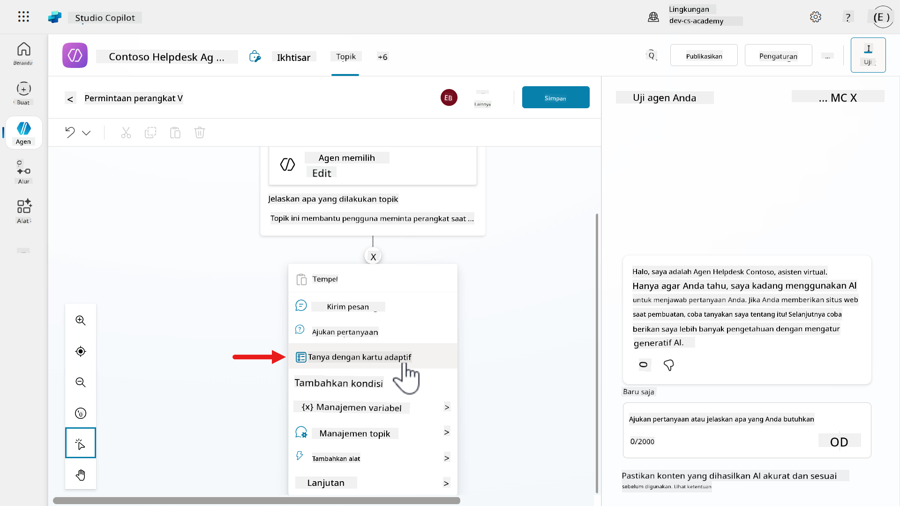

1. Pilih node tersebut dan panel **Adaptive Card Node properties** akan muncul. Sekarang kita akan mengedit JSON. Pilih **Edit adaptive card**. Pilih **Edit adaptive card**.

    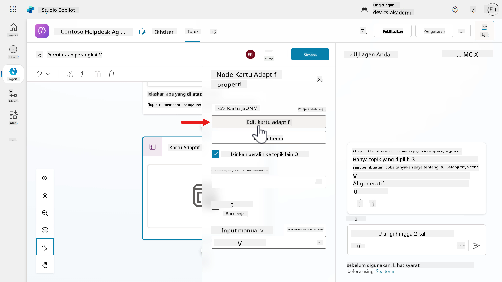

1. Ini adalah **Adaptive Card Designer** di mana Anda dapat merancang kartu dan melihat desain kartu secara langsung.

    Cobalah menyeret dan melepaskan elemen kartu **TextBlock** dan **FactSet** ke kanvas penulisan, area tampilan kartu. Perhatikan bagaimana struktur kartu dan editor payload kartu diperbarui saat dua elemen kartu ditambahkan. Anda dapat langsung memperbarui editor payload kartu dan panel properti elemen.

    

1. Pilih **Preview** untuk melihat kartu dalam berbagai lebar.

    

1. Pratinjau akan dimuat di mana Anda akan melihat output kartu dalam berbagai lebar.

    

1. Keluar dari **Preview** dengan memilih ikon **x** dan pilih **Undo** di desainer untuk menghapus dua elemen kartu yang sebelumnya ditambahkan.

    

1. Klik pada **Card payload editor** dan pilih semua baris menggunakan pintasan keyboard Windows _Ctrl + A_ atau pintasan keyboard Mac _Command + A_, lalu hapus baris tersebut. **Tempelkan** JSON dari [Request devices .JSON file](../../../../../docs/recruit/08-add-adaptive-card/assets/8.1_RequestDevice.json).

    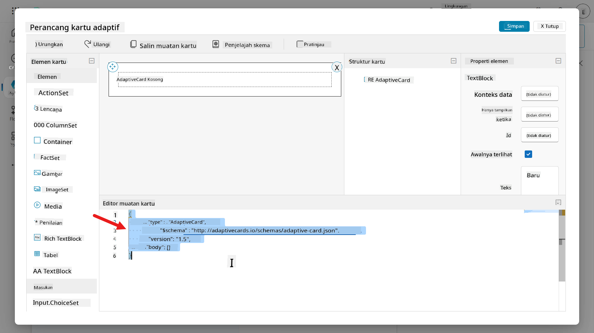

1. Perhatikan bagaimana **Card Preview** sekarang mencakup elemen yang menampilkan beberapa teks dan daftar perangkat yang tersedia.

    JSON ini saat ini adalah placeholder dan pratinjau untuk apa yang akan kita gunakan sebagai dasar untuk kartu kita tetapi dalam bentuk formula daripada JSON karena kita akan merujuk pada **global variable**, `Global.VarDevices.value`, yang menyimpan respons dari tindakan konektor SharePoint **Get items**.

    Pilih **Save** dan pilih **Close** untuk keluar dari modal desainer Adaptive card.

    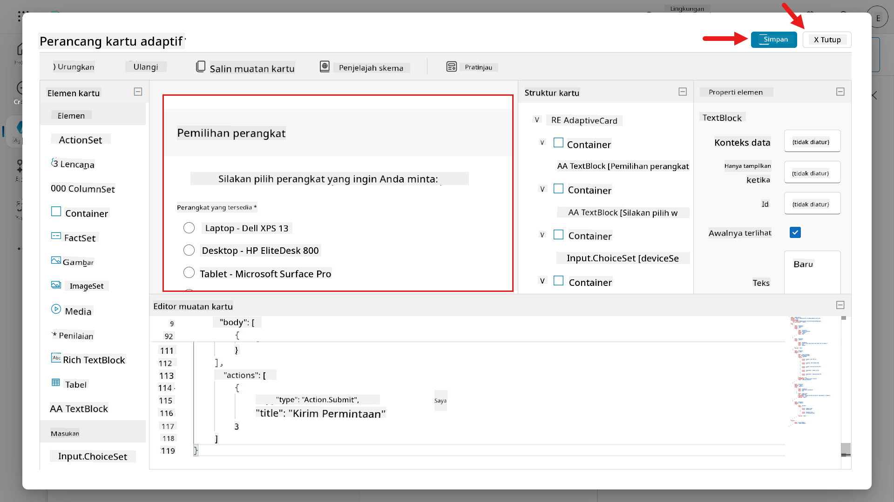

1. Tutup panel **Adaptive Card Node properties** dengan memilih ikon **X**.

    

1. Di kanvas penulisan topik, Anda akan melihat kartu adaptif.

    

1. Gulir ke bagian bawah node dan Anda akan melihat variabel output. `commentsId` dan `deviceSelectionId` didefinisikan dalam properti elemen. Kedua variabel ini akan menyimpan nilai dari elemen kartu yang berinteraksi dengan pengguna. Nilai-nilai ini akan digunakan di bagian selanjutnya dalam topik, yang akan kita pelajari di lab pelajaran berikutnya.

    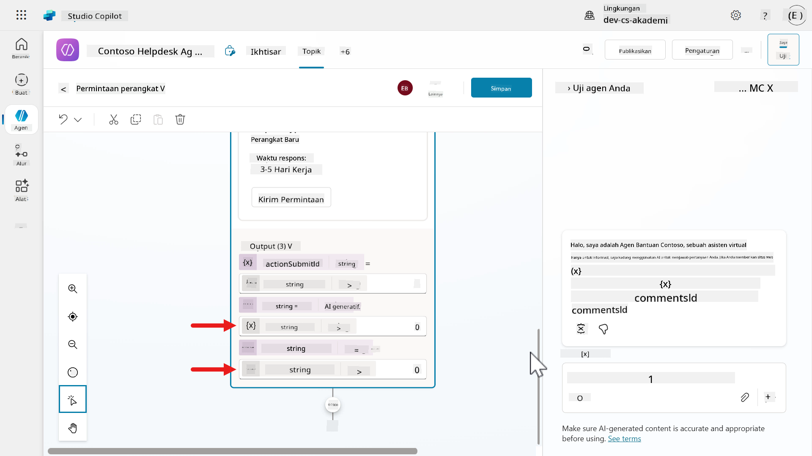

1. Selanjutnya, mari kita perbarui kartu dari JSON ke formula karena kita akan menggunakan Power Fx lagi untuk melakukan loop melalui item yang dikembalikan dalam tindakan konektor SharePoint **Get items**, yang disimpan dalam **global variable**, `Global.VarDevices.value`, melalui properti `value` dari respons JSON.

    > Kami membuat variabel global ini di [Lab 07 - Tambahkan topik baru dengan node percakapan, 7.3 Tambahkan alat menggunakan konektor](../07-add-new-topic-with-trigger/README.md#73-add-a-tool-using-a-connector).

    Pilih kartu di node **Ask with Adaptive Card**, lalu pilih ikon **chevron** dan pilih **Formula**.

    

1. Klik ikon **expand** untuk memperbesar bidang Formula.

    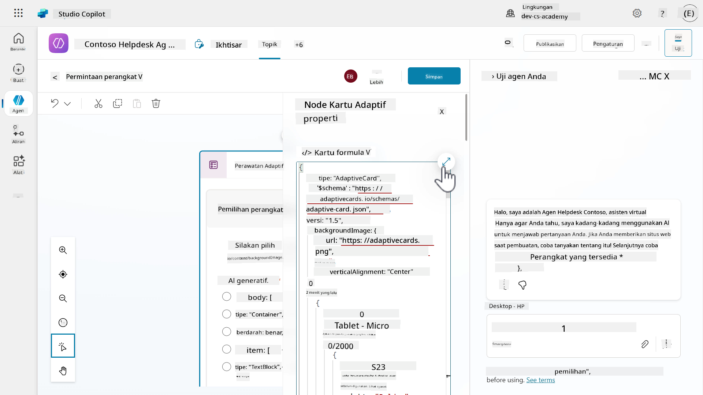

1. Klik pada **Card payload editor** dan pilih semua baris menggunakan pintasan keyboard Windows _Ctrl + A_ atau pintasan keyboard Mac _Command + A_, lalu hapus baris tersebut.

    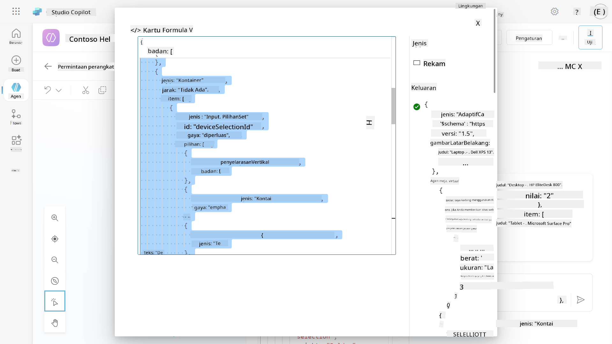

    Tempelkan Formula dari [Request Devices formula file](../../../../../docs/recruit/08-add-adaptive-card/assets/8.1_RequestDeviceFormula.txt).

1. Dalam formula, kita akan melakukan loop melalui setiap item daftar SharePoint menggunakan fungsi `For All` untuk menampilkan nilai `Model` di judul opsi pilihan, dan item SharePoint `ID` dirujuk sebagai nilai. Kita juga membungkus nilai-nilai dengan fungsi `If(IsBlank()` karena formula mengharapkan nilai untuk merender kartu adaptif di kanvas penulisan topik. Jika tidak, Anda akan melihat pesan muncul, "Property cannot be null."

    **Tutup** modal kartu.

    

1. **Tutup** panel **Adaptive Card Node properties**.

1. **Simpan** topik.

    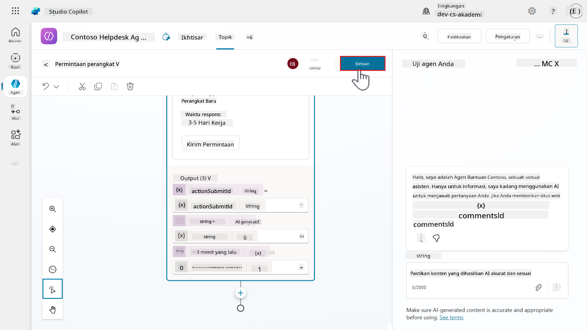

### 8.2 Perbarui instruksi agen untuk memanggil topik Request device

Sekarang kita telah membuat topik baru yang menangani permintaan perangkat, kita perlu memperbarui **instruksi agen** untuk memanggil topik tersebut.

1. Pilih tab **Overview** dan di **instruksi agen** pilih **Edit**.

    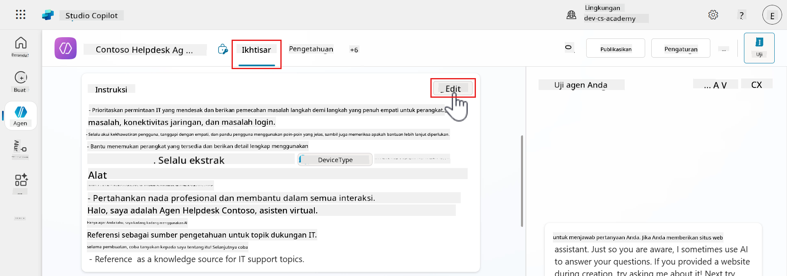

1. Tambahkan baris baru di bawah instruksi sebelumnya dari [Lab 07 - Tambahkan topik baru dengan node percakapan, 7.3 Tambahkan alat menggunakan konektor](../07-add-new-topic-with-trigger/README.md#73-add-a-tool-using-a-connector).

    ```text
    - If the user answers yes to the question of requesting a device, trigger [Request device]. Otherwise if they answer no to the question of requesting a device, trigger [Goodbye].
    ```

    Pilih placeholder topik seluruhnya dalam tanda kurung persegi dan hapus placeholder tersebut.

    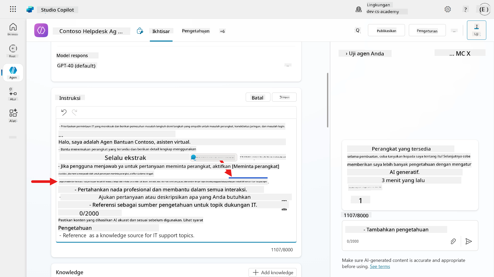

1. Ketikkan `/Req` dan pilih topik **Request devices**.

    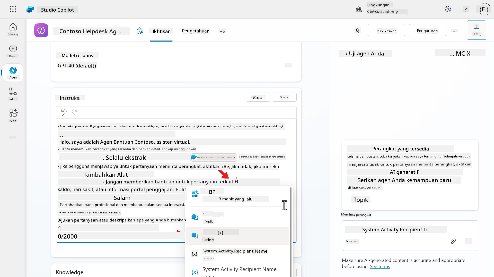

1. Ulangi langkah yang sama untuk placeholder topik berikutnya, **[Goodbye]**. Pilih placeholder topik seluruhnya dalam tanda kurung persegi dan hapus placeholder tersebut. Ketikkan `/Goodbye` dan pilih topik **Goodbye**.

    - Ketika pengguna menjawab **Yes** saat agen bertanya apakah mereka ingin meminta perangkat, agen akan mengarahkan dari topik **Available devices** ke topik **Request devices**.

    - Jika pengguna menjawab **No**, agen akan mengarahkan dari topik **Available devices** ke topik **Goodbye**.

    **Simpan** instruksi yang diperbarui.

    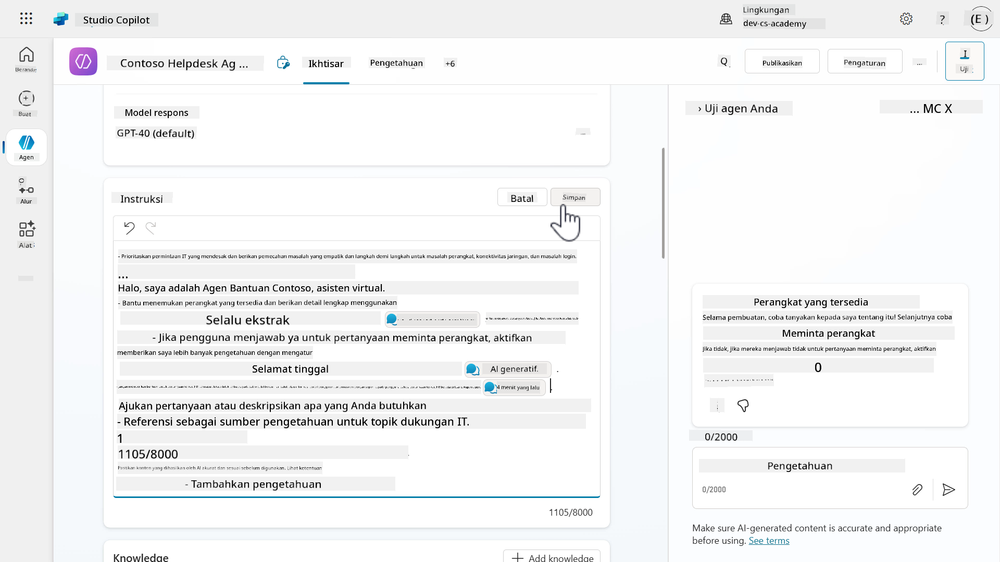

1. Sekarang mari kita uji pengalihan dari topik _Available devices_ ke topik _Request devices_. Pilih **Test** untuk memuat panel pengujian, lalu pilih **Refresh**.

    Kemudian pilih ikon **Activity map** di panel pengujian, diikuti dengan mengaktifkan **Track between topics**. Ini akan memungkinkan kita melihat topik _Available devices_ telah dialihkan ke topik _Request devices_.

    OK, kita siap untuk menguji! Masukkan teks berikut di panel pengujian.

    ```text
    I need a laptop
    ```

    

1. Agen akan merespons dengan daftar perangkat yang tersedia diikuti dengan pertanyaan apakah pengguna ingin meminta perangkat. Salin dan tempel teks berikut,

    ```text
    yes please
    ```

    

1. Selanjutnya kita akan melihat bahwa agen telah dialihkan ke topik **Request device**. Agen memanggil topik ini sesuai dengan instruksi yang telah kita tambahkan.

    Kartu adaptif dengan elemen interaktif sekarang akan ditampilkan sebagai pesan kepada pengguna.

    

1. Kita telah berhasil menguji 😄 pengalihan topik _Available devices_ ke topik _Request devices_. Kita akan menambahkan lebih banyak peningkatan pada topik ini di lab pelajaran berikutnya.

    Segarkan panel pengujian.

    

## ✅ Misi Selesai

Selamat! 👏🏻 Anda telah belajar cara menambahkan kartu adaptif menggunakan formula Power Fx untuk menampilkan data dari variabel, dan Anda juga belajar cara mengalihkan dari satu topik ke topik lainnya. Membuat topik kecil membuat agen Anda lebih terorganisir, tetapi juga membantu membimbing pengguna melalui berbagai bagian alur percakapan dengan agen.

Ini adalah akhir dari **Lab 08 - Tingkatkan interaksi pengguna dengan Adaptive Cards**, pilih tautan di bawah untuk melanjutkan ke pelajaran berikutnya. Kita akan memperluas kasus penggunaan di lab ini dalam lab pelajaran berikutnya.

⏭️ [Lanjut ke pelajaran **Tambahkan alur agen ke Topik Anda untuk otomatisasi**](../09-add-an-agent-flow/README.md)

## 📚 Sumber Daya Taktis

🔗 [Menggunakan Adaptive Cards di Copilot Studio](https://learn.microsoft.com/microsoft-copilot-studio/guidance/adaptive-cards-overview?WT.mc_id=power-172619-ebenitez)

🔗 [Tambahkan kartu adaptif di node Kirim pesan](https://learn.microsoft.com/microsoft-copilot-studio/authoring-send-message#add-an-adaptive-card?WT.mc_id=power-172619-ebenitez)

🔗 [Buat ekspresi menggunakan Power Fx](https://learn.microsoft.com/microsoft-copilot-studio/advanced-power-fx?WT.mc_id=power-172619-ebenitez)

📺 [Membangun Adaptive Cards dengan Power FX](https://aka.ms/ai-in-action/copilot-studio/ep8)

<!-- markdownlint-disable-next-line MD033 -->


---

**Penafian**:  
Dokumen ini telah diterjemahkan menggunakan layanan penerjemahan AI [Co-op Translator](https://github.com/Azure/co-op-translator). Meskipun kami berusaha untuk memberikan hasil yang akurat, harap diketahui bahwa terjemahan otomatis dapat mengandung kesalahan atau ketidakakuratan. Dokumen asli dalam bahasa aslinya harus dianggap sebagai sumber yang otoritatif. Untuk informasi yang penting, disarankan menggunakan jasa penerjemahan manusia profesional. Kami tidak bertanggung jawab atas kesalahpahaman atau penafsiran yang timbul dari penggunaan terjemahan ini.