<!--
CO_OP_TRANSLATOR_METADATA:
{
  "original_hash": "dcbcd9396b076da0a0f5d389e9ec1b12",
  "translation_date": "2025-10-17T01:31:55+00:00",
  "source_file": "docs/recruit/08-add-adaptive-card/README.md",
  "language_code": "nl"
}
-->
# 🚨 Missie 08: Verbeter gebruikersinteracties in Topics met Adaptive Cards

## 🕵️‍♂️ CODENAAM: `OPERATIE INTERFACE UPLIFT`

> **⏱️ Operatietijdvenster:** `~45 minuten`

🎥 **Bekijk de walkthrough**

[](https://www.youtube.com/watch?v=RhIlzYHPCXo "Bekijk de walkthrough op YouTube")

## 🎯 Missiebriefing

Agenten, jullie missie is om de statische gebruikerservaring te infiltreren en te vervangen door rijke, dynamische en actiegerichte Adaptive Cards. Jullie zullen JSON-payloads en Power Fx-formules inzetten om gesprekken in Copilot Studio te transformeren van eenvoudige vraag-en-antwoord naar volledig interactieve interacties. Het doel is om gebruikersinput te verzamelen, gegevens op een aantrekkelijke manier te presenteren en gesprekken met precisie en stijl te sturen. Als je je niet aanpast, kunnen je gebruikers overstappen naar minder intelligente interfaces.

## 🔎 Doelstellingen

In deze missie leer je:

1. Begrijpen wat Adaptive Cards zijn en hoe ze gebruikersinteracties in Copilot Studio verbeteren.
1. Leren interactieve kaarten te bouwen met JSON en Power Fx-formules voor dynamische inhoud.
1. Verkennen van de Adaptive Card Designer en de belangrijkste componenten voor visuele kaartcreatie.
1. Rijke, interactieve formulieren en gegevensverzamelingservaringen binnen agent topics creëren.
1. Beste praktijken implementeren voor het ontwerpen van responsieve en gebruiksvriendelijke adaptive cards.

## 🤔 Wat is een Adaptive Card?

Een **Adaptive Card** is een manier om interactieve, visueel rijke UI-elementen te maken die kunnen worden ingebed in apps zoals Microsoft Teams, Microsoft Outlook of agents. Het is een gestructureerd JSON-object dat de lay-out en inhoud van een kaart definieert:

- Welke elementen op de kaart verschijnen - tekst, afbeeldingen, knoppen.
- Hoe die elementen worden gerangschikt.
- Welke acties gebruikers kunnen ondernemen, zoals het indienen van een formulier of het openen van een link.

    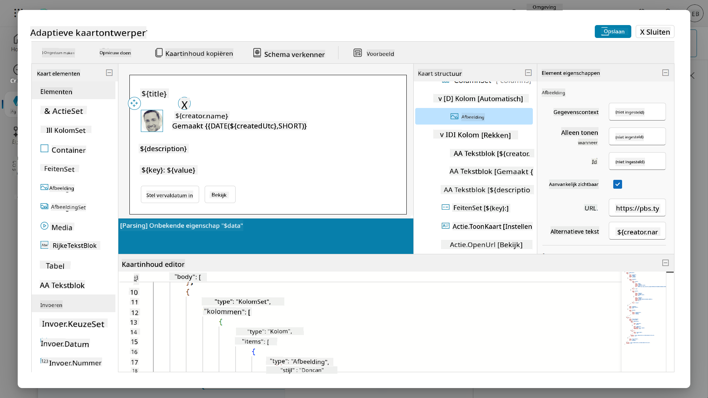

### Waarom Adaptive Cards belangrijk zijn in Copilot Studio

Stel je voor dat je een agent bouwt die gebruikers vraagt om hun naam, e-mailadres of feedback. Als je alleen gewone tekst gebruikt, kan het gesprek saai of moeilijk te volgen zijn. Daar komen Adaptive Cards van pas!

1. **Maakt gesprekken interactief** - in plaats van tekst als berichten naar de gebruiker te sturen, kun je knoppen, formulieren, afbeeldingen en meer tonen.
    - Voorbeeld: een kaart kan de gebruiker vragen om zijn naam en e-mailadres in te vullen in een overzichtelijk formulier.

1. **Ziet er overal goed uit** - Adaptive Cards passen zich automatisch aan de stijl van de app waarin ze zich bevinden, zoals Microsoft 365 Copilot chat of Microsoft Teams. Je hoeft je geen zorgen te maken over donkere modus, lettertypen of lay-outs - het past zich aan.

1. **Eenvoudig te bouwen met JSON** - je definieert de kaart met behulp van JSON-code (denk aan een _recept_ voor de UI). Copilot Studio helpt je om je kaart te bekijken voordat je deze aan het topic toevoegt.

1. **Gegevens verzamelen en gebruiken** - je kunt de kaart gebruiken om vragen te stellen, antwoorden te verzamelen en die gegevens te gebruiken in de gespreksstroom.
    - Voorbeeld: Vraag om het telefoonnummer van een gebruiker en toon vervolgens een bevestigingskaart met hun telefoonnummer.

1. **Verbeter de gebruikerservaring** - kaarten maken je agent interactiever. Het is een schoner, klikbaar en gebruiksvriendelijker type interface.

## 🐱 Is _JSON_ een persoon?

Uitgesproken als "Jason," is het geen persoon 😅

JSON, ook wel bekend als _JavaScript Object Notation_, is een lichtgewicht formaat dat wordt gebruikt om gegevens te structureren. Het is gemakkelijk te lezen en te schrijven en ziet eruit als een reeks sleutel-waardeparen binnen accolades {}.

Dit is een van de opties die je kunt gebruiken bij het toevoegen van een adaptive card aan je topic.

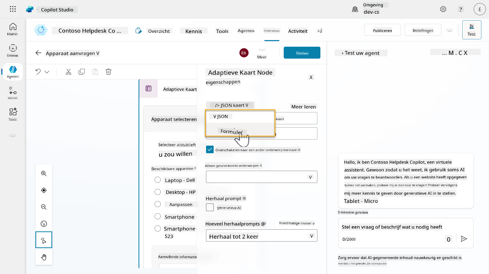

## 👀 Ik zie een andere optie om een adaptive card te bouwen met _formule_

Herinner je je nog hoe we leerden over Power Fx in [Missie 07 - Power Fx gebruiken in je nodes](../07-add-new-topic-with-trigger/README.md#what-power-fx-can-do-in-topics)? Hetzelfde kan worden toegepast in Adaptive Cards binnen Copilot Studio.

Als samenvatting:

!!! note
    Power Fx is een low-code programmeertaal die wordt gebruikt om logica en dynamisch gedrag toe te voegen aan je agent. Het is dezelfde taal die wordt gebruikt in Microsoft Power Apps en is ontworpen om eenvoudig en Excel-achtig te zijn, waardoor het gemakkelijk is voor ontwikkelaars en niet-ontwikkelaars.

### Hoe Power Fx werkt in Adaptive Cards

Wanneer je een Adaptive Card ontwerpt in Copilot Studio, kun je Power Fx-formules gebruiken om:

- Dynamisch waarden in te voegen zoals gebruikersnamen, datums of status.
- Tekst of cijfers opmaken, zoals valuta weergeven of cijfers afronden.
- Elementen tonen of verbergen op basis van voorwaarden.
- Reacties aanpassen op basis van gebruikersinput, variabelen, outputs van gespreksnodes.

Bijvoorbeeld:

"`Hallo`" & `System.User.DisplayName`

Deze formule combineert het woord "Hallo" met de naam van de gebruiker dynamisch.

### Waarom het nuttig is

1. **Personalisatie**

    Je kunt berichten afstemmen op elke gebruiker, waardoor interacties natuurlijker en relevanter aanvoelen.

1. **Dynamische inhoud**

    Kaarten kunnen echte gegevens weergeven uit variabelen en outputs van gespreksnodes.

1. **Slimme logica**

    Je kunt bepalen wat gebruikers zien of mee interageren op basis van voorwaarden, wat de bruikbaarheid verbetert en fouten vermindert.

1. **Low-code vriendelijk**

    Power Fx is een low-code programmeertaal. Zoals eerder vermeld, is het leesbaar, intuïtief en vergelijkbaar met Excel-formules.

## 👷🏻‍♀️ Bouwen met de Adaptive Card Designer

De **Adaptive Card Designer** is een visuele tool waarmee je interactieve berichtkaarten kunt bouwen met behulp van drag-and-drop-elementen zoals tekst, afbeeldingen, knoppen en invoervelden. Het doel is om rijke, dynamische berichten te creëren zonder complexe code te schrijven, waardoor het gemakkelijker wordt om gebruiksvriendelijke interfaces te ontwerpen.

De ontwerptool helpt je de kaart visueel te bouwen, maar achter de schermen genereert het de JSON-objecten voor je. Je kunt ook overschakelen naar _formule_, waarmee Power Fx-uitdrukkingen in de kaart kunnen worden gebruikt om gegevens van elders weer te geven.

## 🎨 Begrijpen van de Adaptive Card Designer

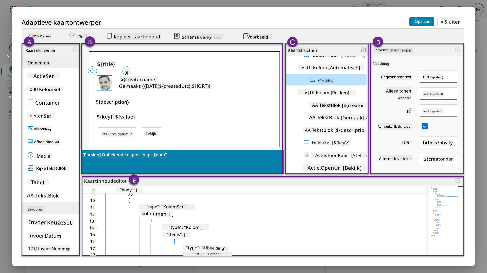

### A) Kaartelementen

Dit zijn de bouwstenen van je adaptive card. Je kunt elementen zoals de volgende slepen en neerzetten:

- **TextBlock** om tekst weer te geven.
- **Image** om afbeeldingen te tonen.
- **FactSet** voor sleutel-waardeparen.
- **Invoervelden** om tekstvakken, datumkiezers, schakelaars weer te geven.
- **Acties** om knoppen weer te geven zoals _Submit_, _Open URL_, of _Show Card_.

Elk element heeft zijn eigen doel en kan worden gestileerd of geconfigureerd.

### B) Kaartweergave

Dit is het **Voorbeeld**-gebied waar je kunt zien hoe je kaart er in realtime uitziet. Terwijl je elementen toevoegt of bewerkt, werkt de weergave onmiddellijk bij om wijzigingen weer te geven. Dit stelt je in staat om iteratieve updates te maken en tegelijkertijd het ontwerpresultaat te zien.

### C) Kaartstructuur

Dit toont de **hiërarchie en lay-out** van je kaart. Bijvoorbeeld:

- Een kaart kan beginnen met een **TextBlock** voor de titel.
- Vervolgens een **ColumnSet** met een afbeelding aan de ene kant en tekst aan de andere kant.
- Gevolgd door een **FactSet** en enkele **Actieknoppen**.

Het helpt je te begrijpen hoe elementen zijn genest en georganiseerd.

### D) Elementeigenschappen

Wanneer je op een element in de kaart klikt, kun je in dit paneel de **instellingen aanpassen**:

- Tekstgrootte, gewicht of kleur wijzigen.
- Afbeeldings-URL's of alt-tekst instellen.
- Invoermogelijkheden configureren zoals plaatshoudertekst of standaardwaarden.

Hier kun je elk element verfijnen.

### E) Kaartpayload-editor

Dit is de **ruwe JSON-code** achter je kaart. Geavanceerde gebruikers kunnen dit direct bewerken om:

- Templating-functies te gebruiken.
- Kaartdefinities kopiëren/plakken.

Zelfs als je nieuw bent in de Adaptive Card Designer, is het handig om te zien hoe het visuele ontwerp wordt vertaald naar code.

!!! tip "Tip - Bekijk de Adaptive Card voorbeelden"

    1. Ga naar [https://adaptivecards.microsoft.com/designer](https://adaptivecards.microsoft.com/designer).
    2. Selecteer **Nieuwe kaart** om een lijst met voorbeelden te zien die je kunt kiezen en aanpassen.
    3. Merk op dat deze designer extern (webgebaseerd) is. Wanneer je je kaart bouwt in de webgebaseerde Adaptive Card Designer, kopieer je de JSON uit de Kaartpayload-editor.
    4. Plak de JSON in je adaptive card in je agent in Copilot Studio.

    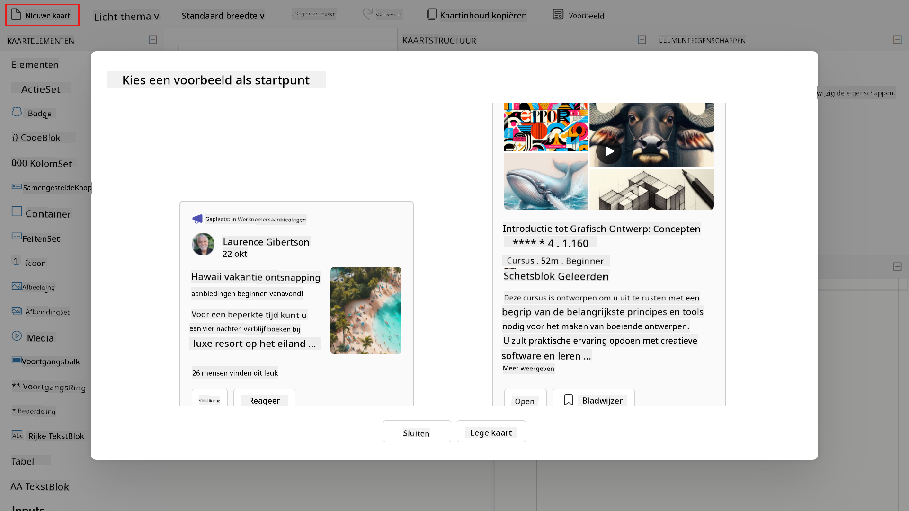

## 🌵 Veelvoorkomende toepassingen

De volgende zijn veelvoorkomende toepassingen voor Adaptive Cards in Copilot Studio wanneer gebruikt in de **Stuur een bericht** of **Stel een vraag** nodes.

1. **Formulieren en gegevensverzameling**

    Gebruik adaptive cards om gestructureerde input van gebruikers te verzamelen, zoals:

    - Verlofaanvragen.
    - Feedbackformulieren.
    - Contactinformatie.
    - Afspraakplanning.

1. **Dynamische informatie weergeven**

    Toon gebruikers gepersonaliseerde of realtime gegevens in een overzichtelijk, leesbaar formaat uit bedrijfsbronnen zoals ServiceNow, SAP, Dynamics 365, SharePoint, enz.

    - Besteloverzichten.
    - Rekeningoverzichten.
    - Ticket- of casestatus.
    - Aankomende evenementen of deadlines.

1. **Interactieve keuzes**

    Laat gebruikers direct in het gesprek keuzes maken:

    - Kies uit een lijst met opties, bijvoorbeeld productcategorieën, ondersteuningsthema's.
    - Bevestig of annuleer een actie.
    - Beoordeel een dienst of ervaring.

1. **Acties activeren**

    Voeg knoppen toe die verdere stappen in het gesprek intern of extern activeren.

    - "Verzoek indienen."
    - "Bekijk details."

## ⭐ Beste praktijken

Hier zijn enkele beste praktijken voor het maken van Adaptive Cards voor agents in Copilot Studio.

1. **Houd het eenvoudig en gefocust**

    - Ontwerp kaarten met een duidelijk doel, overlaad ze niet met te veel elementen.
    - Gebruik beknopte tekst en intuïtieve lay-outs om gebruikers door de interactie te leiden.

1. **Wees doelgericht met invoer**

    - Voeg alleen de noodzakelijke invoerelementen toe, zoals tekst, datumkeuzes, om gebruikers niet te overweldigen.
    - Gebruik labels om invoer gemakkelijk te begrijpen te maken.

1. **Structuur voor leesbaarheid**

    - Gebruik **TextBlocks** voor koppen en instructies.
    - Groepeer gerelateerde elementen met **Containers** of **ColumnSets** om de visuele stroom te verbeteren.

1. **Maak Actie-elementen duidelijk**

    - Gebruik **Action.Submit** en/of **Action.OpenUrl** met duidelijke knoptitels zoals "Verzoek indienen" of "Bekijk details."
    - Vermijd vage labels zoals "Klik hier."

1. **Ontwerp voor aanpasbaarheid**

    - Ga ervan uit dat de kaart op verschillende schermformaten kan worden bekeken.
    - Vermijd vaste breedtes en gebruik flexibele lay-outs zoals **ColumnSets** voor responsiviteit.

1. **Gebruik dynamische inhoud waar mogelijk**

    - Bind kaartelementen aan variabelen of outputs van nodes met Power Fx om de gebruikerservaring te personaliseren.
    - Bijvoorbeeld, toon de naam of huidige status van de gebruiker dynamisch.

## 🧪 Lab 08 - Voeg adaptive cards toe en verbeter topicmogelijkheden

We gaan nu leren hoe we ons topic kunnen verbeteren met adaptive cards en het gebruik van geavanceerde functionaliteit van topics en nodes.

- [8.1 Maak een nieuw topic met een adaptive card voor gebruikers om hun verzoek in te dienen](../../../../../docs/recruit/08-add-adaptive-card)
- [8.2 Werk agentinstructies bij om het Request device topic aan te roepen](../../../../../docs/recruit/08-add-adaptive-card)

### ✨ Gebruiksscenario

**Als** medewerker

**Wil ik** een apparaat aanvragen

**Zodat ik** een apparaat kan aanvragen uit de lijst met beschikbare apparaten.

Laten we beginnen!

### Vereisten

1. **SharePoint-lijst**

    We zullen de **Devices** SharePoint-lijst gebruiken van [Les 00 - Cursusinstelling - Stap 3: Maak een nieuwe SharePoint-site](../00-course-setup/README.md#step-4-create-new-sharepoint-site).

    Als je de **Devices** SharePoint-lijst nog niet hebt ingesteld, ga dan terug naar [Les 00 - Cursusinstelling - Stap 3: Maak een nieuwe SharePoint-site](../00-course-setup/README.md#step-4-create-new-sharepoint-site).

1. **Contoso Helpdesk Copilot**

    We gaan dezelfde agent gebruiken die eerder is gemaakt in [Les 06 - Maak een aangepaste agent met natuurlijke taal met Copilot en verbind deze met je gegevens](../06-create-agent-from-conversation/README.md).

### 8.1 Maak een nieuw topic met een adaptive card voor gebruikers om hun verzoek in te dienen

We zullen een nieuw topic maken dat het apparaatverzoek van een gebruiker afhandelt. Dit nieuwe topic zal een **Vraag met adaptive card**-node bevatten om gebruikersinteractie met de agent mogelijk te maken.

Laten we beginnen!

1. Selecteer het tabblad **Topics** en selecteer vervolgens **+ Voeg een topic toe vanaf blanco**.

    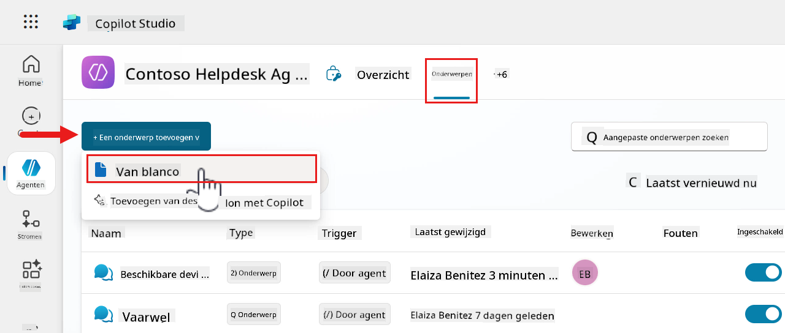

1. Geef het topic de volgende naam,

    ```text
    Request device
    ```

    Voer het volgende in als de beschrijving voor de trigger.

    ```text
    This topic helps users request a device when they answer yes to the question that asks the user if they would like to request one of these devices.
    ```

    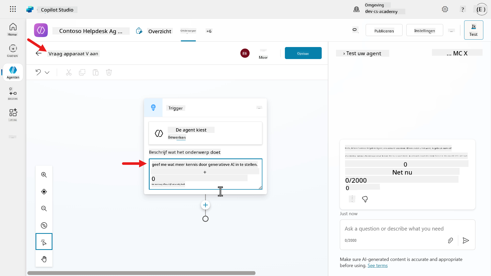
1. Voeg vervolgens een **Vraag met adaptive card**-node toe. Deze node toont een interactieve kaart waarmee de gebruiker kan kiezen welk apparaat hij wil aanvragen.

    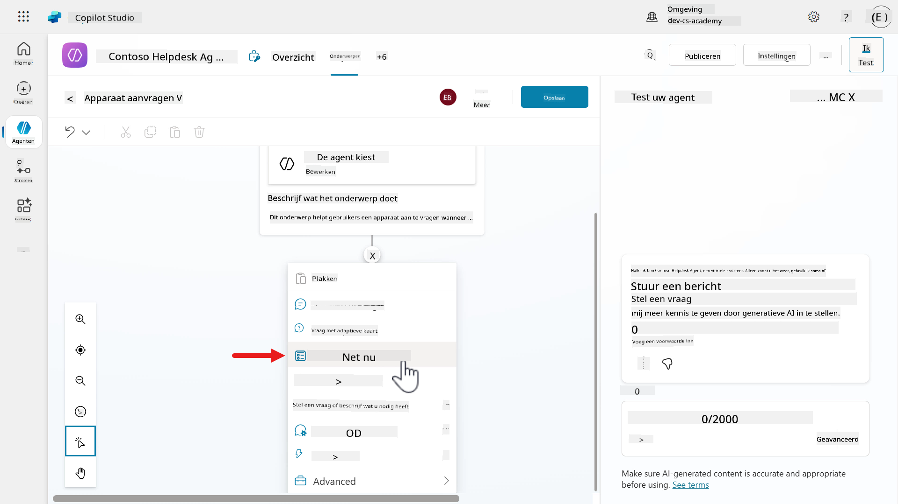

1. Selecteer de node en het **Eigenschappenpaneel van de Adaptive Card Node** verschijnt. We gaan nu de JSON bewerken. Selecteer **Bewerk adaptive card**. Selecteer **Bewerk adaptive card**.

    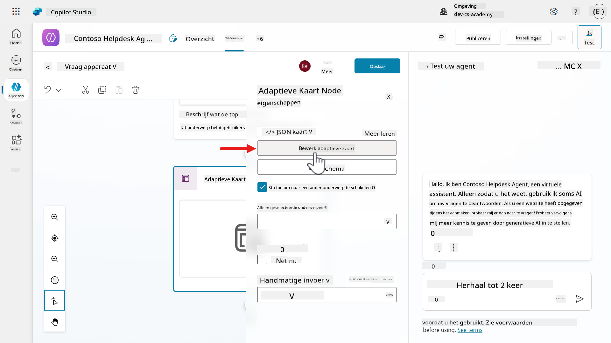

1. Dit is de **Adaptive Card Designer** waar je je kaart kunt ontwerpen en het ontwerp in realtime kunt bekijken.

    Probeer de **TextBlock**- en **FactSet**-kaartelementen naar het bewerkingscanvas te slepen, het kaartweergavegebied. Merk op hoe de kaartstructuur en de payload-editor van de kaart worden bijgewerkt terwijl de twee kaartelementen worden toegevoegd. Je kunt de payload-editor van de kaart en het eigenschappenpaneel van de elementen direct bijwerken.

    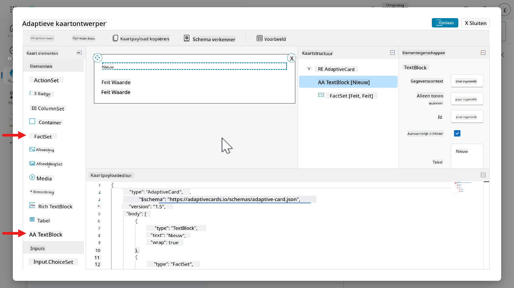

1. Selecteer **Voorbeeld** om de kaart in verschillende breedtes te bekijken.

    

1. Het voorbeeld wordt geladen, waar je verschillende kaartuitvoeringen per breedte kunt zien.

    

1. Sluit **Voorbeeld** door op het **x-icoon** te klikken en selecteer **Ongedaan maken** in de ontwerper om de eerder toegevoegde kaartelementen te verwijderen.

    

1. Klik in de **Payload-editor van de kaart** en selecteer alle regels met de Windows-toetsencombinatie _Ctrl + A_ of de Mac-toetsencombinatie _Command + A_, gevolgd door het verwijderen van de regels. **Plak** de JSON uit het [Request devices .JSON-bestand](../../../../../docs/recruit/08-add-adaptive-card/assets/8.1_RequestDevice.json).

    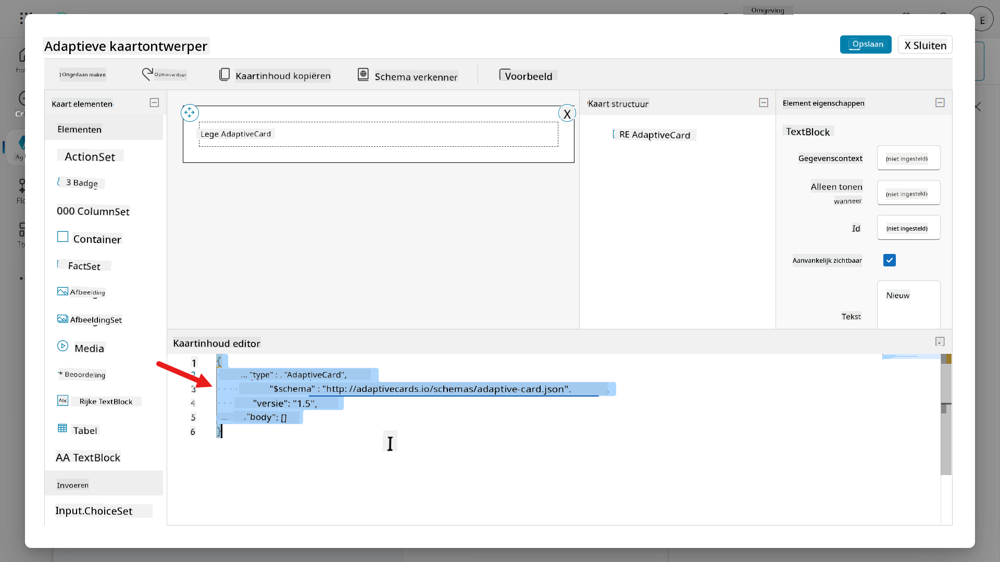

1. Merk op hoe de **Kaartvoorbeeld** nu elementen bevat die wat tekst en een lijst met beschikbare apparaten weergeven.

    Deze JSON is momenteel een tijdelijke aanduiding en een voorbeeld van wat we als basis voor onze kaart zullen gebruiken, maar in de vorm van een formule in plaats van JSON, omdat we de **globale variabele**, `Global.VarDevices.value`, gaan refereren die de respons van de **Get items** SharePoint-connectoractie opslaat.

    Selecteer **Opslaan** en selecteer **Sluiten** om de Adaptive Card Designer-modal te verlaten.

    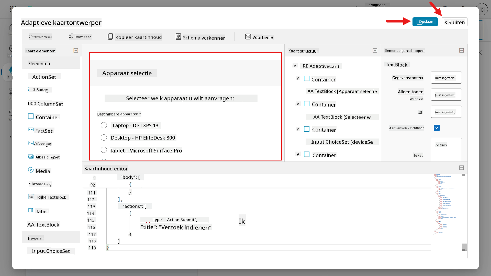

1. Sluit het **Eigenschappenpaneel van de Adaptive Card Node** door op het **X**-icoon te klikken.

    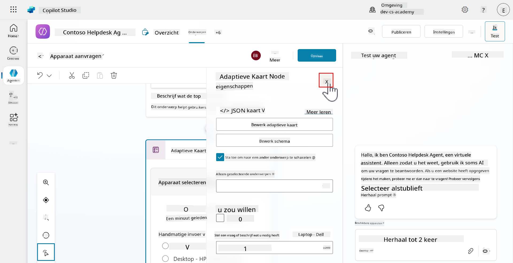

1. In het bewerkingscanvas van het onderwerp zie je de adaptive card.

    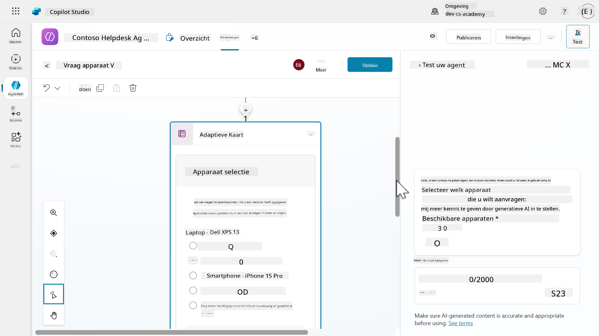

1. Scroll naar de onderkant van de node en je ziet uitvoervariabelen. De `commentsId` en de `deviceSelectionId` zijn gedefinieerd in het eigenschappenpaneel van de elementen. Deze twee variabelen slaan waarden op van de kaartelementen waarmee gebruikers interactie hebben. Deze waarden worden verderop in het onderwerp gebruikt, wat we in de volgende les zullen leren.

    

1. Laten we nu de kaart bijwerken van JSON naar formule, omdat we Power Fx opnieuw zullen gebruiken om door de items te lopen die zijn geretourneerd in de **Get items** SharePoint-connectoractie, opgeslagen in de **globale variabele**, `Global.VarDevices.value`, via de `value`-eigenschap van de JSON-respons.

    > We hebben deze globale variabele gemaakt in [Lab 07 - Voeg een nieuw onderwerp toe met gespreksnodes, 7.3 Voeg een tool toe met een connector](../07-add-new-topic-with-trigger/README.md#73-add-a-tool-using-a-connector).

    Selecteer de kaart in de **Vraag met Adaptive Card**-node, gevolgd door het selecteren van het **chevron**-icoon en selecteer **Formule**.

    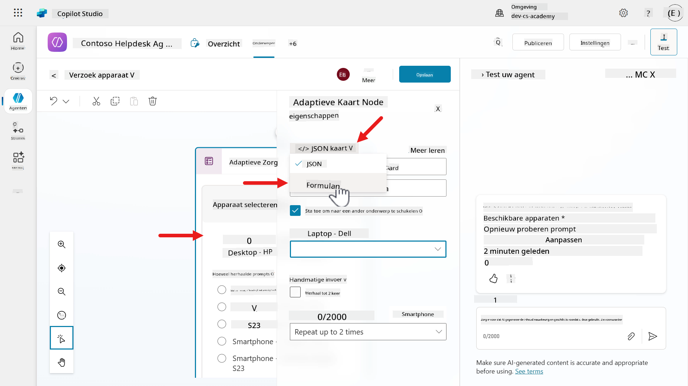

1. Klik op het **uitvouw**-icoon om het Formuleveld te vergroten.

    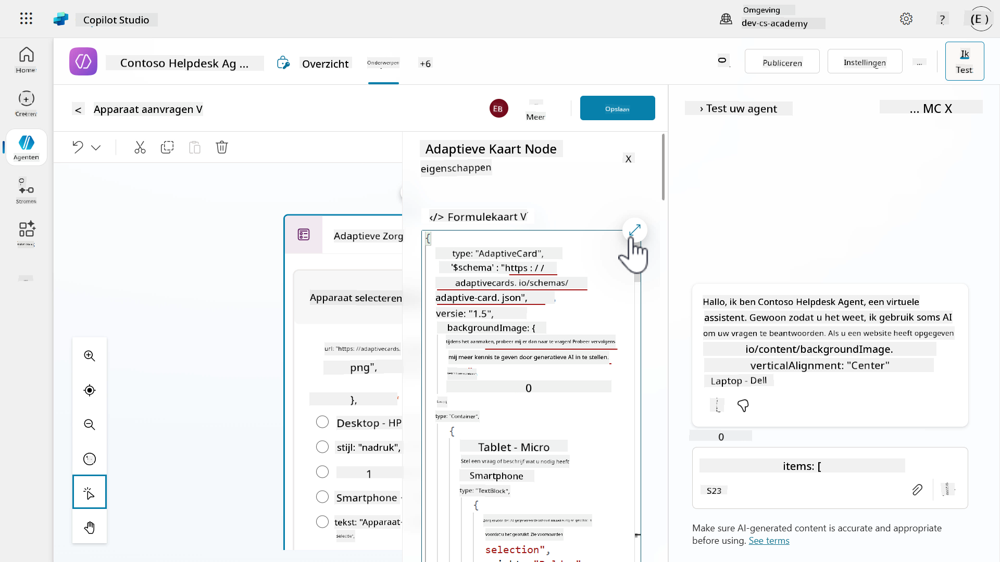

1. Klik in de **Payload-editor van de kaart** en selecteer alle regels met de Windows-toetsencombinatie _Ctrl + A_ of de Mac-toetsencombinatie _Command + A_, gevolgd door het verwijderen van de regels.

    

    Plak de formule uit het [Request Devices formulebestand](../../../../../docs/recruit/08-add-adaptive-card/assets/8.1_RequestDeviceFormula.txt).

1. In de formule zullen we door elk SharePoint-lijstitem lopen met behulp van de `For All`-functie om de waarden van `Model` weer te geven in de titel van de keuzeoptie, en het SharePoint-item `ID` wordt gerefereerd als de waarde. We omhullen de waarden ook met de `If(IsBlank()`-functies omdat de formule een waarde verwacht om de adaptive card weer te geven in het bewerkingscanvas van het onderwerp. Anders verschijnt er een bericht: "Eigenschap kan niet null zijn."

    **Sluit** de kaartmodal.

    

1. **Sluit** het **Eigenschappenpaneel van de Adaptive Card Node**.

1. **Sla** het onderwerp op.

    

### 8.2 Update agentinstructies om het onderwerp Apparaataanvraag aan te roepen

Nu we het nieuwe onderwerp hebben gemaakt dat de apparaataanvragen afhandelt, moeten we de **agentinstructies** bijwerken om het onderwerp aan te roepen.

1. Selecteer het tabblad **Overzicht** en in de **agentinstructies** selecteer **Bewerken**.

    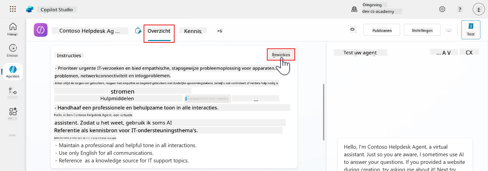

1. Voeg een nieuwe regel toe onder de vorige instructie uit [Lab 07 - Voeg een nieuw onderwerp toe met gespreksnodes, 7.3 Voeg een tool toe met een connector](../07-add-new-topic-with-trigger/README.md#73-add-a-tool-using-a-connector).

    ```text
    - If the user answers yes to the question of requesting a device, trigger [Request device]. Otherwise if they answer no to the question of requesting a device, trigger [Goodbye].
    ```

    Selecteer de hele onderwerpplaatsaanduiding tussen vierkante haken en verwijder de plaatsaanduiding.

    

1. Typ `/Req` en selecteer het onderwerp **Request devices**.

    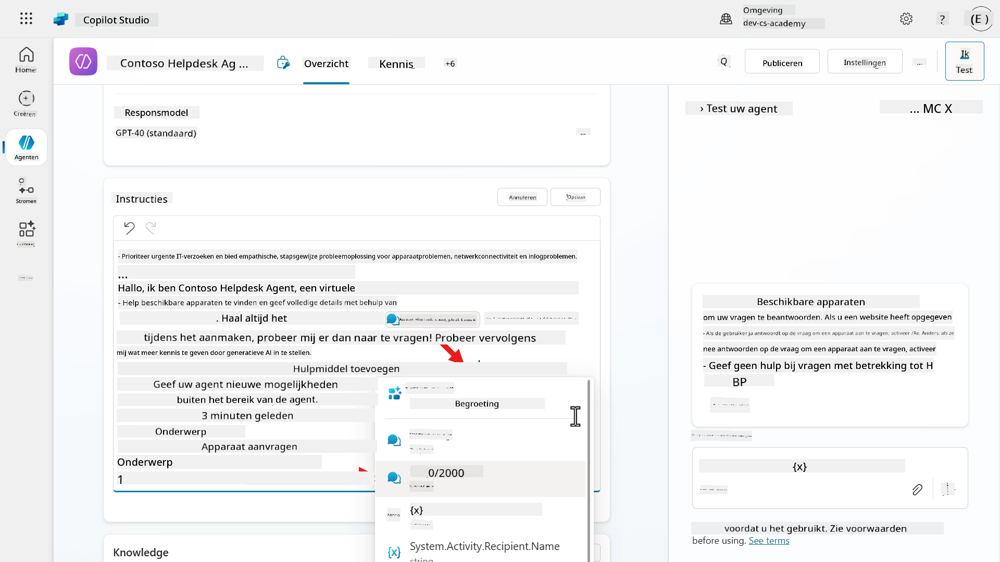

1. Herhaal dezelfde stappen voor de volgende onderwerpplaatsaanduiding, **[Goodbye]**. Selecteer de hele onderwerpplaatsaanduiding tussen vierkante haken en verwijder de plaatsaanduiding. Typ `/Goodbye` en selecteer het onderwerp **Goodbye**.

    - Wanneer de gebruiker **Ja** antwoordt op de vraag van de agent of hij een apparaat wil aanvragen, zal de agent doorverwijzen van het onderwerp **Beschikbare apparaten** naar het onderwerp **Request devices**.

    - Anders, als de gebruiker **Nee** antwoordt, zal de agent doorverwijzen van het onderwerp **Beschikbare apparaten** naar het onderwerp **Goodbye**.

    **Sla** de bijgewerkte instructies op.

    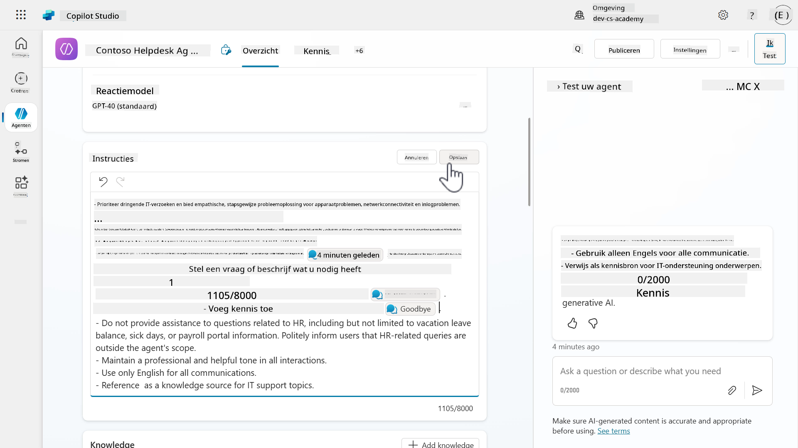

1. Laten we nu testen of de doorverwijzing van het onderwerp _Beschikbare apparaten_ naar het onderwerp _Request devices_ werkt. Selecteer **Testen** om het testpaneel te laden en selecteer **Vernieuwen**.

    Selecteer vervolgens het **Activiteitenkaart**-icoon in het testpaneel, gevolgd door het inschakelen van **Volg tussen onderwerpen**. Hiermee kunnen we zien dat het onderwerp _Beschikbare apparaten_ is doorverwezen naar het onderwerp _Request devices_.

    Oké, we kunnen testen! Voer het volgende in het testpaneel in.

    ```text
    I need a laptop
    ```

    

1. De agent zal reageren met de lijst van beschikbare apparaten, gevolgd door de vraag of de gebruiker een apparaat wil aanvragen. Kopieer en plak het volgende,

    ```text
    yes please
    ```

    

1. Vervolgens zien we dat de agent is doorverwezen naar het onderwerp **Request device**. De agent heeft dit onderwerp aangeroepen volgens de instructies die we hebben toegevoegd.

    De adaptive card met de interactieve elementen wordt nu als bericht aan de gebruiker weergegeven.

    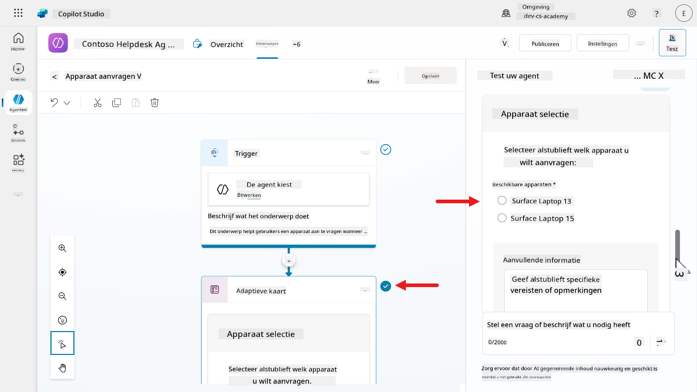

1. We hebben nu met succes getest 😄 dat het onderwerp _Beschikbare apparaten_ doorverwijst naar het onderwerp _Request devices_. We zullen meer verbeteringen aan dit onderwerp toevoegen in de volgende les.

    Vernieuw het testpaneel.

    

## ✅ Missie Voltooid

Gefeliciteerd! 👏🏻 Je hebt geleerd hoe je adaptive cards toevoegt met Power Fx-formules om gegevens uit variabelen weer te geven, en je hebt ook geleerd hoe je van het ene onderwerp naar het andere kunt doorverwijzen. Het maken van compacte onderwerpen maakt je agent beter georganiseerd, maar helpt ook gebruikers door verschillende delen van de gespreksflow met de agent te navigeren.

Dit is het einde van **Lab 08 - Verbeter gebruikersinteracties met Adaptive Cards**, selecteer de onderstaande link om naar de volgende les te gaan. We zullen de use case in dit lab uitbreiden in de volgende les.

⏭️ [Ga naar **Voeg een agentflow toe aan je onderwerp voor automatisering** les](../09-add-an-agent-flow/README.md)

## 📚 Tactische Bronnen

🔗 [Adaptive Cards gebruiken in Copilot Studio](https://learn.microsoft.com/microsoft-copilot-studio/guidance/adaptive-cards-overview?WT.mc_id=power-172619-ebenitez)

🔗 [Voeg een adaptive card toe in de Verstuur een bericht-node](https://learn.microsoft.com/microsoft-copilot-studio/authoring-send-message#add-an-adaptive-card?WT.mc_id=power-172619-ebenitez)

🔗 [Maak expressies met Power Fx](https://learn.microsoft.com/microsoft-copilot-studio/advanced-power-fx?WT.mc_id=power-172619-ebenitez)

📺 [Adaptive Cards bouwen met Power FX](https://aka.ms/ai-in-action/copilot-studio/ep8)


---

**Disclaimer**:  
Dit document is vertaald met behulp van de AI-vertalingsservice [Co-op Translator](https://github.com/Azure/co-op-translator). Hoewel we streven naar nauwkeurigheid, dient u zich ervan bewust te zijn dat geautomatiseerde vertalingen fouten of onnauwkeurigheden kunnen bevatten. Het originele document in de oorspronkelijke taal moet worden beschouwd als de gezaghebbende bron. Voor kritieke informatie wordt professionele menselijke vertaling aanbevolen. Wij zijn niet aansprakelijk voor eventuele misverstanden of verkeerde interpretaties die voortvloeien uit het gebruik van deze vertaling.