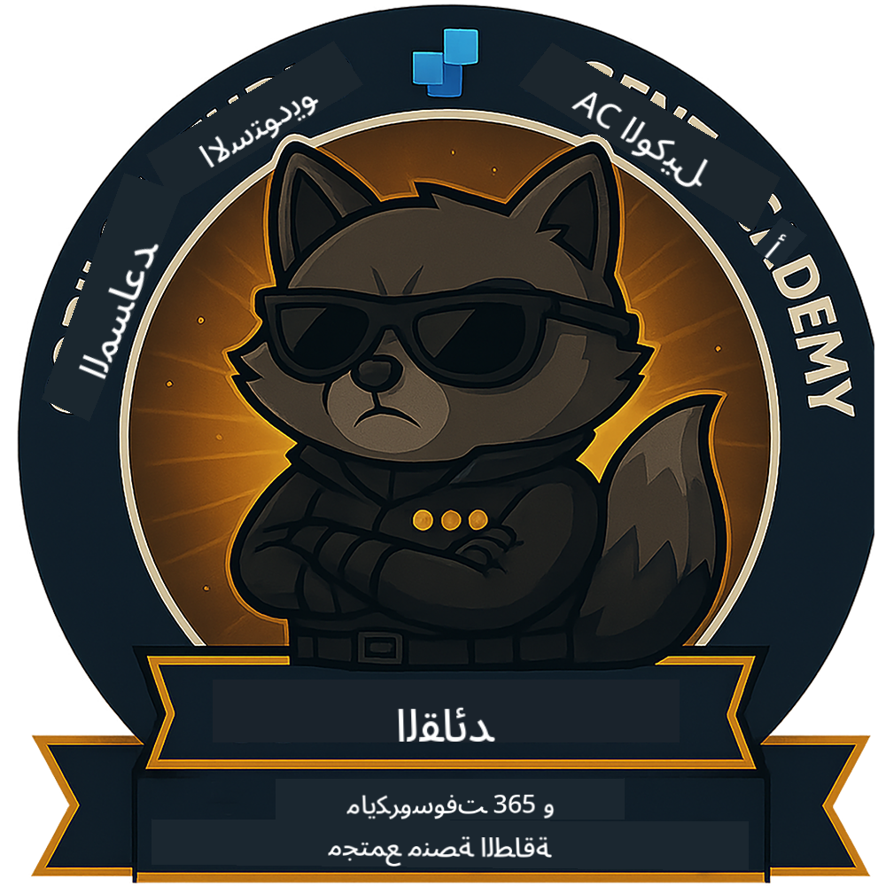

<!--
CO_OP_TRANSLATOR_METADATA:
{
  "original_hash": "8fb14b79c8616d9533f641ac2d555e8c",
  "translation_date": "2025-10-22T18:47:09+00:00",
  "source_file": "docs/commander/README.md",
  "language_code": "ar"
}
-->
---
إخفاء:
- التنقل
---

# القائد (قريبًا)

هذا الدورة لا تزال سرية للغاية. سيتم فتحها في المستقبل! 🔓

{ width="300" }

<!-- markdownlint-disable-next-line MD033 -->

---

**إخلاء المسؤولية**:  
تم ترجمة هذا المستند باستخدام خدمة الترجمة بالذكاء الاصطناعي [Co-op Translator](https://github.com/Azure/co-op-translator). بينما نسعى لتحقيق الدقة، يرجى العلم أن الترجمات الآلية قد تحتوي على أخطاء أو عدم دقة. يجب اعتبار المستند الأصلي بلغته الأصلية المصدر الموثوق. للحصول على معلومات حاسمة، يُوصى بالترجمة البشرية الاحترافية. نحن غير مسؤولين عن أي سوء فهم أو تفسيرات خاطئة ناتجة عن استخدام هذه الترجمة.