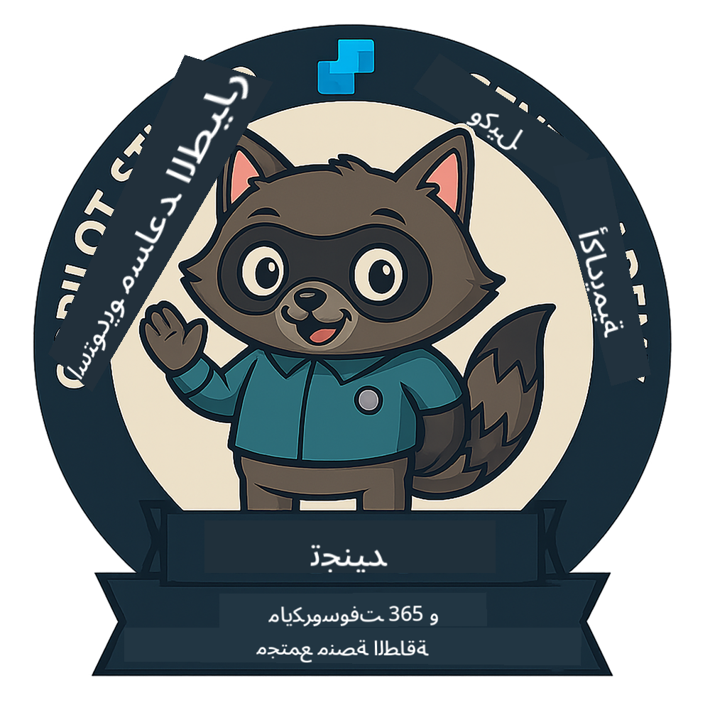

<!--
CO_OP_TRANSLATOR_METADATA:
{
  "original_hash": "15e57e059ce7689d602d7853187235cd",
  "translation_date": "2025-10-22T18:46:38+00:00",
  "source_file": "docs/index.md",
  "language_code": "ar"
}
-->
---
hide:
- navigation
---

# أكاديمية وكيل Copilot Studio

**مرحبًا بكم في أكاديمية وكيل Copilot Studio.**  

مهمتكم - إذا اخترتم قبولها - هي إتقان فن بناء الوكلاء باستخدام **Microsoft Copilot Studio**.

هذا التدريب العملي هو بوابتكم إلى **عالم الوكلاء**: من إنشاء مطالبات دقيقة إلى بطاقات Adaptive Cards وتدفقات الوكلاء، ستتعلمون كيفية بناء وتوسيع ونشر وكلاء ذكيين باستخدام أدوات وحالات استخدام واقعية.

---

## 🏅 تقدم الرتب

**أكاديمية وكيل Copilot Studio** هي برنامج تدريبي متعدد المراحل مصمم لتطوير مهاراتكم عبر ثلاث رتب للوكلاء. كل مستوى يتضمن شارة ومسؤوليات متزايدة:

| الرتبة            | المستوى | الصورة |
|------------------|:-----:|--------|
| 🟢 **مجند**  [🚀 ابدأ الآن](https://aka.ms/agent-academy-recruit){ .md-button .md-button--primary }     | •     | { width="300" }     |
| 🔵 **عميل** (قريبًا)   | ••    | { width="300" } |
| 🟡 **قائد** (قريبًا)    | •••   | { width="300" } |

كل مستوى يبني على المستوى السابق. أكملوا مهمة المجند، وترقبوا الترقية لتعزيز مؤهلاتكم كوكيل.

---

## 🎒 دورات أخرى

اطلعوا على هذه الدورات الأخرى لمواصلة التعلم عن الذكاء الاصطناعي والوكلاء:

- [Microsoft Copilot Studio <3 MCP Lab](https://aka.ms/mcsmcplab)
- [معسكر مطوري Copilot](https://microsoft.github.io/copilot-camp/)
- [وكلاء الذكاء الاصطناعي للمبتدئين](https://microsoft.github.io/ai-agents-for-beginners/)
- [بروتوكول سياق النموذج (MCP) للمبتدئين](https://github.com/microsoft/mcp-for-beginners)

---

## 🚑 المشاكل

نقدر ملاحظاتكم كثيرًا! يرجى استخدام [قائمة المشاكل](https://github.com/microsoft/agent-academy/issues) لمشاركة تعليقاتكم ومشاكلكم. شكرًا لكم!

---

## 📜 قواعد السلوك

هذا المشروع قد تبنى [قواعد السلوك مفتوحة المصدر من Microsoft](https://opensource.microsoft.com/codeofconduct/).

!!! info "الموارد:"

    - [قواعد السلوك مفتوحة المصدر من Microsoft](https://opensource.microsoft.com/codeofconduct/)
    - [الأسئلة الشائعة حول قواعد السلوك من Microsoft](https://opensource.microsoft.com/codeofconduct/faq/)
    - تواصلوا مع [opencode@microsoft.com](mailto:opencode@microsoft.com) لأي استفسارات أو مخاوف

---

[⭐️ قوموا بتقييم مستودعنا](https://github.com/microsoft/agent-academy){ .md-button .md-button--primary }

<!-- markdownlint-disable-next-line MD033 -->

---

**إخلاء المسؤولية**:  
تم ترجمة هذا المستند باستخدام خدمة الترجمة بالذكاء الاصطناعي [Co-op Translator](https://github.com/Azure/co-op-translator). بينما نسعى لتحقيق الدقة، يرجى العلم أن الترجمات الآلية قد تحتوي على أخطاء أو عدم دقة. يجب اعتبار المستند الأصلي بلغته الأصلية المصدر الرسمي. للحصول على معلومات حاسمة، يُوصى بالترجمة البشرية الاحترافية. نحن غير مسؤولين عن أي سوء فهم أو تفسيرات خاطئة تنشأ عن استخدام هذه الترجمة.