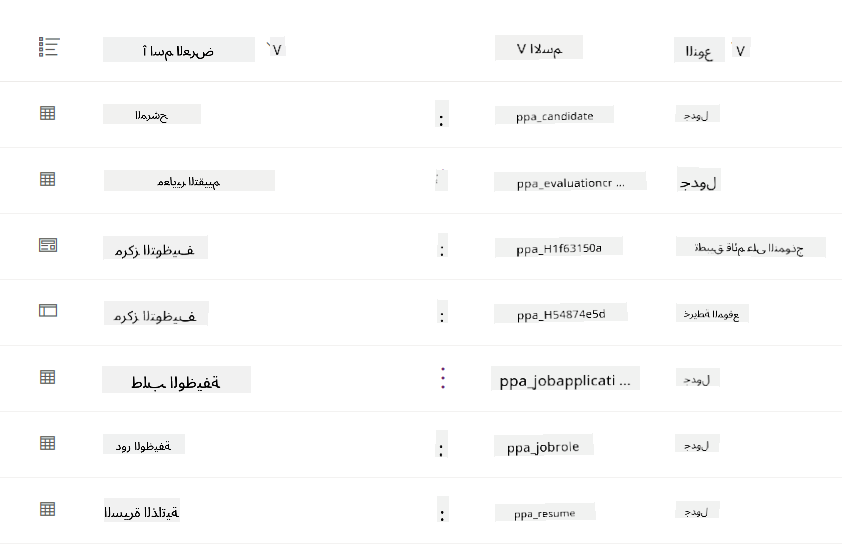
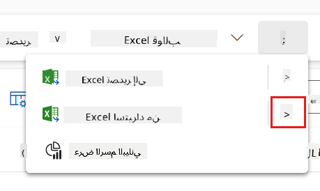
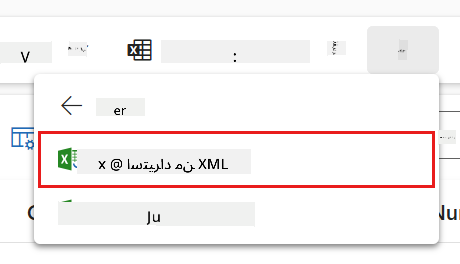
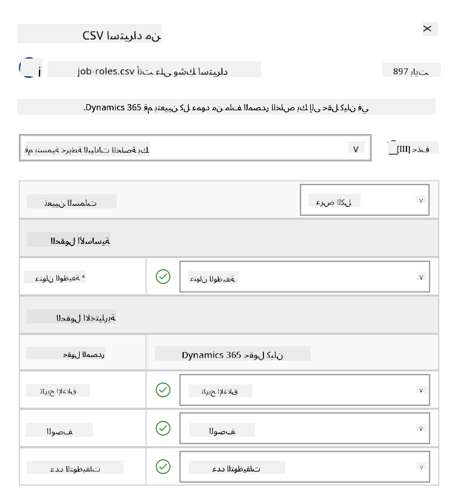
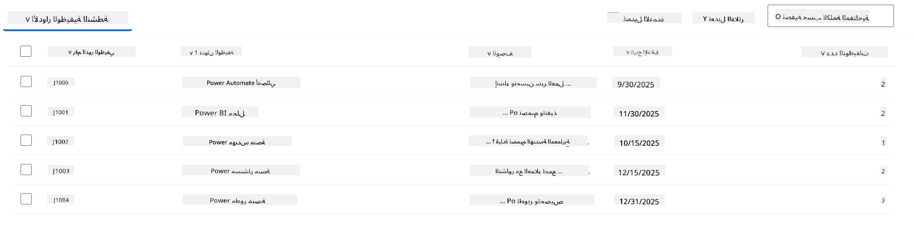
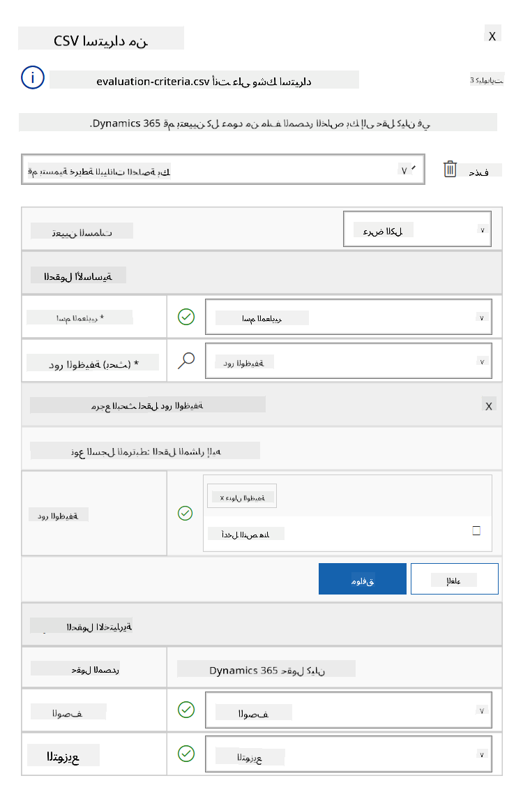
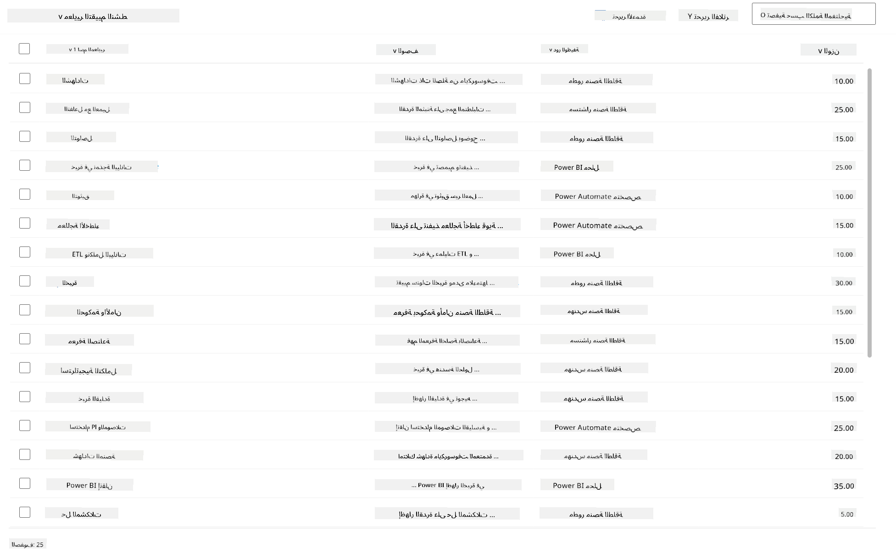

<!--
CO_OP_TRANSLATOR_METADATA:
{
  "original_hash": "2620cf9eaf09a3fc6be7fa31a3a62956",
  "translation_date": "2025-10-22T19:08:58+00:00",
  "source_file": "docs/operative-preview/01-get-started/README.md",
  "language_code": "ar"
}
-->
# 🚨 المهمة 01: البدء مع وكيل التوظيف

--8<-- "disclaimer.md"

## 🕵️‍♂️ الاسم الرمزي: `عملية استكشاف المواهب`

> **⏱️ مدة العملية:** `~45 دقيقة`

## 🎯 ملخص المهمة

مرحبًا أيها العميل. مهمتك الأولى هي **عملية استكشاف المواهب** - إنشاء البنية التحتية الأساسية لنظام توظيف مدعوم بالذكاء الاصطناعي سيغير طريقة تحديد وتوظيف المواهب المتميزة في المؤسسات.

مهمتك، إذا اخترت قبولها، هي نشر وتكوين نظام إدارة التوظيف شامل باستخدام Microsoft Copilot Studio. ستقوم باستيراد حل مُعد مسبقًا يحتوي على جميع الهياكل البيانية اللازمة، ثم إنشاء وكيل الذكاء الاصطناعي الأول - **وكيل التوظيف** - الذي سيكون المنسق المركزي لجميع عمليات التوظيف المستقبلية.

يمثل هذا النشر الأول مركز القيادة الذي ستعمل على تحسينه طوال برنامج عملاء أكاديمية الوكلاء. اعتبره قاعدة العمليات الخاصة بك - الأساس الذي ستبني عليه شبكة كاملة من الوكلاء المتخصصين في المهام المستقبلية.

---

## 🔎 الأهداف

عند إكمال هذه المهمة، ستتمكن من:

- **فهم السيناريو**: اكتساب معرفة شاملة بتحديات وحلول أتمتة التوظيف  
- **نشر الحل**: استيراد وتكوين أساسيات نظام إدارة التوظيف بنجاح  
- **إنشاء وكيل**: بناء وكيل التوظيف الذي يمثل بداية السيناريو الذي ستطوره كعميل في أكاديمية الوكلاء  

---

## 🔍 المتطلبات الأساسية

قبل البدء في هذه المهمة، تأكد من توفر:

- ترخيص Copilot Studio  
- الوصول إلى بيئة Microsoft Power Platform  
- أذونات إدارية لإنشاء الحلول والوكلاء  

---

## 🏢 فهم سيناريو أتمتة التوظيف

يُظهر هذا السيناريو كيف يمكن للشركات استخدام Microsoft Copilot Studio لتحسين وأتمتة عملية التوظيف. يقدم نظامًا من الوكلاء الذين يعملون معًا لمعالجة مهام مثل مراجعة السير الذاتية، توصية الأدوار الوظيفية، إعداد مواد المقابلات، وتقييم المرشحين.

### القيمة التجارية

يساعد الحل فرق الموارد البشرية على توفير الوقت واتخاذ قرارات أفضل من خلال:

- معالجة السير الذاتية الواردة عبر البريد الإلكتروني تلقائيًا.  
- اقتراح أدوار وظيفية مناسبة بناءً على ملفات المرشحين.  
- إنشاء طلبات وظيفية وأدلة مقابلات مخصصة لكل مرشح.  
- ضمان ممارسات توظيف عادلة ومتوافقة من خلال ميزات الأمان والاعتدال المدمجة.  
- جمع الملاحظات لتحسين الحل.  

### كيف يعمل

- يقوم **وكيل التوظيف المركزي** بتنسيق العملية وتخزين البيانات في Microsoft Dataverse.  
- يقرأ **وكيل استقبال الطلبات** السير الذاتية ويُنشئ طلبات وظيفية.  
- يُنشئ **وكيل إعداد المقابلات** أسئلة ووثائق المقابلات بناءً على خلفية المرشح.  
- يمكن نشر النظام على موقع تجريبي، مما يسمح لأصحاب المصلحة بالتفاعل معه.  

هذا السيناريو مثالي للمؤسسات التي تسعى لتحديث عمليات التوظيف باستخدام أتمتة مدعومة بالذكاء الاصطناعي، مع الحفاظ على الشفافية، العدالة، والكفاءة.

---

## 🧪 المختبر: إعداد وكيل التوظيف

في هذا المختبر العملي، ستقوم بإنشاء الأساس لنظام أتمتة التوظيف الخاص بك. ستبدأ باستيراد حل مُعد مسبقًا يحتوي على جميع جداول Dataverse وهياكل البيانات اللازمة لإدارة المرشحين، الوظائف، وعمليات التوظيف. بعد ذلك، ستقوم بملء هذه الجداول ببيانات تجريبية لدعم تعلمك طوال هذا الوحدة وتوفير سيناريوهات واقعية للاختبار. وأخيرًا، ستقوم بإنشاء وكيل التوظيف في Copilot Studio، مما يتيح واجهة محادثة أساسية ستكون حجر الزاوية لجميع الميزات الأخرى التي ستضيفها في المهام المستقبلية.

### 🧪 المختبر 1.1: استيراد الحل

1. انتقل إلى **[Copilot Studio](https://copilotstudio.microsoft.com)**  
1. اختر **...** في التنقل الأيسر واختر **Solutions**  
1. اختر زر **Import Solution** في الأعلى  
1. **[قم بتنزيل](https://raw.githubusercontent.com/microsoft/agent-academy/refs/heads/main/docs/operative-preview/01-get-started/assets/Operative_1_0_0_0.zip)** الحل المُعد مسبقًا  
1. اختر **Browse** وحدد الحل الذي تم تنزيله من الخطوة السابقة  
1. اختر **Next**  
1. اختر **Import**  

!!! success
    عند النجاح، سترى شريط إشعار أخضر مع الرسالة التالية عند الانتهاء:  
    "تم استيراد الحل "Operative" بنجاح."

عند استيراد الحل، ألقِ نظرة على ما تم استيراده من خلال اختيار اسم العرض للحل (`Operative`).



تم استيراد المكونات التالية:

| اسم العرض | النوع | الوصف |
|-----------|-------|-------|
| المرشح | جدول | معلومات المرشح |
| معايير التقييم | جدول | معايير التقييم للدور |
| مركز التوظيف | تطبيق يعتمد على النموذج | تطبيق لإدارة عملية التوظيف |
| مركز التوظيف | خريطة الموقع | هيكل التنقل لتطبيق مركز التوظيف |
| طلب وظيفي | جدول | الطلبات الوظيفية |
| الدور الوظيفي | جدول | الأدوار الوظيفية |
| السيرة الذاتية | جدول | السير الذاتية للمرشحين |

كآخر مهمة لهذا المختبر، اختر زر **Publish all customizations** في أعلى الصفحة.

### 🧪 المختبر 1.2: استيراد بيانات تجريبية

في هذا المختبر، ستضيف بيانات تجريبية لبعض الجداول التي قمت باستيرادها في المختبر 1.1.

#### تنزيل الملفات للاستيراد

1. **[قم بتنزيل](https://raw.githubusercontent.com/microsoft/agent-academy/refs/heads/main/docs/operative-preview/01-get-started/assets/evaluation-criteria.csv)** ملف CSV الخاص بمعايير التقييم  
1. **[قم بتنزيل](https://raw.githubusercontent.com/microsoft/agent-academy/refs/heads/main/docs/operative-preview/01-get-started/assets/job-roles.csv)** ملف CSV الخاص بالأدوار الوظيفية  

#### استيراد بيانات الأدوار الوظيفية التجريبية

1. عد إلى الحل الذي قمت باستيراده في المختبر الأخير  
1. اختر تطبيق **Hiring Hub** الذي يعتمد على النموذج من خلال اختيار علامة الاختيار أمام الصف  
1. اختر زر **Play** في الأعلى  

    !!! warning
        قد يُطلب منك تسجيل الدخول مرة أخرى. تأكد من القيام بذلك. بعد ذلك، يجب أن ترى تطبيق مركز التوظيف.

1. اختر **Job Roles** في التنقل الأيسر  
1. اختر أيقونة **More** (ثلاث نقاط تحت بعضها) في شريط الأوامر  
1. اختر السهم **الأيمن** بجانب *Import from Excel*  

    

1. اختر **Import from CSV**  

    

1. اختر زر **Choose File**، حدد ملف **job-roles.csv** الذي قمت بتنزيله للتو ثم اختر **Open**  
1. اختر **Next**  
1. اترك الخطوة التالية كما هي واختر **Review Mapping**  

    

1. تأكد من أن التعيين صحيح واختر **Finish Import**  

    !!! info
        سيبدأ هذا عملية الاستيراد وستتمكن من تتبع التقدم أو إنهاء العملية فورًا عن طريق اختيار **Done**

1. اختر **Done**

قد يستغرق هذا بعض الوقت، ولكن يمكنك الضغط على زر **Refresh** لمعرفة ما إذا كان الاستيراد قد نجح.



#### استيراد بيانات معايير التقييم التجريبية

1. اختر **Evaluation Criteria** في التنقل الأيسر  
1. اختر أيقونة **More** (ثلاث نقاط تحت بعضها) في شريط الأوامر  
1. اختر السهم **الأيمن** بجانب *Import from Excel*  

    

1. اختر **Import from CSV**  

    

1. اختر زر **Choose File**، حدد ملف **evaluation-criteria.csv** الذي قمت بتنزيله للتو ثم اختر **Open**  
1. اختر **Next**  
1. اترك الخطوة التالية كما هي واختر **Review Mapping**  

    

1. الآن علينا القيام ببعض العمل الإضافي للتعيين. اختر أيقونة العدسة المكبرة (🔎) بجانب حقل الدور الوظيفي  
1. تأكد من اختيار **Job Title** هنا، وإذا لم يكن كذلك - أضفه  
1. اختر **OK**  
1. تأكد من أن باقي التعيين صحيح أيضًا واختر **Finish Import**  

    !!! info
        سيبدأ هذا عملية الاستيراد مرة أخرى وستتمكن من تتبع التقدم أو إنهاء العملية فورًا عن طريق اختيار **Done**

1. اختر **Done**

قد يستغرق هذا بعض الوقت، ولكن يمكنك الضغط على زر **Refresh** لمعرفة ما إذا كان الاستيراد قد نجح.



### 🧪 المختبر 1.3: إنشاء وكيل التوظيف

الآن بعد أن انتهيت من إعداد المتطلبات الأساسية، حان وقت العمل الفعلي! دعونا نضيف وكيل التوظيف أولاً!

1. انتقل إلى **[Copilot Studio](https://copilotstudio.microsoft.com)** وتأكد من أنك في نفس البيئة التي قمت فيها باستيراد الحل والبيانات  
1. اختر **Agents** في التنقل الأيسر  
1. اختر **New Agent**  
1. اختر **Configure**  
1. بالنسبة لـ **Name**، أدخل:

    ```text
    Hiring Agent
    ```

1. بالنسبة لـ **Description**، أدخل:

    ```text
    Central orchestrator for all hiring activities
    ```

1. اختر **...** بجانب زر *Create* في الزاوية العلوية اليمنى  
1. اختر **Update advanced settings**  
1. كـ **Solution**، اختر `Operative`  
1. اختر **Update**  
1. اختر **Create** في الزاوية العلوية اليمنى  

سيتم إنشاء وكيل التوظيف لك، والذي ستستخدمه طوال دورة العميل.

---

## 🎉 المهمة مكتملة

تم إكمال المهمة 01! لقد أتقنت الآن المهارات التالية:

✅ **فهم السيناريو**: معرفة شاملة بتحديات وحلول أتمتة التوظيف  
✅ **نشر الحل**: استيراد وتكوين أساسيات نظام إدارة التوظيف بنجاح  
✅ **إنشاء وكيل**: بناء وكيل التوظيف الذي يمثل بداية السيناريو الذي ستطوره كعميل في أكاديمية الوكلاء  

المهمة التالية هي [المهمة 02](../02-multi-agent/README.md): جعل وكيلك جاهزًا للعمل مع وكلاء متصلين.

---

## 📚 الموارد التكتيكية

📖 [Microsoft Copilot Studio - إنشاء وكيل](https://learn.microsoft.com/microsoft-copilot-studio/authoring-first-bot)  
📖 [وثائق Microsoft Dataverse](https://learn.microsoft.com/power-apps/maker/data-platform)  

---

**إخلاء المسؤولية**:  
تم ترجمة هذا المستند باستخدام خدمة الترجمة بالذكاء الاصطناعي [Co-op Translator](https://github.com/Azure/co-op-translator). بينما نسعى لتحقيق الدقة، يرجى العلم أن الترجمات الآلية قد تحتوي على أخطاء أو عدم دقة. يجب اعتبار المستند الأصلي بلغته الأصلية المصدر الموثوق. للحصول على معلومات حاسمة، يُوصى بالترجمة البشرية الاحترافية. نحن غير مسؤولين عن أي سوء فهم أو تفسيرات خاطئة تنشأ عن استخدام هذه الترجمة.