<!--
CO_OP_TRANSLATOR_METADATA:
{
  "original_hash": "4fb913dfc3bbc71506dd3602c4b8e6ed",
  "translation_date": "2025-10-22T18:49:41+00:00",
  "source_file": "docs/operative-preview/02-multi-agent/README.md",
  "language_code": "ar"
}
-->
# 🚨 المهمة 02: الوكلاء المتصلون

--8<-- "disclaimer.md"

## 🕵️‍♂️ الاسم الرمزي: `عملية السيمفونية`

> **⏱️ مدة العملية:** `~45 دقيقة`

## 🎯 ملخص المهمة

مرحبًا بك مجددًا، أيها العميل. في المهمة 01، قمت ببناء وكيل التوظيف الرئيسي الخاص بك - وهو أساس قوي لإدارة عمليات التوظيف. ولكن وكيل واحد لا يمكنه القيام بكل شيء.

مهمتك، إذا اخترت قبولها، هي **عملية السيمفونية** - تحويل وكيلك الفردي إلى **نظام متعدد الوكلاء**: فريق من الوكلاء المتخصصين يعملون معًا للتعامل مع تحديات التوظيف المعقدة. فكر في الأمر كترقية من مشغل فردي إلى قائد فريق مهام متخصص.

مثل أوركسترا سيمفونية حيث يعزف كل موسيقي دوره بتناغم مثالي، ستضيف اثنين من المتخصصين الأساسيين إلى وكيل التوظيف الحالي: وكيل استقبال الطلبات لمعالجة السير الذاتية تلقائيًا، ووكيل إعداد المقابلات لإنشاء مواد مقابلة شاملة. سيعمل هؤلاء الوكلاء معًا بسلاسة تحت إشراف وكيلك الرئيسي.

## 🔎 الأهداف

في هذه المهمة، ستتعلم:

1. متى تستخدم **الوكلاء الفرعيين** مقابل **الوكلاء المتصلين**
1. كيفية تصميم **هياكل متعددة الوكلاء** قابلة للتوسع  
1. إنشاء **وكلاء فرعيين** للمهام المركزة
1. إنشاء **أنماط اتصال** بين الوكلاء
1. بناء وكيل استقبال الطلبات ووكيل إعداد المقابلات

## 🧠 ما هي الوكلاء المتصلون؟

في Copilot Studio، لست مقيدًا ببناء وكلاء فرديين فقط. يمكنك إنشاء **أنظمة متعددة الوكلاء** - شبكات من الوكلاء المتخصصين الذين يعملون معًا للتعامل مع تدفقات العمل المعقدة.

فكر في الأمر كمنظمة حقيقية: بدلاً من أن يقوم شخص واحد بكل شيء، لديك متخصصون يتفوقون في مهام معينة ويتعاونون عند الحاجة.

### لماذا أنظمة متعددة الوكلاء مهمة

- **التوسع:** يمكن تطوير واختبار وصيانة كل وكيل بشكل مستقل بواسطة فرق مختلفة.  
- **التخصص:** يمكن للوكلاء التركيز على ما يجيدونه. ربما واحد لمعالجة البيانات، وآخر للتفاعل مع المستخدم، وآخر لاتخاذ القرارات.  
- **المرونة:** يمكنك مزج الوكلاء ومطابقتهم، وإعادة استخدامهم عبر المشاريع، وتطوير نظامك تدريجيًا.  
- **سهولة الصيانة:** التغييرات في وكيل واحد لا تؤثر بالضرورة على الآخرين، مما يجعل التحديثات أكثر أمانًا وسهولة.

### مثال واقعي: عملية التوظيف

فكر في تدفق العمل الخاص بالتوظيف - قد يعمل العديد من الوكلاء معًا مع المسؤوليات التالية:

- **استقبال السير الذاتية** يتطلب مهارات في تحليل المستندات واستخراج البيانات
- **التقييم** يتضمن تقييم السير الذاتية للمرشحين ومطابقتها مع متطلبات الوظيفة
- **إعداد المقابلات** يحتاج إلى تحليل عميق لملاءمة المرشح  
- **التواصل مع المرشحين** يتطلب مهارات تواصل تعاطفية

بدلاً من بناء وكيل ضخم يحاول التعامل مع كل هذه المهارات المختلفة، يمكنك إنشاء وكلاء متخصصين لكل مجال وتنسيقهم معًا.

## 🔗 الوكلاء الفرعيون مقابل الوكلاء المتصلون: الفرق الرئيسي

يوفر Copilot Studio طريقتين لبناء أنظمة متعددة الوكلاء، لكل منها استخدامات مختلفة:

### ↘️ الوكلاء الفرعيون

الوكلاء الفرعيون هم **متخصصون خفيفون** يعيشون داخل وكيلك الرئيسي. فكر فيهم كفرق متخصصة داخل نفس القسم.

#### التفاصيل التقنية الرئيسية

- يعيش الوكلاء الفرعيون داخل الوكيل الرئيسي ولديهم صفحة إعداد واحدة.
- الأدوات والمعرفة **مخزنة في الوكيل الرئيسي**، ولكن يتم تكوينها لتكون "متاحة" للوكيل الفرعي.
- الوكلاء الفرعيون **يشاركون المواضيع** الخاصة بالوكيل الرئيسي. يمكن الرجوع إلى المواضيع بواسطة تعليمات الوكيل الفرعي.
- الوكلاء الفرعيون **لا يحتاجون إلى نشر منفصل** - يكونون متاحين تلقائيًا داخل الوكيل الرئيسي بمجرد إنشائهم. هذا يجعل الاختبار أسهل لأن التغييرات في الوكيل الرئيسي والفرعي يمكن إجراؤها في **نفس مساحة العمل المشتركة**.

#### استخدم الوكلاء الفرعيين عندما

- يدير فريق واحد الحل بالكامل
- تريد تنظيم الأدوات والمعرفة منطقيًا في وكلاء فرعيين
- لا تحتاج إلى مصادقة أو نشر منفصل لكل وكيل
- لن يتم نشر الوكلاء بشكل منفصل أو استخدامهم بشكل مستقل
- لا تحتاج إلى إعادة استخدام الوكلاء عبر حلول متعددة

**مثال:** وكيل مكتب مساعدة تقنية مع وكلاء فرعيين لـ:

- إجراءات إعادة تعيين كلمة المرور
- استكشاف أخطاء الأجهزة وإصلاحها  
- أدلة تثبيت البرامج

### 🔀 الوكلاء المتصلون

الوكلاء المتصلون هم **وكلاء مستقلون تمامًا** يمكن لوكيلك الرئيسي التعاون معهم. فكر فيهم كأقسام منفصلة تعمل معًا في مشروع.

#### التفاصيل التقنية الرئيسية

- الوكلاء المتصلون لديهم **مواضيعهم الخاصة** وتدفقات المحادثة. يعملون بشكل مستقل مع إعداداتهم الخاصة، منطقهم، ودورة حياتهم للنشر.
- يجب أن يتم **نشر الوكلاء المتصلون** قبل أن يتم إضافتهم واستخدامهم بواسطة وكلاء آخرين.
- أثناء الاختبار، يجب نشر التغييرات في الوكيل المتصل قبل أن يتم استخدامها بواسطة الوكيل الذي يستدعيه.

#### استخدم الوكلاء المتصلين عندما

- تطور فرق متعددة وتدير وكلاء مختلفين بشكل مستقل
- يحتاج الوكلاء إلى إعداداتهم الخاصة، مصادقتهم، وقنوات نشرهم
- تريد نشر وصيانة الوكلاء بشكل منفصل مع إدارة دورة حياة التطبيقات (ALM) المستقلة لكل وكيل
- يجب أن يكون الوكلاء قابلين لإعادة الاستخدام عبر حلول متعددة

**مثال:** نظام خدمة العملاء الذي يتصل بـ:

- وكيل فواتير منفصل يتم صيانته بواسطة فريق المالية
- وكيل دعم تقني منفصل يتم صيانته بواسطة فريق المنتج
- وكيل إرجاع منفصل يتم صيانته بواسطة فريق العمليات

!!! tip "نصيحة"
    يمكنك مزج كلا النهجين! على سبيل المثال، يمكن لوكيلك الرئيسي الاتصال بوكلاء خارجيين من فرق أخرى بينما يكون لديه أيضًا وكلاء فرعيون لمهام داخلية متخصصة.

## 🎯 أنماط هيكلية متعددة الوكلاء

عند تصميم أنظمة متعددة الوكلاء، تظهر عدة أنماط بناءً على كيفية تفاعل الوكلاء:

| النمط              | الوصف                                                                 | الأفضل لـ                                                      |
|----------------------|-------------------------------------------------------------------------|---------------------------------------------------------------|
| **المحور والشعاع**    | يقوم وكيل المنسق الرئيسي بالتنسيق مع وكلاء متخصصين متعددين. يتولى المنسق التعامل مع تفاعل المستخدم وتفويض المهام للوكلاء الفرعيين أو المتصلين. | تدفقات العمل المعقدة حيث يقوم وكيل واحد بتنسيق المهام المتخصصة |
| **خط الأنابيب**         | يقوم الوكلاء بتمرير العمل بشكل تسلسلي من واحد إلى الآخر، حيث يضيف كل منهم قيمة قبل تمريرها إلى المرحلة التالية. | العمليات الخطية مثل معالجة الطلبات (الاستقبال → الفحص → المقابلة → القرار) |
| **التعاون**    | يعمل الوكلاء معًا في نفس الوقت على جوانب مختلفة من نفس المشكلة، ويتشاركون السياق والنتائج. | التحليل المعقد الذي يتطلب وجهات نظر أو مجالات خبرة متعددة |

!!! tip "نصيحة"
    قد يكون لديك حتى مزيج من اثنين أو أكثر من هذه الأنماط.

## 💬 التواصل بين الوكلاء ومشاركة السياق

عندما يعمل الوكلاء معًا، يحتاجون إلى مشاركة المعلومات بشكل فعال. إليك كيفية عمل ذلك في Copilot Studio:

### تاريخ المحادثة

بشكل افتراضي، عندما يستدعي وكيل رئيسي وكيلًا فرعيًا أو متصلًا، يمكنه تمرير **تاريخ المحادثة**. هذا يمنح الوكيل المتخصص السياق الكامل حول ما كان المستخدم يناقشه.

يمكنك تعطيل هذا لأسباب أمنية أو أداء - على سبيل المثال، إذا كان الوكيل المتخصص يحتاج فقط إلى إكمال مهمة معينة دون الحاجة إلى السياق الكامل للمحادثة. يمكن أن يكون هذا دفاعًا جيدًا ضد **تسرب البيانات**.

### التعليمات الصريحة

يمكن لوكيلك الرئيسي إعطاء **تعليمات محددة** للوكلاء الفرعيين أو المتصلين. على سبيل المثال: "قم بمعالجة هذه السيرة الذاتية وقدم ملخصًا لمهاراتهم لدور المطور الرئيسي."

### القيم المرجعة

يمكن للوكلاء إرجاع معلومات منظمة إلى الوكيل الذي استدعاهم، مما يسمح للوكيل الرئيسي باستخدام تلك المعلومات في الخطوات اللاحقة أو مشاركتها مع وكلاء آخرين.

### تكامل Dataverse

بالنسبة للسيناريوهات الأكثر تعقيدًا، يمكن للوكلاء مشاركة المعلومات من خلال **Dataverse** أو مخازن بيانات أخرى، مما يسمح بمشاركة السياق المستمر عبر تفاعلات متعددة.

## ↘️ الوكيل الفرعي: وكيل استقبال الطلبات

لنبدأ ببناء نظام التوظيف متعدد الوكلاء. سيكون المتخصص الأول هو **وكيل استقبال الطلبات** - وكيل فرعي مسؤول عن معالجة السير الذاتية والمعلومات الخاصة بالمرشحين.

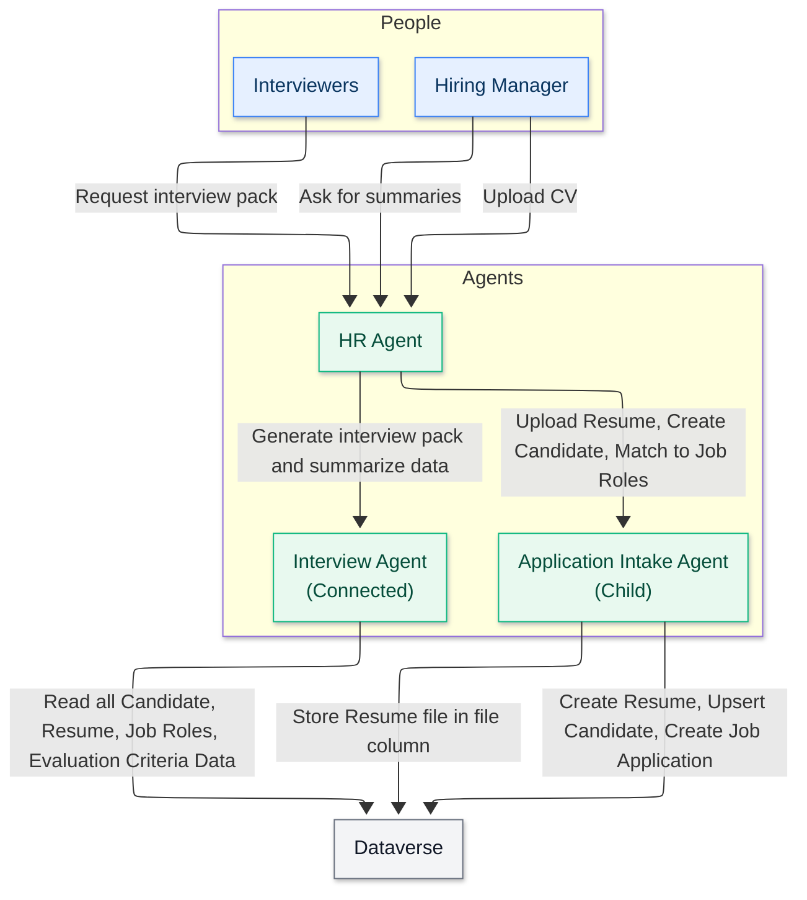
```mermaid
---
config:
  layout: elk
  look: neo
---
flowchart TB
 subgraph People["People"]
    direction TB
        HiringManager["Hiring Manager"]
        Interviewers["Interviewers"]
  end
 subgraph Agents["Agents"]
    direction LR
        ApplicationIntakeAgent["Application Intake Agent<br>(Child)"]
        InterviewAgent["Interview Agent<br>(Connected)"]
        HRAgent["HR Agent"]
  end
    HiringManager -- Upload CV --> HRAgent
    HRAgent -- Upload Resume, Create Candidate, Match to Job Roles --> ApplicationIntakeAgent
    ApplicationIntakeAgent -- Create Resume, Upsert Candidate, Create Job Application --> Dataverse["Dataverse"]
    ApplicationIntakeAgent -- Store Resume file in file column --> Dataverse
    HiringManager -- Ask for summaries --> HRAgent
    Interviewers -- Request interview pack --> HRAgent
    HRAgent -- Generate interview pack and summarize data --> InterviewAgent
    InterviewAgent -- Read all Candidate, Resume, Job Roles, Evaluation Criteria Data --> Dataverse
     HiringManager:::person
     Interviewers:::person
     ApplicationIntakeAgent:::agent
     InterviewAgent:::agent
     HRAgent:::agent
     Dataverse:::data
    classDef person fill:#e6f0ff,stroke:#3b82f6,color:#0b3660
    classDef agent fill:#e8f9ef,stroke:#10b981,color:#064e3b
    classDef data  fill:#f3f4f6,stroke:#6b7280,color:#111827
```

### 🤝 مسؤوليات وكيل استقبال الطلبات

- **تحليل محتوى السيرة الذاتية** من ملفات PDF المقدمة عبر الدردشة التفاعلية (في مهمة مستقبلية ستتعلم كيفية معالجة السير الذاتية تلقائيًا).
- **استخراج البيانات المنظمة** (الاسم، المهارات، الخبرة، التعليم)
- **مطابقة المرشحين مع الأدوار المفتوحة** بناءً على المؤهلات وخطاب التغطية
- **تخزين معلومات المرشحين** في Dataverse للمعالجة لاحقًا
- **تجنب التكرار في الطلبات** لتجنب إنشاء نفس المرشح مرتين، ومطابقة السجلات الموجودة باستخدام عنوان البريد الإلكتروني المستخرج من السيرة الذاتية.

### ⭐ لماذا يجب أن يكون وكيلًا فرعيًا

يتناسب وكيل استقبال الطلبات تمامًا كوكيل فرعي لأنه:

- متخصص في معالجة المستندات واستخراج البيانات
- لا يحتاج إلى نشر منفصل  
- جزء من حل التوظيف العام الذي يديره نفس الفريق
- يركز على مشغل معين (استلام سيرة ذاتية جديدة) ويتم استدعاؤه من وكيل التوظيف.

## 🔀 الوكيل المتصل: وكيل إعداد المقابلات  

سيكون المتخصص الثاني هو **وكيل إعداد المقابلات** - وكيل متصل يساعد في إنشاء مواد مقابلة شاملة وتقييم ردود المرشحين.

### 🤝 مسؤوليات وكيل إعداد المقابلات

- **إنشاء حزم المقابلات** مع معلومات الشركة، متطلبات الدور، ومعايير التقييم
- **إنشاء أسئلة المقابلة** المصممة خصيصًا للأدوار والخلفيات المرشحين
- **الإجابة على الأسئلة العامة** حول أدوار الوظائف والطلبات للتواصل مع أصحاب المصلحة

### ⭐ لماذا يجب أن يكون وكيلًا متصلًا

يعمل وكيل إعداد المقابلات بشكل أفضل كوكيل متصل لأنه:

- قد ترغب فرق اكتساب المواهب في استخدامه بشكل مستقل عبر عمليات التوظيف المتعددة
- يحتاج إلى قاعدة معرفية خاصة به حول أفضل ممارسات المقابلات ومعايير التقييم
- قد يرغب مديرو التوظيف المختلفون في تخصيص سلوكه لفرقهم
- يمكن إعادة استخدامه للمناصب الداخلية، وليس فقط التوظيف الخارجي

## 🧪 المختبر 2.1: إضافة وكيل استقبال الطلبات

هل أنت جاهز لتطبيق النظرية عمليًا؟ لنقم بإضافة أول وكيل فرعي إلى وكيل التوظيف الحالي الخاص بك.

### المتطلبات لإكمال هذه المهمة

ستحتاج إلى **إما**:

- **إكمال المهمة 01** وأن يكون لديك وكيل التوظيف جاهزًا، **أو**
- **استيراد حل البداية للمهمة 02** إذا كنت تبدأ من جديد أو تحتاج إلى اللحاق. [تحميل حل البداية للمهمة 02](https://aka.ms/agent-academy)

!!! note "استيراد الحل والبيانات النموذجية"
    إذا كنت تستخدم حل البداية، راجع [المهمة 01](../01-get-started/README.md) للحصول على تعليمات مفصلة حول كيفية استيراد الحلول والبيانات النموذجية إلى بيئتك.

### 2.1.1 إعداد الحل

1. داخل Copilot Studio، اختر النقاط الثلاث (...) أسفل الأدوات في التنقل الجانبي الأيسر.
1. اختر **الحلول**.  
    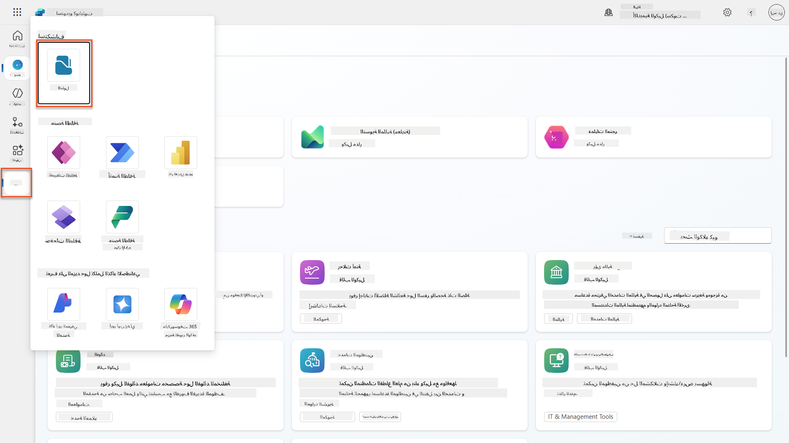
1. حدد حل Operative الخاص بك، اختر **النقاط الثلاث (...)** بجانبه، واختر **تعيين الحل المفضل**. سيضمن هذا أن يتم إضافة كل عملك إلى هذا الحل.  
    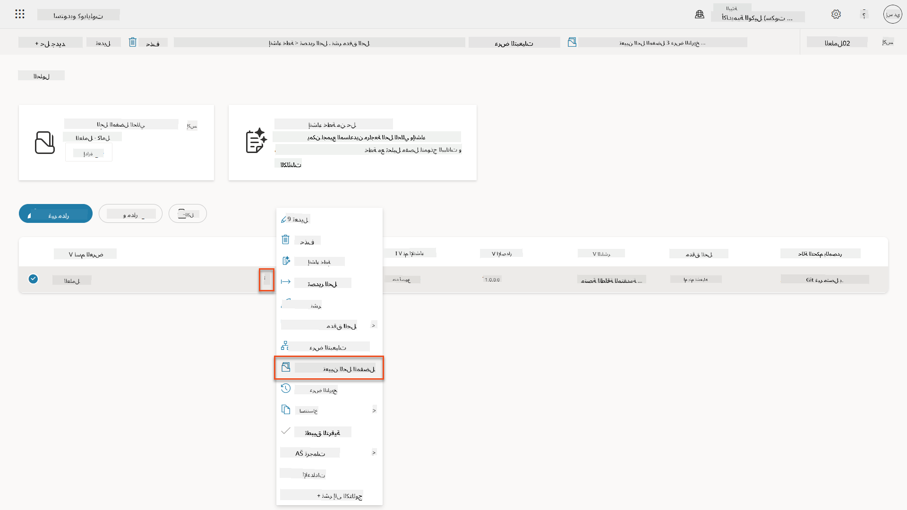

### 2.1.2 تكوين تعليمات وكيل التوظيف

1. **انتقل** إلى Copilot Studio. تأكد من تحديد بيئتك في الزاوية اليمنى العليا **محدد البيئة**.

1. افتح **وكيل التوظيف** الخاص بك من المهمة 01

1. اختر **تحرير** في قسم **التعليمات** من علامة التبويب **نظرة عامة**، وأضف التعليمات التالية في الأعلى:

    ```text
    You are the central orchestrator for the hiring process. You coordinate activities, provide summaries, and delegate work to specialized agents.
    ```

1. اختر **حفظ**  
    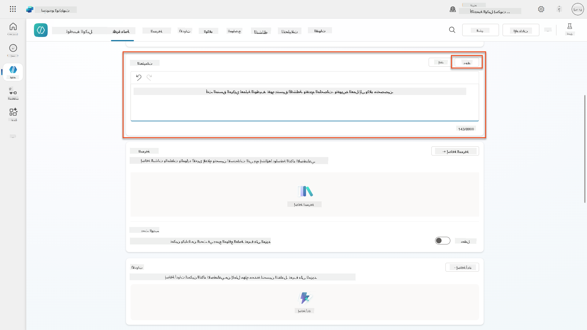

1. اختر **الإعدادات** (أعلى اليمين)

1. تأكد من الإعدادات التالية:

    | الإعداد | القيمة |
    |---------|-------|
    | استخدام تنظيم الذكاء الاصطناعي التوليدي لاستجابات الوكيل | **نعم** |
    | تعديل المحتوى | **متوسط** |
    | استخدام المعرفة العامة | **إيقاف** |
    | استخدام المعلومات من الويب | **إيقاف** |
    | تحميل الملفات | **تشغيل** |

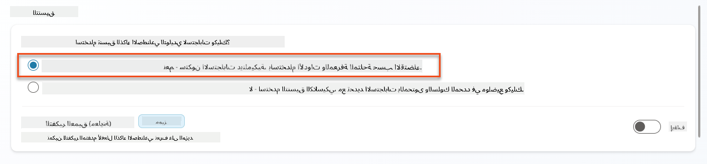
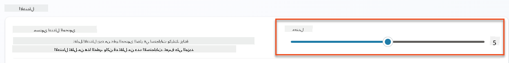


### 2.1.3 إضافة وكيل استقبال الطلبات الفرعي

1. **انتقل** إلى علامة التبويب **الوكلاء** داخل وكيل التوظيف الخاص بك - هذا هو المكان الذي ستضيف فيه الوكلاء المتخصصين.

1. اختر **+ إضافة** ثم **إنشاء وكيل**. لاحظ أن هذا مُشار إليه بـ "*إنشاء وكيل خفيف يعيش داخل وكيلك الحالي ويرث إعداداته. مثالي لتقسيم المنطق المعقد* "  
    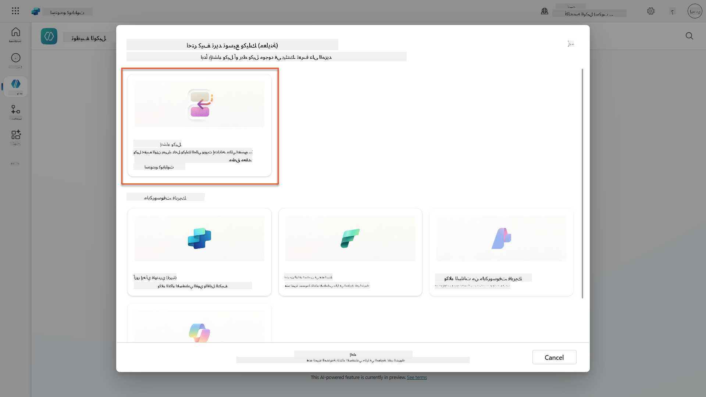

1. **قم بتسمية** وكيلك `وكيل استقبال الطلبات`

1. اختر **يختار الوكيل** - بناءً على الوصف في القائمة المنسدلة **متى سيتم استخدام هذا؟**. هذه الخيارات مشابهة للمشغلات التي يمكن تكوينها للمواضيع.

1. قم بتعيين **الوصف** ليكون:

    ```text
    Processes incoming resumes and stores candidates in the system
    ```

    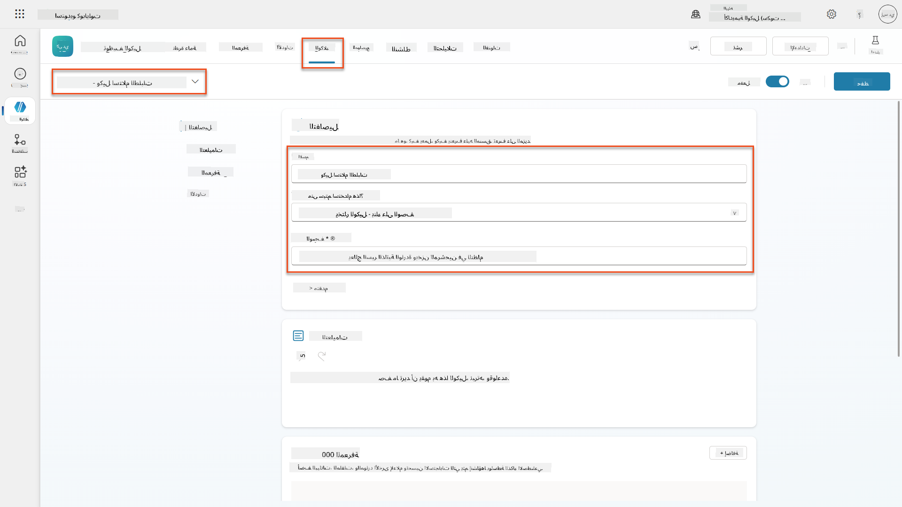

1. قم بتوسيع **خيارات متقدمة**، وقم بتعيين الأولوية لتكون `10000`. سيضمن هذا أنه لاحقًا سيتم استخدام وكيل المقابلات للإجابة على الأسئلة العامة قبل هذا الوكيل. يمكن أيضًا تعيين شرط هنا مثل التأكد من وجود مرفق واحد على الأقل.

1. تأكد من أن التبديل **بحث الويب** مضبوط على **معطل**. هذا لأننا نريد فقط استخدام المعلومات المقدمة من الوكيل الرئيسي.

1. اختر **حفظ**

### 2.1.4 تكوين تدفق وكيل تحميل السيرة الذاتية

لا يمكن للوكلاء تنفيذ أي إجراءات دون إعطائهم أدوات أو مواضيع.
نحن نستخدم أدوات **Agent Flow** بدلاً من Topics لخطوة *تحميل السيرة الذاتية* لأن هذه العملية الخلفية متعددة الخطوات تتطلب تنفيذًا حتميًا وتكاملًا مع الأنظمة الخارجية. بينما تعتبر Topics الأفضل لتوجيه الحوار التفاعلي، توفر Agent Flows الأتمتة المنظمة اللازمة لمعالجة الملفات بشكل موثوق، والتحقق من البيانات، وتحديث قواعد البيانات (إضافة جديدة أو تحديث الموجود) دون الاعتماد على تفاعل المستخدم.

1. ابحث عن قسم **الأدوات** داخل صفحة وكيل استلام الطلبات.
   **مهم:** هذا ليس علامة تبويب الأدوات الخاصة بالوكيل الرئيسي، بل يمكن العثور عليه إذا قمت بالتمرير لأسفل تحت تعليمات الوكيل الفرعي.

1. اختر **+ إضافة**
   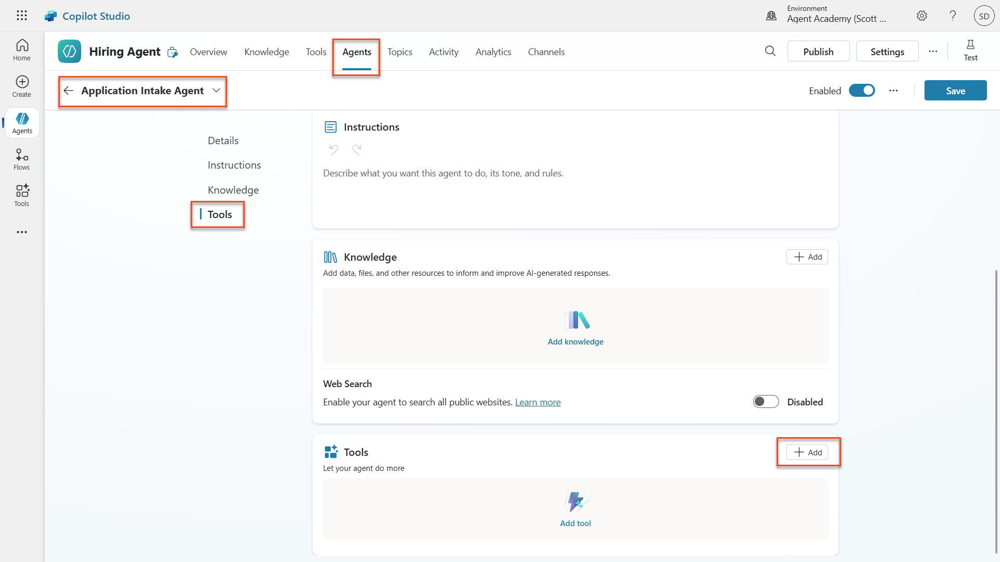

1. اختر **+ أداة جديدة** 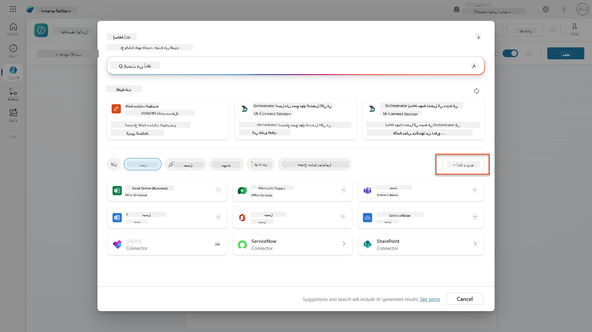

1. اختر **Agent flow**.
    ستفتح مصمم Agent Flow، وهنا سنضيف منطق تحميل السيرة الذاتية.  
    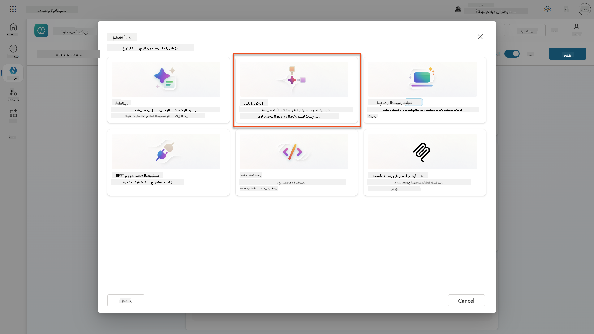

1. اختر عقدة **عندما يستدعي الوكيل التدفق**، واختر **+ إضافة** إدخال للمعلمات التالية، مع التأكد من إضافة الاسم والوصف.

    | النوع  | الاسم     | الوصف                                                                                                   |
    |-------|----------|---------------------------------------------------------------------------------------------------------------|
    | ملف  | السيرة الذاتية   | ملف PDF الخاص بالسيرة الذاتية                                                                                           |
    | نص  | الرسالة  | استخراج رسالة بأسلوب خطاب تغطية من السياق. يجب أن تكون الرسالة أقل من 2000 حرف.         |
    | نص  | بريد المستخدم الإلكتروني | عنوان البريد الإلكتروني الذي جاءت منه السيرة الذاتية. سيكون هذا المستخدم الذي يرفع السيرة الذاتية في الدردشة، أو عنوان البريد الإلكتروني إذا تم استلامها عبر البريد الإلكتروني. |

    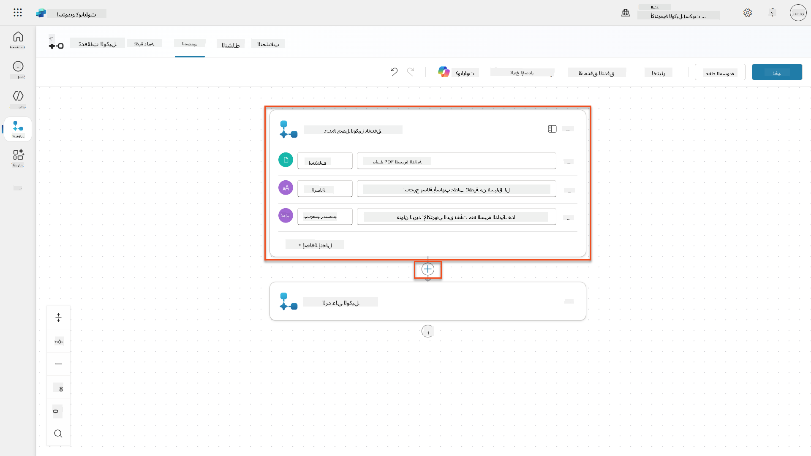

1. اختر **+ أيقونة** أسفل عقدة المشغل، وابحث عن `Dataverse`، واختر **عرض المزيد** بجانب Microsoft Dataverse، ثم اختر إجراء **إضافة صف جديد** في قسم **Microsoft Dataverse**  
    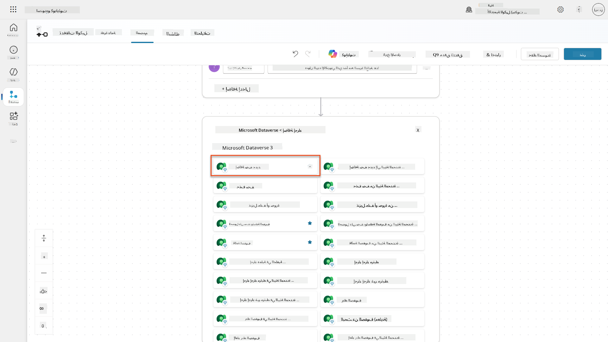

1. قم بتسمية العقدة **إنشاء السيرة الذاتية**، عن طريق اختيار **النقاط الثلاث (...)**، واختيار **إعادة تسمية**  
    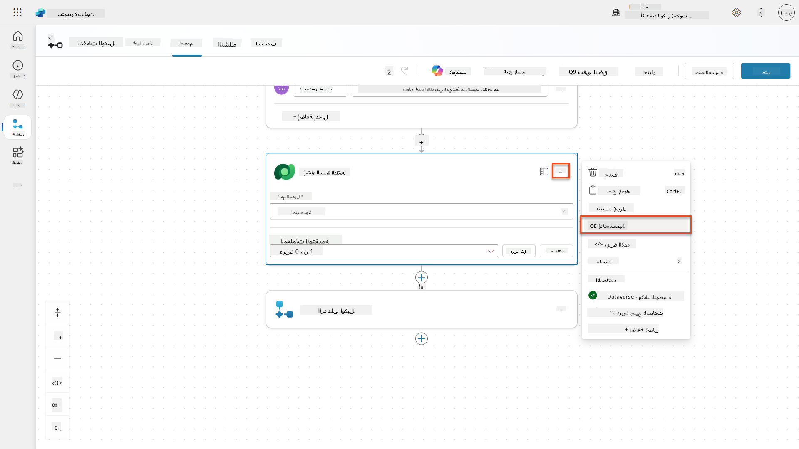

1. قم بتعيين **اسم الجدول** إلى **السير الذاتية**، ثم اختر **عرض الكل**، لعرض جميع المعلمات.

1. قم بتعيين الخصائص التالية:

    | الخاصية                 | كيفية التعيين                      | التفاصيل / التعبير                                         |
    | ------------------------ | ------------------------------- | ------------------------------------------------------------ |
    | **عنوان السيرة الذاتية**         | بيانات ديناميكية (أيقونة البرق) | **عندما يستدعي الوكيل التدفق** → **اسم السيرة الذاتية**    إذا لم ترَ اسم السيرة الذاتية، تأكد من أنك قمت بتكوين معلمة السيرة الذاتية أعلاه كنوع بيانات. |
    | **خطاب التغطية**         | تعبير (أيقونة fx)            | `if(greater(length(triggerBody()?['text']), 2000), substring(triggerBody()?['text'], 0, 2000), triggerBody()?['text'])` |
    | **عنوان البريد الإلكتروني المصدر** | بيانات ديناميكية (أيقونة البرق) | **عندما يستدعي الوكيل التدفق** → **بريد المستخدم الإلكتروني**             |
    | **تاريخ التحميل**          | تعبير (أيقونة fx)            | `utcNow()`                                                   |

    

1. اختر **+ أيقونة** أسفل عقدة إنشاء السيرة الذاتية، وابحث عن `Dataverse`، واختر **عرض المزيد** بجانب Microsoft Dataverse، ثم اختر إجراء **تحميل ملف أو صورة**.
   **مهم:** تأكد من عدم اختيار إجراء تحميل ملف أو صورة إلى البيئة المحددة.

1. قم بتسمية العقدة **تحميل ملف السيرة الذاتية**، عن طريق اختيار **النقاط الثلاث (...)**، واختيار **إعادة تسمية**

1. قم بتعيين الخصائص التالية:

     | الخاصية | كيفية التعيين | التفاصيل |
     |----------|------------|---------|
     | **اسم المحتوى** | بيانات ديناميكية (أيقونة البرق) | عندما يستدعي الوكيل التدفق → اسم السيرة الذاتية |
     | **اسم الجدول** | اختر | السير الذاتية |
     | **معرف الصف** | بيانات ديناميكية (أيقونة البرق) | إنشاء السيرة الذاتية → عرض المزيد → السيرة الذاتية |
     | **اسم العمود** | اختر | PDF السيرة الذاتية |
     | **المحتوى** | بيانات ديناميكية (أيقونة البرق) | عندما يستدعي الوكيل التدفق → contentBytes السيرة الذاتية |

     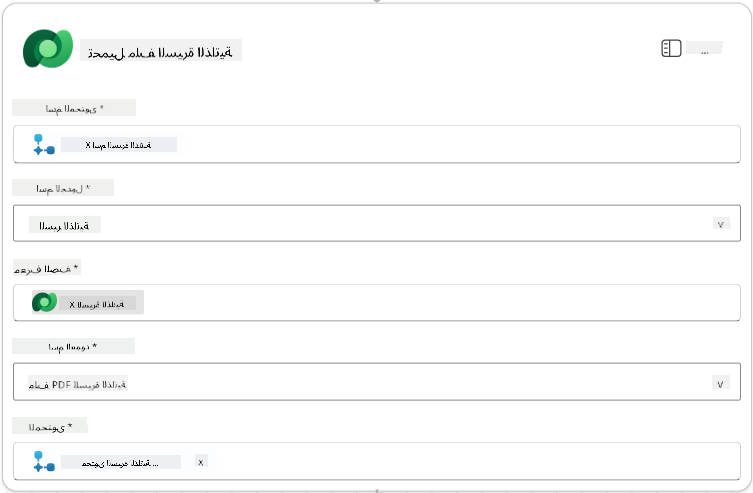

1. اختر عقدة **الرد على الوكيل**، ثم اختر **+ إضافة مخرج**

     | الخاصية | كيفية التعيين | التفاصيل |
     |----------|------------|---------|
     | **النوع** | اختر | `نص` |
     | **الاسم** | أدخل | `رقم السيرة الذاتية` |
     | **القيمة** | بيانات ديناميكية (أيقونة البرق) | إنشاء السيرة الذاتية → عرض المزيد → رقم السيرة الذاتية |
     | **الوصف** | أدخل | `رقم [رقم السيرة الذاتية] للسيرة الذاتية التي تم إنشاؤها` |

     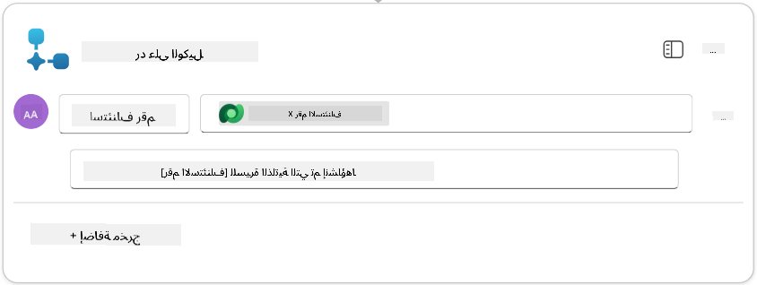

1. اختر **حفظ كمسودة** في الزاوية العلوية اليمنى  
     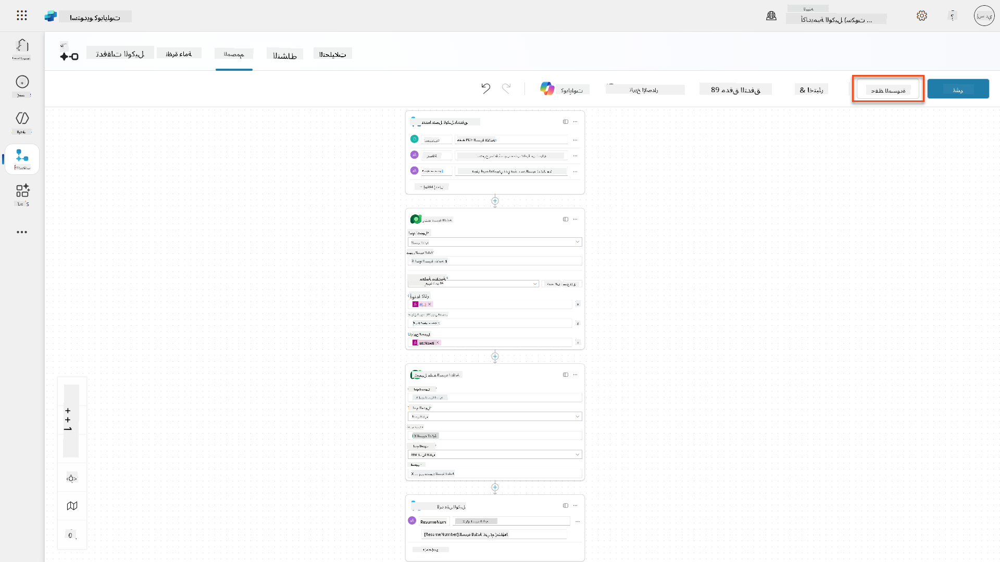

1. اختر علامة تبويب **نظرة عامة**، اختر **تعديل** في لوحة **التفاصيل**

     1. **اسم التدفق**:`تحميل السيرة الذاتية`
     1. **الوصف**:`تحميل السيرة الذاتية عند الطلب`

     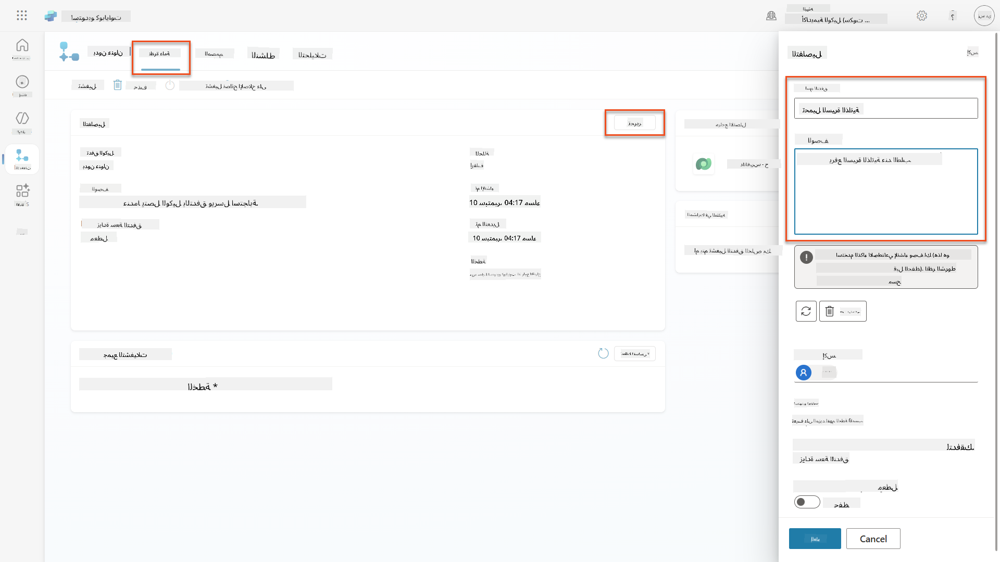

1. اختر علامة تبويب **المصمم** مرة أخرى، واختر **نشر**.  
     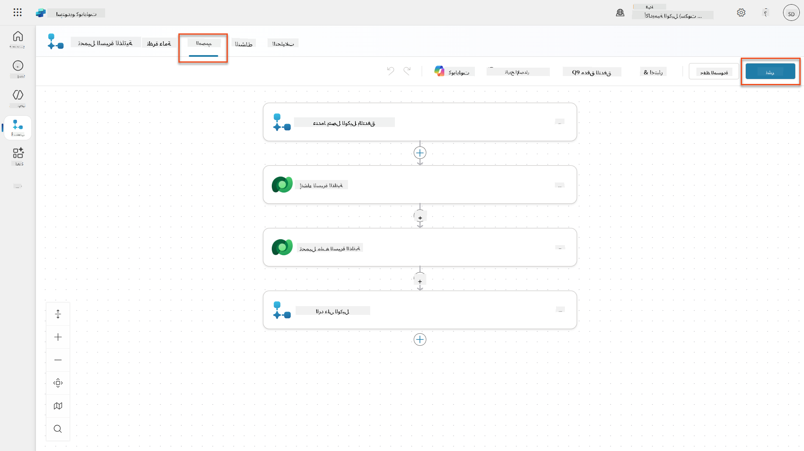

### 2.1.5 ربط التدفق بوكيلك

الآن ستقوم بربط التدفق المنشور بوكيل استلام الطلبات الخاص بك.

1. انتقل إلى **وكيل التوظيف** واختر علامة تبويب **الوكلاء**. افتح **وكيل استلام الطلبات**، ثم ابحث عن لوحة **الأدوات**.  
    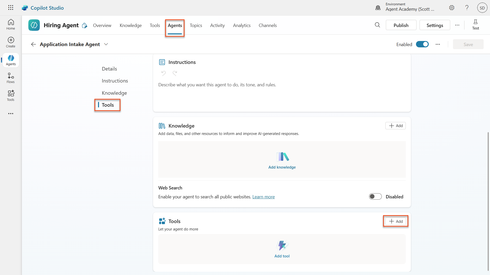

1. اختر **+ إضافة**

1. اختر فلتر **التدفق**، وابحث عن `تحميل السيرة الذاتية`. اختر تدفق **تحميل السيرة الذاتية**، ثم **إضافة وتكوين**.

1. قم بتعيين المعلمات التالية:

    | المعلمة | القيمة |
    |-----------|-------|
    | **الوصف** | `تحميل السيرة الذاتية عند الطلب. قاعدة صارمة: لا تستدعي هذه الأداة إلا عند الإشارة إليها في النموذج "تحميل السيرة الذاتية" وهناك مرفقات` |
    | **تفاصيل إضافية → متى يمكن استخدام هذه الأداة** | `فقط عند الإشارة إليها بواسطة Topics أو الوكلاء` |
    | **الإدخالات → إضافة إدخال** | `contentBytes` |
    | **الإدخالات → إضافة إدخال** | `name` |

    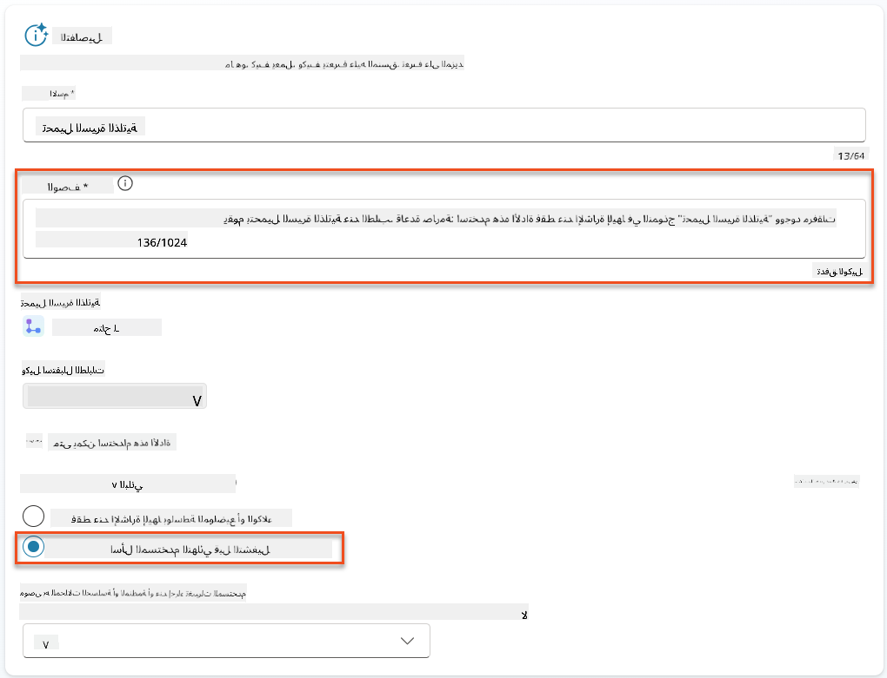

    

1. بعد ذلك قم بتعيين خصائص الإدخالات كما يلي:

    | معلمة الإدخال | الخاصية | التفاصيل |
    |-----------------|----------|---------|
    | **contentBytes** | ملء باستخدام | قيمة مخصصة |
    |                  | القيمة (...→صيغة→إدراج) | `First(System.Activity.Attachments).Content` |
    | **name** | ملء باستخدام | قيمة مخصصة |
    |          | القيمة (...→صيغة→إدراج) | `First(System.Activity.Attachments).Name` |
    | **الرسالة** | تخصيص | تكوين إعدادات مخصصة |
    |             | الوصف | `استخراج رسالة بأسلوب خطاب تغطية من السياق. تأكد من عدم مطالبة المستخدم وإنشاء على الأقل خطاب تغطية بسيط من السياق المتاح. قاعدة صارمة - يجب أن تكون الرسالة أقل من 2000 حرف.` |
    |             | عدد المحاولات | لا تكرر |
    |             | الإجراء إذا لم يتم العثور على كيان | تعيين المتغير إلى قيمة |
    |             | القيمة الافتراضية للكيان | تحميل السيرة الذاتية |
    | **بريد المستخدم الإلكتروني** | ملء باستخدام | قيمة مخصصة |
    |  | القيمة (...→صيغة→إدراج) | `System.User.Email` |

    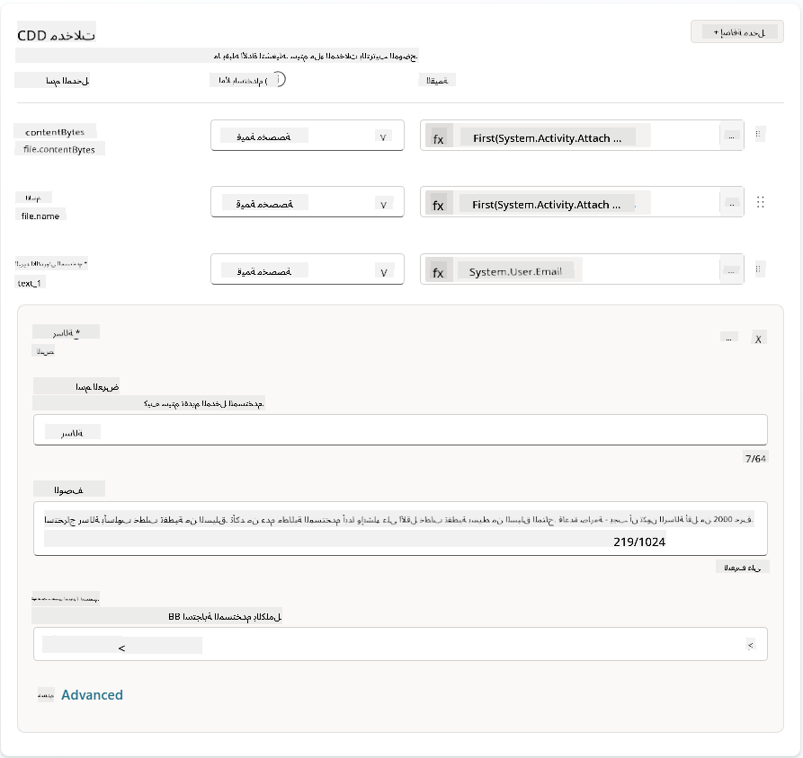

1. اختر **حفظ**

### 2.1.6 تعريف تعليمات الوكيل

1. عد إلى **وكيل استلام الطلبات** عن طريق اختيار علامة تبويب **الوكلاء**، ثم ابحث عن لوحة **التعليمات**.

1. في حقل **التعليمات**، قم بلصق التوجيهات الواضحة التالية لوكيلك الفرعي:

    ```text
    You are tasked with managing incoming Resumes, Candidate information, and creating Job Applications.  
    Only use tools if the step exactly matches the defined process. Otherwise, indicate you cannot help.  
    
    Process for Resume Upload via Chat  
    1. Upload Resume  
      - Trigger only if /System.Activity.Attachments contains exactly one new resume.  
      - If more than one file, instruct the user to upload one at a time and stop.  
      - Call /Upload Resume once. Never upload more than once for the same message.  
    
    2. Post-Upload  
      - Always output the [ResumeNumber] (R#####).  
    ```

1. حيث تتضمن التعليمات شرطة مائلة (/)، اختر النص الذي يلي / واختر الاسم المحل.

    - `System.Activity.Attachments` (متغير)
    - `تحميل السيرة الذاتية` (أداة)

    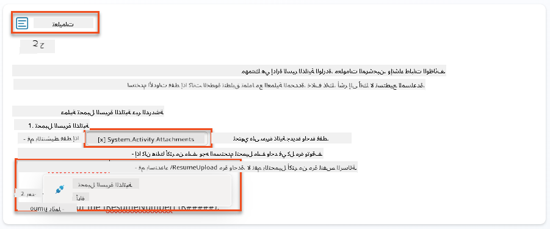

1. اختر **حفظ**

### 2.1.7 اختبار وكيل استلام الطلبات الخاص بك

الآن دعنا نتحقق من أن أول عضو في الأوركسترا يعمل بشكل صحيح.

1. **قم بتنزيل** [السير الذاتية التجريبية.](https://download-directory.github.io/?url=https://github.com/microsoft/agent-academy/tree/main/operative/sample-data/resumes&filename=operative_sampledata)

1. **قم بتبديل** لوحة الاختبار عن طريق اختيار **اختبار**.

1. **قم بتحميل** سيرتين ذاتيتين في دردشة الاختبار، وأعط الرسالة `قم بمعالجة هذه السير الذاتية`

    - يجب أن يعيد الوكيل رسالة مشابهة لـ *يمكن تحميل سيرة ذاتية واحدة فقط في كل مرة. يرجى تحميل سيرة ذاتية واحدة للمتابعة.*

    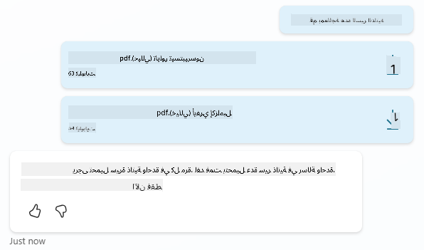

1. حاول تحميل **سيرة ذاتية واحدة فقط**، مع الرسالة `قم بمعالجة هذه السيرة الذاتية`

    - يجب أن يعطي الوكيل رسالة مشابهة لـ *تم تحميل السيرة الذاتية لـ Avery Example بنجاح. رقم السيرة الذاتية هو R10026.*

1. في **خريطة النشاط**، يجب أن ترى **وكيل استلام الطلبات** يتعامل مع تحميل السيرة الذاتية.  
    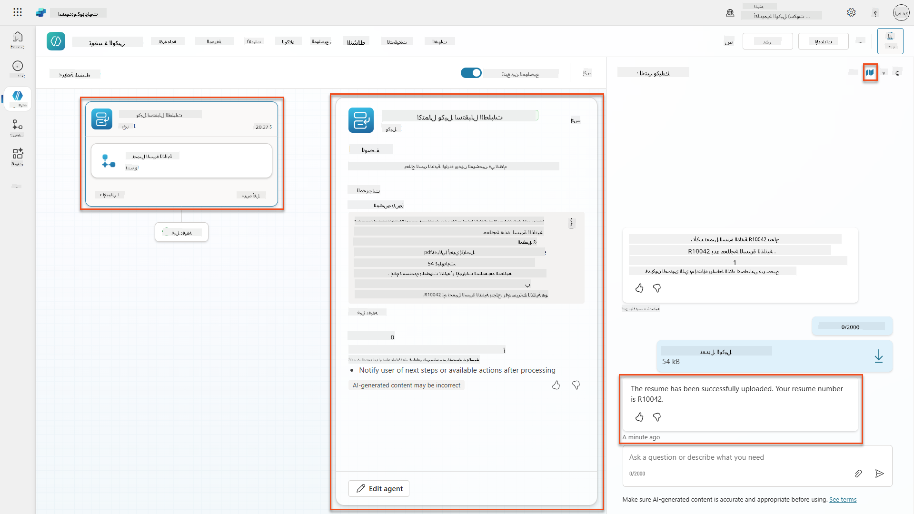

1. انتقل إلى make.powerapps.com → تأكد من تحديد بيئتك في الزاوية العلوية اليمنى من منتقي البيئة.

1. اختر **التطبيقات** → Hiring Hub → قائمة النقاط (...) → **تشغيل**  
    

    ملاحظة: إذا كانت زر التشغيل غير نشط فهذا يعني أنك لم تنشر الحل الخاص بك من المهمة 01. اختر **الحلول** → **نشر جميع التخصيصات**.

1. انتقل إلى **السير الذاتية**، وتحقق من أن ملف السيرة الذاتية تم تحميله وخطاب التغطية تم تعيينه وفقًا لذلك.  
    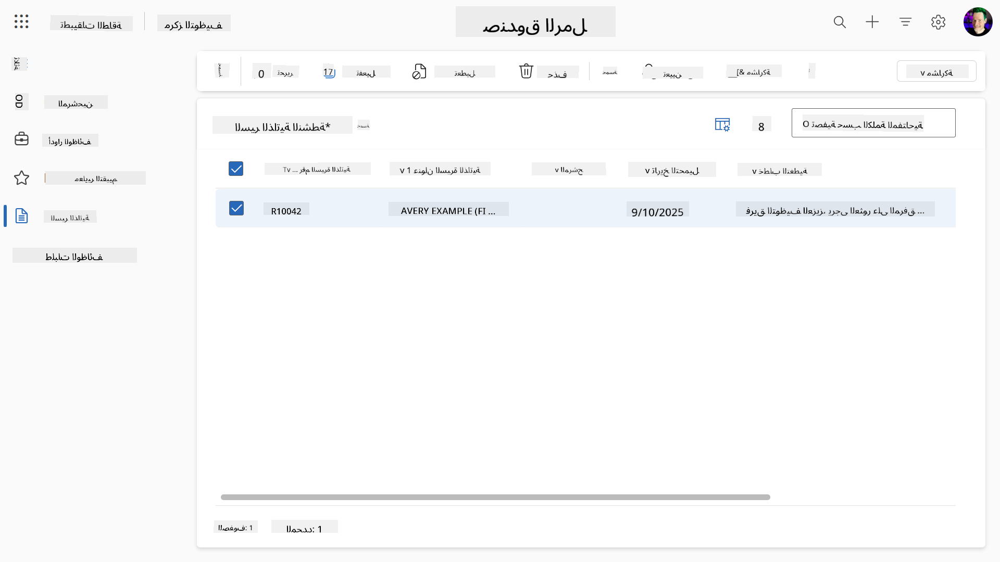

## 🧪المختبر 2.2: إضافة وكيل التحضير للمقابلة المتصل

الآن دعنا ننشئ وكيلنا المتصل للتحضير للمقابلة ونضيفه إلى وكيل التوظيف الخاص بك.

### 2.2.1 إنشاء وكيل المقابلة المتصل

1. **انتقل** إلى Copilot Studio. تأكد من أن بيئتك لا تزال محددة في الزاوية العلوية اليمنى من منتقي البيئة.

1. افتح **وكيل التوظيف الخاص بك**

1. انتقل إلى علامة تبويب الوكيل، واختر **+ إضافة وكيل**

1. اختر **ربط وكيل موجود** → **Copilot Studio**

1. اختر **+ وكيل جديد**

### 2.2.2 تكوين الإعدادات الأساسية

1. اختر علامة تبويب **التكوين**، وأدخل الخصائص التالية:

    - **الاسم**: `وكيل المقابلة`
    - **الوصف**: `يساعد في عملية المقابلة.`

1. التعليمات:

    ```text
    You are the Interview Agent. You help interviewers and hiring managers prepare for interviews. You never contact candidates. 
    Use Knowledge to help with interview preparation. 
    
    The only valid identifiers are:
      - ResumeNumber (ppa_resumenumber)→ format R#####
      - CandidateNumber (ppa_candidatenumber)→ format C#####
      - ApplicationNumber (ppa_applicationnumber)→ format A#####
      - JobRoleNumber (ppa_jobrolenumber)→ format J#####
    
    Examples you handle
      - Give me a summary of ...
      - Help me prepare to interview candidates for the Power Platform Developer role
      - Create interview assistance for the candidates for Power Platform Developer
      - Give targeted questions for Candidate Alex Johnson focusing on the criteria for the Job Application
      
    How to work:
        You are expected to ask clarification questions if required information for queries is not provided
        - If asked for interview help without providing a job role, ask for it
        - If asking for interview questions, ask for the candidate and job role if not provided.
    
    General behavior
    - Do not invent or guess facts
    - Be concise, professional, and evidence-based
    - Map strengths and risks to the highest-weight criteria
    - If data is missing (e.g., no resume), state what is missing and ask for clarification
    - Never address or message a candidate
    ```

1. قم بتبديل **البحث على الويب** إلى **معطل**

1. اختر **إنشاء**  
    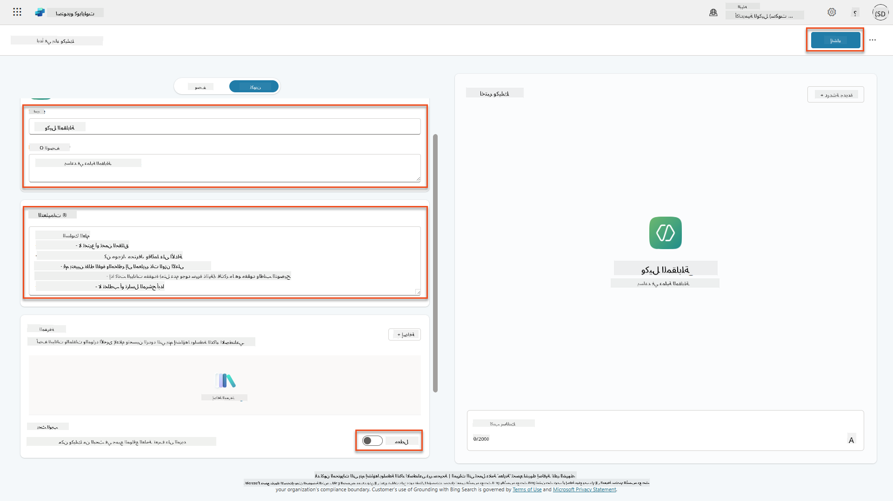

### 2.2.3 تكوين الوصول إلى البيانات والنشر

1. في قسم **المعرفة**، اختر **+ إضافة معرفة**  
    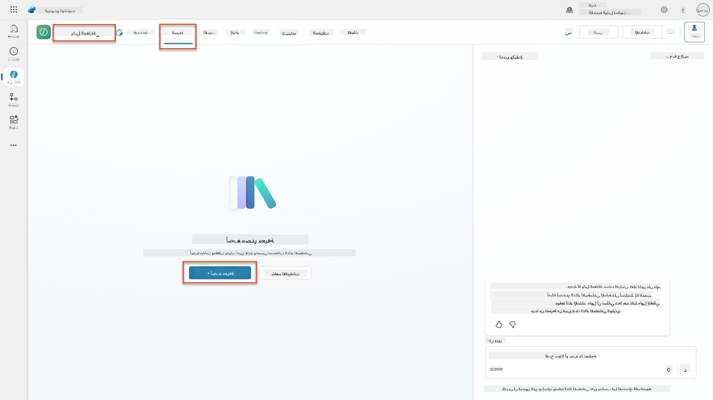
1. اختر **Dataverse**  
    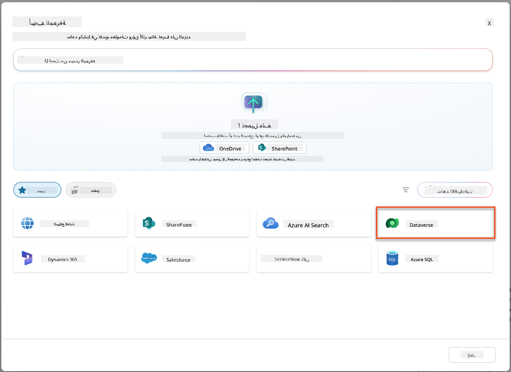
1. في **مربع البحث**، اكتب `ppa_`. هذا هو البادئة للجداول التي قمت باستيرادها سابقًا.
1. **اختر** جميع الجداول الخمسة (المرشح، معايير التقييم، طلب الوظيفة، دور الوظيفة، السيرة الذاتية)
1. اختر **إضافة إلى الوكيل**  
    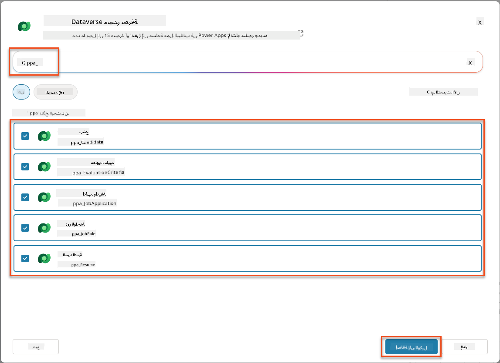
1. اختر **الإعدادات**، على وكيل المقابلة، وقم بتعيين الإعدادات التالية:

    - **السماح للوكلاء الآخرين بالاتصال واستخدام هذا الوكيل:** `تشغيل`
    - **استخدام المعرفة العامة**: `إيقاف`
    - **تحميل الملفات**: `إيقاف`
    - **مستوى مراقبة المحتوى:** `متوسط`
1. اختر **حفظ**
1. اختر **نشر**، وانتظر حتى يكتمل النشر.

### 2.2.4 ربط وكيل التحضير للمقابلة بوكيل التوظيف الخاص بك

1. عد إلى **وكيل التوظيف الخاص بك**

1. اختر علامة تبويب **الوكلاء**

1. استخدم **+إضافة وكيل** → **Copilot Studio**، لإضافة **وكيل المقابلة**. قم بتعيين الوصف ليكون:
    ```text
    Assists with the interview process and provides information about Resumes, Candidates, Job Roles, and Evaluation Criteria.
    ```

    
    لاحظ أن خيار تمرير سجل المحادثة إلى هذا الوكيل محدد. يتيح ذلك للوكيل الرئيسي تقديم السياق الكامل للوكيل المتصل.

1. اختر **إضافة وكيل**

1. تأكد من أنك ترى كلا من **وكيل استلام الطلبات** و **وكيل المقابلة**. لاحظ كيف أن أحدهما وكيل فرعي والآخر وكيل متصل.  
    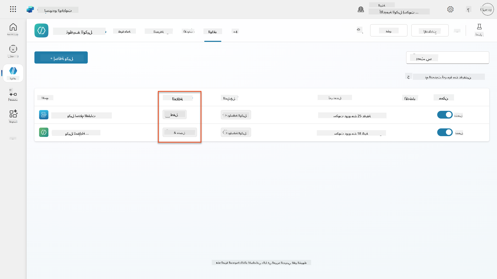

### 2.2.5 اختبار التعاون بين الوكلاء المتعددين

1. **قم بفتح** لوحة الاختبار عن طريق اختيار **اختبار**.

1. **قم برفع** أحد السير الذاتية التجريبية، وأدخل الوصف التالي الذي يخبر الوكيل الرئيسي بما يمكنه تفويضه للوكيل المتصل:

    ```text
    Upload this resume, then show me open job roles, each with a description of the evaluation criteria, then use this to match the resume to at least one suitable job role even if not a perfect match.
    ```

    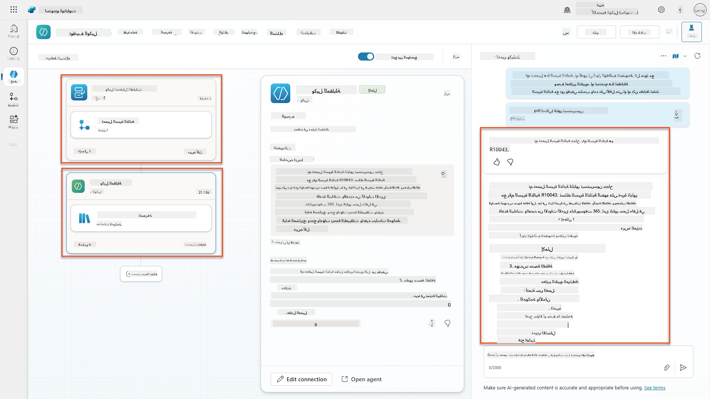

1. لاحظ كيف قام وكيل التوظيف بتفويض عملية الرفع إلى الوكيل الفرعي، ثم طلب من وكيل المقابلة تقديم ملخص وتطابق الوظيفة باستخدام معرفته.  
   جرب طرقًا مختلفة لطرح الأسئلة حول السير الذاتية، الأدوار الوظيفية ومعايير التقييم.  
   **أمثلة:**

    ```text
    Give me a summary of active resumes
    ```

    ```text
    Summarize resume R10044
    ```

    ```text
    Which active resumes are suitable for the Power Platform Developer role?
    ```

## 🎉 المهمة مكتملة

عمل رائع، أيها الوكيل! **عملية السيمفونية** الآن مكتملة. لقد نجحت في تحويل وكيل التوظيف الفردي الخاص بك إلى أوركسترا متعددة الوكلاء بقدرات متخصصة.

إليك ما أنجزته في هذه المهمة:

**✅ إتقان بنية الوكلاء المتعددين**  
أصبحت الآن تفهم متى تستخدم الوكلاء الفرعيين مقابل الوكلاء المتصلين وكيفية تصميم أنظمة قابلة للتوسع.

**✅ وكيل استلام الطلبات الفرعي**  
لقد أضفت وكيلًا فرعيًا متخصصًا إلى وكيل التوظيف الخاص بك لمعالجة السير الذاتية، استخراج بيانات المرشحين، وتخزين المعلومات في Dataverse.

**✅ وكيل تحضير المقابلة المتصل**  
لقد أنشأت وكيلًا متصلًا قابلًا لإعادة الاستخدام لتحضير المقابلات وربطته بنجاح مع وكيل التوظيف الخاص بك.

**✅ تواصل الوكلاء**  
لقد رأيت كيف يمكن لوكيلك الرئيسي التنسيق مع الوكلاء المتخصصين، مشاركة السياق، وتنظيم سير العمل المعقد.

**✅ أساس الاستقلالية**  
نظام التوظيف المحسن الخاص بك أصبح الآن جاهزًا للميزات المتقدمة التي سنضيفها في المهام القادمة: المشغلات الذاتية، مراقبة المحتوى، والتفكير العميق.

🚀**التالي:** في مهمتك القادمة، ستتعلم كيفية إعداد وكيلك لمعالجة السير الذاتية تلقائيًا من البريد الإلكتروني!

⏩[انتقل إلى المهمة 03: أتمتة وكيلك باستخدام المشغلات](../03-automate-triggers/README.md)

## 📚 موارد تكتيكية

📖 [إضافة وكلاء آخرين (معاينة)](https://learn.microsoft.com/microsoft-copilot-studio/authoring-add-other-agents?WT.mc_id=power-182762-scottdurow)

📖 [إضافة أدوات إلى الوكلاء المخصصين](https://learn.microsoft.com/microsoft-copilot-studio/advanced-plugin-actions?WT.mc_id=power-182762-scottdurow)

📖 [العمل مع Dataverse في Copilot Studio](https://learn.microsoft.com/microsoft-copilot-studio/knowledge-add-dataverse?WT.mc_id=power-182762-scottdurow)

📖 [نظرة عامة على تدفقات الوكلاء](https://learn.microsoft.com/microsoft-copilot-studio/flows-overview?WT.mc_id=power-182762-scottdurow)

📖 [إنشاء حل](https://learn.microsoft.com/power-platform/alm/solution-concepts-alm?WT.mc_id=power-182762-scottdurow)

📖 [دليل إدارة دورة حياة الحلول في Power Platform](https://learn.microsoft.com/power-platform/alm/overview-alm?WT.mc_id=power-182762-scottdurow)

📺 [التعاون بين الوكلاء في Copilot Studio](https://youtu.be/d-oD3pApHAg?si=rwIHKhJTkjSvhTHw)

---

**إخلاء المسؤولية**:  
تم ترجمة هذا المستند باستخدام خدمة الترجمة بالذكاء الاصطناعي [Co-op Translator](https://github.com/Azure/co-op-translator). بينما نسعى لتحقيق الدقة، يرجى العلم أن الترجمات الآلية قد تحتوي على أخطاء أو عدم دقة. يجب اعتبار المستند الأصلي بلغته الأصلية المصدر الموثوق. للحصول على معلومات حاسمة، يُوصى بالترجمة البشرية الاحترافية. نحن غير مسؤولين عن أي سوء فهم أو تفسيرات خاطئة ناتجة عن استخدام هذه الترجمة.