<!--
CO_OP_TRANSLATOR_METADATA:
{
  "original_hash": "75efaf515d5694d4fd549bfd6518901a",
  "translation_date": "2025-10-22T19:11:41+00:00",
  "source_file": "docs/operative-preview/03-automate-triggers/README.md",
  "language_code": "ar"
}
-->
# المهمة 03: إضافة مشغلات الأحداث للعمل بشكل مستقل

--8<-- "disclaimer.md"

## 🕵️‍♂️ الاسم الرمزي: `عملية نقطة الإشارة`

> **⏱️ مدة العملية:** `~45 دقيقة`

## 🎯 ملخص المهمة

مرحبًا بك مجددًا، أيها العميل. في [المهمة 02](../02-multi-agent/README.md) - تعلمت كيفية بناء وكيل فرعي لتقديم الطلبات ووكيل متصل لتحضير المقابلات لتوسيع قدرات وكيل التوظيف الرئيسي الخاص بك.

مهمتك، إذا اخترت قبولها، هي **عملية نقطة الإشارة** - التعمق في **مشغلات الأحداث** - لترقية نظام الوكيل الخاص بك من كونه تفاعليًا إلى **عملية مستقلة**. ستقوم بتحويل وكلائك من انتظار إدخال المستخدم إلى الاستجابة بشكل استباقي للأحداث الخارجية واتخاذ إجراءات ذكية دون إشراف.

فكر في الأمر كترقية من وكلاء يجيبون على الأسئلة إلى وكلاء يتوقعون الاحتياجات ويتصرفون بشكل مستقل. من خلال مشغلات الأحداث وسير العمل الآلي، سيتمكن وكيل التوظيف الخاص بك من اكتشاف رسائل البريد الإلكتروني الواردة التي تحتوي على السير الذاتية، ومعالجة المرفقات تلقائيًا، وتخزين البيانات في Dataverse، وإخطار فريق التوظيف الخاص بك عبر Microsoft Teams - كل ذلك بينما تركز على المهام ذات القيمة الأعلى.

مرحبًا بك في عالم حيث تلتقي الأتمتة بالذكاء.

## 🔎 الأهداف

في هذه المهمة، ستتعلم:

1. كيف تمكن مشغلات الأحداث الوكلاء من التصرف بشكل مستقل دون تفاعل المستخدم.
1. الفروقات بين الوكلاء التفاعليين والمستقلين في Copilot Studio.
1. كيفية إنشاء مشغلات أحداث تعالج مرفقات البريد الإلكتروني تلقائيًا وترفع الملفات إلى Dataverse.
1. كيفية بناء تدفقات وكلاء تنشر بطاقات تكيفية إلى قنوات Teams للإشعارات.
1. كيفية تمرير البيانات بين مشغلات الأحداث وتدفقات الوكلاء لتحقيق الأتمتة من البداية إلى النهاية.

## 🤔 ما هو مشغل الحدث؟

في [Recruit](../../recruit/10-add-event-triggers/README.md)، تعلمنا عن مشغلات الأحداث. دعونا نعيد النظر في هذا الموضوع بسرعة في حال فاتك.

**مشغلات الأحداث** تسمح للوكيل بالتصرف بمفرده عندما يحدث شيء في نظام آخر - دون الحاجة إلى رسالة من المستخدم. عندما يتم تشغيل الحدث المُعد - مثل "عنصر جديد في SharePoint"، "بريد إلكتروني جديد"، "مهمة في Planner تم تعيينها"، أو حتى تكرار زمني، يقوم الموصل بإرسال حمولة مشغل إلى وكيلك. ثم يتبع الوكيل تعليماتك لتحديد الإجراءات أو المواضيع التي يجب استدعاؤها.

### الخصائص الرئيسية

- **التفعيل المستقل:**
      - على عكس مشغلات المواضيع التي تبدأ عندما يكتب المستخدم للوكيل، مشغلات الأحداث تعمل من الأحداث الخارجية، مما يمكن السلوك الاستباقي.

- **مدفوعة بالحمولة:**
      - كل حدث يقدم حمولة (متغيرات + تعليمات اختيارية) عبر موصل. يستخدم الوكيل تعليماتك المحددة والحمولة لتحديد ما يجب فعله بعد ذلك.
      - على سبيل المثال _استدعاء موضوع_ أو _تنفيذ إجراءات محددة بواسطة الأدوات_.

- **أمثلة جاهزة:**
      - ملف أو عنصر تم إنشاؤه في SharePoint/OneDrive
      - مهمة في Planner تم إكمالها/تعيينها
      - استجابة Microsoft Forms تم تقديمها
      - تكرار/جدولة

    تعتمد التوفر على سياسات البيانات الخاصة بمؤسستك والمُعدة في Power Automate.

- **يتطلب التنسيق التوليدي:**
      - مشغلات الأحداث متاحة فقط عندما يتم تمكين التنسيق التوليدي للوكيل.

- **الفوترة/الاستخدام:**
      - كل تسليم مشغل يُحسب كرسالة نحو سعة Copilot Studio.
      - على سبيل المثال، تكرار كل 10 دقائق يرسل رسالة كل 10 دقائق.

- **نموذج المصادقة والإعداد:**
      - تضيف المشغلات داخل نظرة عامة على الوكيل، تحت _مشغلات_. تستخدم المصادقة لموصل المشغل حساب منشئ الوكيل ("مصادقة مؤلف الوكيل").
      - يمكنك تحرير معلمات المشغل والحمولة في بوابة منشئ Power Automate.

- **الاختبار والمراقبة:**
      - يمكنك اختبار المشغلات من لوحة اختبار الوكيل وفحص السلوك باستخدام خريطة النشاط قبل النشر.

!!! info "ملخص للمطورين"

    فكر في مشغلات الأحداث كإشارات تشبه **webhook** تدفع حمولة منظمة إلى وكيلك، مما يسمح له _ببدء_ العمل وربط الإجراءات عبر الأنظمة - دون انتظار المستخدم لطلب ذلك.

### مشغلات المواضيع - كيف تختلف

سابقًا تعلمت عن مشغلات المواضيع في [Recruit](../../recruit/07-add-new-topic-with-trigger/README.md)، ومع ذلك قد تتساءل كيف تختلف مشغلات _المواضيع_ عن مشغلات _الأحداث_، ولماذا هذا التمييز مهم لفهم ما يجعل الوكيل مستقلًا.

مشغلات المواضيع تتحكم في _متى يتم تشغيل الموضوع_، عادةً استجابةً لرسالة المستخدم.

- في التنسيق التوليدي، المشغل الافتراضي هو **بواسطة الوكيل** - يختار المخطط موضوعًا يتطابق اسمه/وصفه بشكل أفضل مع رسالة المستخدم.
- في التنسيق الكلاسيكي، المشغل الافتراضي هو **عبارات** - يختار المخطط موضوعًا عندما تتطابق عبارة أو عدة عبارات مشغلة بشكل أفضل مع رسالة المستخدم.

تشمل أنواع المشغلات الأخرى `رسالة مستلمة`، `حدث مستلم`، `نشاط مستلم`، `تحديث المحادثة`، `استدعاء مستلم`، `إعادة التوجيه`، `عدم النشاط`، و`إكمال الخطة`.

!!! info "الفرق الأساسي"

    مشغلات المواضيع هي _بداية نشاط المحادثة_ داخل الدردشة.
    
    مشغلات الأحداث هي _بداية النظام_ يتم تسليمها عبر الموصلات التي يمكنها تشغيل الوكيل دون أي محادثة على الإطلاق.

### دليل سريع لمشغل الموضوع مقابل مشغل الحدث

- **مشغل الموضوع:** المستخدم (أو نشاط الدردشة) قال/فعل X ➡️ تشغيل الموضوع T.
- **مشغل الحدث:** SharePoint/Planner/Email/Timer أطلق حمولة P ➡️ الوكيل يقيم التعليمات ➡️ استدعاء الإجراءات/المواضيع وفقًا لذلك.

## 🏓 مقارنة بين الوكيل التفاعلي والوكيل المستقل

الآن بعد أن تعرفت على الفرق بين مشغلات الأحداث ومشغلات المواضيع، دعنا نتعلم الفرق بين الوكيل التفاعلي والوكيل المستقل.

في مصطلحات Copilot Studio، "التفاعلي" يشير إلى الوكلاء الذين يتفاعلون بشكل أساسي عبر **المواضيع** في دردشة أو قناة. "المستقل" يشير إلى الوكلاء الذين يستفيدون أيضًا من **مشغلات الأحداث** للعمل دون إدخال المستخدم.

الجدول التالي يلخص اختلافاتهم وتشابهاتهم.

| البعد                              | الوكيل التفاعلي       | الوكيل المستقل                                                                                              |
|-------------------------------------|-----------------------|---------------------------------------------------------------------------------------------------------------|
| كيف يبدأ                           | المستخدم (أو نشاط الدردشة) يشغل موضوعًا. مثال: بواسطة الوكيل، عبارات، رسالة مستلمة.   | مشغل حدث خارجي يرسل حمولة عبر موصل إلى الوكيل. مثال: SharePoint، Planner، البريد الإلكتروني، الجدولة، إلخ. |
| الاستخدام الأساسي                  | الأسئلة والأجوبة، سير العمل الموجه، الإجراءات المدفوعة بالطلبات في الدردشة - Teams، الويب، إلخ.  | العمليات الاستباقية والأتمتة الخلفية - الرد على تغييرات النظام ثم الإخطار، الحفظ، أو تنظيم المهام. |
| سطح المشغل                         | مشغلات المواضيع: بواسطة الوكيل / عبارات / رسالة مستلمة / أنواع النشاط / استدعاء / عدم النشاط / إكمال الخطة | مكتبة مشغلات الأحداث عبر الموصلات؛ الحمولة تشمل بيانات الحدث + تعليمات اختيارية. |
| المخطط (التنسيق التوليدي)          | يتم استخدامه بشكل كبير لمشغلات بواسطة الوكيل وإكمال الخطة لاختيار/تسلسل المواضيع. | مطلوب لمشغلات الأحداث؛ يستخدم الوكيل التعليمات + الحمولة لتحديد الإجراءات/المواضيع التي يجب استدعاؤها. |
| المثال النموذجي                    | المستخدم يسأل "ما هي سياسة الاسترداد لدينا؟" → يتم تشغيل الموضوع، استعلام المعرفة، الرد. | مهمة جديدة في Planner تم تعيينها → يتم تشغيل مشغل الحدث → ينشر الوكيل رسالة Teams، يحدّث سجلًا، أو يستدعي موضوعًا. |
| مسار الإعداد                       | إنشاء المواضيع، تحديد نوع المشغل، تأليف الحوار/الإجراءات؛ النشر إلى القنوات. | إضافة مشغل حدث (نظرة عامة → مشغلات)، المصادقة على الموصل باستخدام بيانات اعتماد مؤلف الوكيل، تكوين الحمولة/التعليمات؛ الاختبار عبر لوحة الاختبار؛ النشر. |
| المصادقة والحوكمة                  | يعمل تحت سياق القناة/المصادقة؛ مشغلات المواضيع تستجيب لأنشطة الدردشة في القنوات المسموح بها. | توفر المشغل يعتمد على سياسات بيانات Power Automate؛ الموصلات تعمل تحت حساب منشئ الوكيل. |
| المراقبة                           | اختبار المواضيع داخل Copilot Studio، فحص نصوص المحادثة/الأنشطة. | استخدام اختبار المشغل وخريطة النشاط للتحقق من التنفيذ قبل النشر، مراقبة النشاط بعد النشر. |
| تأثير السعة                        | كل رسالة مستخدم/رد وكيل هي رسالة تستهلك السعة. | كل تسليم حدث هو أيضًا رسالة، بالإضافة إلى أي إجراءات لاحقة. مثال: تكرار كل 10 دقائق = 6 رسائل/ساعة |

### متى تستخدم أيهما؟

- اختر **مشغلات المواضيع (تفاعلية)** عندما يبدأ المستخدمون محادثة الوكيل - الأسئلة الشائعة، تقديم الطلبات الموجهة، أو المهام بأسلوب الأوامر داخل الدردشة. يقلل مشغل بواسطة الوكيل من الحاجة إلى تنسيق العبارات يدويًا.
- أضف **مشغلات الأحداث (مستقلة)** عندما يجب أن يبدأ الوكيل المحادثة أو يتخذ إجراءً بنفسه - عند التحديثات في SharePoint/Dataverse، البريد الإلكتروني الوارد، أو على جدول زمني. هذا ينقلك من العمليات التفاعلية إلى العمليات الاستباقية.

## نصائح للمطورين والنقاط المهمة

1. **قم بتمكين التنسيق التوليدي** لأي وكيل تريد جعله مستقلًا. مشغلات الأحداث لن تظهر بخلاف ذلك.

1. **قم بنمذجة الحمولة مبكرًا.** قرر ما هي الحقول الدنيا التي يحتاجها وكيلك من المشغل مثل `itemId`، `assignedTo`، `dueDate` وأضف تعليمات موجزة تخبر الوكيل بالإجراء/الموضوع الذي يجب استدعاؤه بناءً على قيم الحمولة.

1. **نطاق المصادقة مهم.** المشغلات تصادق باستخدام حساب منشئ الوكيل. تأكد من أن الحساب لديه الأذونات الصحيحة للموصل ويتوافق مع سياسات بيانات Power Automate.

1. **تحكم في التكلفة والضوضاء.** التكرارات عالية التردد أو المصادر كثيرة النشاط يمكن أن تزيد من استهلاك الرسائل بسرعة - قم بتقليلها حيثما أمكن أو أضف شروطًا في المشغل لتصفية الأحداث.

1. **اختبر قبل النشر.** استخدم **اختبار المشغل** وخريطة النشاط لمراقبة الخطة والإجراءات المستدعاة - قم بتكرار التعليمات/الحمولة حتى يصبح السلوك مستقرًا.

## 🧪 المختبر 03 - أتمتة رسائل البريد الإلكتروني لتقديم طلبات التوظيف

سنقوم الآن بإضافة مشغل حدث إلى **وكيل التوظيف** وبناء تدفق وكيل في الوكيل الفرعي **وكيل تقديم الطلبات** لمعالجة الطلبات بشكل مستقل.

### ✨ سيناريو الاستخدام

!!! info ""

    **بصفتي** مسؤول توظيف في الموارد البشرية

    **أريد** أن يتم إعلامي عند وصول بريد إلكتروني يحتوي على سيرة ذاتية إلى صندوق الوارد الخاص بي ويتم رفعه تلقائيًا إلى Dataverse

    **حتى أتمكن** من البقاء على اطلاع بالسير الذاتية المرسلة عبر البريد الإلكتروني للتقديمات التي يتم رفعها تلقائيًا إلى Dataverse

سنحقق ذلك باستخدام تقنيتين:

1. مشغل حدث عند وصول البريد الإلكتروني،
    1. التحقق من أن `contentType` للملف يساوي `PDF` كنوع التنسيق.
    1. استخراج الملف ورفعه إلى Dataverse باستخدام الإجراءات عبر موصل Dataverse.
    1. ثم إرسال مطالبة إلى الوكيل لمزيد من المعالجة عن طريق تمرير معلمات الإدخال من إجراءات Dataverse.

1. سيتم إضافة تدفق وكيل إلى الوكيل الفرعي **وكيل تقديم الطلبات** والذي يتم استدعاؤه بواسطة المطالبة في مشغل الحدث.
    1. استخدام معلمات الإدخال الممررة من المطالبة في مشغل الحدث في بطاقة تكيفية يتم نشرها إلى قناة في Microsoft Teams لإخطار فريق التوظيف في الموارد البشرية. ستحتوي البطاقة التكيفية على رابط إلى الصف في Dataverse الذي سيتم عرضه في **وكيل التوظيف**.

لنبدأ!

### ✨ المتطلبات الأساسية لإكمال هذه المهمة

ستحتاج إلى **إما**:

- **إكمال المهمة 01 والمهمة 02** وأن يكون لديك وكيل التوظيف جاهزًا، **أو**
- **استيراد حل البداية للمهمة 03** إذا كنت تبدأ من جديد أو تحتاج إلى اللحاق. [تحميل حل البداية للمهمة 03](https://aka.ms/agent-academy)

!!! note "استيراد الحل والبيانات النموذجية"
    إذا كنت تستخدم حل البداية، راجع [المهمة 01](../01-get-started/README.md) للحصول على تعليمات مفصلة حول كيفية استيراد الحلول والبيانات النموذجية إلى بيئتك.

ستحتاج أيضًا إلى الوصول إلى **Microsoft Teams** لإكمال التمرين الثاني في المختبر لنشر بطاقة تكيفية إلى Microsoft Teams.

### المختبر 3.1 - أتمتة رفع السير الذاتية إلى Dataverse المستلمة عبر البريد الإلكتروني

1. في وكيل التوظيف، قم بالتمرير لأسفل في **علامة التبويب نظرة عامة** وحدد **+ إضافة مشغل**.

       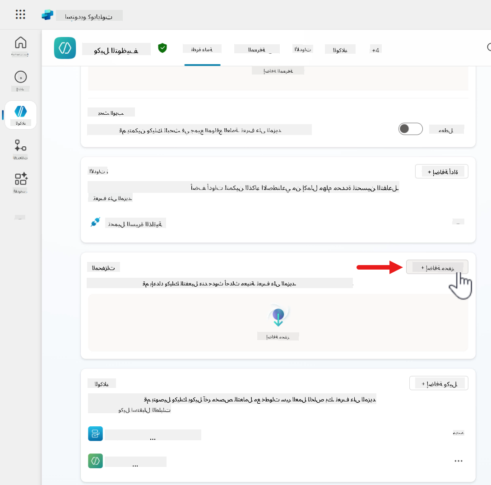

1. ستظهر قائمة بالمشغلات. حدد **عندما يصل بريد إلكتروني جديد (V3)** ثم اختر **التالي**.

       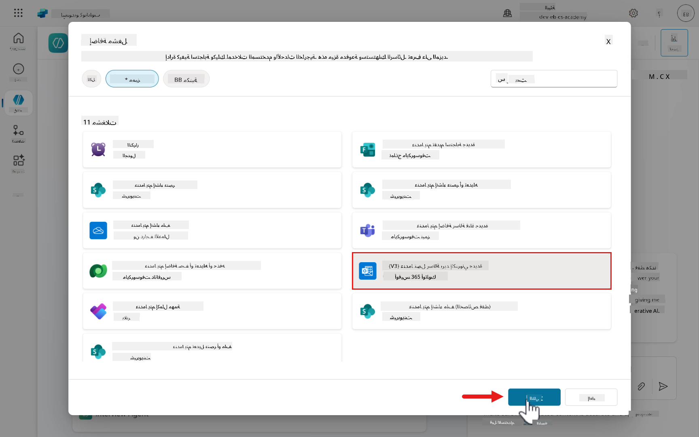

1. سنرى الآن **اسم المشغل** ومرجع الاتصال **تسجيل الدخول** للتطبيقات المدرجة.

       قم بإعادة تسمية اسم المشغل إلى التالي،
    
       ```text
       عندما يصل بريد إلكتروني جديد من مقدم الطلب
       ```

       تأكد من رؤية علامة خضراء بجانب كل مرجع اتصال للتطبيقات المدرجة. إذا لم ترَ علامة خضراء، قم بتسجيل الدخول عبر النقاط الثلاث (...) وحدد **+ مرجع اتصال جديد** لإنشاء مرجع اتصال جديد.

       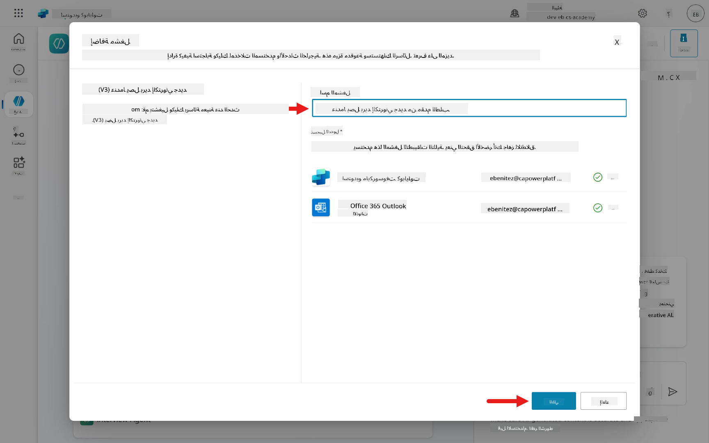

1. الخطوة الأخيرة هي إعداد خصائص الإدخال للمشغل. قم بتحديث الخصائص التالية إلى التالي،

     | الخاصية | كيفية الإعداد | التفاصيل |
     |----------|------------|---------|
     | **تضمين المرفقات (اختياري)** | قائمة منسدلة | نعم |
     | **تصفية الموضوع (اختياري)** | كتابة/إدخال باستخدام لوحة المفاتيح | طلب تقديم |
     | **فقط مع المرفقات (اختياري)** | قائمة منسدلة | نعم |

       اختر **إنشاء مشغل**.

       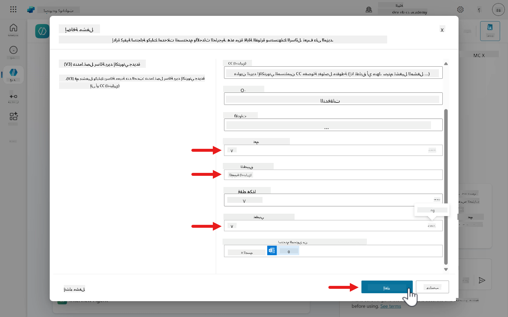

1. بمجرد الإنشاء، ستظهر رسالة تأكيد تفيد بأنه تم إضافة المشغل إلى الوكيل. اختر **إغلاق** وسيتم إدراج المشغل في قسم **المشغلات**.
نحن الآن بصدد تحديث مشغل الحدث لإضافة المزيد من إمكانيات الأتمتة. اختر **النقاط الثلاث (...)** بجانب المشغل واختر **تحرير في Power Automate**.

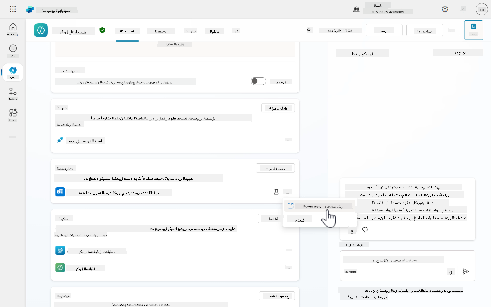

1. سيتم تحميل المشغل كعملية تدفق في بوابة صانع Power Automate. ما تراه هو مصمم التدفق في بوابة صانع Power Automate. هنا يمكننا إضافة المزيد من المنطق والإجراءات لتحقيق المزيد من الأتمتة. سيظهر المشغل في الأعلى، يليه **إرسال مطالبة إلى المساعد المحدد للمعالجة** كآخر إجراء في التدفق.

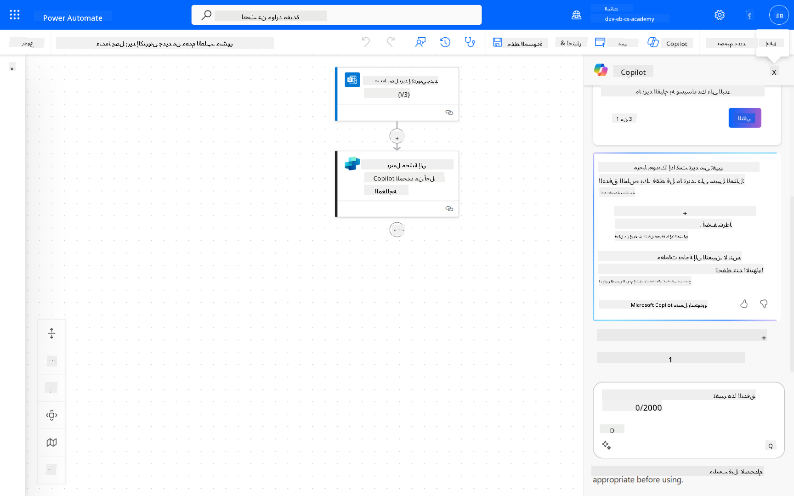

1. بشكل افتراضي، قد يقوم مشغل **عند وصول بريد إلكتروني جديد** في Power Automate بمعالجة عدة رسائل بريد إلكتروني معًا إذا وصلت عدة رسائل في وقت واحد، مما يؤدي إلى تشغيل التدفق مرة واحدة فقط للمجموعة.

لضمان تشغيل التدفق بشكل منفصل لكل بريد إلكتروني، قم بتمكين إعداد **Split On** في إعدادات المشغل واختر `@triggerOutputs()?['body/value']` في حقل المصفوفة المنسدلة.

مع تشغيل **Split On** وتعيين حقل المصفوفة إلى `@triggerOutputs()?['body/value']`، سيعمل التدفق بشكل فردي لكل رسالة، حتى إذا وصلت العديد منها في نفس الوقت.

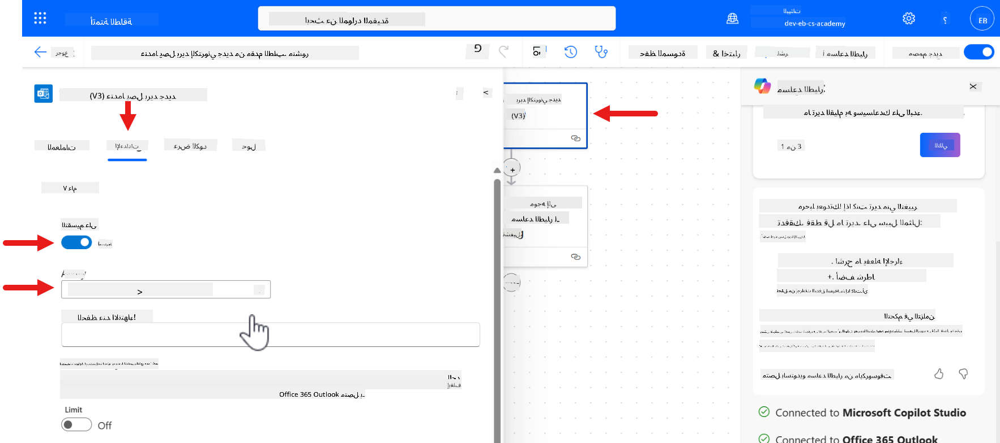

1. بعد ذلك، سنضيف بعض المنطق للتحقق من نوع ملف المرفق، حيث نريد فقط تحميل مرفقات ملفات .PDF وليس الصور (قد تأتي هذه من توقيعات البريد الإلكتروني). اختر رمز **+** أسفل المشغل واختر **التحكم** ضمن قسم **الأدوات المدمجة**.

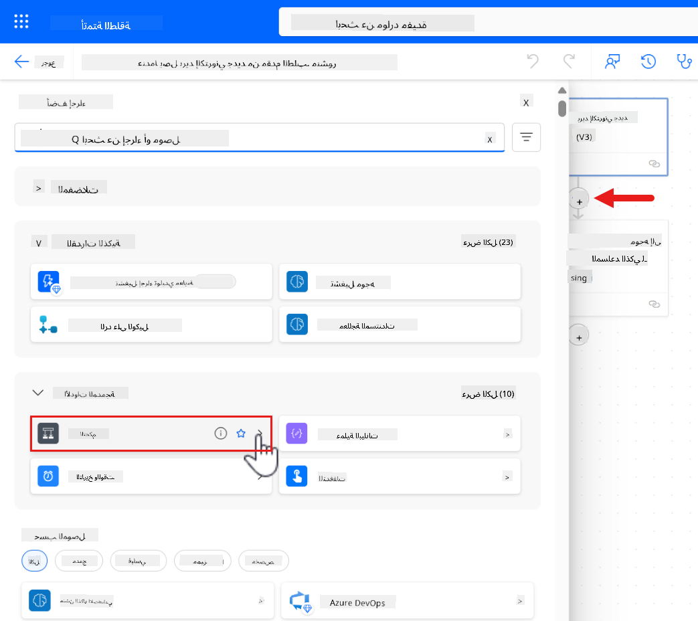

1. اختر إجراء **الشرط**.

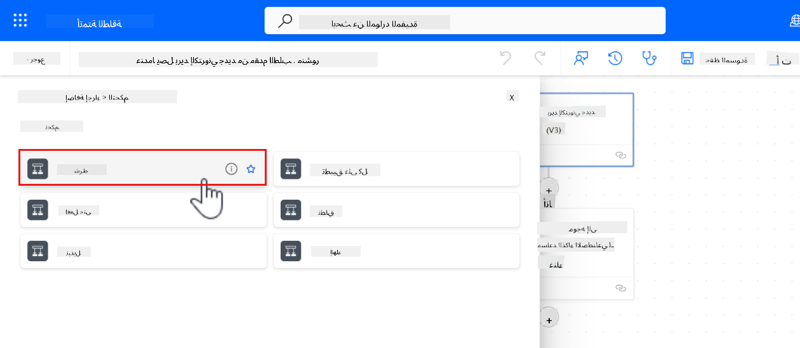

1. الآن سنقوم بتكوين الشرط للتحقق مما إذا كان نوع ملف المرفق هو .PDF. في حقل **اختر قيمة**، اختر رمز **الصاعقة** أو رمز **fx** على اليمين.

1. في حقل **البحث**، اكتب ما يلي:

```text
content type
```

1. ثم اختر معلمة **Attachments Content-Type** من المشغل.

1. بعد ذلك، اختر **إضافة** لإضافة إدخال المحتوى الديناميكي إلى معلمة **Id** للإجراء.

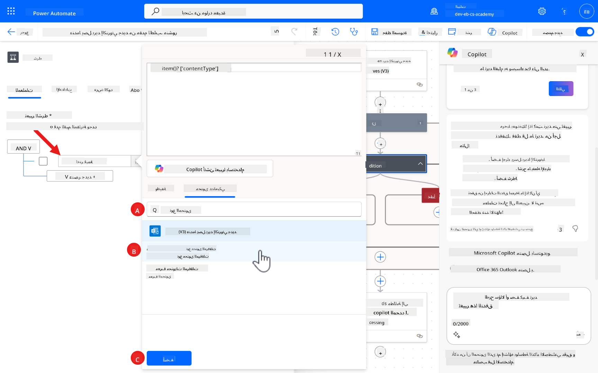

1. دعونا نتوقف هنا للحظة، ربما لاحظت أن إجراء **لكل عنصر** ظهر تلقائيًا.

اختر إجراء **لكل عنصر**. يمثل هذا الإجراء التكرار عبر كل مرفق في البريد الإلكتروني، حيث أن معلمة **Attachments Content-Type** من المشغل مرتبطة بكل مرفق.

تحت السطح، إنها مصفوفة ولهذا السبب تمت إضافة إجراء **لكل عنصر** تلقائيًا عندما اخترنا معلمة **Attachments Content-Type** في إجراء **الشرط**.

للتعرف على المزيد حول هذا، قم بتوسيع كتلة التعلم الإضافية التالية.

??? info "تعلم إضافي: ظهور إجراء لكل عنصر تلقائيًا"

🤔 **لماذا يظهر "تطبيق على كل" أو "لكل عنصر" تلقائيًا؟**

عندما تختار معلمة (محتوى ديناميكي) تمثل قائمة أو مصفوفة من العناصر - على سبيل المثال، قائمة المرفقات أو رسائل البريد الإلكتروني أو الصفوف - يتعرف Power Automate على أنك قد ترغب في معالجة كل عنصر بشكل فردي.

لمساعدتك في ذلك، يضيف Power Automate تلقائيًا حلقة **"تطبيق على كل"** (أو **لكل عنصر**) حول الإجراء الخاص بك. يضمن ذلك أن الإجراء الخاص بك سيعمل مرة واحدة لكل عنصر في القائمة، بدلاً من محاولة معالجة القائمة بأكملها مرة واحدة (مما قد يسبب أخطاء).

🦋 **مثال**

- إذا اخترت "المرفقات" من إجراء سابق (وهي مصفوفة)، وحاولت استخدامها في إجراء يتوقع ملفًا واحدًا، يقوم Power Automate بتغليف الإجراء الخاص بك في حلقة **"تطبيق على كل"** (أو **لكل عنصر**).
- بهذه الطريقة، سيعمل الإجراء الخاص بك لكل مرفق - واحدًا في كل مرة.

💡 **نقاط رئيسية**

- **تلقائي:** تظهر الحلقة تلقائيًا لمساعدتك في معالجة كل عنصر في مجموعة.
- **تمنع الأخطاء:** بدون الحلقة، قد يفشل الإجراء الخاص بك لأنه لا يمكنه التعامل مع عناصر متعددة في وقت واحد.
- **إشارة بصرية:** إنها طريقة بصرية لإظهار أن التدفق الخاص بك سيكرر الإجراء لكل عنصر في القائمة.

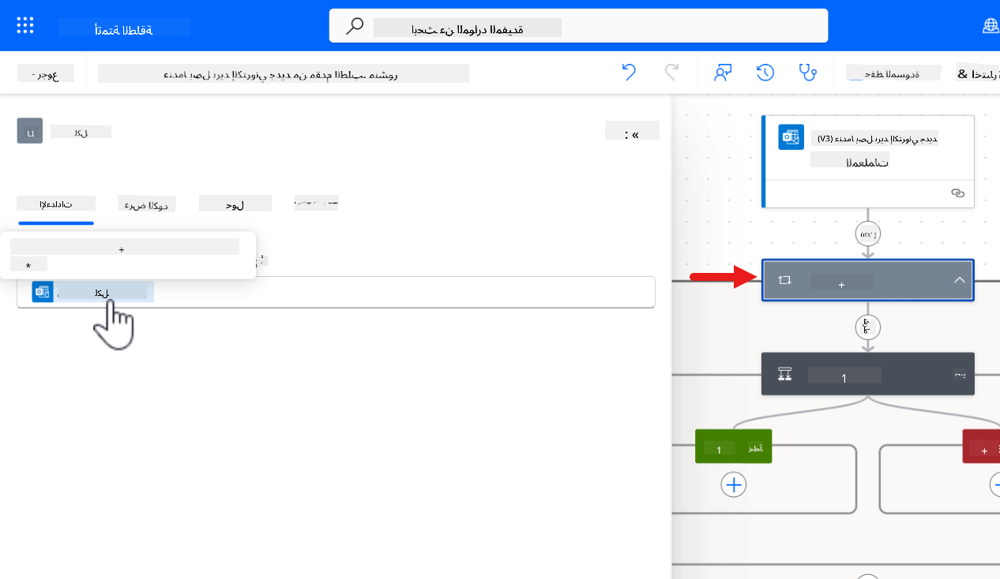

1. بعد ذلك، في حقل **اختر قيمة** الآخر، اكتب ما يلي:

```text
application/pdf
```

سيضمن هذا أنه لكل ملف مرفق، سيتم التحقق من أن تنسيق امتداد الملف هو .PDF.

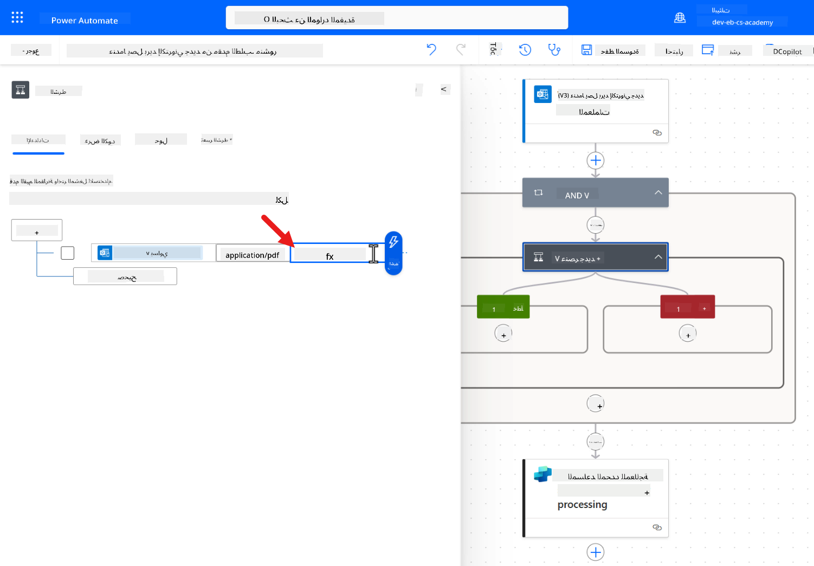

1. الآن سنقوم بتكوين مسار **True** لاستخراج الملف من البريد الإلكتروني وتحميله إلى جدول **Resume** في Dataverse.

أضف إجراءً جديدًا أدناه في مسار **True** وابحث عن `html to text`. اختر إجراء **Html to text**.

لتعلم المزيد عن إجراء **Html to text**، قم بتوسيع كتلة التعلم الإضافية التالية.

??? info "تعلم إضافي: إجراء Html to text"

🤔 **ما هو إجراء "HTML to text"؟**

يُستخدم إجراء **HTML to text** في Power Automate لتحويل المحتوى المهيأ بتنسيق HTML إلى نص عادي. هذا مفيد بشكل خاص عندما تتلقى بيانات (مثل رسائل البريد الإلكتروني أو محتوى الويب أو استجابات API) تحتوي على علامات HTML، وترغب في استخراج النص القابل للقراءة فقط دون أي تنسيق أو كود.

⚙️ **كيف يعمل؟**

- **الإدخال:** تقدم سلسلة من محتوى HTML (على سبيل المثال، نص البريد الإلكتروني).
- **الإخراج:** يقوم الإجراء بإزالة جميع علامات HTML ويعيد النص العادي فقط.

👍🏻 **متى يجب استخدامه؟**

- عندما تريد استخراج النص القابل للقراءة من رسائل البريد الإلكتروني أو صفحات الويب أو استجابات API التي تحتوي على HTML.
- قبل إرسال المحتوى إلى الأنظمة التي لا تدعم تنسيق HTML (مثل الرسائل النصية أو رسائل Teams أو قواعد البيانات).
- لتنظيف البيانات من أجل معالجتها أو تحليلها بشكل أكبر.

🔭 **أين تجده؟**

- في Power Automate في التدفقات، ابحث عن الإجراء المسمى `HTML to text`. إنه تحت موصل **عمليات البيانات**.

💡 **نقاط رئيسية**

- يزيل جميع علامات HTML ويترك النص فقط.
- لا يفسر أو ينفذ النصوص/الأنماط - فقط يزيل العلامات.
- مفيد لتنظيف البيانات وإعداد المحتوى للإخراج النصي العادي.

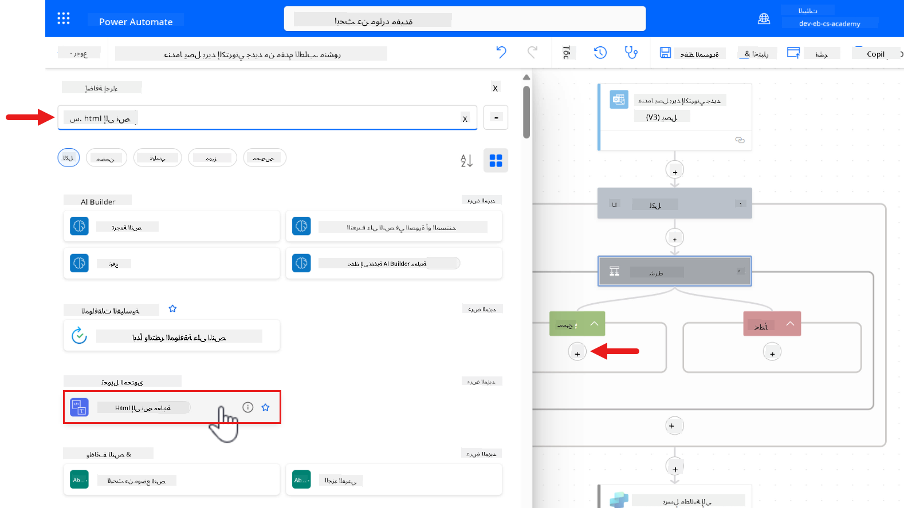

1. بعد ذلك، نحتاج إلى إنشاء مرجع اتصال جديد لإجراء **Html to text** عن طريق اختيار **إضافة جديد**.

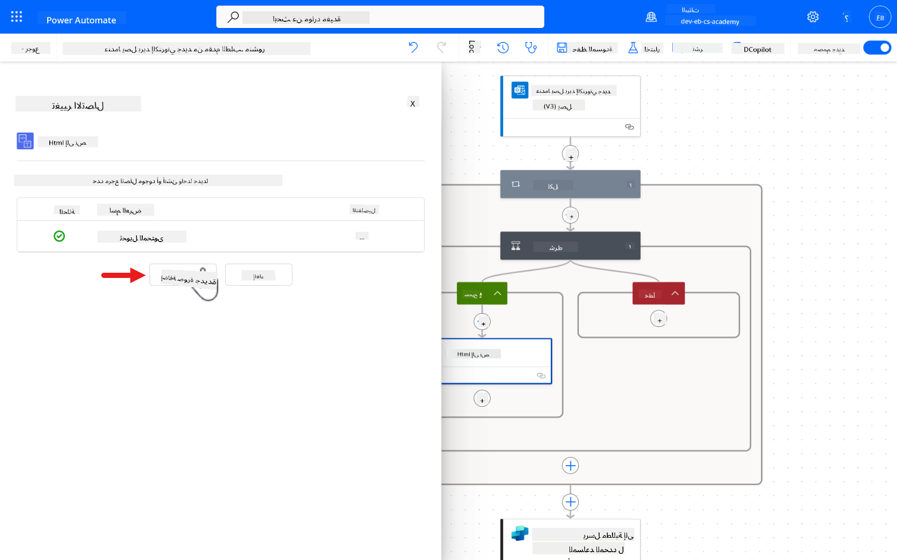

1. يمكن الآن تكوين الإجراء. دعونا نضيف معلمة **Body** من المشغل. في حقل **المحتوى**، اختر رمز **الصاعقة** أو رمز **fx** على اليمين.

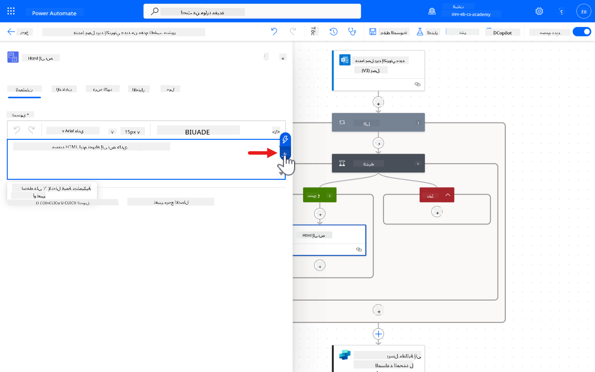

1. في علامة التبويب **المحتوى الديناميكي**، ابحث عن `body` واختر معلمة **Body**، ثم اختر **إضافة**.

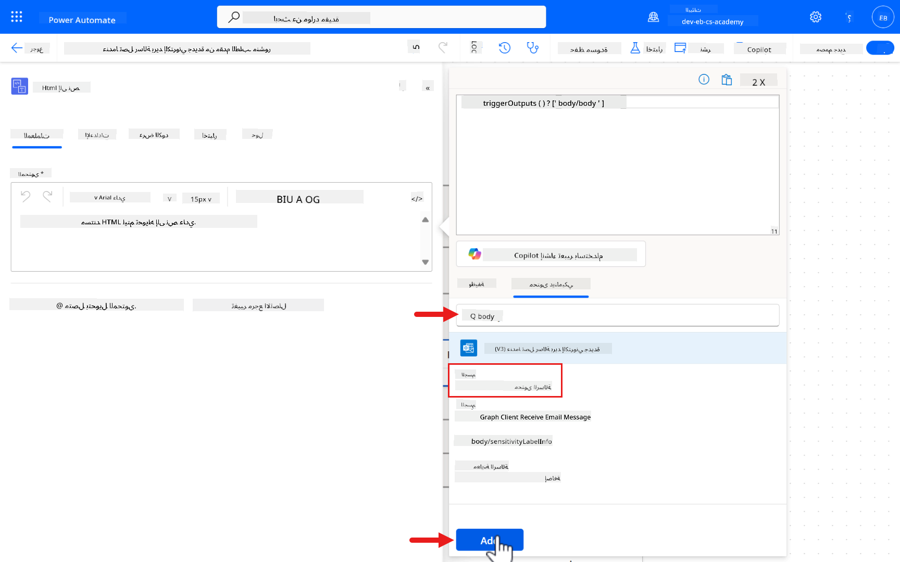

1. لقد أكملنا تكوين هذا الإجراء، لذا دعونا نخرج من الإجراء عن طريق اختيار الأقواس الزاوية المزدوجة («) التي تشير إلى اليسار لتقليص اللوحة.

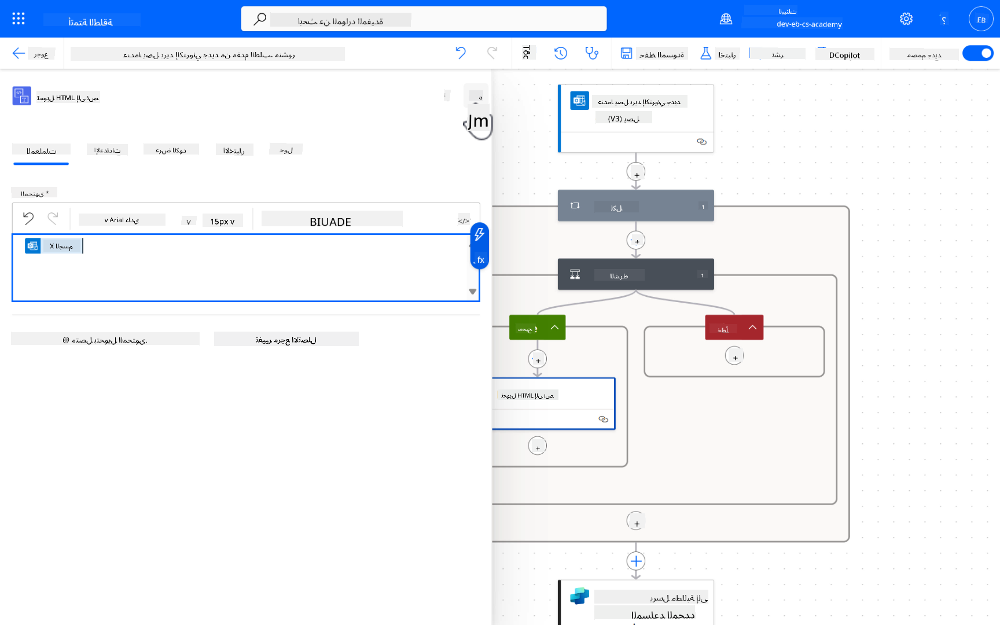

1. سنضيف إجراءً جديدًا عن طريق اختيار **رمز +** أسفل إجراء **Html to text** الذي سيقوم بتحميل اللوحة لإضافة الإجراءات. اختر موصل **Microsoft Dataverse**.

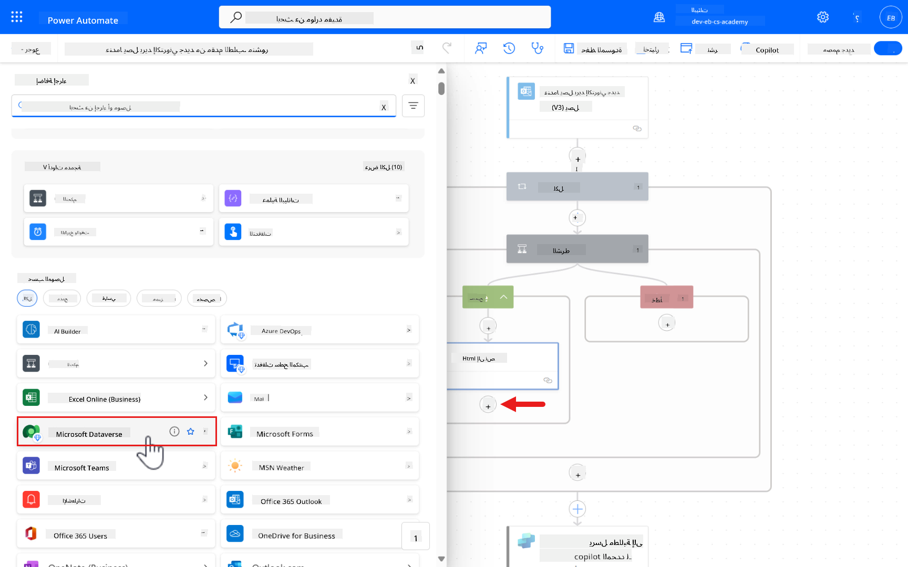

1. اختر إجراء **إضافة صف جديد**.


1. أعد تسمية الإجراء عن طريق اختيار **النقاط الثلاث (...)**، انسخ والصق النص التالي كاسم:

```text
إضافة صف جديد للسيرة الذاتية
```

بالنسبة لمعلمة **اسم الجدول**، ابحث عن `res` واختر جدول **Resumes**.

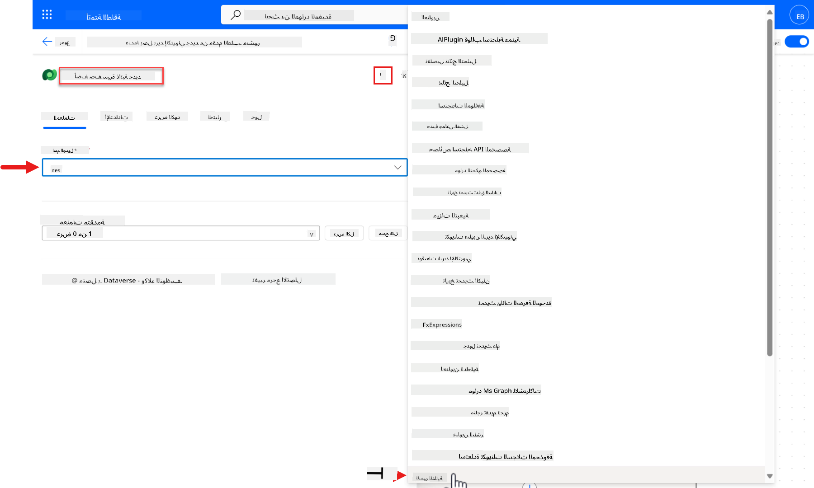

1. اختر حقل **عنوان السيرة الذاتية** بعد ذلك واختر رمز **الصاعقة** أو رمز **fx** على اليمين.

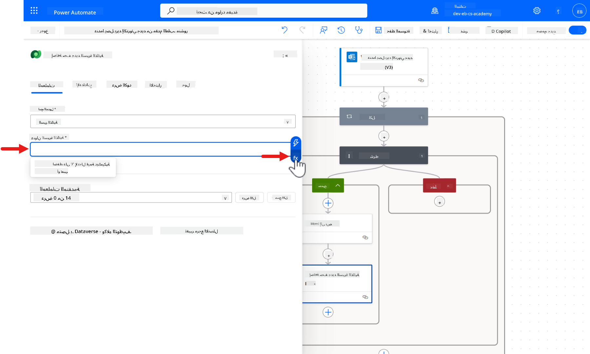

1. في علامة التبويب **الوظيفة**، أدخل التعبير التالي الذي يستخدم وظيفة `item()`.

```text
item()?['name']
```

لتعلم المزيد عن وظيفة `item ()`، قم بتوسيع كتلة التعلم الإضافية التالية.

??? info "تعلم إضافي: وظيفة `item()`"

🤔 **ما هي وظيفة `item()`؟**

- عندما تستخدم إجراء **تطبيق على كل**، يقوم Power Automate بمعالجة كل عنصر في مجموعة (مصفوفة).
- تُستخدم غالبًا داخل الإجراءات مثل **تطبيق على كل** (أو **لكل عنصر**)، **اختيار**، أو **تصفية المصفوفة**.

⚙️ **كيف تعمل؟**

- `item()` هي وظيفة تعيد العنصر الحالي الذي يتم معالجته في حلقة أو عملية مصفوفة.
- داخل تلك الحلقة، تشير `item()` إلى _العنصر الحالي_ الذي يتم معالجته.

📌 **أين تستخدمها؟**

- **تطبيق على كل:** للوصول إلى خصائص العنصر الحالي.
- **اختيار:** لتحويل كل عنصر في مصفوفة.
- **تصفية المصفوفة:** للإشارة إلى العنصر الحالي الذي يتم تقييمه.

🦋 **مثال**

- تعبير داخل حلقة:
       -  `item()?['Email']`
- هذا يحصل على خاصية `Email` للعنصر الحالي.

💡 **نقاط رئيسية**

- `item()` حساسة للسياق: تشير دائمًا إلى العنصر الحالي في العملية أو الحلقة التي تكون فيها.
- إذا كنت تستخدم حلقات متداخلة، يمكنك استخدام `items('LoopName')` للإشارة إلى العناصر في حلقة معينة.

اختر **إضافة** لإضافة التعبير إلى معلمة **عنوان السيرة الذاتية**.

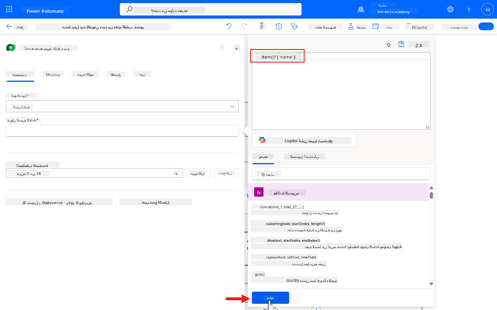

1. لا يزال يتعين علينا تكوين العديد من المعلمات الأخرى، اختر **عرض الكل** وفي حقل **خطاب التغطية**، اختر رمز **الصاعقة** أو رمز **fx** على اليمين.

في علامة التبويب **الوظيفة**، أدخل التعبير التالي الذي يستخدم نفس التعبير في [المهمة السابقة](../02-multi-agent/README.md).

```text
if(greater(length(body('Html_to_text')), 2000), substring(body('Html_to_text'), 0, 2000), body('Html_to_text'))
```

هذا التعبير يتحقق مما إذا كان _النص_ من إجراء **Html to text** أطول من 2000 حرف، وإذا كان كذلك، يعيد فقط أول 2000 حرف؛ وإلا، يعيد النص الكامل.

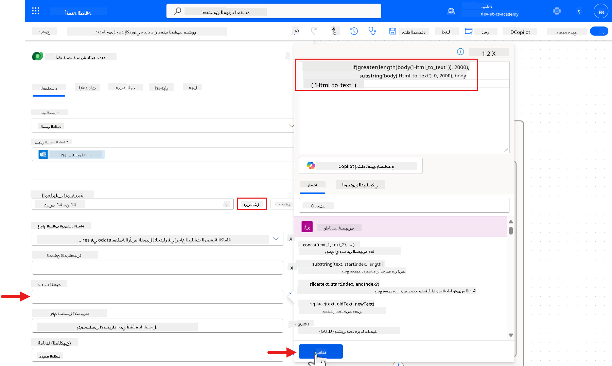

1. سيتم الآن إضافة التعبير إلى حقل **خطاب التغطية**.


1. بالنسبة لحقل **عنوان البريد الإلكتروني المصدر**، ابحث عن `from` واختر معلمة **From** من المشغل حيث تحتوي على قيمة عنوان البريد الإلكتروني.

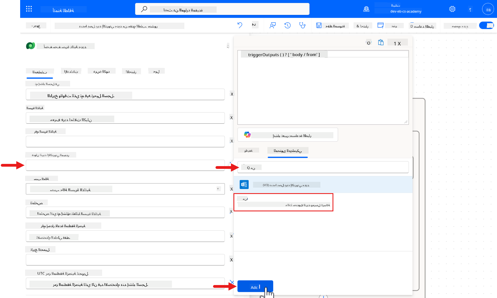

1. بالنسبة لحقل **تاريخ التحميل**، اختر رمز **الصاعقة** أو رمز **fx** على اليمين. في علامة التبويب **الوظيفة**، أدخل التعبير التالي الذي يستخدم وظيفة `utcNow()`.

```text
utcNow()
```

لتعلم المزيد عن وظيفة `utcNow`، قم بتوسيع كتلة التعلم الإضافية التالية.

??? info "تعلم إضافي: وظيفة `utcNow`"

🤔 **ما هي وظيفة `utcNow()`؟**

- وظيفة utcnow() في Power Automate تعيد التاريخ والوقت الحاليين بتوقيت غرينتش (UTC) بتنسيق ISO 8601، مثل: `2025-09-23T04:32:14Z`

🦋 **مثال**

- تعبير:
       -  `concat('تم إنشاء التقرير في ', utcnow())`
- الناتج هو:
       - تم إنشاء التقرير في `2025-09-23T04:32:14Z`

💡 **نقاط رئيسية**
- **لا توجد حاجة إلى أي وسيطات (معلمات إدخال):** دائمًا ما يعطي الطابع الزمني الحالي لـ UTC.
   - **الاستخدامات**
       - إضافة الطوابع الزمنية إلى السجلات أو أسماء الملفات
       - مقارنة الوقت الحالي مع تواريخ أخرى
       - الجدولة أو الشروط القائمة على الوقت

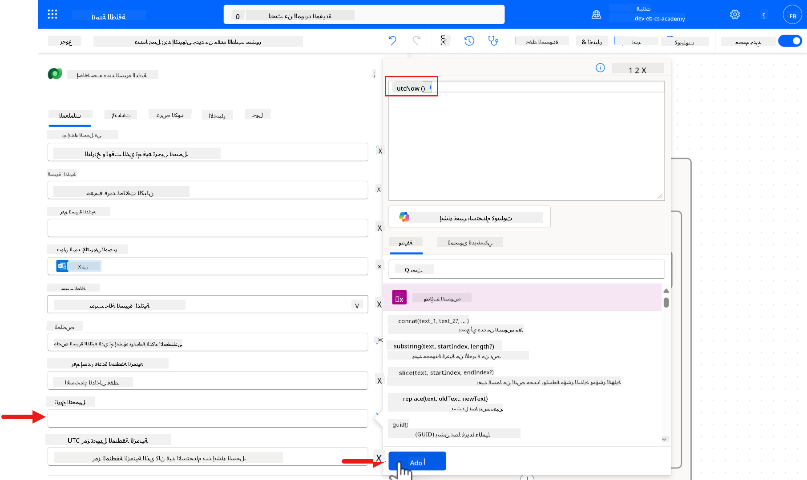

1. لقد أكملنا الآن إعداد إجراء **إضافة صف جديد للسيرة الذاتية**، لذا دعونا نخرج من اللوحة عن طريق طيها.

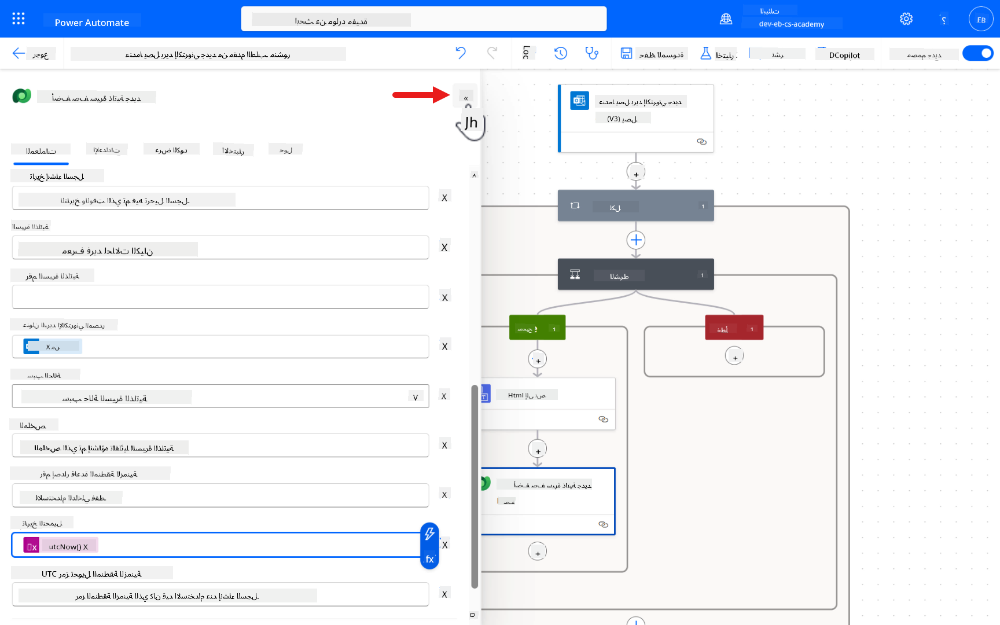

1. سنضيف إجراءً جديدًا عن طريق اختيار **رمز +** تحت إجراء **إضافة صف جديد للسيرة الذاتية**، مما سيؤدي إلى تحميل اللوحة لإضافة الإجراءات. اختر الموصل **Microsoft Dataverse** مرة أخرى.

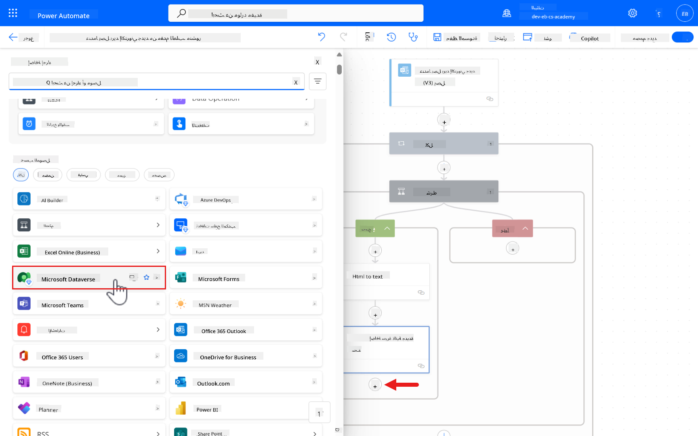

1. اختر إجراء **تحميل ملف أو صورة**.

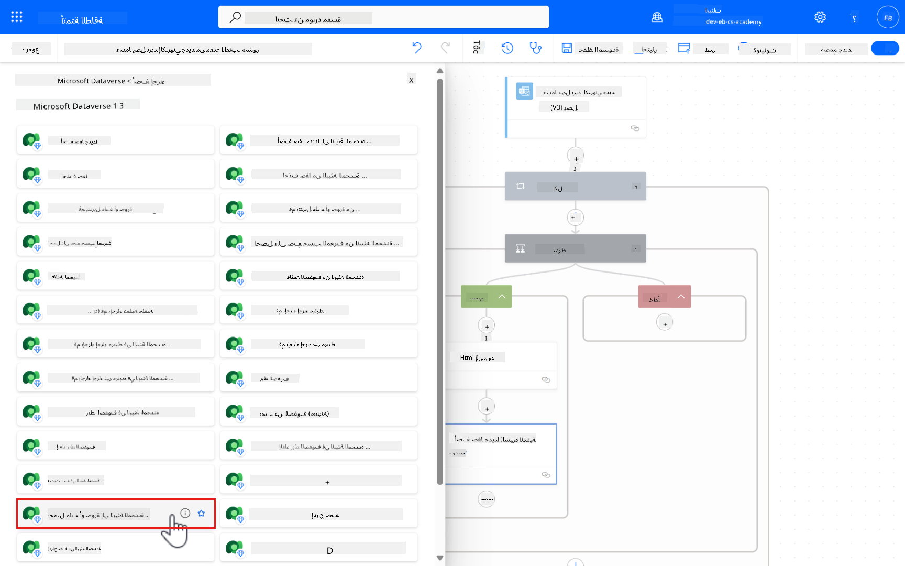

1. أعد تسمية الإجراء عن طريق اختيار **النقاط الثلاث (...)**، ثم نسخ ولصق النص التالي كاسم:

```text
تحميل ملف السيرة الذاتية
```

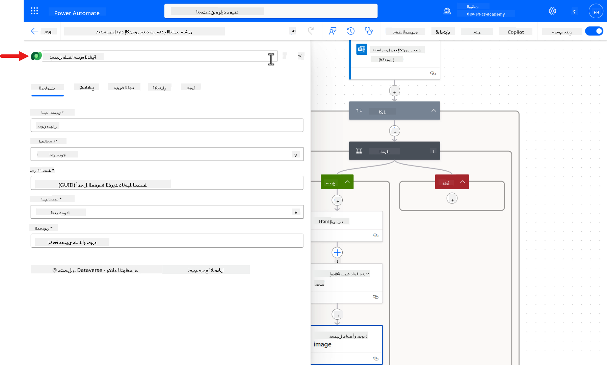

1. اختر حقل **اسم المحتوى** بعد ذلك واختر **رمز البرق** أو **رمز fx** على اليمين.

في علامة التبويب **الدالة**، أدخل التعبير التالي الذي يستخدم دالة `item ()`. هذا يحصل على خاصية `name` للعنصر الحالي (ملف المرفق).

```text
item()?['name']
```

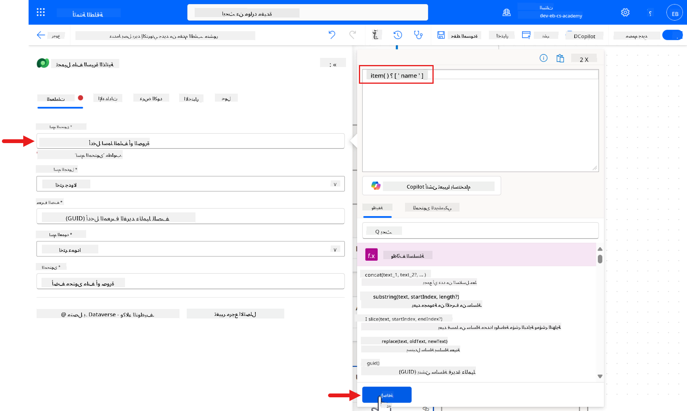

1. بالنسبة لمعلمة **اسم الجدول**، ابحث عن `res` واختر جدول **Resumes**.

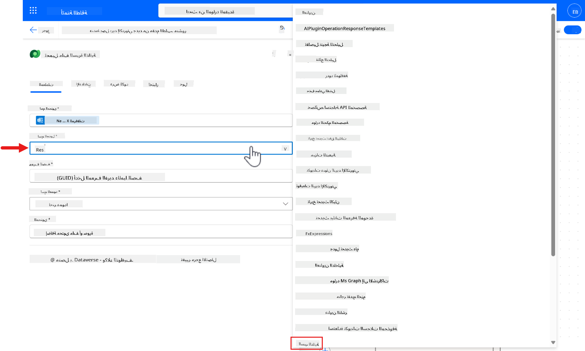

1. اختر حقل **معرف الصف** بعد ذلك واختر **رمز البرق** أو **رمز fx** على اليمين.

ابحث عن `ID` واختر معلمة **Resume** من إجراء Dataverse _إضافة صف جديد_ حيث يحتوي هذا على قيمة معرف الصف لتحميل ملف PDF إليه.

اختر **إضافة**.

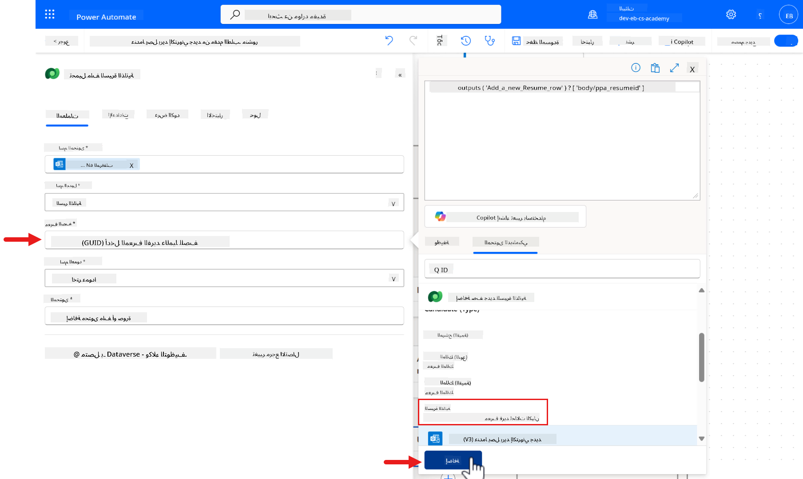

1. اختر حقل **اسم العمود** واختر خيار **Resume PDF**.

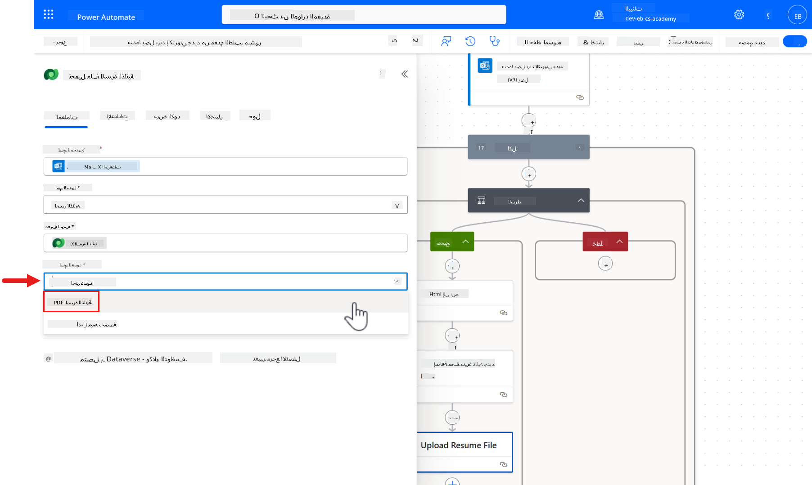

1. اختر حقل **المحتوى** واختر **رمز البرق** أو **رمز fx** على اليمين.

في علامة التبويب **الدالة**، أدخل التعبير التالي الذي يستخدم دالة `item ()`. هذا يحصل على خاصية `contentBytes` للعنصر الحالي (ملف المرفق). تشير `contentBytes` إلى البيانات الثنائية الخام للملف أو المرفق، مشفرة كسلسلة Base64.

```text
item()?['contentBytes']
```

1. لقد أكملنا إعداد هذا الإجراء، لذا دعونا نخرج من الإجراء عن طريق اختيار الأقواس الزاوية المزدوجة («) التي تشير إلى اليسار لطي اللوحة.

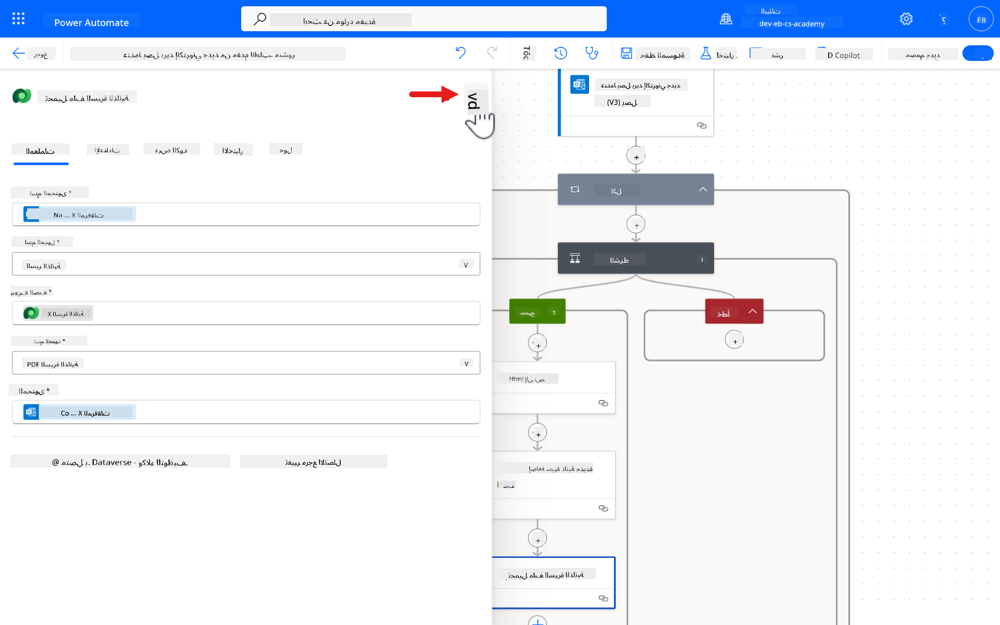

1. بعد ذلك، اختر **يرسل مطالبة إلى مساعد الذكاء الاصطناعي المحدد للمعالجة**، ثم اسحب هذا الإجراء وضعه تحت إجراء **تحميل ملف السيرة الذاتية** في المسار _True_ للشرط.

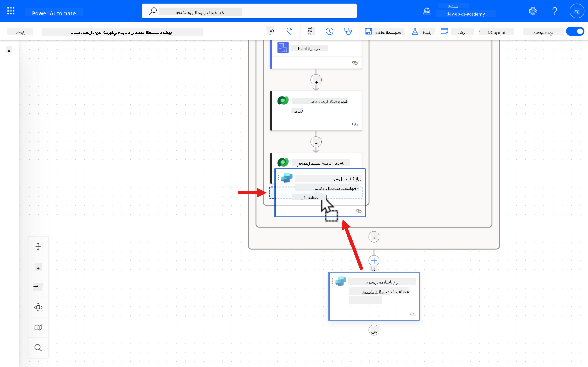

1. اختر **يرسل مطالبة إلى مساعد الذكاء الاصطناعي المحدد للمعالجة** لإعداده.

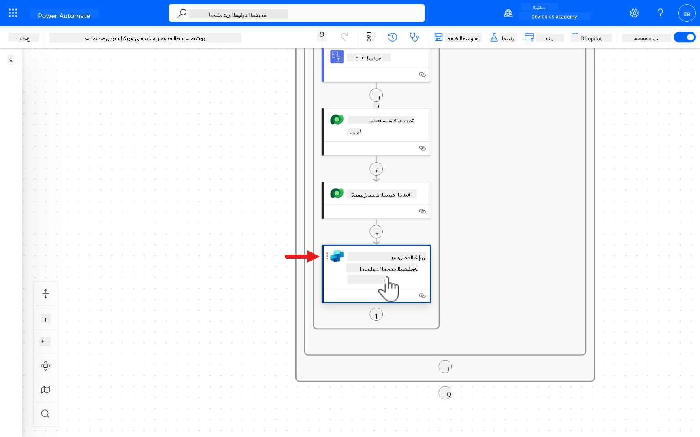

1. في حقل **النص/الرسالة**، اختر كل محتوى الحقل وقم بمسحه/حذفه.

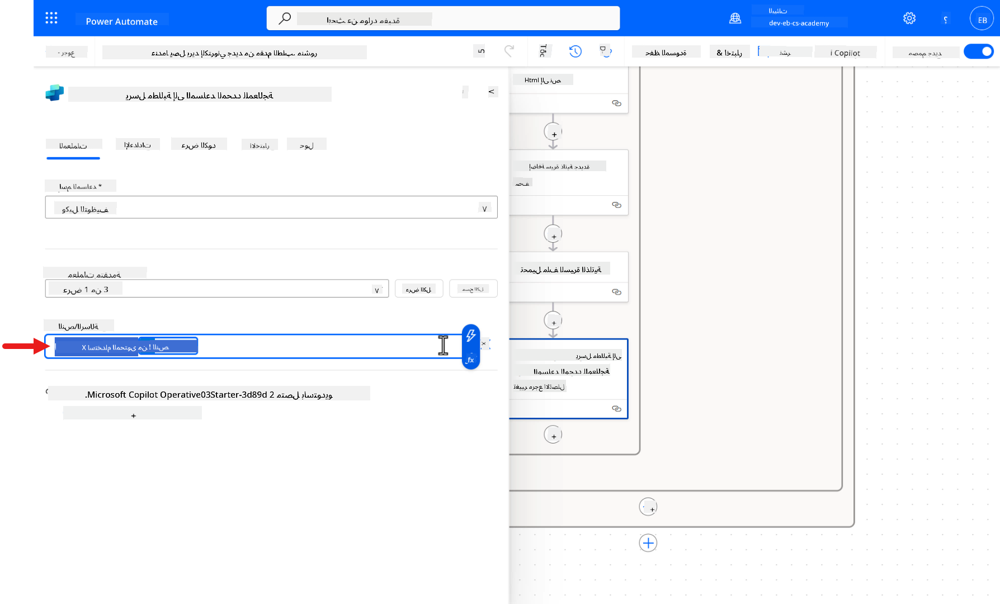

1. انسخ والصق النص التالي في حقل **النص/الرسالة** وقم بتحديد `RESUME ID PLACEHOLDER`.

```text
أرسل [ResumeId (text)] = "RESUME ID PLACEHOLDER" و [ResumeTitle (text_1)] = "RESUME TITLE PLACEHOLDER" و [ResumeNumber (text_2)]= "RESUME NUMBER PLACEHOLDER" إلى الأداة "Notify Teams Applicant channel" في الوكيل الفرعي "Application Intake Agent"
```

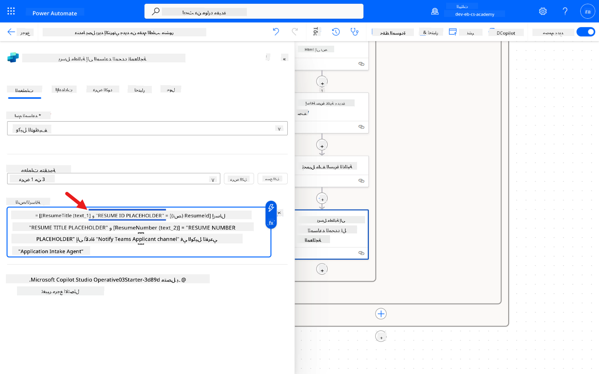

1. اختر **رمز البرق** أو **رمز fx** على اليمين.

ابحث عن `resume` واختر معلمة **Resume** من إجراء Dataverse _إضافة صف جديد_ حيث يحتوي هذا على قيمة `ID` لصف السيرة الذاتية الذي تم إنشاؤه.

اختر **إضافة**.


1. حدد `RESUME TITLE PLACEHOLDER`. اختر **رمز البرق** أو **رمز fx** على اليمين.

ابحث عن `title` واختر معلمة **Resume Title** من إجراء Dataverse _إضافة صف جديد_ حيث يحتوي هذا على قيمة `resume title` لصف السيرة الذاتية الذي تم إنشاؤه.

اختر **إضافة**.

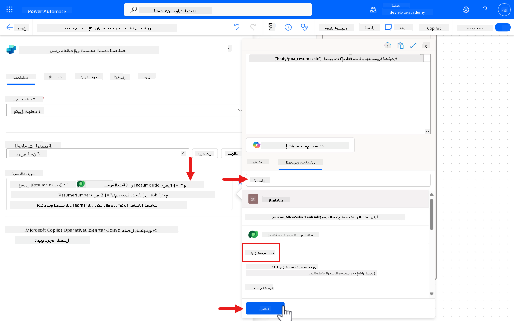

1. حدد `RESUME NUMBER PLACEHOLDER`. اختر **رمز البرق** أو **رمز fx** على اليمين.

ابحث عن `resume number` واختر معلمة **Resume Number** من إجراء Dataverse _إضافة صف جديد_ حيث يحتوي هذا على قيمة `Resume Number` لصف السيرة الذاتية الذي تم إنشاؤه.

اختر **إضافة**.

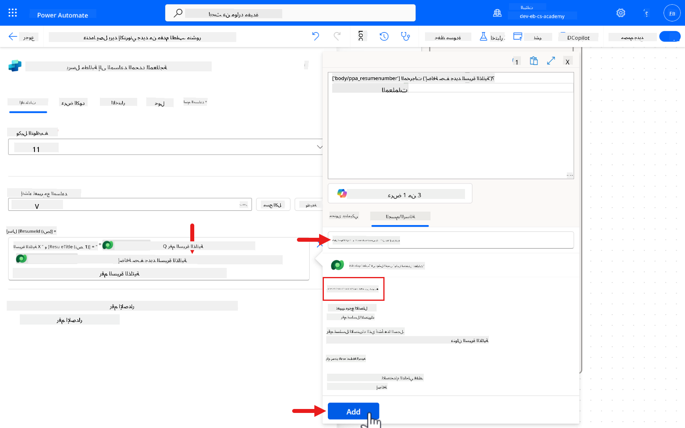

1. لقد أكملنا إعداد هذا الإجراء وتدفق الوكيل الخاص بنا 🙌🏻 أنت تقوم بعمل رائع! الآن دعونا نحفظ تدفق مشغل الحدث الخاص بنا عن طريق اختيار **حفظ المسودة**.

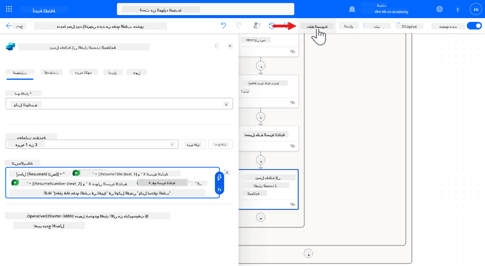

1. الآن نحتاج إلى تعديل تفاصيل تدفق الوكيل، اختر **رجوع**.

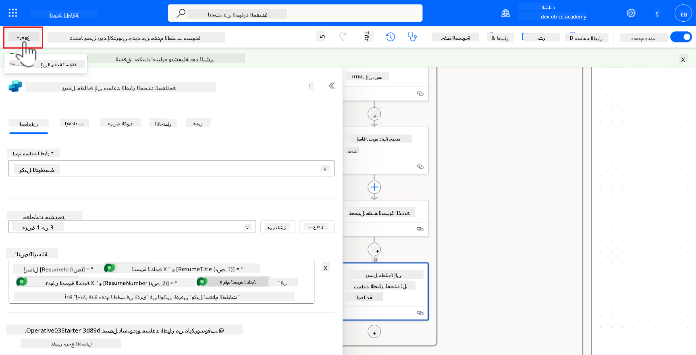

1. اختر **تعديل** في قسم **التفاصيل** وقم بتحديث **الخطة** إلى خيار **Copilot Studio**.

اختر **حفظ**.

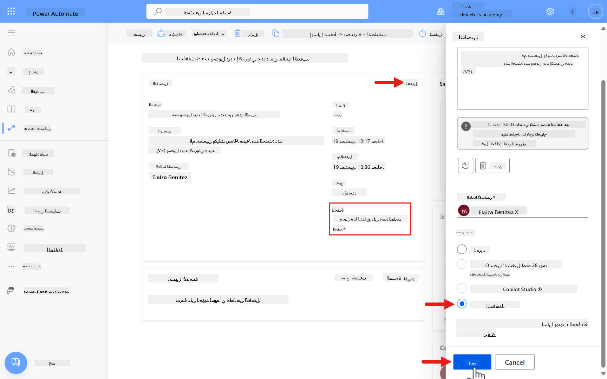

1. ستظهر نافذة لتأكيد التبديل إلى خطة Copilot Studio. اختر **تأكيد**.

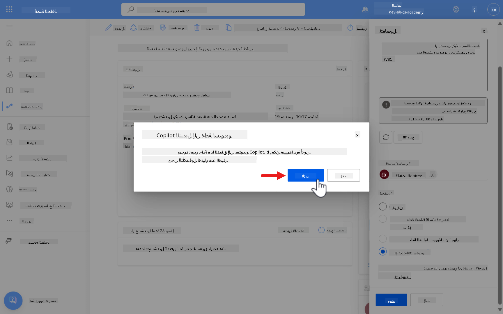

1. تم تحديث الخطة الآن إلى **Copilot Studio**. اختر **تعديل** حيث نحتاج إلى نشر تدفق مشغل الحدث لوكيلنا.

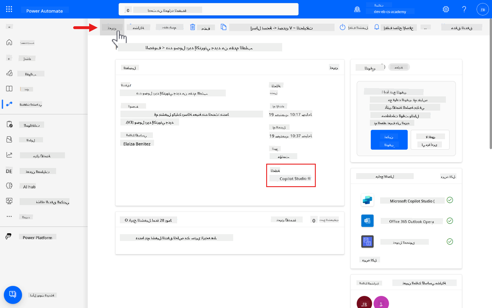

1. اختر **نشر**.

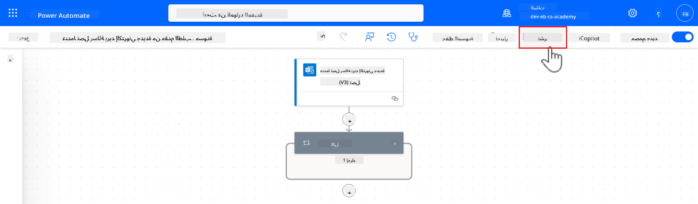

هنيئًا! تم نشر تدفق مشغل الحدث الآن 😃

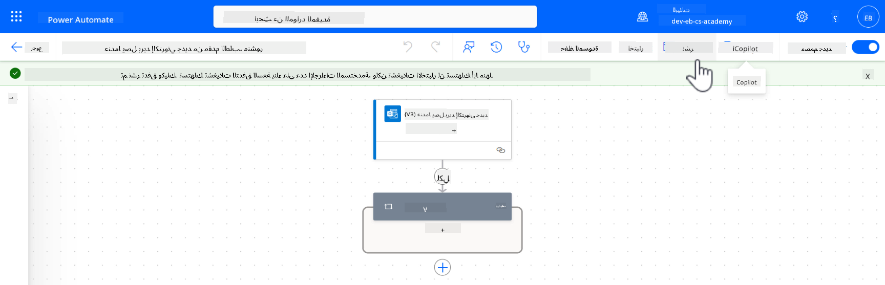

لننتقل إلى إنشاء تدفق وكيل جديد سيتم استدعاؤه بواسطة الوكيل الفرعي **Intake Application Agent**.

### المختبر 3.2 - إعلام قناة Teams باستخدام بطاقة تكيفية

سنقوم الآن بإنشاء تدفق وكيل جديد للوكيل الفرعي **Intake Application Agent** الذي يستخدم القيم التي يتم تمريرها بواسطة مشغل الحدث، لنشر بطاقة تكيفية في قناة Teams. ستقوم هذه البطاقة التكيفية بتنبيه فريق التوظيف في الموارد البشرية حول ملف PDF الذي تم تحميله تلقائيًا حتى يتمكنوا من مراجعته.

لنبدأ!

1. في **وكيل التوظيف** اختر علامة التبويب **الوكلاء** واختر **Application Intake Agent**.

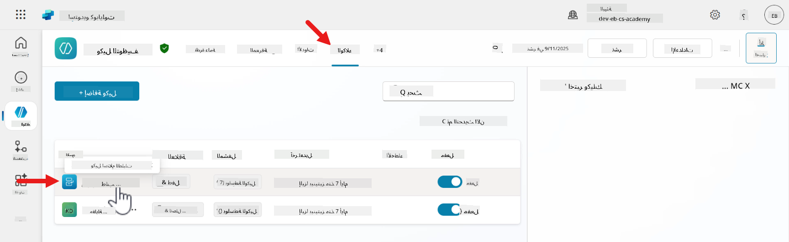

1. قم بالتمرير لأسفل إلى **الأدوات** واختر **+ إضافة**.

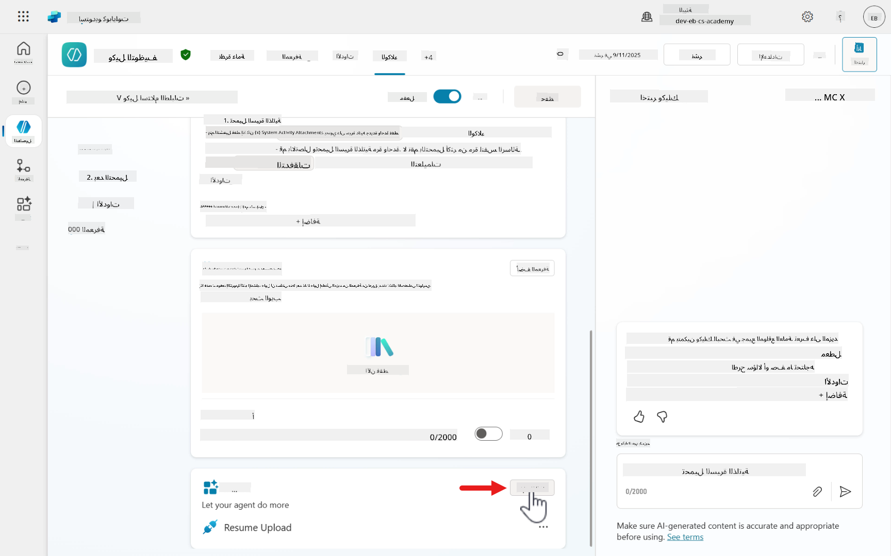

1. ستظهر نافذة **إضافة أداة**. اختر **+ أداة جديدة**.

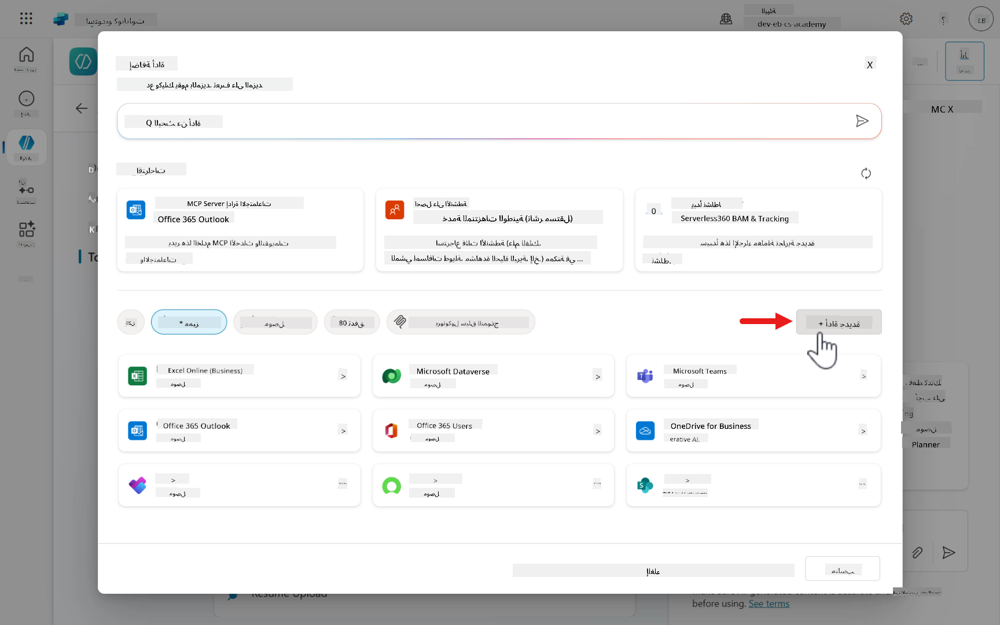

1. اختر **تدفق الوكيل**.

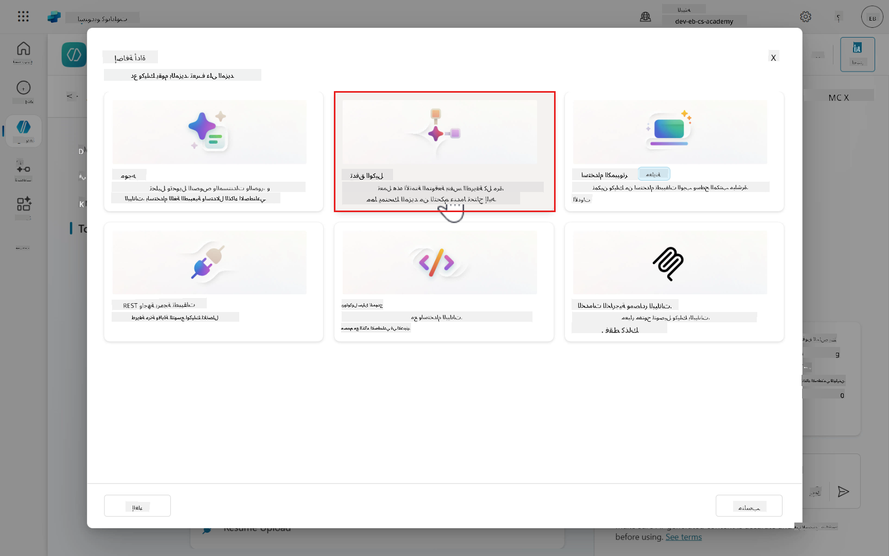

1. سيتم تحميل **مصمم تدفق الوكيل** بعد ذلك. في مشغل **عندما يستدعي الوكيل التدفق**، اختر **+ إضافة إدخال**.


1. اختر **نص** كنوع إدخال المستخدم.


1. في حقل إدخال النص، انسخ والصق النص التالي كاسم معلمة الإدخال.

```text
ResumeId
```


1. كرر نفس الخطوات لإضافة إدخال نصي ثاني. انسخ والصق النص التالي كاسم معلمة الإدخال.

```text
ResumeTitle
```


1. كرر نفس الخطوات لإضافة إدخال نصي ثالث. انسخ والصق النص التالي كاسم معلمة الإدخال.

```text
ResumeNumber
```


1. هل تتذكر كيف أضفنا في [التوظيف](../../recruit/08-add-adaptive-card/README.md#81-create-a-new-topic-with-an-adaptive-card-for-user-to-submit-their-request) بطاقة تكيفية داخل موضوع لوكيلنا؟ هذه المرة، سنضيف بطاقة تكيفية في تدفق الوكيل. سنقوم الآن بإضافة إجراء آخر إلى تدفق الوكيل الخاص بنا لنشر بطاقة تكيفية في قناة Teams.

اختر **رمز +** أسفل المشغل.


1. اختر إجراء **نشر بطاقة في محادثة أو قناة**.


1. يجب إنشاء مرجع اتصال بـ Microsoft Teams باستخدام حساب المستخدم الذي سجلت الدخول به. اختر **تسجيل الدخول**.


1. اختر حساب المستخدم الخاص بك ثم اختر **السماح بالوصول**.


1. بالنسبة لمعلمات الإدخال التالية،

| المعلمة | كيفية الإعداد | التفاصيل |
|----------|------------|---------|
| **النشر كـ** | قائمة منسدلة | اختر خيار `Flow bot` |
| **النشر في** | قائمة منسدلة | اختر خيار `Channel` |
| **الفريق** | قائمة منسدلة | اختر فريقًا متاحًا في بيئتك لديك حق الوصول إليه لغرض إكمال هذا التمرين |
| **القناة** | قائمة منسدلة | اختر قناة متاحة في بيئتك لديك حق الوصول إليها لغرض إكمال هذا التمرين |


1. بعد ذلك، سنقوم بإعداد حقل **البطاقة التكيفية**. اختر حقل **البطاقة التكيفية**.


1. افتح ملف [Resume Table Updated JSON](../../../../../docs/operative-preview/03-automate-triggers/assets/3.2_ResumeTableUpdated.json)، انسخ محتوياته بالكامل، والصقها في حقل البطاقة التكيفية.


1. كما فعلنا في [التوظيف](../../recruit/08-add-adaptive-card/README.md#81-create-a-new-topic-with-an-adaptive-card-for-user-to-submit-their-request)، سنقوم باستبدال القيم الحالية في حمولة JSON بالقيم الفعلية أو المحتوى الديناميكي.

أولاً، دعونا نحدث عنوان URL الخاص بخاصية `url` داخل خاصية `selectAction`. سيتم استبدال هذا العنوان بعنوان URL لعرض النظام الخاص بالسير الذاتية في تطبيق **Hiring Hub** النموذج المدفوع. سيسمح هذا للمجند باختيار الإجراء والانتقال إلى عرض النظام الخاص بالسير الذاتية في التطبيق النموذج المدفوع.

حدد قيمة عنوان URL الحالية واحذفها.


1. في تطبيق **Hiring Hub** النموذج المدفوع، انتقل إلى عرض النظام الخاص بالسير الذاتية باستخدام القائمة الجانبية اليسرى ونسخ عنوان URL. ثم عد إلى تدفق الوكيل، والصق عنوان URL المنسوخ في خاصية **url** داخل خاصية `selectAction`.


1. يجب أن ترى ما يلي حيث يتم تمييز تفاصيل بيئتك باللون الأصفر في تطبيق **Hiring Hub** القائم على النماذج.

     | المعامل | القيمة | التفسير |
     |----------|------------|---------|
     | **Organization URI** | GUID | عنوان URL الخاص ببيئة Dataverse/Dynamics 365 |
     | **appid** | GUID | لفتح تطبيق قائم على النماذج معين، يتم استخدام معامل الاستعلام appid أو appname. في هذه الحالة، يتم استخدام appid |
     | **viewid** | GUID | معامل الاستعلام الذي يمثل معرف العرض |

       

1. بعد ذلك، سنضيف قيم محتوى ديناميكية لعدة خصائص. لنبدأ بالنص الذي سيعرض مرجع رقم السيرة الذاتية للصف الذي تم إنشاؤه بواسطة مشغل الحدث تلقائيًا.

      اختر أيقونة **panel** لتحميل لوحة الإجراءات.

       

1. قم بالتمرير لأسفل إلى السطر حيث ترى خاصية `text` لـ `RESUME NUMBER PLACEHOLDER`. قم بتحديد قيمة العنصر النائب واحذفها.

       

1. انقر بين علامات الاقتباس المزدوجة واختر أيقونة **البرق** أو **fx** على اليمين.

      في علامة التبويب **Dynamic Content** اختر المعامل **ResumeNumber** ثم اختر **Add**.

       

1. سيتم الآن إضافة معامل **ResumeNumber** كمحتوى ديناميكي إلى خاصية `text`.

       

1. سنكرر نفس الخطوات لـ `RESUME NAME PLACEHOLDER`. قم بالتمرير لأسفل إلى السطر حيث ترى خاصية `text` لـ `RESUME NAME PLACEHOLDER`. قم بتحديد قيمة العنصر النائب واحذفها.

       

1. انقر بين علامات الاقتباس المزدوجة واختر أيقونة **البرق** أو **fx** على اليمين.

      في علامة التبويب **Dynamic Content** اختر المعامل **ResumeTitle** ثم اختر **Add**.

       

1. سيتم الآن إضافة معامل **ResumeTitle** كمحتوى ديناميكي إلى خاصية `text`.

       

1. سنكرر نفس الخطوات لقيمة **Due Date** التي تمثل الموعد النهائي لمراجعة السيرة الذاتية من قبل مسؤول التوظيف. قم بالتمرير لأسفل إلى السطر حيث ترى خاصية `text` لـ `May 21, 2023`.

       

1. احذف قيمة العنصر النائب لهذا التاريخ وانقر بين علامات الاقتباس المزدوجة.

       

1. اختر أيقونة **البرق** أو **fx** على اليمين وفي علامة التبويب **Function**، أدخل التعبير التالي واختر **Add**.

       ```text
       addDays(utcNow(), 3, 'MMM dd, yyyy')
       ```

      يستخدم هذا التعبير وظيفتين.

     | الوظيفة | التفسير |
     |----------|------------|
     | **addDays** | يضيف عددًا محددًا من الأيام إلى تاريخ معين ويعيد التاريخ الناتج بتنسيق نصي |
     | **utcNow** | يعيد التاريخ والوقت الحاليين بتنسيق التوقيت العالمي المنسق (UTC) كنص. |

      بالنسبة لقيمة utcNow، نقوم بتنسيق التاريخ ليكون الشهر واليوم، متبوعًا بالسنة.

       

      سيتم الآن إضافة التعبير إلى خاصية `text`.

       

1. أخيرًا، سنقوم بتحديث عنوان URL الخاص بخاصية `url` داخل خاصية المصفوفة `actions` في أسفل حمولة JSON. سيتم استبدال عنوان URL الحالي للعنصر النائب بعنوان URL الخاص بصف السيرة الذاتية في تطبيق **Hiring Hub** القائم على النماذج. سيسمح ذلك لمسؤول التوظيف باختيار إجراء `Action.OpenURL` من البطاقة التكيفية والانتقال إلى السيرة الذاتية في التطبيق القائم على النماذج.

       

1. في تطبيق **Hiring Hub** القائم على النماذج، افتح صفًا في عرض النظام **Resumes** باستخدام قائمة الجانب الأيسر. سيتم تحميل صف السيرة الذاتية كاستمارة في التطبيق القائم على النماذج.

      انسخ عنوان URL الخاص بصف السيرة الذاتية.

    ??? info "كيفية العودة إلى تطبيق **Hiring Hub** القائم على النماذج في حال قمت بالخروج/إغلاقه"

        1. انتقل إلى [https://make.powerapps.com](https://make.powerapps.com) وتأكد من أنك في بيئة المطور التي تستخدمها لهذه التمارين، وإلا قم بالتبديل إليها.
        
        

        1. اختر **Apps** في لوحة القائمة الجانبية اليسرى وبالنسبة لتطبيق **Hiring Hub** القائم على النماذج، اختر أيقونة **Play** لتحميله في متصفحك.
        
        

       

1. ثم انتقل مرة أخرى إلى تدفق الوكيل، وحدد قيمة عنوان URL الحالية للعنصر النائب واحذفها.

       

1. ثم قم بلصق عنوان URL المنسوخ في خاصية **url** داخل خاصية `url property`.

       

1. يجب أن ترى ما يلي. احذف قيمة معرف `GUID` في النهاية. سنستبدل هذا المحتوى الديناميكي - معامل **ResumeId**.

       

1. اختر أيقونة **البرق** أو **fx** على اليمين.

      في علامة التبويب **Dynamic Content** اختر المعامل **ResumeId** ثم اختر **Add**.

       

1. سيتم إضافة **ResumeId** كمحتوى ديناميكي. ما يلي مميز باللون الأصفر هو تفاصيل بيئتك في تطبيق **Hiring Hub** القائم على النماذج.

     | المعامل | القيمة | التفسير |
     |----------|------------|---------|
     | **Organization URI** | GUID | عنوان URL الخاص ببيئة Dataverse/Dynamics 365 |
     | **appid** | GUID | لفتح تطبيق قائم على النماذج معين، يتم استخدام معامل الاستعلام appid أو appname. في هذه الحالة، يتم استخدام appid |
     | **id** | GUID | معامل الاستعلام الذي يمثل معرف صف السيرة الذاتية |

       

1. لقد أكملنا الآن تكوين إجراء **Post card in a chat or channel** 👏🏻. اخرج من لوحة تكوين الإجراء عن طريق اختيار أيقونة **x**.

       

1. أخيرًا، سنقوم بتكوين الإجراء الأخير، **Respond to the agent** عن طريق إرسال نص إلى الوكيل لإنهاء المعالجة.

      في إجراء **Respond to the agent**، اختر **+Add an output**.

       

1. اختر **Text** كنوع الإخراج.

       

1. أدخل ما يلي كاسم للإخراج.

       

1. أدخل ما يلي كقيمة للإخراج.

       ```text
       Finished
       ```

       

1. لقد أكملنا الآن تكوين تدفق الوكيل. اختر **Save draft** لحفظ تدفق الوكيل. ستظهر رسالة تأكيد بمجرد الحفظ.

       

1. قبل نشر تدفق الوكيل، نحتاج إلى تحديث التفاصيل الخاصة به. اختر علامة التبويب **Overview** ثم اختر **Edit**.

      في حقل اسم التدفق، أدخل ما يلي.

       ```text
       Notify Teams Applicant channel
       ```      

      بعد ذلك، اختر أيقونة **Refresh** لتحديث وصف تدفق الوكيل باستخدام الذكاء الاصطناعي.

      ثم اختر **Save** لحفظ التفاصيل المحدثة لتدفق الوكيل.

       

1. انتقل مرة أخرى إلى علامة التبويب **Designer** واختر **Publish** لنشر تدفق الوكيل. ستظهر رسالة تأكيد بمجرد الحفظ.

       

1. الآن يجب إضافة تدفق الوكيل كأداة في **Application Intake Agent**. انتقل مرة أخرى إلى **Hiring Agent** واختر علامة التبويب **Agents**، ثم اختر **Application Intake Agent**.

       

1. في قسم **Details** الخاص بالوكيل، سنقوم بتحديث حقل **Description**. انسخ النص التالي والصقه في نهاية نص الوصف.

       ```text
       and also notify the Teams Applicant channel
       ```

       

1. بعد ذلك، سنضيف تدفق الوكيل كأداة. قم بالتمرير لأسفل واختر **+ Add**.

       

1. اختر تدفق الوكيل الذي تم إنشاؤه سابقًا، **Notify Teams Applicant Channel**.

       

1. اختر **Add and configure** بعد ذلك.

       

1. في قسم **Inputs** الخاص بتدفق الوكيل، تكون المدخلات الثلاثة التي قمنا بتكوينها سابقًا في تدفق الوكيل مرئية. بشكل افتراضي، يتم تعيين تكوين **Fill using** إلى **Dynamically fill with AI**. سنبقي هذا الإعداد كما هو حيث أن الطلب من مشغل الحدث (في الإجراء الأخير، **Sends a prompt to the specified copilot for processing** - هذه هي الخطوات 38-44 من **Lab 3.1 - Automate uploading resumes to Dataverse received by email**) سيحتوي على قيم المعاملات التي سيستخرجها الذكاء الاصطناعي.

       

1. الآن بعد أن تمت إضافة الأداة إلى **Application Intake Agent**، يجب تحديث تعليمات الوكيل. اختر أيقونة **السهم الخلفي** للعودة إلى قائمة الوكلاء.

       

1. اختر **Application Intake Agent** في علامة التبويب **Agents** الخاصة بـ **Hiring Agent**.

       

1. في حقل **Instructions**، أدخل سطرًا جديدًا بعد تعليمات `2.Post-Upload`. انسخ والصق التعليمات التالية.

       ```text
       Process for Resume Upload via Email
       1. When you receive a message, **Send [ResumeId (text)] = "1680265f-5793-f011-b41b-7c1e525be9f7" and [ResumeTitle (text_1)] = "TAYLOR TESTPERSON (FICTITIOUS).pdf" and [ResumeNumber (text_2)]= "R01026" to the Tool "Notify Teams Applicant channel"** in the child agent "Application Intake Agent", call [AGENT FLOW PLACEHOLDER]
       ```

       

1. قم بتحديد النص `[AGENT FLOW PLACEHOLDER`.

       

1. أدخل الحرف المائل الأمامي، `/`، واختر أداة **Notify Teams Applicant Channel**.

       
1. سيتم الآن تشغيل تدفق الوكيل بواسطة **وكيل استلام الطلبات** وفقًا للتعليمات، بعد الإجراء الأخير (**يرسل مطالبة إلى مساعد الطيار المحدد للمعالجة**) في مشغل الحدث الذي يرسل المطالبة التي تحتوي على قيم المعلمات إلى الوكيل.

      اختر **حفظ** لحفظ التعليمات المحدثة لـ **وكيل استلام الطلبات**.

       

1. سيتم الآن تحديث التعليمات بمجرد حفظ الوكيل.

       

1. نحتاج الآن إلى **نشر** **وكيل التوظيف**. اختر **نشر** في الزاوية العلوية اليمنى، وفي نافذة _نشر هذا الوكيل_ التي تظهر اختر **نشر**.

       

1. بمجرد النشر، ستظهر رسالة تأكيد بأن الوكيل قد تم نشره.

       

يمكننا الآن اختبار الوكيل!

### المختبر 3.3 - اختبار مشغل الحدث

1. لتنفيذ مشغل الحدث، يجب إرسال بريد إلكتروني يحتوي على ملف السيرة الذاتية بصيغة PDF. في Outlook، قم بإنشاء رسالة بريد إلكتروني جديدة.

     | مكون البريد الإلكتروني | التفاصيل |
     |----------|------------|
     | **المستلم** | استخدم حساب المستخدم الذي سجلت الدخول به كقيمة |
     | **المرفق** | قم برفع ملف [TAYLOR TESTPERSON (FICTITIOUS)](../../../../../docs/operative-preview/test-data/resumes/TAYLOR%20TESTPERSON%20(FICTITIOUS).pdf) |
     | **النص** | انسخ والصق النص التالي في جسم البريد الإلكتروني |

       ```text
       عزيزي مدير التوظيف،

       أكتب لأعبر عن اهتمامي بمنصب مهندس منصة Power المتقدم في مؤسستكم. مع أكثر من تسع سنوات من الخبرة في تقديم حلول آمنة وقابلة للتوسع على منصات مايكروسوفت السحابية، أنا واثق من قدرتي على المساهمة بفعالية في فريقكم.

       في دوري الأخير كمهندس منصة Power رئيسي، قمت بتطوير خط أنابيب تلقائي لاستقبال السير الذاتية، مما قلل من الفرز اليدوي وحسن إمكانية البحث. لقد قدمت تطبيقات إدارة حالات الموارد البشرية، وأدخلت التدفقات المدركة للحلول، وطبقت فحوصات العلاقات العامة لتحسين أوقات نشر الحلول. تشمل خبرتي Power Apps، Power Automate، Power Pages، Dataverse، ومجموعة من خدمات Microsoft 365، بالإضافة إلى التكامل مع Graph/REST APIs وAzure Functions.

       سابقًا، قمت بتطوير موافقات Teams باستخدام بطاقات تكيفية، مما قلل أوقات الموافقة إلى نفس اليوم، وأنشأت أطر عمل قوية لمعالجة الأخطاء. تشمل خلفيتي أيضًا ترحيل تدفقات العمل القديمة إلى Power Automate وبناء بوابات الخدمة الذاتية التي تبناها مئات الموظفين.

       أحمل شهادة بكالوريوس في علوم الحاسوب وأحمل شهادات كمطور منصة Power (PL-400) ومهندس حلول (PL-600). أنا أيضًا شغوف بالتوجيه وقد تطوعت مع مجموعات صانعي محلية.

       أرفقت سيرتي الذاتية للنظر فيها. سأكون سعيدًا بمناقشة كيف تتوافق مهاراتي وخبرتي مع احتياجاتكم.

       شكرًا لوقتكم واهتمامكم.

       أطيب التحيات،
       تايلور تيستبيرسون
       ```

       **أرسل** البريد الإلكتروني بمجرد إنشائه.

       

1. في بوابة Power Automate الخاصة بتدفق مشغل الحدث، اختر رمز **تحديث** لعرض تشغيل التدفق الذي نجح للبريد الإلكتروني المرسل.

       

1. عد إلى Copilot Studio في **وكيل التوظيف** واختر علامة التبويب **النشاط**.

       

1. ستظهر علامة التبويب **النشاط** التي تعرض جميع أنشطة **وكيل التوظيف**. سيكون هناك نشاط باسم **تلقائي** وحالة **مكتمل**. يمثل هذا النشاط مشغل الحدث وتدفق الوكيل الذي تم تشغيله.

       

1. اختر النشاط، واختر مشغل الحدث في خريطة النشاط. في اللوحة الجانبية اليمنى، لاحظ كيف تحتوي معلمات الإدخال في المطالبة على قيم المعلمات `Resume Id`، `Resume Title` و`Resume Number` من صف **Dataverse** الذي تم إنشاؤه. كان هذا من قيم المحتوى الديناميكي التي تم تكوينها سابقًا في الخطوات 18 - 27 من **المختبر 3.1 - أتمتة تحميل السير الذاتية إلى Dataverse المستلمة عبر البريد الإلكتروني**.

       

1. انتقل مرة أخرى إلى تطبيق **Hiring Hub** المدفوع بالنموذج وفي عرض النظام الخاص بالسير الذاتية، اختر **تحديث** لتحديث العرض. سيتم الآن إدراج الصف الجديد للسيرة الذاتية الذي تم إرساله عبر البريد الإلكتروني حيث تم إنشاؤه من خلال مشغل الحدث.

       

1. عد إلى Copilot Studio واختر تدفق الوكيل **Notify Teams Applicant Channel** داخل **وكيل استلام الطلبات** في خريطة النشاط. في اللوحة الجانبية اليمنى، لاحظ كيف تحتوي المدخلات على قيم من صف Dataverse. كان هذا من المطالبة التي أرسلها الإجراء الأخير (**يرسل مطالبة إلى مساعد الطيار المحدد للمعالجة**) في مشغل الحدث الذي يحتوي على قيم المعلمات من صف Dataverse الذي تم إنشاؤه حديثًا. هذه هي الطريقة التي يمكننا بها تمرير قيم المعلمات من مشغلات الأحداث إلى تدفقات الوكلاء.

       

1. أخيرًا، دعونا نلقي نظرة على البطاقة التكيفية المنشورة في القناة في **Microsoft Teams**. في القناة، سنرى البطاقة التكيفية التي تعرض المعلومات حول صف السيرة الذاتية الذي تم إنشاؤه حديثًا في Dataverse. مرر فوق الرابط التشعبي في بداية البطاقة التكيفية، لاحظ كيف أن الرابط هو رابط عرض النظام للسير الذاتية الذي قمنا بتكوينه سابقًا في JSON (الخطوات 15 - 19 من **المختبر 3.2 - إعلام قناة Teams باستخدام بطاقة تكيفية**) في حمولة البطاقة التكيفية.

       

1. اختر الرابط التشعبي، وستتم إعادة توجيهك إلى عرض النظام للسير الذاتية في تطبيق **Hiring Hub** المدفوع بالنموذج على متصفحك.

       

1. عد إلى البطاقة التكيفية المنشورة في القناة في Microsoft Teams. هذه المرة، مرر فوق **عرض السيرة الذاتية** وهو إجراء `Action.OpenURL` في البطاقة التكيفية. لاحظ كيف أن الرابط هو صف السيرة الذاتية الذي قمنا بتكوينه سابقًا في JSON (الخطوات 30 - 36 من **المختبر 3.2 - إعلام قناة Teams باستخدام بطاقة تكيفية**) في حمولة البطاقة التكيفية.

       

1. اختر الإجراء، وستتم إعادة توجيهك إلى نموذج صف السيرة الذاتية في تطبيق **Hiring Hub** المدفوع بالنموذج على متصفحك.

       

## ✅ المهمة مكتملة

تهانينا! 👏🏻 عمل رائع، أيها العميل.

✅ مشغل الحدث: لقد أنشأت مشغل حدث ينقل قيم معلمات Dataverse إلى تدفق الوكيل.  
✅ بناء تدفق الوكيل: يستخدم قيم معلمات Dataverse لنشر بطاقة تكيفية في قناة في Microsoft Teams لتنبيه فريق التوظيف.  
✅ تحديث تعليمات الوكيل الفرعي: لتشغيل التدفق بمجرد اكتمال مشغل الحدث.

هذا يمكّن **وكيل التوظيف** من العمل بشكل مستقل كلما تم استقبال السير الذاتية كمرفقات بريد إلكتروني وإخطار فريق التوظيف للمراجعة اليدوية.

هذا هو نهاية **المختبر 03 - أتمتة رسائل البريد الإلكتروني الخاصة بطلبات المرشحين**، اختر الرابط أدناه للانتقال إلى الدرس التالي.

⏭️ [انتقل إلى درس **كتابة تعليمات الوكيل**](../04-agent-instructions/README.md)

## 📚 الموارد التكتيكية

📖 [اجعل وكيلك مستقلاً في Copilot Studio](https://learn.microsoft.com/training/modules/autonomous-agents-online-workshop/?WT.mc_id=power-188561-ebenitez)

📖 [إضافة مشغل حدث](https://learn.microsoft.com/microsoft-copilot-studio/authoring-trigger-event?WT.mc_id=power-188561-ebenitez)

📖 [استخدام تدفقات الوكيل مع وكيلك](https://learn.microsoft.com/microsoft-copilot-studio/advanced-flow?WT.mc_id=power-188561-ebenitez)

📖 [مقدمة عن مشغلات Power Automate](https://learn.microsoft.com/power-automate/triggers-introduction?WT.mc_id=power-188561-ebenitez)

📖 [استخدام تدفقات Power Automate مع الوكلاء](https://learn.microsoft.com/microsoft-copilot-studio/advanced-flow-create?WT.mc_id=power-188561-ebenitez)

📖 [منع فقدان البيانات لـ Copilot Studio](https://learn.microsoft.com/microsoft-copilot-studio/admin-data-loss-prevention?WT.mc_id=power-188561-ebenitez)

---

**إخلاء المسؤولية**:  
تم ترجمة هذا المستند باستخدام خدمة الترجمة بالذكاء الاصطناعي [Co-op Translator](https://github.com/Azure/co-op-translator). بينما نسعى لتحقيق الدقة، يرجى العلم أن الترجمات الآلية قد تحتوي على أخطاء أو عدم دقة. يجب اعتبار المستند الأصلي بلغته الأصلية المصدر الرسمي. للحصول على معلومات حاسمة، يُوصى بالترجمة البشرية الاحترافية. نحن غير مسؤولين عن أي سوء فهم أو تفسيرات خاطئة ناتجة عن استخدام هذه الترجمة.