<!--
CO_OP_TRANSLATOR_METADATA:
{
  "original_hash": "616d142d4fb5f45d2a168fad6c1f9545",
  "translation_date": "2025-10-22T19:05:00+00:00",
  "source_file": "docs/operative-preview/07-multimodal-prompts/README.md",
  "language_code": "ar"
}
-->
# 🚨 المهمة 07: استخراج محتويات السيرة الذاتية باستخدام مطالب متعددة الوسائط

--8<-- "disclaimer.md"

## 🕵️‍♂️ الاسم الرمزي: `تحليل السيرة الذاتية`

> **⏱️ مدة العملية:** `~45 دقيقة`

## 🎯 ملخص المهمة

مرحبًا أيها العميل. لقد زودتك مهامك السابقة بمهارات تنسيق الوكلاء القوية، ولكن الآن حان الوقت لتفعيل قدرة تغير قواعد اللعبة: **تحليل الوثائق متعددة الوسائط**.

مهمتك، إذا اخترت قبولها، هي **تحليل السيرة الذاتية** - استخراج البيانات المنظمة من أي وثيقة بدقة. بينما يمكن لوكلائك معالجة النصوص بسهولة، فإن العالم الحقيقي يتطلب التعامل مع ملفات PDF، الصور، والوثائق المعقدة يوميًا. تتراكم السير الذاتية، تحتاج الفواتير إلى المعالجة، وتتطلب النماذج التحويل الفوري إلى بيانات رقمية.

ستحولك هذه المهمة من منشئ وكيل يعتمد فقط على النصوص إلى **خبير متعدد الوسائط**. ستتعلم كيفية تكوين الذكاء الاصطناعي الذي يقرأ ويفهم الوثائق مثل محلل بشري - ولكن بسرعة وثبات الذكاء الاصطناعي. بنهاية المهمة، ستكون قد أنشأت نظامًا كاملاً لاستخراج السير الذاتية يتكامل مع سير عمل التوظيف الخاص بك.

التقنيات التي ستتعلمها هنا ستكون ضرورية لعمليات تأريض البيانات المتقدمة في مهمتك القادمة.

## 🔎 الأهداف

في هذه المهمة، ستتعلم:

1. ما هي المطالب متعددة الوسائط ومتى تستخدم نماذج الذكاء الاصطناعي المختلفة
1. كيفية تكوين مطالب مع مدخلات الصور والوثائق
1. كيفية تنسيق مخرجات المطالب كـ JSON لاستخراج البيانات المنظمة
1. أفضل الممارسات لتصميم المطالب مع تحليل الوثائق
1. كيفية دمج المطالب متعددة الوسائط مع تدفقات الوكلاء

## 🧠 فهم المطالب متعددة الوسائط

### ما الذي يجعل المطلب "متعدد الوسائط"؟

المطالب التقليدية تعمل فقط مع النصوص. لكن المطالب متعددة الوسائط يمكنها معالجة أنواع متعددة من المحتوى:

- **النصوص**: التعليمات والمحتوى المكتوب
- **الصور**: الصور، لقطات الشاشة، الرسوم البيانية، والمخططات (.PNG، .JPG، .JPEG)  
- **الوثائق**: الفواتير، السير الذاتية، النماذج (.PDF)

هذه القدرة تفتح سيناريوهات قوية مثل تحليل السير الذاتية، معالجة الفواتير، أو استخراج البيانات من النماذج.

### لماذا تعتبر المطالب متعددة الوسائط مهمة لعملياتك؟

يواجه مؤسستك يوميًا تحديات معالجة الوثائق التالية:

- **فرز السير الذاتية**: قراءة مئات السير الذاتية يدويًا يستغرق وقتًا ثمينًا
- **معالجة الفواتير**: استخراج تفاصيل المورد، المبالغ، والتواريخ من تنسيقات الوثائق المختلفة
- **تحليل النماذج**: تحويل النماذج الورقية إلى بيانات رقمية

المطالب متعددة الوسائط تقضي على هذه العوائق من خلال الجمع بين فهم اللغة لدى الذكاء الاصطناعي وقدرات التحليل البصري. هذا يمنح الذكاء الاصطناعي القدرة على معالجة الوثائق بفعالية مثل النصوص.

### سيناريوهات الأعمال الشائعة

إليك بعض الأمثلة على كيفية تطبيق المطالب متعددة الوسائط:

| السيناريو                | المهمة                                                                                                                                      | أمثلة على الحقول الناتجة                                                                                   |
|-------------------------|-------------------------------------------------------------------------------------------------------------------------------------------|---------------------------------------------------------------------------------------------------------|
| **فرز السير الذاتية**    | استخراج اسم المرشح، البريد الإلكتروني، الهاتف، المسمى الوظيفي الحالي، سنوات الخبرة، والمهارات الرئيسية.                                                 | اسم المرشح، عنوان البريد الإلكتروني، رقم الهاتف، المسمى الوظيفي الحالي، سنوات الخبرة، المهارات الرئيسية         |
| **معالجة الفواتير**  | استخراج معلومات المورد، تاريخ الفاتورة، المبلغ الإجمالي، وبنود الفاتورة من هذه الفاتورة.                                                 | اسم المورد، تاريخ الفاتورة، المبلغ الإجمالي، بنود الفاتورة                                             |
| **تحليل النماذج**       | تحليل نموذج الطلب هذا واستخراج جميع الحقول المملوءة.                                                                              | اسم الحقل (مثل اسم المتقدم)، القيمة المدخلة (مثل جون دو)، ...                                  |
| **التحقق من وثائق الهوية** | استخراج الاسم، رقم الهوية، تاريخ الانتهاء، والعنوان من وثيقة الهوية هذه. التحقق من أن جميع النصوص قابلة للقراءة بوضوح والإشارة إلى أي أقسام غير واضحة. | الاسم الكامل، رقم الهوية، تاريخ الانتهاء، العنوان، إشارة إلى الأقسام غير الواضحة                        |

## ⚙️ اختيار النموذج في AI Builder

يوفر AI Builder نماذج مختلفة محسّنة لمهام محددة. فهم النموذج المناسب للاستخدام أمر بالغ الأهمية للنجاح.

!!! note "دقيق حتى سبتمبر 2025"
    يتم تحديث نماذج AI Builder بانتظام، لذا تحقق من أحدث [وثائق إعدادات نماذج AI Builder](https://learn.microsoft.com/ai-builder/prompt-modelsettings) للحصول على توفر النموذج الحالي.

### مقارنة النماذج

جميع النماذج التالية تدعم الرؤية ومعالجة الوثائق

| النموذج | 💰التكلفة | ⚡السرعة | ✅الأفضل لـ |
|-------|------|-------|----------|
| **GPT-4.1 mini** | أساسي (الأكثر اقتصادية) | سريع | معالجة الوثائق القياسية، التلخيص، المشاريع ذات الميزانية المحدودة |
| **GPT-4.1** | قياسي | متوسط | الوثائق المعقدة، إنشاء المحتوى المتقدم، احتياجات الدقة العالية |
| **o3** | ممتاز | بطيء (الأسباب أولاً) | تحليل البيانات، التفكير النقدي، حل المشكلات المتقدم |
| **GPT-5 chat** | قياسي | معزز | أحدث فهم للوثائق، أعلى دقة في الاستجابة |
| **GPT-5 reasoning** | ممتاز | بطيء (تحليل معقد) | التحليل الأكثر تطورًا، التخطيط، التفكير المتقدم |

### شرح إعدادات درجة الحرارة

تتحكم درجة الحرارة في مدى إبداع أو توقع استجابات الذكاء الاصطناعي:

- **درجة الحرارة 0**: الأكثر توقعًا، نتائج متسقة (الأفضل لاستخراج البيانات)
- **درجة الحرارة 0.5**: توازن بين الإبداع والتناسق  
- **درجة الحرارة 1**: أقصى إبداع (الأفضل لإنشاء المحتوى)

لتحليل الوثائق، استخدم **درجة الحرارة 0** لضمان استخراج البيانات بشكل متسق.

## 📊 تنسيقات المخرجات: النص مقابل JSON

اختيار تنسيق المخرجات الصحيح أمر بالغ الأهمية للمعالجة اللاحقة.

### متى تستخدم مخرجات النص

مخرجات النص تعمل بشكل جيد لـ:

- الملخصات القابلة للقراءة البشرية
- التصنيفات البسيطة
- المحتوى الذي لا يحتاج إلى معالجة منظمة

### متى تستخدم مخرجات JSON

مخرجات JSON ضرورية لـ:

- استخراج البيانات المنظمة
- التكامل مع قواعد البيانات أو الأنظمة
- معالجة تدفقات Power Automate
- تعيين الحقول بشكل متسق

### أفضل الممارسات لـ JSON

1. **تعريف أسماء الحقول بوضوح**: استخدم أسماء وصفية ومتسقة
1. **تقديم أمثلة**: قم بتضمين أمثلة للمخرجات والقيم لكل حقل
1. **تحديد أنواع البيانات**: قم بتضمين أمثلة للتواريخ، الأرقام، والنصوص
1. **التعامل مع البيانات المفقودة**: خطط للقيم الفارغة أو غير الموجودة
1. **التحقق من الهيكل**: اختبر مع أنواع مختلفة من الوثائق

### اعتبارات جودة الوثائق

- **الدقة**: تأكد من أن الصور واضحة وقابلة للقراءة
- **التوجيه**: قم بتدوير الوثائق إلى الاتجاه الصحيح قبل المعالجة
- **دعم التنسيق**: اختبر مع أنواع الوثائق الخاصة بك (PDF، JPG، PNG)
- **حدود الحجم**: كن على علم بقيود حجم الملف في بيئتك

### تحسين الأداء

- **اختر النماذج المناسبة**: قم بترقية النماذج فقط عند الحاجة
- **تحسين المطالب**: غالبًا ما تكون التعليمات الأقصر والأوضح أكثر فعالية
- **معالجة الأخطاء**: خطط للوثائق التي لا يمكن معالجتها
- **مراقبة التكاليف**: تستهلك النماذج المختلفة كميات مختلفة من أرصدة AI Builder

## 🧪 المختبر 7: بناء نظام استخراج السيرة الذاتية

حان الوقت لتطبيق معرفتك متعددة الوسائط عمليًا. ستقوم ببناء نظام شامل لاستخراج السير الذاتية يحلل وثائق المرشحين ويحولها إلى بيانات منظمة لسير عمل التوظيف الخاص بك.

### المتطلبات لإكمال هذه المهمة

1. ستحتاج إلى **إما**:

    - **إكمال المهمة 06** ولديك نظام التوظيف متعدد الوكلاء جاهز، **أو**
    - **استيراد حل البداية للمهمة 07** إذا كنت تبدأ من جديد أو تحتاج إلى اللحاق. [تحميل حل البداية للمهمة 07](https://aka.ms/agent-academy)

1. وثائق السيرة الذاتية النموذجية من [اختبار السير الذاتية](https://download-directory.github.io/?url=https://github.com/microsoft/agent-academy/tree/main/operative/sample-data/resumes&filename=operative_sampledata)

!!! note "استيراد الحل والبيانات النموذجية"
    إذا كنت تستخدم حل البداية، راجع [المهمة 01](../01-get-started/README.md) للحصول على تعليمات مفصلة حول كيفية استيراد الحلول والبيانات النموذجية إلى بيئتك.

### 7.1 إنشاء مطلب متعدد الوسائط

هدفك الأول: إنشاء مطلب قادر على تحليل وثائق السيرة الذاتية واستخراج البيانات المنظمة.

1. قم بتسجيل الدخول إلى [Copilot Studio](https://copilotstudio.microsoft.com) واختر **الأدوات** من التنقل الأيسر.

1. اختر **+ أداة جديدة**، ثم اختر **مطلب**.  
    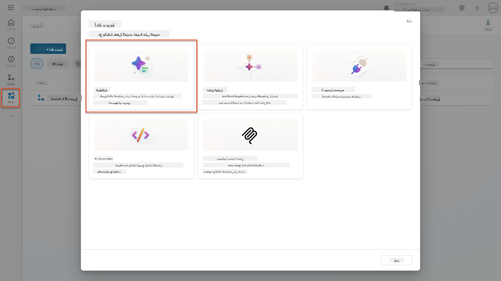

1. **أعد تسمية** المطلب من الاسم الافتراضي (مثل *مطلب مخصص 09/04/2025، 04:59:11 مساءً*) إلى `تلخيص السيرة الذاتية`.

1. في حقل التعليمات، أضف هذا المطلب:

    ```text
    You are tasked with extracting key candidate information from a resume and cover letter to facilitate matching with open job roles and creating a summary for application review.
    
    Instructions:
    1. Extract Candidate Details:
        - Identify and extract the candidate’s full name.
        - Extract contact information, specifically the email address.
    2. Create Candidate Summary:
        - Summarize the candidate’s profile as multiline text (max 2000 characters) with the following sections:
            - Candidate name
            - Role(s) applied for if present
            - Contact and location
            - One-paragraph summary
            - Experience snapshot (last 2–3 roles with outcomes)
            - Key projects (1–3 with metrics)
            - Education and certifications
            - Top skills (Top 10)
            - Availability and work authorization
    
    Guidelines:
    - Extract information only from the provided resume and cover letter documents.
    - Ensure accuracy in identifying all details such as contact details and skills.
    - The summary should be concise but informative, suitable for quick application review.
    
    Resume: /document
    CoverLetter: /text
    ```

    !!! tip "استخدام مساعدة Copilot"
        يمكنك استخدام "ابدأ مع Copilot" لإنشاء مطلبك باستخدام اللغة الطبيعية. جرب أن تطلب من Copilot إنشاء مطلب لتلخيص السيرة الذاتية!

1. **قم بتكوين** معلمات الإدخال:

    | المعلمة | النوع | الاسم | البيانات النموذجية |
    |-----------|------|------|-------------|
    | السيرة الذاتية | صورة أو وثيقة | السيرة الذاتية | قم بتحميل سيرة ذاتية نموذجية من مجلد البيانات التجريبية |
    | خطاب التغطية | نص | خطاب التغطية | هذه سيرة ذاتية! |

1. اختر **اختبار** لرؤية المخرجات النصية الأولية من مطلبك.  
    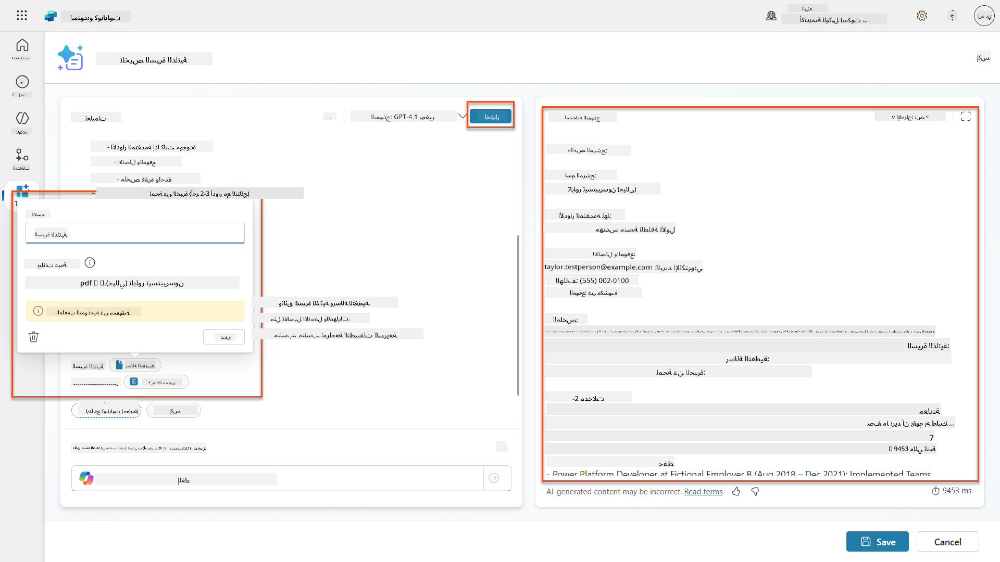

### 7.2 تكوين مخرجات JSON

الآن ستقوم بتحويل المطلب لإخراج بيانات JSON منظمة بدلاً من النص العادي.

1. أضف مواصفات تنسيق JSON إلى نهاية تعليمات مطلبك:

    ```text
    Output Format:
    Provide the output in valid JSON format with the following structure:
    
    {
        "CandidateName": "string",
        "Email": "string",
        "Summary": "string max 2000 characters",
        "Skills": [ {"item": "Skill 1"}, {"item": "Skill 2"}],
        "Experience": [ {"item": "Experience 1"}, {"item": "Experience 2"}],
    }
    ```

1. قم بتغيير إعداد **المخرجات** من "نص" إلى **JSON**.

1. اختر **اختبار** مرة أخرى للتحقق من أن المخرجات الآن بتنسيق JSON.  
    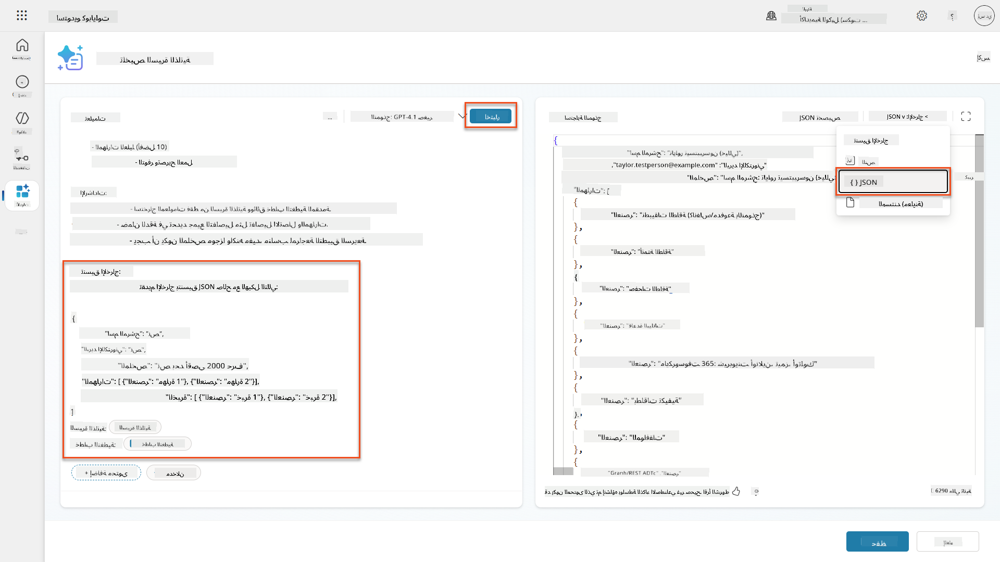

1. **اختياري:** جرب نماذج الذكاء الاصطناعي المختلفة لترى كيف تختلف المخرجات، ثم عد إلى النموذج الافتراضي.

1. اختر **حفظ** لإنشاء المطلب.

1. في مربع الحوار **تكوين للاستخدام في الوكيل**، اختر **إلغاء**.

    !!! info "لماذا لا نضيف هذا كأداة بعد"
        ستستخدم هذا المطلب في تدفق وكيل بدلاً من استخدامه مباشرة كأداة، مما يمنحك مزيدًا من التحكم في سير عمل معالجة البيانات.

### 7.3 إضافة المطلب إلى تدفق وكيل

ستقوم بإنشاء تدفق وكيل يستخدم مطلبك لمعالجة السير الذاتية المخزنة في Dataverse.

!!! tip "تعبيرات تدفق الوكيل"
    من المهم جدًا أن تتبع التعليمات لتسمية العقد وإدخال التعبيرات بدقة لأن التعبيرات تشير إلى العقد السابقة باستخدام اسمها! راجع [مهمة تدفق الوكيل في التوظيف](../../recruit/09-add-an-agent-flow/README.md#you-mentioned-expressions-what-are-expressions) للحصول على مراجعة سريعة!

1. انتقل إلى **وكيل التوظيف** داخل Copilot Studio

1. اختر علامة التبويب **الوكلاء**، واختر الوكيل الفرعي **وكيل استقبال الطلبات**

1. داخل لوحة **الأدوات**، اختر **+ إضافة** → **+ أداة جديدة** → **تدفق وكيل**

1. اختر عقدة عندما يستدعي الوكيل التدفق، استخدم **+ إضافة إدخال** لإضافة المعلمة التالية:

    | النوع | الاسم | الوصف |
    |------|------|-------------|
    | نص | رقم السيرة الذاتية | تأكد من استخدام [رقم السيرة الذاتية]. يجب أن يبدأ دائمًا بالحرف R |

1. اختر رمز **+** لإدراج إجراء أسفل العقدة الأولى، وابحث عن **Dataverse**، اختر **عرض المزيد**، ثم حدد إجراء **قائمة الصفوف**

1. اختر **النقاط الثلاث (...)** على عقدة قائمة الصفوف، واختر **إعادة تسمية** إلى `الحصول على سجل السيرة الذاتية`، ثم قم بتعيين المعلمات التالية:

    | الخاصية | كيفية التعيين | القيمة |
    |----------|------------|-------|
    | **اسم الجدول** | اختر | السير الذاتية |
    | **تصفية الصفوف** | البيانات الديناميكية (رمز البرق) | `ppa_resumenumber eq 'رقم السيرة الذاتية'` استبدل **رقم السيرة الذاتية** بـ **عندما يستدعي الوكيل التدفق** → **رقم السيرة الذاتية** |
    | **عدد الصفوف** | أدخل | 1 |

    !!! tip "تحسين الاستعلامات!"
        عند استخدام هذه التقنية في الإنتاج، يجب دائمًا تحديد الأعمدة التي يتم اختيارها فقط لتلك المطلوبة من قبل تدفق الوكيل.

    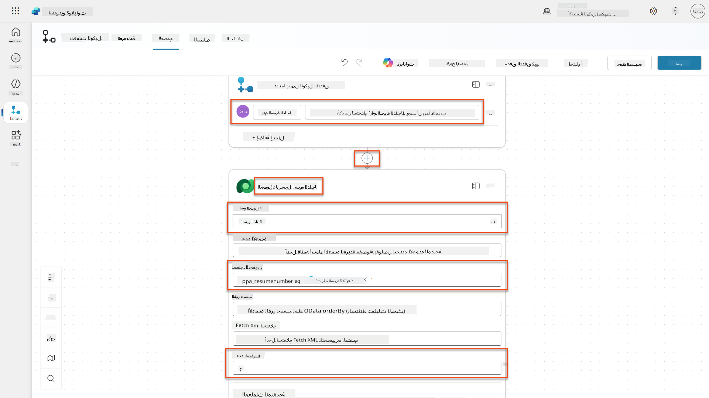

1. اختر رمز **+** لإدراج إجراء أسفل عقدة الحصول على سجل السيرة الذاتية، وابحث عن **Dataverse**، اختر **عرض المزيد**، ثم حدد إجراء **تنزيل ملف أو صورة**.

    !!! tip "اختر الإجراء الصحيح!"
        تأكد من عدم اختيار الإجراء الذي ينتهي بـ "من البيئة المحددة"

1. كما في السابق، أعد تسمية الإجراء إلى `تنزيل السيرة الذاتية`، ثم قم بتعيين المعلمات التالية:

    | الخاصية | كيفية التعيين | القيمة |
    |----------|------------|-------|
    | **اسم الجدول** | اختر | السير الذاتية |
    | **معرف الصف** | تعبير (رمز fx) | `first(body('الحصول_على_سجل_السيرة_الذاتية')?['value'])?['ppa_resumeid']` |
    | **اسم العمود** | اختر | PDF السيرة الذاتية |

    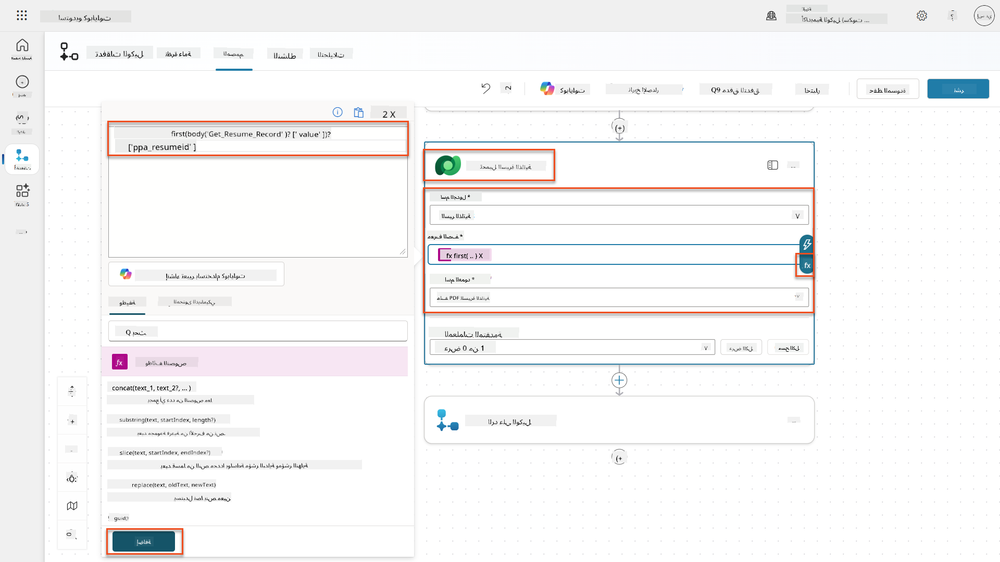

1. الآن، اختر رمز **+** لإدراج إجراء أسفل تنزيل السيرة الذاتية، تحت **قدرات الذكاء الاصطناعي**، اختر **تشغيل مطلب**،

1. أعد تسمية الإجراء إلى `تلخيص السيرة الذاتية` وقم بتعيين المعلمات التالية:

    | الخاصية | كيفية التعيين | القيمة |
    |----------|------------|-------|
| **المطالبة** | اختيار | تلخيص السيرة الذاتية |
| **خطاب التغطية** | تعبير (رمز fx) | `first(body('Get_Resume_Record')?['value'])?['ppa_coverletter']` |
| **السيرة الذاتية** | بيانات ديناميكية (رمز البرق) | تنزيل السيرة الذاتية → محتوى الملف أو الصورة |

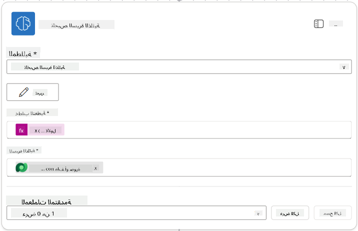

!!! tip "معلمات المطالبة"
لاحظ أن المعلمات التي تقوم بملئها هي نفس المعلمات التي قمت بتكوينها كمعلمات إدخال عند إنشاء المطالبة.

### 7.4 إنشاء سجل المرشح

الخطوة التالية هي أخذ المعلومات التي قدمتها المطالبة وإنشاء سجل مرشح جديد إذا لم يكن موجودًا بالفعل.

1. اختر رمز الإجراء **+ إدراج** أسفل عقدة تلخيص السيرة الذاتية، وابحث عن **Dataverse**، ثم اختر **عرض المزيد**، ثم حدد إجراء **List rows**.

1. أعد تسمية العقدة إلى `Get Existing Candidate`، ثم قم بتعيين المعلمات التالية:

| الخاصية | كيفية التعيين | القيمة |
|---------|---------------|--------|
| **اسم الجدول** | اختيار | المرشحين |
| **تصفية الصفوف** | بيانات ديناميكية (رمز البرق) | `ppa_email eq 'Email'`  **استبدل** `Email` بـ **تلخيص السيرة الذاتية → البريد الإلكتروني** |
| **عدد الصفوف** | إدخال | 1 |

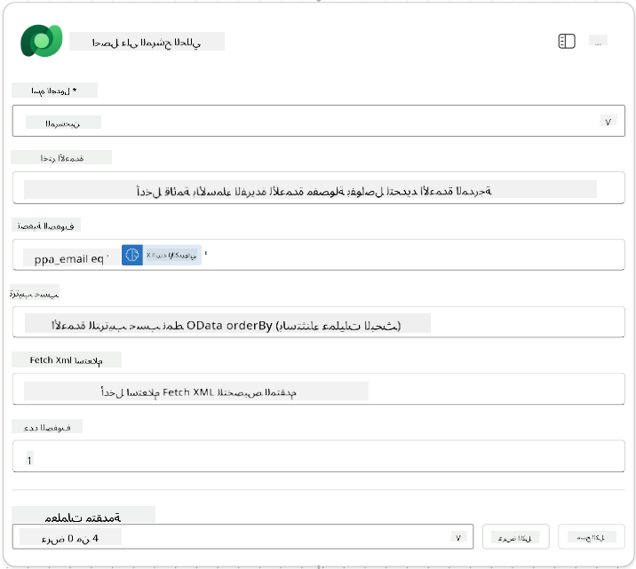

1. اختر رمز الإجراء **+ إدراج** أسفل عقدة Get Existing Candidate، وابحث عن **Control**، ثم اختر **عرض المزيد**، ثم حدد إجراء **Condition**.

1. في خصائص الشرط، قم بتعيين الشرط التالي:

| الشرط | المشغل | القيمة |
|-------|--------|--------|
| تعبير (رمز fx): `length(outputs('Get_Existing_Candidate')?['body/value'])` | يساوي | 0 |

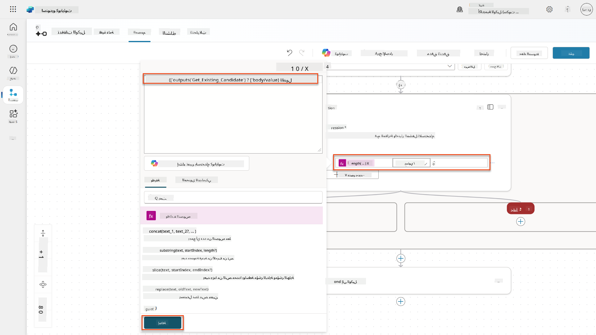

1. اختر رمز الإجراء **+ إدراج** في الفرع **True**، وابحث عن **Dataverse**، ثم اختر **عرض المزيد**، ثم حدد إجراء **Add a new row**.

1. أعد تسمية العقدة إلى `Add a New Candidate`، ثم قم بتعيين المعلمات التالية:

| الخاصية | كيفية التعيين | القيمة |
|---------|---------------|--------|
| **اسم الجدول** | اختيار | المرشحين |
| **اسم المرشح** | بيانات ديناميكية (رمز البرق) | تلخيص السيرة الذاتية → `CandidateName` |
| **البريد الإلكتروني** | بيانات ديناميكية (رمز البرق) | تلخيص السيرة الذاتية → `Email` |

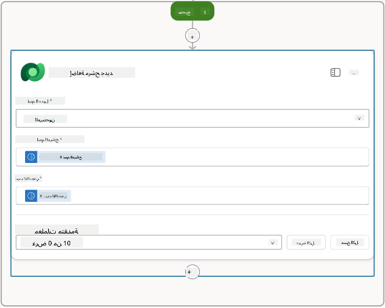

### 7.5 تحديث السيرة الذاتية وتكوين مخرجات التدفق

أكمل التدفق عن طريق تحديث سجل السيرة الذاتية وتكوين البيانات التي سيتم إرجاعها إلى وكيلك.

1. اختر رمز الإجراء **+ إدراج** أسفل الشرط، وابحث عن **Dataverse**، ثم اختر **عرض المزيد**، ثم حدد إجراء **Update a row**.

1. اختر العنوان لإعادة تسمية العقدة إلى `Update Resume`، ثم اختر **عرض الكل**، وقم بتعيين المعلمات التالية:

| الخاصية | كيفية التعيين | القيمة |
|---------|---------------|--------|
| **اسم الجدول** | اختيار | السير الذاتية |
| **معرف الصف** | تعبير (رمز fx) | `first(body('Get_Resume_Record')?['value'])?['ppa_resumeid']` |
| **الملخص** | بيانات ديناميكية (رمز البرق) | تلخيص السيرة الذاتية → النص |
| **المرشح (المرشحين)** | تعبير (رمز fx) | `if(equals(length(outputs('Get_Existing_Candidate')?['body/value']), 1), first(outputs('Get_Existing_Candidate')?['body/value'])?['ppa_candidateid'], outputs('Add_a_New_Candidate')?['body/ppa_candidateid'])` |

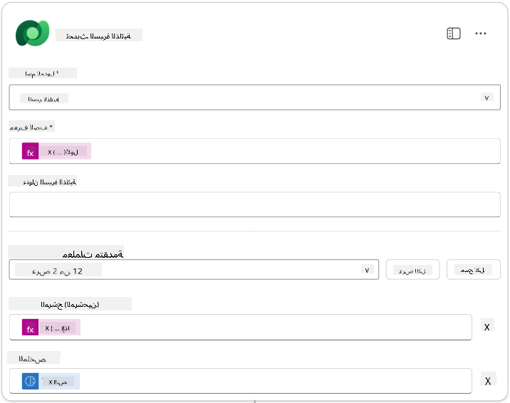

1. اختر عقدة **Respond to the agent** ثم استخدم **+ إضافة مخرج** لتكوين:

| النوع | الاسم              | كيفية التعيين                      | القيمة                                                        | الوصف                                            |
|-------|--------------------|------------------------------------|--------------------------------------------------------------|------------------------------------------------|
| نص    | `CandidateName`   | بيانات ديناميكية (رمز البرق)       | تلخيص السيرة الذاتية → عرض المزيد → CandidateName             | [اسم المرشح] المذكور في السيرة الذاتية         |
| نص    | `CandidateEmail`  | بيانات ديناميكية (رمز البرق)       | تلخيص السيرة الذاتية → عرض المزيد → البريد الإلكتروني         | [البريد الإلكتروني للمرشح] المذكور في السيرة الذاتية |
| نص    | `CandidateNumber` | تعبير (رمز fx)                    | `concat('ppa_candidates/', if(equals(length(outputs('Get_Existing_Candidate')?['body/value']), 1), first(outputs('Get_Existing_Candidate')?['body/value'])?['ppa_candidateid'], outputs('Add_a_New_Candidate')?['body/ppa_candidateid']) )` | [رقم المرشح] للمرشح الجديد أو الحالي          |
| نص    | `ResumeSummary`   | بيانات ديناميكية (رمز البرق)       | تلخيص السيرة الذاتية → عرض المزيد → body/responsev2/predictionOutput/structuredOutput | ملخص السيرة الذاتية وتفاصيلها بصيغة JSON       |

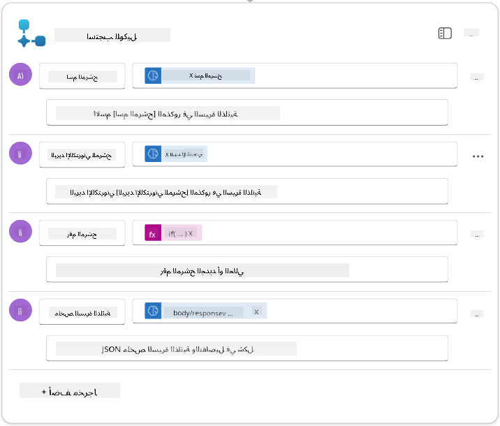

1. اختر **حفظ المسودة** في الزاوية العلوية اليمنى. يجب أن يبدو تدفق الوكيل الخاص بك كما يلي  
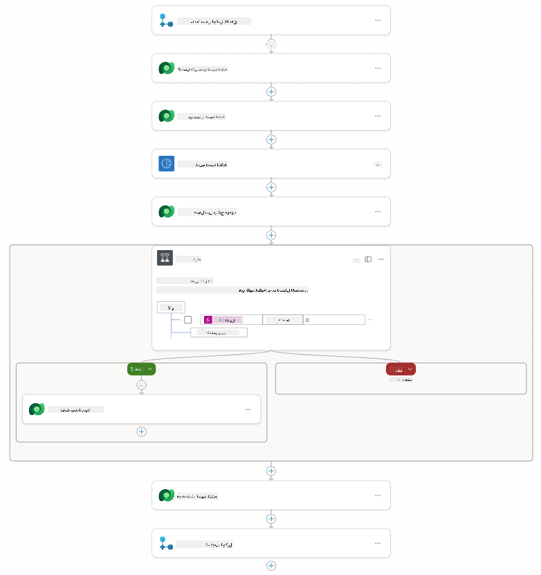

1. اختر علامة التبويب **نظرة عامة**، ثم اختر **تحرير** في لوحة **التفاصيل**.

    1. **اسم التدفق**: `Summarize Resume`
    1. **الوصف**:

        ```text
        Summarize an existing Resume stored in Dataverse using a [ResumeNumber] as input, return the [CandidateNumber], and resume summary JSON
        ```

1. اختر **حفظ**.

1. اختر علامة التبويب **المصمم** مرة أخرى، ثم اختر **نشر**.

### 7.6 ربط التدفق بوكيلك

الآن ستضيف التدفق كأداة وتقوم بتكوين وكيلك لاستخدامه.

1. افتح **وكيل التوظيف** داخل Copilot Studio.

1. اختر علامة التبويب **الوكلاء**، وافتح **وكيل استلام الطلبات**.

1. اختر لوحة **الأدوات**، ثم اختر **+ إضافة أداة** -> **تدفق** -> **تلخيص السيرة الذاتية** **(تدفق الوكيل)**.

1. اختر **إضافة وتكوين**.

1. قم بتكوين إعدادات الأداة كما يلي:

| الإعداد | القيمة |
|---------|--------|
| **الوصف** | تلخيص السيرة الذاتية الموجودة في Dataverse باستخدام [رقم السيرة الذاتية] كمدخل، وإرجاع [رقم المرشح] وملخص السيرة الذاتية بصيغة JSON |
| **متى يمكن استخدام هذه الأداة** | فقط عند الإشارة إليها بواسطة المواضيع أو الوكلاء |

1. اختر **حفظ**  
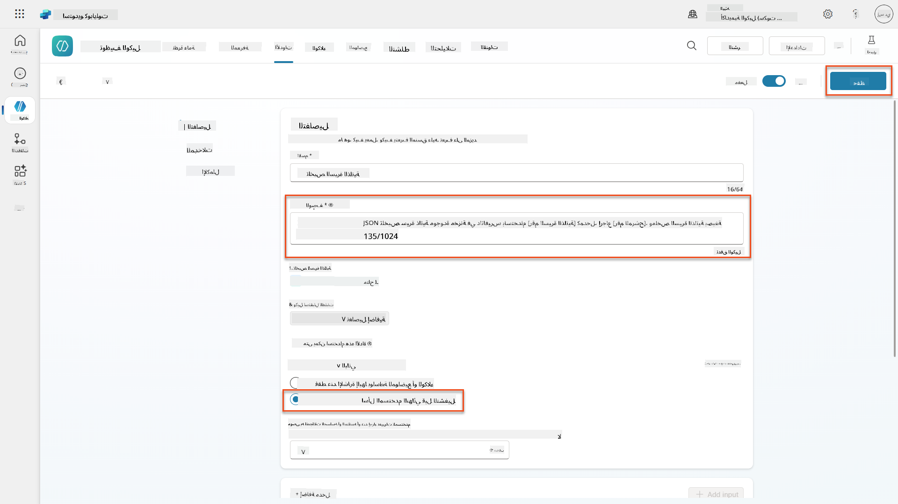

1. إذا اخترت الأدوات داخل وكيل التوظيف، سترى الآن كلا الأداتين تظهران أنهما قابلتان للاستخدام بواسطة **وكيل استلام الطلبات**.  
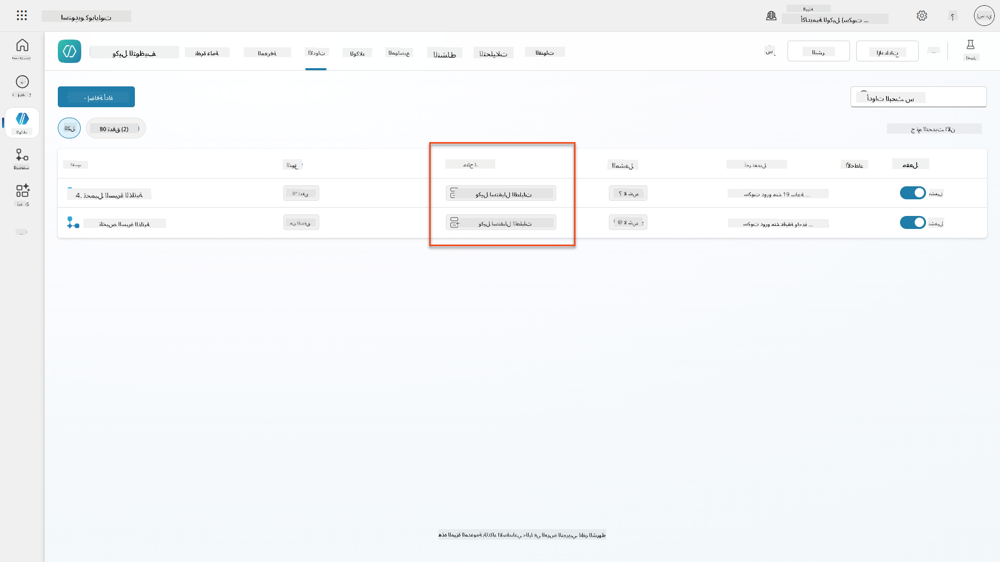

1. انتقل إلى تعليمات وكيل **استلام الطلبات الفرعي**، وقم بتعديل خطوة **ما بعد التحميل** لتكون كما يلي:

    ```text
    2. Post-Upload Processing  
        - After uploading, be sure to also output the [ResumeNumber] in all messages
        - Pass [ResumeNumber] to /Summarize Resume  - Be sure to use the correct value that will start with the letter R.
        - Be sure to also output the [CandidateNumber] in all messages
        - Use the [ResumeSummary] to output a summary of the processed Resume and candidate
    ```

استبدل `/Summarize Resume` بإدراج إشارة إلى تدفق وكيل تلخيص السيرة الذاتية عن طريق كتابة شرطة مائلة (`/)` أو اختيار `/Summarize` لإدراج الإشارة.  
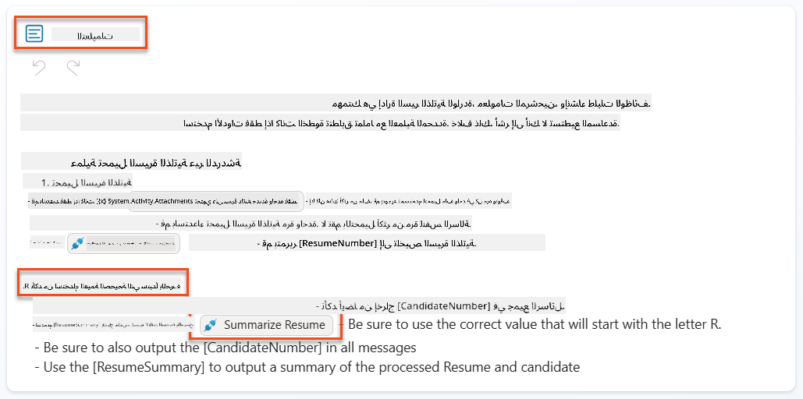

1. اختر **حفظ**.

### 7.7 اختبار وكيلك

اختبر نظامك متعدد الوسائط بالكامل للتأكد من أن كل شيء يعمل بشكل صحيح.

1. **ابدأ الاختبار**:

    - اختر **اختبار** لفتح لوحة الاختبار
    - اكتب: `هذه سيرة ذاتية لمرشح`

    - قم بتحميل إحدى السير الذاتية النموذجية من [سير ذاتية للاختبار](https://download-directory.github.io/?url=https://github.com/microsoft/agent-academy/tree/main/operative/sample-data/resumes&filename=operative_sampledata)

1. **تحقق من النتائج**:
    - بمجرد إرسال الرسالة والسيرة الذاتية، تحقق من أنك تلقيت رقم السيرة الذاتية (التنسيق: R#####)
    - تحقق من أنك حصلت على رقم المرشح والملخص
    - استخدم خريطة النشاط لرؤية أداة تحميل السيرة الذاتية وأداة تلخيص السيرة الذاتية أثناء العمل، وتلقي المخرجات من مطالبة الملخص بواسطة الوكيل:  
        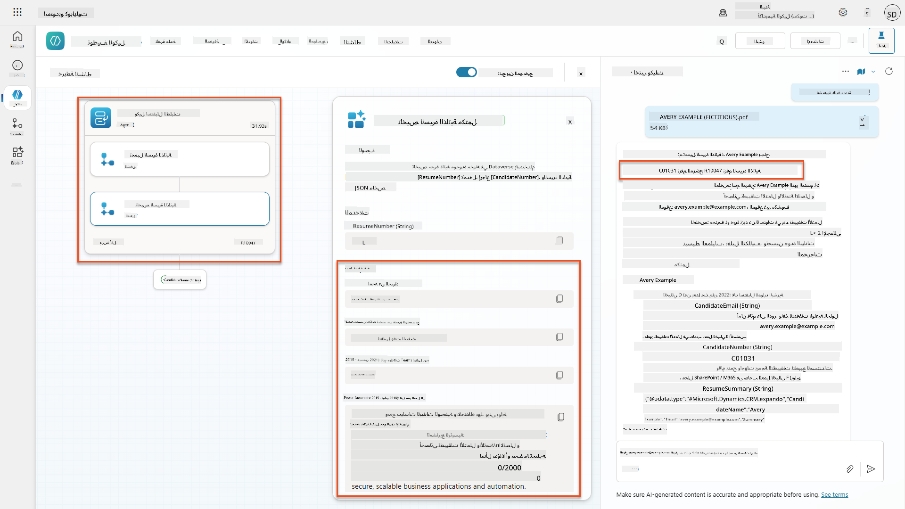

1. **تحقق من استمرارية البيانات**:
    - انتقل إلى [Power Apps](https://make.powerapps.com)
    - افتح **التطبيقات** → **Hiring Hub** → **تشغيل**
    - انتقل إلى **السير الذاتية** للتحقق من أن السيرة الذاتية تم تحميلها ومعالجتها. يجب أن تحتوي على معلومات الملخص وسجل المرشح المرتبط.
    - تحقق من **المرشحين** لرؤية معلومات المرشح المستخرجة  
        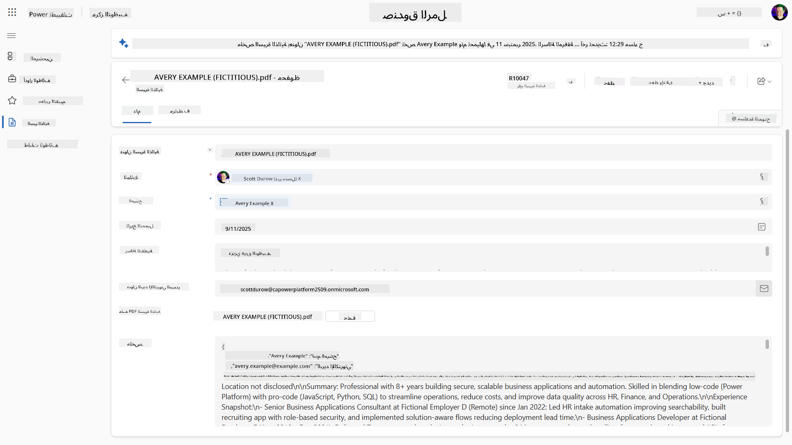
    - عندما تقوم بتشغيل العملية مرة أخرى، يجب أن تستخدم المرشح الحالي (المطابق للبريد الإلكتروني المستخرج من السيرة الذاتية) بدلاً من إنشاء مرشح جديد.

!!! tip "استكشاف الأخطاء وإصلاحها"
    - **السيرة الذاتية لا تتم معالجتها**: تأكد من أن الملف بصيغة PDF وتحت حدود الحجم
    - **لم يتم إنشاء مرشح**: تحقق من أن البريد الإلكتروني تم استخراجه بشكل صحيح من السيرة الذاتية
    - **أخطاء صيغة JSON**: تحقق من أن تعليمات المطالبة تتضمن الهيكل الدقيق لـ JSON
    - **أخطاء التدفق**: تحقق من أن جميع اتصالات Dataverse والتعبيرات تم تكوينها بشكل صحيح

### جاهزية الإنتاج

على الرغم من أن هذا ليس جزءًا من هذه المهمة، لجعل تدفق الوكيل جاهزًا للإنتاج قد تفكر أيضًا في التالي:

1. **معالجة الأخطاء** - إذا لم يتم العثور على رقم السيرة الذاتية، أو فشلت المطالبة في تحليل المستند، يجب إضافة معالجة الأخطاء لإرجاع خطأ واضح للوكيل.
1. **تحديث المرشحين الحاليين** - يتم العثور على المرشح باستخدام البريد الإلكتروني، ثم يمكن تحديث الاسم ليتطابق مع الموجود في السيرة الذاتية.
1. **تقسيم تلخيص السيرة الذاتية وإنشاء المرشح** - يمكن تقسيم هذه الوظيفة إلى تدفقات وكيل أصغر لجعلها أسهل في الصيانة، ثم إعطاء الوكيل تعليمات لاستخدامها بالتتابع.

## 🎉 المهمة مكتملة

عمل رائع، أيها العميل! **استعادة السيرة الذاتية** الآن مكتملة. لقد أتقنت بنجاح المطالبات متعددة الوسائط ويمكنك الآن استخراج البيانات المنظمة من أي مستند بدقة.

إليك ما أنجزته في هذه المهمة:

**✅ إتقان المطالبات متعددة الوسائط**  
أنت الآن تفهم ما هي المطالبات متعددة الوسائط ومتى تستخدم نماذج الذكاء الاصطناعي المختلفة لتحقيق أفضل النتائج.

**✅ خبرة في معالجة المستندات**  
لقد تعلمت كيفية تكوين المطالبات باستخدام مدخلات الصور والمستندات، وتنسيق المخرجات بصيغة JSON لاستخراج البيانات المنظمة.

**✅ نظام استخراج السيرة الذاتية**  
لقد أنشأت نظامًا كاملاً لاستخراج السيرة الذاتية يعالج مستندات المرشحين ويتكامل مع سير عمل التوظيف الخاص بك.

**✅ تنفيذ أفضل الممارسات**  
لقد طبقت أفضل الممارسات لهندسة المطالبات مع تحليل المستندات ودمج المطالبات متعددة الوسائط مع تدفقات الوكيل.

**✅ أساس للمعالجة المتقدمة**  
قدراتك المحسنة لتحليل المستندات جاهزة الآن لميزات ربط البيانات المتقدمة التي سنضيفها في المهام القادمة.

🚀 **التالي:** في المهمة 08، ستكتشف كيفية تحسين المطالبات باستخدام البيانات في الوقت الفعلي من Dataverse، مما يخلق حلول ذكاء اصطناعي ديناميكية تتكيف مع متطلبات العمل المتغيرة.

⏩ [انتقل إلى المهمة 08: تحسين المطالبات باستخدام ربط Dataverse](../08-dataverse-grounding/README.md)

## 📚 موارد تكتيكية

📖 [إنشاء مطالبة](https://learn.microsoft.com/ai-builder/create-a-custom-prompt?WT.mc_id=power-power-182762-scottdurow)

📖 [إضافة نص أو صورة أو مدخل مستند إلى المطالبة](https://learn.microsoft.com/ai-builder/add-inputs-prompt?WT.mc_id=power-182762-scottdurow)

📖 [معالجة الردود بمخرجات JSON](https://learn.microsoft.com/ai-builder/process-responses-json-output?WT.mc_id=power-182762-scottdurow)

📖 [اختيار النموذج وإعدادات درجة الحرارة](https://learn.microsoft.com/ai-builder/prompt-modelsettings?WT.mc_id=power-182762-scottdurow)

📖 [استخدام المطالبة في Power Automate](https://learn.microsoft.com/ai-builder/use-a-custom-prompt-in-flow?WT.mc_id=power-182762-scottdurow)

📺 [AI Builder: مخرجات JSON في منشئ المطالبات](https://www.youtube.com/watch?v=F0fGnWrRY_I)

---

**إخلاء المسؤولية**:  
تم ترجمة هذا المستند باستخدام خدمة الترجمة بالذكاء الاصطناعي [Co-op Translator](https://github.com/Azure/co-op-translator). بينما نسعى لتحقيق الدقة، يرجى العلم أن الترجمات الآلية قد تحتوي على أخطاء أو عدم دقة. يجب اعتبار المستند الأصلي بلغته الأصلية المصدر الرسمي. للحصول على معلومات حاسمة، يُوصى بالترجمة البشرية الاحترافية. نحن غير مسؤولين عن أي سوء فهم أو تفسيرات خاطئة تنشأ عن استخدام هذه الترجمة.