<!--
CO_OP_TRANSLATOR_METADATA:
{
  "original_hash": "750f3ea8a94930439ebd8a10871b1d73",
  "translation_date": "2025-10-22T18:55:10+00:00",
  "source_file": "docs/operative-preview/08-dataverse-grounding/README.md",
  "language_code": "ar"
}
-->
# 🚨 المهمة 08: تحسين التعليمات باستخدام الربط مع Dataverse

## 🕵️‍♂️ الاسم الرمزي: `عملية التحكم في الربط`

> **⏱️ مدة العملية:** `~60 دقيقة`

## 🎯 ملخص المهمة

مرحبًا بك مجددًا، أيها العميل. نظام التوظيف متعدد الوكلاء الخاص بك يعمل، ولكن هناك تحسينًا حاسمًا مطلوبًا لربط البيانات - تحتاج نماذج الذكاء الاصطناعي الخاصة بك إلى الوصول الفوري إلى البيانات المنظمة لمؤسستك لاتخاذ قرارات ذكية.

حاليًا، يعمل طلب تلخيص السيرة الذاتية الخاص بك بمعرفة ثابتة. ولكن ماذا لو كان بإمكانه الوصول ديناميكيًا إلى قاعدة بيانات الوظائف لتقديم تطابقات دقيقة ومحدثة؟ ماذا لو فهم معايير التقييم الخاصة بك دون الحاجة إلى برمجتها يدويًا؟

في هذه المهمة، ستقوم بتحسين التعليمات المخصصة الخاصة بك باستخدام **ربط Dataverse** - ربط التعليمات مباشرة بمصادر البيانات الحية. هذا يحول وكلائك من مستجيبين ثابتين إلى أنظمة ديناميكية تعتمد على البيانات وتتكيف مع احتياجات العمل المتغيرة.

مهمتك: دمج بيانات الوظائف ومعايير التقييم في الوقت الحقيقي في سير عمل تحليل السيرة الذاتية، لإنشاء نظام ذاتي التحديث يظل متوافقًا مع متطلبات التوظيف لمؤسستك.

## 🔎 الأهداف

في هذه المهمة، ستتعلم:

1. كيف يعزز **ربط Dataverse** التعليمات المخصصة
1. متى تستخدم الربط مع البيانات مقابل التعليمات الثابتة
1. تصميم تعليمات تدمج البيانات الحية ديناميكيًا
1. تحسين تدفق تلخيص السيرة الذاتية بمطابقة الوظائف

## 🧠 فهم الربط مع Dataverse للتعليمات

**ربط Dataverse** يسمح للتعليمات المخصصة الخاصة بك بالوصول إلى البيانات الحية من جداول Dataverse عند معالجة الطلبات. بدلاً من التعليمات الثابتة، يمكن لتعليماتك دمج المعلومات في الوقت الحقيقي لاتخاذ قرارات مستنيرة.

### لماذا الربط مع Dataverse مهم

التعليمات التقليدية تعمل بتعليمات ثابتة:

```text
Match this candidate to these job roles: Developer, Manager, Analyst
```

مع الربط مع Dataverse، تصل التعليمات إلى البيانات الحالية:

```text
Match this candidate to available job roles from the Job Roles table, 
considering current evaluation criteria and requirements
```

يوفر هذا النهج العديد من الفوائد الرئيسية:

- **التحديثات الديناميكية:** تتغير الوظائف والمعايير دون الحاجة إلى تعديل التعليمات
- **الاتساق:** يستخدم جميع الوكلاء نفس مصادر البيانات الحالية
- **التوسع:** تتوفر الوظائف والمعايير الجديدة تلقائيًا
- **الدقة:** البيانات في الوقت الحقيقي تضمن أن القرارات تعكس الاحتياجات الحالية

### كيف يعمل الربط مع Dataverse

عند تمكين الربط مع Dataverse لتعليمات مخصصة:

1. **اختيار البيانات:** اختر جداول وأعمدة Dataverse المحددة لتضمينها. يمكنك أيضًا اختيار الجداول ذات الصلة التي سيقوم النظام بتصفية بناءً على السجلات الرئيسية المسترجعة.
1. **حقن السياق:** يتم تضمين البيانات المسترجعة تلقائيًا في سياق التعليمات
1. **التصفية الذكية:** يتضمن النظام فقط البيانات ذات الصلة بالطلب الحالي إذا قدمت أي تصفية.
1. **الإخراج المنظم:** يمكن لتعليماتك الرجوع إلى البيانات المسترجعة والتفكير في السجلات المسترجعة لإنشاء الإخراج.

### من الثابت إلى الديناميكي: ميزة الربط

لنلقِ نظرة على تدفق تلخيص السيرة الذاتية الحالي الخاص بك من المهمة 07 ونرى كيف يحول الربط مع Dataverse هذا التدفق من الذكاء الثابت إلى الديناميكي.

**النهج الثابت الحالي:**
تتضمن التعليمات الحالية معايير تقييم مبرمجة مسبقًا ومنطق مطابقة محدد مسبقًا. يعمل هذا النهج ولكنه يتطلب تحديثات يدوية كلما أضفت وظائف جديدة، أو غيرت معايير التقييم، أو غيرت أولويات الشركة.

**تحول الربط مع Dataverse:**
بإضافة الربط مع Dataverse، سيقوم تدفق تلخيص السيرة الذاتية الخاص بك بـ:

- **الوصول إلى الوظائف الحالية** من جدول الوظائف
- **استخدام معايير التقييم الحية** بدلاً من الوصف الثابت  
- **تقديم تطابقات دقيقة** بناءً على المتطلبات في الوقت الحقيقي

## 🎯 لماذا التعليمات المخصصة مقابل محادثات الوكلاء

في المهمة 02، اختبرت كيف يمكن لوكيل المقابلة مطابقة المرشحين مع الوظائف، ولكنه يتطلب تعليمات معقدة من المستخدم مثل:

```text
Upload this resume, then show me open job roles,
each with a description of the evaluation criteria, 
then use this to match the resume to at least one suitable
job role even if not a perfect match.
```

بينما كان هذا يعمل، تقدم التعليمات المخصصة مع الربط مع Dataverse مزايا كبيرة للمهام المحددة:

### المزايا الرئيسية للتعليمات المخصصة

| الجانب | محادثات الوكلاء | التعليمات المخصصة |
|--------|-------------------|------------------|
| **الاتساق** | تختلف النتائج بناءً على مهارات صياغة التعليمات لدى المستخدم | معالجة موحدة في كل مرة |
| **التخصص** | قد تفوت الاستدلالات العامة الفروق الدقيقة في العمل | مصممة خصيصًا بمنطق عمل محسن |
| **الأتمتة** | تتطلب تفاعلًا بشريًا وتفسيرًا | يتم تشغيلها تلقائيًا مع إخراج JSON منظم |

## 🧪 مختبر 8: إضافة الربط مع Dataverse للتعليمات

حان الوقت لترقية قدرات تحليل السيرة الذاتية الخاصة بك! ستقوم بتحسين تدفق تلخيص السيرة الذاتية الحالي بمطابقة الوظائف الديناميكية.

### المتطلبات لإكمال هذه المهمة

1. ستحتاج إلى **إما**:

    - **إكمال المهمة 07** ولديك نظام تحليل السيرة الذاتية جاهز، **أو**
    - **استيراد حل البداية للمهمة 08** إذا كنت تبدأ من جديد أو تحتاج إلى اللحاق. [تحميل حل البداية للمهمة 08](https://aka.ms/agent-academy)

1. مستندات السيرة الذاتية النموذجية من [اختبار السير الذاتية](https://download-directory.github.io/?url=https://github.com/microsoft/agent-academy/tree/main/operative/sample-data/resumes&filename=operative_sampledata)

!!! note "استيراد الحل والبيانات النموذجية"
    إذا كنت تستخدم حل البداية، راجع [المهمة 01](../01-get-started/README.md) للحصول على تعليمات مفصلة حول كيفية استيراد الحلول والبيانات النموذجية إلى بيئتك.

### 8.1 إضافة الربط مع Dataverse للتعليمات

ستبني على تعليمات تلخيص السيرة الذاتية التي أنشأتها في المهمة 07. حاليًا، تقوم فقط بتلخيص السيرة الذاتية، ولكن الآن ستربطها مع الوظائف كما هي موجودة حاليًا في Dataverse، مما يجعلها دائمًا محدثة.

أولاً، دعنا نستعرض جداول Dataverse التي ستربطها:

1. **انتقل** إلى [Power Apps](https://make.powerapps.com) واختر بيئتك باستخدام **مبدل البيئة** في أعلى يمين شريط التنقل.

1. اختر **الجداول** وابحث عن جدول **الوظائف**

1. استعرض الأعمدة الرئيسية التي ستستخدمها للربط:

    | العمود | الغرض |
    |--------|---------|
    | **رقم الوظيفة** | معرف فريد لمطابقة الوظائف |
    | **عنوان الوظيفة** | اسم العرض للوظيفة |
    | **الوصف** | متطلبات الوظيفة بالتفصيل |

1. بالمثل، استعرض الجداول الأخرى مثل جدول **معايير التقييم**.

### 8.2 إضافة بيانات الربط مع Dataverse للتعليمات

1. **انتقل** إلى Copilot Studio، واختر بيئتك باستخدام **مبدل البيئة** في أعلى يمين شريط التنقل.

1. اختر **الأدوات** من التنقل الجانبي.

1. اختر **التعليمات** وابحث عن تعليمات **تلخيص السيرة الذاتية** من المهمة 07.  
    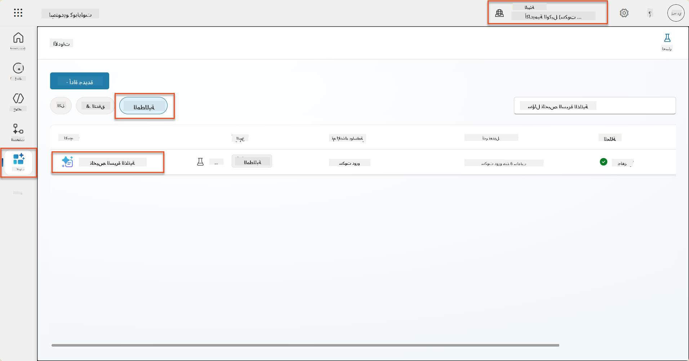

1. اختر **تعديل** لتعديل التعليمات، واستبدلها بالإصدار المحسن أدناه:

    !!! important
        تأكد من أن معلمات السيرة الذاتية وخطاب التغطية تبقى سليمة كمعلمات.

    ```text
    You are tasked with extracting key candidate information from a resume and cover letter to facilitate matching with open job roles and creating a summary for application review.
    
    ### Instructions:
    1. **Extract Candidate Details:**
       - Identify and extract the candidate's full name.
       - Extract contact information, specifically the email address.
    
    2. **Analyze Resume and Cover Letter:**
       - Review the resume content to identify relevant skills, experience, and qualifications.
       - Review the cover letter to understand the candidate's motivation and suitability for the roles.
    
    3. **Match Against Open Job Roles:**
       - Compare the extracted candidate information with the requirements and descriptions of the provided open job roles.
       - Use the job descriptions to assess potential fit.
       - Identify all roles that align with the candidate's cover letter and profile. You don't need to assess perfect suitability.
       - Provide reasoning for each match based on the specific job requirements.
    
    4. **Create Candidate Summary:**
       - Summarize the candidate's profile as multiline text with the following sections:
          - Candidate name
          - Role(s) applied for if present
          - Contact and location
          - One-paragraph summary
          - Top skills (8–10)
          - Experience snapshot (last 2–3 roles with outcomes)
          - Key projects (1–3 with metrics)
          - Education and certifications
          - Availability and work authorization
    
    ### Output Format
    
    Provide the output in valid JSON format with the following structure:
    
    {
      "CandidateName": "string",
      "Email": "string",
      "MatchedRoles": [
        {
          "JobRoleNumber": "ppa_jobrolenumber from grounded data",
          "RoleName": "ppa_jobtitle from grounded data",
          "Reasoning": "Detailed explanation based on job requirements"
        }
      ],
      "Summary": "string"
    }
    
    ### Guidelines
    
    - Extract information only from the provided resume and cover letter documents.
    - Ensure accuracy in identifying contact details.
    - Use the available job role data for matching decisions.
    - The summary should be concise but informative, suitable for quick application review.
    - If no suitable matches are found, indicate an empty list for MatchedRoles and explain briefly in the summary.
    
    ### Input Data
    Open Job Roles (ppa_jobrolenumber, ppa_jobtitle): /Job Role 
    Resume: {Resume}
    Cover Letter: {CoverLetter}
    ```

1. في محرر التعليمات، استبدل `/Job Role` عن طريق اختيار **+ إضافة محتوى**، اختيار **Dataverse** → **Job Role** واختر الأعمدة التالية، ثم اختر **إضافة**:

    1. **رقم الوظيفة**

    1. **عنوان الوظيفة**

    1. **الوصف**

    !!! tip
        يمكنك كتابة اسم الجدول للبحث.

1. في مربع الحوار الخاص بـ **Job Role**، اختر **تصفية**، اختر خاصية **الحالة**، ثم اكتب **نشط** كقيمة **التصفية**.  
    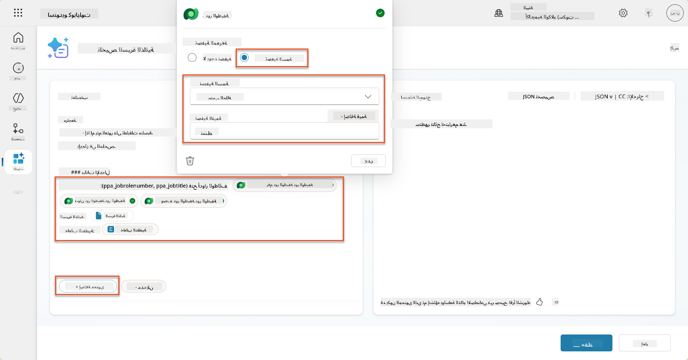

    !!! tip
        يمكنك استخدام **إضافة قيمة** هنا لإضافة معلمة إدخال أيضًا - على سبيل المثال إذا كان لديك تعليمات لتلخيص سجل موجود، يمكنك تقديم رقم السيرة الذاتية كمعلمة للتصفية.

1. بعد ذلك، ستضيف جدول Dataverse المرتبط **معايير التقييم**، عن طريق اختيار **+ إضافة محتوى**، العثور على **Job Roles**، وبدلاً من اختيار الأعمدة في Job Role، قم بتوسيع **Job Role (Evaluation Criteria)** واختر الأعمدة التالية، ثم اختر **إضافة**:

    1. **اسم المعيار**

    1. **الوصف**  
        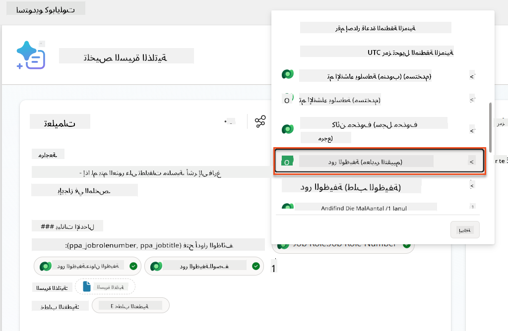

        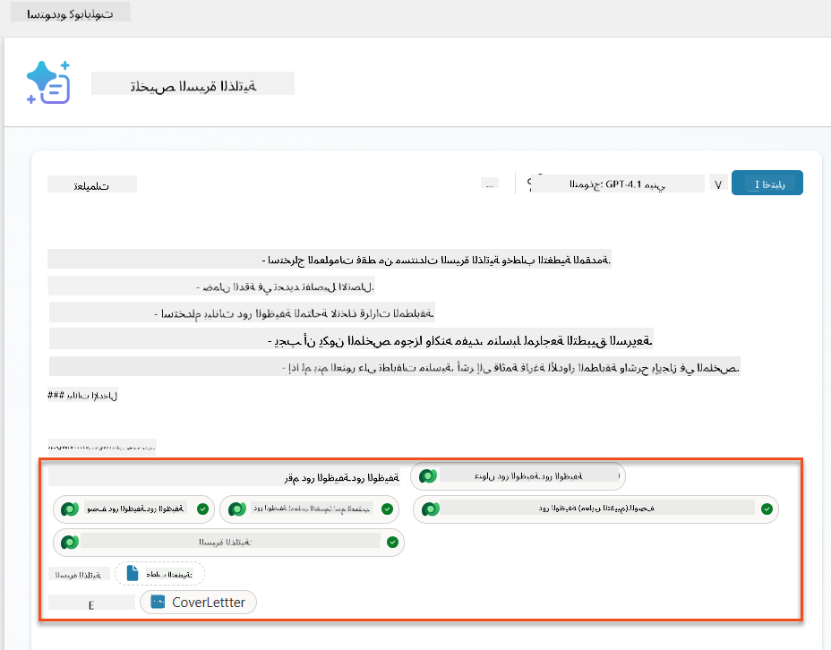

    !!! tip
        من المهم اختيار معايير التقييم المرتبطة عن طريق اختيار الوظيفة أولاً، ثم التنقل في القائمة إلى Job Role (Evaluation Criteria). سيضمن هذا أن السجلات المرتبطة فقط للوظيفة سيتم تحميلها.

1. اختر **الإعدادات**، وقم بتعديل **استرجاع السجلات** إلى 1000 - سيسمح هذا بأقصى عدد من الوظائف ومعايير التقييم ليتم تضمينها في التعليمات.  
    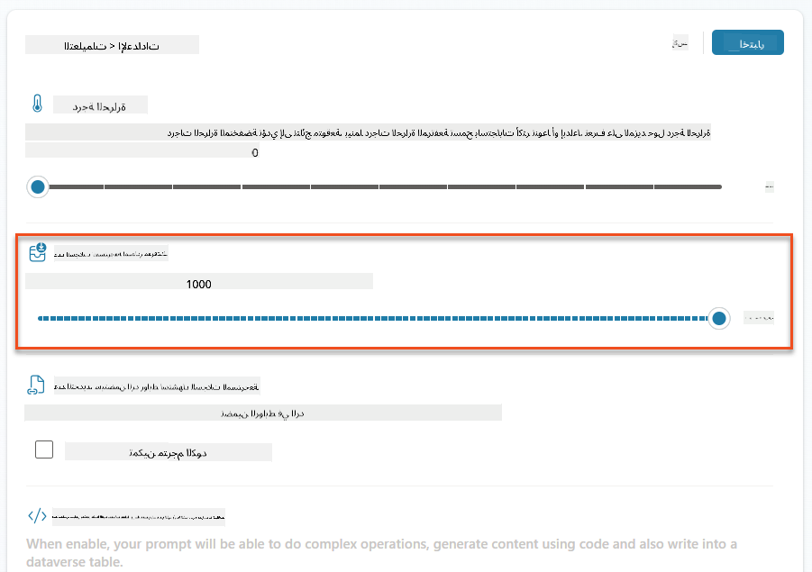

### 8.3 اختبار التعليمات المحسنة

1. اختر معلمة **السيرة الذاتية**، وقم بتحميل سيرة ذاتية نموذجية استخدمتها في المهمة 07.
1. اختر **اختبار**.
1. بمجرد تشغيل الاختبار، لاحظ أن الإخراج JSON الآن يتضمن **الوظائف المطابقة**.
1. اختر علامة التبويب **المعرفة المستخدمة**، لرؤية بيانات Dataverse التي تم دمجها مع التعليمات قبل التنفيذ.
1. **احفظ** التعليمات المحدثة الخاصة بك. سيقوم النظام الآن تلقائيًا بتضمين بيانات Dataverse هذه مع التعليمات عندما يقوم تدفق وكيل تلخيص السيرة الذاتية الحالي باستدعائها.  
    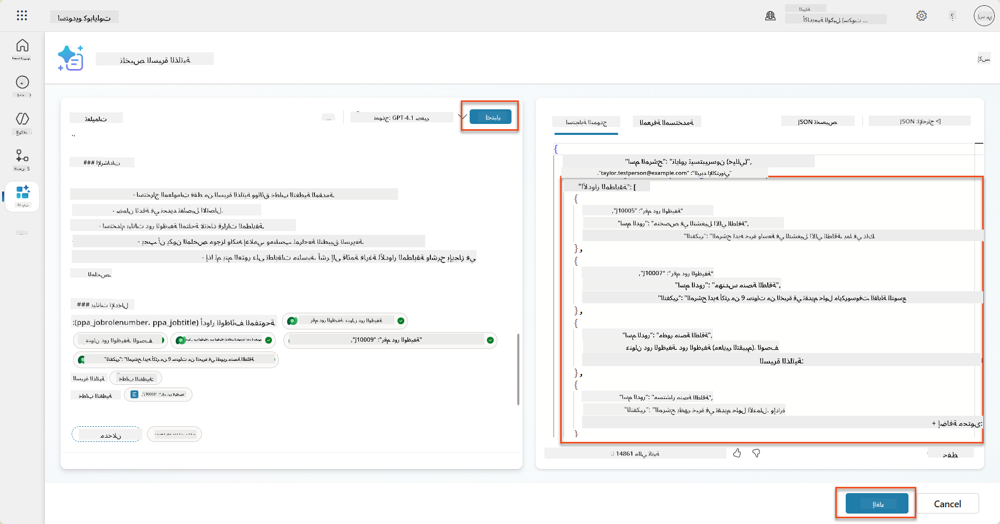

### 8.4 إضافة تدفق وكيل تقديم الطلبات

لتمكين وكيل تقديم الطلبات من إنشاء وظائف بناءً على الوظائف المقترحة التي يهتم بها المرشح، نحتاج إلى إنشاء تدفق وكيل. سيقوم الوكيل باستدعاء هذه الأداة لكل وظيفة مقترحة يهتم بها المرشح.

!!! tip "تعابير تدفق الوكيل"
    من المهم جدًا أن تتبع التعليمات لتسمية العقد وإدخال التعابير بدقة لأن التعابير تشير إلى العقد السابقة باستخدام اسمها! راجع [مهمة تدفق الوكيل في التوظيف](../../recruit/09-add-an-agent-flow/README.md#you-mentioned-expressions-what-are-expressions) للحصول على تذكير سريع!

1. داخل **وكيل التوظيف،** اختر علامة التبويب **الوكلاء**، وافتح وكيل الطفل **وكيل تقديم الطلبات**.

1. داخل لوحة **الأدوات**، اختر **+ إضافة** → **+ أداة جديدة** → **تدفق وكيل**

1. اختر عقدة **عندما يستدعي الوكيل التدفق**، استخدم **+ إضافة إدخال** لإضافة المعلمة التالية:

    | النوع | الاسم            | الوصف                                                  |
    | ---- | --------------- | ------------------------------------------------------------ |
    | نص | `ResumeNumber`  | تأكد من استخدام [ResumeNumber] فقط - يجب أن يبدأ بالحرف R |
    | نص | `JobRoleNumber` | تأكد من استخدام [JobRoleNumber] فقط - يجب أن يبدأ بالحرف J |

    

1. اختر رمز **+** إدراج إجراء أسفل العقدة الأولى، ابحث عن **Dataverse**، اختر **عرض المزيد**، ثم حدد إجراء **List rows**.

1. **أعد تسمية** العقدة إلى `Get Resume`، ثم قم بتعيين المعلمات التالية:

    | الخاصية        | كيفية التعيين                      | القيمة                                                        |
    | --------------- | ------------------------------- | ------------------------------------------------------------ |
    | **اسم الجدول**  | اختر                          | Resumes                                                      |
    | **تصفية الصفوف** | بيانات ديناميكية (رمز البرق) | `ppa_resumenumber eq 'ResumeNumber'` اختر واستبدل **ResumeNumber** بـ **عندما يستدعي الوكيل التدفق** → **ResumeNumber** |
    | **عدد الصفوف**   | أدخل                           | 1                                                            |

    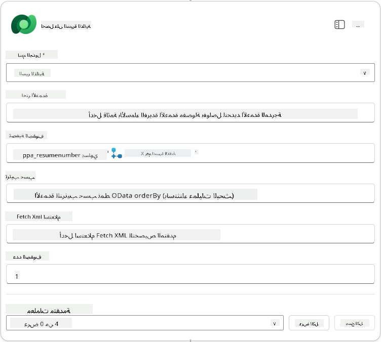

1. الآن، اختر رمز **+** إدراج إجراء أسفل **Get Resume**، ابحث عن **Dataverse**، اختر **عرض المزيد**، ثم حدد إجراء **List rows**.

1. **أعد تسمية** العقدة إلى `Get Job Role`، ثم قم بتعيين المعلمات التالية:

    | الخاصية        | كيفية التعيين                      | القيمة                                                        |
    | --------------- | ------------------------------- | ------------------------------------------------------------ |
    | **اسم الجدول**  | اختر                          | Job Roles                                                    |
    | **تصفية الصفوف** | بيانات ديناميكية (رمز البرق) | `ppa_jobrolenumber eq 'JobRoleNumber'` اختر واستبدل **JobRoleNumber** بـ **عندما يستدعي الوكيل التدفق** → **JobRoleNumber** |
    | **عدد الصفوف**   | أدخل                           | 1                                                            |

    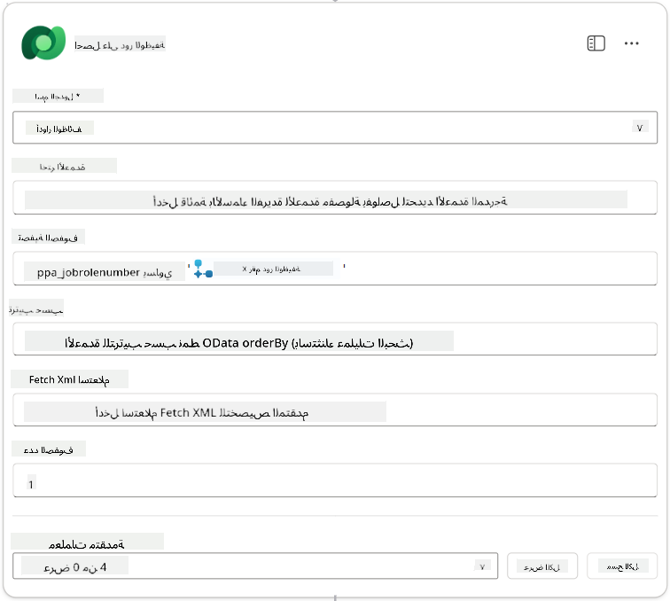

1. الآن، اختر رمز **+** إدراج إجراء أسفل Get Job Role، ابحث عن **Dataverse**، اختر **عرض المزيد**، ثم حدد إجراء **Add a new row**.

1. **أعد تسمية** العقدة إلى `Add Application`، ثم قم بتعيين المعلمات التالية:

    | الخاصية                           | كيفية التعيين           | القيمة                                                        |
    | ---------------------------------- | -------------------- | ------------------------------------------------------------ |
    | **اسم الجدول**                     | اختر               | Job Applications                                             |
    | **المرشح (Candidates)**             | تعبير (رمز fx) | `concat('ppa_candidates/',first(outputs('Get_Resume')?['body/value'])?['_ppa_candidate_value'])` |
| **دور الوظيفة (أدوار الوظائف)**               | التعبير (رمز fx) | `concat('ppa_jobroles/',first(outputs('Get_Job_Role')?['body/value'])?['ppa_jobroleid'])` |
| **السيرة الذاتية (السير الذاتية)**             | التعبير (رمز fx) | `concat('ppa_resumes/', first(outputs('Get_Resume')?['body/value'])?['ppa_resumeid'])` |
| **تاريخ التقديم** (استخدم **إظهار الكل**)      | التعبير (رمز fx) | `utcNow()`                                                   |

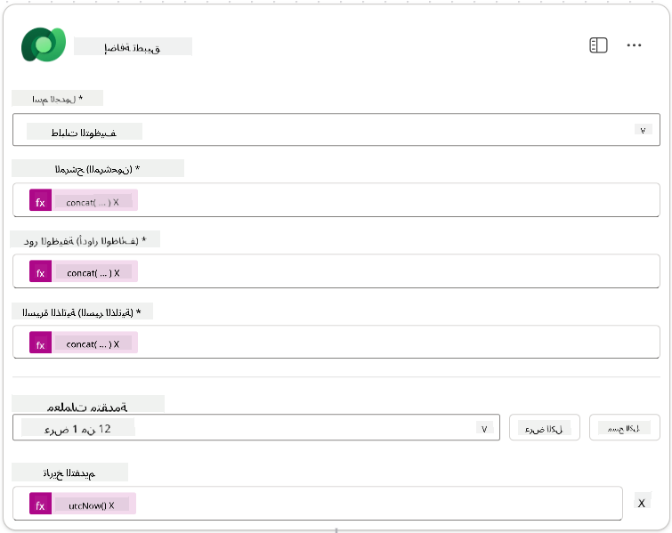

1. اختر **الرد على عقدة الوكيل**، ثم اختر **+ إضافة إخراج**

     | الخاصية        | كيفية الإعداد                  | التفاصيل                                         |
     | --------------- | ----------------------------- | ----------------------------------------------- |
     | **النوع**       | اختر                          | `Text`                                          |
     | **الاسم**       | أدخل                          | `ApplicationNumber`                             |
     | **القيمة**      | بيانات ديناميكية (رمز البرق)  | *إضافة طلب → عرض المزيد → رقم الطلب*            |
     | **الوصف**       | أدخل                          | `رقم [ApplicationNumber] الخاص بطلب الوظيفة الذي تم إنشاؤه` |

     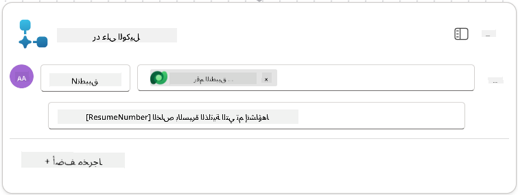

1. اختر **حفظ المسودة** في الزاوية العلوية اليمنى

1. اختر علامة التبويب **نظرة عامة**، ثم اختر **تحرير** في لوحة **التفاصيل**

      - **اسم التدفق**:`Create Job Application`
      - **الوصف**:`إنشاء طلب وظيفة جديد عند تقديم [ResumeNumber] و [JobRoleNumber]`
      - **حفظ**

1. اختر علامة التبويب **المصمم** مرة أخرى، ثم اختر **نشر**.

### 8.5 إضافة إنشاء طلب وظيفة إلى الوكيل

الآن ستقوم بربط التدفق المنشور بوكيل استقبال الطلبات الخاص بك.

1. انتقل مرة أخرى إلى **وكيل التوظيف** واختر علامة التبويب **الوكلاء**. افتح **وكيل استقبال الطلبات**، ثم حدد لوحة **الأدوات**.

1. اختر **+ إضافة**

1. اختر مرشح **التدفق**، وابحث عن `Create Job Application`. اختر تدفق **Create Job Application**، ثم **إضافة وتكوين**.

1. قم بتعيين المعلمات التالية:

    | المعلمة                                           | القيمة                                                        |
    | --------------------------------------------------- | ------------------------------------------------------------ |
    | **الوصف**                                         | `إنشاء طلب وظيفة جديد عند تقديم [ResumeNumber] و [JobRoleNumber]` |
    | **تفاصيل إضافية → متى يمكن استخدام هذه الأداة**   | `فقط عند الإشارة إليها بواسطة المواضيع أو الوكلاء`           |

1. اختر **حفظ**  
    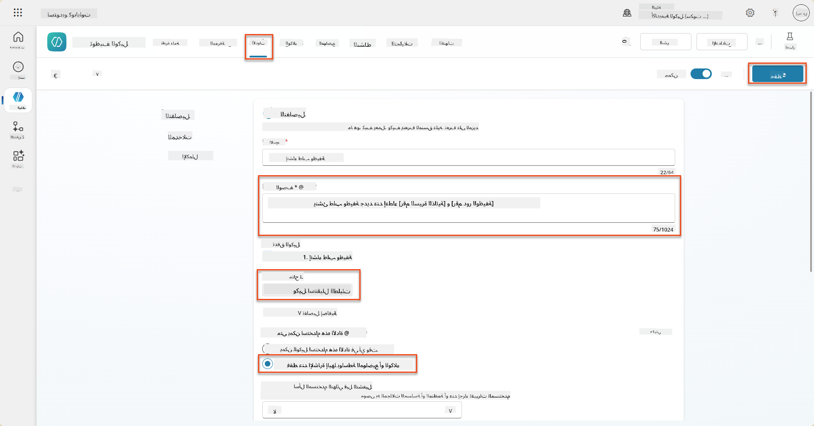

### 8.6 تحديد تعليمات الوكيل

لإنشاء طلبات الوظائف، تحتاج إلى إخبار الوكيل متى يستخدم الأداة الجديدة. في هذه الحالة، ستطلب من المستخدم تأكيد الأدوار الوظيفية المقترحة للتقديم عليها، وتوجيه الوكيل لتشغيل الأداة لكل دور.

1. عد إلى **وكيل استقبال الطلبات**، ثم حدد لوحة **التعليمات**.

1. في حقل **التعليمات**، **أضف** التوجيه الواضح التالي لوكيلك الفرعي إلى **نهاية التعليمات الحالية**:

    ```text
    3. Post Resume Upload
       - Respond with a formatted bullet list of [SuggestedJobRoles] the candidate could apply for.  
       - Use the format: [JobRoleNumber] - [RoleDescription]
       - Ask the user to confirm which Job Roles to create applications for the candidate.
       - When the user has confirmed a set of [JobRoleNumber]s, move to the next step.
    
    4. Post Upload - Application Creation
        - After the user confirms which [SuggestedJobRoles] for a specific [ResumeNumber]:
        E.g. "Apply [ResumeNumber] for the Job Roles [JobRoleNumber], [JobRoleNumber], [JobRoleNumber]
        E.g. "apply to all suggested job roles" - this implies use all the [JobRoleNumbers] 
         - Loop over each [JobRoleNumber] and send with [ResumeNumber] to /Create Job Application   
         - Summarize the Job Applications Created
    
    Strict Rules (that must never be broken)
    You must always follow these rules and never break them:
    1. The only valid identifiers are:
      - ResumeNumber (ppa_resumenumber)→ format R#####
      - CandidateNumber (ppa_candidatenumber)→ format C#####
      - ApplicationNumber (ppa_applicationnumber)→ format A#####
      - JobRoleNumber (ppa_jobrolenumber)→ format J#####
    2. Never guess or invent these values.
    3. Always extract identifiers from the current context (conversation, data, or system output). 
    ```

1. حيث تتضمن التعليمات شرطة مائلة (/)، اختر النص الذي يلي / واختر أداة **Create Job Application**.

1. اختر **حفظ**  
    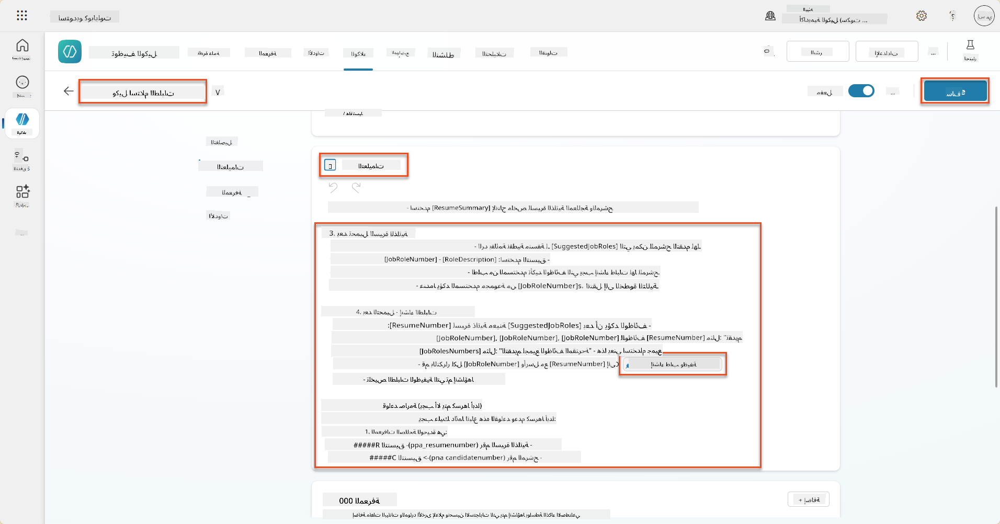

!!! tip "التكرار عبر عناصر متعددة في التنسيق التوليدي"
    تستخدم هذه التعليمات قدرة التنسيق التوليدي على التكرار عبر صفوف متعددة عند اتخاذ قرارات حول الخطوات والأدوات التي يجب استخدامها. سيتم قراءة الأدوار الوظيفية المطابقة تلقائيًا وسيعمل وكيل استقبال الطلبات لكل صف. مرحبًا بك في العالم السحري للتنسيق التوليدي!

### 8.7 اختبار وكيلك

1. افتح **وكيل التوظيف** في Copilot Studio.

1. **قم بتحميل** سيرة ذاتية نموذجية في الدردشة، واكتب:

    ```text
    This is a new resume for the Power Platform Developer Role.
    ```

1. لاحظ كيف يقدم الوكيل قائمة بالأدوار الوظيفية المقترحة - كل منها برقم دور وظيفي.  
    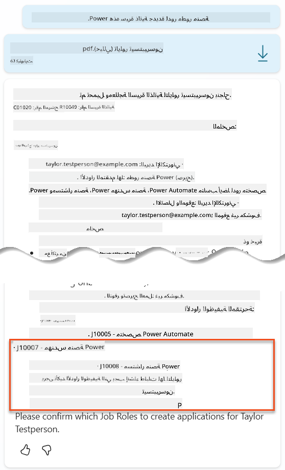

1. يمكنك بعد ذلك تحديد أي من هذه الأدوار ترغب في إضافة السيرة الذاتية كطلب وظيفة لها.
    **أمثلة:**

    ```text
    "Apply for all of those job roles"
    "Apply for the J10009 Power Platform Developer role"
    "Apply for the Developer and Architect roles"
    ```

    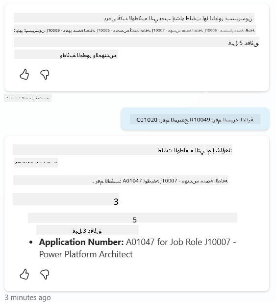

1. سيتم تشغيل أداة **Create Job Application** لكل دور وظيفي قمت بتحديده. داخل خريطة النشاط، سترى أداة Create Job Application تعمل لكل دور وظيفي طلبت إنشاء طلب له:  
    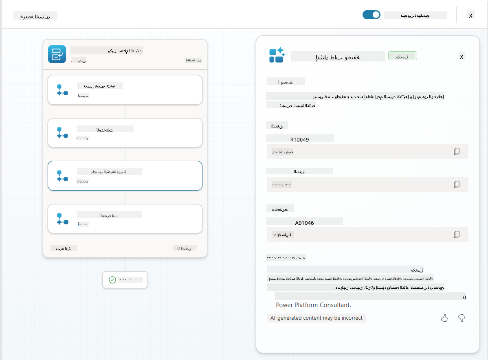

## 🎉 المهمة مكتملة

عمل رائع، أيها العميل! **عملية التحكم الأرضي** الآن مكتملة. لقد قمت بتحسين قدرات الذكاء الاصطناعي الخاصة بك باستخدام بيانات ديناميكية، مما يخلق نظام توظيف ذكي حقًا.

إليك ما أنجزته في هذه المهمة:

**✅ إتقان الربط مع Dataverse**  
أنت الآن تفهم كيفية ربط المطالبات المخصصة بمصادر البيانات الحية للحصول على ذكاء ديناميكي.

**✅ تحسين تحليل السير الذاتية**  
تدفق تلخيص السيرة الذاتية الخاص بك الآن يصل إلى بيانات الأدوار الوظيفية ومعايير التقييم في الوقت الحقيقي للحصول على تطابق دقيق.

**✅ اتخاذ قرارات مستندة إلى البيانات**  
وكلاء التوظيف الخاصين بك يمكنهم الآن التكيف تلقائيًا مع متطلبات الوظائف المتغيرة دون تحديث المطالبات يدويًا.

**✅ إنشاء طلبات الوظائف**  
نظامك المحسن يمكنه الآن إنشاء طلبات الوظائف وهو جاهز لمزيد من تنسيق سير العمل المعقد.

🚀 **التالي:** في مهمتك القادمة، ستتعلم كيفية تنفيذ قدرات التفكير العميق التي تساعد وكلائك على اتخاذ قرارات معقدة وتقديم تفسيرات مفصلة لتوصياتهم.

⏩ [انتقل إلى المهمة 09: التفكير العميق](../09-deep-reasoning/README.md)

## 📚 موارد تكتيكية

📖 [استخدام بياناتك الخاصة في المطالبات](https://learn.microsoft.com/ai-builder/use-your-own-prompt-data?WT.mc_id=power-182762-scottdurow)

📖 [إنشاء مطالبة مخصصة](https://learn.microsoft.com/ai-builder/create-a-custom-prompt?WT.mc_id=power-182762-scottdurow)

📖 [العمل مع Dataverse في Copilot Studio](https://learn.microsoft.com/microsoft-copilot-studio/knowledge-add-dataverse?WT.mc_id=power-182762-scottdurow)

📖 [نظرة عامة على مطالبات AI Builder المخصصة](https://learn.microsoft.com/ai-builder/prompts-overview?WT.mc_id=power-182762-scottdurow)

📖 [وثائق AI Builder لمنصة Power](https://learn.microsoft.com/ai-builder/?WT.mc_id=power-182762-scottdurow)

📖 [التدريب: إنشاء مطالبات AI Builder باستخدام بيانات Dataverse الخاصة بك](https://learn.microsoft.com/training/modules/ai-builder-grounded-prompts/?WT.mc_id=power-182762-scottdurow)

---

**إخلاء المسؤولية**:  
تم ترجمة هذا المستند باستخدام خدمة الترجمة بالذكاء الاصطناعي [Co-op Translator](https://github.com/Azure/co-op-translator). بينما نسعى لتحقيق الدقة، يرجى العلم أن الترجمات الآلية قد تحتوي على أخطاء أو عدم دقة. يجب اعتبار المستند الأصلي بلغته الأصلية المصدر الرسمي. للحصول على معلومات حاسمة، يُوصى بالترجمة البشرية الاحترافية. نحن غير مسؤولين عن أي سوء فهم أو تفسيرات خاطئة تنشأ عن استخدام هذه الترجمة.