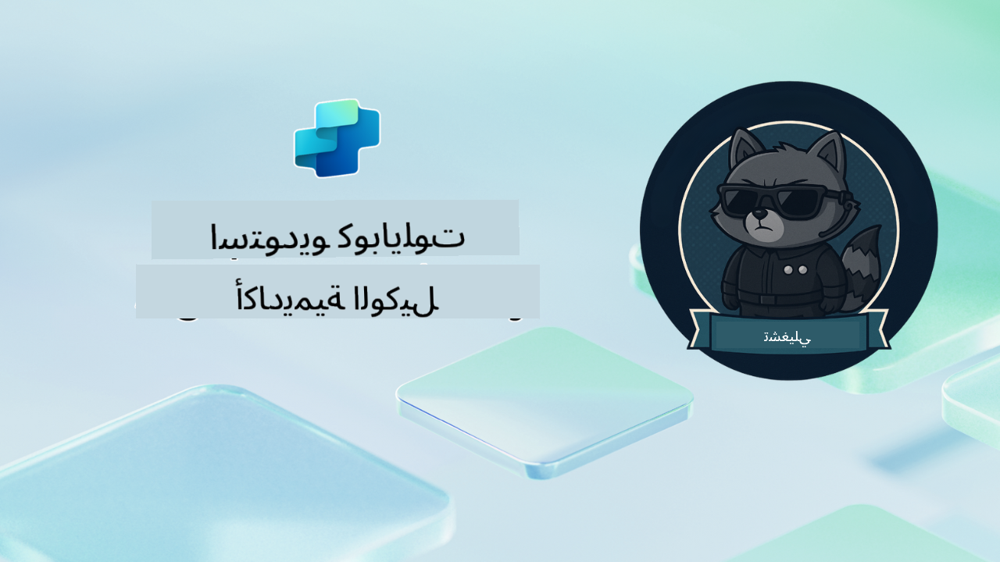

<!--
CO_OP_TRANSLATOR_METADATA:
{
  "original_hash": "24fcbe9a57d3439e05f8866e550c0a84",
  "translation_date": "2025-10-22T18:47:32+00:00",
  "source_file": "docs/operative-preview/README.md",
  "language_code": "ar"
}
-->
# مرحباً أيها العميل

**مرحباً أيها العميل.**  
مهمتك المتقدمة - إذا اخترت قبولها - هي إتقان فن بناء **أنظمة متعددة الوكلاء على مستوى المؤسسات** باستخدام **Microsoft Copilot Studio**.

هذا التدريب المكثف يأخذك إلى ما هو أبعد من إنشاء الوكلاء الأساسيين إلى العالم المتقدم من **تنسيق الوكلاء المتعددين**: بدءاً من أتمتة التوظيف إلى أمان الذكاء الاصطناعي، ستتعلم كيفية بناء وتنسيق ونشر أنظمة وكلاء ذكية باستخدام سيناريوهات واقعية على مستوى المؤسسات.

--8<-- "disclaimer.md"

---

## 🎯 هدف المهمة

عند إكمال برنامج أكاديمية الوكلاء، ستكون قادراً على:

- تصميم وتنفيذ **أنظمة متعددة الوكلاء** لسيناريوهات الأعمال المعقدة  
- إتقان **تنسيق الوكلاء** وأنماط التعاون  
- تنفيذ **أمان الذكاء الاصطناعي ومراقبة المحتوى** في أنظمة الإنتاج  
- بناء **مطالبات متعددة الوسائط** لمعالجة وتحليل الوثائق  
- نشر **وكلاء جاهزين للمؤسسات** مع حوكمة واختبار مناسب  

---

## 🧪 المتطلبات الأساسية

لإكمال جميع المهام، ستحتاج إلى:

- إكمال تدريب **Agent Academy Recruit**  
- بيئة Microsoft Power Platform مع ترخيص **Copilot Studio**  
- الوصول إلى **Microsoft Dataverse**  
- أذونات إدارية لإنشاء الحلول والوكلاء  

---

## 🧬 لمن هذا البرنامج

هذه الدورة المتقدمة مثالية لـ:

- **مهندسي الحلول** الذين يصممون أنظمة الذكاء الاصطناعي للمؤسسات  
- **المطورين** الذين يبنون حلول وكلاء جاهزة للإنتاج  
- **محترفي تكنولوجيا المعلومات** الذين ينفذون حوكمة وأمان الذكاء الاصطناعي  
- **محللي الأعمال** الذين ينشئون تدفقات عمل أتمتة معقدة  
- أي شخص مستعد لـ **الارتقاء** من الوكلاء الأساسيين إلى أنظمة المؤسسات  

---

## 🧭 نظرة عامة على المنهج

تم تنظيم هذه الأكاديمية كسلسلة تدريجية من العمليات الميدانية - كل مهمة تبني على السابقة لإنشاء نظام أتمتة التوظيف الشامل.

| المهمة | العنوان | ملخص العملية |
|---------|-------|-------------------|
| `01` | 🚨 [ابدأ مع وكيل التوظيف](./01-get-started/README.md) | نشر البنية التحتية الأساسية وإنشاء وكيل التنسيق المركزي الخاص بك |
| `02` | 🎭 [اجعل وكيلك جاهزاً للوكلاء المتصلين](./02-multi-agent/README.md) | تحويل الوكيل الفردي إلى نظام وكلاء متعدد منسق |
| `03` | ⚡ [أتمتة وكيلك باستخدام المشغلات](./03-automate-triggers/README.md) | تنفيذ سلوكيات الوكيل المستقلة باستخدام المشغلات القائمة على الأحداث |
| `04` | 📝 [كتابة تعليمات الوكيل](./04-agent-instructions/README.md) | إتقان التواصل الدقيق والتحكم في سلوك الوكيل |
| `05` | 💬 [تخصيص استجابات الوكيل](./05-agent-responses/README.md) | تخصيص استجابات الوكيل لتحقيق أقصى تأثير وتفاعل |
| `06` | 🛡️ [أساسيات مراقبة المحتوى وأمان الذكاء الاصطناعي](./06-ai-safety/README.md) | تنفيذ تدابير الأمان والامتثال على مستوى المؤسسات |
| `07` | 🎨 [استخراج محتويات السيرة الذاتية باستخدام مطالبات متعددة الوسائط](./07-multimodal-prompts/README.md) | معالجة الوثائق والصور باستخدام قدرات الذكاء الاصطناعي المتقدمة |
| `08` | 🗄️ [مطالبات - تأصيل Dataverse](./08-dataverse-grounding/README.md) | تأصيل الوكلاء في بيانات المؤسسات للحصول على استجابات دقيقة |
| `09` | 🧠 [تطبيق التفكير العميق لتقييم ملاءمة المرشح والتحضير للمقابلة](./09-deep-reasoning/README.md) | تنفيذ التفكير الذكي لاتخاذ قرارات معقدة |
| `10` | 📄 [إنشاء مستندات مقابلة خاصة بالمرشح باستخدام مطالبات](./10-generate-documents/README.md) | إنشاء مستندات ديناميكية بناءً على تحليل الوكيل |
| `11` | 📊 [الحصول على ملاحظات المستخدم باستخدام بطاقات تكيفية](./11-obtain-user-feedback/README.md) | جمع ومعالجة ملاحظات المستخدم للتحسين المستمر |
| `12` | 🌐 [نشر وكلائك على موقع تجريبي لاختبار أصحاب المصلحة](./12-demo-website/README.md) | نشر الحل الكامل لعرضه واختباره من قبل أصحاب المصلحة |

!!! note
    ✅ إكمال هذا المنهج يمنحك شارة **العميل**.  
    🔓 سيتم فتح مستوى **القائد** في المراحل المستقبلية.

<!-- markdownlint-disable-next-line MD033 -->

---

**إخلاء المسؤولية**:  
تم ترجمة هذا المستند باستخدام خدمة الترجمة بالذكاء الاصطناعي [Co-op Translator](https://github.com/Azure/co-op-translator). بينما نسعى لتحقيق الدقة، يرجى العلم أن الترجمات الآلية قد تحتوي على أخطاء أو عدم دقة. يجب اعتبار المستند الأصلي بلغته الأصلية المصدر الرسمي. للحصول على معلومات حاسمة، يُوصى بالترجمة البشرية الاحترافية. نحن غير مسؤولين عن أي سوء فهم أو تفسير خاطئ ينشأ عن استخدام هذه الترجمة.