<!--
CO_OP_TRANSLATOR_METADATA:
{
  "original_hash": "d9cd8cd1a4fbd8915171a2ed972cc322",
  "translation_date": "2025-10-22T19:57:42+00:00",
  "source_file": "docs/recruit/00-course-setup/README.md",
  "language_code": "ar"
}
-->
# 🚨 المهمة 00: إعداد الدورة

## 🕵️‍♂️ الاسم الرمزي: `عملية الجاهزية للنشر`

> **⏱️ مدة العملية:** `~30 دقيقة`  

## 🎯 ملخص المهمة

مرحبًا بك في المهمة الأولى من تدريبك كعميل في Copilot Studio.  
قبل أن تبدأ في بناء وكيل الذكاء الاصطناعي الأول الخاص بك، تحتاج إلى إنشاء بيئة تطوير جاهزة للعمل.

هذا الملخص يوضح الأنظمة، بيانات الوصول، وخطوات الإعداد المطلوبة للعمل بنجاح في نظام Microsoft 365.

## 🔎 الأهداف

تشمل مهمتك:

1. الحصول على حساب Microsoft 365  
1. الوصول إلى Microsoft Copilot Studio  
1. (اختياري) تأمين ترخيص Microsoft 365 Copilot للنشر الإنتاجي  
1. إنشاء بيئة تطوير كبيئة Copilot Studio الخاصة بك للبناء فيها  
1. إنشاء موقع SharePoint ليكون مصدر البيانات الخاص بك في المهام القادمة  

---

## 🔍 المتطلبات الأساسية

قبل البدء، تأكد من توفر:

1. عنوان بريد إلكتروني للعمل أو المدرسة (لا يتم دعم البريد الشخصي مثل @outlook.com، @gmail.com، إلخ).  
1. الوصول إلى الإنترنت ومتصفح حديث (يوصى باستخدام Edge، Chrome، أو Firefox).  
1. معرفة أساسية بـ Microsoft 365 (على سبيل المثال، تسجيل الدخول إلى تطبيقات Office أو Teams).  
1. (اختياري) بطاقة ائتمان أو طريقة دفع إذا كنت تخطط لشراء تراخيص مدفوعة.

---

## الخطوة 1: الحصول على حساب Microsoft 365

يقع Copilot Studio ضمن Microsoft 365، لذا تحتاج إلى حساب Microsoft 365 للوصول إليه. يمكنك استخدام حساب موجود إذا كان لديك أو اتباع هذه الخطوات للحصول على ترخيص مناسب:

1. **الحصول على اشتراك Microsoft 365 Business مدفوع**  
   1. انتقل إلى [صفحة خطط وأسعار Microsoft 365 Business](https://www.microsoft.com/microsoft-365/business/microsoft-365-plans-and-pricing)  
   1. الخيار الأرخص للبدء هو خطة Microsoft 365 Business Basic. اختر `تجربة مجانية` واتبع النموذج الإرشادي لملء تفاصيل الاشتراك والحساب ومعلومات الدفع.  
   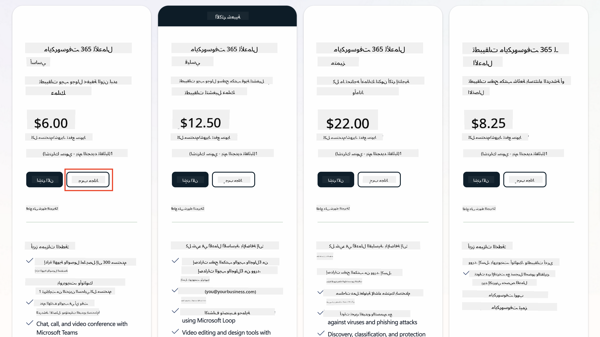  
   1. بمجرد حصولك على حساب جديد، قم بتسجيل الدخول.

    !!! Tip
        إذا كنت تخطط لنشر الوكلاء في Microsoft 365 Copilot Chat أو الاتصال ببيانات المؤسسة (SharePoint، OneDrive، Dataverse)، فإن ترخيص Microsoft 365 Copilot مطلوب. هذا ترخيص إضافي يمكنك معرفة المزيد عنه [في موقع الترخيص](https://www.microsoft.com/microsoft-365/copilot#plans).

---

## الخطوة 2: بدء تجربة Copilot Studio

بمجرد حصولك على Microsoft 365 Tenant، تحتاج إلى الوصول إلى Copilot Studio. يمكنك الحصول على تجربة مجانية لمدة 30 يومًا باتباع هذه الخطوات:

1. انتقل إلى [aka.ms/TryCopilotStudio](https://aka.ms/TryCopilotStudio).  
1. أدخل عنوان البريد الإلكتروني من الحساب الجديد الذي قمت بإعداده في الخطوة السابقة واختر `التالي`.  
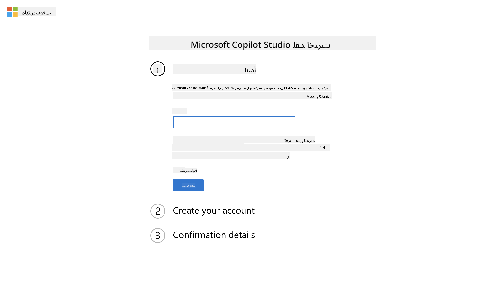  
1. يجب أن يتعرف على حسابك. اختر `تسجيل الدخول`.  
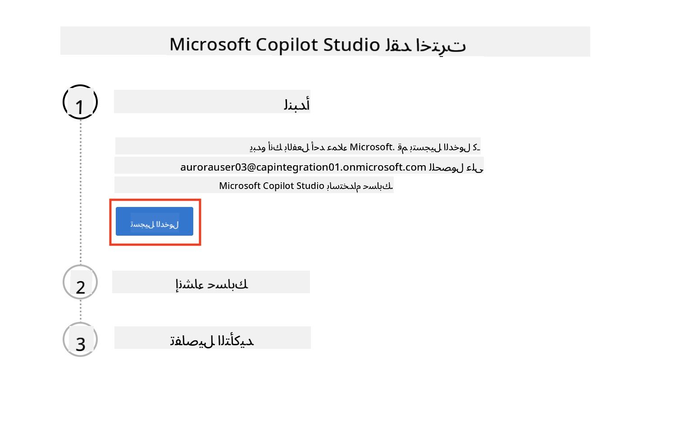  
1. اختر `بدء التجربة المجانية`.  
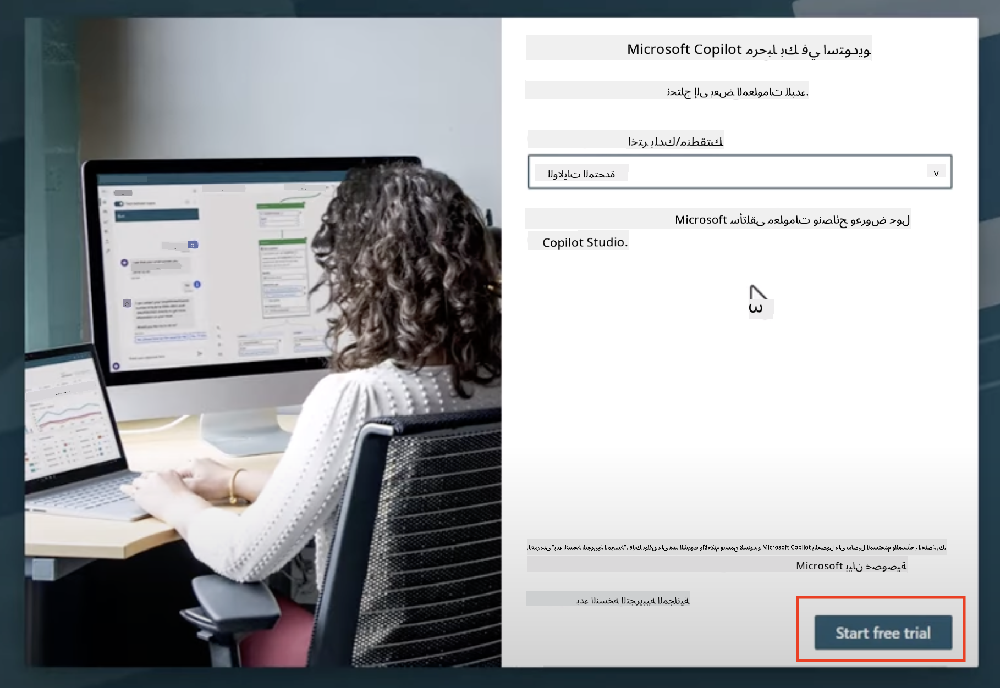

!!! info "ملاحظات التجربة"  
     1. توفر التجربة المجانية **كامل قدرات Copilot Studio**.  
     1. ستتلقى إشعارات بالبريد الإلكتروني حول انتهاء صلاحية التجربة. يمكنك تمديد التجربة بفترات 30 يومًا (حتى 90 يومًا من تشغيل الوكيل).  
     1. إذا قام مسؤول Tenant بتعطيل التسجيل الذاتي، ستظهر رسالة خطأ—اتصل بمسؤول Microsoft 365 لإعادة تمكينه.

---

## الخطوة 3: إنشاء بيئة تطوير جديدة

### التسجيل في خطة مطوري Power Apps

باستخدام نفس Microsoft 365 Tenant في الخطوة 1، قم بالتسجيل في خطة مطوري Power Apps لإنشاء بيئة تطوير مجانية للبناء والاختبار باستخدام Copilot Studio.

1. قم بالتسجيل في [موقع خطة مطوري Power Apps](https://aka.ms/PowerAppsDevPlan).

    - أدخل عنوان بريدك الإلكتروني  
    - ضع علامة في مربع الاختيار  
    - اختر **بدء مجاني**  

    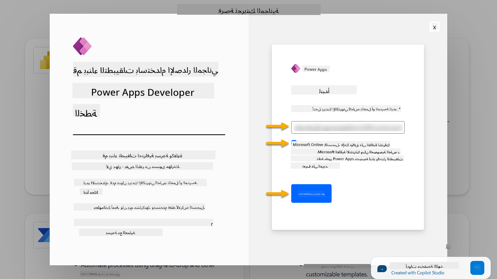

1. بعد التسجيل في خطة المطورين، سيتم توجيهك إلى [Power Apps](https://make.powerapps.com/). تستخدم البيئة اسمك، على سبيل المثال **بيئة Adele Vance**. إذا كانت هناك بالفعل بيئة بهذا الاسم، سيتم تسمية البيئة الجديدة **بيئة Adele Vance (1)**.

    استخدم هذه البيئة المطورة في Copilot Studio عند إكمال المختبرات.

!!! Note
    إذا كنت تستخدم حساب Microsoft 365 موجودًا ولم تقم بإنشاء واحد في الخطوة 1، على سبيل المثال - باستخدام حسابك الخاص في مؤسستك، قد يكون فريق إدارة IT الخاص بك قد أوقف عملية التسجيل. في هذه الحالة، يرجى الاتصال بمسؤولك، أو إنشاء Tenant اختبار كما هو موضح في الخطوة 1.

---

## الخطوة 4: إنشاء موقع SharePoint جديد

يجب إنشاء موقع SharePoint جديد سيتم استخدامه في [الدرس 06 - إنشاء وكيل مخصص باستخدام تجربة الإنشاء الحوارية مع Copilot وربطه ببياناتك](../06-create-agent-from-conversation/README.md#62-add-an-internal-knowledge-source-using-a-sharepoint-site).

1. اختر رمز الوافل في الزاوية العلوية اليسرى من Microsoft Copilot Studio لعرض القائمة. اختر SharePoint من القائمة.

    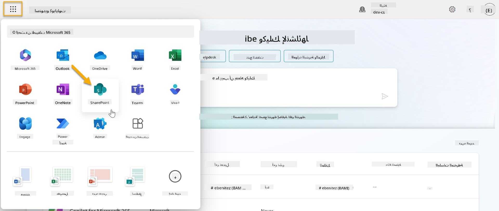

1. سيتم تحميل SharePoint. اختر **+ إنشاء موقع** لإنشاء موقع SharePoint جديد.

    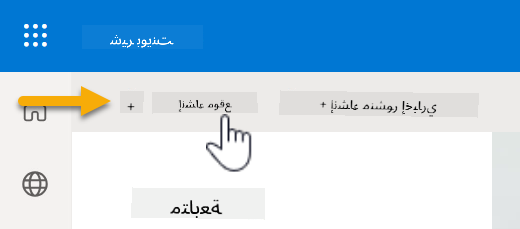

1. ستظهر نافذة إرشادية لإنشاء موقع SharePoint جديد. اختر **موقع فريق**.

    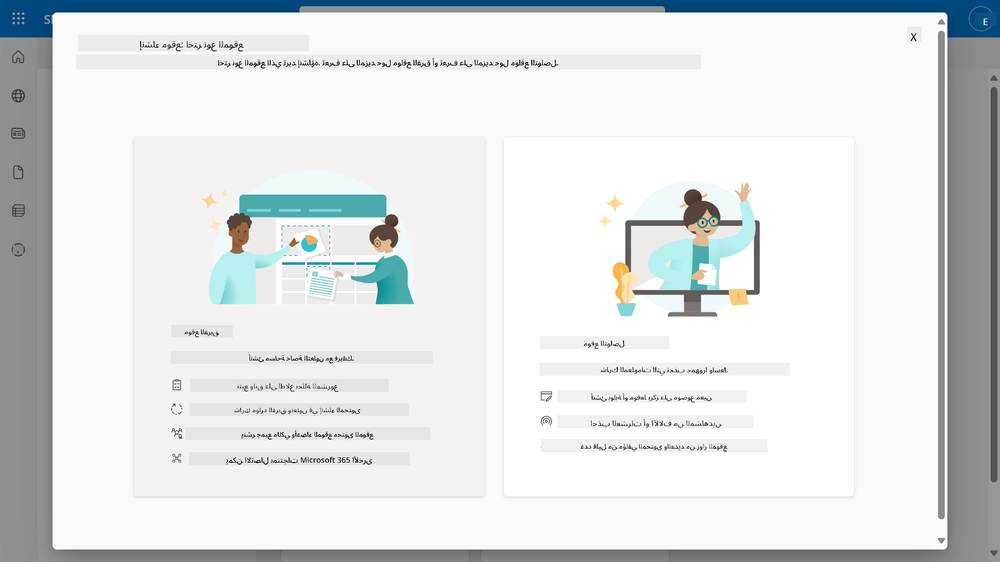

1. في الخطوة التالية، سيتم تحميل قائمة قوالب Microsoft افتراضيًا. قم بالتمرير لأسفل واختر قالب **مكتب المساعدة لتكنولوجيا المعلومات**.

    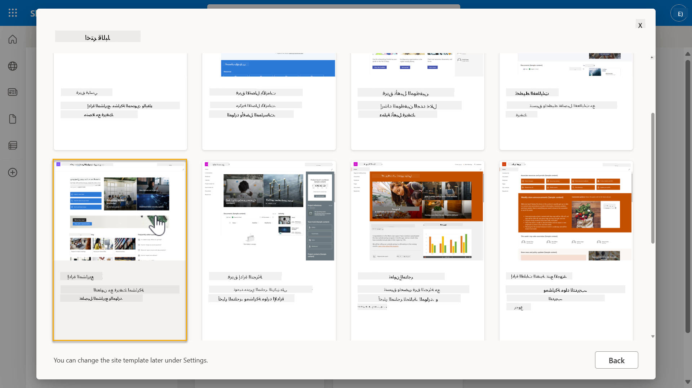

1. اختر **استخدام القالب** لإنشاء موقع SharePoint جديد باستخدام قالب مكتب المساعدة لتكنولوجيا المعلومات.

    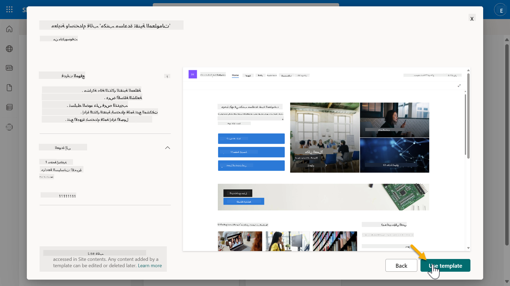

1. أدخل معلومات لموقعك. المثال التالي:

    | الحقل | القيمة |
    | --- | --- |
    | اسم الموقع | Contoso IT |
    | وصف الموقع | Copilot Studio للمبتدئين |
    | عنوان الموقع | ContosoIT |

    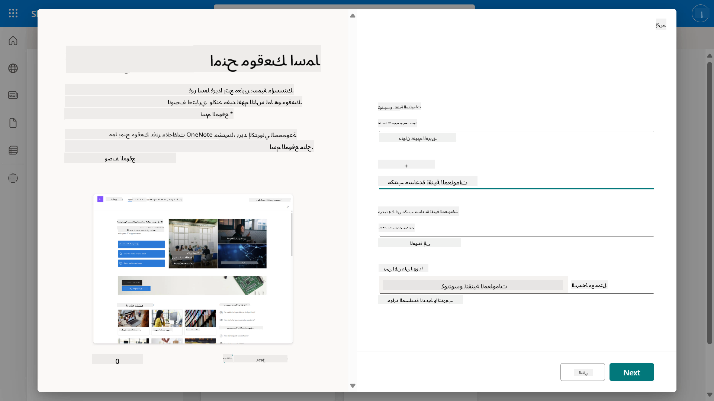

1. في الخطوة الأخيرة، يمكن اختيار لغة لموقع SharePoint. افتراضيًا ستكون **الإنجليزية**. اترك اللغة كـ **الإنجليزية** واختر **إنشاء موقع**.

    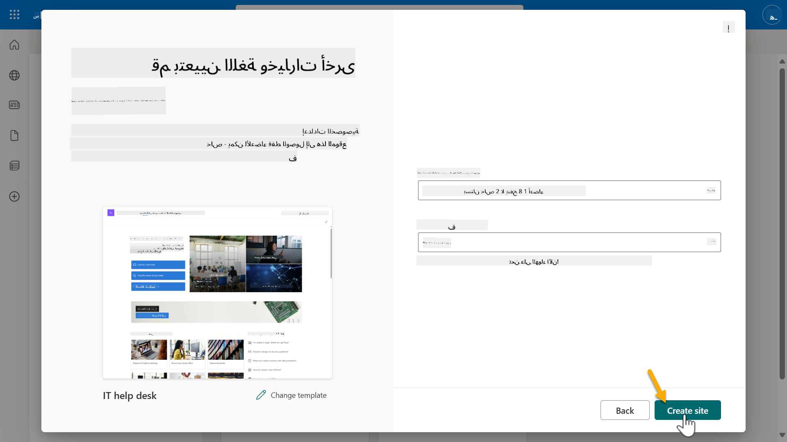

1. سيتم إنشاء موقع SharePoint خلال بضع ثوانٍ. في هذه الأثناء، يمكنك اختيار إضافة مستخدمين آخرين إلى موقعك عن طريق إدخال عنوان بريدهم الإلكتروني في حقل **إضافة أعضاء**. عند الانتهاء، اختر **إنهاء**.

    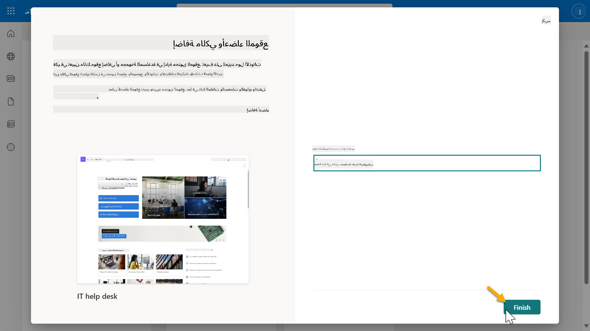

1. سيتم تحميل الصفحة الرئيسية لموقع SharePoint. **انسخ** رابط موقع SharePoint.

1. يوفر هذا القالب صفحات تحتوي على بيانات نموذجية حول سياسات تكنولوجيا المعلومات المختلفة وقائمتين نموذجيين (التذاكر والأجهزة).

### استخدام قائمة أجهزة SharePoint

سنستخدم قائمة **الأجهزة** في [المهمة 07 - إضافة موضوع جديد مع مشغل وعقد](../07-add-new-topic-with-trigger/README.md#73-add-a-tool-using-a-connector).

### إضافة عمود جديد

قم بالتمرير إلى أقصى اليمين في القائمة واختر زر **+ إضافة عمود**. اختر نوع **الرابط التشعبي**، أدخل **صورة** كاسم العمود، واختر إضافة.

### إنشاء بيانات نموذجية في قائمة أجهزة SharePoint

تأكد من ملء هذه القائمة بما لا يقل عن 4 عناصر بيانات نموذجية وإضافة عمود إضافي إلى هذه القائمة.

عند إضافة بيانات نموذجية، تأكد من ملء الحقول التالية:

- صورة الجهاز - استخدم الصور من [مجلد صور الأجهزة](https://github.com/microsoft/agent-academy/tree/main/docs/recruit/00-course-setup/images/device-images)  
- العنوان  
- الحالة  
- الشركة المصنعة  
- الطراز  
- نوع الأصل  
- اللون  
- الرقم التسلسلي  
- تاريخ الشراء  
- سعر الشراء  
- رقم الطلب  
- الصورة - استخدم الروابط التالية  

|الجهاز  |الرابط  |
|---------|---------|
|Surface Laptop 13     | [https://raw.githubusercontent.com/microsoft/agent-academy/refs/heads/main/docs/recruit/00-course-setup/images/device-images/Surface-Laptop-13.png](https://raw.githubusercontent.com/microsoft/agent-academy/refs/heads/main/docs/recruit/00-course-setup/images/device-images/Surface-Laptop-13.png)        |
|Surface Laptop 15     | [https://raw.githubusercontent.com/microsoft/agent-academy/refs/heads/main/docs/recruit/00-course-setup/images/device-images/Surface-Laptop-15.png](https://raw.githubusercontent.com/microsoft/agent-academy/refs/heads/main/docs/recruit/00-course-setup/images/device-images/Surface-Laptop-15.png)        |
|Surface Pro    | [https://raw.githubusercontent.com/microsoft/agent-academy/refs/heads/main/docs/recruit/00-course-setup/images/device-images/Surface-Pro-12.png](https://raw.githubusercontent.com/microsoft/agent-academy/refs/heads/main/docs/recruit/00-course-setup/images/device-images/Surface-Pro-12.png)        |
|Surface Studio    | [https://raw.githubusercontent.com/microsoft/agent-academy/refs/heads/main/docs/recruit/00-course-setup/images/device-images/Surface-Studio.png](https://raw.githubusercontent.com/microsoft/agent-academy/refs/heads/main/docs/recruit/00-course-setup/images/device-images/Surface-Studio.png)        |

---

## ✅ المهمة مكتملة

لقد نجحت في:

- إعداد بيئة تطوير Microsoft 365  
- تفعيل تجربة Copilot Studio  
- إنشاء موقع SharePoint لربط الوكلاء  
- ملء قائمة الأجهزة لاستخدامها في المهام المستقبلية  

أنت الآن جاهز لبدء تدريبك كـ **عميل مبتدئ** في [الدرس 01](../01-introduction-to-agents/README.md).  

<!-- markdownlint-disable-next-line MD033 -->

---

**إخلاء المسؤولية**:  
تم ترجمة هذا المستند باستخدام خدمة الترجمة بالذكاء الاصطناعي [Co-op Translator](https://github.com/Azure/co-op-translator). بينما نسعى لتحقيق الدقة، يرجى العلم أن الترجمات الآلية قد تحتوي على أخطاء أو عدم دقة. يجب اعتبار المستند الأصلي بلغته الأصلية المصدر الرسمي. للحصول على معلومات حاسمة، يُوصى بالترجمة البشرية الاحترافية. نحن غير مسؤولين عن أي سوء فهم أو تفسيرات خاطئة تنشأ عن استخدام هذه الترجمة.