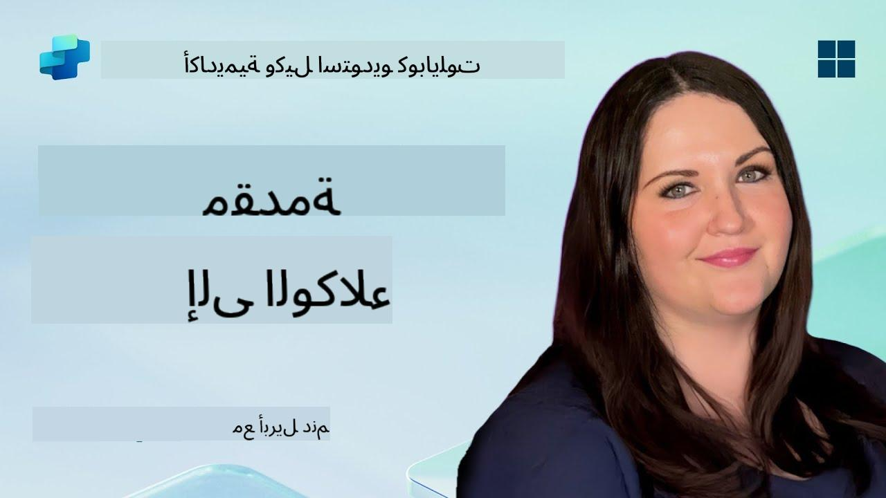

<!--
CO_OP_TRANSLATOR_METADATA:
{
  "original_hash": "d6706e107678264168d77b2e107710b1",
  "translation_date": "2025-10-22T19:30:27+00:00",
  "source_file": "docs/recruit/01-introduction-to-agents/README.md",
  "language_code": "ar"
}
-->
# 🚨 المهمة 01: مقدمة إلى الوكلاء

## 🕵️‍♂️ الاسم الرمزي: `عملية فك تشفير وكيل الذكاء الاصطناعي`

> **⏱️ نافذة وقت العملية:** `~30 دقيقة – معلومات فقط، لا حاجة للعمل الميداني`

🎥 **شاهد الفيديو التوضيحي**

## 🎯 ملخص المهمة

مرحبًا أيها المجند. قبل أن نبدأ في بناء الوكلاء، تحتاج إلى فهم قوي للمفاهيم المتعلقة بالذكاء الاصطناعي التي تدعمهم. ستزودك هذه المهمة بالمعرفة الأساسية حول الذكاء الاصطناعي الحواري، نماذج اللغة الكبيرة (LLMs)، التوليد المعزز بالاسترجاع (RAG)، وأنواع الوكلاء التي يمكنك إنشاؤها في Copilot Studio.

## 🔎 الأهداف

في هذه المهمة، ستتعلم:

1. ما هو الذكاء الاصطناعي الحواري ولماذا هو مهم  
1. كيف تدعم نماذج اللغة الكبيرة (LLMs) تجارب الدردشة  
1. ما الذي يقدمه التوليد المعزز بالاسترجاع (RAG)  
1. الفرق بين الوكلاء الحواريين والوكلاء المستقلين  
1. كيف تستفيد الوكلاء في Copilot Studio من هذه المفاهيم  

لنبدأ!

---

## ما هو الذكاء الاصطناعي الحواري؟

يشير الذكاء الاصطناعي الحواري إلى أي نظام يمكنه فهم ومعالجة والرد على اللغة البشرية – سواء كانت نصًا أو كلامًا – بطريقة تبدو طبيعية. فكر في روبوتات الدردشة في مكاتب المساعدة أو المساعدين الشخصيين الافتراضيين في تطبيقاتك المفضلة. في الأساس، تعتمد معظم أنظمة الذكاء الاصطناعي الحواري الحديثة على نماذج اللغة الكبيرة (LLMs)، والتي سنتناولها لاحقًا.

### لماذا هو مهم

- **تجربة المستخدم:** الواجهات الحوارية غالبًا ما تكون أكثر سهولة من التنقل عبر القوائم.  
- **القابلية للتوسع:** يمكن لوكيل واحد التعامل مع عشرات أو مئات المحادثات المتزامنة.  
- **الكفاءة:** بدلاً من بناء نصوص مخصصة تعتمد على القواعد، يمكن للوكلاء المدعومين بـ LLM التكيف بسرعة مع مدخلات المستخدم.  
- **الامتداد:** مع التصميم الصحيح، يمكن للوكلاء الوصول إلى قواعد المعرفة، الاتصال بـ APIs، أو العمل كـ "زملاء رقميين" داخل سير العمل التجاري.

---

## نماذج اللغة الكبيرة (LLMs) 101

في قلب معظم أنظمة الذكاء الاصطناعي الحواري توجد **نماذج اللغة الكبيرة** – شبكات عصبية مدربة على مجموعات ضخمة من النصوص. تتعلم هذه النماذج الأنماط الإحصائية للغة بحيث يمكنها توليد جمل متماسكة، الإجابة على الأسئلة، أو حتى تقديم أفكار. النقاط الرئيسية لفهمها:

1. **بيانات التدريب:** تستهلك LLMs تيرابايت من النصوص (صفحات ويب، كتب، مقالات). هذه "معرفة العالم" تمكنها من الرد على العديد من المواضيع.  
1. **التجزئة:** يتم تقسيم النص إلى وحدات أصغر تسمى الرموز (كلمات، أجزاء كلمات، أو أحرف). يتنبأ النموذج برمز واحد في كل مرة.  
1. **نافذة السياق:** لكل LLM حد أقصى لعدد الرموز التي يمكنه "رؤيتها" في وقت واحد. بعد هذا الحد، يتم تقليص الرموز السابقة.  
1. **التوجيه:** تتفاعل مع LLM عن طريق إرسال توجيه. كلما كان التوجيه أفضل، كلما كانت الاستجابة أكثر تركيزًا وملاءمة.  
1. **Zero-shot مقابل Fine-tuning:** Zero-shot يعني استخدام LLM كما هو (فقط الأوزان الخام). Fine-tuning يعني تعديل النموذج على بيانات محددة بحيث يجيب بدقة أكبر على احتياجاتك.

!!! Tip "نصيحة احترافية"
    تشبيه شائع هو أن LLM يشبه "الإكمال التلقائي الذكي للغاية". لا يفهم المعنى حقًا مثل الدماغ البشري، لكنه جيد جدًا في التنبؤ بالكلمة (أو العبارة) التالية الأفضل في تسلسل.

---

## التوليد المعزز بالاسترجاع (RAG)

عندما تعتمد LLMs فقط على بيانات التدريب الثابتة، قد تخطئ أو تصبح قديمة. يعالج RAG هذا من خلال السماح للنموذج "بالبحث" عن معلومات جديدة قبل تكوين الإجابة. على مستوى عالٍ، يعمل RAG على النحو التالي:

1. **استفسار المستخدم:** يسأل المستخدم سؤالًا (مثل، "ما الجديد في أرباح Contoso الفصلية؟").  
1. **خطوة الاسترجاع:** يقوم النظام بالبحث في مصدر المعرفة (وثائق، قواعد بيانات داخلية، مكتبات SharePoint، إلخ) للعثور على مقاطع ذات صلة.  
1. **التعزيز:** يتم إلحاق أو إضافة المقاطع المسترجعة إلى توجيه LLM.  
1. **التوليد:** يقوم LLM بمعالجة سؤال المستخدم والسياق المسترجع، ثم يولد استجابة تستند إلى بيانات محدثة.  

مع RAG، يمكن لوكيلك الاتصال بموسوعات الشركة الداخلية، APIs الإضافية، أو البحث في قاعدة بيانات الأسئلة الشائعة – وتقديم إجابات لا تقتصر على معلمات النموذج المنشورة بشكل ثابت.

---

## الوكلاء الحواريون مقابل الوكلاء المستقلون

في سياق Copilot Studio، يمكن أن يشير مصطلح **الوكيل** إلى أنواع متعددة من المساعدين الذكيين. من المفيد التمييز بين:

**الوكلاء الحواريون:**

- يركزون بشكل أساسي على الحوار الثنائي.  
- يحتفظون بالسياق عبر عدة جولات من المحادثة.  
- يتم تنسيقهم عادةً عبر تدفقات أو مشغلات محددة مسبقًا (مثل، "إذا قال المستخدم X، استجب بـ Y").  
- مثاليون لدعم العملاء، الأسئلة الشائعة، التفاعلات الموجهة، الجدولة، أو الأسئلة والأجوبة البسيطة.  
  - أمثلة:
    - روبوت دردشة في Teams يجيب على أسئلة سياسة الموارد البشرية.  
    - روبوت Power Virtual Agents على صفحة SharePoint يوجه المستخدمين خلال نموذج.  

**الوكلاء المستقلون:**

- يتجاوزون الدردشة ذهابًا وإيابًا؛ يمكنهم **اتخاذ إجراءات** نيابة عن المستخدم.  
- يستخدمون حلقات التفكير في LLM (فكر في "خطة → تصرف → راقب → أعد التخطيط") لإكمال المهام.  
- يتصلون بالأدوات أو APIs الخارجية (مثل، تشغيل تدفق Power Automate، إرسال دعوات تقويم، معالجة البيانات في Dataverse).  
- يعملون دون الحاجة إلى مدخلات بشرية مستمرة – بمجرد تشغيلهم، يمكنهم التعامل مع العمليات متعددة الخطوات بشكل مستقل.  
  - أمثلة:  
    - وكيل ينشئ خطة سفر، يحجز الرحلات، ويرسل التأكيدات عبر البريد الإلكتروني.  
    - وكيل "ملخص الاجتماع" الذي ينضم إلى مكالمة Teams، يكتبها في الوقت الفعلي، ويكتب ملخصًا تنفيذيًا إلى OneNote.  

!!! Info "الفرق الرئيسي"
    ينتظر الوكلاء الحواريون مدخلات المستخدم ويلتزمون بالحوار. أما الوكلاء المستقلون فيخططون وينفذون خطوات متعددة باستخدام أدوات أوسع.

---

## الوكلاء في Copilot Studio

**Copilot Studio** يجمع بين السيناريوهات الحوارية والمستقلة تحت إطار عمل واحد. إليك كيف يساعدك Copilot Studio في بناء الوكلاء:

1. **مصمم الوكلاء البصري:** لوحة منخفضة الكود لتحديد التوجيهات، الذاكرة، والأدوات لكل من تدفقات الدردشة والعمل.  
1. **تكوينات LLM:** اختر من بين نماذج OpenAI المختلفة أو GPT من Microsoft لتتناسب مع احتياجات الأداء والتكلفة.  
1. **موصلات الاسترجاع:** تكاملات مسبقة لـ SharePoint، OneDrive، Azure Cognitive Search، وDataverse، مما يتيح RAG مباشرة.  
1. **أدوات ووظائف مخصصة:** حدد إجراءات HTTP مخصصة أو تدفقات Power Automate يمكن لوكيلك استدعاؤها بشكل مستقل.  
1. **دعم متعدد الوسائط:** بالإضافة إلى النص، يمكن لوكلاء Copilot Studio معالجة الصور، الملفات، أو البيانات المهيكلة لتعزيز السياق.  
1. **النشر والتوزيع:** بمجرد أن يصبح وكيلك جاهزًا، يمكنك نشره إلى Microsoft 365 Copilot (حتى يتمكن المستخدمون من استدعائه في Teams، SharePoint، Outlook، إلخ) أو تضمينه كأداة دردشة مستقلة على صفحة ويب.

---

## 🎉 المهمة مكتملة

لقد أكملت الآن مقدمتك إلى الوكلاء ومفاهيم الذكاء الاصطناعي الأساسية. أنت تفهم:

1. **LLMs = "عقل" وكيلك**  
   - مسؤول عن فهم اللغة وتوليدها.  
   - المزيد من الرموز = سياق أغنى، ولكن أيضًا تكلفة أعلى لكل استدعاء.  

1. **RAG = دمج المعرفة في الوقت الحقيقي**  
   - يسد الفجوة بين LLM الثابت ومصادر البيانات المتغيرة باستمرار.  
   - يسترجع ويحقن الوثائق أو السجلات ذات الصلة في توجيه LLM.  

1. **الحواري مقابل المستقل**  
   - **الحواري:** يركز على تدفق الحوار والحفاظ على السياق (مثل، "ذاكرة الجلسة").  
   - **المستقل:** يضيف "كتل العمل" التي تسمح للوكيل بالاتصال بالأدوات أو الخدمات الخارجية.

---
في الخطوة التالية، ستستكشف [أساسيات Copilot Studio](../02-copilot-studio-fundamentals/README.md)!

ابقَ متيقظًا، أيها المجند - رحلتك في الذكاء الاصطناعي قد بدأت للتو!

## 📚 موارد تكتيكية

🔗 [الصفحة الرئيسية لوثائق Copilot Studio](https://learn.microsoft.com/microsoft-copilot-studio/)

---

---

**إخلاء المسؤولية**:  
تم ترجمة هذا المستند باستخدام خدمة الترجمة بالذكاء الاصطناعي [Co-op Translator](https://github.com/Azure/co-op-translator). بينما نسعى لتحقيق الدقة، يرجى العلم أن الترجمات الآلية قد تحتوي على أخطاء أو عدم دقة. يجب اعتبار المستند الأصلي بلغته الأصلية المصدر الرسمي. للحصول على معلومات حاسمة، يُوصى بالترجمة البشرية الاحترافية. نحن غير مسؤولين عن أي سوء فهم أو تفسيرات خاطئة تنشأ عن استخدام هذه الترجمة.