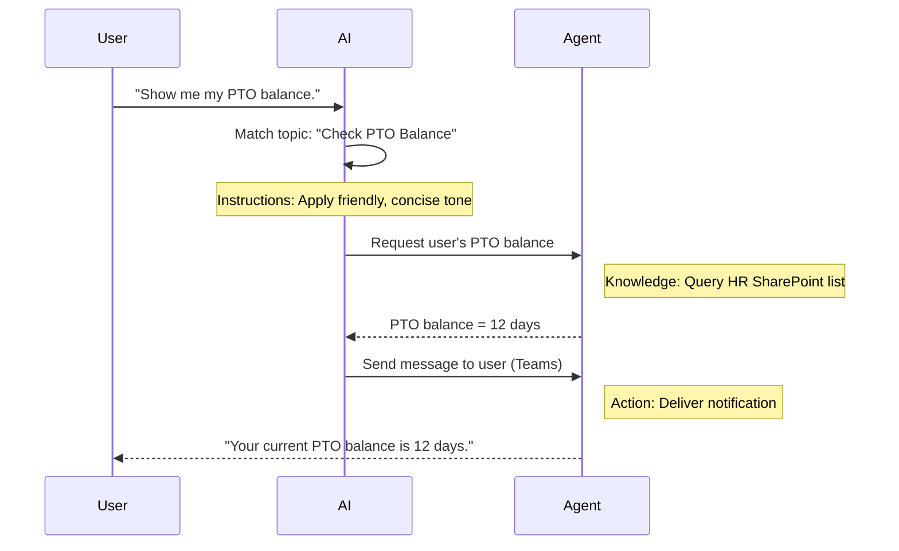

<!--
CO_OP_TRANSLATOR_METADATA:
{
  "original_hash": "90a3c5122f5687bbc8cc819990f175d4",
  "translation_date": "2025-10-22T19:49:44+00:00",
  "source_file": "docs/recruit/02-copilot-studio-fundamentals/README.md",
  "language_code": "ar"
}
-->
# 🚨 المهمة 02: أساسيات Copilot Studio

## 🕵️‍♂️ الاسم الرمزي: `عملية البروتوكول الأساسي`

> **⏱️ مدة العملية:** `~30 دقيقة – معلومات فقط، لا يتطلب عمل ميداني`  

🎥 **شاهد الفيديو التوضيحي**

[](https://www.youtube.com/watch?v=x4OCwDRGeLE "شاهد الفيديو التوضيحي على YouTube")

## 🎯 ملخص المهمة

مرحبًا أيها المجند. ستزودك هذه المهمة بمعلومات أساسية لفهم كيفية عمل Copilot Studio وكيفية بناء وكلاء ذكيين يقدمون قيمة حقيقية للأعمال.

قبل بناء وكيلك الأول، تحتاج إلى فهم العناصر الأربعة الرئيسية التي تشكل كل وكيل ذكاء اصطناعي مخصص: المعرفة، الأدوات، المواضيع، والتعليمات. ستتعلم أيضًا كيف تعمل هذه العناصر معًا في منسق Copilot Studio.

## 🔎 الأهداف

في هذه المهمة، ستقوم بـ:

- **تعلم ما هو Copilot Studio**
- **تعلم متى ولماذا تستخدم الوكلاء**
- **استكشاف اللبنات الأساسية الأربعة للوكلاء**
      - **المعرفة**
      - **الأدوات**
      - **المواضيع**
      - **التعليمات**
- **فهم كيفية عمل هذه المكونات معًا** لإنشاء وكيل ذكي ومؤتمت

---

## ما هي الوكلاء في Copilot Studio؟

الوكيل هو مساعد ذكاء اصطناعي متخصص تصممه للتعامل مع مهام أو استفسارات محددة. على عكس روبوت الدردشة العام، فإن وكيلك:

- **يعرف بيانات الشركة المحددة** (السياسات، الوثائق، قواعد البيانات)  
- **ينفذ مهام حقيقية** (إرسال الرسائل، إنشاء أحداث التقويم، تحديث السجلات)  
- **يحافظ على سياق المحادثة** بحيث يمكنه متابعة الأسئلة السابقة  

نظرًا لأن Copilot Studio يعتمد على البرمجة منخفضة الكود، يمكنك سحب وإفلات المكونات الجاهزة—لا حاجة إلى مهارات برمجية عميقة. بمجرد بناء وكيلك، يمكن للناس استخدامه داخل Teams، Slack، أو حتى صفحة ويب مخصصة للحصول على إجابات أو تشغيل سير العمل تلقائيًا.

---

## متى ولماذا تستخدم Copilot Studio

بينما يوفر Microsoft 365 Copilot مساعدة ذكاء اصطناعي عامة عبر تطبيقات Office، ستحتاج إلى وكيل مخصص عندما:

### تحتاج إلى معرفة محددة بالمجال

- قد لا يعرف Copilot الجاهز إجراءات شركتك الداخلية أو بياناتها. يمكن للوكيل استعلام مواقع SharePoint، قواعد البيانات، أو المصادر المخصصة لتقديم إجابات دقيقة ومحدثة.  

### تريد أتمتة سير العمل متعدد الخطوات

- على سبيل المثال: "عندما يقدم شخص ما نفقات، أرسلها للموافقة، قم بتحديث متتبع المالية، وأبلغ المدير." يمكن للوكيل المخصص التعامل مع كل خطوة، يتم تشغيلها بأمر أو حدث واحد.  

### تحتاج إلى تجربة سياقية داخل الأداة  

- تخيل وكيل "توجيه الموظفين الجدد" في Teams الذي يرشد موظفي الموارد البشرية خلال كل سياسة، يرسل النماذج اللازمة، ويحدد مواعيد الاجتماعات التوجيهية—داخل منصة التعاون الحالية الخاصة بك.  

---

## اللبنات الأساسية الأربعة للوكيل

كل وكيل في Copilot Studio يتم بناؤه من أربعة مكونات أساسية:

1. **المعرفة**  
1. **الأدوات (الإجراءات)**  
1. **المواضيع**  
1. **التعليمات**

فيما يلي، سنعرف كل لبنة بناء ونوضح كيف تعمل معًا لإنشاء وكيل فعال.

### 1. المعرفة

**المعرفة** هي البيانات والسياق الذي يستخدمه وكيلك للإجابة على الأسئلة بدقة. لها جزئين:

#### التعليمات المخصصة والسياق

- تكتب وصفًا موجزًا لغرض الوكيل ونبرته. على سبيل المثال:  

    ```text
    You are an IT support agent. You help employees troubleshoot common software issues, provide troubleshooting steps, and escalate urgent tickets.
    ```

- أثناء المحادثة، يتذكر الوكيل الأدوار السابقة بحيث يمكنه الرجوع إلى ما تمت مناقشته بالفعل (على سبيل المثال، إذا قال المستخدم أولاً، "طابعتي غير متصلة"، ثم سأل لاحقًا، "هل تحققتم من مستوى الحبر؟"، يتذكر الوكيل سياق الطابعة).

#### مصادر المعرفة (البيانات الأساسية)

- تقوم بتوصيل وكيلك بما يصل إلى عدة مصادر بيانات—مكتبات SharePoint، مواقع الوثائق، الويكي، أو قواعد بيانات أخرى.  
- عندما يسأل المستخدم سؤالًا، يستخرج الوكيل مقتطفات ذات صلة من تلك المصادر بحيث تكون الإجابات **مستندة** إلى سياسات مؤسستك الفعلية، أدلة المنتجات، أو أي معلومات خاصة.  
- يمكنك حتى إجبار الوكيل على الرد فقط بالمعلومات من تلك المصادر، مما يمنعه من التخمين أو "اختلاق" الإجابات.

!!! example
    قد يتصل وكيل "مساعد السياسات" بموقع SharePoint الخاص بالموارد البشرية. إذا سأل المستخدم، "ما هو معدل تراكم الإجازات لدينا؟" يستخرج الوكيل النص الدقيق من وثيقة سياسة الموارد البشرية بدلاً من الاعتماد على استجابة ذكاء اصطناعي عامة.

---

### 2. الأدوات (الإجراءات)

**الأدوات (الإجراءات)** تحدد ما يمكن للوكيل القيام به بخلاف الدردشة. كل إجراء هو مهمة ينفذها الوكيل برمجيًا، مثل:

- إرسال بريد إلكتروني أو رسالة Teams  
- إنشاء أو تحديث حدث تقويم  
- إضافة أو تحرير سجل في قاعدة بيانات (مثل قائمة SharePoint أو جدول Dataverse)  
- استدعاء تدفق Power Automate أو REST API  

#### كيفية عمل الإجراءات

- **تحديد المدخلات والمخرجات**  
      - على سبيل المثال، قد يتطلب إجراء إرسال بريد إلكتروني:  
        - `RecipientEmailAddress`  
        - `SubjectLine`  
        - `EmailBody`  

- **دمج الإجراءات في سير العمل**  
      - غالبًا ما يتطلب تلبية طلب المستخدم عدة خطوات.  
      - يمكنك ترتيب الإجراءات بحيث:  
             1. يستخرج الوكيل البيانات من قائمة SharePoint.  
             2. يولد ملخصًا باستخدام LLM.  
             3. يرسل رسالة Teams مع ذلك الملخص.  

- **الاتصال بالأنظمة الخارجية**  
      - إذا كنت بحاجة إلى تحديث CRM أو استدعاء API داخلي، قم بإنشاء إجراء مخصص للتعامل مع ذلك.  
      - يمكن لـ Copilot Studio التكامل مع منصة Power أو أي نقطة نهاية تعتمد على HTTP.

!!! example "وكيل "مساعد النفقات" يمكن أن:"  
    1. يستمع لطلب "تقديم نفقات".  
    2. يجلب تفاصيل النفقات الخاصة بالمستخدم من نموذج.  
    3. يستخدم إجراء "إضافة إلى قائمة SharePoint" لتخزين البيانات.  
    4. يشغل إجراء "إرسال بريد إلكتروني" لإبلاغ المسؤول.  

---

### 3. المواضيع

**المواضيع** تحدد المحفزات الحوارية أو نقاط الدخول لوكيلك. كل موضوع يتوافق مع قطعة من الوظائف أو فئة من الأسئلة.

#### المحفزات الحوارية  

- قد يكون الموضوع "تقديم تذكرة IT"، "التحقق من رصيد الإجازة"، أو "إنشاء تقرير مبيعات".  
- تحت السطح، يستخدم Copilot Studio **تنسيق توليدي**: بدلاً من الاعتماد على الكلمات المفتاحية الدقيقة، يفسر الذكاء الاصطناعي نية المستخدم ويختار الموضوع المناسب بناءً على وصف قصير تقدمه.  

#### أوصاف المواضيع  

- في كل موضوع، تكتب وصفًا واضحًا وموجزًا لما يغطيه هذا الموضوع.

!!! example "مثال على وصف الموضوع"
    يساعد هذا الموضوع المستخدمين في تقديم تذكرة دعم IT عن طريق جمع تفاصيل المشكلة، الأولوية، ومعلومات الاتصال.

- يستخدم الذكاء الاصطناعي هذا الوصف لتحديد متى يتم تفعيل هذا الموضوع، حتى لو لم تتطابق صياغة المستخدم تمامًا.

#### ربط المواضيع بالإجراءات  

- يتم ربط كل موضوع بإجراء أو أكثر أو خطوات استرجاع البيانات.  
- عندما يختار الذكاء الاصطناعي موضوعًا، يوجه المحادثة من خلال التسلسل الذي حددته (طرح أسئلة متابعة، استدعاء الإجراءات، عرض النتائج).

!!! example
    إذا قال المستخدم، "أحتاج إلى مساعدة في إعداد جهاز الكمبيوتر المحمول الجديد"، قد يطابق الذكاء الاصطناعي تلك النية مع موضوع "تقديم تذكرة IT". ثم يسأل الوكيل عن نموذج الكمبيوتر المحمول، تفاصيل المستخدم، ويدفع تذكرة إلى نظام الدعم تلقائيًا.

---

### 4. التعليمات

**التعليمات** (تُعرف أحيانًا بـ "المطالبات" أو "رسائل النظام") توجه نبرة LLM، أسلوبه، وحدوده. تشكل كيفية استجابة الوكيل في أي موقف.

#### الدور والشخصية  

- تخبر الذكاء الاصطناعي من هو (على سبيل المثال، "أنت وكيل خدمة العملاء لشركة Contoso Retail").  
- يحدد هذا النبرة—ودية، موجزة، رسمية، أو غير رسمية—حسب حالتك.

#### إرشادات الاستجابة  

- تحدد أي قواعد يجب أن يتبعها الوكيل، مثل:  
      - "لخص دائمًا معلومات السياسة في نقاط."  
      - "إذا لم تعرف الإجابة، قل ‘عذرًا، ليس لدي تلك المعلومات.’"  
      - "لا تتضمن أبدًا بيانات سرية خارج السياق."

#### قواعد الذاكرة والسياق

- يمكنك توجيه الوكيل حول عدد الأدوار التي يجب أن يتذكرها من المحادثة.  
- على سبيل المثال: "تذكر تفاصيل طلبات هذا المستخدم حتى ثلاثة أسئلة متابعة."

!!! example "في وكيل "مستشار المزايا"، قد تتضمن:"
    "ارجع دائمًا إلى أحدث دليل الموارد البشرية عند الإجابة على الأسئلة. إذا طُلب منك مواعيد التسجيل، قدم التواريخ المحددة من السياسة. حافظ على الإجابات أقل من 150 كلمة."

---

## كيف تعمل اللبنات الأربعة معًا

عندما تجمع **المعرفة**، **الأدوات**، **المواضيع**، و**التعليمات**، يقوم منسق الذكاء الاصطناعي في Copilot Studio بإنشاء وكيل يقوم بـ:

1. **الاستماع إلى موضوع ذي صلة** (موجهًا بأوصاف المواضيع الخاصة بك).  
1. **تطبيق التعليمات** لتحديد النبرة، اتخاذ قرار متى يطرح أسئلة متابعة، وفرض القواعد.  
1. **استخدام مصادر المعرفة** لتأسيس إجاباته على بيانات مؤسستك.  
1. **استدعاء الأدوات (الإجراءات)** حسب الحاجة لتنفيذ المهام—إرسال الرسائل، تحديث السجلات، أو استدعاء APIs.  

تحت السطح، يستخدم المنسق نهج **التخطيط التوليدي**: يقرر الخطوات التي يجب اتخاذها، وبأي ترتيب، لتلبية طلب المستخدم. إذا فشل إجراء (على سبيل المثال، لم يتمكن من إرسال بريد إلكتروني)، يتبع الوكيل إرشادات معالجة الاستثناءات الخاصة بك (طرح سؤال توضيحي أو الإبلاغ عن الخطأ). نظرًا لأن LLM يتكيف مع سياق المحادثة، يمكن للوكيل الحفاظ على الذاكرة عبر أدوار متعددة ودمج معلومات جديدة مع تطور المحادثة.

**مثال تدفق بصري:**  
<!--
1. **المستخدم:** "أرني رصيد إجازتي."
1. **الذكاء الاصطناعي (المواضيع):** يطابق موضوع "التحقق من رصيد الإجازة".  
1. **الذكاء الاصطناعي (التعليمات):** يستخدم نبرة ودية وموجزة.  
1. **الوكيل (المعرفة):** يستعلم قائمة SharePoint للرصيد الخاص بالمستخدم.  
1. **الوكيل (الإجراءات):** يستخرج القيمة ويرسل رسالة Teams:  
   > "رصيد إجازتك الحالي هو 12 يومًا."  
-->



---

## 🎉 المهمة مكتملة

لقد أكملت بنجاح الإحاطة الأساسية. لقد تعلمت الآن اللبنات الأساسية الأربعة لأي وكيل في Copilot Studio:

1. **المعرفة** – حيث يبحث الوكيل عن المعلومات الواقعية ويحافظ على ذاكرة المحادثة.  
1. **الأدوات** – المهام التي يمكن للوكيل تنفيذها لجعل الأمور تحدث تلقائيًا.  
1. **المواضيع** – كيف يتعرف الوكيل على نية المستخدم ويقرر أي سير عمل يتم تشغيله.  
1. **التعليمات** – القواعد، النبرة، والحدود التي توجه كل استجابة.

مع وجود هذه المكونات، يمكنك بناء وكيل أساسي يجيب على الأسئلة وينفذ سير العمل البسيط. في الدرس التالي، سنقوم بمراجعة خطوة بخطوة لإنشاء وكيل "مكتب الخدمة"—من توصيل مصدر المعرفة الأول إلى تحديد موضوع وربط إجراء.

التالي: ستقوم ببناء [وكيل تصريحي أول لـ M365 Copilot](../03-create-a-declarative-agent-for-M365Copilot/README.md).

<!-- markdownlint-disable-next-line MD033 -->


---

**إخلاء المسؤولية**:  
تم ترجمة هذا المستند باستخدام خدمة الترجمة بالذكاء الاصطناعي [Co-op Translator](https://github.com/Azure/co-op-translator). بينما نسعى لتحقيق الدقة، يرجى العلم أن الترجمات الآلية قد تحتوي على أخطاء أو عدم دقة. يجب اعتبار المستند الأصلي بلغته الأصلية المصدر الرسمي. للحصول على معلومات حاسمة، يُوصى بالترجمة البشرية الاحترافية. نحن غير مسؤولين عن أي سوء فهم أو تفسيرات خاطئة ناتجة عن استخدام هذه الترجمة.