<!--
CO_OP_TRANSLATOR_METADATA:
{
  "original_hash": "0c51aabca81d6256990caf4c015e6195",
  "translation_date": "2025-10-22T19:32:08+00:00",
  "source_file": "docs/recruit/04-creating-a-solution/README.md",
  "language_code": "ar"
}
-->
# 🚨 المهمة 04: إنشاء حل لوكيلك

## 🕵️‍♂️ الاسم الرمزي: `عملية CTRL-ALT-PACKAGE`

> **⏱️ مدة العملية:** `~45 دقيقة`

🎥 **شاهد الفيديو التوضيحي**

[](https://www.youtube.com/watch?v=1iATbkgfcpU "شاهد الفيديو التوضيحي على يوتيوب")

## 🎯 ملخص المهمة

صانع الوكلاء، مرحبًا بك في عمليتك التكتيكية التالية. في هذه المهمة، ستتعلم كيفية تجميع حل - وهو وسيلة النشر الرسمية لوكيل مكتب المساعدة الخاص بك الذي تم إنشاؤه باستخدام Microsoft Copilot Studio. فكر في هذا كإنشاء حقيبة رقمية تحتوي على وكيلك ومكوناته.

كل وكيل يحتاج إلى منزل منظم جيدًا. هذا ما يوفره حل Power Platform - النظام، القابلية للنقل، والاستعداد للإنتاج.

لنبدأ التعبئة.

## 🔎 الأهداف

في هذه المهمة، ستتعلم:

1. فهم ماهية حلول Power Platform ودورها في تطوير الوكلاء
1. تعلم فوائد استخدام الحلول لتنظيم ونشر الوكلاء
1. استكشاف ناشري الحلول وأهميتهم في إدارة المكونات
1. فهم دورة حياة حلول Power Platform من التطوير إلى الإنتاج
1. إنشاء ناشر الحل الخاص بك وحل مخصص لوكيل مكتب المساعدة الخاص بك

## 🕵🏻‍♀️ الحل؟ ما هو ذلك؟

في Microsoft Power Platform، الحلول تشبه الحاويات أو الحزم التي تحتوي على جميع أجزاء تطبيقاتك أو وكلائك - يمكن أن تكون هذه الجداول، النماذج، التدفقات، والمنطق المخصص. الحلول ضرورية لإدارة دورة حياة التطبيقات (ALM)، حيث تمكنك من إدارة تطبيقك ووكلائك من الفكرة إلى التطوير، الاختبار، النشر، والتحديثات.

في Copilot Studio، يتم تخزين كل وكيل تقوم بإنشائه في حل Power Platform. بشكل افتراضي، يتم إنشاء الوكلاء في الحل الافتراضي، إلا إذا قمت بإنشاء حل مخصص جديد لإنشاء وكيلك فيه. هذا ما سنتعلمه 🤓 في هذا الدرس وفي المختبر العملي.

تقليديًا، يتم إنشاء الحلول في **بوابة صانع Power Apps** - وهي واجهة ويب حيث يمكنك بناء وتخصيص التطبيقات، Dataverse، التدفقات، استكشاف مكونات الذكاء الاصطناعي والمزيد.

   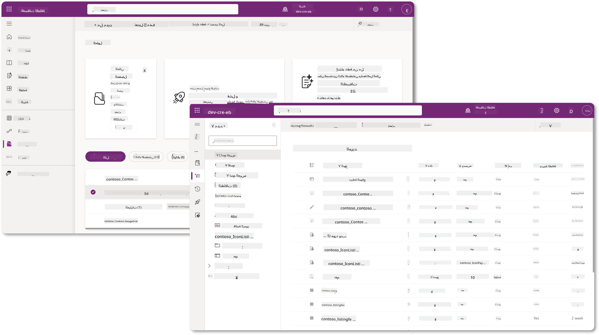

في Copilot Studio، يوجد الآن **مستكشف الحلول** حيث يمكنك إدارة حلولك مباشرة. لم تعد بحاجة إلى التبديل إلى بوابة صانع Power Apps لإدارة حلولك، يمكن القيام بذلك داخل Copilot Studio 🪄

هذا يعني أنه يمكنك القيام بالمهام المعتادة المتعلقة بالحلول:

- **إنشاء حل** - الحلول المخصصة تمكن الوكلاء من التصدير والاستيراد بين البيئات.
- **تعيين الحل المفضل لديك** - اختر الحل الذي سيتم إنشاء الوكلاء، التطبيقات، إلخ فيه افتراضيًا.
- **إضافة أو إزالة المكونات** - قد يكون وكيلك يشير إلى مكونات أخرى مثل متغيرات البيئة أو التدفقات السحابية. لذلك يجب تضمين هذه المكونات في الحل.
- **تصدير الحلول** - لنقل الحلول إلى بيئة مستهدفة أخرى.
- **استيراد الحلول** - استيراد الحلول التي تم إنشاؤها في مكان آخر، بما في ذلك الترقية أو تحديث الحلول.
- **إنشاء وإدارة خطوط الحلول** - أتمتة نشر الحلول بين البيئات.
- **تكامل Git** - يتيح للمطورين ربط الحلول بمستودعات Git للتحكم في الإصدارات، التعاون وإدارة دورة حياة التطبيقات. مخصص للاستخدام فقط في بيئات المطورين.

   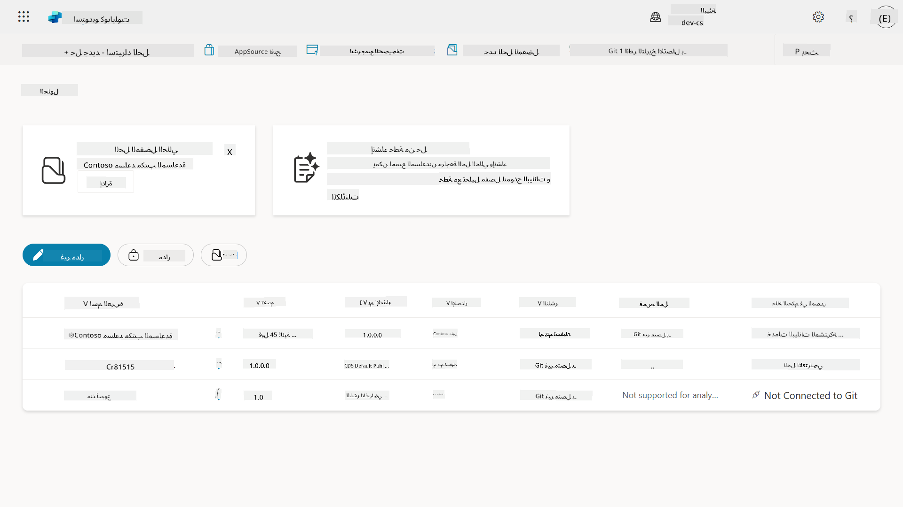

هناك نوعان من الحلول:

- **الحلول غير المُدارة** - تُستخدم أثناء التطوير. يمكنك تحريرها وتخصيصها بحرية حسب الحاجة.
- **الحلول المُدارة** - تُستخدم عندما تكون جاهزًا لنشر تطبيقك للاختبار أو الإنتاج. يتم تأمينها لمنع التغييرات العرضية.

## 🤔 لماذا _يجب_ أن أستخدم حلًا لوكيلي؟

فكر في الحلول كـ _صندوق أدوات_. عندما تحتاج إلى إصلاح أو بناء شيء (وكيل) في موقع مختلف (بيئة)، تجمع جميع الأدوات اللازمة (المكونات) وتضعها في صندوق الأدوات (الحل). يمكنك بعد ذلك حمل هذا الصندوق إلى الموقع الجديد (البيئة) واستخدام الأدوات (المكونات) لإكمال عملك، أو إضافة أدوات جديدة (المكونات) لتخصيص وكيلك أو المشروع الذي تقوم ببنائه.

!!! quote "إلايزا، مدافعة السحابة الودية تظهر هنا 🙋🏻‍♀️ لتشارك بعض الكلمات:"
    لدينا قول في نيوزيلندا، "كن كيويًا مرتبًا!" وهو دعوة للعمل لنيوزيلنديين 🥝 لتحمل مسؤولية بيئتهم من خلال التخلص من القمامة بشكل صحيح والحفاظ على الأماكن العامة نظيفة. يمكننا استخدام نفس السياق للوكلاء من خلال الحفاظ على كل ما يتعلق بوكيلك منظمًا وقابلًا للنقل، وسيساعدك ذلك في الحفاظ على بيئة مرتبة.

من الجيد إنشاء وكيل في حل مخصص في بيئة المصدر (المطور). إليك لماذا الحلول قيمة:

🧩 **تطوير منظم**

- أنت تحافظ على وكيلك منفصلًا عن الحل الافتراضي الذي يحتوي على كل شيء في البيئة. جميع مكونات وكيلك في مكان واحد 🎯

- كل ما تحتاجه لوكيلك موجود في الحل، مما يجعل من السهل تصديره واستيراده إلى بيئة مستهدفة 👉🏻 هذه عادة صحية لإدارة دورة حياة التطبيقات.

🧩 **نشر آمن**

- يمكنك تصدير تطبيقك أو وكيلك كحل مُدار ونشره في بيئات مستهدفة أخرى (مثل الاختبار أو الإنتاج) دون المخاطرة بالتعديلات العرضية.

🧩 **التحكم في الإصدارات**

- يمكنك إنشاء تصحيحات (إصلاحات مستهدفة)، تحديثات (تغيير شامل أكثر) أو ترقيات (استبدال الحل - عادة تغييرات كبيرة وإدخال ميزات جديدة).

- يساعدك في طرح التغييرات بطريقة منظمة.

🧩 **إدارة التبعيات**

- الحلول تتبع الأجزاء التي تعتمد على بعضها البعض. هذا يمنعك من كسر الأشياء عند إجراء تغييرات.

🧩 **التعاون بين الفريق**

- يمكن للمطورين والصانعين العمل معًا باستخدام الحلول غير المُدارة أثناء التطوير، ثم تسليم حل مُدار للنشر.

## 🪪 فهم ناشري الحلول

ناشر الحل في Power Platform يشبه العلامة أو العلامة التجارية التي تحدد من أنشأ أو يمتلك الحل. إنه جزء صغير ولكنه مهم في إدارة تطبيقاتك، وكلائك وتخصيصات التدفق، خاصة عند العمل في فرق أو عبر البيئات.

عندما تنشئ حلًا، يجب عليك اختيار ناشر. هذا الناشر يحدد:

- بادئة تُضاف إلى جميع المكونات المخصصة (فكر في الجداول، الحقول، والتدفقات).

- اسم ومعلومات الاتصال للمنظمة أو الشخص الذي يمتلك الحل.

### 🤔 لماذا هو مهم؟

1. **سهولة التعرف** - البادئة (مثال - `new_` أو `abc_`) تساعدك على التعرف بسرعة على المكونات التي تنتمي إلى أي حل أو فريق.

1. **تجنب التعارضات** - إذا أنشأ فريقان عمودًا يسمى الحالة، فإن بادئتيهما (`teamA_status`, `teamB_status`) تمنع تصادم الأسماء.

1. **يدعم إدارة دورة حياة التطبيقات** - عند نقل الحلول بين البيئات (التطوير → الاختبار → الإنتاج)، يساعد الناشر في تتبع الملكية والحفاظ على التناسق.

### ✨ مثال

لنفترض أنك أنشأت ناشرًا يسمى حلول Contoso مع البادئة `cts_`.

إذا أضفت عمودًا مخصصًا يسمى _الأولوية_، سيتم تخزينه كـ `cts_Priority` في الحل.

أي شخص يصادف العمود على مستوى الحل بغض النظر عن البيئة التي يتواجد فيها، يمكنه بسهولة التعرف عليه كعمود مرتبط بحلول Contoso.

## 🧭 دورة حياة حلول Power Platform

الآن بعد أن فهمت الغرض من الحل، دعنا نتعلم عن دورة الحياة.

**1. إنشاء حل في بيئة التطوير** - ابدأ بإنشاء حل جديد في بيئة التطوير الخاصة بك.

**2. إضافة المكونات** - أضف التطبيقات، التدفقات، الجداول، والعناصر الأخرى إلى الحل.

**3. تصدير كحل مُدار** - قم بتعبئة الحل للنشر عن طريق تصديره كحل مُدار.

**4. استيراد إلى بيئة الاختبار** - اختبر الحل في بيئة اختبار منفصلة للتأكد من أن كل شيء يعمل كما هو متوقع.

**5. استيراد إلى بيئة الإنتاج** - انشر الحل الذي تم اختباره إلى بيئة الإنتاج الحية.

**6. تطبيق التصحيحات، التحديثات أو الترقيات** - قم بإجراء تحسينات أو إصلاحات باستخدام التصحيحات، التحديثات، أو الترقيات. 🔁 كرر الدورة!

### ✨ مثال

تخيل أنك تبني وكيل مكتب مساعدة لتقديم المساعدة للموظفين في مشاكل مثل مشاكل الأجهزة، استكشاف أخطاء الشبكة، إعداد الطابعة والمزيد.

- تبدأ في بيئة التطوير باستخدام حل غير مُدار.

- بمجرد أن يصبح جاهزًا، تقوم بتصديره كحل مُدار وتقوم باستيراده إلى بيئة مستهدفة مثل بيئة اختبار النظام أو اختبار قبول المستخدم (UAT).

- بعد الاختبار، تنقله إلى بيئة الإنتاج - كل ذلك دون لمس النسخة الأصلية للتطوير.

## 🧪 المختبر 04: إنشاء حل جديد

سنقوم الآن بالتعلم

- [4.1 كيفية إنشاء ناشر حل](../../../../../docs/recruit/04-creating-a-solution)
- [4.2 كيفية إنشاء حل](../../../../../docs/recruit/04-creating-a-solution)

سنلتزم بالمثال السابق، حيث سنقوم بإنشاء حل في بيئة Copilot Studio المخصصة لبناء وكيل مكتب المساعدة الخاص بنا.

لنبدأ!

### المتطلبات الأساسية

#### دور الأمان

في Copilot Studio، ما يمكنك القيام به في مستكشف الحل يعتمد على دور الأمان الخاص بك كمستخدم.
إذا لم يكن لديك إذن لإدارة الحلول في مركز إدارة Power Apps، فلن تتمكن من القيام بهذه المهام في Copilot Studio أيضًا.

للتأكد من أن كل شيء يعمل بسلاسة، تحقق من أن لديك أدوار الأمان والأذونات الصحيحة. أو إذا كنت لا تدير البيئات في مؤسستك، اسأل مسؤول تكنولوجيا المعلومات الخاص بك (أو الفريق المكافئ) الذي يدير المستأجر/البيئات.

الأدوار الأمنية التالية تمكن المستخدمين من إنشاء حل في بيئتهم.

| دور الأمان    | الوصف |
| ---------- | ---------- |
| صانع البيئة | يوفر الأذونات اللازمة لإنشاء، تخصيص، وإدارة الموارد داخل بيئة معينة، بما في ذلك الحلول  |
| مخصص النظام  | أذونات أوسع من صانع البيئة، بما في ذلك القدرة على تخصيص البيئة وإدارة أدوار الأمان |
| مسؤول النظام   | أعلى مستوى من الأذونات ويمكنه إدارة جميع جوانب البيئة، بما في ذلك إنشاء وتعيين أدوار الأمان     |

#### بيئة المطور

تأكد من التبديل إلى بيئة المطور المخصصة الخاصة بك، راجع [الدرس 00 - إعداد الدورة - الخطوة 3: إنشاء مطور جديد](../00-course-setup/README.md#step-3-create-new-developer-environment).

1. في الزاوية العلوية اليمنى، اختر رمز **عجلة التروس** وقم بالتبديل من البيئة الافتراضية إلى بيئتك، على سبيل المثال **بيئة Adele Vance**.

    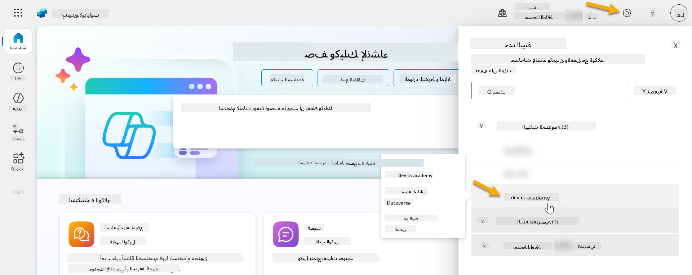

### 4.1 إنشاء ناشر حل

1. باستخدام نفس بيئة Copilot Studio المستخدمة في الدرس السابق، اختر رمز **النقاط الثلاث (. . .)** في القائمة الجانبية اليسرى في Copilot Studio. اختر **الحلول** تحت عنوان **استكشاف**.

    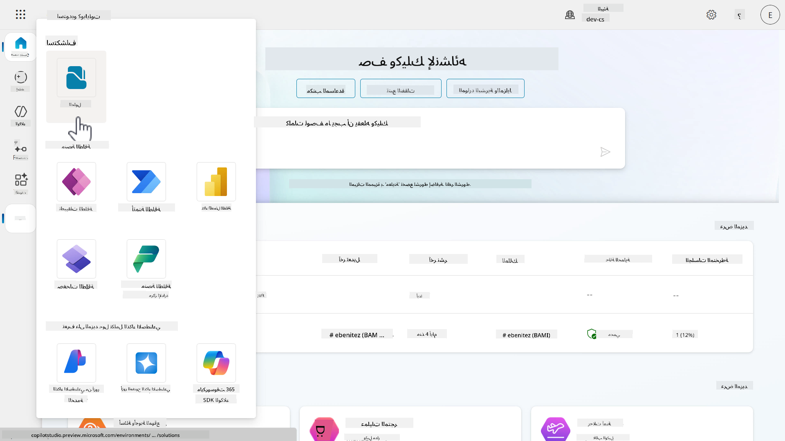

1. سيتم تحميل **مستكشف الحلول** في Copilot Studio. اختر **+ حل جديد**

    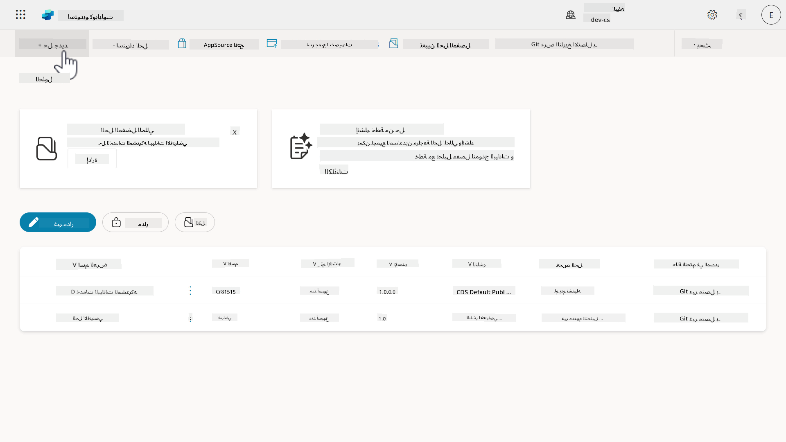

1. ستظهر لوحة **حل جديد** حيث يمكننا تحديد تفاصيل الحل الخاص بنا. أولاً، نحتاج إلى إنشاء ناشر جديد. اختر **+ ناشر جديد**.

    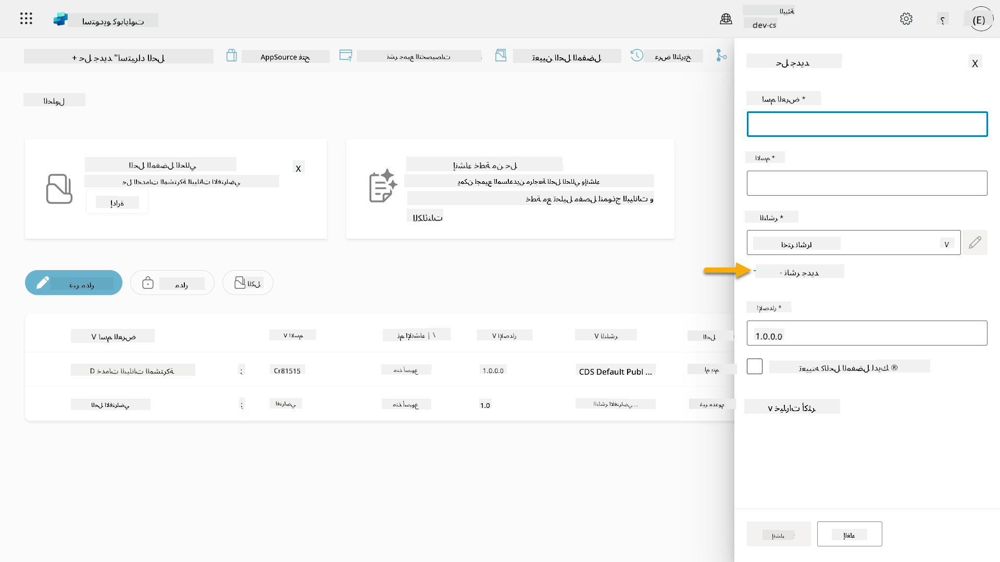  

1. ستظهر علامة التبويب **الخصائص** في لوحة **ناشر جديد** مع الحقول المطلوبة وغير المطلوبة ليتم تعبئتها في علامة التبويب **الخصائص**. هنا يمكننا تحديد تفاصيل الناشر الذي سيتم استخدامه كعلامة أو علامة تجارية تحدد من أنشأ أو يمتلك الحل.

    | الخاصية    | الوصف | مطلوب |
    | ---------- | ---------- | :----------: |
    | الاسم المعروض | الاسم المعروض للناشر | نعم   |
    | الاسم  | الاسم الفريد واسم المخطط للناشر  | نعم    |
    | الوصف   | يوضح الغرض من الحل    | لا     |
    | البادئة    | بادئة الناشر التي سيتم تطبيقها على المكونات التي تم إنشاؤها حديثًا   | نعم      |
    | بادئة قيمة الاختيار   | يولد رقمًا بناءً على بادئة الناشر. يتم استخدام هذا الرقم عند إضافة خيارات إلى الاختيارات ويوفر مؤشرًا للحل الذي تم استخدامه لإضافة الخيار.   | نعم      |

    انسخ والصق ما يلي كـ **الاسم المعروض**،

    ```text
    Contoso Solutions
    ```

    انسخ والصق ما يلي كـ **الاسم**،

    ```text
    ContosoSolutions
    ```

    انسخ والصق ما يلي كـ **الوصف**،

    ```text
    Copilot Studio Agent Academy
    ```

    انسخ والصق ما يلي لـ **البادئة**،

    ```text
    cts
    ```

    بشكل افتراضي، ستعرض بادئة قيمة الاختيار قيمة عددية. قم بتحديث هذه القيمة العددية إلى أقرب ألف. على سبيل المثال، في لقطة الشاشة الخاصة بي أدناه، كانت في البداية `77074`. قم بتحديث هذا من `77074` إلى `77000`.

    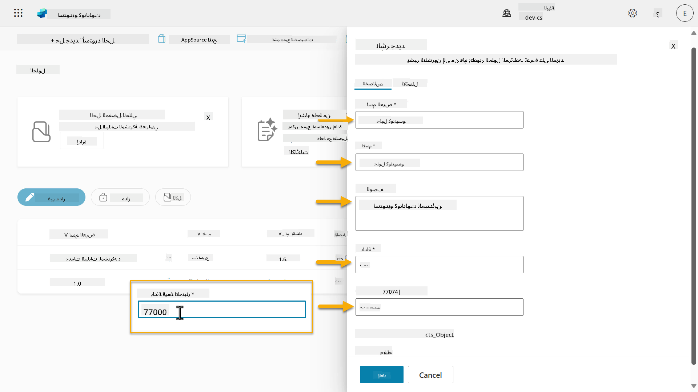  

1. إذا كنت ترغب في تقديم تفاصيل الاتصال للحل، اختر علامة التبويب **الاتصال** وقم بتعبئة الأعمدة التالية المعروضة.

    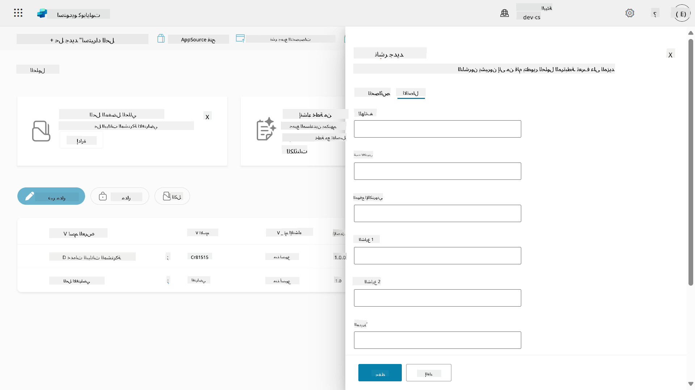

1. اختر علامة التبويب **الخصائص** واختر **حفظ** لإنشاء الناشر.

    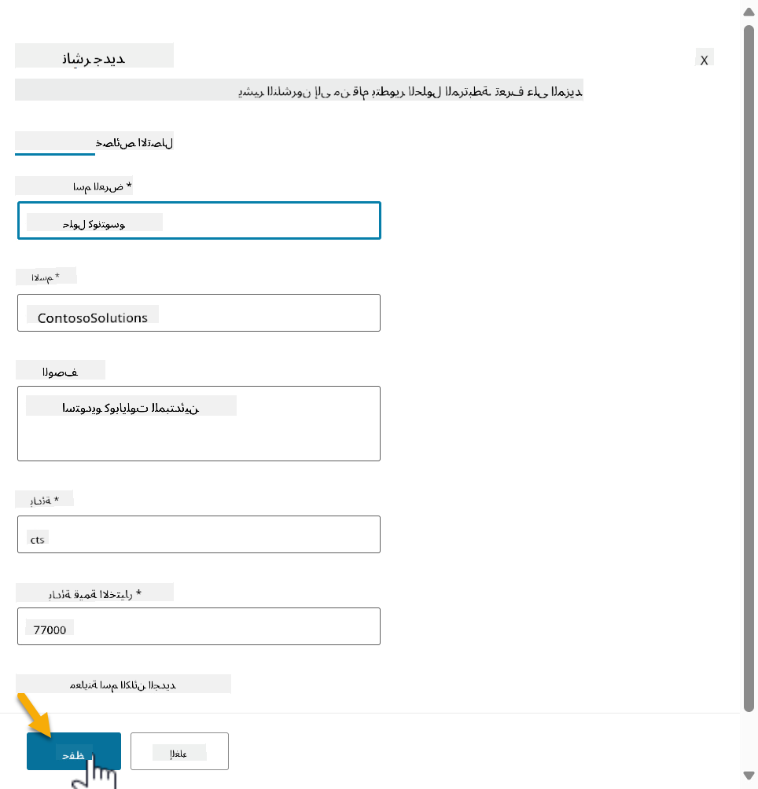
1. سيتم إغلاق نافذة الناشر الجديد وستعود إلى نافذة **الحل الجديد** مع اختيار الناشر الذي تم إنشاؤه حديثًا.

    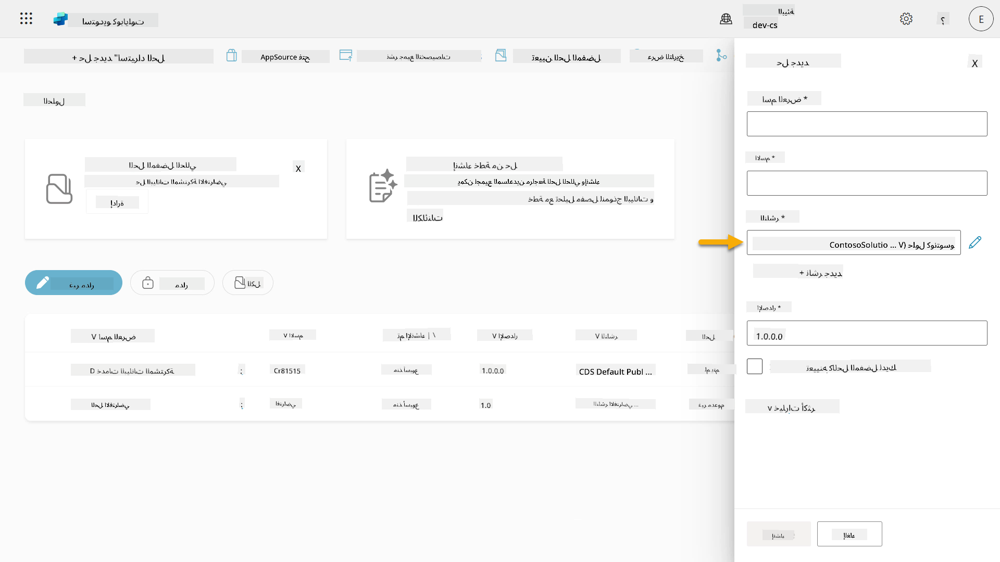  

أحسنت، لقد أنشأت الآن ناشر الحل! 🙌🏻 سنتعلم بعد ذلك كيفية إنشاء حل مخصص جديد.

### 4.2 إنشاء حل جديد

1. الآن بعد أن أنشأنا حلولنا، يمكننا الآن إكمال باقي النموذج في نافذة **الحل الجديد**.

    انسخ والصق النص التالي كـ **اسم العرض**،

    ```text
    Contoso Helpdesk Agent
    ```

    انسخ والصق النص التالي كـ **الاسم**،

    ```text
    ContosoHelpdeskAgent
    ```

    بما أننا نقوم بإنشاء حل جديد، فإن [رقم **الإصدار**](https://learn.microsoft.com/power-apps/maker/data-platform/update-solutions#understanding-version-numbers-for-updates/?WT.mc_id=power-172615-ebenitez) سيكون افتراضيًا `1.0.0.0`.

    قم بتحديد مربع الاختيار **تعيين كالحل المفضل لديك**.

    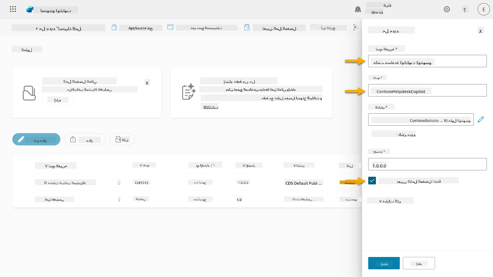  

1. قم بتوسيع **خيارات إضافية** لرؤية التفاصيل الإضافية التي يمكن تقديمها في الحل.

    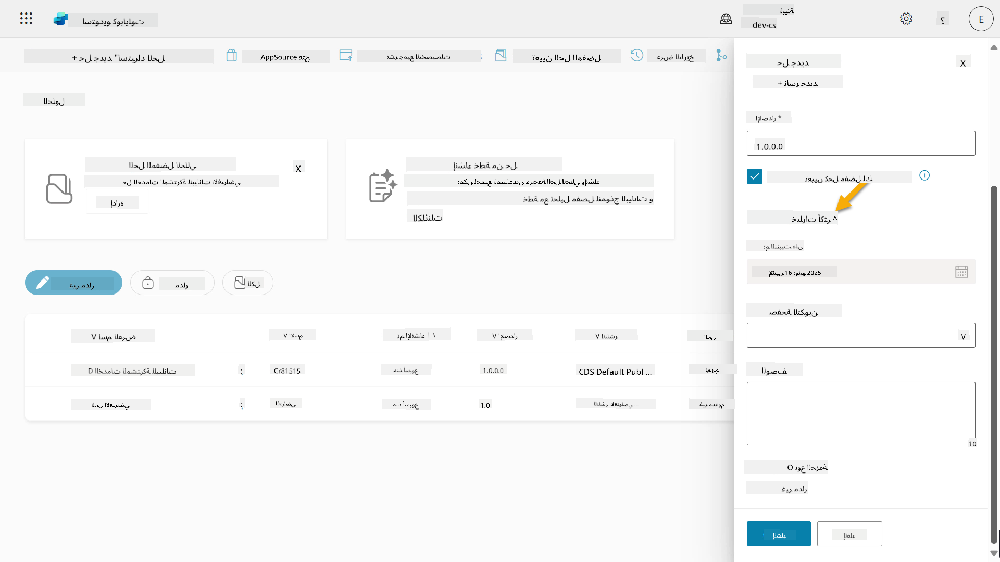

1. سترى التالي:

    - **تم تثبيته في** - تاريخ تثبيت الحل.

    - **صفحة التكوين** - يقوم المطورون بإعداد مورد ويب HTML لمساعدة المستخدمين على التفاعل مع تطبيقهم أو وكيلهم أو أداتهم حيث ستظهر كصفحة ويب في قسم المعلومات مع تعليمات أو أزرار. يتم استخدامها غالبًا من قبل الشركات أو المطورين الذين يقومون ببناء ومشاركة الحلول مع الآخرين.

    - **الوصف** - يصف الحل أو وصفًا عامًا لصفحة التكوين.

    سنترك هذه الحقول فارغة لهذا التدريب.

    اختر **إنشاء**.

    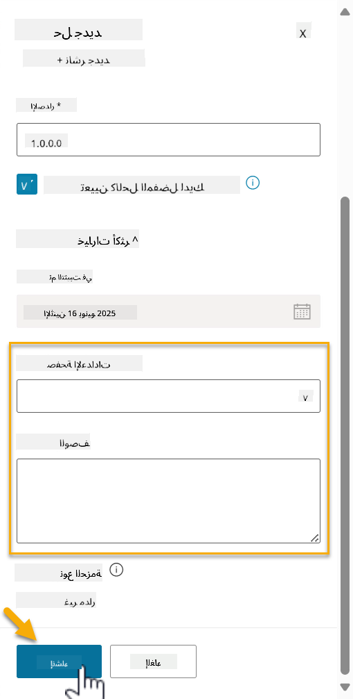

1. تم الآن إنشاء الحل لوكيل مكتب المساعدة الخاص بـ Contoso. لن يكون هناك أي مكونات حتى نقوم بإنشاء وكيل في Copilot Studio.

    اختر رمز **السهم الخلفي** للعودة إلى مستكشف الحلول.

    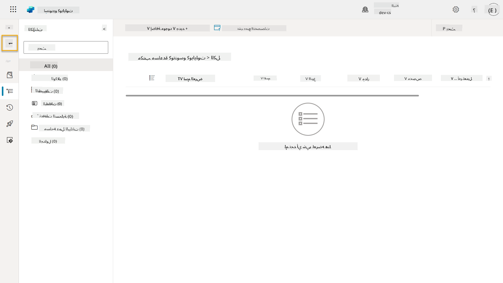

1. لاحظ كيف يظهر وكيل مكتب المساعدة الخاص بـ Contoso الآن كـ **الحل المفضل الحالي** لأننا قمنا بتحديد مربع الاختيار **تعيين كالحل المفضل لديك** سابقًا.

    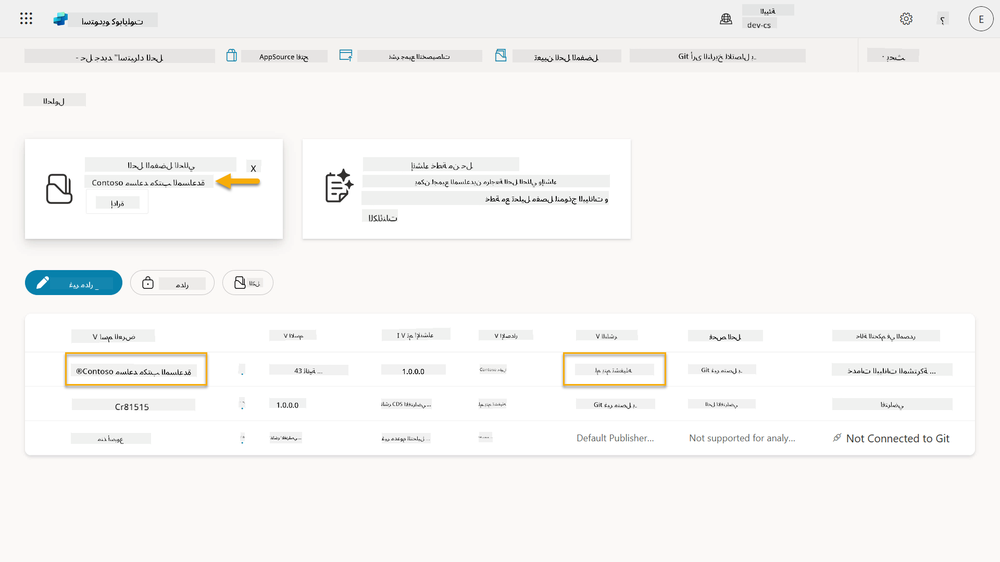

## ✅ المهمة مكتملة

تهانينا! 👏🏻 لقد أنشأت ناشرًا واستخدمته في الحل الذي أنشأته حديثًا لبناء وكيلك!

عمل رائع، صانع الوكلاء. البصمة الرقمية المنظمة هي الخطوة الأولى نحو التشغيل على نطاق واسع. الآن لديك الأدوات والعقلية لتطوير وكلاء جاهزين للمؤسسات بشكل مستدام.

هذا هو نهاية **المختبر 04 - إنشاء حل**، اختر الرابط أدناه للانتقال إلى الدرس التالي. سيتم استخدام الحل الذي أنشأته في هذا المختبر في مختبر الدرس التالي.

⏭️ [انتقل إلى درس **البدء بسرعة مع الوكلاء الجاهزين**](../05-using-prebuilt-agents/README.md)

## 📚 موارد تكتيكية

🔗 [إنشاء حل](https://learn.microsoft.com/power-apps/maker/data-platform/create-solution/?WT.mc_id=power-172615-ebenitez)

🔗 [إنشاء وإدارة الحلول في Copilot Studio](https://learn.microsoft.com/microsoft-copilot-studio/authoring-solutions-overview/?WT.mc_id=power-172615-ebenitez)

🔗 [مشاركة الوكلاء مع مستخدمين آخرين](https://learn.microsoft.com/microsoft-copilot-studio/admin-share-bots/?WT.mc_id=power-172615-ebenitez)

🔗 [ملخص الموارد المتاحة للأدوار الأمنية المحددة مسبقًا](https://learn.microsoft.com/power-platform/admin/database-security#summary-of-resources-available-to-predefined-security-roles/?WT.mc_id=power-172615-ebenitez)

🔗 [ترقية أو تحديث الحل](https://learn.microsoft.com/power-apps/maker/data-platform/update-solutions/?WT.mc_id=power-172615-ebenitez)

🔗 [نظرة عامة على خطوط الأنابيب في Power Platform](https://learn.microsoft.com/power-platform/alm/pipelines/?WT.mc_id=power-172615-ebenitez)

🔗 [نظرة عامة على تكامل Git في Power Platform](https://learn.microsoft.com/power-platform/alm/git-integration/overview/?WT.mc_id=power-172615-ebenitez)


---

**إخلاء المسؤولية**:  
تم ترجمة هذا المستند باستخدام خدمة الترجمة بالذكاء الاصطناعي [Co-op Translator](https://github.com/Azure/co-op-translator). بينما نسعى لتحقيق الدقة، يرجى العلم أن الترجمات الآلية قد تحتوي على أخطاء أو عدم دقة. يجب اعتبار المستند الأصلي بلغته الأصلية المصدر الرسمي. للحصول على معلومات حاسمة، يُوصى بالترجمة البشرية الاحترافية. نحن غير مسؤولين عن أي سوء فهم أو تفسيرات خاطئة تنشأ عن استخدام هذه الترجمة.