<!--
CO_OP_TRANSLATOR_METADATA:
{
  "original_hash": "8e2c64a7f9303e58329ec8bb468c80b4",
  "translation_date": "2025-10-22T19:43:34+00:00",
  "source_file": "docs/recruit/05-using-prebuilt-agents/README.md",
  "language_code": "ar"
}
-->
# 🧰 المهمة 05: استخدام وكيل مُعد مسبقًا  

## 🕵️‍♂️ الاسم الرمزي: `عملية السفر الآمن`

> **⏱️ مدة العملية:** `~30 دقيقة`

🎥 **شاهد الفيديو التوضيحي**

## 🎯 ملخص المهمة

مرحبًا بك في مهمتك التالية في أكاديمية وكلاء Copilot Studio. ستتعرف الآن على عالم **الوكلاء المُعدّين مسبقًا**—وكلاء ذكيين مصممين خصيصًا من قبل Microsoft لتسريع عملية النشر وتقليل الوقت اللازم لتحقيق القيمة.

بدلاً من البدء من الصفر، توفر الوكلاء المُعدّين مسبقًا (المعروفة أيضًا بـ **قوالب الوكلاء**) بداية سريعة من خلال تقديم سيناريوهات جاهزة يمكن تخصيصها ونشرها في دقائق.

في هذه المهمة، ستقوم بنشر وكيل **السفر الآمن**—وهو وكيل يساعد المستخدمين في التحضير للسفر العملي، وفهم سياسات الشركة، وتبسيط التخطيط.

---

## 🧭 الأهداف

أهدافك لهذه المهمة هي:

1. فهم ماهية الوكلاء المُعدّين مسبقًا وأهميتهم  
1. نشر قالب وكيل **السفر الآمن**  
1. تخصيص ردود ومحتوى الوكيل  
1. اختبار ونشر الوكيل  

---

## 🧠 ما هي الوكلاء المُعدّين مسبقًا؟

الوكلاء المُعدّين مسبقًا هم وكلاء ذكاء اصطناعي جاهزون تم إنشاؤهم بواسطة Microsoft:

- يعالجون احتياجات الأعمال الشائعة (مثل السفر، الموارد البشرية، دعم تكنولوجيا المعلومات)
- يتضمنون مواضيع جاهزة، عبارات تشغيل، تعليمات وعينات من المعرفة.
- يمكن تعديلها، توسيعها، وربطها ببياناتك الخاصة

هذه الوكلاء مثالية للبدء بسرعة أو لتعلم كيفية هيكلة الوكلاء.

---

## 🧪 المختبر 05: البدء بسرعة مع وكيل مُعد مسبقًا

سنقوم الآن بتعلم كيفية اختيار وكيل مُعد مسبقًا وتخصيصه.

- [5.1 تشغيل Copilot Studio](../../../../../docs/recruit/05-using-prebuilt-agents)
- [5.2 اختيار قالب وكيل السفر الآمن](../../../../../docs/recruit/05-using-prebuilt-agents)
- [5.3 تخصيص الوكيل](../../../../../docs/recruit/05-using-prebuilt-agents)
- [5.4 اختبار ونشر](../../../../../docs/recruit/05-using-prebuilt-agents)

سنلتزم بالمثال السابق، حيث سنقوم بإنشاء حل في بيئة Copilot Studio المخصصة لبناء وكيل مكتب المساعدة لتكنولوجيا المعلومات.

لنبدأ!

### 5.1 تشغيل Copilot Studio

1. انتقل إلى [https://copilotstudio.microsoft.com](https://copilotstudio.microsoft.com)

1. قم بتسجيل الدخول باستخدام حساب العمل أو المدرسة الخاص بـ Microsoft 365

!!! warning
    يجب أن تكون في مستأجر حيث تم تمكين Copilot Studio. إذا لم ترَ Copilot Studio، قم بمراجعة [المهمة 00](../00-course-setup/README.md) لإكمال الإعداد.

### 5.2 اختيار قالب وكيل السفر الآمن

1. من الصفحة الرئيسية لـ Copilot Studio، انقر على **+ إنشاء**
    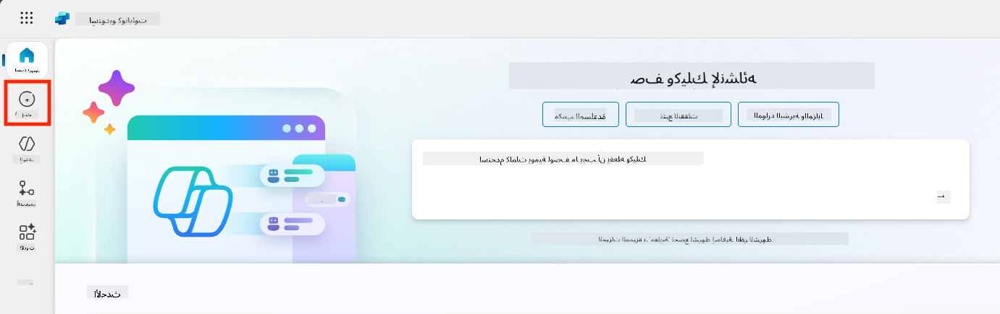

1. قم بالتمرير لأسفل إلى قسم **ابدأ مع قالب وكيل**

1. ابحث واختر **السفر الآمن**

    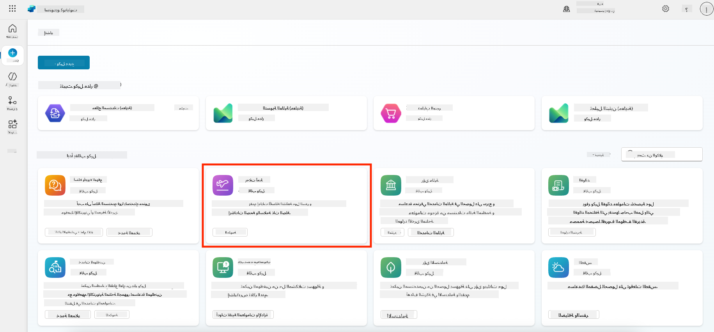

1. لاحظ أن القالب يأتي محملاً مسبقًا بوصف، تعليمات ومعرفة.

    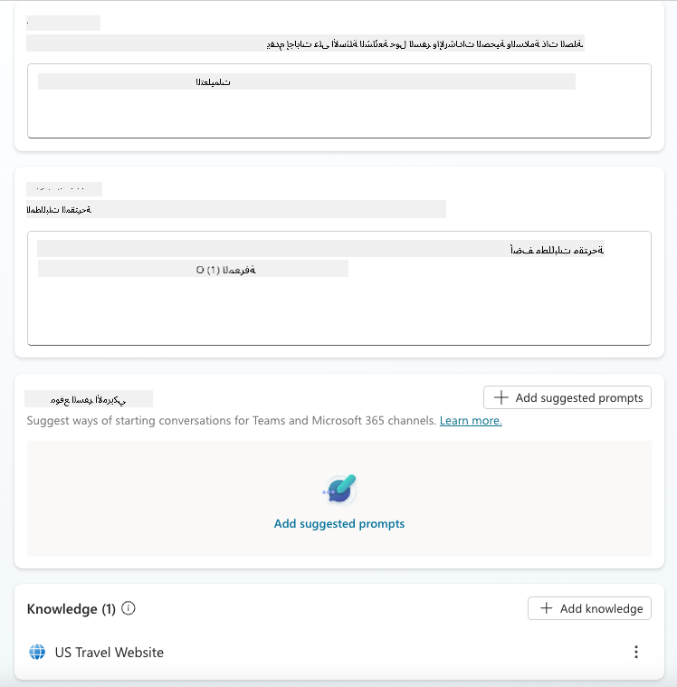

1. انقر على **إنشاء**

    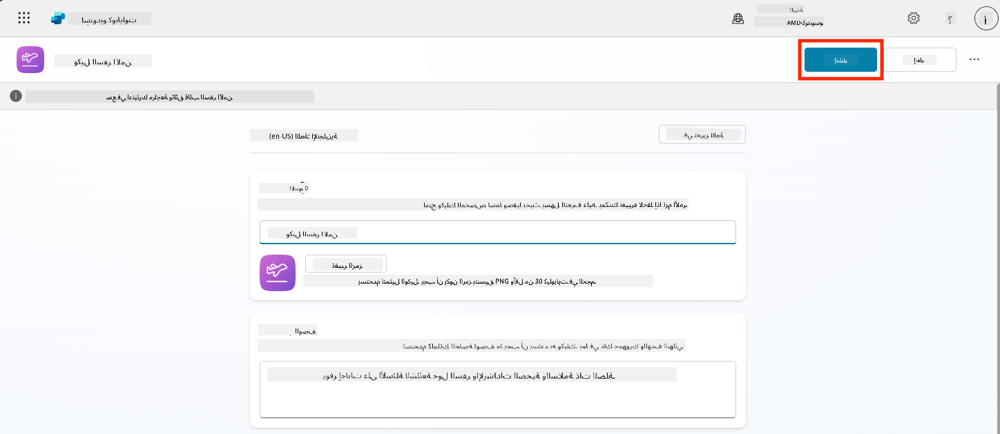

سيقوم هذا بإنشاء وكيل جديد في بيئتك بناءً على إعدادات السفر الآمن.

### 5.3 تخصيص الوكيل

الآن بعد أن تم إنشاء الوكيل، دعنا نخصصه ليناسب مؤسستك:

1. اختر **تمكين الذكاء الاصطناعي التوليدي** لتفعيل ميزة الذكاء الاصطناعي التوليدي حتى يتمكن من استخدام التعليمات المقدمة في القالب.

    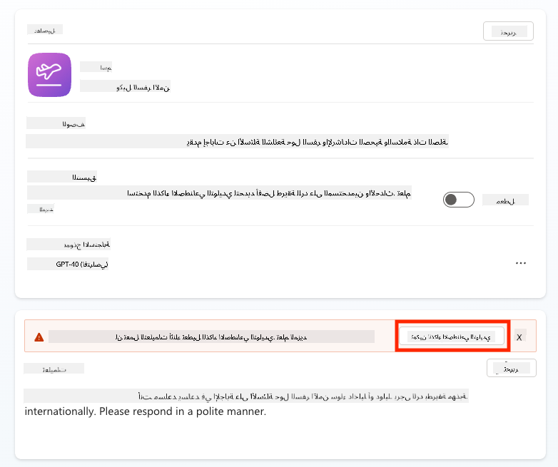

1. الآن سنزود الوكيل بمصدر معرفة إضافي حتى يتمكن من الإجابة على أسئلة حول السفر في أوروبا. للقيام بذلك، قم بالتمرير لأسفل إلى قسم **المعرفة** واختر **إضافة معرفة**

    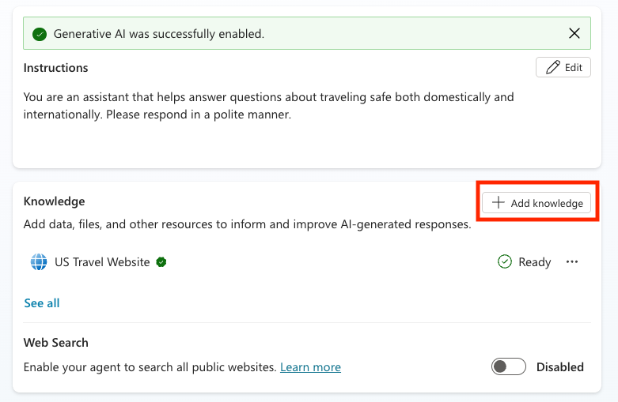

1. اختر **مواقع ويب عامة**

    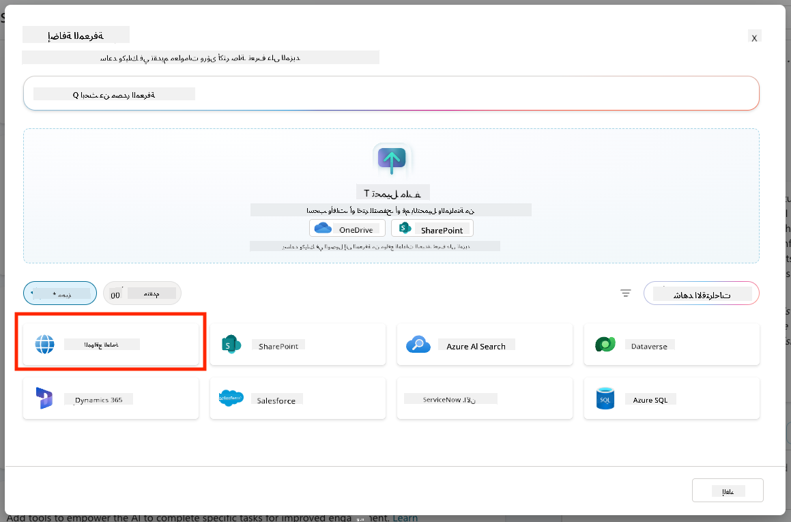

1. في حقل النص، قم بلصق **<https://european-union.europa.eu/>** واختر **إضافة**

    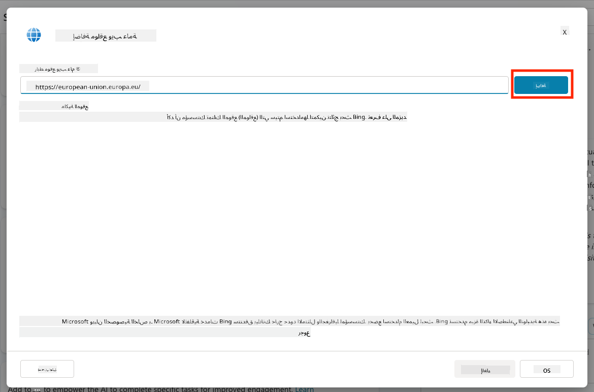

1. اختر **إضافة إلى الوكيل**

    

### 5.4 اختبار ونشر

1. انقر على **اختبار** في الزاوية العلوية اليمنى لفتح نافذة الاختبار  

1. جرب عبارات مثل:

    - `“هل أحتاج إلى تأشيرة للسفر من الولايات المتحدة إلى أمستردام؟”`
    - `“كم يستغرق الحصول على جواز سفر أمريكي؟”`
    - `“أين تقع أقرب سفارة أمريكية في فالنسيا، إسبانيا؟”`

1. تأكد من أن الوكيل يرد بمعلومات دقيقة ومفيدة وراقب خريطة النشاط لترى من أين استرجع المعلومات.

    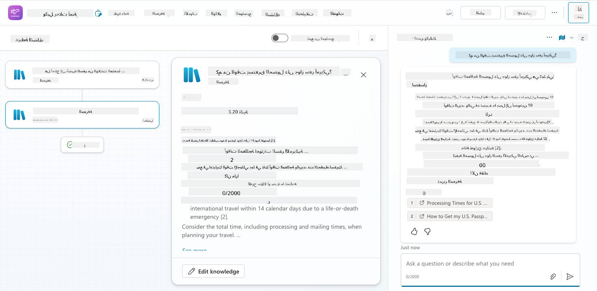

1. عندما تكون جاهزًا، انقر على **نشر**

    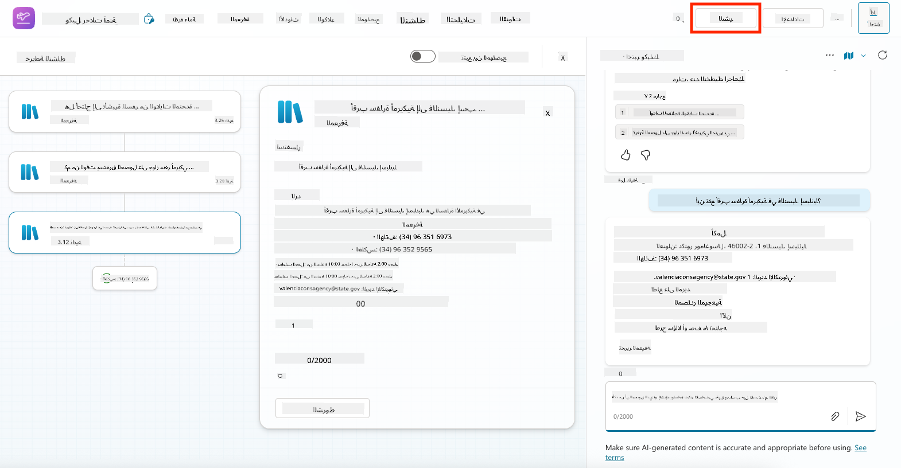

1. اختر **نشر** مرة أخرى في مربع الحوار
    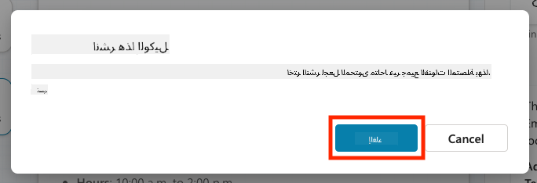

1. اختياريًا، أضف الوكيل إلى Microsoft Teams باستخدام ميزة **القنوات** المدمجة.

!!! note "🧳 هدف إضافي"
    حاول ربط وكيل السفر الآمن بموقع SharePoint أو ملف الأسئلة الشائعة لجعله أكثر ملاءمة لسياسات السفر الخاصة بشركتك.

## ✅ المهمة مكتملة

لقد نجحت الآن في:

- نشر وكيل مُعد مسبقًا من Microsoft  
- تخصيص الوكيل
- اختبار ونشر نسختك الخاصة من قالب وكيل **السفر الآمن**

⏭️ [انتقل إلى درس **إنشاء وكيل مخصص من البداية**](../06-create-agent-from-conversation/README.md).

<!-- markdownlint-disable-next-line MD033 -->

---

**إخلاء المسؤولية**:  
تم ترجمة هذا المستند باستخدام خدمة الترجمة بالذكاء الاصطناعي [Co-op Translator](https://github.com/Azure/co-op-translator). بينما نسعى لتحقيق الدقة، يرجى العلم أن الترجمات الآلية قد تحتوي على أخطاء أو عدم دقة. يجب اعتبار المستند الأصلي بلغته الأصلية المصدر الرسمي. للحصول على معلومات حاسمة، يُوصى بالترجمة البشرية الاحترافية. نحن غير مسؤولين عن أي سوء فهم أو تفسيرات خاطئة تنشأ عن استخدام هذه الترجمة.