<!--
CO_OP_TRANSLATOR_METADATA:
{
  "original_hash": "180f9cc0b40527f61be092c9b0f72aba",
  "translation_date": "2025-10-22T19:34:48+00:00",
  "source_file": "docs/recruit/06-create-agent-from-conversation/README.md",
  "language_code": "ar"
}
-->
# 🚨 المهمة 06: إنشاء وكيل مخصص باستخدام اللغة الطبيعية مع Copilot وربطه ببياناتك

## 🕵️‍♂️ الاسم الرمزي: `عملية تشكيل الوكيل`

> **⏱️ مدة العملية:** `~75 دقيقة`

🎥 **شاهد الفيديو التوضيحي**

[](https://www.youtube.com/watch?v=qZTtQVncGFg "شاهد الفيديو التوضيحي على YouTube")

## 🎯 ملخص المهمة

مرحبًا بك مجددًا، صانع الوكلاء. هذه المهمة تضعك في مقعد القيادة لأقوى ميزة في Copilot Studio - إنشاء وكيل مخصص من الصفر باستخدام اللغة الطبيعية فقط... وتعزيزه ببياناتك الخاصة.

هذا ليس مجرد روبوت دردشة آخر. أنت تبني زميلًا رقميًا مدعومًا بالمعرفة - واحدًا يمكنه التفكير، الرد، والإشارة إلى معلومات حقيقية من المؤسسة.

سلاحك؟ اللغة الطبيعية. مهمتك؟ تصميم، تدريب، واختبار وكيل دعم فني مخصص بالكامل يجيب على أسئلة تقنية المعلومات باستخدام SharePoint، الملفات المرفوعة، أو روابط الشركة.

لنبدأ ببناء وكيلك من البداية.

## 🔎 الأهداف

في هذه المهمة، ستتعلم:

1. فهم ماهية الوكلاء المخصصين وكيف يختلفون عن القوالب الجاهزة.
1. إنشاء وكلاء باستخدام مطالبات اللغة الطبيعية وتصميم المحادثات مع Copilot.
1. ربط الوكلاء بمصادر المعرفة المؤسسية بما في ذلك SharePoint، الوثائق، والمواقع الإلكترونية.
1. التعرف على التنسيق التوليدي وكيفية بحث الوكلاء ديناميكيًا والرد باستخدام مصادر بيانات متعددة.
1. بناء واختبار وكيل دعم فني لتقنية المعلومات يعمل بشكل كامل ويستطيع الإجابة على الأسئلة باستخدام بياناتك الخاصة.

## 🤔 ما هو الوكيل _المخصص_؟

الوكيل المخصص هو روبوت دردشة أو مساعد افتراضي تقوم بإنشائه وتصميمه في Copilot Studio لمساعدة المستخدمين في مهام أو أسئلة محددة. يُطلق عليه مخصص لأنه:

- **أنت تحدد الغرض** - مساعدة المستخدمين في طلب إجازة، التحقق من حالة الطلب، تقديم المساعدة في الأسئلة المتعلقة بتقنية المعلومات.
- **أنت تصمم المحادثة** - ما يقوله الوكيل وكيف يجب أن يرد.
- **أنت تربطه ببياناتك الخاصة** - الاتصال ببيانات المؤسسة من خلال الموارد المعرفية المدعومة المدمجة.
- **أنت تربطه بأنظمتك أو تطبيقاتك الخاصة** - اختر من بين الموصلات، التدفقات، واجهات برمجة التطبيقات REST، وخوادم بروتوكول سياق النموذج.

!!! note
    فكر في الأمر بهذه الطريقة: أنت تبني مساعدًا رقميًا خاصًا بك يمكنه التحدث إلى المستخدمين وإكمال المهام لهم مثل الإجابة على الأسئلة، جمع المعلومات المطلوبة لعملية ما، أو الاتصال ببيانات مؤسستك.

### 🤖 ماذا يمكن للوكيل المخصص أن يفعل؟

يمكن للوكيل المخصص أن يحقق ما يلي:

- طلب معلومات من المستخدمين مثل الأسماء، التواريخ، أو التفضيلات.
- حفظ تلك المعلومات في قاعدة بيانات أو جدول.
- البحث عن البيانات بناءً على الأسئلة المطروحة والإجابة عليها.
- العمل بشكل مستقل دون تفاعل مباشر من المستخدمين.
- تنفيذ إجراءات إما عند الطلب من خلال تفاعل المستخدم المباشر أو بشكل مستقل مثل إرسال رسائل البريد الإلكتروني أو إنشاء السجلات.

### 👩🏻‍💻 لماذا استخدام وكيل مخصص؟

- يوفر الوقت من خلال أتمتة المهام المتكررة.
- يمنح المستخدمين تجربة ودية وموجهة.
- يمكن تخصيصه لاحتياجات عملك أو مشروعك.

### ✨ مثال

تقوم بإنشاء وكيل مخصص يساعد الموظفين في طلب إجازة.

يسأل عن اسمهم، تواريخ الإجازة، واسم مديرهم، ثم يحفظ المعلومات في النظام المخصص لإدارة طلبات الإجازة، مثل قائمة SharePoint.

الآن، بدلاً من التنقل إلى قائمة SharePoint وإنشاء عنصر جديد، يمكن للموظفين ببساطة التحدث مع الوكيل.

## 🗣️ استخدام اللغة الطبيعية لإنشاء وكلاء

في السابق، تعلمت كيفية إنشاء وكلاء بسرعة في Copilot Studio باستخدام قوالب الوكلاء الجاهزة في [الدرس 05 - البدء بسرعة مع الوكلاء الجاهزين](../05-using-prebuilt-agents/README.md). في هذا الدرس، سنتعمق في تجربة إنشاء المحادثات مع Copilot. يجعل Copilot Studio إنشاء الوكلاء أمرًا سهلاً من خلال التحدث مع Copilot، تمامًا كما لو كنت تجري محادثة.

في Copilot Studio، لا تحتاج إلى كتابة كود لإنشاء وكيل. بدلاً من ذلك، تصف ما تريد أن يفعله وكيلك بلغة بسيطة، ويساعدك Copilot في بنائه خطوة بخطوة من خلال تجربة شبيهة بالدردشة.

## 🌱 لكنني جديد على "وصف ما أريد" - ماذا أفعل؟

قد يكون وصف ما تريد بلغة طبيعية لإنشاء وكيل مخصص مفهومًا جديدًا بالنسبة لك. كلما استخدمت Copilot عبر منتجات وخدمات Microsoft، فإنك تستخدم اللغة الطبيعية في شكل _مطالبة_.

المطالبة هي الرسالة أو التعليمات التي تقدمها لوكيل الذكاء الاصطناعي لتخبره بما تريد أن يفعله. فكر فيها كإعطاء توجيهات لمساعد. كلما كانت تعليماتك واضحة، كان من الأسهل على مساعدك فهمها والعمل عليها.

### 🪄 لماذا المطالبات مهمة

- توجه سلوك الوكيل.
- تساعد الوكيل على فهم نوع المحادثة التي يجب أن يجريها.
- المطالبة الجيدة تجعل الوكيل أكثر فائدة ودقة.

### 📝 نصائح لكتابة مطالبة جيدة

- كن واضحًا ومحددًا - قل بالضبط ما تريد أن يفعله الوكيل.
- فكر كمستخدم - ماذا سيقول المستخدم؟ ماذا يجب أن يرد الوكيل؟
- قم بتضمين أمثلة - إذا أمكن، قدم تفاعلًا نموذجيًا.

### ✨ مثال

لنفترض أن فريق الموارد البشرية يحتاج إلى وكيل للمساعدة في طلبات الإجازة.

يمكن أن تكون المطالبة:

    "أريد إنشاء وكيل يساعد المستخدمين في تقديم طلب إجازة. عندما يقول المستخدم إنه يريد طلب إجازة، يجب أن يسأل الوكيل عن اسمه، تاريخ بدء الإجازة، تاريخ انتهاء الإجازة، واسم مديره. بمجرد أن يقدم المستخدم هذه المعلومات، يجب أن يحفظها الوكيل في قائمة SharePoint تسمى 'طلبات الإجازة' وينشر إشعارًا في قناة Microsoft Teams مخصصة."

لماذا تعمل هذه المطالبة:

- **تحدد الهدف بوضوح** - تقديم طلب إجازة.
- **تصف تفاعل المستخدم** - ما يقوله المستخدم وما يجب أن يسأل عنه الوكيل.
- **تسرد البيانات المطلوبة** - الاسم، تاريخ البدء، تاريخ الانتهاء، المدير.
- **تذكر مكان تخزين البيانات** - قائمة SharePoint تسمى طلبات الإجازة.

## 🔮 حسنًا، لقد أنشأت وكيلًا... كيف أربطه بالمعرفة؟

في Copilot Studio، مصادر المعرفة هي الأماكن التي يمكن لوكيلك العثور فيها على معلومات لتقديم إجابات أفضل. عندما تضيف هذه المصادر، يمكن لوكيلك سحب بيانات مؤسستك من أماكن مثل Power Platform، Dynamics 365، المواقع الإلكترونية، وغيرها من الأنظمة أو الخدمات التي تستخدمها شركتك.

تعمل هذه المصادر مع الذكاء الاصطناعي لمساعدة وكيلك على الرد بدقة أكبر على أسئلة المستخدمين، ويتم تحقيق ذلك من خلال ما يُعرف بـ **التنسيق التوليدي**.

### 🌿 ما هو التنسيق التوليدي في سياق الوكلاء؟

التنسيق التوليدي يعني أن الوكيل يستخدم الذكاء الاصطناعي لتحديد كيفية الإجابة على سؤال ديناميكيًا من خلال الجمع بين مهاراته اللغوية المدمجة والمعلومات من مصادر المعرفة التي أضفتها.

عندما يسأل المستخدم سؤالًا، يقوم الوكيل بـ:

- فهم السؤال باستخدام الذكاء الاصطناعي.
- يمكنه أن يسأل المستخدمين عن المعلومات المفقودة من خلال توليد الأسئلة أثناء المحادثة.
- اختيار المصادر المعرفية الأكثر صلة.
- البحث في تلك المصادر عن الإجابات.
- توليد رد طبيعي ومفيد باستخدام المعلومات التي وجدها.

### 🏦 لماذا مصادر المعرفة مهمة؟

1. **إجابات أكثر ذكاءً** - عندما تضيف مصادر المعرفة، يمكن لوكيلك تقديم إجابات أفضل وأكثر دقة باستخدام بيانات حقيقية من مؤسستك.

1. **تقليل العمل اليدوي** - لا تحتاج إلى كتابة كل إجابة ممكنة. يمكن للوكيل البحث في المصادر التي أضفتها والرد تلقائيًا.

1. **استخدام معلومات موثوقة** - يمكن لوكيلك سحب الإجابات من الأنظمة التي تستخدمها بالفعل مثل Dataverse، SharePoint، أو مواقع الشركة بحيث يحصل المستخدمون على معلومات موثوقة من مصدر موثوق.

1. **العمل مع الذكاء الاصطناعي التوليدي** - مصادر المعرفة والذكاء الاصطناعي يساعدان وكيلك على فهم الأسئلة والرد بشكل طبيعي، حتى لو لم يكن السؤال مبرمجًا مسبقًا أو مضافًا كمطالبة أولية.

1. **مرونة وقابلية للتوسع** - يمكنك إضافة مصادر المعرفة في أي وقت أثناء الإعداد أو لاحقًا، مما يجعل وكيلك أكثر ذكاءً مع تغير احتياجاتك.

### ✨ مثال

تخيل أنك تبني وكيلًا لمساعدة الموظفين في أسئلة الموارد البشرية. تضيف مستند سياسة الموارد البشرية وموقع SharePoint الخاص بشركتك كمصادر معرفة.

عندما يسأل موظف، _"كم عدد أيام الإجازة التي أستحقها؟"_، يستخدم الوكيل التنسيق التوليدي للبحث في تلك المصادر والرد بالسياسة الصحيحة دون الحاجة إلى كتابة تلك الإجابة يدويًا. هذا يوفر عليك الوقت في حساب كل سؤال محتمل قد يطرحه الموظف بشأن استحقاقاته.

## أنواع مصادر المعرفة التي يمكن إضافتها

1. **المواقع العامة**
    - **ما الذي تفعله:** تبحث في مواقع محددة (مثل موقع شركتك) باستخدام Bing.
    - **لماذا هي مفيدة:** رائعة لجلب المعلومات العامة مثل الأسئلة الشائعة أو تفاصيل المنتجات.

1. **الوثائق**
    - **ما الذي تفعله:** تستخدم الوثائق التي ترفعها مباشرة إلى وكيلك، مثل ملفات PDF أو Word. يتم تخزين هذه الملفات المرفوعة بأمان في Dataverse.
    - **لماذا هي مفيدة:** تمكن وكيلك من الإجابة على الأسئلة بناءً على الأدلة الداخلية، الكتيبات أو السياسات.

1. **SharePoint**
    - **ما الذي تفعله:** تتصل بمجلدات أو ملفات SharePoint باستخدام Microsoft Graph Search.
    - **لماذا هي مفيدة:** مثالية للوصول إلى وثائق الفريق، سياسات الموارد البشرية، أو ملفات المشاريع المخزنة في SharePoint.

1. **Dataverse**
    - **ما الذي تفعله:** تستخدم البيانات المنظمة من بيئة Dataverse الخاصة بك، ويمكنها تطبيق المرادفات وتعريفات المصطلحات لتحسين استجابات الوكيل.
    - **لماذا هي مفيدة:** عندما تحتاج إلى البحث عن بيانات المؤسسة المخزنة في Dataverse مثل معلومات العملاء.

1. **المعرفة الحية مع الموصلات**
    - **ما الذي تفعله:** تتيح لوكيلك الوصول إلى البيانات الحية من أنظمة المؤسسة الأخرى مثل Salesforce، ServiceNow، Dynamics 365، AzureSQL، Databricks، والمزيد أثناء المحادثة، باستخدام أذونات المستخدم الخاصة.
    - **لماذا هي مفيدة:** توفر ردودًا محدثة، آمنة، ودقيقة دون تخزين أو تكرار البيانات، مما يجعل وكيلك أكثر ذكاءً وأمانًا.

1. **Azure AI Search**
    - **ما الذي تفعله:** تسمح لوكيلك بالبحث في مجموعات كبيرة من الوثائق المخزنة في Azure باستخدام البحث الدلالي والمتجه لفهم أسئلة المستخدم.
    - **لماذا هي مفيدة:** تقدم إجابات دقيقة وموثوقة من مصادر بيانات معقدة، تدعم الاستشهادات، وتتناسب بشكل جيد مع مجموعات الوثائق الكبيرة مع ضوابط وصول آمنة.

## 🔒 ملاحظة حول الأمان

### مصادقة مصادر المعرفة

تتطلب بعض المصادر مثل SharePoint وDataverse مصادقة المستخدم. هذا يعني أن الوكيل سيشير فقط إلى البيانات في استجابته التي يُسمح للمستخدم برؤيتها. بينما قد تتطلب مصادر أخرى إعدادًا إضافيًا للوكيل للاتصال بها مثل Azure AI Search الذي يتطلب حساب Azure وتحديد نوع المصادقة.

## تحسين استجابات وكيلك في Copilot Studio

بعد أن يتم إعداد وكيلك من تجربة إنشاء المحادثة، سترغب في اختبار وكيلك مقابل التعليمات التي أنشأها Copilot من مطالبتك. تحسين استجابات وكيلك في Copilot Studio يتعلق بالتأكد من أنه يفهم أهدافك بوضوح ولديه المعلومات الصحيحة للعمل بها.

1. **تحسين تعليمات الوكيل** - هنا تخبر وكيلك كيف يجب أن يتصرف. استخدم لغة واضحة ومحددة.

    على سبيل المثال:

    ✅ "تصرف كوكيل دعم عملاء ودود يشرح الأمور ببساطة."

    ❌ "كن مفيدًا." (غامض جدًا)

1. **تحقق من النبرة واللغة** - تأكد من أن نبرة الوكيل تتناسب مع جمهورك.

    يمكنك ضبطها لتكون:

    - ودية وغير رسمية.
    - احترافية وموجزة.
    - داعمة وصبورة.

1. **أضف أو حدّث مصادر المعرفة** - إذا كان وكيلك بحاجة إلى الإجابة على أسئلة حول موضوع معين، فتأكد من أن لديه الوصول إلى المعلومات الصحيحة.

    - أضف روابط إلى مواقع إلكترونية، وثائق، أو أسئلة شائعة.
    - حافظ على تحديث المحتوى.
    - استخدم معلومات واضحة ومنظمة جيدًا.

1. **استخدم المواضيع والمحفزات** - إذا كان وكيلك بحاجة إلى التعامل مع مهام أو محادثات محددة، يمكنك إنشاء مواضيع مع عبارات محفزة. هذا يساعد في توجيه المحادثة بدقة أكبر. سنتعلم المزيد عن هذا في الدرس التالي.

1. **اختبر بأسئلة حقيقية** - حاول طرح الأسئلة على وكيلك التي قد يطرحها المستخدمون.

    إذا لم تكن الإجابات جيدة:

    - قم بتعديل تعليمات النظام.
    - أضف المزيد من الأمثلة أو المعرفة.
    - أعد صياغة أسئلتك لترى كيف يرد.

1. **راجع وكرر** - تحسين الوكيل هو عملية مستمرة!

    بعد النشر:

    - اجمع ملاحظات من المستخدمين.
    - راقب الأسئلة الشائعة أو الالتباسات.
    - استمر في تحسين إعداد الوكيل.

## 🧪 المختبر 06: إنشاء وكيل مخصص في Copilot Studio

سنتعلم الآن كيفية إنشاء وكيل مخصص يمكنه التحدث باستخدام بياناتك

- [6.1 استخدام اللغة الطبيعية لإنشاء وكيل مع Copilot](../../../../../docs/recruit/06-create-agent-from-conversation)
- [6.2 إضافة مصدر معرفة داخلي باستخدام موقع SharePoint](../../../../../docs/recruit/06-create-agent-from-conversation)
- [6.3 إضافة مصدر معرفة داخلي عن طريق رفع وثيقة](../../../../../docs/recruit/06-create-agent-from-conversation)
- [6.4 اختبار الوكيل](../../../../../docs/recruit/06-create-agent-from-conversation)

### ✨ حالة استخدام
سنستخدم نفس السيناريو من [الدرس 03 - إنشاء وكيل تصريحي لـ Microsoft 365 Copilot](../03-create-a-declarative-agent-for-M365Copilot/README.md#use-case-scenario)

**بصفتي** موظفًا

**أريد** الحصول على مساعدة سريعة ودقيقة من وكيل مكتب المساعدة لتكنولوجيا المعلومات لحل مشاكل مثل مشاكل الأجهزة، استكشاف أخطاء الشبكة، إعداد الطابعة

**حتى أتمكن من** البقاء منتجًا وحل المشاكل التقنية دون تأخير

لنبدأ!

### ✨ المتطلبات الأساسية

- **موقع SharePoint**

سنستخدم موقع SharePoint الخاص بـ **Contoso IT** من [الدرس 00 - إعداد الدورة - الخطوة 3: إنشاء موقع SharePoint جديد](../00-course-setup/README.md#step-4-create-new-sharepoint-site).

إذا لم تقم بإعداد موقع SharePoint الخاص بـ **Contoso IT**، يرجى العودة إلى [الدرس 00 - إعداد الدورة - الخطوة 3: إنشاء موقع SharePoint جديد](../00-course-setup/README.md#step-4-create-new-sharepoint-site).

- **الحل**

سنستخدم حل **Contoso Helpdesk Agent** من [الدرس 04 - إنشاء حل لوكيلك](../04-creating-a-solution/README.md#41-create-a-solution-publisher).

إذا لم تقم بإعداد حل **Contoso Agent**، يرجى العودة إلى [الدرس 04 - إنشاء حل لوكيلك](../04-creating-a-solution/README.md#41-create-a-solution-publisher).

### 6.1 استخدام اللغة الطبيعية لإنشاء وكيل باستخدام Copilot

!!! warning "قد تختلف أسئلة Copilot بين الجلسات"

    قد تختلف تجربة إنشاء المحادثات باستخدام Copilot في كل مرة حيث قد تكون الأسئلة المقدمة للإرشاد مختلفة قليلاً عن السابق.

1. انتقل إلى الصفحة الرئيسية لـ Copilot Studio وفي الحقل، أدخل النص التالي الذي يصف وكيل مكتب المساعدة لتكنولوجيا المعلومات. يتضمن النص هدف الوكيل، السياق، المهام المتوقعة، وتنسيق استجابة الوكيل.

    ```text
    You are an IT help desk agent. Your goal is to assist users with their IT issues. You can access information from our company's knowledge base at https://support.microsoft.com/en-us. Your responses should be polite and helpful. If a user reports a slow computer, ask about the age of the device, current software versions, and if they've recently installed any new programs. If a user is experiencing trouble logging into their email, guide them through password reset procedures. You should be concise and informative, using step-by-step instructions with bullet points when appropriate.
    ```

      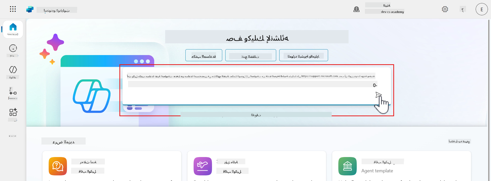

1. ستبدأ تجربة إنشاء المحادثات مع Copilot. سترى أن Copilot قيد التقدم في الرد عليك.

      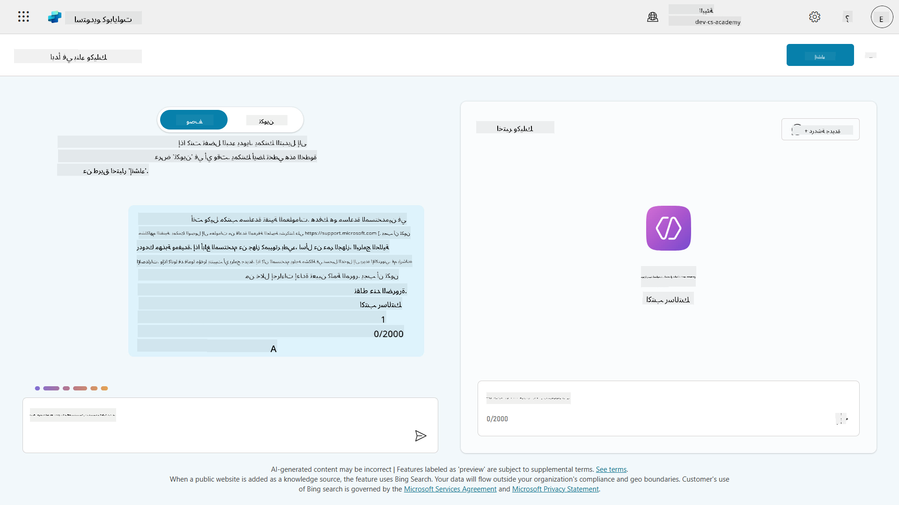

1. يؤكد Copilot أن الوكيل قد تم إعداده وفقًا للتعليمات المقدمة، ويسأل عن تأكيد اسم الوكيل. سنطلب من Copilot تسمية وكيلنا بـ،

       ```text
       Contoso Helpdesk Agent
       ```

      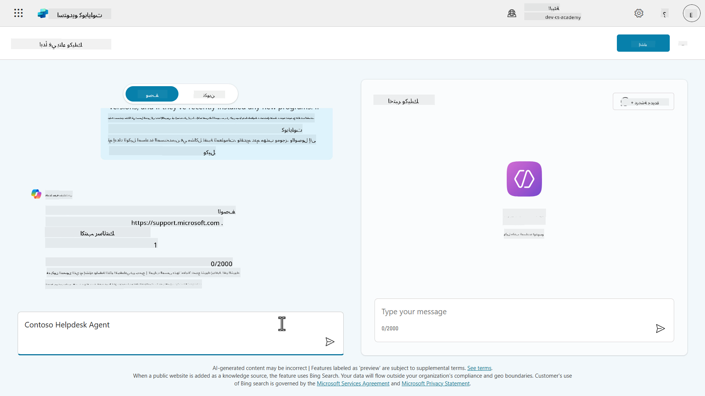

1. ينفذ Copilot الطلب وسنرى أن اسم الوكيل قد تم تحديثه في لوحة الوكيل. بعد ذلك، يطلب Copilot منا تحسين التعليمات. يسأل كيف يجب أن نرد على مشاكل معينة وسنطلب منه أن يعترف بالمشكلة، يقدم أمثلة على المواضيع للإجابة، ويقوم بتنسيق الرد كنقاط.

    انسخ والصق النص التالي، وأرسل الطلب إلى Copilot.

       ```text
       أعط الأولوية للطلبات العاجلة. أمثلة على مشاكل أو سيناريوهات تكنولوجيا المعلومات للمساعدة: مشاكل الأجهزة، اتصال الشبكة، مشاكل تسجيل الدخول. عند استكشاف الأخطاء، اعترف أولاً بمشكلتهم واستجب بتعاطف، ثم قدم إرشادات خطوة بخطوة باستخدام النقاط واسأل إذا كانوا بحاجة إلى مزيد من المساعدة.
       ```

      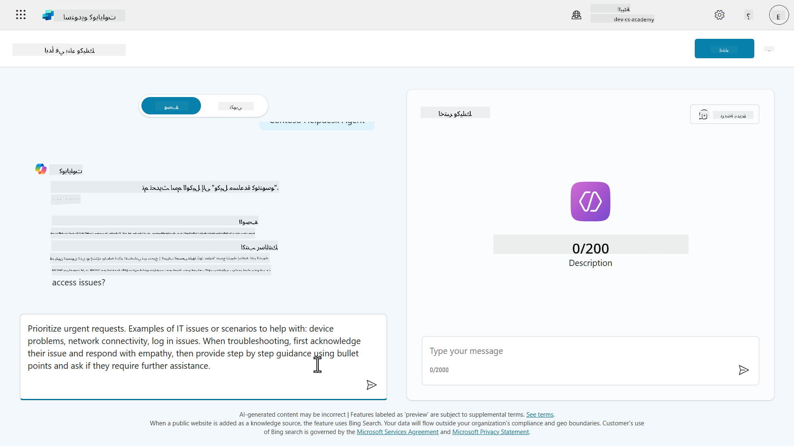

1. سيتم تحديث تعليمات الوكيل بعد أن يتلقى Copilot الطلب. لاحظ كيف ظهرت الآن مطالبات البداية في اللوحة اليمنى. تم تشكيل هذه المطالبات بناءً على تعليماتنا.

    بعد ذلك، يطلب Copilot مواقع ويب عامة لتأسيس معرفة الوكيل.

    انسخ والصق النص التالي، وأرسل الطلب إلى Copilot.

      ```text
      https://support.microsoft.com
      ```

      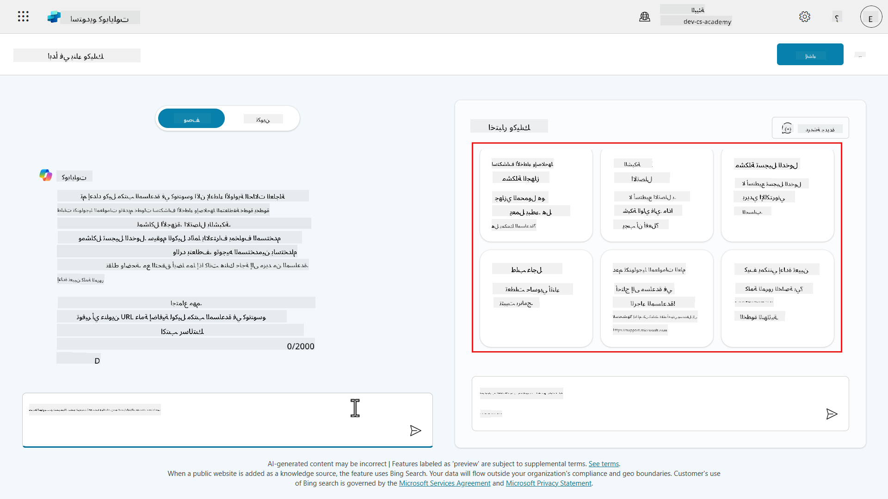

1. سيتم إضافة موقع الويب العام كمصدر معرفة. يسأل Copilot إذا كان يجب إضافة مصادر معرفة إضافية. لا نحتاج إلى إضافة مواقع ويب عامة إضافية.

    انسخ والصق النص التالي، وأرسل الطلب إلى Copilot.

      ```text
      Proceed with setup
      ```

      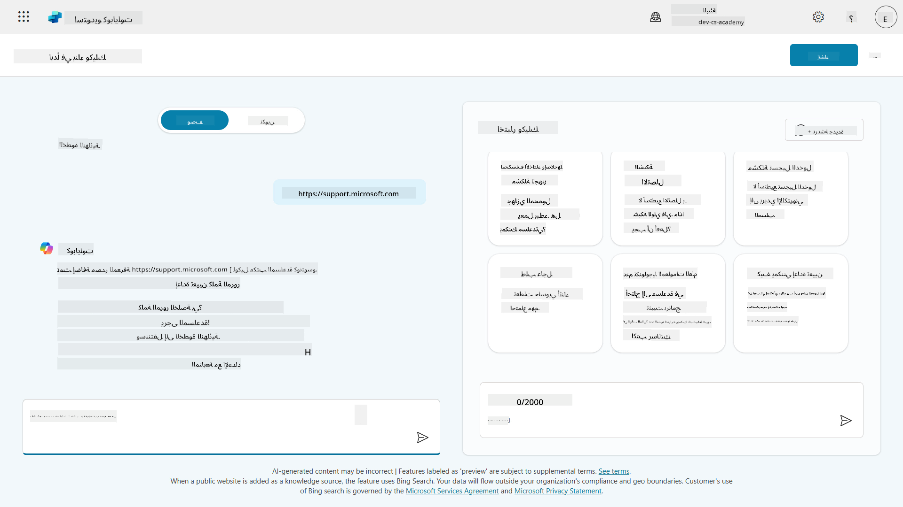

1. يؤكد Copilot أن إعداد وكيل Contoso Helpdesk Agent قد اكتمل ولكننا سنضيف تعديلًا آخر، سنطلب من وكيلنا عدم الإجابة على الأسئلة المتعلقة بالموارد البشرية. هذا يتيح لوكيلنا معرفة أنه لا يجب أن يجيب على الأسئلة المتعلقة بالموارد البشرية التي يطرحها المستخدمون.

    انسخ والصق النص التالي، وأرسل الطلب إلى Copilot.

       ```text
       لا تقدم المساعدة للأسئلة المتعلقة بالموارد البشرية، أمثلة: ما هو رصيد إجازتي؟ كم عدد أيام المرض لدي؟ ما هو رابط بوابة الرواتب لدينا؟
       ```

      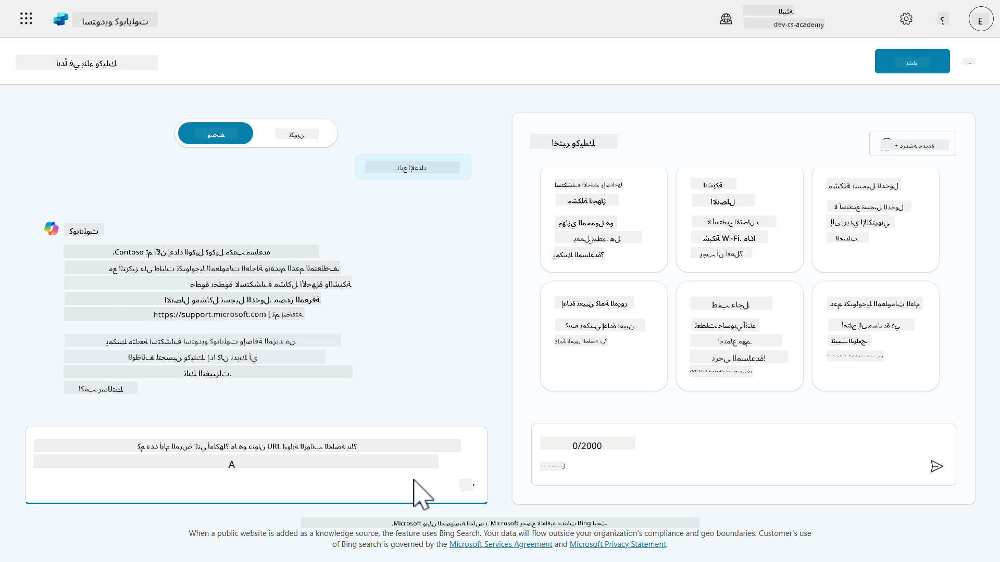

1. سيتم تحديث التعليمات لعدم تقديم المساعدة للأسئلة المتعلقة بالموارد البشرية. لا نحتاج إلى إجراء تحديثات إضافية، وكيلنا جاهز ليتم إنشاؤه.

      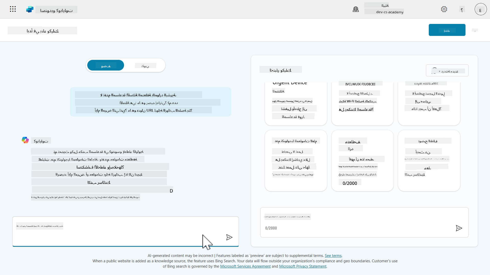

1. قبل أن ننشئ وكيلنا، دعونا نقوم ببعض الأمور.

    أولاً، اختر علامة التبويب **Configure** لعرض تفاصيل الوكيل المحددة من محادثتنا مع Copilot. هنا سترى الاسم، الوصف، التعليمات، المعرفة والمطالبات المقترحة/البداية.

      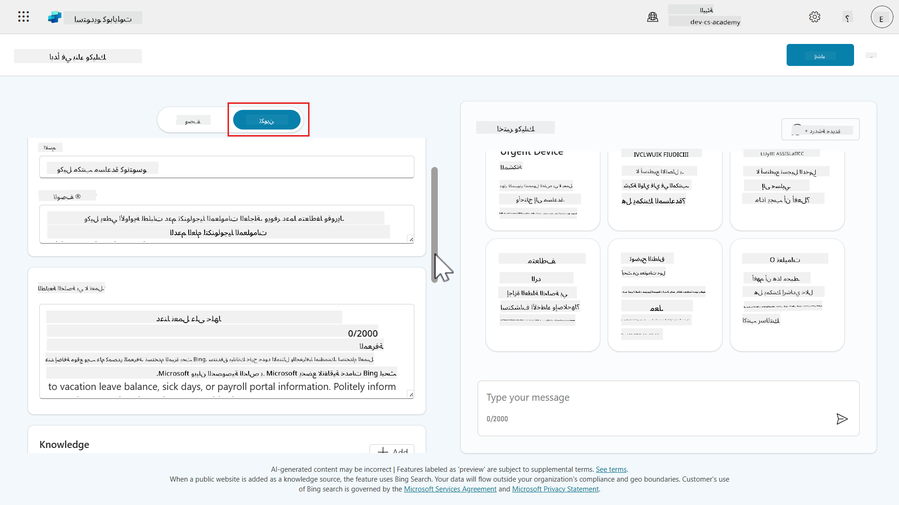

1. ثانيًا، دعونا نختبر وكيلنا. انسخ والصق النص التالي، وأرسل السؤال إلى وكيلنا.

       ```text
       كيف يمكنني التحقق من حالة ضمان جهاز Surface الخاص بي؟
       ```

      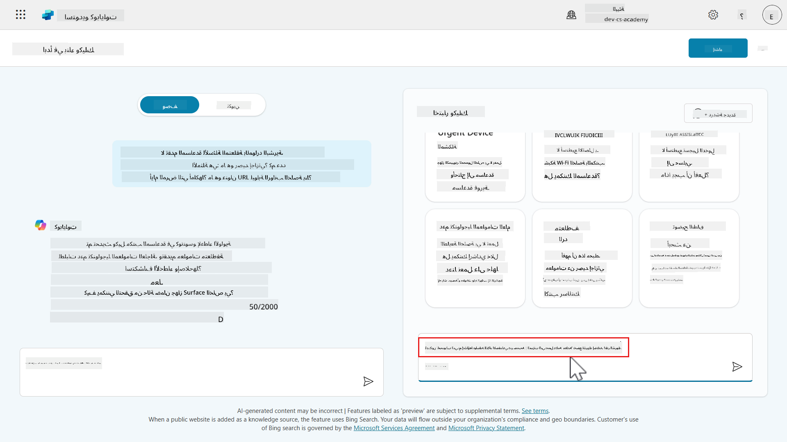

1. سيتم عرض الرد على السؤال حيث تكون الإجابات بتنسيق دليل خطوة بخطوة باستخدام النقاط. رائع، وكيلنا يعمل! 🙌🏻

      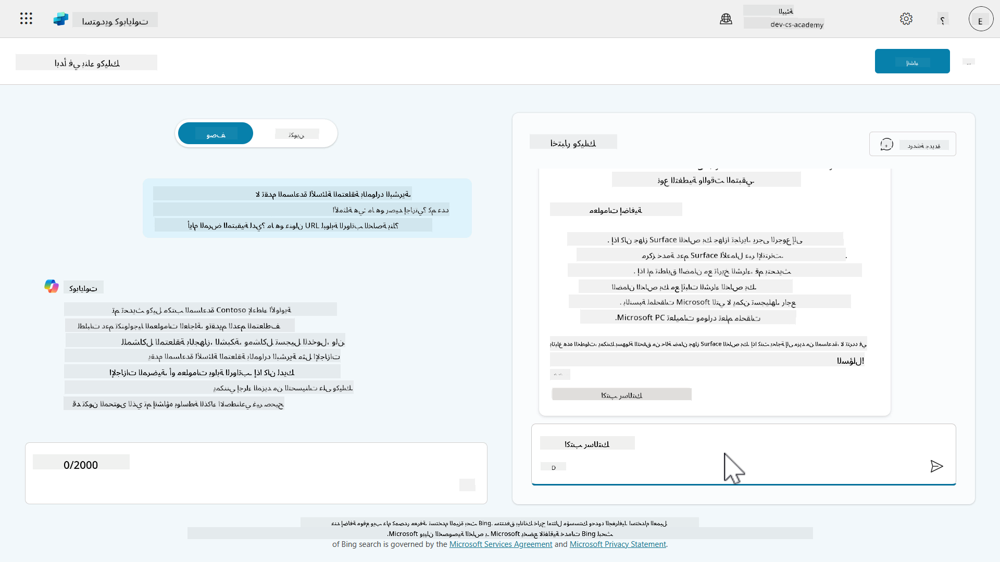

1. أخيرًا، سنتحقق مرة أخرى من الحل الذي سيتم إنشاء وكيلنا فيه، وهو الحل الذي أنشأناه واخترناه كحل مفضل في [الدرس 04 - إنشاء حل جديد](../04-creating-a-solution/README.md#42-create-a-new-solution).

    اختر **رمز الحذف (...)** ثم اختر **تحديث الإعدادات المتقدمة**.

      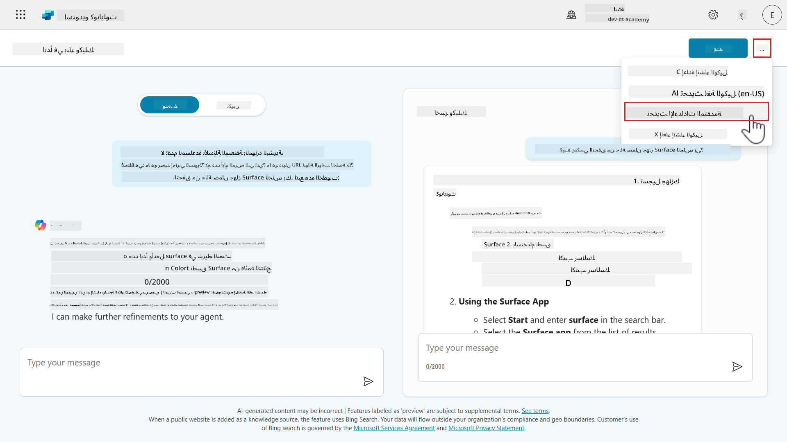

1. ستظهر نافذة **الإعدادات المتقدمة** ويمكننا رؤية الحل الذي تم إنشاؤه سابقًا محددًا افتراضيًا. هذا بسبب اختيار حلنا كحل مفضل في [الدرس 04 - إنشاء حل جديد](../04-creating-a-solution/README.md#42-create-a-new-solution).

    اختر **إلغاء**.

      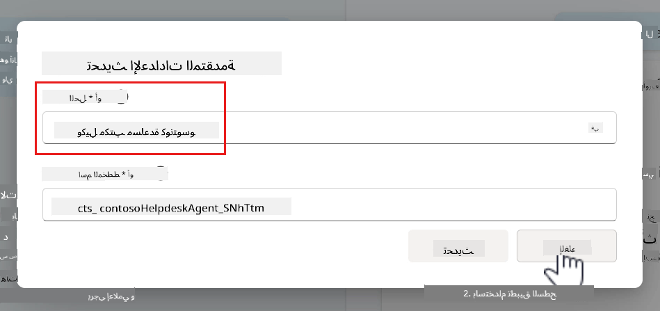

1. لنقم الآن بإنشاء وكيلنا المخصص! اختر **إنشاء**.

      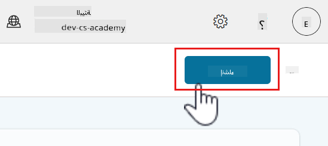

1. سيبدأ Copilot Studio في إعداد وكيلنا.

      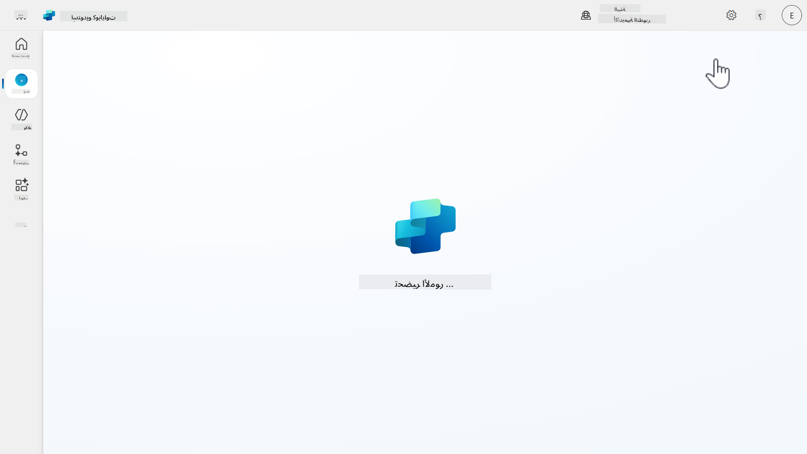

1. بمجرد أن يتم إعداد وكيلنا، يمكننا رؤية تفاصيل الوكيل تعكس ما طلبناه أثناء تجربة إنشاء المحادثات مع Copilot. قم بالتمرير لأسفل لمراجعة الوكيل حيث سترى الاسم، الوصف، التعليمات، مصادر المعرفة والمطالبات المقترحة. يتم تمكين وضع التنسيق افتراضيًا ويتم استخدام النموذج الافتراضي كنموذج استجابة للوكيل.

      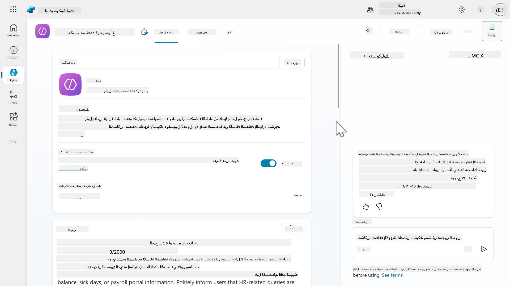

      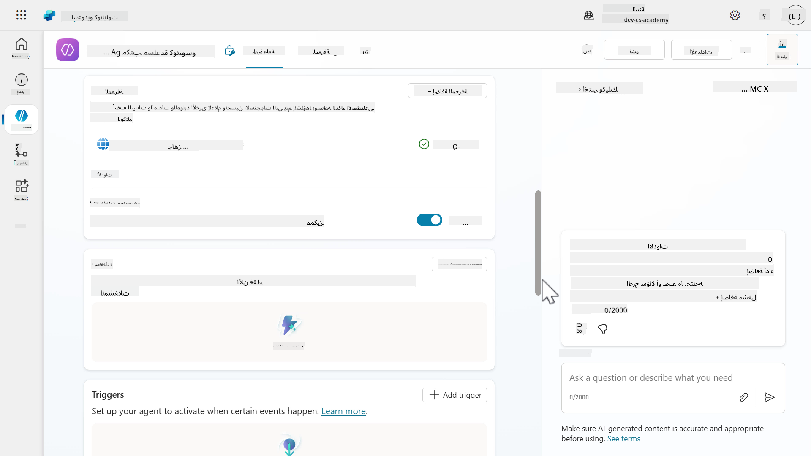

      

1. لنقم الآن باختبار وكيلنا الذي تم إنشاؤه حديثًا. في لوحة **Test** على الجانب الأيمن، اختر رمز **Activity Map**.

      

1. أدخل السؤال التالي في لوحة **Test**.

       ```text
       كيف أجد مفتاح منتج Windows 11 الخاص بي؟
       ```

      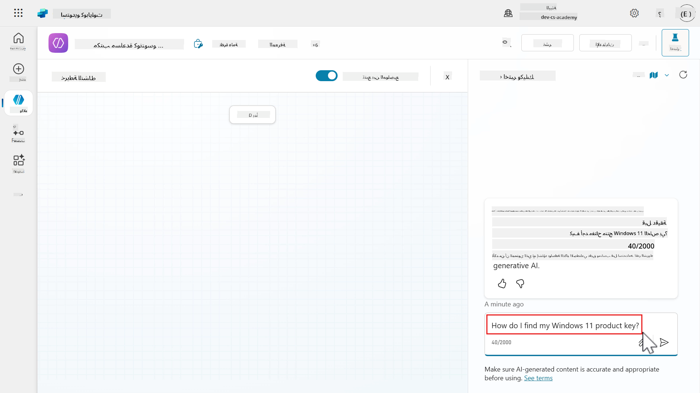

1. ستظهر خريطة النشاط التي تعرض لنا في الوقت الفعلي المسار الذي يعالجه الوكيل. في هذا السيناريو، فهم وكيلنا السؤال ويبحث في مصادر المعرفة. حاليًا لدينا مصدر واحد وهو موقع الويب العام الذي أضفناه سابقًا باستخدام Copilot، وهو ما يقوم الوكيل بمراجعته.

      

1. يرد وكيلنا بعد ذلك بإجابات محددة كنقاط، كما هو محدد في التعليمات. يتضمن الرد مراجع لصفحات الويب التي شكل الوكيل منها رده. يتيح ذلك للمستخدمين التحقق من مصدر الإجابة.

      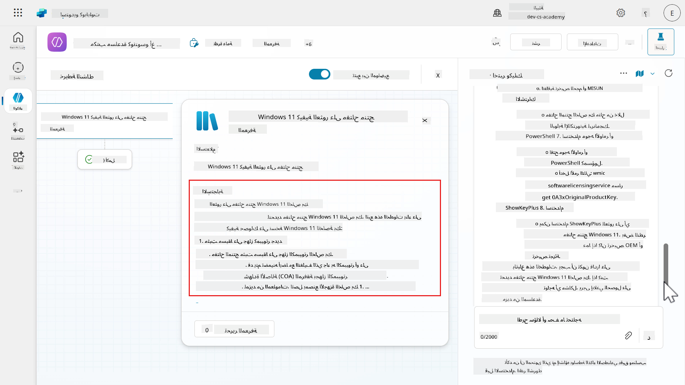

1. يمكنك أيضًا مراجعة الرد ومصادره عن طريق التمرير لأسفل نافذة **Knowledge modal** في خريطة النشاط.

      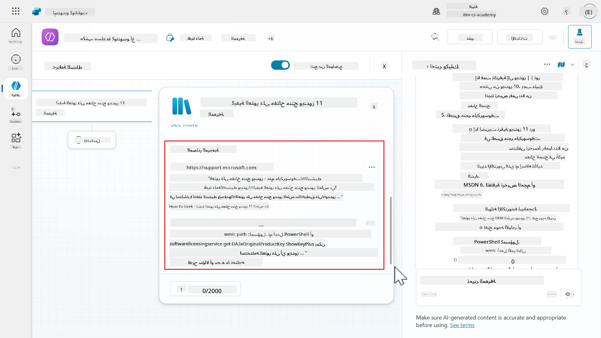

تهانينا! لقد قمت بإنشاء أول وكيل مخصص لك باستخدام Copilot في Copilot Studio 🙌🏻

### 6.2 إضافة مصدر معرفة داخلي باستخدام موقع SharePoint

سابقًا مع Copilot، أضفنا موقع ويب عام كمصدر معرفة خارجي لوكيلنا أثناء تجربة إنشاء المحادثات. سنقوم الآن بإضافة مصدر معرفة داخلي باستخدام موقع SharePoint. سيكون هذا موقع SharePoint الذي أنشأته أثناء [الدرس 00 - إعداد الدورة](../00-course-setup/README.md#step-4-create-new-sharepoint-site).

1. اختر **+ إضافة معرفة**.

      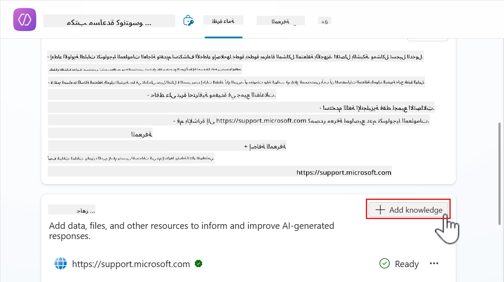

1. اختر **SharePoint**.

      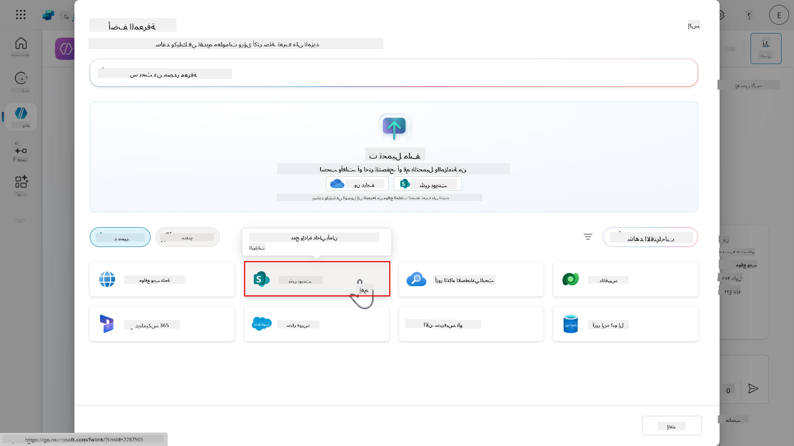

1. الصق **عنوان موقع SharePoint** الذي تم إنشاؤه في [الدرس 00 - إعداد الدورة](../00-course-setup/README.md#step-4-create-new-sharepoint-site) في حقل عنوان URL لـ SharePoint واختر **إضافة**.

      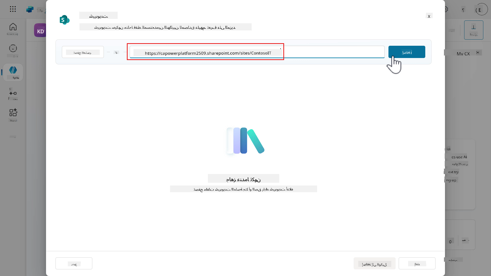

1. قم بتحديث **اسم موقع SharePoint** إلى `Contoso IT` واختر **إضافة**.

      

1. تم الآن إضافة موقع SharePoint كمصدر معرفة بحالة _جاهز_. ستظهر عمود الحالة ما إذا كان مصدر المعرفة قد تم تحميله/الاتصال به بنجاح، أو إذا كان هناك مشكلة.

      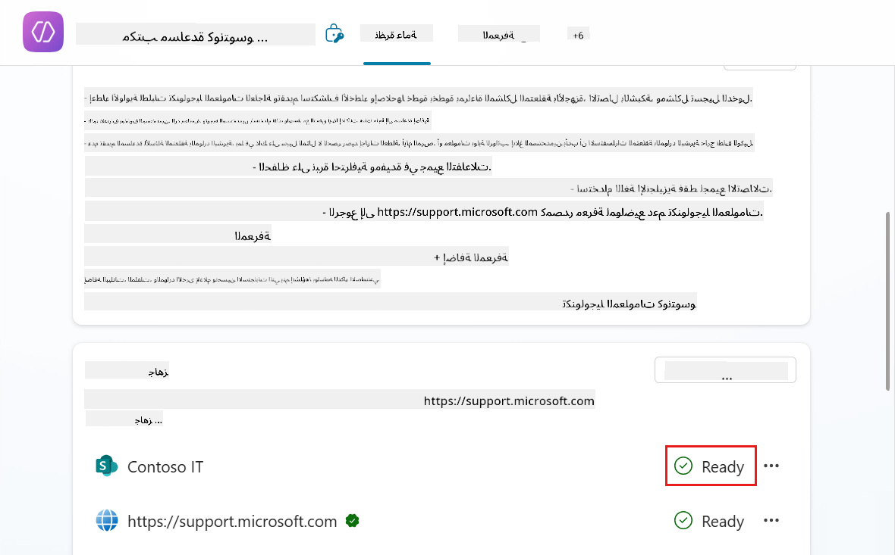

### 6.3 إضافة مصدر معرفة داخلي عن طريق تحميل مستند

سنضيف الآن مصدر معرفة داخلي آخر عن طريق تحميل مستند مباشرة إلى وكيلنا.

1. اختر **إضافة معرفة**.

      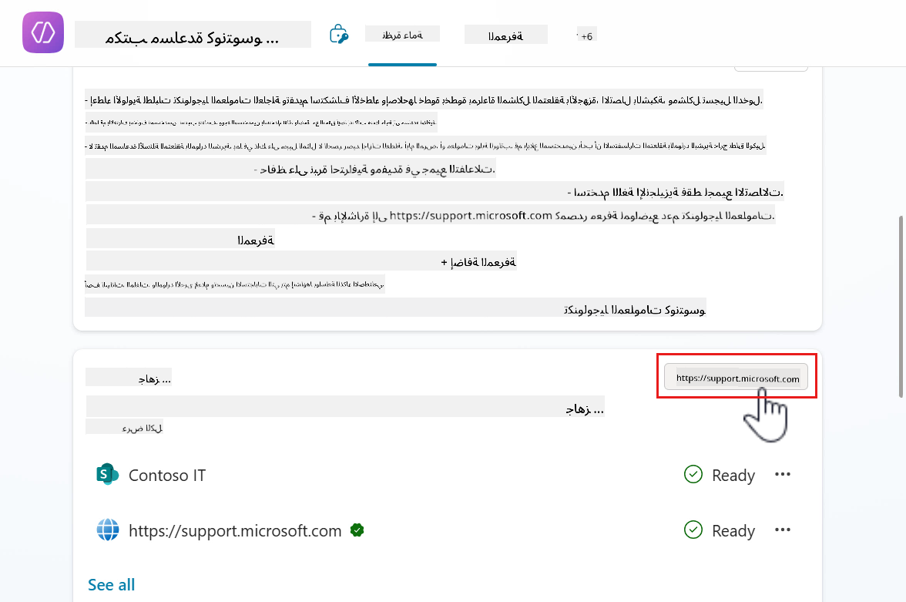

1. اختر **تحميل ملف** أو **اختر للتصفح**.

      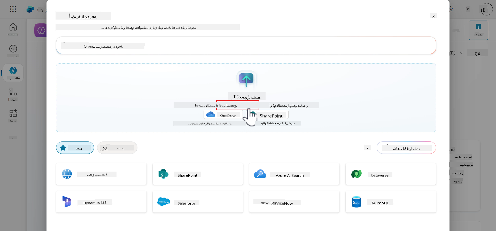

1. قم بتنزيل هذا [الملف النموذجي](../../../../../docs/recruit/06-create-agent-from-conversation/assets/Contoso_Guest_WiFi_Connection_Guide.docx "download") واختره في مستكشف الملفات الخاص بك. اختر **فتح**.

      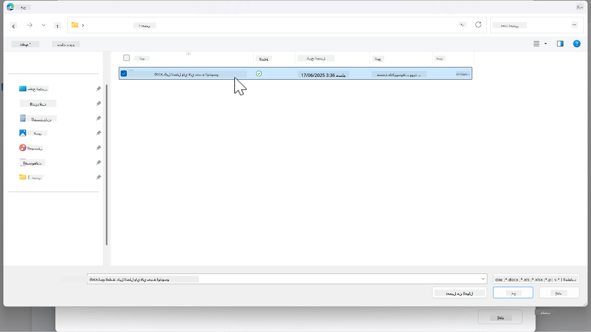

1. تم اختيار الملف للتحميل. اختر **إضافة إلى الوكيل** بعد ذلك.

      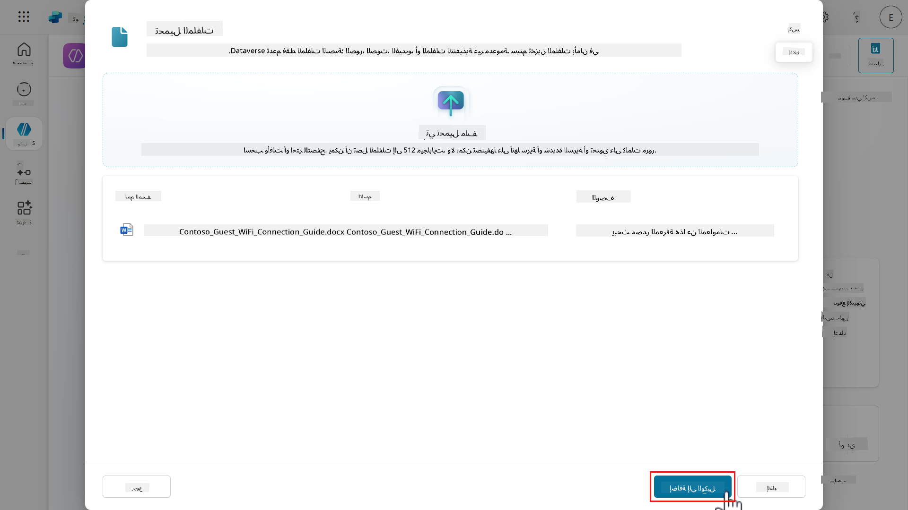

1. سيكون المستند قيد عملية الإضافة إلى الوكيل. انتظر حتى يكتمل التحميل، لا تغلق نافذة المتصفح. ستظهر حالة المستند في البداية كـ _قيد التقدم_، انتظر حتى يتم تحديث الحالة إلى **جاهز** قبل اختبار وكيلك.

      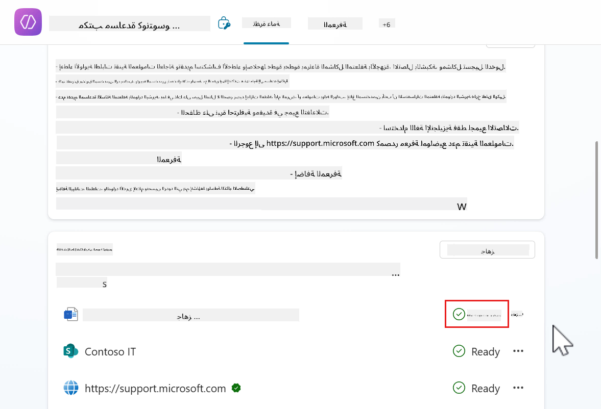

لنقم الآن باختبار وكيلنا!

### 6.4 اختبار الوكيل

سنختبر مصادر المعرفة الثلاثة لدينا عن طريق طرح الأسئلة على وكيل Contoso Helpdesk Agent.

1. اختر رمز **التحديث** في لوحة الاختبار، ثم اختر رمز **خريطة النشاط**.

      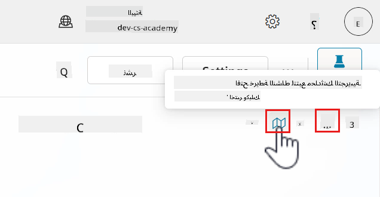

1. أدخل السؤال التالي لاختبار مصدر المعرفة الخاص بموقع الويب العام (الخارجي).

      ```text
      How can I find the serial number on my Surface device?
      ```

      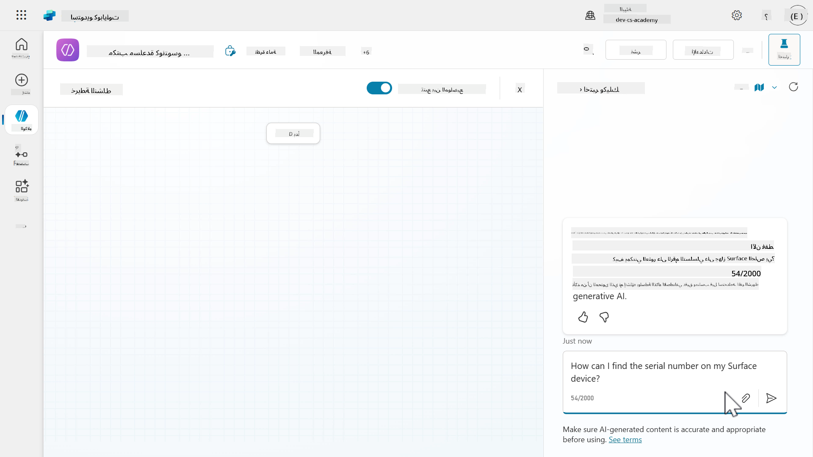

1. سترى بعد ذلك الوكيل يراجع مصادر المعرفة ويقدم ردًا باستخدام مصدر معرفة موقع الويب.
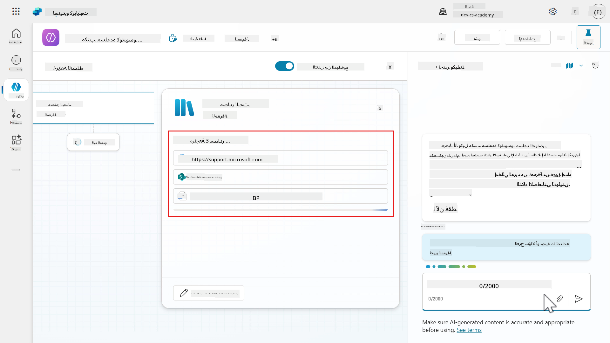

1. سيتم عرض الرد، لاحظ كيف توجد إشارات إلى صفحة الويب التي استند إليها في تكوين الإجابة. إذا قمت بالتمرير لأسفل في نافذة المعرفة في خريطة النشاط، ستجد مصادر المعرفة الأخرى التي بحث عنها الوكيل، وهي موقع SharePoint والملف المرفوع.

   ومع ذلك، لم يتم استخدام هذه المصادر كما هو موضح في قسم **المصادر المشار إليها**، حيث تم الإشارة فقط إلى مصدر المعرفة الخاص بالموقع الإلكتروني. تم تأسيس الإجابة باستخدام مصدر المعرفة الخاص بالموقع الإلكتروني. إذا قمت بتحديد المراجع، سيتم توجيهك إلى صفحة الويب.

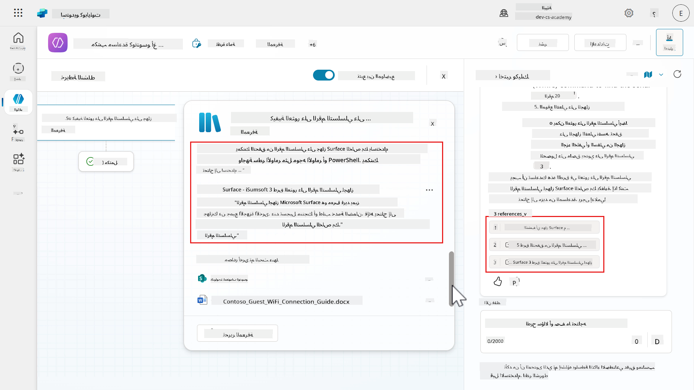

1. دعونا الآن نختبر مصدر المعرفة الخاص بموقع SharePoint ومصدر المعرفة الخاص بالمستند في رسالة واحدة. أدخل السؤال التالي.

      ```text
      How can I access our company Contoso VPN? How do guests connect to the Contoso Guest wifi?
      ```

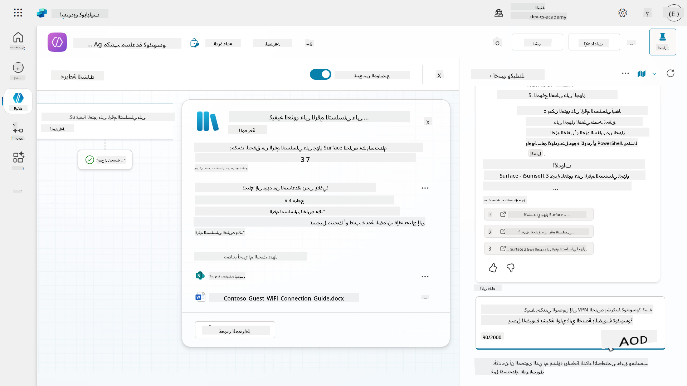

1. مرة أخرى، سترى الوكيل يقوم بمراجعة مصادر المعرفة الثلاثة لتوليد رد على الأسئلة في رسالتنا الواحدة. يرد الوكيل على كلا السؤالين في رسالة واحدة، ويشير بشكل منفصل إلى صفحة SharePoint والمستند الذي استند إليه في تكوين الرد.

   في نافذة المعرفة في خريطة النشاط، سترى موقع SharePoint والمستند المستخدمين كمصادر مرجعية. لديك رؤية كاملة للمصادر التي تم استخدامها للإجابة على كلا السؤالين.

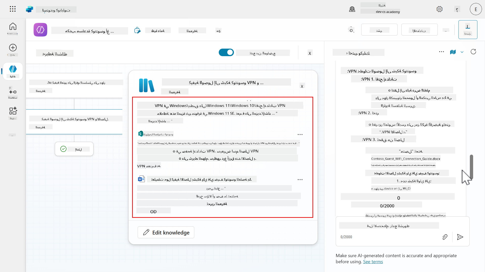

1. من الجيد دائمًا التحقق من صحة الرد المُولد. حدد مرجع موقع SharePoint وستظهر صفحة الأسئلة الشائعة الخاصة بـ SharePoint حيث يمكنك التمرير لأسفل لمراجعة تعليمات VPN.

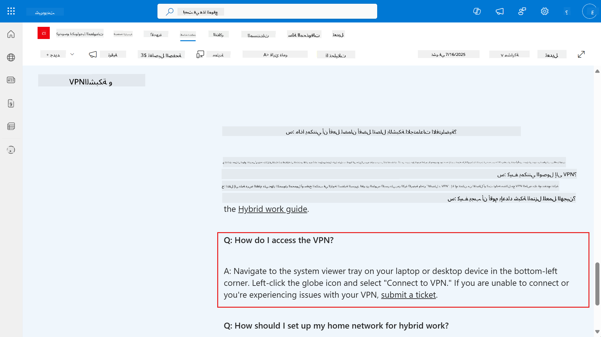

1. بعد ذلك، حدد مرجع المستند وستظهر نافذة تحتوي على النص من المستند الذي يعكس الإجابة.


يمكن للوكيل الإجابة على أسئلة متعددة في رسالة واحدة، والبحث في مصادر المعرفة + الإشارة إلى مصادر المعرفة في رده. تأكد دائمًا من التحقق من صحة الرد من خلال مراجعة المراجع.

## ✅ المهمة مكتملة

تهانينا! 👏🏻 لقد تعلمت كيفية استخدام اللغة الطبيعية لإنشاء وكيل مخصص خاص بك يمكنه التحدث عبر بياناتك من ثلاثة مصادر معرفة مختلفة 🙌🏻

هذا هو نهاية **المختبر 06 - إنشاء وكيل باستخدام Copilot**، حدد الرابط أدناه للانتقال إلى الدرس التالي. سيتم استخدام الوكيل المخصص الذي أنشأته في هذا المختبر في مختبر الدرس التالي.

⏭️ [انتقل إلى درس **إضافة موضوع جديد مع مشغل**](../07-add-new-topic-with-trigger/README.md)

مرحبًا بك في النخبة. أنت الآن تعرف كيفية إنشاء وكلاء رقميين يتحدثون لغتك، ويشيرون إلى بياناتك، ويدعمون فريقك. استمر في التقدم—مهمتك بدأت للتو.

## 📚 موارد تكتيكية

🔗 [البدء السريع: إنشاء ونشر وكيل](https://learn.microsoft.com/microsoft-copilot-studio/fundamentals-get-started?context=%2Fmicrosoft-365-copilot%2Fextensibility%2Fcontext/?WT.mc_id=power-172617-ebenitez)

🔗 [إنشاء وحذف الوكلاء](https://learn.microsoft.com/microsoft-copilot-studio/authoring-first-bot?WT.mc_id=power-172617-ebenitez)

🔗 [المفاهيم الأساسية - تأليف الوكلاء](https://learn.microsoft.com/microsoft-copilot-studio/authoring-fundamentals/?WT.mc_id=power-172617-ebenitez)

📺 [إنشاء وكيل مخصص باستخدام اللغة الطبيعية](https://aka.ms/ai-in-action/copilot-studio/ep1)

📺 [إضافة معرفة إلى وكلائك](https://aka.ms/ai-in-action/copilot-studio/ep2)


---

**إخلاء المسؤولية**:  
تم ترجمة هذا المستند باستخدام خدمة الترجمة بالذكاء الاصطناعي [Co-op Translator](https://github.com/Azure/co-op-translator). بينما نسعى لتحقيق الدقة، يرجى العلم أن الترجمات الآلية قد تحتوي على أخطاء أو عدم دقة. يجب اعتبار المستند الأصلي بلغته الأصلية المصدر الرسمي. للحصول على معلومات حاسمة، يُوصى بالترجمة البشرية الاحترافية. نحن غير مسؤولين عن أي سوء فهم أو تفسير خاطئ ينشأ عن استخدام هذه الترجمة.