<!--
CO_OP_TRANSLATOR_METADATA:
{
  "original_hash": "dcbcd9396b076da0a0f5d389e9ec1b12",
  "translation_date": "2025-10-22T19:44:58+00:00",
  "source_file": "docs/recruit/08-add-adaptive-card/README.md",
  "language_code": "ar"
}
-->
# 🚨 المهمة 08: تحسين تفاعلات المستخدم في المواضيع باستخدام بطاقات تكيفية

## 🕵️‍♂️ الاسم الرمزي: `عملية تحسين الواجهة`

> **⏱️ نافذة زمن العملية:** `~45 دقيقة`

🎥 **شاهد الفيديو التوضيحي**

[](https://www.youtube.com/watch?v=RhIlzYHPCXo "شاهد الفيديو التوضيحي على YouTube")

## 🎯 ملخص المهمة

أيها العملاء، مهمتكم هي التسلل إلى تجربة المستخدم الثابتة واستبدالها ببطاقات تكيفية غنية وديناميكية وقابلة للتفاعل. ستقومون بنشر حزم JSON وصيغ Power Fx لتحويل محادثات Copilot Studio من أسئلة وأجوبة بسيطة إلى تفاعلات كاملة. هدفكم هو جمع مدخلات المستخدم، عرض البيانات بشكل جميل، وتوجيه المحادثات بدقة وأناقة. إذا فشلتم في التكيف، قد يتجه المستخدمون إلى واجهات أقل ذكاءً.

## 🔎 الأهداف

في هذه المهمة، ستتعلمون:

1. فهم ماهية البطاقات التكيفية وكيف تعزز تفاعلات المستخدم في Copilot Studio
1. تعلم بناء بطاقات تفاعلية باستخدام JSON وصيغ Power Fx للمحتوى الديناميكي
1. استكشاف مصمم البطاقات التكيفية ومكوناته الرئيسية لإنشاء بطاقات بصرية
1. إنشاء نماذج غنية وتفاعلية وتجارب جمع البيانات داخل مواضيع العملاء
1. تنفيذ أفضل الممارسات لتصميم بطاقات تكيفية مستجيبة وسهلة الاستخدام

## 🤔 ما هي البطاقة التكيفية؟

**البطاقة التكيفية** هي طريقة لإنشاء عناصر واجهة مستخدم تفاعلية وغنية بصريًا يمكن تضمينها في تطبيقات مثل Microsoft Teams وMicrosoft Outlook أو العملاء. إنها كائن JSON منظم يحدد تخطيط ومحتوى البطاقة:

- العناصر التي تظهر على البطاقة - النصوص، الصور، الأزرار
- كيفية ترتيب هذه العناصر
- الإجراءات التي يمكن للمستخدمين اتخاذها مثل إرسال نموذج أو فتح رابط

    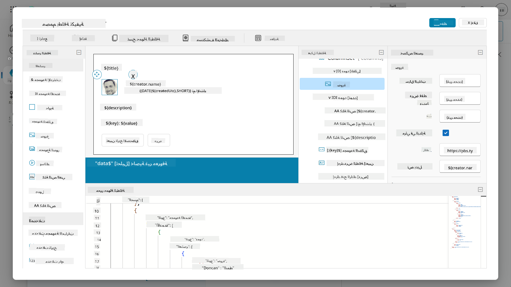

### لماذا تهم البطاقات التكيفية في Copilot Studio؟

تخيل أنك تبني عميلًا يطلب من المستخدمين اسمهم أو بريدهم الإلكتروني أو ملاحظاتهم. إذا استخدمت نصًا عاديًا فقط، قد تبدو المحادثة مملة أو صعبة المتابعة. هنا تأتي أهمية البطاقات التكيفية!

1. **تجعل المحادثات تفاعلية** - بدلاً من إرسال النصوص كرسائل للمستخدم، يمكنك عرض أزرار، نماذج، صور والمزيد.
    - مثال: يمكن للبطاقة أن تطلب من المستخدم ملء اسمه وبريده الإلكتروني في نموذج نظيف.

1. **تبدو رائعة في كل مكان** - تتكيف البطاقات التكيفية تلقائيًا مع نمط التطبيق الذي توجد فيه، مثل دردشة Microsoft 365 Copilot أو Microsoft Teams. لا تحتاج للقلق بشأن الوضع الليلي، الخطوط، أو التخطيطات - فهي تتكيف.

1. **سهلة البناء باستخدام JSON** - تقوم بتعريف البطاقة باستخدام كود JSON (فكر في الأمر كأنه _وصفة_ للواجهة). يساعدك Copilot Studio في معاينة بطاقتك قبل إضافتها إلى الموضوع.

1. **جمع واستخدام البيانات** - يمكنك استخدام البطاقة لطرح الأسئلة، جمع الإجابات، واستخدام تلك البيانات في تدفق المحادثة.
    - مثال: طلب رقم هاتف المستخدم، ثم عرض بطاقة تأكيد برقم هاتفه.

1. **تعزيز تجربة المستخدم** - تجعل البطاقات العميل يبدو أكثر تفاعلية. إنها نوع من الواجهة النظيفة والقابلة للنقر وسهلة الاستخدام.

## 🐱 هل _JSON_ شخص؟

يُلفظ "جيسون"، لكنه ليس شخصًا 😅

JSON، المعروف أيضًا باسم _JavaScript Object Notation_، هو تنسيق خفيف يستخدم لتنظيم البيانات. إنه سهل القراءة والكتابة، ويبدو كسلسلة من أزواج المفتاح والقيمة داخل أقواس {}.

هذا أحد الخيارات التي يمكن استخدامها عند إضافة بطاقة تكيفية إلى موضوعك.

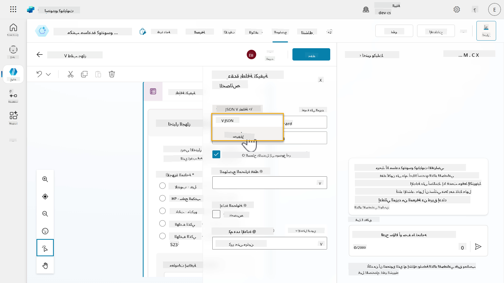

## 👀 أرى خيارًا آخر لبناء بطاقة تكيفية باستخدام _الصيغ_

تذكر كيف تعلمنا عن Power Fx في [المهمة 07 - استخدام Power Fx في العقد الخاصة بك](../07-add-new-topic-with-trigger/README.md#what-power-fx-can-do-in-topics) يمكن تطبيق نفس الشيء في البطاقات التكيفية داخل Copilot Studio.

كمراجعة،

!!! note
    Power Fx هي لغة برمجة منخفضة الكود تُستخدم لإضافة منطق وسلوك ديناميكي إلى العميل الخاص بك. إنها نفس اللغة المستخدمة في Microsoft Power Apps، وهي مصممة لتكون بسيطة وشبيهة بـ Excel، مما يجعلها سهلة للمطورين وغير المطورين.

### كيف تعمل Power Fx في البطاقات التكيفية

عند تصميم بطاقة تكيفية في Copilot Studio، يمكنك استخدام صيغ Power Fx لـ:

- إدراج قيم ديناميكية مثل أسماء المستخدمين، التواريخ أو الحالة.
- تنسيق النصوص أو الأرقام مثل عرض العملات أو تقريب الأرقام.
- عرض أو إخفاء العناصر بناءً على الشروط.
- تخصيص الردود بناءً على مدخلات المستخدم، المتغيرات، المخرجات من عقد المحادثة.

على سبيل المثال،

"`مرحبًا`" & `System.User.DisplayName`

تجمع هذه الصيغة كلمة "مرحبًا" مع اسم المستخدم ديناميكيًا.

### لماذا هو مفيد

1. **التخصيص**

    يمكنك تخصيص الرسالة لكل مستخدم، مما يجعل التفاعلات تبدو أكثر طبيعية وملاءمة.

1. **المحتوى الديناميكي**

    يمكن للبطاقات عرض بيانات حقيقية من المتغيرات والمخرجات من عقد المحادثة.

1. **المنطق الذكي**

    يمكنك التحكم في ما يراه المستخدمون أو يتفاعلون معه بناءً على الشروط، مما يحسن سهولة الاستخدام ويقلل الأخطاء.

1. **صديق للكود المنخفض**

    Power Fx هي لغة برمجة منخفضة الكود. كما ذكرنا سابقًا، إنها قابلة للقراءة، بديهية ومشابهة لصيغ Excel.

## 👷🏻‍♀️ البناء باستخدام مصمم البطاقات التكيفية

**مصمم البطاقات التكيفية** هو أداة بصرية تتيح لك بناء بطاقات رسائل تفاعلية باستخدام عناصر السحب والإفلات مثل النصوص، الصور، الأزرار، والمدخلات. الغرض منها هو مساعدتك في إنشاء رسائل غنية وديناميكية دون كتابة كود معقد، مما يجعل من السهل تصميم واجهات سهلة الاستخدام.

تساعدك أداة المصمم في بناء البطاقة بصريًا، ولكن خلف الكواليس، تقوم بإنشاء كائن JSON لك. يمكنك أيضًا التبديل إلى _الصيغ_ التي تمكن استخدام تعبيرات Power Fx في البطاقة لعرض البيانات من أماكن أخرى.

## 🎨 فهم مصمم البطاقات التكيفية

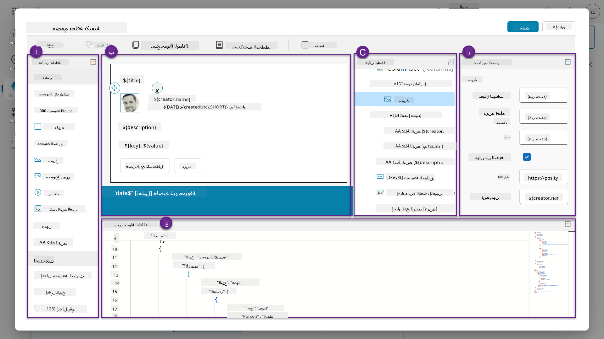

### أ) عناصر البطاقة

هذه هي اللبنات الأساسية لبطاقتك التكيفية. يمكنك سحب وإفلات العناصر مثل:

- **TextBlock** لعرض النصوص.
- **Image** لعرض الصور.
- **FactSet** لأزواج المفتاح والقيمة.
- **حقول الإدخال** لعرض مربعات النصوص، منتقي التواريخ، التبديلات.
- **الإجراءات** لعرض الأزرار مثل _إرسال_، _فتح رابط_، أو _عرض بطاقة_.

لكل عنصر غرضه الخاص ويمكن تنسيقه أو تكوينه.

### ب) عارض البطاقة

هذه هي منطقة **المعاينة** حيث ترى كيف ستبدو بطاقتك في الوقت الفعلي. أثناء إضافة أو تعديل العناصر، يتم تحديث العارض فورًا ليعكس التغييرات. يتيح لك ذلك إجراء تحديثات متكررة ورؤية نتيجة التصميم في نفس الوقت.

### ج) هيكل البطاقة

يعرض هذا **التسلسل الهرمي والتخطيط** لبطاقتك. على سبيل المثال:

- قد تبدأ البطاقة بـ **TextBlock** كعنوان.
- ثم **ColumnSet** مع صورة على جانب ونص على الجانب الآخر.
- يتبع ذلك **FactSet** وبعض **أزرار الإجراءات**.

يساعدك ذلك على فهم كيفية تنظيم العناصر وتداخلها.

### د) خصائص العنصر

عندما تنقر على أي عنصر في البطاقة، يتيح لك هذا اللوحة **تخصيص إعداداته**:

- تغيير حجم النص، وزنه، أو لونه.
- تعيين روابط الصور أو النص البديل.
- تكوين خيارات الإدخال مثل نص العنصر النائب أو القيم الافتراضية.

هنا تقوم بضبط كل عنصر بدقة.

### هـ) محرر حمولة البطاقة

هذا هو **كود JSON الخام** خلف بطاقتك. يمكن للمستخدمين المتقدمين تحرير هذا مباشرة لـ:

- استخدام ميزات القوالب.
- نسخ/لصق تعريفات البطاقة.

حتى إذا كنت جديدًا على مصمم البطاقات التكيفية، من المفيد رؤية كيف يترجم التصميم البصري إلى أكواد.

!!! tip "نصيحة - تحقق من عينات البطاقات التكيفية"

    1. تصفح إلى [https://adaptivecards.microsoft.com/designer](https://adaptivecards.microsoft.com/designer).
    2. اختر **بطاقة جديدة** لرؤية قائمة بالعينات التي يمكنك اختيارها وتعديلها.
    3. لاحظ أن هذا المصمم خارجي (مستند إلى الويب). عندما تبني بطاقتك في مصمم البطاقات التكيفية المستند إلى الويب، انسخ JSON من محرر حمولة البطاقة.
    4. الصق JSON في بطاقتك التكيفية في عميلك في Copilot Studio.

    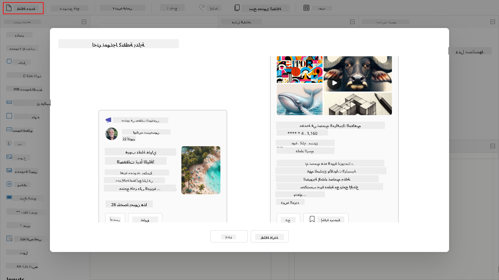

## 🌵 حالات الاستخدام الشائعة

الحالات التالية هي استخدامات شائعة للبطاقات التكيفية في Copilot Studio عند استخدامها في عقدة **إرسال رسالة** أو **طرح سؤال**.

1. **النماذج وجمع البيانات**

    استخدم البطاقات التكيفية لجمع مدخلات منظمة من المستخدمين، مثل:

    - طلبات الإجازة
    - نماذج الملاحظات
    - معلومات الاتصال
    - جدولة المواعيد

1. **عرض المعلومات الديناميكية**

    عرض بيانات مخصصة أو في الوقت الحقيقي للمستخدمين بتنسيق نظيف وقابل للقراءة من مصادر المؤسسات مثل ServiceNow، SAP، Dynamics 365، SharePoint إلخ.

    - ملخصات الطلبات
    - أرصدة الحسابات
    - حالة التذاكر أو الحالات
    - الأحداث أو المواعيد النهائية القادمة

1. **الخيارات التفاعلية**

    دع المستخدمين يختارون مباشرة في المحادثة:

    - اختيار من قائمة الخيارات، مثل فئات المنتجات، مواضيع الدعم.
    - تأكيد أو إلغاء الإجراء.
    - تقييم خدمة أو تجربة.

1. **تنشيط الإجراءات**

    تضمين أزرار تنشط خطوات إضافية في المحادثة داخليًا أو خارجيًا.

    - "إرسال الطلب"
    - "عرض التفاصيل"

## ⭐ أفضل الممارسات

إليك بعض أفضل الممارسات لإنشاء بطاقات تكيفية للعملاء في Copilot Studio.

1. **اجعلها بسيطة ومركزة**

    - صمم البطاقات بهدف واضح، لا تفرط في تحميلها بالكثير من العناصر.
    - استخدم نصوصًا موجزة وتخطيطات بديهية لتوجيه المستخدمين خلال التفاعل.

1. **كن متعمدًا مع المدخلات**

    - قم بتضمين العناصر الضرورية فقط مثل النصوص، خيارات التواريخ، لتجنب إرباك المستخدمين.
    - استخدم تسميات لجعل المدخلات سهلة الفهم.

1. **هيكل للقراءة**

    - استخدم **TextBlocks** للعناوين والتعليمات.
    - قم بتجميع العناصر ذات الصلة باستخدام **Containers** أو **ColumnSets** لتحسين التدفق البصري.

1. **اجعل عناصر الإجراء واضحة**

    - استخدم **Action.Submit** أو **Action.OpenUrl** مع عناوين أزرار واضحة مثل "إرسال الطلب" أو "عرض التفاصيل".
    - تجنب التسميات الغامضة مثل "اضغط هنا".

1. **صمم للتكيف**

    - افترض أن البطاقة قد تُعرض على أحجام شاشات مختلفة.
    - تجنب العرض الثابت واستخدم تخطيطات مرنة مثل **ColumnSets** للاستجابة.

1. **استخدم المحتوى الديناميكي عند الإمكان**

    - اربط عناصر البطاقة بالمتغيرات أو المخرجات من العقد باستخدام Power Fx لتخصيص تجربة المستخدم.
    - على سبيل المثال، عرض اسم المستخدم أو الحالة الحالية ديناميكيًا.

## 🧪 المختبر 08 - إضافة بطاقات تكيفية وتعزيز قدرات الموضوع

سنقوم الآن بتعلم كيفية تحسين موضوعنا باستخدام البطاقات التكيفية واستخدام الوظائف المتقدمة للمواضيع والعقد.

- [8.1 إنشاء موضوع جديد مع بطاقة تكيفية لتمكين المستخدم من تقديم طلبه](../../../../../docs/recruit/08-add-adaptive-card)
- [8.2 تحديث تعليمات العميل لاستدعاء موضوع طلب الجهاز](../../../../../docs/recruit/08-add-adaptive-card)

### ✨ حالة الاستخدام

**بصفتي** موظفًا

**أريد** طلب جهاز

**حتى أتمكن من** طلب جهاز من قائمة الأجهزة المتاحة

لنبدأ!

### المتطلبات الأساسية

1. **قائمة SharePoint**

    سنستخدم قائمة **الأجهزة** في SharePoint من [الدرس 00 - إعداد الدورة - الخطوة 3: إنشاء موقع SharePoint جديد](../00-course-setup/README.md#step-4-create-new-sharepoint-site).

    إذا لم تقم بإعداد قائمة **الأجهزة** في SharePoint، يرجى العودة إلى [الدرس 00 - إعداد الدورة - الخطوة 3: إنشاء موقع SharePoint جديد](../00-course-setup/README.md#step-4-create-new-sharepoint-site).

1. **مساعد Contoso Helpdesk Copilot**

    سنستخدم نفس العميل الذي تم إنشاؤه سابقًا في [الدرس 06 - إنشاء عميل مخصص باستخدام اللغة الطبيعية وربطه ببياناتك](../06-create-agent-from-conversation/README.md).

### 8.1 إنشاء موضوع جديد مع بطاقة تكيفية لتمكين المستخدم من تقديم طلبه

سنقوم بإنشاء موضوع جديد يتعامل مع طلب جهاز المستخدم. سيحتوي هذا الموضوع الجديد على عقدة **اسأل باستخدام بطاقة تكيفية** لتمكين تفاعل المستخدم مع العميل.

لنبدأ!

1. اختر علامة التبويب **المواضيع**، ثم اختر **+ إضافة موضوع من البداية**.

    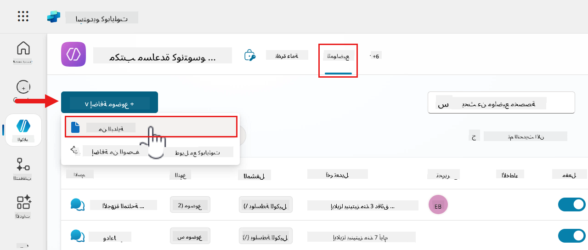

1. قم بتسمية الموضوع كما يلي،

    ```text
    Request device
    ```

    أدخل الوصف التالي للمشغل.

    ```text
    This topic helps users request a device when they answer yes to the question that asks the user if they would like to request one of these devices.
    ```

    
1. بعد ذلك، قم بإضافة عقدة **اسأل باستخدام بطاقة تكيفية**. ستعرض هذه العقدة بطاقة تفاعلية للمستخدم ليختار الجهاز الذي يرغب في طلبه.

    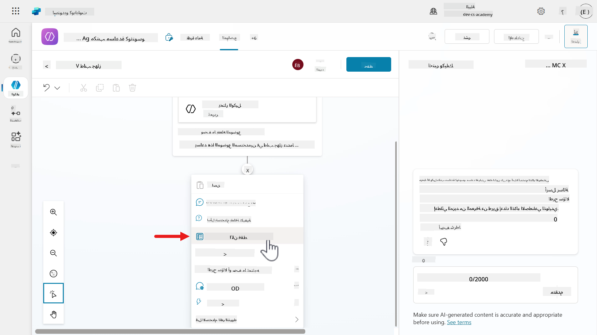

1. اختر العقدة وستظهر لوحة **خصائص عقدة البطاقة التكيفية**. الآن سنقوم بتعديل JSON. اختر **تعديل البطاقة التكيفية**.

    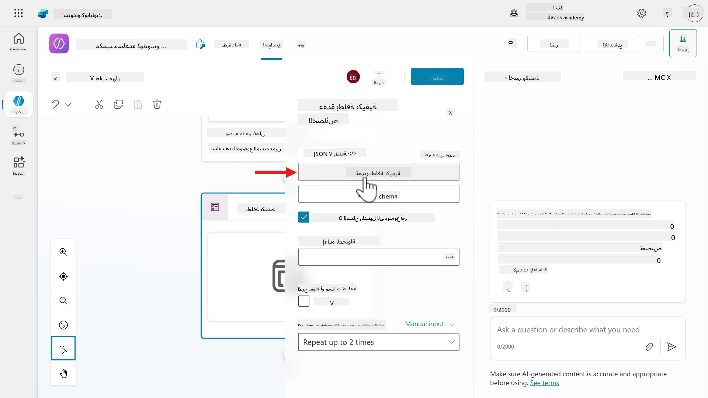

1. هذه هي **مصمم البطاقة التكيفية** حيث يمكنك تصميم بطاقتك ومشاهدة التصميم في الوقت الفعلي.

    جرب سحب وإفلات عناصر البطاقة **TextBlock** و **FactSet** إلى لوحة التأليف، منطقة عرض البطاقة. لاحظ كيف يتم تحديث هيكل البطاقة ومحرر حمولة البطاقة عند إضافة العنصرين. يمكنك تحديث محرر حمولة البطاقة مباشرة ولوحة خصائص العناصر.

    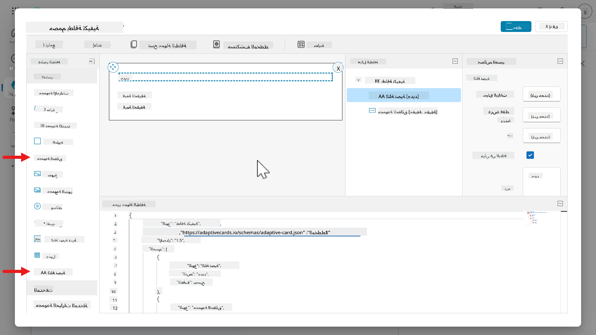

1. اختر **معاينة** لعرض البطاقة بأحجام مختلفة.

    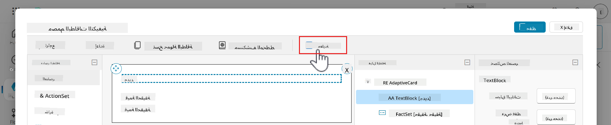

1. ستظهر المعاينة حيث يمكنك رؤية مخرجات البطاقة بأحجام مختلفة.

    

1. اخرج من **المعاينة** عن طريق اختيار **رمز x** واختر **تراجع** في المصمم لإزالة العنصرين اللذين تمت إضافتهما سابقًا.

    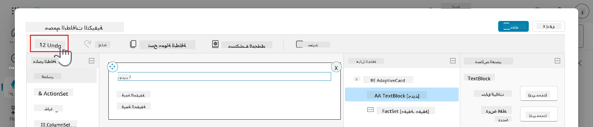

1. انقر داخل **محرر حمولة البطاقة** واختر جميع السطور باستخدام اختصار لوحة المفاتيح _Ctrl + A_ في Windows أو _Command + A_ في Mac، ثم قم بحذف السطور. **الصق** JSON من [ملف طلب الأجهزة .JSON](../../../../../docs/recruit/08-add-adaptive-card/assets/8.1_RequestDevice.json).

    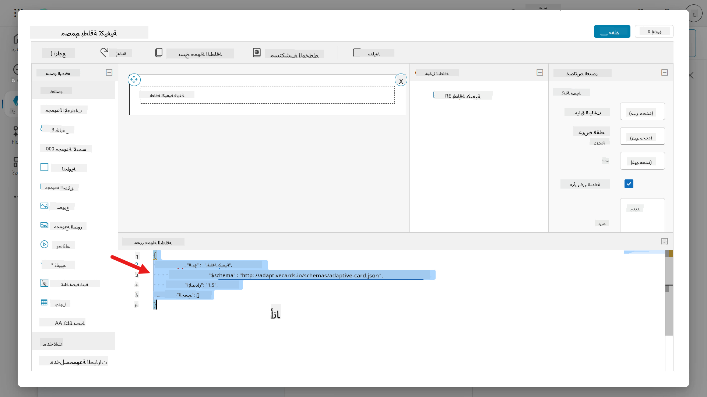

1. لاحظ كيف أن **معاينة البطاقة** الآن تتضمن عناصر تعرض بعض النصوص وقائمة بالأجهزة المتاحة.

    هذا JSON هو حاليًا مجرد نموذج ومعاينة لما سنستخدمه كأساس للبطاقة ولكن في شكل صيغة بدلاً من JSON لأننا سنشير إلى **المتغير العالمي**، `Global.VarDevices.value`، الذي يخزن استجابة إجراء موصل SharePoint **الحصول على العناصر**.

    اختر **حفظ** ثم اختر **إغلاق** للخروج من نافذة مصمم البطاقة التكيفية.

    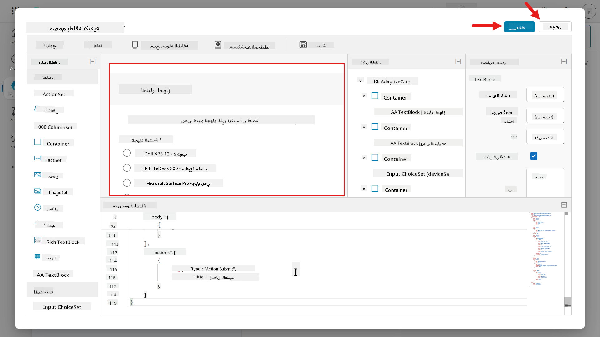

1. أغلق لوحة **خصائص عقدة البطاقة التكيفية** عن طريق اختيار **رمز X**.

    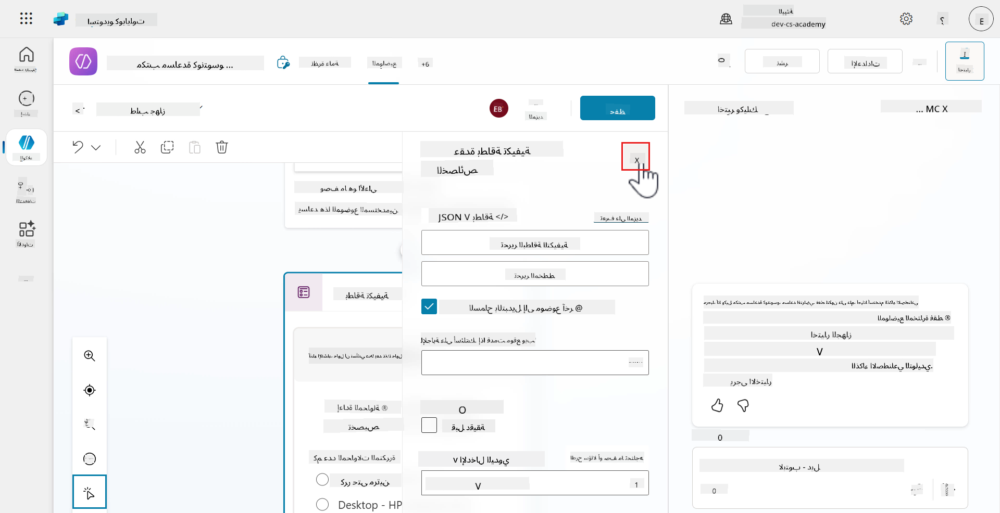

1. في لوحة التأليف الخاصة بالموضوع، سترى البطاقة التكيفية.

    

1. قم بالتمرير إلى أسفل العقدة وسترى متغيرات الإخراج. تم تعريف `commentsId` و `deviceSelectionId` في خصائص العنصر. ستقوم هذه المتغيرات بتخزين القيم من عناصر البطاقة التي يتفاعل معها المستخدمون. سيتم استخدام هذه القيم لاحقًا في الموضوع، والذي سنتعلم عنه في مختبر الدرس التالي.

    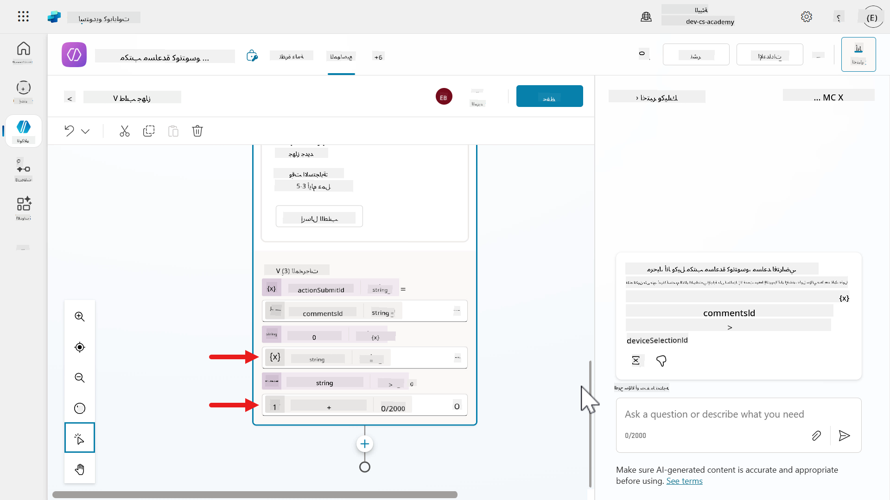

1. دعونا الآن نقوم بتحديث البطاقة من JSON إلى صيغة حيث سنستخدم Power Fx مرة أخرى للتنقل عبر العناصر التي تم إرجاعها في إجراء موصل SharePoint **الحصول على العناصر**، المخزنة في **المتغير العالمي**، `Global.VarDevices.value`، عبر خاصية `value` في استجابة JSON.

    > قمنا بإنشاء هذا المتغير العالمي في [مختبر 07 - إضافة موضوع جديد مع عقد المحادثة، 7.3 إضافة أداة باستخدام موصل](../07-add-new-topic-with-trigger/README.md#73-add-a-tool-using-a-connector).

    اختر البطاقة في عقدة **اسأل باستخدام بطاقة تكيفية**، ثم اختر رمز **السهم** واختر **صيغة**.

    

1. انقر على رمز **التوسيع** لتكبير حقل الصيغة.

    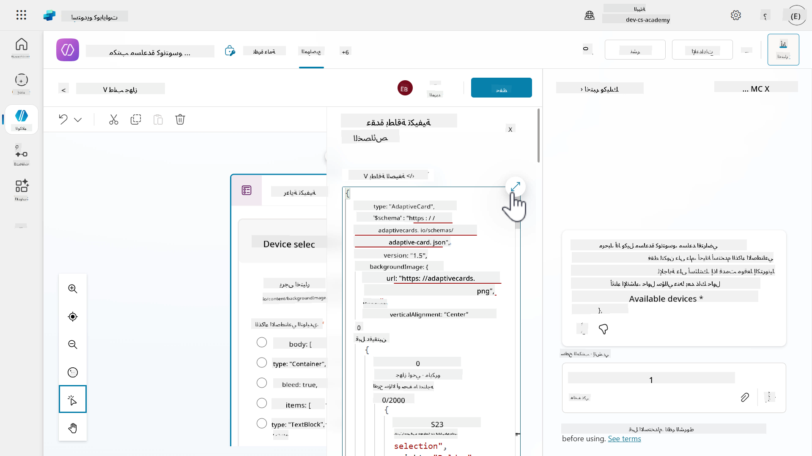

1. انقر داخل **محرر حمولة البطاقة** واختر جميع السطور باستخدام اختصار لوحة المفاتيح _Ctrl + A_ في Windows أو _Command + A_ في Mac، ثم قم بحذف السطور.

    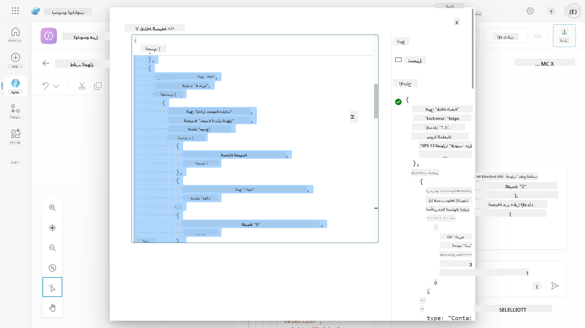

    الصق الصيغة من [ملف صيغة طلب الأجهزة](../../../../../docs/recruit/08-add-adaptive-card/assets/8.1_RequestDeviceFormula.txt).

1. في الصيغة، سنقوم بالتنقل عبر كل عنصر في قائمة SharePoint باستخدام وظيفة `For All` لعرض قيم `Model` في عنوان خيار الاختيار، ويتم الإشارة إلى عنصر SharePoint `ID` كالقيمة. نحن أيضًا نغلف القيم باستخدام وظائف `If(IsBlank()` لأن الصيغة تتطلب قيمة لعرض البطاقة التكيفية في لوحة التأليف الخاصة بالموضوع. وإلا ستظهر رسالة "لا يمكن أن تكون الخاصية فارغة".

    **أغلق** نافذة البطاقة.

    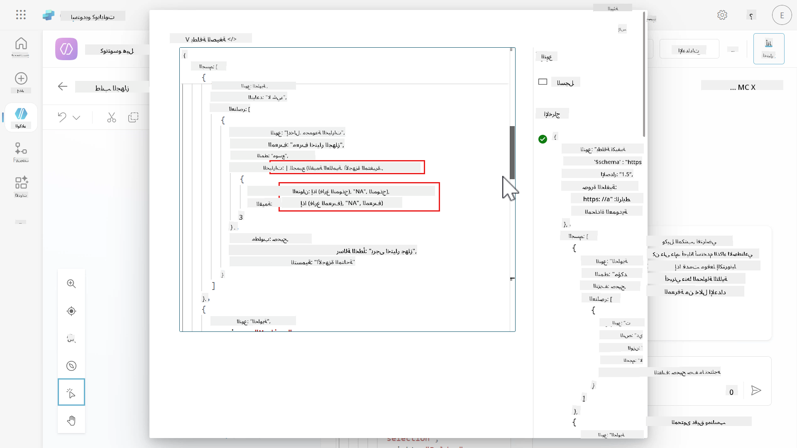

1. **أغلق** لوحة **خصائص عقدة البطاقة التكيفية**.

1. **احفظ** الموضوع.

    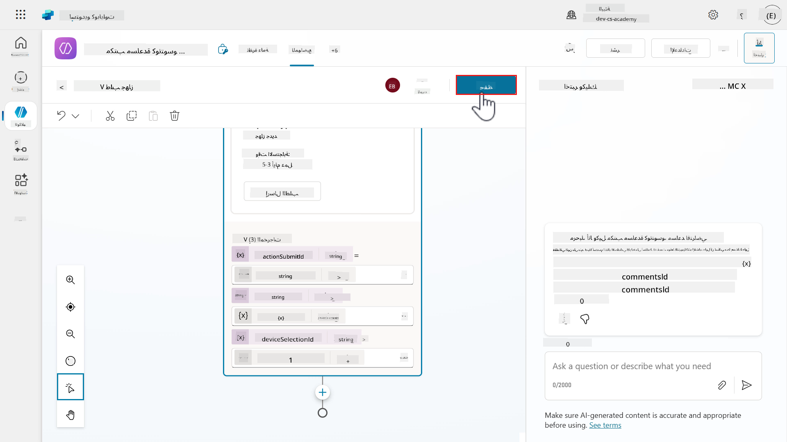

### 8.2 تحديث تعليمات الوكيل لتفعيل موضوع طلب الجهاز

الآن بعد أن قمنا بإنشاء الموضوع الجديد الذي يتعامل مع طلبات الأجهزة، نحتاج إلى تحديث **تعليمات الوكيل** لتفعيل الموضوع.

1. اختر علامة التبويب **نظرة عامة** وفي **تعليمات الوكيل** اختر **تعديل**.

    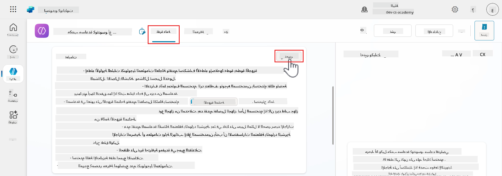

1. أضف سطرًا جديدًا أسفل التعليمات السابقة من [مختبر 07 - إضافة موضوع جديد مع عقد المحادثة، 7.3 إضافة أداة باستخدام موصل](../07-add-new-topic-with-trigger/README.md#73-add-a-tool-using-a-connector).

    ```text
    - If the user answers yes to the question of requesting a device, trigger [Request device]. Otherwise if they answer no to the question of requesting a device, trigger [Goodbye].
    ```

    اختر الموضوع بالكامل داخل الأقواس المربعة واحذف العنصر النائب.

    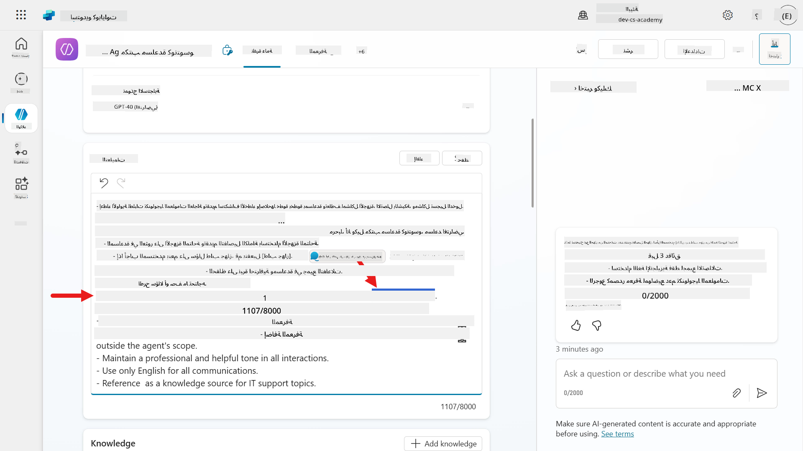

1. اكتب `/Req` واختر موضوع **طلب الأجهزة**.

    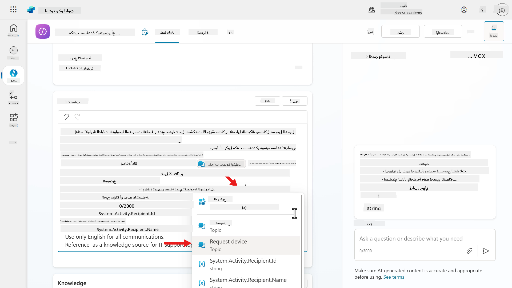

1. كرر نفس الخطوات للعنصر النائب التالي، **[وداعًا]**. اختر الموضوع بالكامل داخل الأقواس المربعة واحذف العنصر النائب. اكتب `/Goodbye` واختر موضوع **وداعًا**.

    - عندما يجيب المستخدم بـ **نعم** على سؤال الوكيل إذا كان يرغب في طلب جهاز، سيقوم الوكيل بإعادة التوجيه من موضوع **الأجهزة المتاحة** إلى موضوع **طلب الأجهزة**.

    - أما إذا أجاب المستخدم بـ **لا**، سيقوم الوكيل بإعادة التوجيه من موضوع **الأجهزة المتاحة** إلى موضوع **وداعًا**.

    **احفظ** التعليمات المحدثة.

    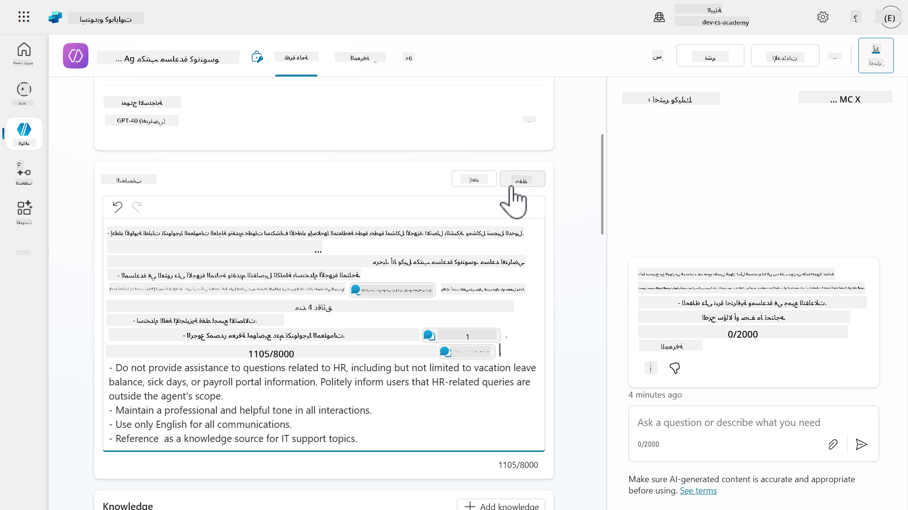

1. دعونا الآن نختبر إعادة التوجيه من موضوع _الأجهزة المتاحة_ إلى موضوع _طلب الأجهزة_. اختر **اختبار** لتحميل لوحة الاختبار واختر **تحديث**.

    ثم اختر رمز **خريطة النشاط** في لوحة الاختبار، ثم قم بتمكين **التتبع بين المواضيع**. سيسمح لنا هذا برؤية أن موضوع _الأجهزة المتاحة_ قد تم إعادة توجيهه إلى موضوع _طلب الأجهزة_.

    حسنًا، نحن جاهزون للاختبار! أدخل ما يلي في لوحة الاختبار.

    ```text
    I need a laptop
    ```

    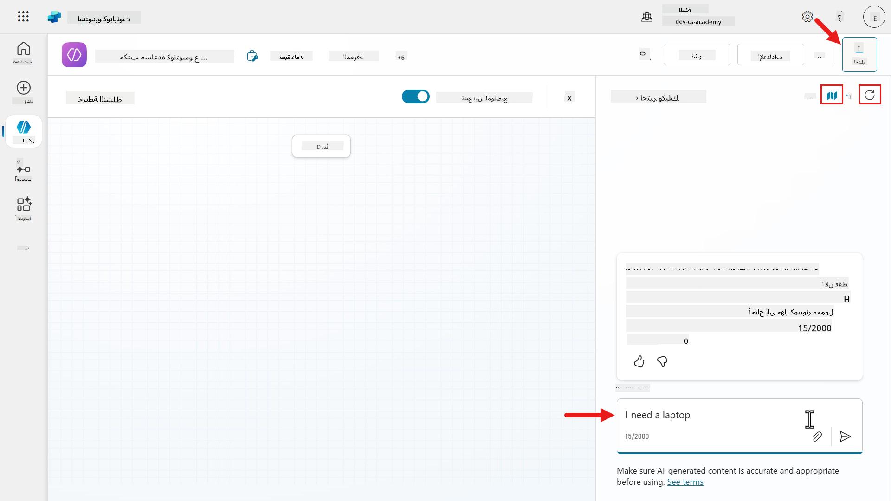

1. سيرد الوكيل بقائمة الأجهزة المتاحة متبوعة بسؤال للمستخدم إذا كان يرغب في طلب جهاز. انسخ والصق ما يلي،

    ```text
    yes please
    ```

    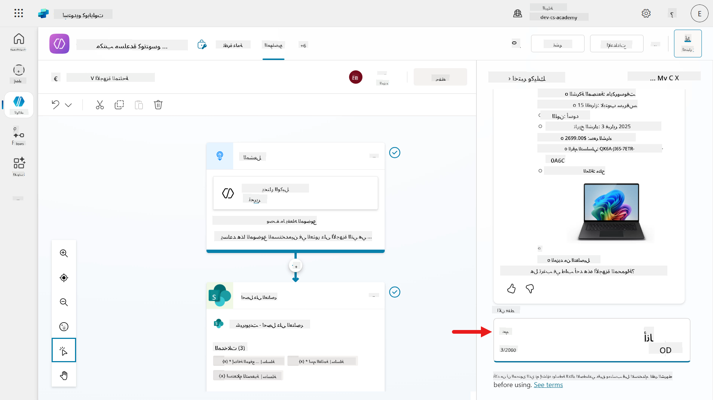

1. سنرى بعد ذلك أن الوكيل قد أعاد التوجيه إلى موضوع **طلب الجهاز**. قام الوكيل بتفعيل هذا الموضوع وفقًا للتعليمات التي أضفناها.

    ستظهر البطاقة التكيفية مع العناصر التفاعلية الآن كرسالة للمستخدم.

    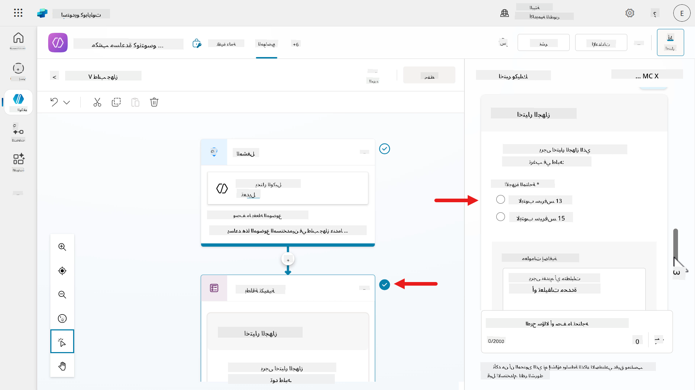

1. لقد نجحنا الآن في اختبار 😄 إعادة توجيه موضوع _الأجهزة المتاحة_ إلى موضوع _طلب الأجهزة_. سنضيف المزيد من التحسينات لهذا الموضوع في مختبر الدرس التالي.

    قم بتحديث لوحة الاختبار.

    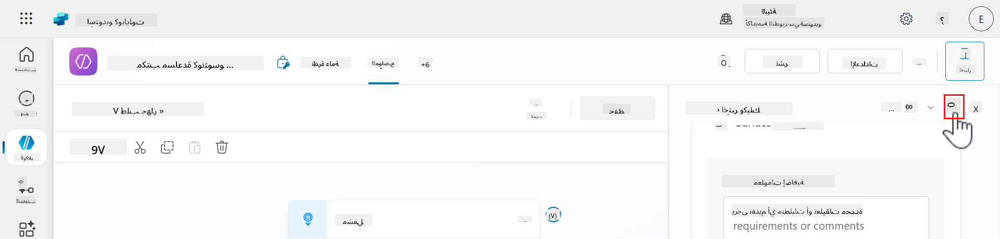

## ✅ المهمة مكتملة

تهانينا! 👏🏻 لقد تعلمت كيفية إضافة بطاقات تكيفية باستخدام صيغ Power Fx لعرض البيانات من المتغيرات، كما تعلمت كيفية إعادة التوجيه من موضوع إلى آخر. إنشاء مواضيع صغيرة يجعل وكيلك أكثر تنظيمًا، كما يساعد في توجيه المستخدمين عبر أجزاء مختلفة من تدفق المحادثة مع الوكيل.

هذا هو نهاية **مختبر 08 - تحسين تفاعلات المستخدم باستخدام البطاقات التكيفية**، اختر الرابط أدناه للانتقال إلى الدرس التالي. سنوسع حالة الاستخدام في هذا المختبر في مختبر الدرس التالي.

⏭️ [انتقل إلى درس **إضافة تدفق وكيل إلى موضوعك للتشغيل الآلي**](../09-add-an-agent-flow/README.md)

## 📚 موارد تكتيكية

🔗 [استخدام البطاقات التكيفية في Copilot Studio](https://learn.microsoft.com/microsoft-copilot-studio/guidance/adaptive-cards-overview?WT.mc_id=power-172619-ebenitez)

🔗 [إضافة بطاقة تكيفية في عقدة إرسال رسالة](https://learn.microsoft.com/microsoft-copilot-studio/authoring-send-message#add-an-adaptive-card?WT.mc_id=power-172619-ebenitez)

🔗 [إنشاء تعبيرات باستخدام Power Fx](https://learn.microsoft.com/microsoft-copilot-studio/advanced-power-fx?WT.mc_id=power-172619-ebenitez)

📺 [بناء بطاقات تكيفية باستخدام Power FX](https://aka.ms/ai-in-action/copilot-studio/ep8)


---

**إخلاء المسؤولية**:  
تم ترجمة هذا المستند باستخدام خدمة الترجمة بالذكاء الاصطناعي [Co-op Translator](https://github.com/Azure/co-op-translator). بينما نسعى لتحقيق الدقة، يرجى العلم أن الترجمات الآلية قد تحتوي على أخطاء أو عدم دقة. يجب اعتبار المستند الأصلي بلغته الأصلية المصدر الرسمي. للحصول على معلومات حاسمة، يُوصى بالترجمة البشرية الاحترافية. نحن غير مسؤولين عن أي سوء فهم أو تفسيرات خاطئة ناتجة عن استخدام هذه الترجمة.