<!--
CO_OP_TRANSLATOR_METADATA:
{
  "original_hash": "cd99a76bcb7372ac2771b6ae178b023d",
  "translation_date": "2025-10-22T19:20:33+00:00",
  "source_file": "docs/recruit/10-add-event-triggers/README.md",
  "language_code": "ar"
}
-->
# 🚨 المهمة 10: إضافة مشغلات الأحداث - تمكين قدرات الوكيل المستقل

## 🕵️‍♂️ الاسم الرمزي: `عملية الروتين الشبح`

> **⏱️ نافذة وقت العملية:** `~45 دقيقة`

🎥 **شاهد الفيديو التوضيحي**

[](https://www.youtube.com/watch?v=ZgwHL8PQ1nY "شاهد الفيديو التوضيحي على YouTube")

## 🎯 ملخص المهمة

حان الوقت لترقية وكيلك من مساعد محادثة إلى عامل مستقل. مهمتك هي تمكين وكيلك من العمل دون الحاجة إلى استدعائه - الرد على الإشارات من جميع أنحاء نطاقك الرقمي بدقة وسرعة.

مع مشغلات الأحداث، ستقوم بتدريب وكيلك لمراقبة الأنظمة الخارجية مثل SharePoint وTeams وOutlook، وتنفيذ إجراءات ذكية فور تلقي الإشارة. هذه العملية تحول وكيلك إلى أداة ميدانية كاملة التشغيل - صامتة، سريعة، ودائمة المراقبة.

النجاح يعني بناء وكلاء يبدؤون في تقديم القيمة - وليس فقط الرد عليها.

## 🔎 الأهداف

📖 ستغطي هذه الدرس:

- فهم مشغلات الأحداث وكيفية تمكين سلوك الوكيل المستقل
- تعلم الفرق بين مشغلات الأحداث ومشغلات المواضيع، بما في ذلك تدفقات العمل والحمولات
- استكشاف سيناريوهات مشغلات الأحداث الشائعة
- فهم الاعتبارات المتعلقة بالمصادقة والأمان والنشر للوكلاء المعتمدين على الأحداث
- بناء وكيل مكتب مساعدة تكنولوجيا المعلومات المستقل الذي يستجيب لأحداث SharePoint ويرسل تأكيدات عبر البريد الإلكتروني

## 🤔 ما هو مشغل الحدث؟

**مشغل الحدث** هو آلية تسمح لوكيلك بالتصرف بشكل مستقل استجابةً للأحداث الخارجية، دون الحاجة إلى إدخال مباشر من المستخدم. فكر فيه كأنه يجعل وكيلك "يراقب" أحداثًا محددة ويتخذ إجراءات تلقائية عندما تحدث تلك الأحداث.

على عكس مشغلات المواضيع، التي تتطلب من المستخدمين كتابة شيء لتفعيل المحادثة، يتم تفعيل مشغلات الأحداث بناءً على ما يحدث في الأنظمة المتصلة. على سبيل المثال:

- عند إنشاء ملف جديد في SharePoint أو OneDrive for Business
- عند إنشاء سجل في Dataverse
- عند إكمال مهمة في Planner
- عند تقديم استجابة جديدة لنموذج Microsoft
- عند إضافة رسالة جديدة في Microsoft Teams
- بناءً على جدول متكرر (مثل التذكيرات اليومية)  
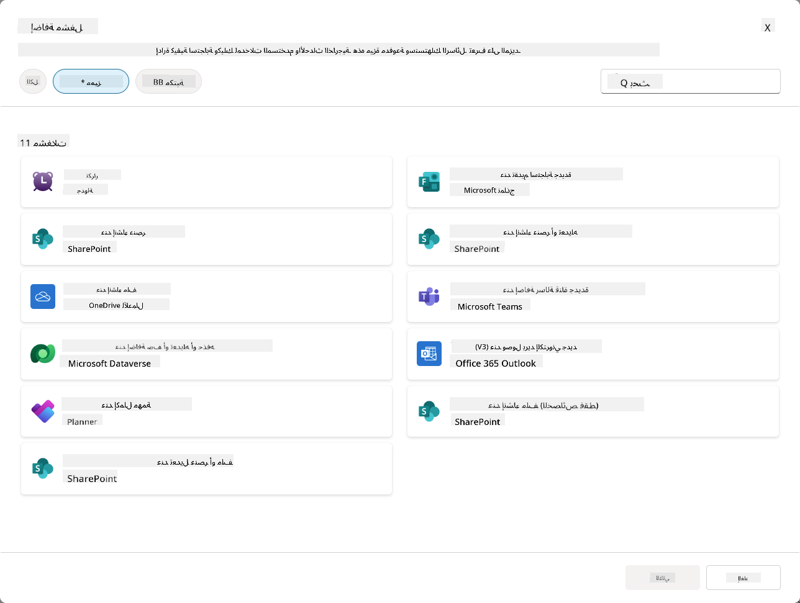

### لماذا تعتبر مشغلات الأحداث مهمة للوكلاء المستقلين؟

مشغلات الأحداث تحول وكيلك من مساعد تفاعلي إلى مساعد مستقل وفعال:

1. **العمل المستقل** - يمكن لوكيلك العمل على مدار الساعة دون تدخل بشري، والاستجابة للأحداث فور حدوثها.
    - *مثال:* الترحيب تلقائيًا بأعضاء الفريق الجدد عند إضافتهم إلى الفريق.

1. **الاستجابة الفورية** - بدلاً من انتظار المستخدمين لطرح الأسئلة، يستجيب وكيلك فورًا للأحداث ذات الصلة.
    - *مثال*: تنبيه فريق تكنولوجيا المعلومات عند تعديل مستند SharePoint.

1. **أتمتة تدفقات العمل** - ربط عدة إجراءات بناءً على حدث مشغل واحد.
    - *مثال:* عند إنشاء تذكرة دعم جديدة، يتم إنشاء مهمة، إخطار المدير، وتحديث لوحة التتبع.

1. **عمليات متسقة** - ضمان عدم تفويت الخطوات المهمة من خلال أتمتة الردود على الأحداث الرئيسية.
    - *مثال:* يحصل كل موظف جديد تلقائيًا على مواد التوجيه وطلبات الوصول.

1. **إجراءات تعتمد على البيانات** - استخدام المعلومات من الحدث المشغل لاتخاذ قرارات ذكية وتنفيذ الإجراءات المناسبة.
    - *مثال:* توجيه التذاكر العاجلة إلى الموظفين الكبار بناءً على مستوى الأولوية في حمولة المشغل.

## ⚙️ كيف تعمل مشغلات الأحداث؟

تعمل مشغلات الأحداث من خلال تدفق عمل ثلاثي الخطوات يمكّن وكيلك من الاستجابة بشكل مستقل للأحداث الخارجية:

### تدفق عمل المشغل

1. **اكتشاف الحدث** - يحدث حدث معين في نظام متصل (SharePoint، Teams، Outlook، إلخ.)
1. **تفعيل المشغل** - يكتشف مشغل الحدث هذا الحدث ويرسل حمولة إلى وكيلك عبر تدفق سحابي Power Automate.
1. **استجابة الوكيل** - يتلقى وكيلك الحمولة وينفذ التعليمات التي قمت بتحديدها.

### مشغلات الأحداث مقابل مشغلات المواضيع

فهم الفرق بين هذين النوعين من المشغلات أمر بالغ الأهمية:

| **مشغلات الأحداث** | **مشغلات المواضيع** |
|-------------------|-------------------|
| يتم تفعيلها بواسطة أحداث النظام الخارجية | يتم تفعيلها بواسطة إدخال المستخدم/العبارات |
| تمكّن سلوك الوكيل المستقل | تمكّن الردود المحادثية |
| تستخدم مصادقة المنشئ | خيار لمصادقة المستخدم |
| تعمل دون تفاعل المستخدم | تتطلب من المستخدم بدء المحادثة |
| أمثلة: إنشاء ملف، تلقي بريد إلكتروني | مثال: "ما حالة الطقس؟" |

## 📦 فهم حمولات المشغل

عندما يحدث حدث، يرسل المشغل **حمولة** إلى وكيلك تحتوي على معلومات حول الحدث وتعليمات حول كيفية الرد.

### الحمولات الافتراضية مقابل الحمولات المخصصة

يأتي كل نوع مشغل مع هيكل حمولة افتراضي، ولكن يمكنك تخصيصه:

**الحمولة الافتراضية** - تستخدم التنسيق القياسي مثل `استخدام المحتوى من {Body}`

- تحتوي على معلومات الحدث الأساسية
- تستخدم تعليمات معالجة عامة
- جيدة للسيناريوهات البسيطة

**الحمولة المخصصة** - إضافة تعليمات محددة وتنسيق البيانات

- تضمين توجيهات مفصلة لوكيلك
- تحديد البيانات التي يجب استخدامها وكيفية استخدامها
- أفضل لتدفقات العمل المعقدة

### تعليمات الوكيل مقابل تعليمات الحمولة المخصصة

لديك مكانان لتوجيه سلوك وكيلك باستخدام مشغلات الأحداث:

**تعليمات الوكيل** (عامة)

- توجيهات واسعة تنطبق على جميع المشغلات
- مثال: "عند معالجة التذاكر، تحقق دائمًا من التكرارات أولاً"
- الأفضل لأنماط السلوك العامة

**تعليمات الحمولة** (مخصصة للمشغل)

- توجيهات محددة لأنواع المشغلات الفردية  
- مثال: "بالنسبة لهذا التحديث في SharePoint، أرسل ملخصًا إلى قناة المشروع"
- الأفضل للوكلاء المعقدين مع مشغلات متعددة

💡 **نصيحة احترافية**: تجنب التعليمات المتضاربة بين هذين المستويين، حيث يمكن أن يؤدي ذلك إلى سلوك غير متوقع.

## 🎯 سيناريوهات مشغلات الأحداث الشائعة

إليك أمثلة عملية حول كيفية تحسين مشغلات الأحداث لوكيلك:

### وكيل مكتب مساعدة تكنولوجيا المعلومات

- **المشغل**: عنصر جديد في قائمة SharePoint (تذكرة دعم)
- **الإجراء**: تصنيف تلقائي، تحديد الأولوية، وإخطار أعضاء الفريق المناسبين

### وكيل توجيه الموظفين

- **المشغل**: إضافة مستخدم جديد إلى Dataverse
- **الإجراء**: إرسال رسالة ترحيب، إنشاء مهام التوجيه، وتوفير الوصول

### وكيل إدارة المشاريع

- **المشغل**: إكمال مهمة في Planner
- **الإجراء**: تحديث لوحة المشروع، إخطار أصحاب المصلحة، والتحقق من العوائق

### وكيل إدارة المستندات

- **المشغل**: تحميل ملف إلى مجلد محدد في SharePoint
- **الإجراء**: استخراج البيانات الوصفية، تطبيق العلامات، وإخطار مالكي المستندات

### وكيل مساعد الاجتماعات

- **المشغل**: إنشاء حدث في التقويم
- **الإجراء**: إرسال تذكيرات قبل الاجتماع وجدول الأعمال، حجز الموارد

## ⚠️ اعتبارات النشر والمصادقة

قبل أن يتمكن وكيلك من استخدام مشغلات الأحداث في الإنتاج، تحتاج إلى فهم تداعيات المصادقة والأمان.

### مصادقة المنشئ

تستخدم مشغلات الأحداث **بيانات اعتماد منشئ الوكيل** لجميع المصادقات:

- يصل وكيلك إلى الأنظمة باستخدام أذوناتك
- يمكن للمستخدمين الوصول إلى البيانات من خلال بيانات اعتمادك
- يتم تنفيذ جميع الإجراءات "باسمك" حتى عندما يتفاعل المستخدمون مع الوكيل

### أفضل ممارسات حماية البيانات

للحفاظ على الأمان عند نشر وكلاء مع مشغلات الأحداث:

1. **تقييم الوصول إلى البيانات** - مراجعة الأنظمة والبيانات التي يمكن لمشغلاتك الوصول إليها
1. **اختبار شامل** - فهم المعلومات التي تتضمنها المشغلات في الحمولات
1. **تحديد نطاق المشغل** - استخدام معايير محددة لتقييد الأحداث التي تنشط المشغلات
1. **مراجعة بيانات الحمولة** - ضمان عدم كشف المشغلات لمعلومات حساسة
1. **مراقبة الاستخدام** - تتبع نشاط المشغل واستهلاك الموارد

## ⚠️ استكشاف الأخطاء والقيود

ضع هذه الاعتبارات المهمة في ذهنك عند العمل مع مشغلات الأحداث:

### تأثير الحصص والفواتير

- كل تفعيل مشغل يُحسب ضمن استهلاك الرسائل الخاص بك
- يمكن أن تستهلك المشغلات المتكررة (مثل التكرار كل دقيقة) الحصة بسرعة
- مراقبة الاستخدام لتجنب التقييد

### المتطلبات التقنية

- متاحة فقط للوكلاء الذين تم تمكين التنسيق التوليدي لهم
- تتطلب تمكين مشاركة التدفق السحابي الواعي للحلول في بيئتك

### منع فقدان البيانات (DLP)

- تحدد سياسات DLP الخاصة بمؤسستك المشغلات المتاحة
- يمكن للمسؤولين حظر مشغلات الأحداث تمامًا
- اتصل بمسؤولك إذا لم تكن المشغلات المتوقعة متاحة

## 🧪 المختبر 10 - إضافة مشغلات الأحداث لسلوك الوكيل المستقل

### 🎯 حالة الاستخدام

ستقوم بتحسين وكيل مكتب مساعدة تكنولوجيا المعلومات الخاص بك للاستجابة تلقائيًا لطلبات الدعم الجديدة. عندما يقوم شخص ما بإنشاء عنصر جديد في قائمة تذاكر الدعم الخاصة بـ SharePoint، سيقوم وكيلك بـ:

1. التفعيل تلقائيًا عند إنشاء تذكرة SharePoint
1. تقديم تفاصيل التذكرة والتعليمات حول الخطوات التي تريد أن يقوم بها
1. تأكيد التذكرة تلقائيًا للمقدم عبر بريد إلكتروني يتم إنشاؤه بواسطة الذكاء الاصطناعي

يوضح هذا المختبر كيف تمكّن مشغلات الأحداث سلوك الوكيل المستقل حقًا.

### المتطلبات الأساسية

قبل بدء هذا المختبر، تأكد من أنك:

- ✅ أكملت المختبرات السابقة (خاصة المختبرات 6-8 لوكيل مكتب مساعدة تكنولوجيا المعلومات)
- ✅ لديك وصول إلى موقع SharePoint مع قائمة تذاكر دعم تكنولوجيا المعلومات
- ✅ بيئة Copilot Studio مع تمكين مشغلات الأحداث
- ✅ تم تمكين التنسيق التوليدي لوكيلك
- ✅ لديك الأذونات المناسبة في SharePoint وبيئة Copilot Studio الخاصة بك

### 10.1 تمكين الذكاء الاصطناعي التوليدي وإنشاء مشغل إنشاء عنصر SharePoint

1. افتح **وكيل مكتب مساعدة تكنولوجيا المعلومات** في **Copilot Studio**

1. أولاً، تأكد من تمكين **الذكاء الاصطناعي التوليدي** لوكيلك:
   - انتقل إلى علامة التبويب **نظرة عامة**
   - ضمن قسم التنسيق، قم بتبديل **التنسيق التوليدي** إلى **تشغيل** إذا لم يكن ممكّنًا بالفعل  
     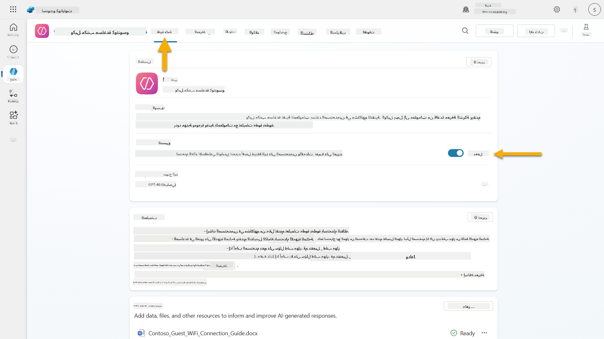

1. انتقل إلى علامة التبويب **نظرة عامة** وابحث عن قسم **المشغلات**

1. انقر فوق **+ إضافة مشغل** لفتح مكتبة المشغلات  
    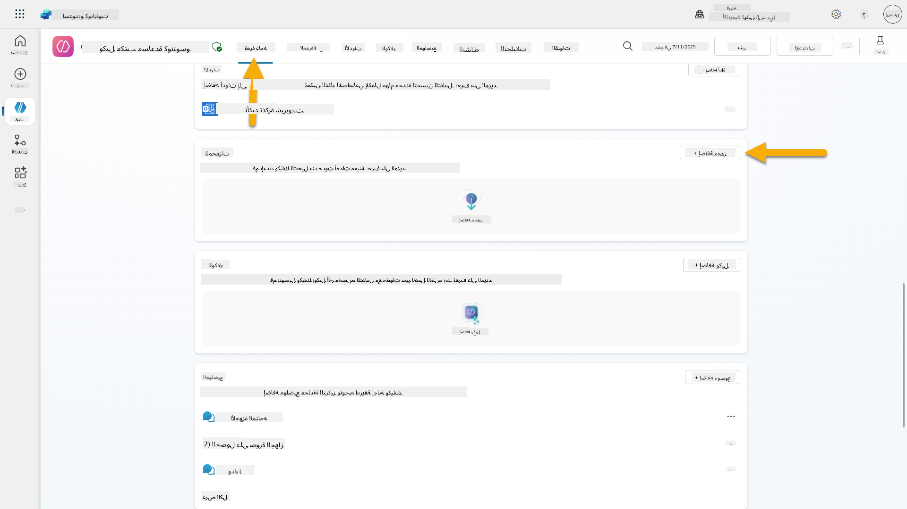

1. ابحث عن وحدد **عند إنشاء عنصر** (SharePoint)  
    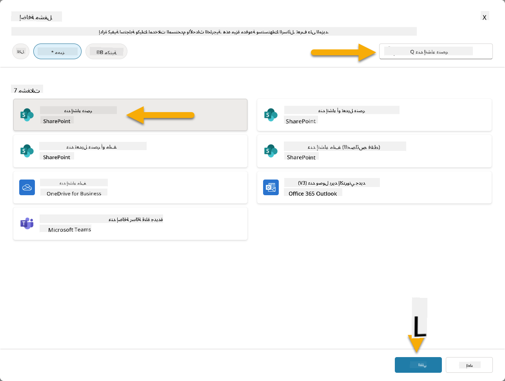

1. قم بتكوين اسم المشغل والاتصالات:

   - **اسم المشغل:** تم إنشاء تذكرة دعم جديدة في SharePoint

1. انتظر حتى يتم تكوين الاتصالات، ثم حدد **التالي** للمتابعة.  
   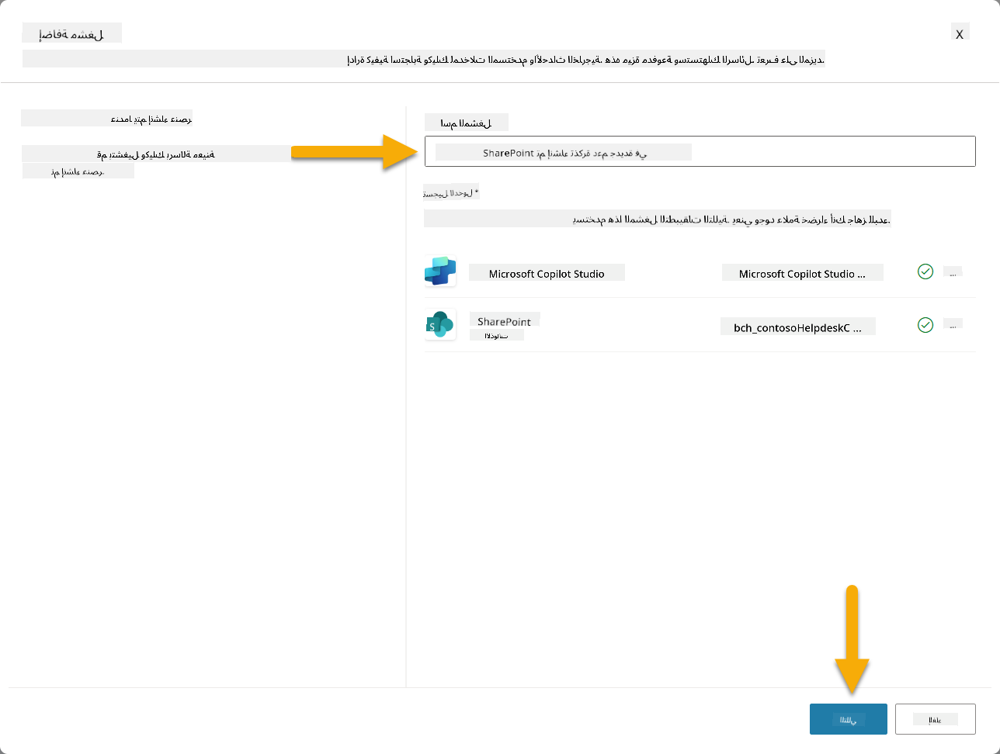

1. قم بتكوين معلمات المشغل:

   - **عنوان الموقع**: اختر موقع SharePoint الخاص بـ "Contoso IT"

   - **اسم القائمة**: اختر قائمة "التذاكر" الخاصة بك

   - **تعليمات إضافية للوكيل عند تفعيله بواسطة المشغل:**

     ```text
     New Support Ticket Created in SharePoint: {Body}
     
     Use the 'Acknowledge SharePoint Ticket' tool to generate the email body automatically and respond.
     
     IMPORTANT: Do not wait for any user input. Work completely autonomously.
     ```

     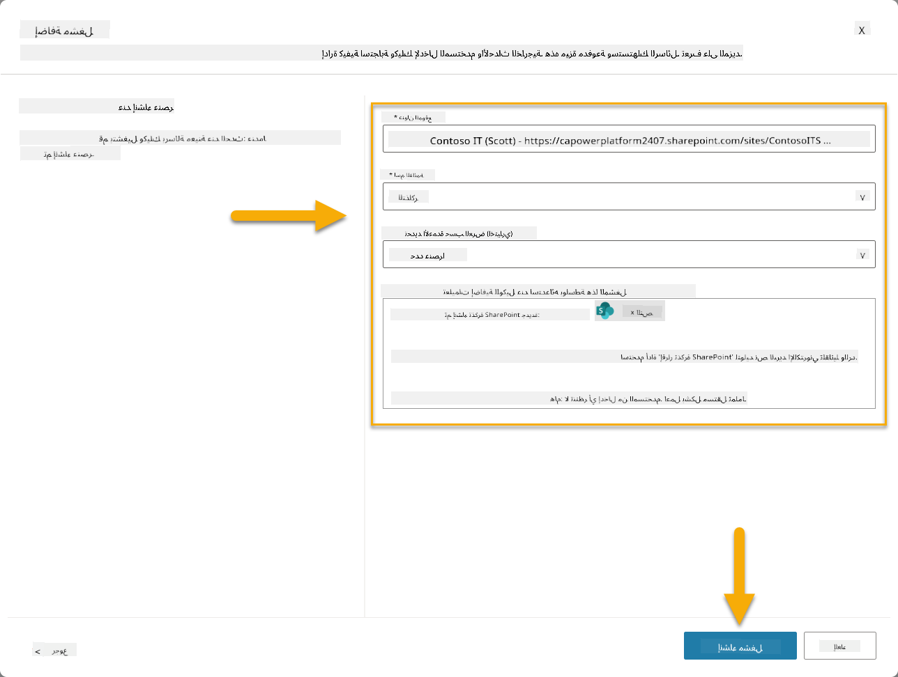

1. حدد **إنشاء مشغل** لإكمال إنشاء المشغل. يتم إنشاء تدفق سحابي Power Automate تلقائيًا لتفعيل الوكيل بشكل مستقل.

1. حدد **إغلاق**.

### 10.2 تحرير المشغل

1. داخل قسم **المشغلات** في علامة التبويب **نظرة عامة**، حدد قائمة **...** بجانب مشغل **تم إنشاء تذكرة دعم جديدة في SharePoint**

1. حدد **تحرير في Power Automate**  
   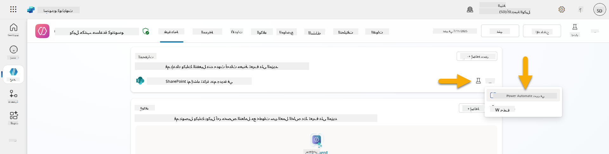

1. حدد العقدة **يرسل مطالبة إلى المساعد المحدد للمعالجة**

1. في حقل **النص/الرسالة**، قم بإزالة محتوى النص، **اضغط على مفتاح الخط المائل** (/) وحدد **إدراج تعبير**  
   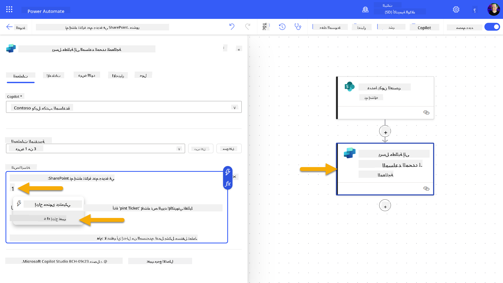

1. أدخل التعبير التالي لتزويد الوكيل بتفاصيل محددة حول التذكرة:

    ```text
    concat('Submitted By Name: ', first(triggerOutputs()?['body/value'])?['Author/DisplayName'], '\nSubmitted By Email: ', first(triggerOutputs()?['body/value'])?['Author/Email'], '\nTitle: ', first(triggerOutputs()?['body/value'])?['Title'], '\nIssue Description: ', first(triggerOutputs()?['body/value'])?['Description'], '\nPriority: ', first(triggerOutputs()?['body/value'])?['Priority/Value'],'\nTicket ID : ', first(triggerOutputs()?['body/value'])?['ID'])
    ```

1. حدد **إضافة**  
   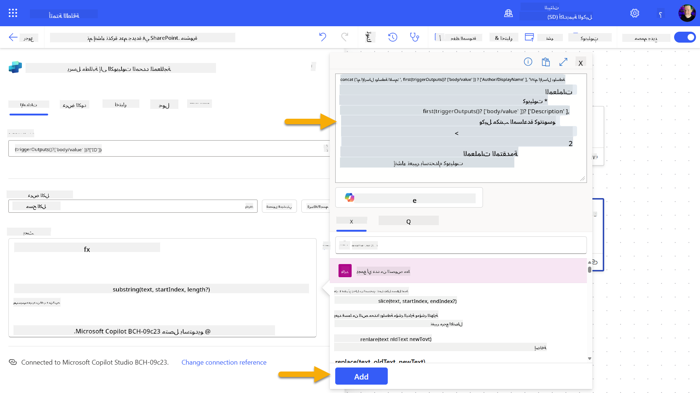

1. حدد **نشر** في شريط الأدوات العلوي الأيمن.

### 10.3 إنشاء أداة لتأكيد البريد الإلكتروني

1. **العودة** إلى وكيلك في Copilot Studio

1. انتقل إلى علامة التبويب **الأدوات** في وكيلك

1. انقر فوق **+ إضافة أداة** وحدد **موصل**

1. ابحث عن وحدد موصل **إرسال بريد إلكتروني (V2)**  
    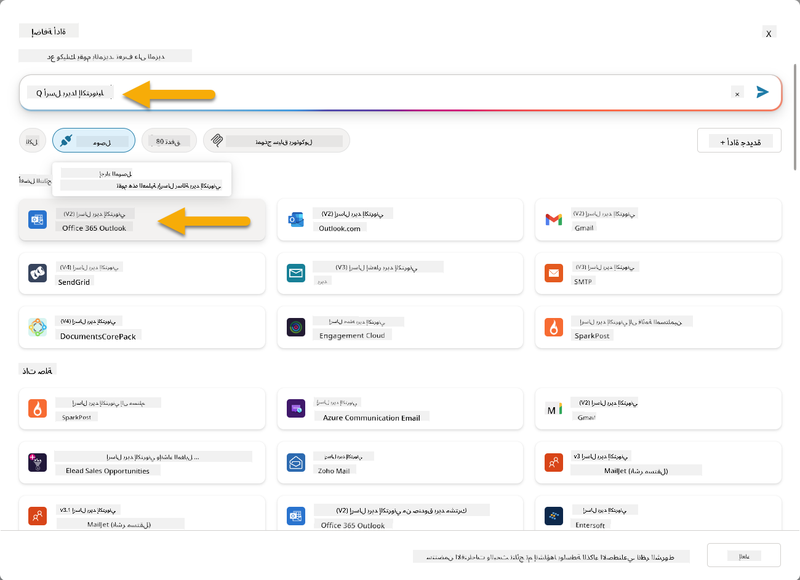

1. انتظر حتى يتم تكوين الاتصال، ثم حدد **إضافة وتكوين**

1. قم بتكوين إعدادات الأداة:

   - **الاسم**: تأكيد تذكرة SharePoint
   - **الوصف**: هذه الأداة ترسل تأكيدًا عبر البريد الإلكتروني بأنه تم استلام التذكرة.

1. حدد **تخصيص** بجانب معلمات الإدخال وقم بتكوينها كما يلي:

    **إلى**:

    - **الوصف**: عنوان البريد الإلكتروني للشخص الذي قدم تذكرة SharePoint
    - **التعريف كـ**: بريد إلكتروني

    **النص**:

    - **الوصف**: تأكيد بأنه تم استلام التذكرة، ونسعى للرد خلال 3 أيام عمل.

    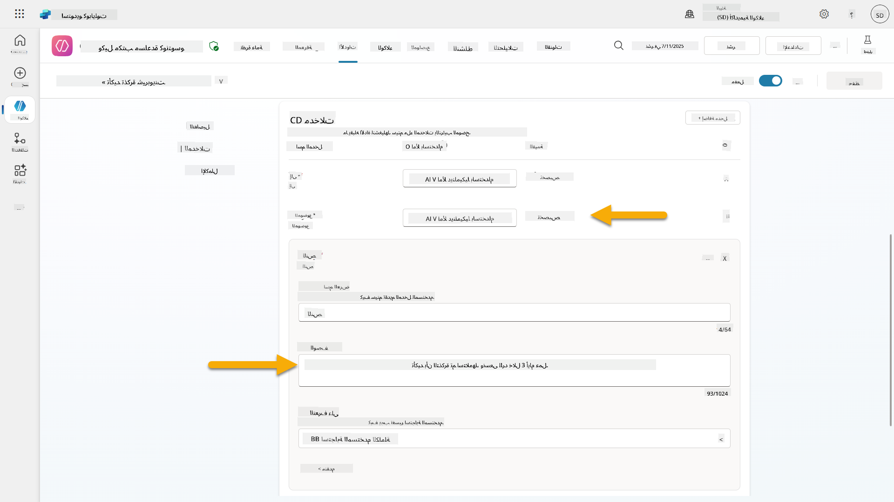

1. حدد **حفظ**

### 10.4 اختبار المشغل

1. داخل **وكيل مكتب المساعدة الخاص بك**، حدد علامة التبويب **نظرة عامة**
1. انقر فوق رمز **اختبار المشغل** بجانب مشغل **تم إنشاء تذكرة دعم جديدة في SharePoint**. سيؤدي ذلك إلى تحميل نافذة **اختبار المشغل الخاص بك**.
1. افتح علامة تبويب جديدة في المتصفح وانتقل إلى **قائمة تذاكر دعم تكنولوجيا المعلومات في SharePoint**  
1. انقر على **+ إضافة عنصر جديد** لإنشاء تذكرة اختبار:  
   - **العنوان**: "غير قادر على الاتصال بـ VPN"  
   - **الوصف**: "غير قادر على الاتصال بشبكة WIFI الخاصة بالشركة بعد التحديث الأخير"  
   - **الأولوية**: "عادي"  

1. **احفظ** العنصر في SharePoint  
    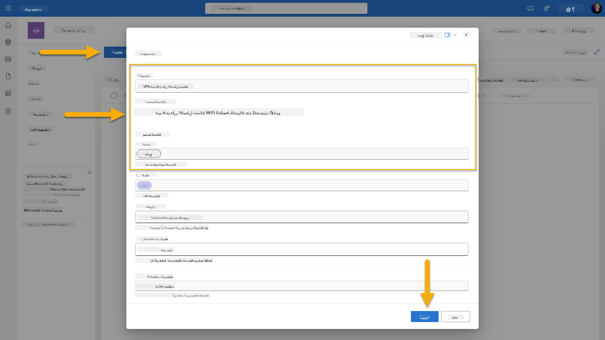  
1. عد إلى **Copilot Studio** وتابع لوحة **اختبار المشغل** لمراقبة تفعيل المشغل. استخدم رمز **تحديث** لتحميل حدث المشغل، قد يستغرق ذلك بضع دقائق.  
    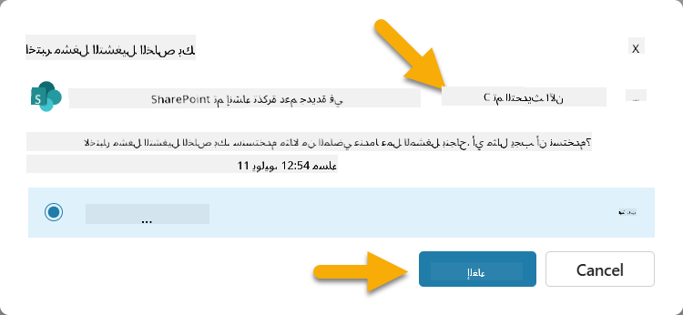  
1. بمجرد ظهور المشغل، اختر **بدء الاختبار**  
1. اختر **رمز خريطة النشاط** في أعلى لوحة **اختبار وكيلك**  
1. تحقق من أن وكيلك:  
   - استلم حمولة المشغل  
   - استدعى أداة "تأكيد تذكرة SharePoint"  
       
1. تحقق من صندوق البريد الإلكتروني للمقدم للتأكد من إرسال رسالة التأكيد  
    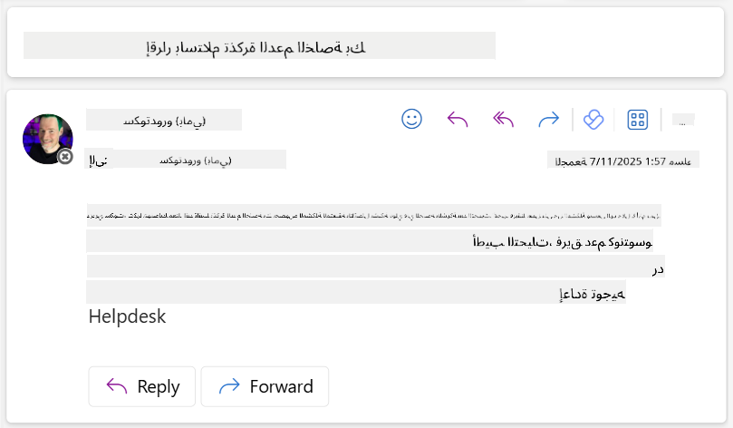  
1. راجع علامة التبويب **النشاط** في Copilot Studio لرؤية التنفيذ الكامل للمشغل والأداة  

## ✅ المهمة مكتملة  

🎉 **تهانينا!** لقد نجحت في تنفيذ مشغلات الأحداث باستخدام أدوات الموصلات التي تمكن وكيلك من العمل بشكل مستقل، وإرسال رسائل تأكيد بالبريد الإلكتروني ومعالجة تذاكر الدعم تلقائيًا دون تدخل المستخدم. بمجرد نشر وكيلك، سيعمل بشكل مستقل نيابة عنك.  

🚀 **التالي**: في درسنا القادم، ستتعلم كيفية [نشر وكيلك](../11-publish-your-agent/README.md) في Microsoft Teams وMicrosoft 365 Copilot، مما يجعله متاحًا لجميع أفراد مؤسستك!  

⏭️ [انتقل إلى درس **نشر وكيلك**](../11-publish-your-agent/README.md)  

## 📚 موارد تكتيكية  

هل أنت مستعد للتعمق أكثر في مشغلات الأحداث والوكلاء المستقلين؟ تحقق من هذه الموارد:  

- **Microsoft Learn**: [اجعل وكيلك مستقلاً في Copilot Studio](https://learn.microsoft.com/training/modules/autonomous-agents-online-workshop/?WT.mc_id=power-177340-scottdurow)  
- **التوثيق**: [إضافة مشغل حدث](https://learn.microsoft.com/microsoft-copilot-studio/authoring-trigger-event?WT.mc_id=power-177340-scottdurow)  
- **أفضل الممارسات**: [مقدمة عن مشغلات Power Automate](https://learn.microsoft.com/power-automate/triggers-introduction?WT.mc_id=power-177340-scottdurow)  
- **السيناريوهات المتقدمة**: [استخدام تدفقات Power Automate مع الوكلاء](https://learn.microsoft.com/microsoft-copilot-studio/advanced-flow-create?WT.mc_id=power-177340-scottdurow)  
- **الأمان**: [منع فقدان البيانات لـ Copilot Studio](https://learn.microsoft.com/microsoft-copilot-studio/admin-data-loss-prevention?WT.mc_id=power-177340-scottdurow)  

  

---

**إخلاء المسؤولية**:  
تم ترجمة هذا المستند باستخدام خدمة الترجمة بالذكاء الاصطناعي [Co-op Translator](https://github.com/Azure/co-op-translator). بينما نسعى لتحقيق الدقة، يرجى العلم أن الترجمات الآلية قد تحتوي على أخطاء أو عدم دقة. يجب اعتبار المستند الأصلي بلغته الأصلية المصدر الرسمي. للحصول على معلومات حاسمة، يُوصى بالترجمة البشرية الاحترافية. نحن غير مسؤولين عن أي سوء فهم أو تفسيرات خاطئة تنشأ عن استخدام هذه الترجمة.