<!--
CO_OP_TRANSLATOR_METADATA:
{
  "original_hash": "9dceeba2eae2bb73e328602a060eddab",
  "translation_date": "2025-10-22T19:47:40+00:00",
  "source_file": "docs/recruit/11-publish-your-agent/README.md",
  "language_code": "ar"
}
-->
# 🚨 المهمة 11: نشر وكيلك

## 🕵️‍♂️ الاسم الرمزي: `عملية النشر النشر النشر`

> **⏱️ مدة العملية:** `~30 دقيقة`

🎥 **شاهد الفيديو التوضيحي**

[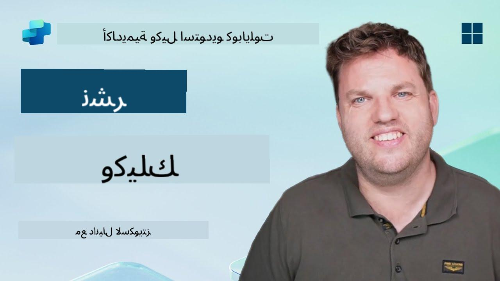](https://www.youtube.com/watch?v=eVZmljhYlSI "شاهد الفيديو التوضيحي على YouTube")

## 🎯 ملخص المهمة

بعد إكمال سلسلة من الوحدات الصعبة، صانع الوكلاء، أصبحت الآن جاهزًا للخطوة الأكثر أهمية: نشر وكيلك. حان الوقت لجعل إبداعك متاحًا للمستخدمين عبر Microsoft Teams وMicrosoft 365 Copilot.

وكيلك - المجهز بمهمة واضحة، أدوات قوية، ومصادر معرفة رئيسية - جاهز للخدمة. باستخدام Microsoft Copilot Studio، يمكنك نشر وكيلك ليبدأ في مساعدة المستخدمين الحقيقيين، حيث يعملون.

لنطلق وكيلك إلى العمل.

## 🔎 الأهداف

📖 تغطي هذه الدرس:

1. لماذا من المهم نشر وكيلك
1. ماذا يحدث عند نشر وكيلك
1. كيفية إضافة قناة (Microsoft Teams وMicrosoft 365 Copilot)
1. كيفية إضافة الوكيل في Microsoft Teams
1. كيفية جعل الوكيل متاحًا في Microsoft Teams لجميع أفراد المؤسسة

## 🚀 نشر الوكيل

كلما عملت على وكيل في Copilot Studio، قد تقوم بتحديثه بإضافة معرفة أو أدوات. عندما تكون جاهزًا مع جميع التغييرات، وبعد اختبارها بدقة، تكون مستعدًا لنشره. يضمن النشر أن التحديثات الأخيرة أصبحت حية. إذا قمت بتحديث وكيلك بأدوات جديدة ولم تضغط على زر النشر، فلن يكون متاحًا بعد للمستخدمين النهائيين.

تأكد دائمًا من الضغط على زر النشر عندما تريد دفع التحديثات إلى مستخدمي وكيلك. قد يكون لوكيلك قنوات مضافة إليه، وعندما تضغط على نشر، تصبح التحديثات متاحة لجميع القنوات التي أضفتها إلى الوكيل.

## ⚙️ إعداد القنوات

تحدد القنوات الأماكن التي يمكن للمستخدمين الوصول إلى وكيلك والتفاعل معه. بعد نشر وكيلك، يمكنك جعله متاحًا في قنوات متعددة. قد تعرض كل قناة محتوى وكيلك بشكل مختلف.

يمكنك إضافة وكيلك إلى القنوات التالية:

- **Microsoft Teams وMicrosoft 365 Copilot** - اجعل وكيلك متاحًا في محادثات واجتماعات Teams، وفي تجارب Microsoft 365 Copilot ([تعرف على المزيد](https://learn.microsoft.com/microsoft-copilot-studio/publication-add-bot-to-microsoft-teams))
- **موقع تجريبي** - اختبر وكيلك على موقع تجريبي مقدم من Copilot Studio ([تعرف على المزيد](https://learn.microsoft.com/microsoft-copilot-studio/publication-connect-bot-to-web-channels))
- **موقع مخصص** - قم بتضمين وكيلك مباشرة في موقعك الخاص ([تعرف على المزيد](https://learn.microsoft.com/microsoft-copilot-studio/publication-connect-bot-to-web-channels))
- **تطبيق الهاتف المحمول** - قم بدمج وكيلك في تطبيق هاتف محمول مخصص ([تعرف على المزيد](https://learn.microsoft.com/microsoft-copilot-studio/publication-connect-bot-to-custom-application))
- **SharePoint** - أضف وكيلك إلى مواقع SharePoint للحصول على مساعدة في المستندات والمواقع ([تعرف على المزيد](https://learn.microsoft.com/microsoft-copilot-studio/publication-add-bot-to-sharepoint))
- **Facebook Messenger** - تواصل مع المستخدمين عبر منصة الرسائل الخاصة بـ Facebook ([تعرف على المزيد](https://learn.microsoft.com/microsoft-copilot-studio/publication-add-bot-to-facebook))
- **Power Pages** - قم بدمج وكيلك في مواقع Power Pages ([تعرف على المزيد](https://learn.microsoft.com/microsoft-copilot-studio/publication-add-bot-to-power-pages))
- **قنوات Azure Bot Service** - الوصول إلى قنوات إضافية بما في ذلك Slack، Telegram، Twilio SMS، والمزيد ([تعرف على المزيد](https://learn.microsoft.com/microsoft-copilot-studio/publication-connect-bot-to-azure-bot-service-channels))

لإضافة قناة، انتقل إلى علامة التبويب **القنوات** في وكيلك وحدد القناة التي تريد إعدادها. لكل قناة متطلبات إعداد محددة وقد تتطلب خطوات مصادقة أو إعداد إضافية.

## 📺 تجارب القنوات

تختلف تجارب المستخدمين بين القنوات المختلفة. عند إنشاء وكيل لعدة قنوات، تأكد من معرفة الفروقات بين القنوات. دائمًا ما تكون استراتيجية جيدة اختبار وكيلك في عدة قنوات للتأكد من أنه يعمل كما هو مقصود.

| التجربة                          | الموقع       | Teams وMicrosoft 365 Copilot         | Facebook                 | Dynamics Omnichannel لخدمة العملاء                   |
| -------------------------------- | ------------- | --------------------------------------- | ------------------------ | ----------------------------------------------------------- |
| [استبيان رضا العملاء][1]         | بطاقة تكيفية | نص فقط                               | نص فقط                  | نص فقط                                                   |
| [خيارات متعددة][1]               | مدعوم        | [مدعوم حتى ستة (كبطاقة بطل)][4]       | [مدعوم حتى 13][6]       | [مدعوم جزئيًا][8]                                        |
| [Markdown][2]                    | مدعوم        | [مدعوم جزئيًا][5]                     | [مدعوم جزئيًا][7]       | [مدعوم جزئيًا][9]                                        |
| [رسالة ترحيب][1]                 | مدعوم        | مدعوم                                | غير مدعوم               | مدعوم لـ [الدردشة][10]. غير مدعوم للقنوات الأخرى.         |
| [هل تقصد][3]                     | مدعوم        | مدعوم                                | مدعوم                   | مدعوم لـ [Microsoft Teams][11]، [الدردشة][10]، Facebook، وقنوات النص فقط (خدمة الرسائل القصيرة (SMS) عبر [TeleSign][12] و[Twilio][13]، [WhatsApp][14]، [WeChat][15]، و[Twitter][16]). يتم تقديم الإجراءات المقترحة كقائمة نصية فقط؛ يجب على المستخدمين إعادة كتابة خيار للرد. |

[1]: https://learn.microsoft.com/microsoft-copilot-studio/authoring-create-edit-topics  
[2]: https://daringfireball.net/projects/markdown/  
[3]: https://learn.microsoft.com/microsoft-copilot-studio/advanced-ai-features  
[4]: https://learn.microsoft.com/microsoftteams/platform/concepts/cards/cards-reference#hero-card  
[5]: https://learn.microsoft.com/microsoftteams/platform/bots/how-to/format-your-bot-messages#text-only-messages  
[6]: https://developers.facebook.com/docs/messenger-platform/send-messages/quick-replies/  
[7]: https://www.facebook.com/help/147348452522644?helpref=related  
[8]: https://learn.microsoft.com/dynamics365/customer-service/asynchronous-channels#suggested-actions-support  
[9]: https://learn.microsoft.com/dynamics365/customer-service/asynchronous-channels#preview-support-for-formatted-messages  
[10]: https://learn.microsoft.com/dynamics365/customer-service/set-up-chat-widget  
[11]: https://learn.microsoft.com/dynamics365/customer-service/configure-microsoft-teams  
[12]: https://learn.microsoft.com/dynamics365/customer-service/configure-sms-channel  
[13]: https://learn.microsoft.com/dynamics365/customer-service/configure-sms-channel-twilio  
[14]: https://learn.microsoft.com/dynamics365/customer-service/configure-whatsapp-channel  
[15]: https://learn.microsoft.com/dynamics365/customer-service/configure-wechat-channel  
[16]: https://learn.microsoft.com/dynamics365/customer-service/configure-twitter-channel  

> [!NOTE]  
> هناك بعض الأمثلة على كيفية استخدام منطق مختلف للقنوات المختلفة. يمكن العثور على مثال على ذلك في مستودع Power Platform Snippets:  
>  
> هنري جاميس شارك مثالًا على كيفية عرض بطاقة تكيفية مختلفة عندما تكون القناة هي Microsoft Teams. ([رابط إلى المثال](https://github.com/pnp/powerplatform-snippets/blob/main/copilot-studio/multiple-topics-matched-topic/source/multiple-topics-matched.yaml#L40))

## 🧪 المختبر 11: نشر وكيلك إلى Teams وMicrosoft 365 Copilot

### 🎯 حالة الاستخدام

وكيل مكتب المساعدة لتكنولوجيا المعلومات الخاص بـ Contoso أصبح الآن مجهزًا بالكامل بقدرات قوية - يمكنه الوصول إلى مصادر المعرفة في SharePoint، إنشاء تذاكر دعم، إرسال إشعارات استباقية، والرد بذكاء على استفسارات المستخدمين. ومع ذلك، كل هذه الميزات متاحة حاليًا فقط في بيئة التطوير حيث تم بناؤها.

**التحدي:** لا يمكن للمستخدمين النهائيين الاستفادة من قدرات وكيلك حتى يتم نشره بشكل صحيح وجعله متاحًا عبر القنوات التي يعملون فيها بالفعل.

**الحل:** يضمن نشر وكيلك أن الإصدار الأخير - مع جميع التحديثات الأخيرة، المواضيع الجديدة، مصادر المعرفة المحسنة، والتدفقات المهيأة - متاح للمستخدمين الحقيقيين. بدون النشر، سيتفاعل المستخدمون مع إصدار أقدم من وكيلك قد يفتقد وظائف حيوية.

إضافة قناة Teams وMicrosoft 365 Copilot أمر بالغ الأهمية لأن:

- **تكامل Teams**: يقضي موظفو مؤسستك معظم يومهم في Microsoft Teams للتعاون، الاجتماعات، والتواصل. بإضافة وكيلك إلى Teams، يمكن للمستخدمين الحصول على دعم تكنولوجيا المعلومات دون مغادرة بيئة عملهم الأساسية.

- **Microsoft 365 Copilot**: يمكن للمستخدمين الوصول إلى وكيل مكتب المساعدة الخاص بتكنولوجيا المعلومات مباشرة داخل تجربة Microsoft 365 Copilot، مما يجعله مدمجًا بسلاسة في سير عملهم اليومي عبر تطبيقات Office.

- **الوصول المركزي**: بدلاً من تذكر مواقع أو تطبيقات منفصلة، يمكن للمستخدمين الوصول إلى دعم تكنولوجيا المعلومات من خلال المنصات التي يستخدمونها بالفعل، مما يقلل من الاحتكاك ويزيد من التبني.

تحول هذه المهمة عملك التطويري إلى حل جاهز للإنتاج يقدم قيمة حقيقية لمستخدمي مؤسستك النهائيين.

### المتطلبات الأساسية

قبل بدء هذا المختبر، تأكد من أنك:

- ✅ أكملت المختبرات السابقة ولديك وكيل مكتب مساعدة Contoso مهيأ بالكامل  
- ✅ تم اختبار وكيلك وهو جاهز للاستخدام الإنتاجي  
- ✅ لديك أذونات في بيئة Copilot Studio لنشر الوكلاء  
- ✅ لديك وصول إلى Microsoft Teams في مؤسستك  

### 11.1 نشر وكيلك

الآن بعد أن انتهينا من العمل على الوكيل، علينا التأكد من أن كل عملنا متاح للمستخدمين النهائيين الذين سيستخدمون وكيلنا. للتأكد من أن المحتوى متاح لجميع المستخدمين، نحتاج إلى نشر وكيلنا.

1. انتقل إلى وكيل مكتب المساعدة Contoso في Copilot Studio (عبر [بوابة صانع Copilot Studio](https://copilotstudio.microsoft.com))

    في Copilot Studio، من السهل نشر وكيلك. يمكنك فقط تحديد زر النشر في أعلى نظرة عامة على الوكيل.

    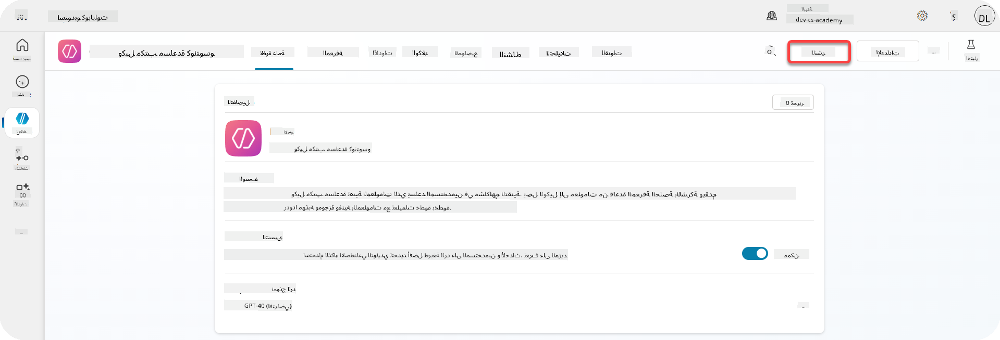

1. حدد زر **نشر** في وكيلك

    يفتح نافذة منبثقة للنشر - لتأكيد أنك تريد حقًا نشر وكيلك.

    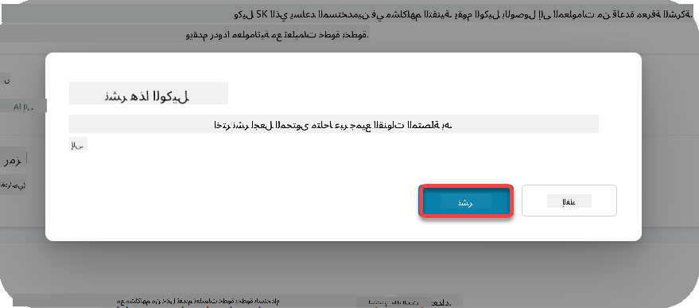

1. حدد **نشر** لتأكيد نشر وكيلك

    الآن تظهر رسالة تفيد بأن وكيلك يتم نشره. لا تحتاج إلى إبقاء تلك النافذة المنبثقة مفتوحة. سيتم إعلامك عندما يتم نشر الوكيل.

    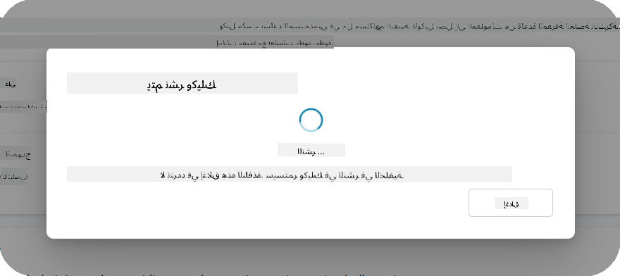

    عندما يتم نشر الوكيل، سترى الإشعار في أعلى صفحة الوكيل.

    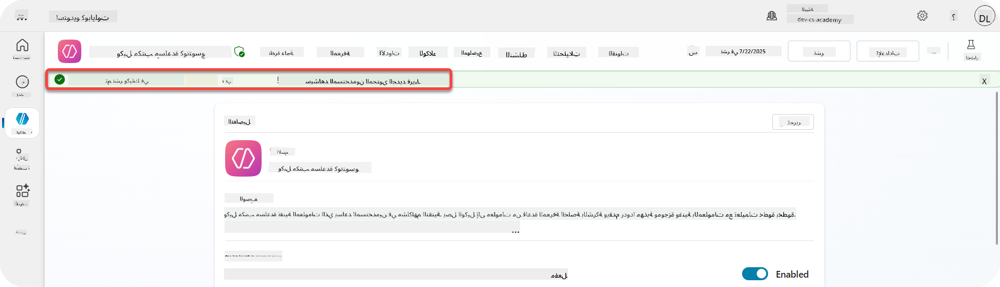

لكن - لقد نشرنا الوكيل فقط، ولم نضفه إلى قناة بعد، لذا دعونا نصلح ذلك الآن!

### 11.2 إضافة قناة Teams وMicrosoft 365 Copilot

1. لإضافة قناة Teams وMicrosoft 365 Copilot إلى وكيلنا، نحتاج إلى تحديد **القناة** في التنقل العلوي للوكيل

    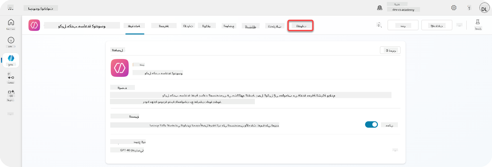

    هنا يمكننا رؤية جميع القنوات التي يمكننا إضافتها إلى هذا الوكيل.

1. حدد **Teams وMicrosoft 365**

    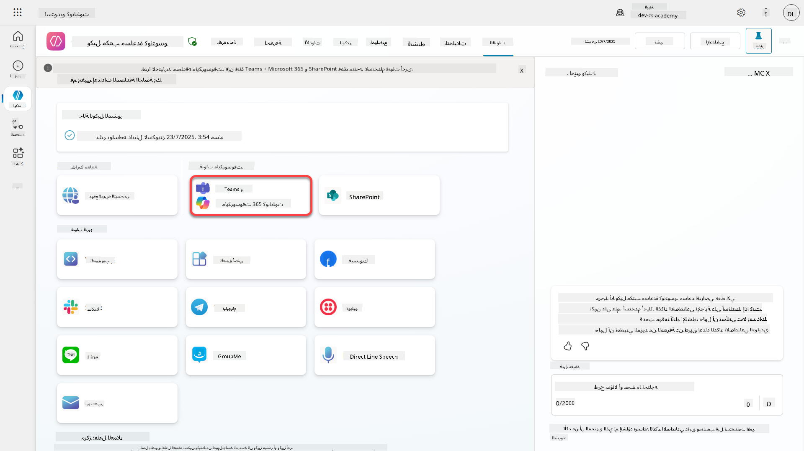

1. حدد **إضافة قناة** لإكمال المعالج وإضافة القناة إلى الوكيل

    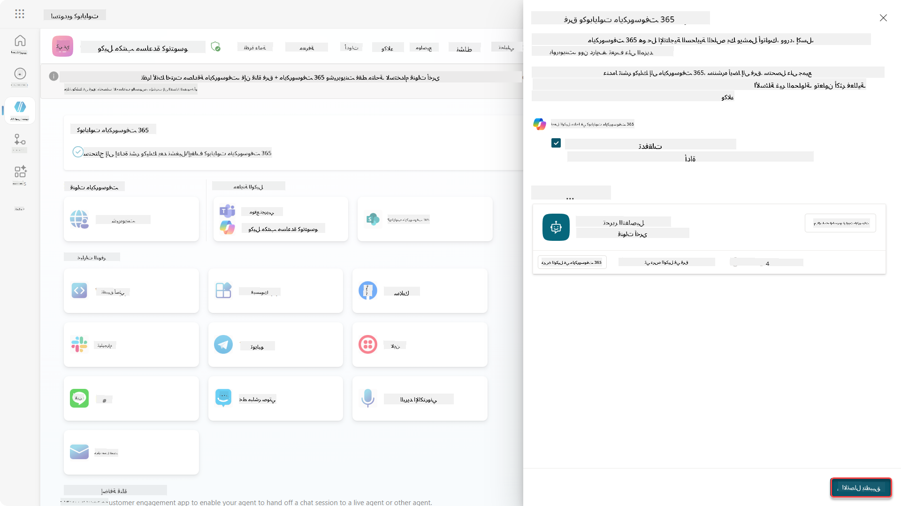

    سيستغرق الأمر بعض الوقت حتى يتم إضافتها. بعد إضافتها، ستظهر إشعار أخضر في أعلى الشريط الجانبي.

    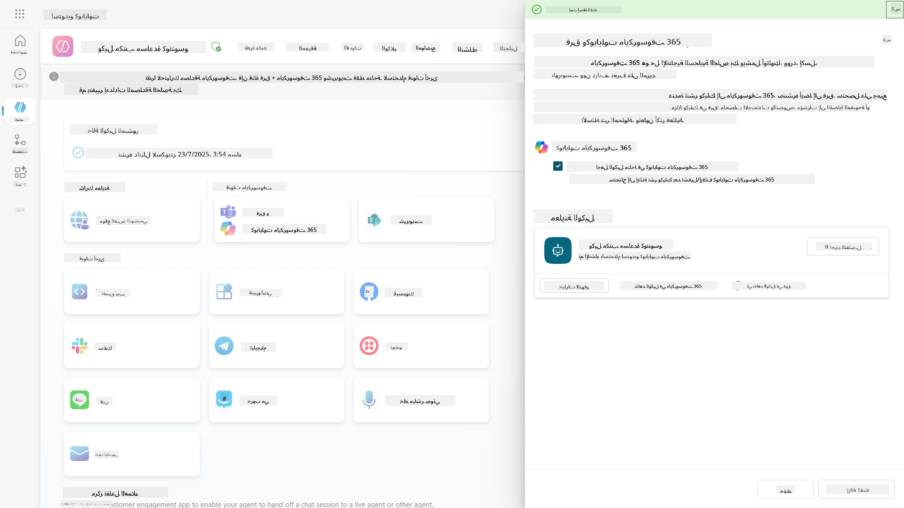

1. حدد **عرض الوكيل في Teams** لفتح علامة تبويب جديدة

    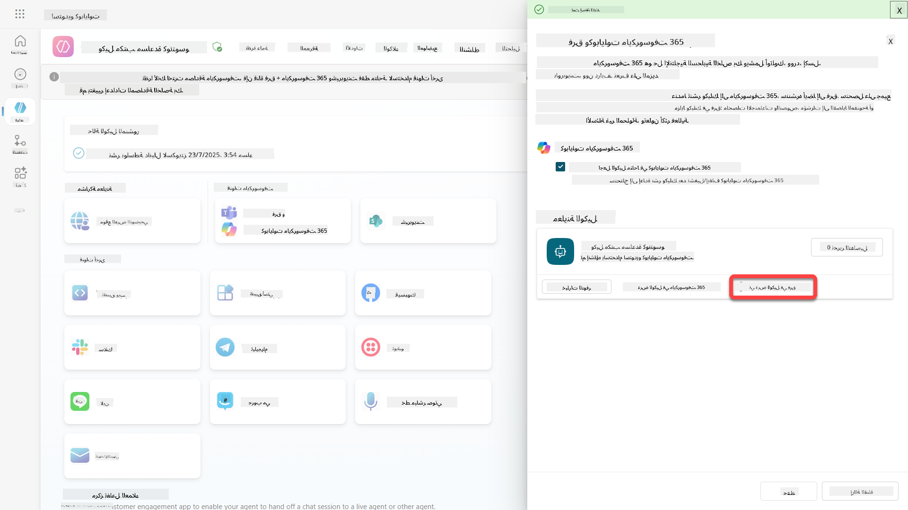

1. حدد **إضافة** لإضافة وكيل مكتب المساعدة Contoso إلى Teams

    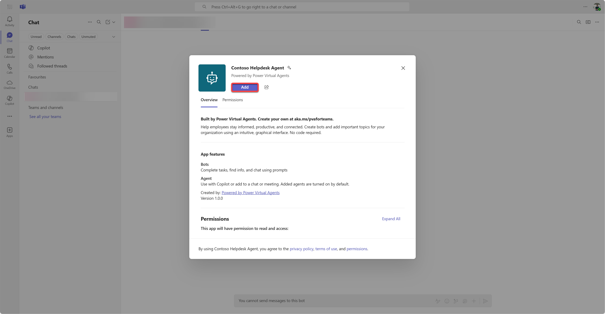

    يجب أن يستغرق هذا بعض الوقت. بعد ذلك، يجب أن تظهر الشاشة التالية:

    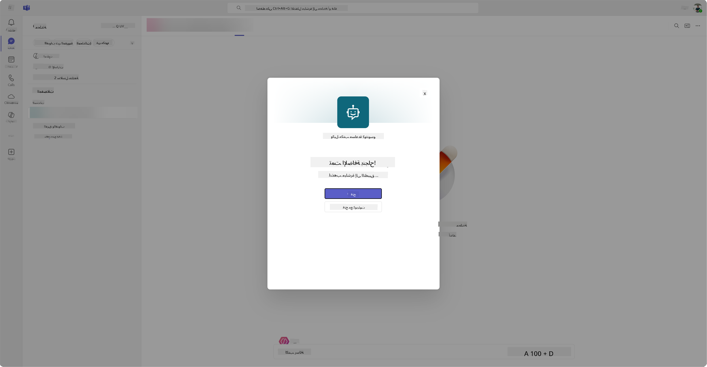

1. حدد **فتح** لفتح الوكيل في Teams

    سيؤدي هذا إلى فتح الوكيل في Teams كتطبيق Teams

    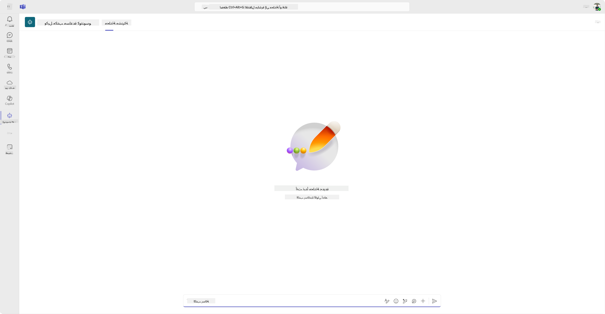

الآن قمنا بنشر الوكيل ليعمل لك في Microsoft Teams، ولكن قد ترغب في جعله متاحًا لمزيد من الأشخاص.

### 11.3 جعل الوكيل متاحًا لجميع المستخدمين في المستأجر

1. أغلق علامة تبويب المتصفح حيث تم فتح وكيل مكتب المساعدة Contoso

    يجب أن يعيدك هذا إلى Copilot Studio حيث لا يزال الشريط الجانبي لـ Teams وMicrosoft 365 Copilot مفتوحًا. لقد فتحنا الوكيل في Teams الآن، ولكن يمكننا القيام بالكثير هنا. يمكننا تحرير تفاصيل الوكيل، يمكننا نشر الوكيل لمزيد من المستخدمين والمزيد.

1. حدد **تحرير التفاصيل**

    
سيؤدي هذا إلى فتح نافذة حيث يمكننا تغيير مجموعة من التفاصيل والإعدادات الخاصة بالوكيل. يمكننا تغيير التفاصيل الأساسية مثل الأيقونة، لون خلفية الأيقونة والوصف. يمكننا أيضًا تغيير إعدادات Teams (على سبيل المثال السماح للمستخدم بإضافة الوكيل إلى فريق، أو السماح باستخدام هذا الوكيل في محادثات المجموعة والاجتماعات) هنا. عند اختيار *المزيد*، يمكنك أيضًا تغيير تفاصيل المطور مثل اسم المطور، الموقع الإلكتروني، بيان الخصوصية وشروط الاستخدام.

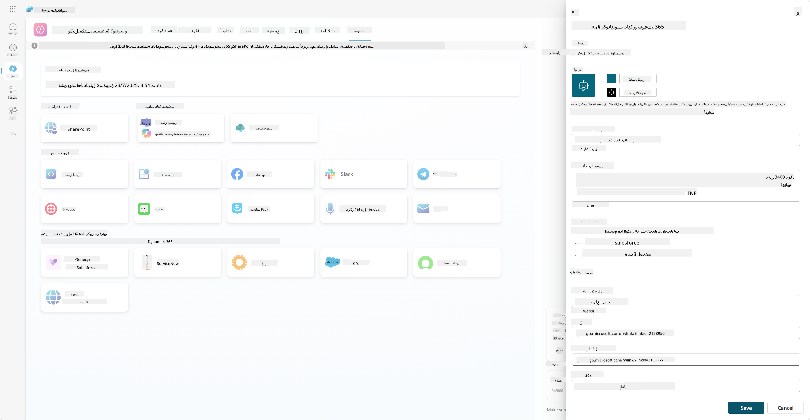

1. اختر **إلغاء** لإغلاق نافذة تعديل التفاصيل.

1. اختر **خيارات التوفر**.

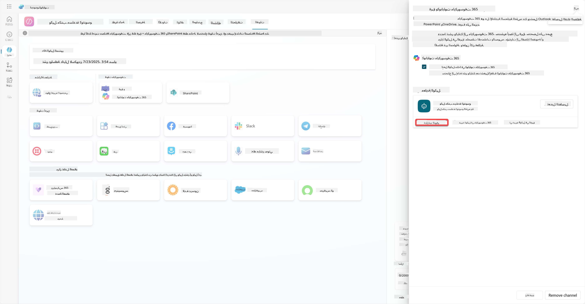

سيؤدي هذا إلى فتح نافذة خيارات التوفر، حيث يمكنك نسخ رابط لإرساله إلى المستخدمين لاستخدام هذا الوكيل (كن على علم، يجب مشاركة الوكيل مع المستخدم أيضًا) ويمكنك تنزيل ملف لإضافة وكيلك إلى متجر Microsoft Teams أو Microsoft 365. لعرض الوكيل في المتجر، لديك خيارات أخرى أيضًا: يمكنك عرضه لزملائك والمستخدمين المشتركين (للعرض في قسم *تم إنشاؤه باستخدام Power Platform*) أو يمكنك عرضه للجميع في مؤسستك (يتطلب موافقة المسؤول).

1. اختر **عرض للجميع في مؤسستي**.

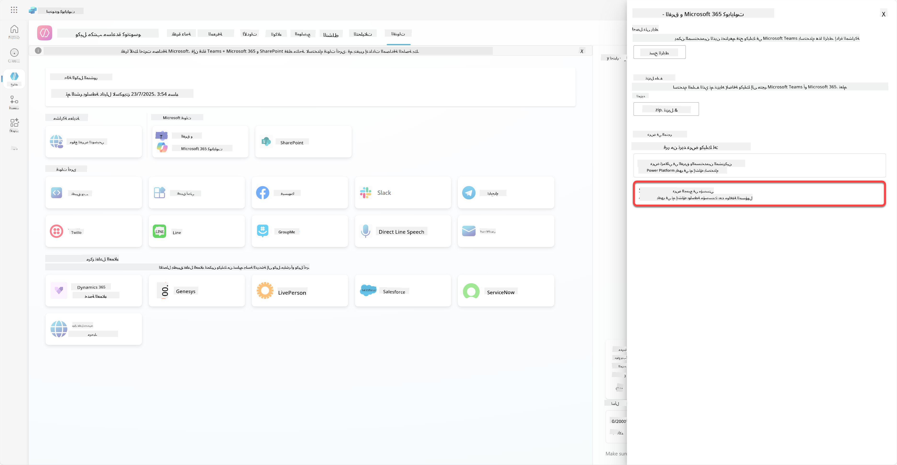

1. اختر **إرسال للموافقة الإدارية**.

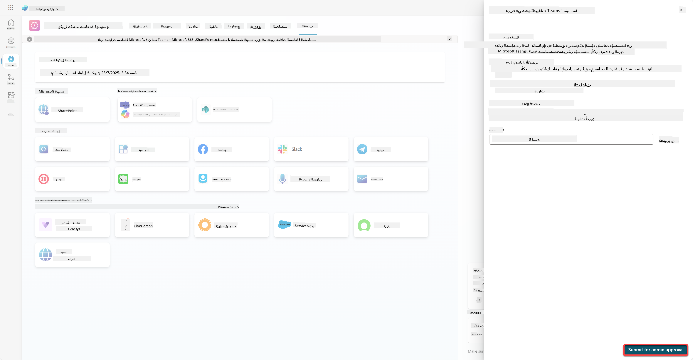

الآن، يجب على المسؤول الموافقة على إرسال وكيلك. يمكنهم القيام بذلك عن طريق الذهاب إلى مركز إدارة Teams والبحث عن وكيل Contoso Helpdesk في التطبيقات. في الصورة يمكنك رؤية ما سيراه المسؤول في مركز إدارة Teams.

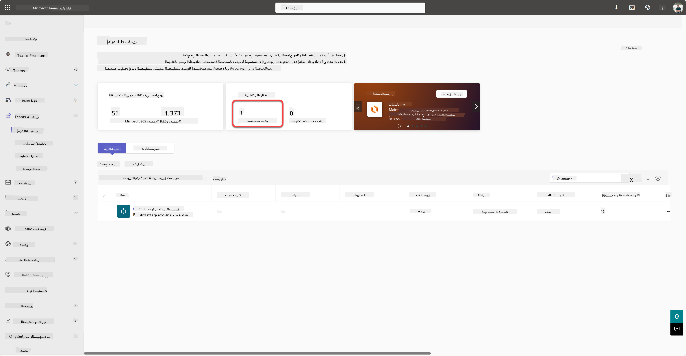

يجب على المسؤول اختيار وكيل Contoso Helpdesk واختيار *نشر* لنشر وكيل Contoso Helpdesk للجميع.

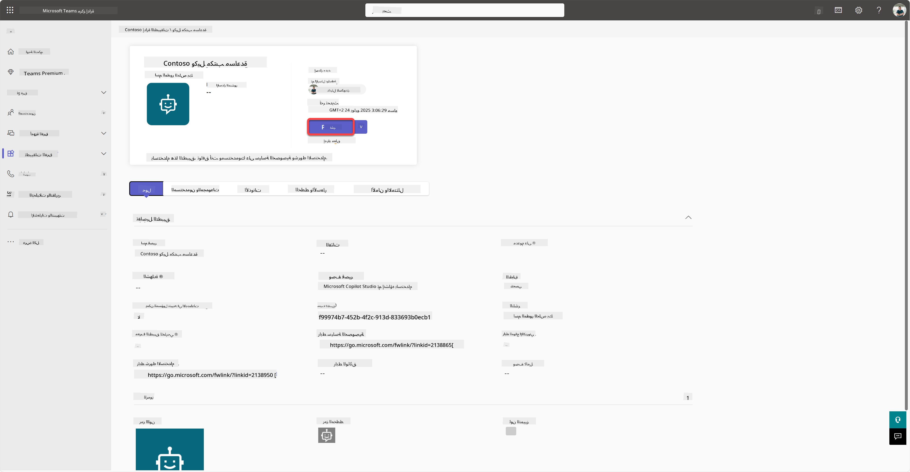

عندما يقوم المسؤول بنشر إرسال الوكيل، ستتمكن من تحديث Copilot Studio ويجب أن ترى شعار *متوفر في متجر التطبيقات* في خيارات التوفر.

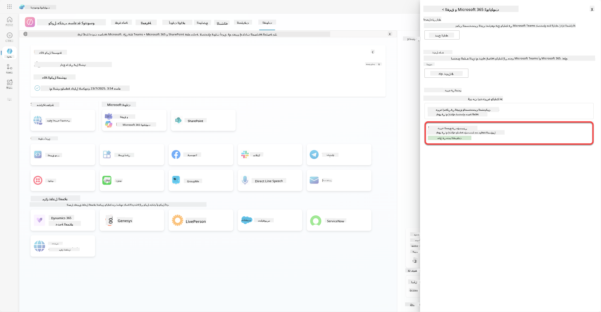

هناك المزيد من الإمكانيات هنا. يمكن للمسؤول تغيير سياسة الإعداد العامة وتثبيت وكيل Contoso Helpdesk تلقائيًا للجميع في المستأجر. بالإضافة إلى ذلك - يمكنك تثبيت وكيل Contoso Helpdesk في الشريط الجانبي الأيسر بحيث يكون الوصول إليه سهلاً للجميع.

## ✅ المهمة مكتملة

🎉 **تهانينا!** لقد نجحت في نشر وكيلك وإضافته إلى Teams وMicrosoft 365 Copilot! المهمة التالية هي المهمة الأخيرة في الدورة: فهم الترخيص.

⏭️ [انتقل إلى درس **فهم الترخيص**](../12-understanding-licensing/README.md)

## 📚 موارد تكتيكية

🔗 [وثائق قنوات النشر](https://learn.microsoft.com/microsoft-copilot-studio/publication-fundamentals-publish-channels)

---

**إخلاء المسؤولية**:  
تم ترجمة هذا المستند باستخدام خدمة الترجمة بالذكاء الاصطناعي [Co-op Translator](https://github.com/Azure/co-op-translator). بينما نسعى لتحقيق الدقة، يرجى العلم أن الترجمات الآلية قد تحتوي على أخطاء أو عدم دقة. يجب اعتبار المستند الأصلي بلغته الأصلية المصدر الرسمي. للحصول على معلومات حاسمة، يُوصى بالترجمة البشرية الاحترافية. نحن غير مسؤولين عن أي سوء فهم أو تفسيرات خاطئة تنشأ عن استخدام هذه الترجمة.