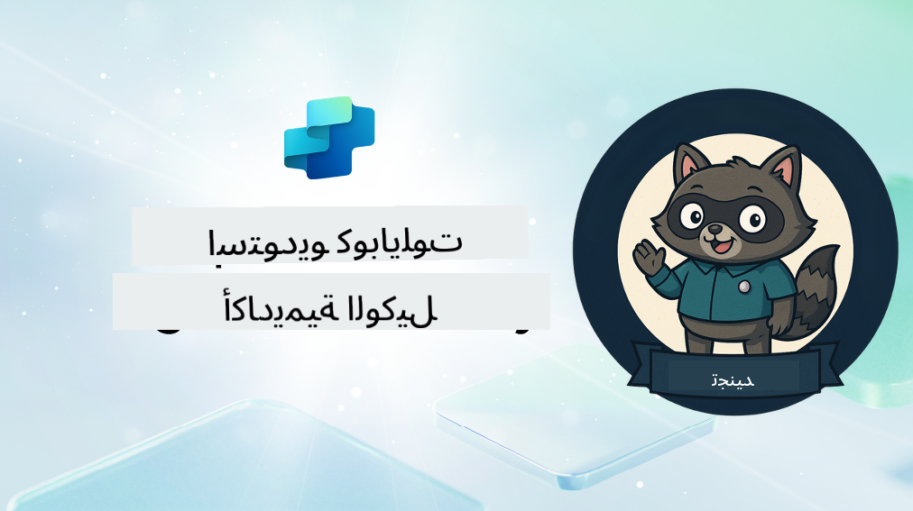

<!--
CO_OP_TRANSLATOR_METADATA:
{
  "original_hash": "8b5ecad9d5d073ea3f4c2b844e80f2e5",
  "translation_date": "2025-10-22T19:19:24+00:00",
  "source_file": "docs/recruit/README.md",
  "language_code": "ar"
}
-->
# مرحباً أيها المجند

**مرحباً بك، أيها المجند.**  
مهمتك - إذا اخترت قبولها - هي إتقان فن بناء الوكلاء باستخدام **Microsoft Copilot Studio**.

هذا التدريب العملي هو بوابتك إلى **عالم الوكلاء**: من إنشاء مطالبات موجهة إلى بطاقات Adaptive Cards وتدفقات الوكلاء، ستتعلم كيفية بناء وتوسيع ونشر وكلاء ذكيين باستخدام أدوات وحالات استخدام واقعية.

---

## 🎯 هدف المهمة

عند إكمال أكاديمية الوكلاء، ستكون قادرًا على:

- فهم ماهية الوكلاء في سياق Microsoft Copilot Studio
- استكشاف كيفية دمج نماذج اللغة الكبيرة (LLMs)، التوليد المعزز بالاسترجاع (RAG)، والتنسيق في الوكيل
- بناء وكلاء **تصريحيين** و**مخصصين**
- تحسين الوكلاء باستخدام **المواضيع**، **بطاقات Adaptive Cards**، و**تدفقات الوكلاء**
- نشر الوكلاء على **Microsoft Teams** و **Microsoft 365 Copilot**

---

## 🧪 المتطلبات الأساسية

لإكمال جميع المهام، ستحتاج إلى:

- حساب مطور Microsoft 365 (مع تمكين SharePoint)
- الوصول إلى **Microsoft Copilot Studio** (نسخة تجريبية أو مرخصة)
- اختياري: معرفة أساسية بـ SharePoint، Power Platform، أو Power Fx

---

## 🧬 لمن هذا مخصص

هذه الدورة مثالية لـ:

- المبدعين والمطورين الذين يستكشفون **Copilot Studio**
- محترفي تكنولوجيا المعلومات الذين يبنون **امتدادات Microsoft 365 Copilot**
- عشاق Power Platform الذين يرغبون في **تطوير مهاراتهم** باستخدام الوكلاء الذكيين
- أي شخص يفضل التعلم من خلال **التجربة العملية**

---

## 🧭 نظرة عامة على المنهج

تنقسم هذه الأكاديمية إلى دروس متقدمة - كل درس مصمم كمهمة ميدانية لتطوير مهاراتك في بناء الوكلاء.

| الدرس | العنوان | ملخص المهمة |
|-------|---------|-------------|
| `00` | 🧰 [إعداد الدورة](./00-course-setup/README.md) | إعداد بيئة التطوير، نسخة Copilot Studio التجريبية، وموقع SharePoint |
| `01` | 🧠 [مقدمة عن الوكلاء](./01-introduction-to-agents/README.md) | فهم مفاهيم الذكاء الاصطناعي الحواري، نماذج اللغة الكبيرة، والوكلاء المستقلين مقابل التصريحيين |
| `02` | 🛠️ [أساسيات Copilot Studio](./02-copilot-studio-fundamentals/README.md) | تعلم الأسس: المعرفة، المهارات، الاستقلالية |
| `03` | 👩‍💻 [إنشاء وكيل تصريحي](./03-create-a-declarative-agent-for-M365Copilot/README.md) | إضافة وكيل خاص بك إلى Microsoft 365 Copilot، مستند إلى مطالبة |
| `04` | 🧩 [إنشاء حل](./04-creating-a-solution/README.md) | تغليف وكيلك في حل قابل لإعادة الاستخدام لإدارة البيئة |
| `05` | 🚀 [البدء مع الوكلاء الجاهزين](./05-using-prebuilt-agents/README.md) | استخدام وتخصيص وكيل نموذجي لتسريع الإعداد |
| `06` | ✍️ [بناء وكيل مخصص](./06-create-agent-from-conversation/README.md) | إنشاء Copilot جديد مستند إلى مصادر المعرفة |
| `07` | 🧠 [إضافة موضوع مع مشغلات](./07-add-new-topic-with-trigger/README.md) | استخدام المواضيع لتحديد مسارات الأسئلة/الإجابات المخصصة |
| `08` | 🪪 [تحسين باستخدام بطاقات Adaptive Cards](./08-add-adaptive-card/README.md) | بناء بطاقة Adaptive باستخدام Power Fx و SharePoint |
| `09` | 🔁 [الأتمتة باستخدام تدفقات الوكلاء](./09-add-an-agent-flow/README.md) | استخدام مدخلات بطاقة Adaptive لتشغيل التدفقات الخلفية |
| `10` | 🧭 [إضافة مشغلات الأحداث](./10-add-event-triggers/README.md) | تمكين وكيلك من العمل بشكل مستقل باستخدام منطق قائم على الأحداث |
| `11` | 📢 [نشر وكيلك](./11-publish-your-agent/README.md) | نشر وكيلك على Microsoft Teams و Microsoft 365 Copilot |
| `12` | 🪪 [فهم الترخيص](./12-understanding-licensing/README.md) | تعلم كيفية عمل الترخيص والفوترة مع Copilot Studio |
| `13` | 🚨 [تأمين شارة المجند الخاصة بك](./course-completion-badges-recruit/README.md) | احصل على شارتك واحتفل بإنجازك! |

!!! note
    ✅ إكمال هذا المنهج يمنحك شارة **المجند**.  
    🔓 سيتم فتح مستويات **العميل** و **القائد** في المراحل المستقبلية.

<!-- markdownlint-disable-next-line MD033 -->

---

**إخلاء المسؤولية**:  
تم ترجمة هذا المستند باستخدام خدمة الترجمة بالذكاء الاصطناعي [Co-op Translator](https://github.com/Azure/co-op-translator). بينما نسعى لتحقيق الدقة، يرجى العلم أن الترجمات الآلية قد تحتوي على أخطاء أو عدم دقة. يجب اعتبار المستند الأصلي بلغته الأصلية المصدر الرسمي. للحصول على معلومات حاسمة، يُوصى بالترجمة البشرية الاحترافية. نحن غير مسؤولين عن أي سوء فهم أو تفسيرات خاطئة تنشأ عن استخدام هذه الترجمة.