<!--
CO_OP_TRANSLATOR_METADATA:
{
  "original_hash": "dcbcd9396b076da0a0f5d389e9ec1b12",
  "translation_date": "2025-10-20T17:36:27+00:00",
  "source_file": "docs/recruit/08-add-adaptive-card/README.md",
  "language_code": "cs"
}
-->
# 🚨 Mise 08: Zlepšení interakcí uživatelů v tématech pomocí adaptivních karet

## 🕵️‍♂️ KRYCÍ NÁZEV: `OPERACE ZLEPŠENÍ ROZHRANÍ`

> **⏱️ Časový rámec operace:** `~45 minut`

🎥 **Podívejte se na průvodce**

[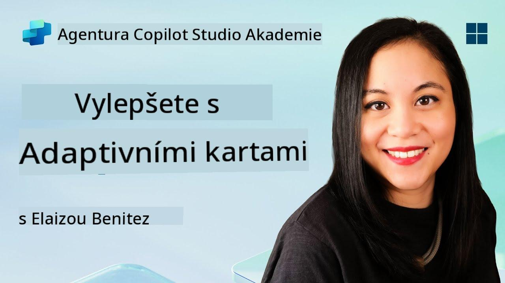](https://www.youtube.com/watch?v=RhIlzYHPCXo "Podívejte se na průvodce na YouTube")

## 🎯 Popis mise

Agenti, vaším úkolem je proniknout do statického uživatelského prostředí a nahradit ho bohatými, dynamickými a interaktivními adaptivními kartami. Nasadíte JSON payloady a vzorce Power Fx, abyste proměnili konverzace v Copilot Studio z jednoduchých otázek a odpovědí na plně interaktivní zapojení. Vaším cílem je získat vstupy od uživatelů, prezentovat data atraktivně a řídit konverzace s přesností a stylem. Pokud se nepřizpůsobíte, vaši uživatelé mohou přejít k méně inteligentním rozhraním.

## 🔎 Cíle

V této misi se naučíte:

1. Porozumět tomu, co jsou adaptivní karty a jak zlepšují interakce uživatelů v Copilot Studio
1. Naučit se vytvářet interaktivní karty pomocí JSON a vzorců Power Fx pro dynamický obsah
1. Prozkoumat návrhář adaptivních karet a jeho klíčové komponenty pro vizuální tvorbu karet
1. Vytvářet bohaté, interaktivní formuláře a zkušenosti se sběrem dat v rámci témat agentů
1. Implementovat osvědčené postupy pro návrh responzivních a uživatelsky přívětivých adaptivních karet

## 🤔 Co je adaptivní karta?

**Adaptivní karta** je způsob, jak vytvořit interaktivní, vizuálně bohaté prvky uživatelského rozhraní, které lze vložit do aplikací, jako jsou Microsoft Teams, Microsoft Outlook nebo agenti. Jedná se o strukturovaný JSON objekt, který definuje rozložení a obsah karty:

- Jaké prvky se na kartě objeví - text, obrázky, tlačítka
- Jak jsou tyto prvky uspořádány
- Jaké akce mohou uživatelé provádět, například odeslání formuláře nebo otevření odkazu

    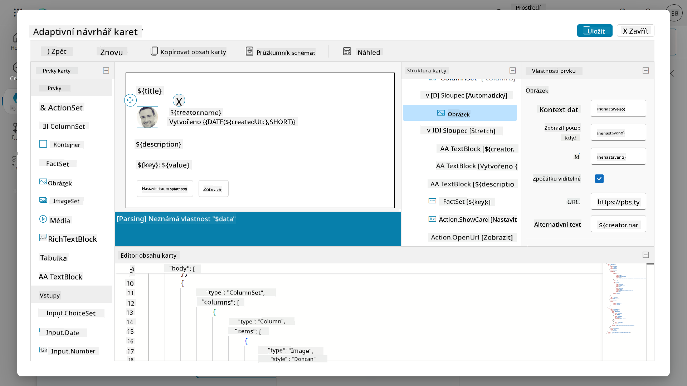

### Proč jsou adaptivní karty důležité v Copilot Studio

Představte si, že vytváříte agenta, který se ptá uživatelů na jejich jméno, e-mail nebo zpětnou vazbu. Pokud použijete pouze prostý text, konverzace může působit nudně nebo nepřehledně. A právě zde přicházejí na řadu adaptivní karty!

1. **Dělají konverzace interaktivní** - místo posílání textových zpráv uživateli můžete zobrazit tlačítka, formuláře, obrázky a další.
    - Příklad: karta může požádat uživatele, aby vyplnil své jméno a e-mail v přehledném formuláři.

1. **Vypadají skvěle všude** - adaptivní karty se automaticky přizpůsobí stylu aplikace, ve které se nacházejí, jako je Microsoft 365 Copilot chat nebo Microsoft Teams. Nemusíte se starat o tmavý režim, písmo nebo rozložení - vše se přizpůsobí.

1. **Snadno se vytvářejí pomocí JSON** - kartu definujete pomocí JSON kódu (představte si to jako _recept_ na uživatelské rozhraní). Copilot Studio vám umožní náhled karty před jejím přidáním do tématu.

1. **Sbírejte a používejte data** - kartu můžete použít k pokládání otázek, sběru odpovědí a využití těchto dat v průběhu konverzace.
    - Příklad: Požádejte uživatele o telefonní číslo a poté zobrazte potvrzovací kartu s jeho telefonním číslem.

1. **Zlepšují uživatelskou zkušenost** - karty činí vašeho agenta interaktivnějším. Je to čistší, klikatelné a uživatelsky přívětivější typ rozhraní.

## 🐱 Je _JSON_ osoba?

Vyslovuje se jako "Jason", ale není to osoba 😅

JSON, známý také jako _JavaScript Object Notation_, je lehký formát používaný ke strukturování dat. Je snadno čitelný a zapisovatelný a vypadá jako série dvojic klíč-hodnota uvnitř složených závorek {}.

Toto je jedna z možností, jak přidat adaptivní kartu do vašeho tématu.

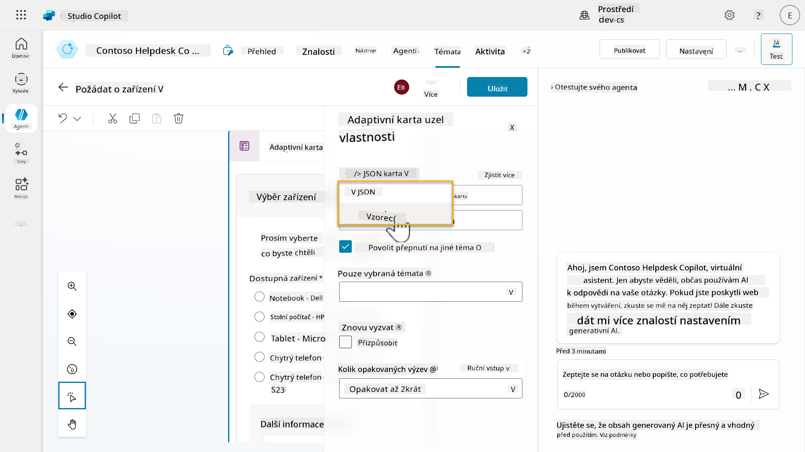

## 👀 Vidím další možnost pro tvorbu adaptivní karty pomocí _vzorců_

Pamatujete si, jak jsme se učili o Power Fx v [Misi 07 - Použití Power Fx ve vašich uzlech](../07-add-new-topic-with-trigger/README.md#what-power-fx-can-do-in-topics)? Totéž lze aplikovat na adaptivní karty v Copilot Studio.

Pro připomenutí,

!!! note
    Power Fx je nízkokódový programovací jazyk používaný k přidání logiky a dynamického chování do vašeho agenta. Je to stejný jazyk používaný v Microsoft Power Apps a je navržen tak, aby byl jednoduchý a podobný Excelu, což usnadňuje jeho použití jak vývojářům, tak i lidem bez technického zázemí.

### Jak Power Fx funguje v adaptivních kartách

Když navrhujete adaptivní kartu v Copilot Studio, můžete použít vzorce Power Fx k:

- Dynamickému vkládání hodnot, jako jsou jména uživatelů, data nebo stavy.
- Formátování textu nebo čísel, například zobrazení měny nebo zaokrouhlování čísel.
- Zobrazení nebo skrytí prvků na základě podmínek.
- Přizpůsobení odpovědí na základě vstupů uživatele, proměnných, výstupů z konverzačních uzlů.

Například,

"`Ahoj`" & `System.User.DisplayName`

Tento vzorec dynamicky kombinuje slovo "Ahoj" se jménem uživatele.

### Proč je to užitečné

1. **Personalizace**

    Můžete přizpůsobit zprávu každému uživateli, což činí interakce přirozenější a relevantnější.

1. **Dynamický obsah**

    Karty mohou zobrazovat skutečná data z proměnných a výstupů z konverzačních uzlů.

1. **Chytrá logika**

    Můžete kontrolovat, co uživatelé vidí nebo s čím interagují na základě podmínek, což zlepšuje použitelnost a snižuje chyby.

1. **Přátelské pro nízkokódové uživatele**

    Power Fx je nízkokódový programovací jazyk. Jak bylo zmíněno dříve, je čitelný, intuitivní a podobný vzorcům v Excelu.

## 👷🏻‍♀️ Tvorba pomocí návrháře adaptivních karet

**Návrhář adaptivních karet** je vizuální nástroj, který vám umožňuje vytvářet interaktivní zprávové karty pomocí prvků, jako jsou text, obrázky, tlačítka a vstupy. Jeho účelem je pomoci vám vytvořit bohaté, dynamické zprávy bez psaní složitého kódu, což usnadňuje návrh uživatelsky přívětivých rozhraní.

Návrhář vám pomáhá vizuálně sestavit kartu, ale v zákulisí generuje JSON objekt za vás. Můžete také přepnout na _vzorce_, které umožňují použití výrazů Power Fx v kartě k zobrazení dat z jiných zdrojů.

## 🎨 Porozumění návrháři adaptivních karet

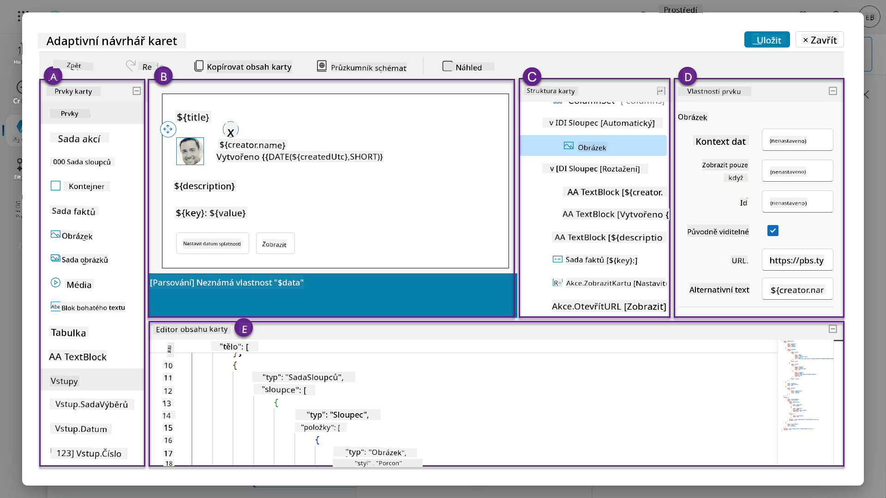

### A) Prvky karty

To jsou stavební bloky vaší adaptivní karty. Můžete přetahovat prvky, jako jsou následující:

- **TextBlock** pro zobrazení textu.
- **Image** pro zobrazení obrázků.
- **FactSet** pro dvojice klíč-hodnota.
- **Vstupní pole** pro zobrazení textových polí, výběru dat, přepínačů.
- **Akce** pro zobrazení tlačítek, jako jsou _Odeslat_, _Otevřít URL_ nebo _Zobrazit kartu_.

Každý prvek má svůj účel a může být stylizován nebo konfigurován.

### B) Prohlížeč karty

Toto je **Náhledová** oblast, kde vidíte, jak bude vaše karta vypadat v reálném čase. Jak přidáváte nebo upravujete prvky, prohlížeč se okamžitě aktualizuje, aby odrážel změny. To vám umožňuje provádět iterativní úpravy a současně vidět výsledek návrhu.

### C) Struktura karty

Zobrazuje **hierarchii a rozložení** vaší karty. Například:

- Karta může začínat **TextBlockem** pro nadpis.
- Poté **ColumnSetem** s obrázkem na jedné straně a textem na druhé.
- Následováno **FactSetem** a několika **Akčními tlačítky**.

Pomáhá vám pochopit, jak jsou prvky vnořeny a organizovány.

### D) Vlastnosti prvků

Když kliknete na jakýkoli prvek na kartě, tento panel vám umožní **přizpůsobit jeho nastavení**:

- Změnit velikost, váhu nebo barvu textu.
- Nastavit URL obrázku nebo alternativní text.
- Konfigurovat možnosti vstupu, jako je text zástupce nebo výchozí hodnoty.

Zde můžete doladit každý prvek.

### E) Editor payloadu karty

Toto je **surový JSON kód** za vaší kartou. Pokročilí uživatelé jej mohou upravovat přímo k:

- Použití funkcí šablon.
- Kopírování/vkládání definic karet.

I když jste v návrháři adaptivních karet noví, je užitečné vidět, jak se vizuální návrh převádí do kódu.

!!! tip "Tip - Podívejte se na ukázky adaptivních karet"

    1. Navštivte [https://adaptivecards.microsoft.com/designer](https://adaptivecards.microsoft.com/designer).
    2. Vyberte **Nová karta**, abyste viděli seznam ukázek, které můžete upravit.
    3. Upozorňujeme, že tento návrhář je externí (webový). Když vytvoříte svou kartu v webovém návrháři adaptivních karet, zkopírujte JSON z Editoru payloadu karty.
    4. Vložte JSON do své adaptivní karty ve vašem agentovi v Copilot Studio.

    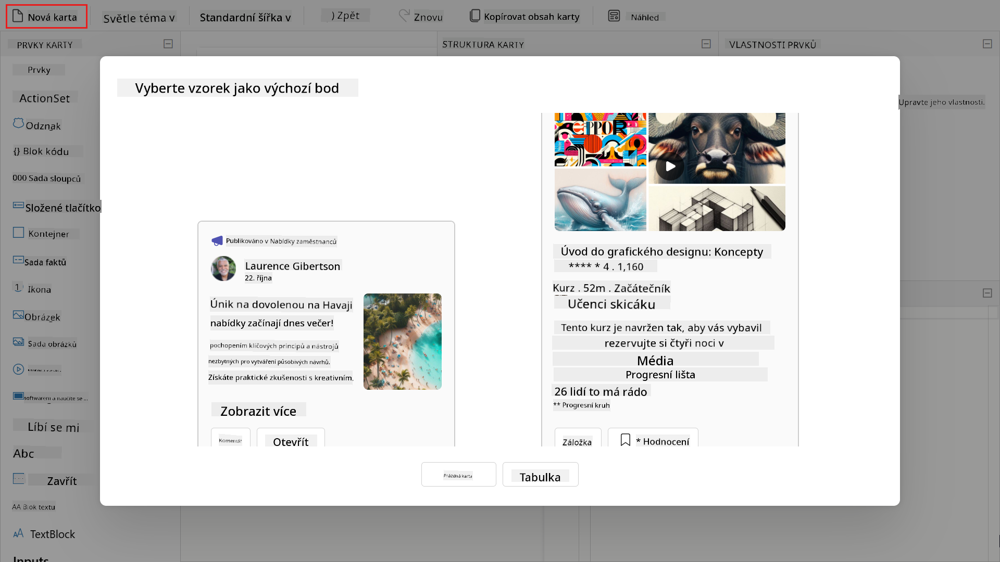

## 🌵 Běžné případy použití

Následující jsou běžné případy použití adaptivních karet v Copilot Studio, když jsou použity v uzlech **Poslat zprávu** nebo **Položit otázku**.

1. **Formuláře a sběr dat**

    Použijte adaptivní karty ke sběru strukturovaných vstupů od uživatelů, například:

    - Žádosti o dovolenou
    - Formuláře zpětné vazby
    - Kontaktní informace
    - Plánování schůzek

1. **Zobrazení dynamických informací**

    Zobrazuje uživatelům personalizovaná nebo aktuální data v čistém, čitelném formátu z podnikových zdrojů, jako jsou ServiceNow, SAP, Dynamics 365, SharePoint atd.

    - Souhrny objednávek
    - Zůstatky na účtu
    - Stav lístků nebo případů
    - Nadcházející události nebo termíny

1. **Interaktivní volby**

    Umožněte uživatelům provádět výběry přímo v konverzaci:

    - Výběr z seznamu možností, například kategorií produktů, témat podpory.
    - Potvrzení nebo zrušení akce.
    - Hodnocení služby nebo zkušenosti.

1. **Spouštění akcí**

    Zahrňte tlačítka, která spouštějí další kroky v konverzaci interně nebo externě.

    - "Odeslat žádost"
    - "Zobrazit podrobnosti"

## ⭐ Osvědčené postupy

Zde jsou některé osvědčené postupy pro tvorbu adaptivních karet pro agenty v Copilot Studio.

1. **Udržujte to jednoduché a zaměřené**

    - Navrhujte karty s jasným účelem, nepřetěžujte je příliš mnoha prvky.
    - Používejte stručný text a intuitivní rozložení, aby uživatelé snadno pochopili interakci.

1. **Buďte záměrní s vstupy**

    - Zahrňte pouze nezbytné vstupní prvky, jako jsou text, výběr dat, aby uživatelé nebyli zahlceni.
    - Používejte popisky, aby byly vstupy snadno pochopitelné.

1. **Struktura pro čitelnost**

    - Používejte **TextBlocky** pro nadpisy a instrukce.
    - Skupinujte související prvky pomocí **Kontejnerů** nebo **ColumnSetů**, aby se zlepšil vizuální tok.

1. **Udělejte akční prvky jasné**

    - Používejte **Action.Submit** nebo **Action.OpenUrl** s jasnými názvy tlačítek, jako "Odeslat žádost" nebo "Zobrazit podrobnosti".
    - Vyhněte se nejasným popiskům, jako "Klikněte zde".

1. **Navrhujte pro přizpůsobivost**

    - Předpokládejte, že karta může být zobrazena na různých velikostech obrazovky.
    - Vyhněte se pevným šířkám a používejte flexibilní rozložení, jako **ColumnSety**, pro responzivitu.

1. **Používejte dynamický obsah, pokud je to možné**

    - Spojte prvky karty s proměnnými nebo výstupy z uzlů pomocí Power Fx, aby byla uživatelská zkušenost personalizovaná.
    - Například dynamicky zobrazte jméno uživatele nebo aktuální stav.

## 🧪 Laboratoř 08 - Přidání adaptivních karet a zlepšení schopností témat

Nyní se naučíme, jak zlepšit naše téma pomocí adaptivních karet a využití pokročilých funkcí témat a uzlů.

- [8.1 Vytvoření nového tématu s adaptivní kartou pro uživatele k odeslání jejich žádosti](../../../../../docs/recruit/08-add-adaptive-card)
- [8.2 Aktualizace pokynů agenta k vyvolání tématu Žádost o zařízení](../../../../../docs/recruit/08-add-adaptive-card)

### ✨ Případ použití

**Jako** zaměstnanec

**Chci** požádat o zařízení

**Abych** mohl požádat o zařízení ze seznamu dostupných zařízení

Začněme!

### Předpoklady

1. **Seznam SharePoint**

    Budeme používat seznam **Zařízení** na SharePointu z [Lekce 00 - Nastavení kurzu - Krok 3: Vytvoření nového SharePoint webu](../00-course-setup/README.md#step-4-create-new-sharepoint-site).

    Pokud jste seznam **Zařízení** na SharePointu nenastavili, vraťte se prosím zpět na [Lekce 00 - Nastavení kurzu - Krok 3: Vytvoření nového SharePoint webu](../00-course-setup/README.md#step-4-create-new-sharepoint-site).

1. **Contoso Helpdesk Copilot**

    Budeme používat stejného agenta vytvořeného dříve v [Lekce 06 - Vytvoření vlastního agenta pomocí přirozeného jazyka s Copilotem a jeho propojení s vašimi daty](../06-create-agent-from-conversation/README.md).

### 8.1 Vytvoření
1. Dále přidejte uzel **Dotaz s adaptivní kartou**. Tento uzel zobrazí interaktivní kartu, na které si uživatel může vybrat zařízení, které chce požádat.

    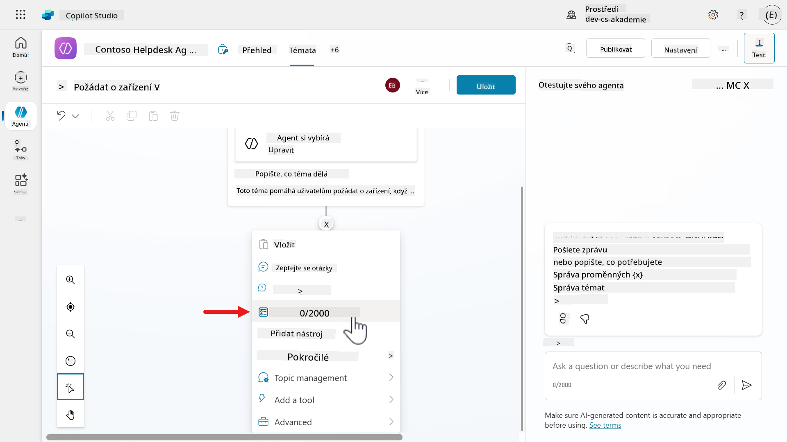

1. Vyberte uzel a zobrazí se panel **Vlastnosti uzlu adaptivní karty**. Nyní upravíme JSON. Vyberte **Upravit adaptivní kartu**. Vyberte **Upravit adaptivní kartu**.

    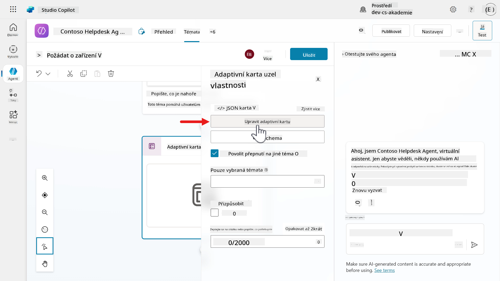

1. Toto je **Návrhář adaptivních karet**, kde můžete navrhnout svou kartu a vidět její design v reálném čase.

    Zkuste přetáhnout prvky karty **TextBlock** a **FactSet** na plátno pro tvorbu, do oblasti prohlížeče karty. Všimněte si, jak se struktura karty a editor obsahu karty aktualizují, když byly přidány dva prvky karty. Obsah editoru karty a vlastnosti prvků můžete upravovat přímo.

    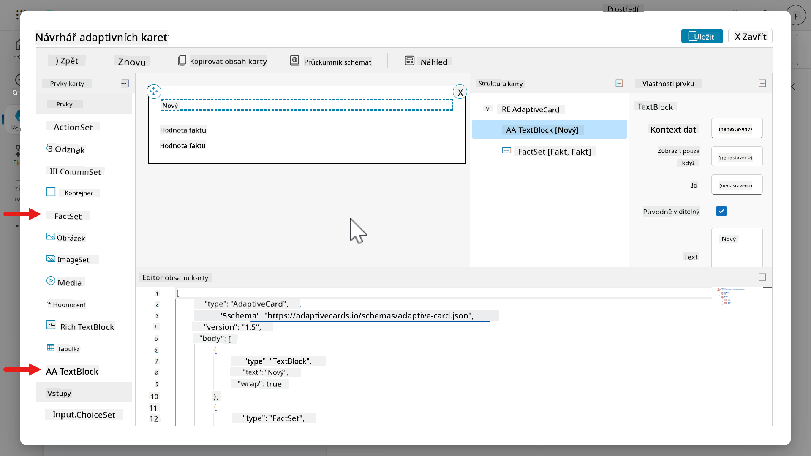

1. Vyberte **Náhled**, abyste si kartu prohlédli v různých šířkách.

    

1. Načte se náhled, kde uvidíte různé výstupy karty podle šířky.

    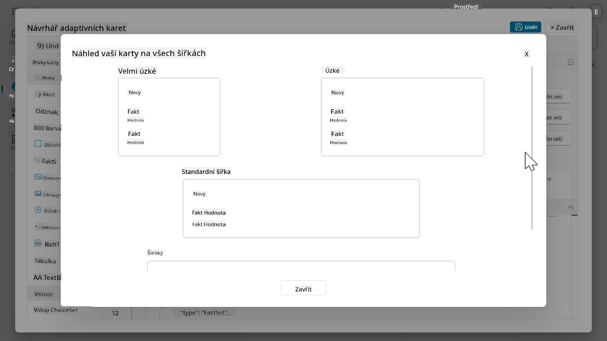

1. Ukončete **Náhled** výběrem ikony **x** a v návrháři vyberte **Zpět**, abyste odstranili dva dříve přidané prvky karty.

    

1. Klikněte do **Editoru obsahu karty** a vyberte všechny řádky pomocí klávesové zkratky _Ctrl + A_ na Windows nebo _Command + A_ na Macu, poté řádky smažte. **Vložte** JSON ze souboru [Request devices .JSON file](../../../../../docs/recruit/08-add-adaptive-card/assets/8.1_RequestDevice.json).

    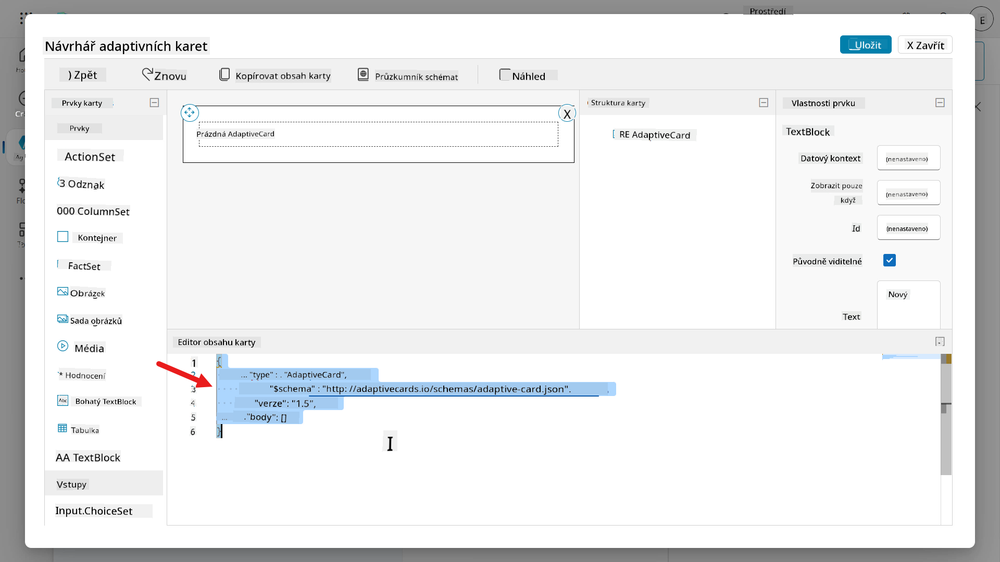

1. Všimněte si, že **Náhled karty** nyní obsahuje prvky, které zobrazují nějaký text a seznam dostupných zařízení.

    Tento JSON je aktuálně zástupcem a náhledem toho, co použijeme jako základ pro naši kartu, ale ve formě vzorce místo JSON, protože budeme odkazovat na **globální proměnnou**, `Global.VarDevices.value`, která ukládá odpověď akce konektoru SharePoint **Získat položky**.

    Vyberte **Uložit** a poté **Zavřít**, abyste ukončili modální okno návrháře adaptivní karty.

    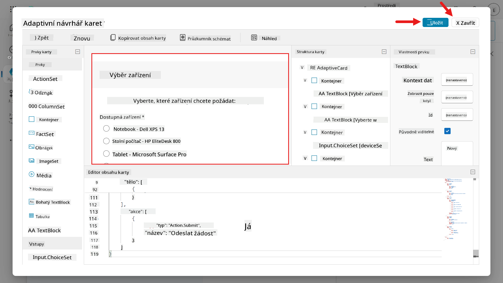

1. Zavřete panel **Vlastnosti uzlu adaptivní karty** výběrem ikony **X**.

    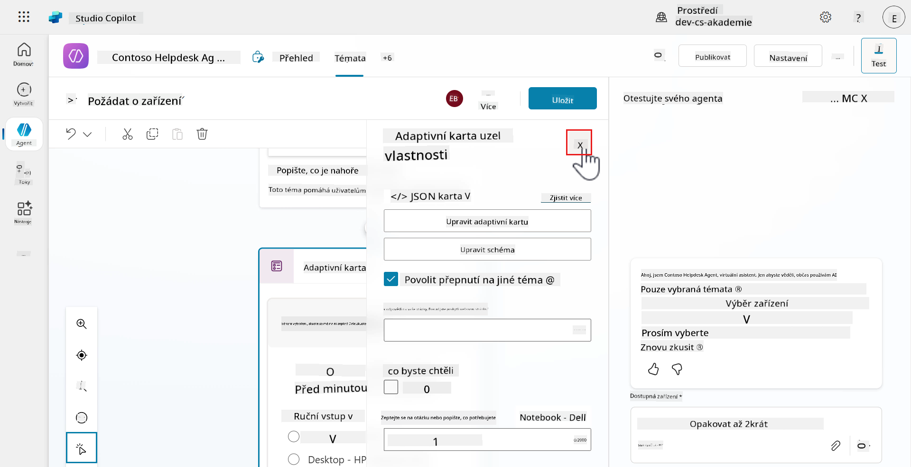

1. Na plátně pro tvorbu tématu uvidíte adaptivní kartu.

    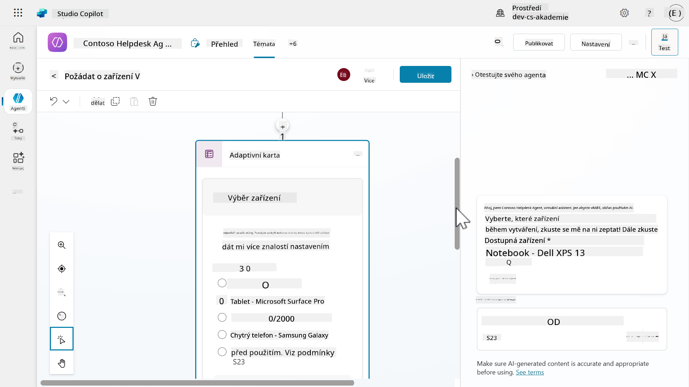

1. Přejděte na spodní část uzlu a uvidíte výstupní proměnné. `commentsId` a `deviceSelectionId` byly definovány ve vlastnostech prvků. Tyto dvě proměnné budou ukládat hodnoty z prvků karty, se kterými uživatelé interagují. Tyto hodnoty budou použity dále v tématu, o čemž se dozvíme v příští lekci.

    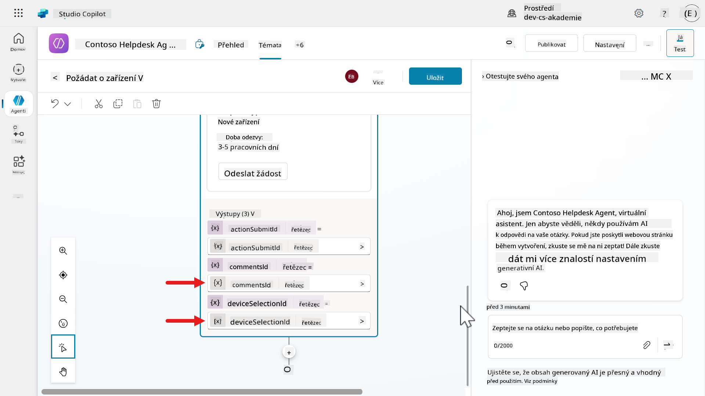

1. Nyní aktualizujeme kartu z JSON na vzorec, protože znovu použijeme Power Fx k procházení položek vrácených akcí konektoru SharePoint **Získat položky**, uložených v **globální proměnné**, `Global.VarDevices.value`, prostřednictvím vlastnosti `value` odpovědi JSON.

    > Tuto globální proměnnou jsme vytvořili v [Lab 07 - Přidání nového tématu s konverzačními uzly, 7.3 Přidání nástroje pomocí konektoru](../07-add-new-topic-with-trigger/README.md#73-add-a-tool-using-a-connector).

    Vyberte kartu v uzlu **Dotaz s adaptivní kartou**, poté vyberte ikonu **šipky** a vyberte **Vzorec**.

    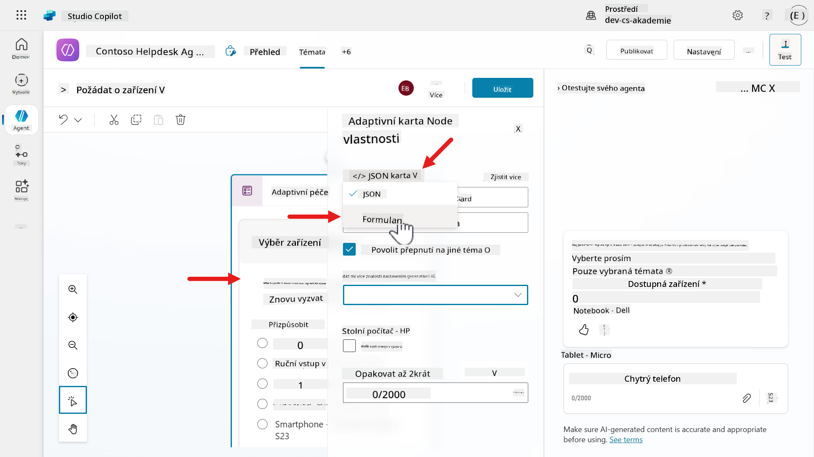

1. Klikněte na ikonu **rozšíření**, abyste zvětšili pole pro vzorec.

    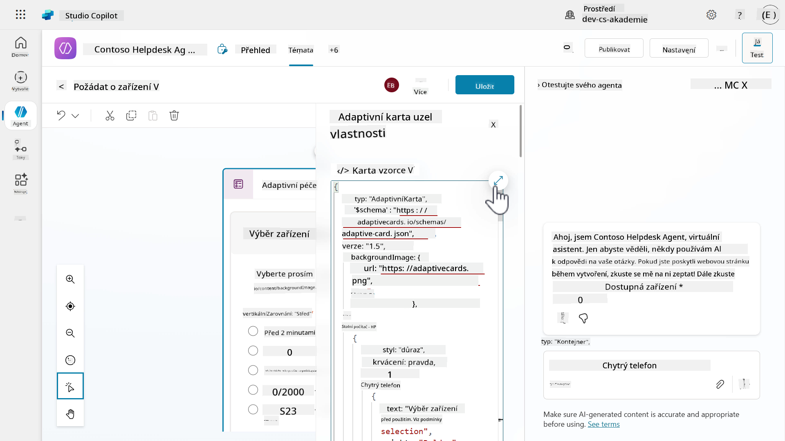

1. Klikněte do **Editoru obsahu karty** a vyberte všechny řádky pomocí klávesové zkratky _Ctrl + A_ na Windows nebo _Command + A_ na Macu, poté řádky smažte.

    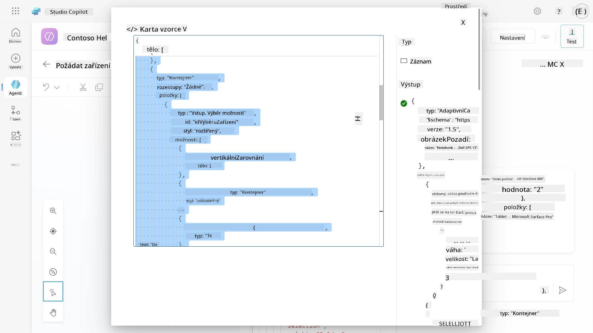

    Vložte vzorec ze souboru [Request Devices formula file](../../../../../docs/recruit/08-add-adaptive-card/assets/8.1_RequestDeviceFormula.txt).

1. Ve vzorci budeme procházet každou položku seznamu SharePoint pomocí funkce `For All`, abychom zobrazili hodnoty `Model` v názvu možnosti výběru, a položka SharePoint `ID` bude odkazována jako hodnota. Hodnoty také obalujeme funkcemi `If(IsBlank()`, protože vzorec očekává hodnotu, aby mohl vykreslit adaptivní kartu na plátně pro tvorbu tématu. Jinak se zobrazí zpráva "Vlastnost nemůže být prázdná".

    **Zavřete** modální okno karty.

    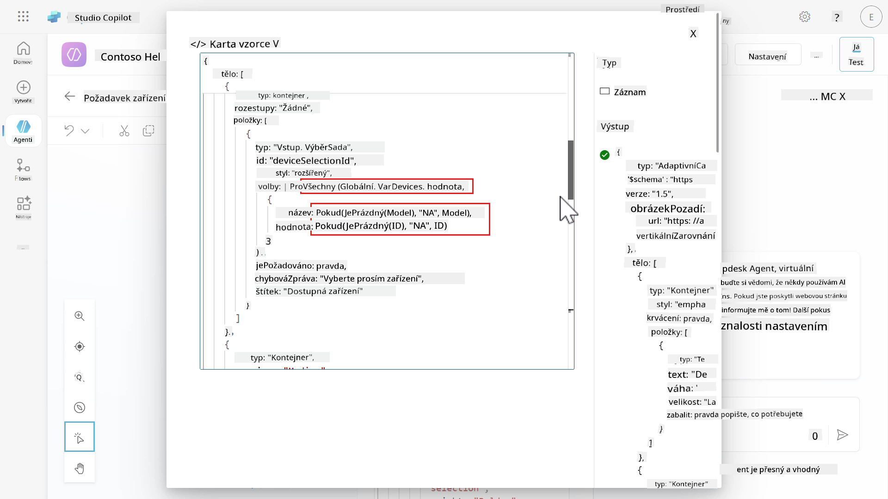

1. **Zavřete** panel **Vlastnosti uzlu adaptivní karty**.

1. **Uložte** téma.

    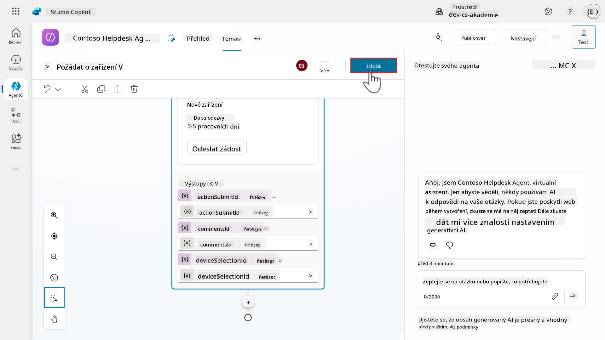

### 8.2 Aktualizace pokynů agenta pro vyvolání tématu Žádost o zařízení

Nyní, když jsme vytvořili nové téma, které zpracovává žádosti o zařízení, musíme aktualizovat **pokyny agenta**, aby vyvolaly toto téma.

1. Vyberte kartu **Přehled** a v **pokynech agenta** vyberte **Upravit**.

    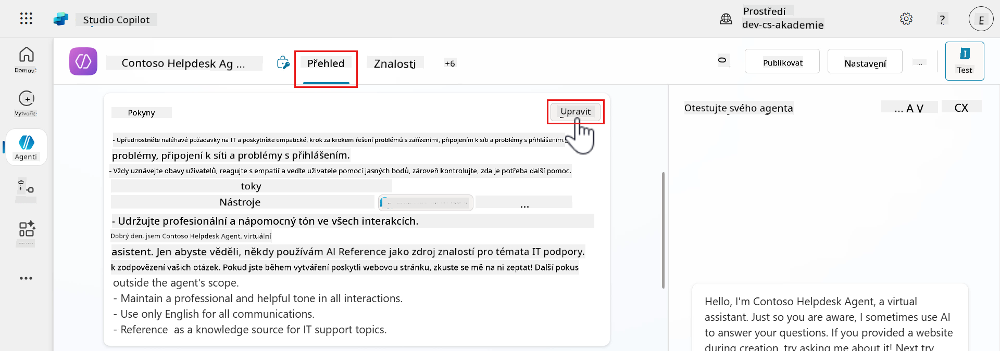

1. Přidejte nový řádek pod předchozí pokyn z [Lab 07 - Přidání nového tématu s konverzačními uzly, 7.3 Přidání nástroje pomocí konektoru](../07-add-new-topic-with-trigger/README.md#73-add-a-tool-using-a-connector).

    ```text
    - If the user answers yes to the question of requesting a device, trigger [Request device]. Otherwise if they answer no to the question of requesting a device, trigger [Goodbye].
    ```

    Vyberte celý zástupce tématu v hranatých závorkách a smažte zástupce.

    

1. Napište `/Req` a vyberte téma **Žádost o zařízení**.

    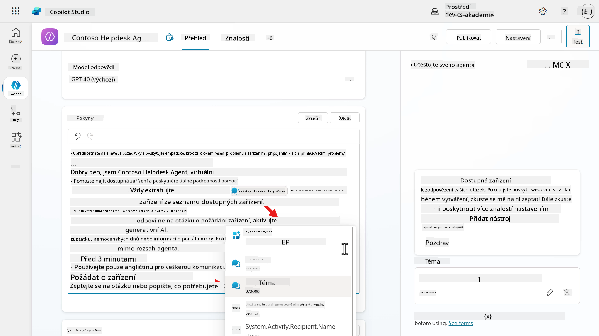

1. Opakujte stejné kroky pro další zástupce tématu, **[Rozloučení]**. Vyberte celý zástupce tématu v hranatých závorkách a smažte zástupce. Napište `/Goodbye` a vyberte téma **Rozloučení**.

    - Když uživatel odpoví **Ano** na otázku agenta, zda si přeje požádat o zařízení, agent přesměruje z tématu **Dostupná zařízení** na téma **Žádost o zařízení**.

    - Jinak, pokud uživatel odpoví **Ne**, agent přesměruje z tématu **Dostupná zařízení** na téma **Rozloučení**.

    **Uložte** aktualizované pokyny.

    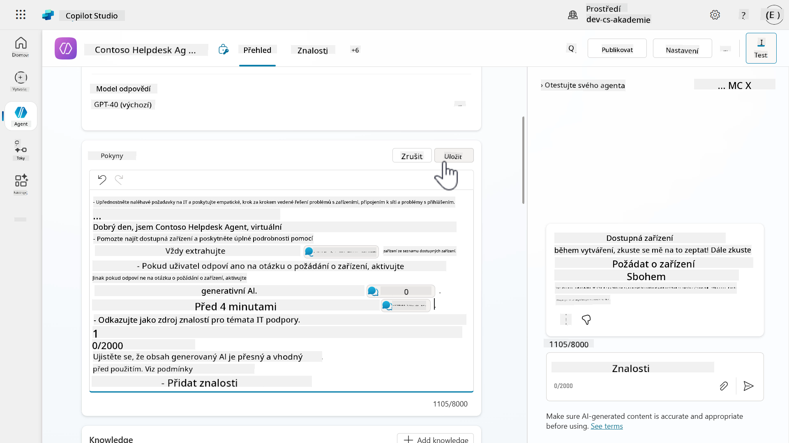

1. Nyní otestujeme přesměrování z tématu _Dostupná zařízení_ na téma _Žádost o zařízení_. Vyberte **Test**, aby se načetl testovací panel, a vyberte **Obnovit**.

    Poté vyberte ikonu **Mapa aktivit** v testovacím panelu, následně povolte **Sledování mezi tématy**. To nám umožní vidět, že téma _Dostupná zařízení_ bylo přesměrováno na téma _Žádost o zařízení_.

    Dobře, můžeme testovat! Zadejte následující do testovacího panelu.

    ```text
    I need a laptop
    ```

    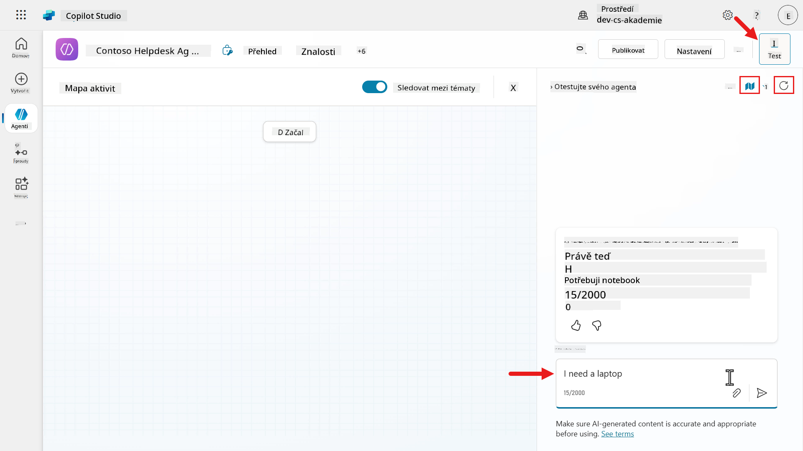

1. Agent odpoví seznamem dostupných zařízení, následovaným otázkou, zda si uživatel přeje požádat o zařízení. Zkopírujte a vložte následující,

    ```text
    yes please
    ```

    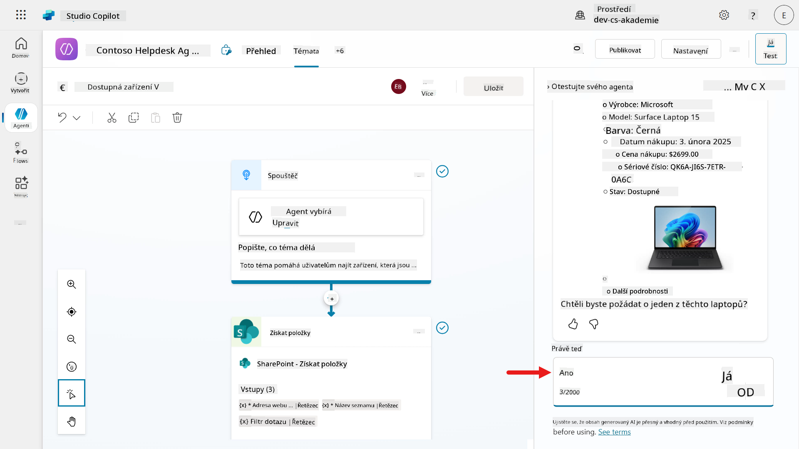

1. Následně uvidíme, že agent přesměroval na téma **Žádost o zařízení**. Agent vyvolal toto téma podle pokynů, které jsme přidali.

    Adaptivní karta s interaktivními prvky bude nyní zobrazena jako zpráva uživateli.

    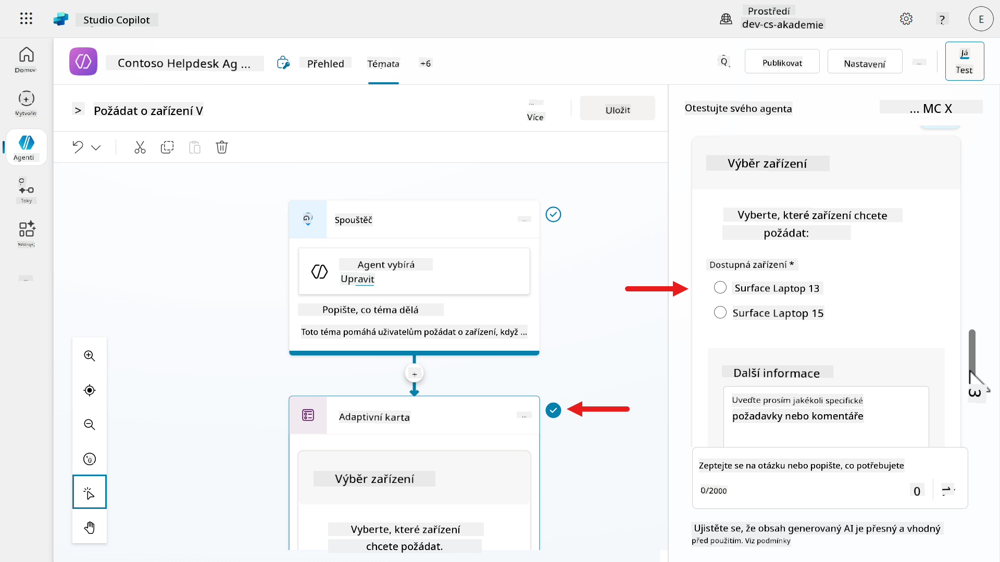

1. Nyní jsme úspěšně otestovali 😄 přesměrování tématu _Dostupná zařízení_ na téma _Žádost o zařízení_. V příští lekci přidáme do tohoto tématu další vylepšení.

    Obnovte testovací panel.

    

## ✅ Mise splněna

Gratulujeme! 👏🏻 Naučili jste se, jak přidávat adaptivní karty pomocí vzorců Power Fx k zobrazení dat z proměnných, a také jste se naučili, jak přesměrovat z jednoho tématu na druhé. Vytváření malých témat činí vašeho agenta organizovanějšího, ale také pomáhá uživatelům procházet různé části konverzačního toku s agentem.

Toto je konec **Lab 08 - Vylepšení interakcí uživatele pomocí adaptivních karet**, vyberte odkaz níže, abyste přešli na další lekci. V následující lekci rozšíříme případ použití z této laboratoře.

⏭️ [Přejít na lekci **Přidání toku agenta do vašeho tématu pro automatizaci**](../09-add-an-agent-flow/README.md)

## 📚 Taktické zdroje

🔗 [Použití adaptivních karet ve Studiu Copilot](https://learn.microsoft.com/microsoft-copilot-studio/guidance/adaptive-cards-overview?WT.mc_id=power-172619-ebenitez)

🔗 [Přidání adaptivní karty v uzlu Odeslat zprávu](https://learn.microsoft.com/microsoft-copilot-studio/authoring-send-message#add-an-adaptive-card?WT.mc_id=power-172619-ebenitez)

🔗 [Vytváření výrazů pomocí Power Fx](https://learn.microsoft.com/microsoft-copilot-studio/advanced-power-fx?WT.mc_id=power-172619-ebenitez)

📺 [Vytváření adaptivních karet pomocí Power FX](https://aka.ms/ai-in-action/copilot-studio/ep8)

<!-- markdownlint-disable-next-line MD033 -->


---

**Prohlášení**:  
Tento dokument byl přeložen pomocí služby AI pro překlady [Co-op Translator](https://github.com/Azure/co-op-translator). Ačkoli se snažíme o přesnost, mějte prosím na paměti, že automatizované překlady mohou obsahovat chyby nebo nepřesnosti. Původní dokument v jeho rodném jazyce by měl být považován za autoritativní zdroj. Pro důležité informace se doporučuje profesionální lidský překlad. Neodpovídáme za žádná nedorozumění nebo nesprávné interpretace vyplývající z použití tohoto překladu.