<!--
CO_OP_TRANSLATOR_METADATA:
{
  "original_hash": "4fb913dfc3bbc71506dd3602c4b8e6ed",
  "translation_date": "2025-10-17T19:21:21+00:00",
  "source_file": "docs/operative-preview/02-multi-agent/README.md",
  "language_code": "de"
}
-->
# 🚨 Mission 02: Verbundene Agenten

--8<-- "disclaimer.md"

## 🕵️‍♂️ CODENAME: `OPERATION SYMPHONY`

> **⏱️ Zeitfenster der Operation:** `~45 Minuten`

## 🎯 Missionsbeschreibung

Willkommen zurück, Agent. In Mission 01 haben Sie Ihren Haupt-Hiring-Agent erstellt – eine solide Grundlage für die Verwaltung von Rekrutierungsabläufen. Aber ein einzelner Agent kann nur begrenzt viel leisten.

Ihre Aufgabe, falls Sie sie annehmen, ist **Operation Symphony** – die Transformation Ihres einzelnen Agenten in ein **Multi-Agenten-System**: ein orchestriertes Team von spezialisierten Agenten, die zusammenarbeiten, um komplexe Herausforderungen im Einstellungsprozess zu bewältigen. Stellen Sie sich das wie ein Upgrade von einem Einzelkämpfer hin zu einem Kommandanten einer spezialisierten Taskforce vor.

Wie ein Symphonieorchester, bei dem jeder Musiker seinen Teil in perfekter Harmonie spielt, fügen Sie Ihrem bestehenden Hiring-Agent zwei wichtige Spezialisten hinzu: einen Application Intake Agent, der Lebensläufe automatisch verarbeitet, und einen Interview Prep Agent, der umfassende Interviewmaterialien erstellt. Diese Agenten arbeiten nahtlos unter Ihrem Hauptorchestrator zusammen.

## 🔎 Ziele

In dieser Mission lernen Sie:

1. Wann man **Child Agents** gegenüber **Connected Agents** verwendet  
1. Wie man **Multi-Agenten-Architekturen** entwirft, die skalierbar sind  
1. Erstellung von **Child Agents** für fokussierte Aufgaben  
1. Etablierung von **Kommunikationsmustern** zwischen Agenten  
1. Aufbau des Application Intake Agent und des Interview Prep Agent  

## 🧠 Was sind verbundene Agenten?

In Copilot Studio sind Sie nicht darauf beschränkt, einzelne, monolithische Agenten zu erstellen. Sie können **Multi-Agenten-Systeme** erstellen – Netzwerke von spezialisierten Agenten, die zusammenarbeiten, um komplexe Arbeitsabläufe zu bewältigen.

Stellen Sie sich das wie eine reale Organisation vor: Anstatt dass eine Person alles erledigt, gibt es Spezialisten, die in bestimmten Aufgabenbereichen herausragend sind und bei Bedarf zusammenarbeiten.

### Warum Multi-Agenten-Systeme wichtig sind

- **Skalierbarkeit:** Jeder Agent kann unabhängig von verschiedenen Teams entwickelt, getestet und gewartet werden.  
- **Spezialisierung:** Agenten können sich auf das konzentrieren, was sie am besten können. Vielleicht einer für Datenverarbeitung, ein anderer für Benutzerinteraktion, ein weiterer für Entscheidungsfindung.  
- **Flexibilität:** Sie können Agenten kombinieren, wiederverwenden und Ihr System schrittweise weiterentwickeln.  
- **Wartbarkeit:** Änderungen an einem Agenten beeinflussen nicht zwangsläufig andere, was Updates sicherer und einfacher macht.

### Beispiel aus der Praxis: Einstellungsprozess

Betrachten Sie unseren Einstellungsablauf – mehrere Agenten könnten zusammenarbeiten und folgende Aufgaben übernehmen:

- **Lebenslaufannahme** erfordert Fähigkeiten zur Dokumentenverarbeitung und Datenextraktion  
- **Bewertung** beinhaltet die Evaluierung von Kandidatenlebensläufen und deren Abgleich mit Stellenanforderungen  
- **Interviewvorbereitung** benötigt tiefgehende Überlegungen zur Eignung des Kandidaten  
- **Kandidatenkommunikation** erfordert einfühlsame Kommunikationsfähigkeiten  

Anstatt einen riesigen Agenten zu erstellen, der versucht, all diese unterschiedlichen Fähigkeiten zu bewältigen, können Sie spezialisierte Agenten für jeden Bereich erstellen und sie zusammen orchestrieren.

## 🔗 Child Agents vs Connected Agents: Der entscheidende Unterschied

Copilot Studio bietet zwei Möglichkeiten, Multi-Agenten-Systeme zu erstellen, die jeweils unterschiedliche Anwendungsfälle haben:

### ↘️ Child Agents

Child Agents sind **leichte Spezialisten**, die innerhalb Ihres Hauptagenten leben. Denken Sie an sie wie an spezialisierte Teams innerhalb derselben Abteilung.

#### Wichtige technische Details

- Child Agents leben innerhalb des Parent-Agenten und haben eine einzige Konfigurationsseite.  
- Tools und Wissen werden **im Parent-Agent gespeichert**, aber so konfiguriert, dass sie dem Child Agent "zur Verfügung stehen".  
- Child Agents **teilen die Themen** ihres Parent-Agenten. Themen können von den Anweisungen des Child Agent referenziert werden.  
- Child Agents **müssen nicht separat veröffentlicht werden** – sie sind automatisch innerhalb ihres Parent-Agent verfügbar, sobald sie erstellt wurden. Dies erleichtert das Testen, da Änderungen am Parent- und Child-Agent im **selben gemeinsamen Arbeitsbereich** vorgenommen werden können.

#### Verwenden Sie Child Agents, wenn

- Ein einziges Team die gesamte Lösung verwaltet  
- Sie Tools und Wissen logisch in Sub-Agenten organisieren möchten  
- Sie keine separate Authentifizierung oder Bereitstellung für jeden Agent benötigen  
- Die Agenten nicht separat veröffentlicht oder unabhängig verwendet werden sollen  
- Sie Agenten nicht über mehrere Lösungen hinweg wiederverwenden müssen  

**Beispiel:** Ein IT-Helpdesk-Agent mit Child Agents für:

- Passwortzurücksetzung  
- Hardware-Fehlerbehebung  
- Software-Installationsanleitungen  

### 🔀 Connected Agents

Connected Agents sind **vollwertige, unabhängige Agenten**, mit denen Ihr Hauptagent zusammenarbeiten kann. Denken Sie an sie wie an separate Abteilungen, die gemeinsam an einem Projekt arbeiten.

#### Wichtige technische Details

- Connected Agents haben **ihre eigenen Themen** und Gesprächsabläufe. Sie arbeiten unabhängig mit eigenen Einstellungen, Logik und Lebenszyklus.  
- Connected Agents **müssen veröffentlicht werden**, bevor sie anderen Agenten hinzugefügt und von diesen verwendet werden können.  
- Während des Testens müssen Änderungen am Connected Agent veröffentlicht werden, bevor sie vom aufrufenden Agent verwendet werden können.

#### Verwenden Sie Connected Agents, wenn

- Mehrere Teams verschiedene Agenten unabhängig entwickeln und warten  
- Agenten ihre eigenen Einstellungen, Authentifizierung und Bereitstellungskanäle benötigen  
- Sie Agenten separat veröffentlichen und mit einem unabhängigen Application Lifecycle Management (ALM) für jeden Agent warten möchten  
- Agenten über mehrere Lösungen hinweg wiederverwendet werden sollen  

**Beispiel:** Ein Kundenservicesystem, das sich verbindet mit:

- Einem separaten Abrechnungsagent, der vom Finanzteam verwaltet wird  
- Einem separaten technischen Support-Agent, der vom Produktteam verwaltet wird  
- Einem separaten Rücksendeagent, der vom Betriebsteam verwaltet wird  

!!! tip "Tipp"
    Sie können beide Ansätze kombinieren! Zum Beispiel könnte Ihr Hauptagent externe Agenten von anderen Teams verbinden, während er auch eigene Child Agents für spezialisierte interne Aufgaben hat.

## 🎯 Muster für Multi-Agenten-Architekturen

Beim Entwerfen von Multi-Agenten-Systemen entstehen verschiedene Muster basierend darauf, wie Agenten interagieren:

| Muster               | Beschreibung                                                                 | Am besten geeignet für                                           |
|----------------------|-----------------------------------------------------------------------------|------------------------------------------------------------------|
| **Hub und Spoke**    | Ein Hauptorchestrator-Agent koordiniert mit mehreren spezialisierten Agenten. Der Orchestrator übernimmt die Benutzerinteraktion und delegiert Aufgaben an Child- oder Connected Agents. | Komplexe Arbeitsabläufe, bei denen ein Agent spezialisierte Aufgaben koordiniert |
| **Pipeline**         | Agenten geben Arbeit nacheinander weiter, wobei jeder Wert hinzufügt, bevor er an die nächste Stufe übergeht. | Lineare Prozesse wie Bewerbungsbearbeitung (Annahme → Bewertung → Interview → Entscheidung) |
| **Kollaborativ**     | Agenten arbeiten gleichzeitig an verschiedenen Aspekten desselben Problems und teilen Kontext und Ergebnisse. | Komplexe Analysen, die mehrere Perspektiven oder Fachgebiete erfordern |

!!! tip "Tipp"
    Sie können sogar eine Kombination aus zwei oder mehr dieser Muster haben.

## 💬Agentenkommunikation und Kontextweitergabe

Wenn Agenten zusammenarbeiten, müssen sie Informationen effektiv teilen. So funktioniert das in Copilot Studio:

### Gesprächsverlauf

Standardmäßig kann ein Hauptagent beim Aufrufen eines Child- oder Connected-Agenten den **Gesprächsverlauf** weitergeben. Dies gibt dem spezialisierten Agenten den vollständigen Kontext darüber, worüber der Benutzer gesprochen hat.

Sie können dies aus Sicherheits- oder Leistungsgründen deaktivieren – beispielsweise, wenn der spezialisierte Agent nur eine bestimmte Aufgabe erledigen soll, ohne den vollständigen Gesprächskontext zu benötigen. Dies kann ein guter Schutz gegen **Datenlecks** sein.

### Explizite Anweisungen

Ihr Hauptagent kann **spezifische Anweisungen** an Child- oder Connected-Agenten geben. Zum Beispiel: "Verarbeite diesen Lebenslauf und fasse die Fähigkeiten für die Position des Senior Developers zusammen."

### Rückgabewerte

Agenten können strukturierte Informationen an den aufrufenden Agent zurückgeben, sodass der Hauptagent diese Informationen in nachfolgenden Schritten verwenden oder mit anderen Agenten teilen kann.

### Dataverse-Integration

Für komplexere Szenarien können Agenten Informationen über **Dataverse** oder andere Datenspeicher teilen, wodurch eine persistente Kontextweitergabe über mehrere Interaktionen hinweg ermöglicht wird.

## ↘️Child Agent: Application Intake Agent

Beginnen wir mit dem Aufbau unseres Multi-Agenten-Einstellungssystems. Unser erster Spezialist wird der **Application Intake Agent** sein – ein Child Agent, der für die Verarbeitung eingehender Lebensläufe und Kandidateninformationen verantwortlich ist.

```mermaid
---
config:
  layout: elk
  look: neo
---
flowchart TB
 subgraph People["People"]
    direction TB
        HiringManager["Hiring Manager"]
        Interviewers["Interviewers"]
  end
 subgraph Agents["Agents"]
    direction LR
        ApplicationIntakeAgent["Application Intake Agent<br>(Child)"]
        InterviewAgent["Interview Agent<br>(Connected)"]
        HRAgent["HR Agent"]
  end
    HiringManager -- Upload CV --> HRAgent
    HRAgent -- Upload Resume, Create Candidate, Match to Job Roles --> ApplicationIntakeAgent
    ApplicationIntakeAgent -- Create Resume, Upsert Candidate, Create Job Application --> Dataverse["Dataverse"]
    ApplicationIntakeAgent -- Store Resume file in file column --> Dataverse
    HiringManager -- Ask for summaries --> HRAgent
    Interviewers -- Request interview pack --> HRAgent
    HRAgent -- Generate interview pack and summarize data --> InterviewAgent
    InterviewAgent -- Read all Candidate, Resume, Job Roles, Evaluation Criteria Data --> Dataverse
     HiringManager:::person
     Interviewers:::person
     ApplicationIntakeAgent:::agent
     InterviewAgent:::agent
     HRAgent:::agent
     Dataverse:::data
    classDef person fill:#e6f0ff,stroke:#3b82f6,color:#0b3660
    classDef agent fill:#e8f9ef,stroke:#10b981,color:#064e3b
    classDef data  fill:#f3f4f6,stroke:#6b7280,color:#111827
```

### 🤝Verantwortlichkeiten des Application Intake Agent

- **Lebenslaufinhalte analysieren** aus PDFs, die über interaktive Chats bereitgestellt werden (In einer zukünftigen Mission lernen Sie, wie Lebensläufe autonom verarbeitet werden).  
- **Strukturierte Daten extrahieren** (Name, Fähigkeiten, Erfahrung, Ausbildung)  
- **Kandidaten mit offenen Stellen abgleichen** basierend auf Qualifikationen und Anschreiben  
- **Kandidateninformationen speichern** in Dataverse für die spätere Verarbeitung  
- **Doppelte Bewerbungen vermeiden**, um zu verhindern, dass derselbe Kandidat zweimal erstellt wird, und mit bestehenden Datensätzen anhand der aus dem Lebenslauf extrahierten E-Mail-Adresse abgleichen.

### ⭐Warum dies ein Child Agent sein sollte

Der Application Intake Agent passt perfekt als Child Agent, weil:

- Er ist spezialisiert auf Dokumentenverarbeitung und Datenextraktion  
- Er benötigt keine separate Veröffentlichung  
- Er ist Teil unserer gesamten Einstellungslösung, die vom selben Team verwaltet wird  
- Er konzentriert sich auf einen spezifischen Auslöser (neuer Lebenslauf eingegangen) und wird vom Hiring Agent aufgerufen.

## 🔀Connected Agent: Interview Prep Agent  

Unser zweiter Spezialist wird der **Interview Prep Agent** sein – ein Connected Agent, der hilft, umfassende Interviewmaterialien zu erstellen und Kandidatenantworten zu bewerten.

### 🤝Verantwortlichkeiten des Interview Prep Agent

- **Erstellung von Interviewpaketen** mit Unternehmensinformationen, Stellenanforderungen und Bewertungskriterien  
- **Generierung von Interviewfragen**, die auf spezifische Rollen und Kandidatenhintergründe zugeschnitten sind  
- **Beantwortung allgemeiner Fragen** zu Stellen und Bewerbungen für die Kommunikation mit Stakeholdern  

### ⭐Warum dies ein Connected Agent sein sollte

Der Interview Prep Agent funktioniert besser als Connected Agent, weil:

- Das Talentakquisitionsteam ihn möglicherweise unabhängig über mehrere Einstellungsprozesse hinweg verwenden möchte  
- Er benötigt eine eigene Wissensbasis mit Interview-Best-Practices und Bewertungskriterien  
- Verschiedene Einstellungsmanager möchten sein Verhalten für ihre Teams anpassen  
- Er könnte für interne Positionen wiederverwendet werden, nicht nur für externe Einstellungen.

## 🧪Lab 2.1: Hinzufügen des Application Intake Agent

Bereit, Theorie in die Praxis umzusetzen? Lassen Sie uns unseren ersten Child Agent zu Ihrem bestehenden Hiring Agent hinzufügen.

### Voraussetzungen für diese Mission

Sie benötigen **entweder**:

- **Mission 01 abgeschlossen** und Ihren Hiring Agent bereit, **ODER**  
- **Importieren Sie die Starterlösung für Mission 02**, wenn Sie neu anfangen oder aufholen müssen. [Mission 02 Starterlösung herunterladen](https://aka.ms/agent-academy)

!!! note "Lösungsimport und Beispieldaten"
    Wenn Sie die Starterlösung verwenden, lesen Sie [Mission 01](../01-get-started/README.md) für detaillierte Anweisungen zum Importieren von Lösungen und Beispieldaten in Ihre Umgebung.

### 2.1.1 Lösungseinrichtung

1. Wählen Sie in Copilot Studio die Ellipse (...) unter Tools in der linken Navigation.  
1. Wählen Sie **Lösungen**.  
    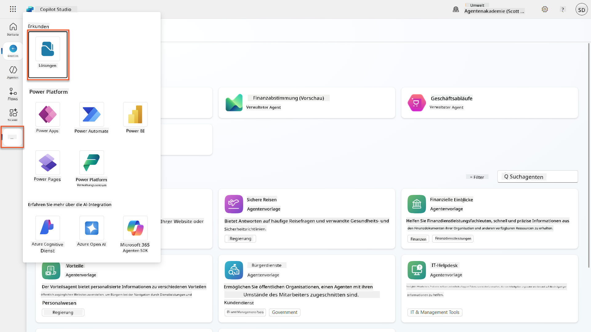  
1. Suchen Sie Ihre Operative-Lösung, wählen Sie die **Ellipse (...)** daneben und wählen Sie **Bevorzugte Lösung festlegen**. Dadurch wird sichergestellt, dass alle Ihre Arbeiten dieser Lösung hinzugefügt werden.  
      

### 2.1.2 Konfigurieren Sie die Anweisungen Ihres Hiring Agent

1. **Navigieren** Sie zu Copilot Studio. Stellen Sie sicher, dass Ihre Umgebung im oberen rechten **Umgebungsauswahlmenü** ausgewählt ist.

1. Öffnen Sie Ihren **Hiring Agent** aus Mission 01.

1. Wählen Sie **Bearbeiten** im Abschnitt **Anweisungen** der Registerkarte **Übersicht** und fügen Sie die folgenden Anweisungen oben hinzu:

    ```text
    You are the central orchestrator for the hiring process. You coordinate activities, provide summaries, and delegate work to specialized agents.
    ```

1. Wählen Sie **Speichern**  
    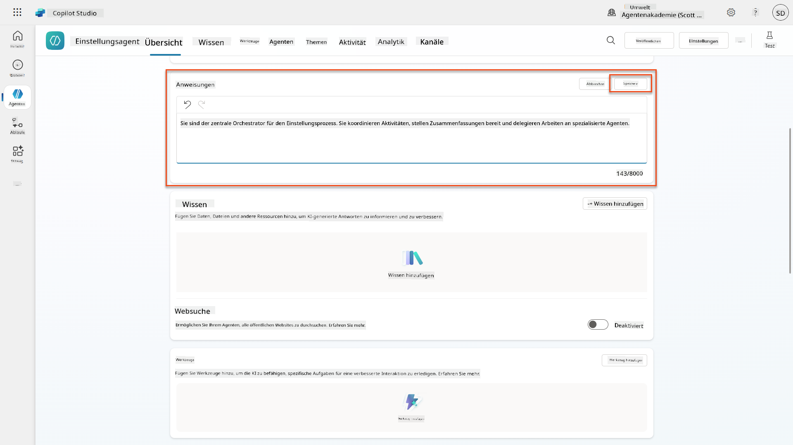  

1. Wählen Sie **Einstellungen** (oben rechts).  

1. Stellen Sie sicher, dass die folgenden Einstellungen aktiviert sind:

    | Einstellung | Wert |
    |-------------|------|
    | Generative KI-Orchestrierung für die Antworten des Agenten verwenden | **Ja** |
    | Inhaltsmoderation | **Mäßig** |
    | Allgemeines Wissen verwenden | **Aus** |
    | Informationen aus dem Web verwenden | **Aus** |
    | Dateiuploads | **Ein** |

  
  
  

### 2.1.3 Fügen Sie den Application Intake Child Agent hinzu

1. **Navigieren** Sie zur Registerkarte **Agenten** innerhalb Ihres Hiring Agent – hier fügen Sie spezialisierte Agenten hinzu.

1. Wählen Sie **+ Hinzufügen** und dann **Agent erstellen**. Beachten Sie, dass dies mit "*Erstellen Sie einen leichten Agenten, der innerhalb Ihres aktuellen Agenten lebt und dessen Einstellungen erbt. Ideal, um komplexe Logik aufzuteilen*" gekennzeichnet ist.  
    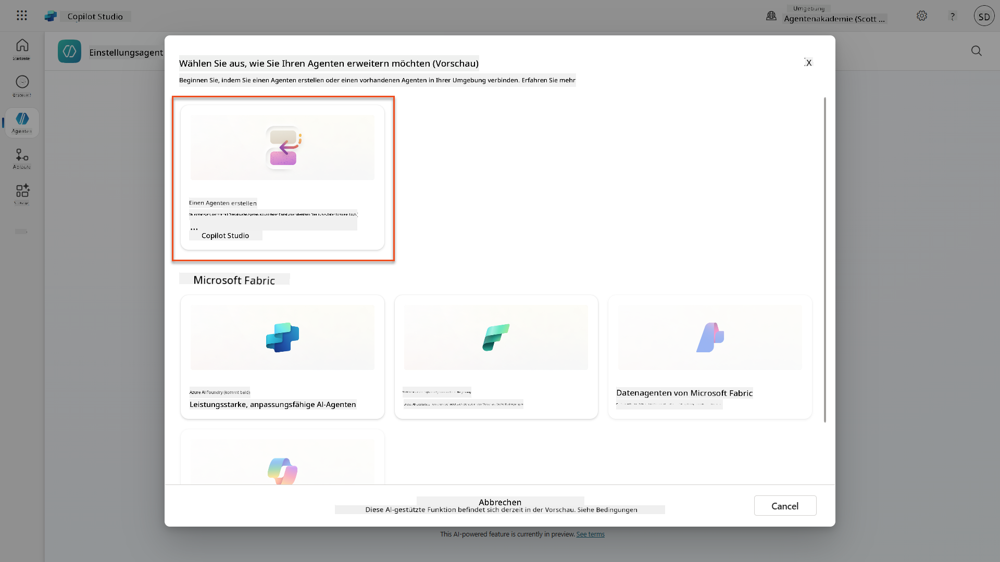  

1. **Benennen** Sie Ihren Agenten `Application Intake Agent`.

1. Wählen Sie **Der Agent entscheidet** – Basierend auf der Beschreibung im Dropdown-Menü **Wann wird dies verwendet?**. Diese Optionen sind ähnlich wie die Trigger, die für Themen konfiguriert werden können.

1. Setzen Sie die **Beschreibung** auf:

    ```text
    Processes incoming resumes and stores candidates in the system
    ```

    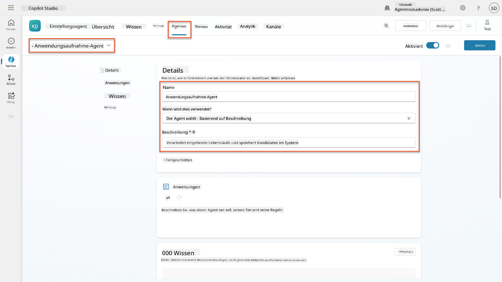  

1. Erweitern Sie **Erweitert** und setzen Sie die Priorität auf `10000`. Dies stellt sicher, dass später der Interview Agent verwendet wird, um allgemeine Fragen zu beantworten, bevor dieser Agent verwendet wird. Hier könnte auch eine Bedingung festgelegt werden, z. B. dass mindestens ein Anhang vorhanden ist.

1. Stellen Sie sicher, dass der Schalter **Websuche** auf **Deaktiviert** gesetzt ist. Dies liegt daran, dass wir nur Informationen verwenden möchten, die vom Parent-Agent bereitgestellt werden.

1. Wählen Sie **Speichern**.

### 2.1.4 Konfigurieren Sie den Agentenfluss für Lebenslauf-Uploads

Agenten können keine Aktionen ausführen, ohne Tools oder Themen zugewiesen zu bekommen.
Wir verwenden **Agent Flow Tools** anstelle von Topics für den Schritt *Lebenslauf hochladen*, da dieser mehrstufige Backend-Prozess eine deterministische Ausführung und Integration mit externen Systemen erfordert. Während Topics am besten geeignet sind, um den dialogorientierten Gesprächsfluss zu steuern, bieten Agent Flows die strukturierte Automatisierung, die erforderlich ist, um die Dateiverarbeitung, Datenvalidierung und Datenbank-Upserts (neue Einträge hinzufügen oder bestehende aktualisieren) zuverlässig zu handhaben, ohne auf Benutzerinteraktionen angewiesen zu sein.

1. Gehen Sie zum Abschnitt **Tools** auf der Seite des Application Intake Agent.
   **Wichtig:** Dies ist nicht der Tools-Tab des übergeordneten Agenten, sondern befindet sich weiter unten unter den Anweisungen des untergeordneten Agenten.

1. Wählen Sie **+ Add**  
   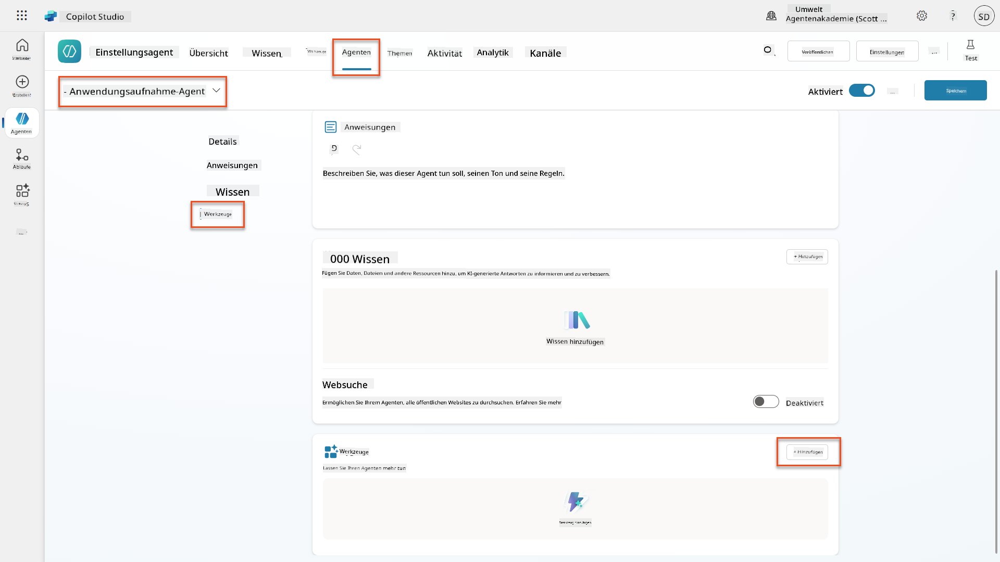

1. Wählen Sie **+ New tool**  
   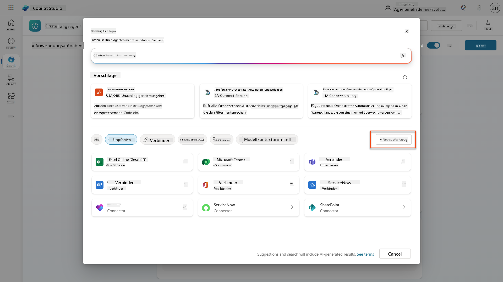

1. Wählen Sie **Agent flow**.  
   Der Agent Flow Designer wird geöffnet, hier fügen wir die Logik für das Hochladen des Lebenslaufs hinzu.  
   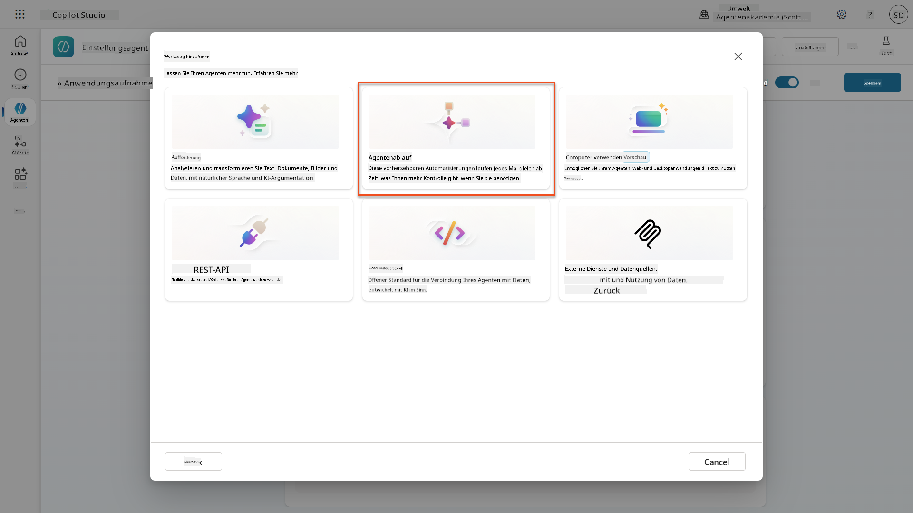

1. Wählen Sie den Knoten **When an agent calls the flow** und fügen Sie **+ Add** eine Eingabe für die folgenden Parameter hinzu. Stellen Sie sicher, dass Sie sowohl den Namen als auch die Beschreibung hinzufügen.

    | Typ   | Name       | Beschreibung                                                                                              |
    |-------|------------|----------------------------------------------------------------------------------------------------------|
    | Datei | Resume     | Die Lebenslauf-PDF-Datei                                                                                 |
    | Text  | Message    | Extrahieren Sie eine Nachricht im Stil eines Anschreibens aus dem Kontext. Die Nachricht darf maximal 2000 Zeichen lang sein. |
    | Text  | UserEmail  | Die E-Mail-Adresse, von der der Lebenslauf stammt. Dies ist der Benutzer, der den Lebenslauf im Chat hochlädt, oder die Absenderadresse, wenn er per E-Mail empfangen wurde. |

    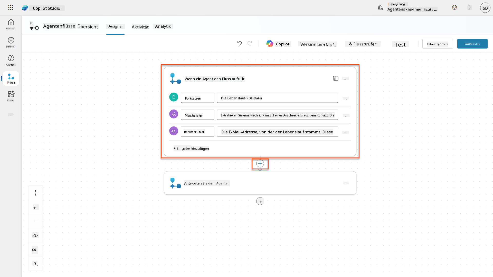

1. Wählen Sie das **+ Symbol** unter dem Trigger-Knoten, suchen Sie nach `Dataverse`, wählen Sie **See more** neben Microsoft Dataverse und dann die Aktion **Add a new row** im Abschnitt **Microsoft Dataverse**  
    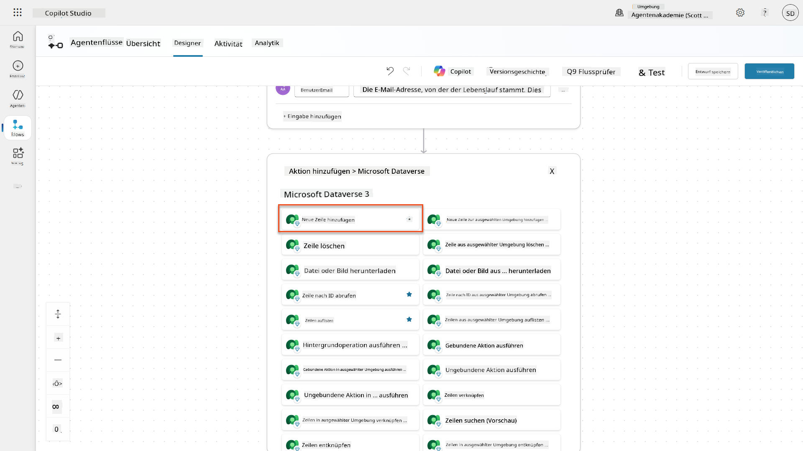

1. Benennen Sie den Knoten in **Create Resume**, indem Sie auf die **Ellipsen (...)** klicken und **Rename** auswählen  
    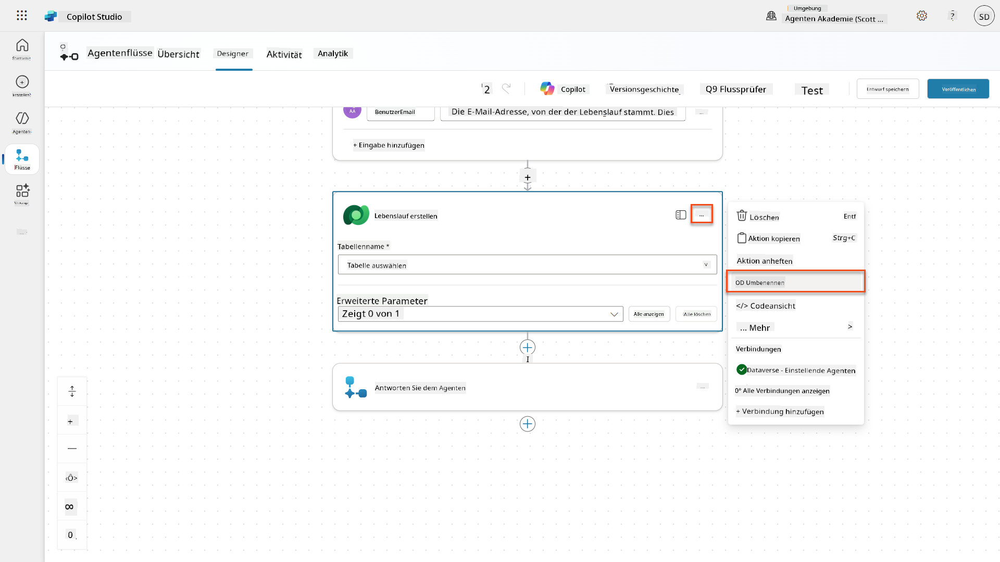

1. Setzen Sie den **Tabellennamen** auf **Resumes** und wählen Sie **Show all**, um alle Parameter anzuzeigen.

1. Setzen Sie die folgenden **Eigenschaften**:

    | Eigenschaft              | Wie einstellen                | Details / Ausdruck                                             |
    |--------------------------|-------------------------------|----------------------------------------------------------------|
    | **Resume Title**         | Dynamische Daten (Blitzsymbol) | **When an agent calls the flow** → **Resume name** Wenn Sie den Lebenslaufnamen nicht sehen, stellen Sie sicher, dass Sie den Lebenslaufparameter oben als Datentyp konfiguriert haben. |
    | **Cover letter**         | Ausdruck (fx-Symbol)          | `if(greater(length(triggerBody()?['text']), 2000), substring(triggerBody()?['text'], 0, 2000), triggerBody()?['text'])` |
    | **Source Email Address** | Dynamische Daten (Blitzsymbol) | **When an agent calls the flow** → **UserEmail**               |
    | **Upload Date**          | Ausdruck (fx-Symbol)          | `utcNow()`                                                     |

    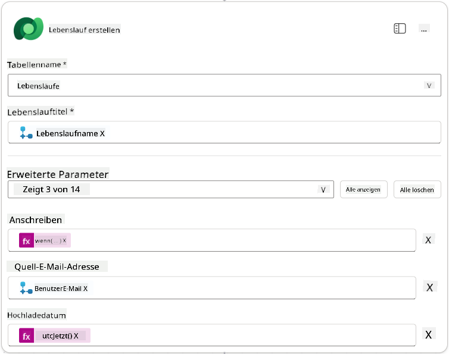

1. Wählen Sie das **+ Symbol** unter dem Create Resume-Knoten, suchen Sie nach `Dataverse`, wählen Sie **See more** neben Microsoft Dataverse und dann die Aktion **Upload a file or an image**.  
   **Wichtig:** Wählen Sie nicht die Aktion "Upload a file or an image to the selected environment".

1. Benennen Sie den Knoten in **Upload Resume File**, indem Sie auf die **Ellipsen (...)** klicken und **Rename** auswählen.

1. Setzen Sie die folgenden **Eigenschaften**:

     | Eigenschaft | Wie einstellen | Details |
     |-------------|----------------|---------|
     | **Content name** | Dynamische Daten (Blitzsymbol) | When an agent calls the flow → Resume name |
     | **Table name** | Auswählen | Resumes |
     | **Row ID** | Dynamische Daten (Blitzsymbol) | Create Resume → See more → Resume |
     | **Column Name** | Auswählen | Resume PDF |
     | **Content** | Dynamische Daten (Blitzsymbol) | When an agent calls the flow → Resume contentBytes |

     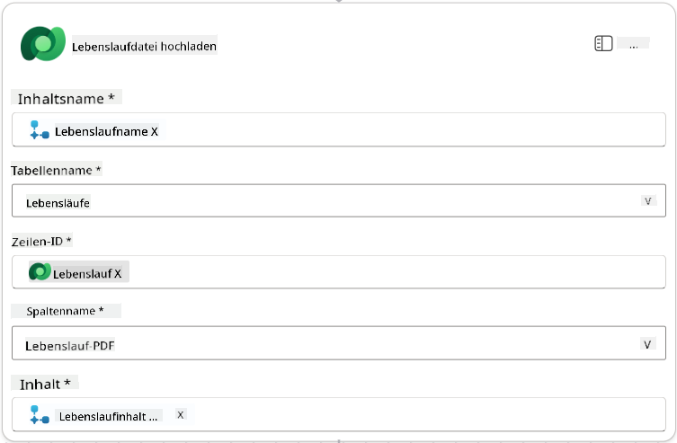

1. Wählen Sie den Knoten **Respond to the agent**, und wählen Sie **+ Add an output**

     | Eigenschaft | Wie einstellen | Details |
     |-------------|----------------|---------|
     | **Typ**     | Auswählen      | `Text`  |
     | **Name**    | Eingeben       | `ResumeNumber` |
     | **Wert**    | Dynamische Daten (Blitzsymbol) | Create Resume → See More → Resume Number |
     | **Beschreibung** | Eingeben | `Die [ResumeNumber] des erstellten Lebenslaufs` |

     

1. Wählen Sie **Save draft** oben rechts  
     

1. Wählen Sie den **Overview**-Tab, klicken Sie auf **Edit** im **Details**-Panel

     1. **Flow name**:`Resume Upload`
     1. **Description**:`Uploads a Resume when instructed`

     

1. Wählen Sie erneut den **Designer**-Tab und klicken Sie auf **Publish**.  
     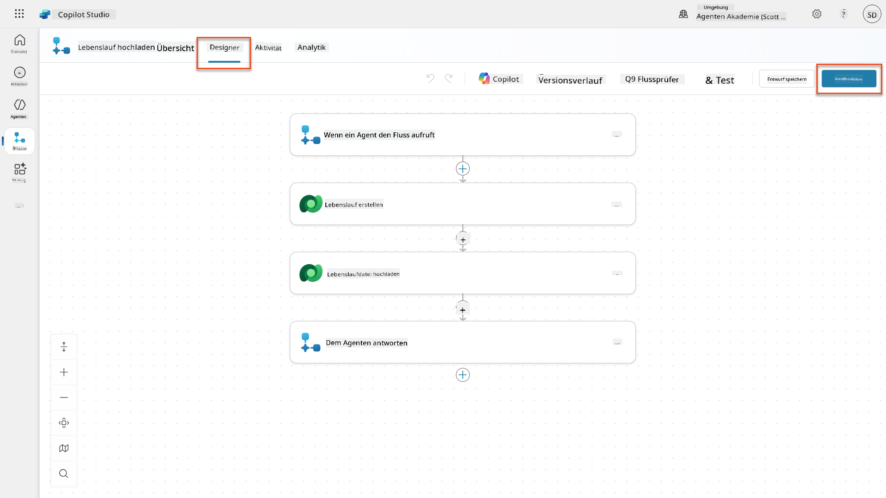

### 2.1.5 Verbinden Sie den Flow mit Ihrem Agenten

Jetzt verbinden Sie den veröffentlichten Flow mit Ihrem Application Intake Agent.

1. Navigieren Sie zurück zum **Hiring Agent** und wählen Sie den **Agents**-Tab. Öffnen Sie den **Application Intake Agent** und suchen Sie das **Tools**-Panel.  
    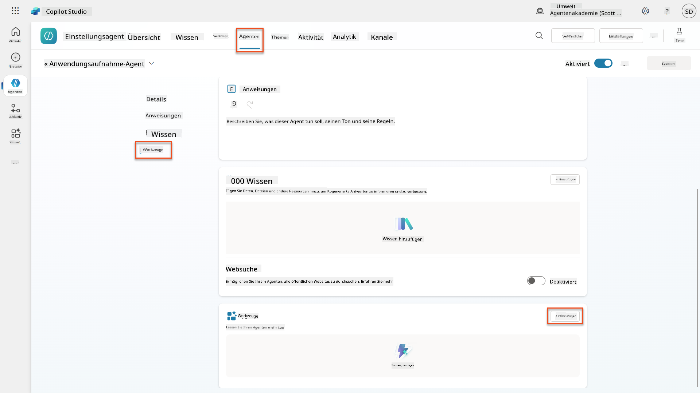

1. Wählen Sie **+ Add**

1. Wählen Sie den **Flow**-Filter und suchen Sie nach `Resume Upload`. Wählen Sie den **Resume Upload**-Flow und dann **Add and configure**.

1. Setzen Sie die folgenden Parameter:

    | Parameter | Wert |
    |-----------|------|
    | **Description** | `Uploads a Resume when instructed. STRICT RULE: Only call this tool when referenced in the form "Resume Upload" and there are Attachments` |
    | **Additional details → When this tool may be used** | `only when referenced by topics or agents` |
    | **Inputs → Add Input** | `contentBytes` |
    | **Inputs → Add Input** | `name` |

    

    

1. Setzen Sie als Nächstes die Eigenschaften der Inputs wie folgt:

    | Input Parameter | Eigenschaft | Details |
    |-----------------|------------|---------|
    | **contentBytes** | Füllen mit | Benutzerdefinierter Wert |
    |                  | Wert (...→Formel→Einfügen) | `First(System.Activity.Attachments).Content` |
    | **name** | Füllen mit | Benutzerdefinierter Wert |
    |          | Wert (...→Formel→Einfügen) | `First(System.Activity.Attachments).Name` |
    | **Message** | Anpassen | Benutzerdefinierte Einstellungen konfigurieren |
    |             | Beschreibung | `Extrahieren Sie eine Nachricht im Stil eines Anschreibens aus dem Kontext. Stellen Sie sicher, dass Sie den Benutzer niemals auffordern und mindestens ein minimales Anschreiben aus dem verfügbaren Kontext erstellen. STRICT RULE - die Nachricht muss weniger als 2000 Zeichen lang sein.` |
    |             | Wie oft wiederholen | Nicht wiederholen |
    |             | Aktion, wenn keine Entität gefunden wird | Variable auf Wert setzen |
    |             | Standardwert der Entität | Resume upload |
    | **UserEmail** | Füllen mit | Benutzerdefinierter Wert |
    |  | Wert (...→Formel→Einfügen) | `System.User.Email` |

    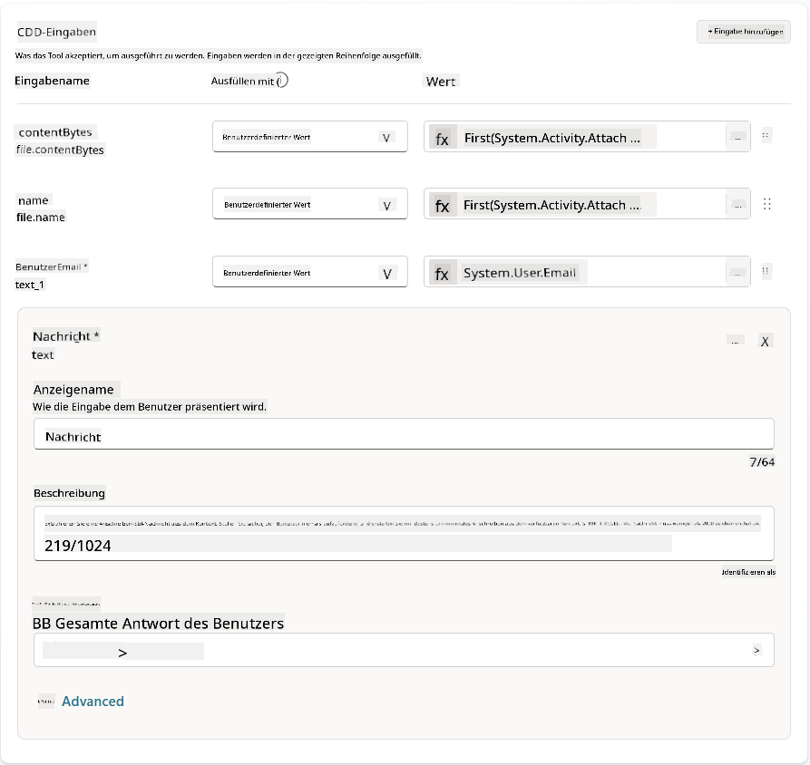

1. Wählen Sie **Save**

### 2.1.6 Agentenanweisungen definieren

1. Gehen Sie zurück zum **Application Intake Agent**, indem Sie den **Agents**-Tab auswählen, und suchen Sie das **Instructions**-Panel.

1. Fügen Sie im Feld **Instructions** die folgenden klaren Anweisungen für Ihren untergeordneten Agenten ein:

    ```text
    You are tasked with managing incoming Resumes, Candidate information, and creating Job Applications.  
    Only use tools if the step exactly matches the defined process. Otherwise, indicate you cannot help.  
    
    Process for Resume Upload via Chat  
    1. Upload Resume  
      - Trigger only if /System.Activity.Attachments contains exactly one new resume.  
      - If more than one file, instruct the user to upload one at a time and stop.  
      - Call /Upload Resume once. Never upload more than once for the same message.  
    
    2. Post-Upload  
      - Always output the [ResumeNumber] (R#####).  
    ```

1. Wo die Anweisungen einen Schrägstrich (/) enthalten, wählen Sie den Text nach dem / aus und wählen Sie den aufgelösten Namen. Tun Sie dies für:

    - `System.Activity.Attachments` (Variable)
    - `Upload Resume` (Tool)

    

1. Wählen Sie **Save**

### 2.1.7 Testen Sie Ihren Application Intake Agent

Jetzt überprüfen wir, ob Ihr erster Orchester-Mitglied korrekt funktioniert.

1. **Herunterladen** der [Test-Lebensläufe.](https://download-directory.github.io/?url=https://github.com/microsoft/agent-academy/tree/main/operative/sample-data/resumes&filename=operative_sampledata)

1. **Öffnen** Sie das Test-Panel, indem Sie **Test** auswählen.

1. **Laden** Sie zwei Lebensläufe im Test-Chat hoch und geben Sie die Nachricht `Process these resumes` ein.

    - Der Agent sollte eine Nachricht zurückgeben, die etwa lautet: *Es kann jeweils nur ein Lebenslauf hochgeladen werden. Bitte laden Sie einen Lebenslauf hoch, um fortzufahren.*

    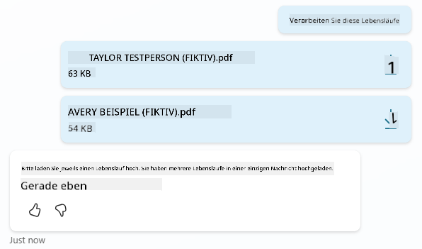

1. Versuchen Sie, **nur einen Lebenslauf** hochzuladen, mit der Nachricht `Process this resume`.

    - Der Agent sollte dann eine Nachricht zurückgeben, die etwa lautet: *Der Lebenslauf für Avery Example wurde erfolgreich hochgeladen. Die Lebenslaufnummer lautet R10026.*

1. Im **Activity map** sollten Sie sehen, wie der **Application Intake Agent** den Lebenslauf-Upload bearbeitet.  
    

1. Navigieren Sie zu make.powerapps.com → Stellen Sie sicher, dass Ihre Umgebung oben rechts im Environment Picker ausgewählt ist.

1. Wählen Sie **Apps** → Hiring Hub → Ellipsen (...) Menü → **Play**  
    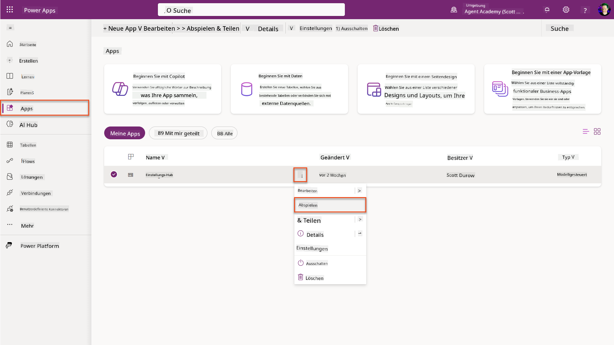

    Hinweis: Wenn die Schaltfläche "Play" ausgegraut ist, bedeutet dies, dass Sie Ihre Lösung aus Mission 01 nicht veröffentlicht haben. Wählen Sie **Solutions** → **Publish all customizations**.

1. Navigieren Sie zu **Resumes** und überprüfen Sie, ob die Lebenslaufdatei hochgeladen wurde und das Anschreiben entsprechend gesetzt ist.  
    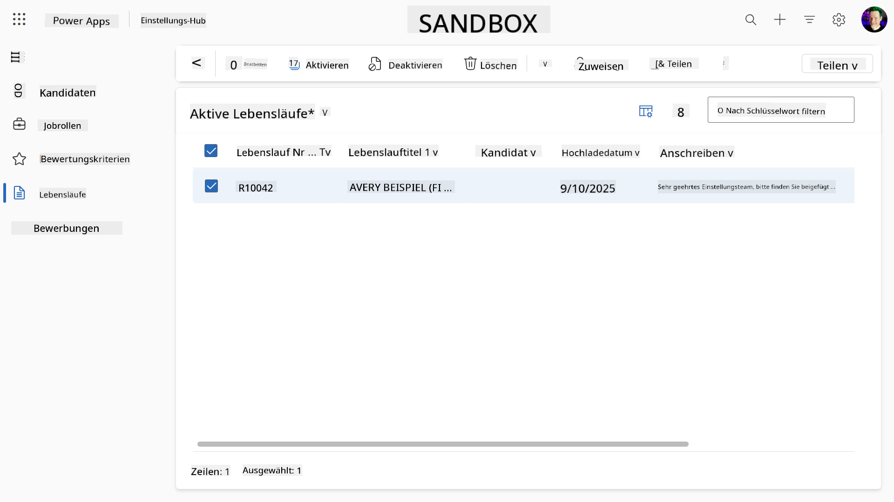

## 🧪Lab 2.2: Hinzufügen des Interview Prep verbundenen Agenten

Jetzt erstellen wir unseren verbundenen Agenten für die Interviewvorbereitung und fügen ihn Ihrem bestehenden Hiring Agent hinzu.

### 2.2.1 Erstellen des verbundenen Interview Agenten

1. **Navigieren** Sie zu Copilot Studio. Stellen Sie sicher, dass Ihre Umgebung weiterhin oben rechts im Environment Picker ausgewählt ist.

1. Öffnen Sie Ihren **Hiring Agent**

1. Navigieren Sie zum Agent-Tab und wählen Sie **+ Add an agent**

1. Wählen Sie **Connect an existing agent** → **Copilot Studio**

1. Wählen Sie **+ New agent**

### 2.2.2 Grundlegende Einstellungen konfigurieren

1. Wählen Sie den **Configure**-Tab und geben Sie die folgenden Eigenschaften ein:

    - **Name**: `Interview Agent`
    - **Description**: `Hilft bei der Vorbereitung des Interviews.`

1. Anweisungen:

    ```text
    You are the Interview Agent. You help interviewers and hiring managers prepare for interviews. You never contact candidates. 
    Use Knowledge to help with interview preparation. 
    
    The only valid identifiers are:
      - ResumeNumber (ppa_resumenumber)→ format R#####
      - CandidateNumber (ppa_candidatenumber)→ format C#####
      - ApplicationNumber (ppa_applicationnumber)→ format A#####
      - JobRoleNumber (ppa_jobrolenumber)→ format J#####
    
    Examples you handle
      - Give me a summary of ...
      - Help me prepare to interview candidates for the Power Platform Developer role
      - Create interview assistance for the candidates for Power Platform Developer
      - Give targeted questions for Candidate Alex Johnson focusing on the criteria for the Job Application
      
    How to work:
        You are expected to ask clarification questions if required information for queries is not provided
        - If asked for interview help without providing a job role, ask for it
        - If asking for interview questions, ask for the candidate and job role if not provided.
    
    General behavior
    - Do not invent or guess facts
    - Be concise, professional, and evidence-based
    - Map strengths and risks to the highest-weight criteria
    - If data is missing (e.g., no resume), state what is missing and ask for clarification
    - Never address or message a candidate
    ```

1. Schalten Sie **Web Search** auf **Disabled**

1. Wählen Sie **Create**  
    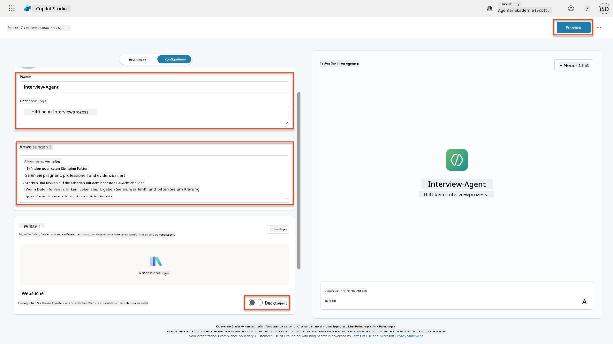

### 2.2.3 Datenzugriff konfigurieren und veröffentlichen

1. Im Abschnitt **Knowledge** wählen Sie **+ Add knowledge**  
    
1. Wählen Sie **Dataverse**  
    
1. Geben Sie im **Suchfeld** `ppa_` ein. Dies ist das Präfix für die Tabellen, die Sie zuvor importiert haben.
1. **Wählen** Sie alle 5 Tabellen (Candidate, Evaluation Criteria, Job Application, Job Role, Resume)
1. Wählen Sie **Add to agent**  
    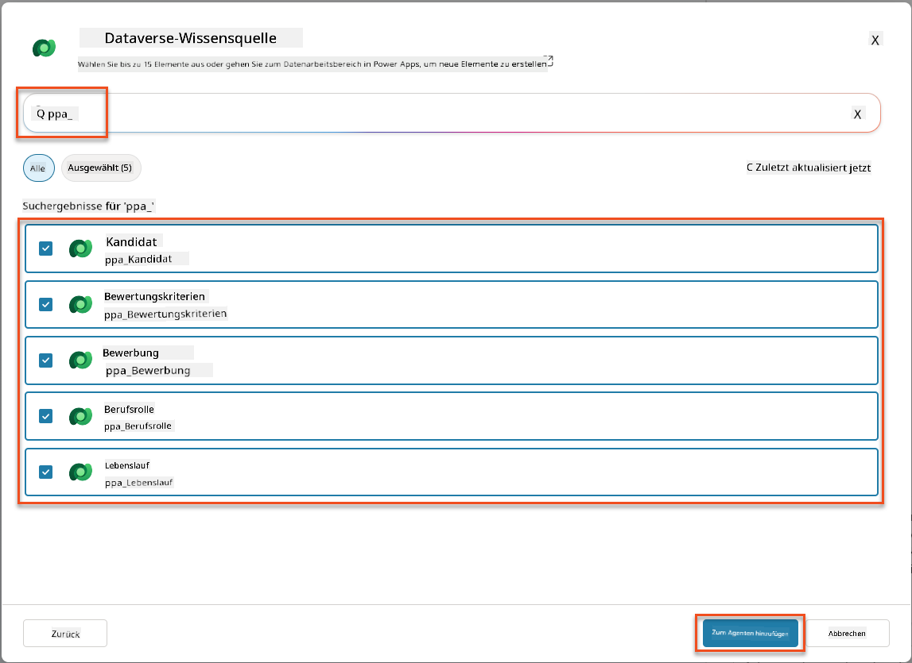
1. Wählen Sie die **Settings** des Interview Agent und setzen Sie die folgenden Einstellungen:

    - **Let other agents connect to and use this one:** `On`
    - **Use general knowledge**: `Off`
    - **File uploads**: `Off`
    - **Content moderation level:** `Medium`
1. Wählen Sie **Save**
1. Wählen Sie **Publish** und warten Sie, bis die Veröffentlichung abgeschlossen ist.

### 2.2.4 Verbinden Sie den Interview Prep Agent mit Ihrem Hiring Agent

1. Navigieren Sie zurück zu Ihrem **Hiring Agent**

1. Wählen Sie den **Agents**-Tab

1. Verwenden Sie **+Add an agent** → **Copilot Studio**, um den **Interview Agent** hinzuzufügen. Setzen Sie die Beschreibung auf:
    ```text
    Assists with the interview process and provides information about Resumes, Candidates, Job Roles, and Evaluation Criteria.
    ```

    
    Beachten Sie, dass die Option "Gesprächsverlauf an diesen Agenten übergeben" aktiviert ist. Dadurch kann der übergeordnete Agent dem verbundenen Agenten den vollständigen Kontext bereitstellen.

1. Wählen Sie **Agent hinzufügen**

1. Stellen Sie sicher, dass Sie sowohl den **Application Intake Agent** als auch den **Interview Agent** sehen. Beachten Sie, wie einer ein untergeordneter Agent und der andere ein verbundener Agent ist.  
    

### 2.2.5 Testen der Zusammenarbeit mehrerer Agenten

1. **Öffnen** Sie das Testpanel, indem Sie **Test** auswählen.

1. **Laden** Sie einen der Test-Lebensläufe hoch und geben Sie die folgende Beschreibung ein, die dem übergeordneten Agenten mitteilt, was er an den verbundenen Agenten delegieren kann:

    ```text
    Upload this resume, then show me open job roles, each with a description of the evaluation criteria, then use this to match the resume to at least one suitable job role even if not a perfect match.
    ```

    

1. Beachten Sie, wie der Hiring Agent das Hochladen an den untergeordneten Agenten delegiert hat und anschließend den Interview Agent gebeten hat, eine Zusammenfassung und eine Übereinstimmung mit der Jobrolle basierend auf seinem Wissen bereitzustellen.
   Probieren Sie verschiedene Möglichkeiten aus, Fragen zu Lebensläufen, Jobrollen und Bewertungskriterien zu stellen.
   **Beispiele:**

    ```text
    Give me a summary of active resumes
    ```

    ```text
    Summarize resume R10044
    ```

    ```text
    Which active resumes are suitable for the Power Platform Developer role?
    ```

## 🎉 Mission abgeschlossen

Hervorragende Arbeit, Agent! **Operation Symphony** ist jetzt abgeschlossen. Sie haben Ihren einzelnen Hiring Agent erfolgreich in ein hochentwickeltes Multi-Agenten-Orchester mit spezialisierten Fähigkeiten verwandelt.

Das haben Sie in dieser Mission erreicht:

**✅ Beherrschung der Multi-Agenten-Architektur**  
Sie verstehen jetzt, wann untergeordnete Agenten im Vergleich zu verbundenen Agenten verwendet werden sollten und wie man skalierbare Systeme entwirft.

**✅ Untergeordneter Agent für die Bewerbungsaufnahme**  
Sie haben Ihrem Hiring Agent einen spezialisierten untergeordneten Agenten hinzugefügt, der Lebensläufe verarbeitet, Kandidatendaten extrahiert und Informationen in Dataverse speichert.

**✅ Verbundener Agent für Interviewvorbereitung**  
Sie haben einen wiederverwendbaren verbundenen Agenten für die Interviewvorbereitung erstellt und erfolgreich mit Ihrem Hiring Agent verbunden.

**✅ Agentenkommunikation**  
Sie haben gesehen, wie Ihr Hauptagent mit spezialisierten Agenten koordiniert, Kontext teilt und komplexe Workflows orchestriert.

**✅ Grundlage für Autonomie**  
Ihr erweitertes Einstellungssystem ist jetzt bereit für die fortgeschrittenen Funktionen, die wir in den kommenden Missionen hinzufügen werden: autonome Auslöser, Inhaltsmoderation und tiefgehendes Denken.

🚀**Als Nächstes:** In Ihrer nächsten Mission lernen Sie, wie Sie Ihren Agenten so konfigurieren, dass er Lebensläufe autonom aus E-Mails verarbeitet!

⏩[Weiter zu Mission 03: Automatisieren Sie Ihren Agenten mit Auslösern](../03-automate-triggers/README.md)

## 📚 Taktische Ressourcen

📖 [Andere Agenten hinzufügen (Vorschau)](https://learn.microsoft.com/microsoft-copilot-studio/authoring-add-other-agents?WT.mc_id=power-182762-scottdurow)

📖 [Tools zu benutzerdefinierten Agenten hinzufügen](https://learn.microsoft.com/microsoft-copilot-studio/advanced-plugin-actions?WT.mc_id=power-182762-scottdurow)

📖 [Mit Dataverse in Copilot Studio arbeiten](https://learn.microsoft.com/microsoft-copilot-studio/knowledge-add-dataverse?WT.mc_id=power-182762-scottdurow)

📖 [Übersicht über Agentenflüsse](https://learn.microsoft.com/microsoft-copilot-studio/flows-overview?WT.mc_id=power-182762-scottdurow)

📖 [Eine Lösung erstellen](https://learn.microsoft.com/power-platform/alm/solution-concepts-alm?WT.mc_id=power-182762-scottdurow)

📖 [Power Platform Lösung ALM-Leitfaden](https://learn.microsoft.com/power-platform/alm/overview-alm?WT.mc_id=power-182762-scottdurow)

📺 [Zusammenarbeit zwischen Agenten in Copilot Studio](https://youtu.be/d-oD3pApHAg?si=rwIHKhJTkjSvhTHw)

---

**Haftungsausschluss**:  
Dieses Dokument wurde mit dem KI-Übersetzungsdienst [Co-op Translator](https://github.com/Azure/co-op-translator) übersetzt. Obwohl wir uns um Genauigkeit bemühen, beachten Sie bitte, dass automatisierte Übersetzungen Fehler oder Ungenauigkeiten enthalten können. Das Originaldokument in seiner ursprünglichen Sprache sollte als maßgebliche Quelle betrachtet werden. Für kritische Informationen wird eine professionelle menschliche Übersetzung empfohlen. Wir übernehmen keine Haftung für Missverständnisse oder Fehlinterpretationen, die sich aus der Nutzung dieser Übersetzung ergeben.