<!--
CO_OP_TRANSLATOR_METADATA:
{
  "original_hash": "dcbcd9396b076da0a0f5d389e9ec1b12",
  "translation_date": "2025-10-17T19:09:26+00:00",
  "source_file": "docs/recruit/08-add-adaptive-card/README.md",
  "language_code": "de"
}
-->
# 🚨 Mission 08: Verbesserung der Benutzerinteraktionen in Themen mit Adaptive Cards

## 🕵️‍♂️ CODENAME: `OPERATION INTERFACE UPLIFT`

> **⏱️ Zeitfenster der Operation:** `~45 Minuten`

🎥 **Schauen Sie sich die Anleitung an**

[](https://www.youtube.com/watch?v=RhIlzYHPCXo "Schauen Sie sich die Anleitung auf YouTube an")

## 🎯 Missionsbeschreibung

Agenten, Ihre Mission ist es, die statische Benutzererfahrung zu infiltrieren und durch reichhaltige, dynamische und interaktive Adaptive Cards zu ersetzen. Sie werden JSON-Payloads und Power Fx-Formeln einsetzen, um die Gespräche im Copilot Studio von einfachen Frage-Antwort-Szenarien in vollständig interaktive Engagements zu verwandeln. Ihr Ziel ist es, Benutzereingaben zu sammeln, Daten ansprechend zu präsentieren und Gespräche präzise und stilvoll zu lenken. Wenn Sie sich nicht anpassen, könnten Ihre Benutzer zu weniger intelligenten Schnittstellen abwandern.

## 🔎 Ziele

In dieser Mission lernen Sie:

1. Verstehen, was Adaptive Cards sind und wie sie die Benutzerinteraktionen im Copilot Studio verbessern
1. Erstellen interaktiver Karten mit JSON und Power Fx-Formeln für dynamische Inhalte
1. Erkunden des Adaptive Card Designers und seiner Hauptkomponenten für die visuelle Kartenerstellung
1. Erstellen von reichhaltigen, interaktiven Formularen und Datensammlungserfahrungen innerhalb von Agententhemen
1. Implementieren von Best Practices für die Gestaltung responsiver und benutzerfreundlicher Adaptive Cards

## 🤔 Was ist eine Adaptive Card?

Eine **Adaptive Card** ist eine Möglichkeit, interaktive, visuell ansprechende UI-Elemente zu erstellen, die in Apps wie Microsoft Teams, Microsoft Outlook oder Agenten eingebettet werden können. Es handelt sich um ein strukturiertes JSON-Objekt, das das Layout und den Inhalt einer Karte definiert:

- Welche Elemente auf der Karte erscheinen - Text, Bilder, Buttons
- Wie diese Elemente angeordnet sind
- Welche Aktionen Benutzer ausführen können, wie das Einreichen eines Formulars oder das Öffnen eines Links

    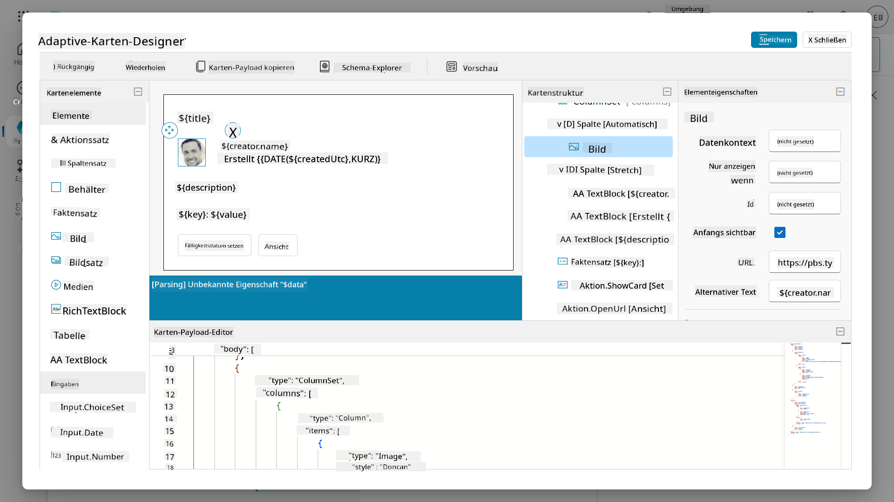

### Warum Adaptive Cards im Copilot Studio wichtig sind

Stellen Sie sich vor, Sie erstellen einen Agenten, der Benutzer nach ihrem Namen, ihrer E-Mail-Adresse oder ihrem Feedback fragt. Wenn Sie nur einfachen Text verwenden, kann sich das Gespräch langweilig oder schwer nachvollziehbar anfühlen. Hier kommen Adaptive Cards ins Spiel!

1. **Macht Gespräche interaktiv** - Anstatt Textnachrichten an den Benutzer zu senden, können Sie Buttons, Formulare, Bilder und mehr anzeigen.
    - Beispiel: Eine Karte kann den Benutzer auffordern, seinen Namen und seine E-Mail-Adresse in ein übersichtliches Formular einzutragen.

1. **Sieht überall gut aus** - Adaptive Cards passen sich automatisch dem Stil der App an, in der sie sich befinden, wie Microsoft 365 Copilot Chat oder Microsoft Teams. Sie müssen sich keine Gedanken über den Dunkelmodus, Schriftarten oder Layouts machen - sie passen sich an.

1. **Einfach mit JSON zu erstellen** - Sie definieren die Karte mit JSON-Code (denken Sie an ein _Rezept_ für die Benutzeroberfläche). Copilot Studio hilft Ihnen, Ihre Karte vor dem Hinzufügen zum Thema zu überprüfen.

1. **Daten sammeln und verwenden** - Sie können die Karte verwenden, um Fragen zu stellen, Antworten zu sammeln und diese Daten im Gesprächsfluss zu verwenden.
    - Beispiel: Fragen Sie nach der Telefonnummer eines Benutzers und zeigen Sie dann eine Bestätigungskarte mit seiner Telefonnummer an.

1. **Verbessert die Benutzererfahrung** - Karten lassen Ihren Agenten interaktiver wirken. Es ist eine sauberere, klickbare und benutzerfreundlichere Art der Schnittstelle.

## 🐱 Ist _JSON_ eine Person?

Ausgesprochen wie "Jason", ist es keine Person 😅

JSON, auch bekannt als _JavaScript Object Notation_, ist ein leichtgewichtiges Format zur Strukturierung von Daten. Es ist einfach zu lesen und zu schreiben und sieht aus wie eine Reihe von Schlüssel-Wert-Paaren in geschweiften Klammern {}.

Dies ist eine der Optionen, die Sie verwenden können, wenn Sie eine Adaptive Card zu Ihrem Thema hinzufügen.


## 👀 Ich sehe eine weitere Option zum Erstellen einer Adaptive Card mit _Formel_

Erinnern Sie sich daran, wie wir in [Mission 07 - Verwendung von Power Fx in Ihren Knoten](../07-add-new-topic-with-trigger/README.md#what-power-fx-can-do-in-topics) über Power Fx gelernt haben? Dasselbe kann in Adaptive Cards innerhalb des Copilot Studios angewendet werden.

Zur Erinnerung:

!!! note
    Power Fx ist eine Low-Code-Programmiersprache, die verwendet wird, um Logik und dynamisches Verhalten zu Ihrem Agenten hinzuzufügen. Es ist dieselbe Sprache, die in Microsoft Power Apps verwendet wird, und sie wurde so gestaltet, dass sie einfach und Excel-ähnlich ist, wodurch sie sowohl für Entwickler als auch für Nicht-Entwickler leicht verständlich ist.

### Wie Power Fx in Adaptive Cards funktioniert

Wenn Sie eine Adaptive Card im Copilot Studio entwerfen, können Sie Power Fx-Formeln verwenden, um:

- Dynamisch Werte wie Benutzernamen, Daten oder Status einzufügen.
- Text oder Zahlen zu formatieren, z. B. Währung anzeigen oder Zahlen runden.
- Elemente basierend auf Bedingungen ein- oder ausblenden.
- Antworten basierend auf Benutzereingaben, Variablen, Ausgaben von Gesprächsknoten anpassen.

Zum Beispiel:

"`Hallo`" & `System.User.DisplayName`

Diese Formel kombiniert das Wort "Hallo" mit dem Namen des Benutzers dynamisch.

### Warum es nützlich ist

1. **Personalisierung**

    Sie können Nachrichten für jeden Benutzer individuell gestalten, wodurch Interaktionen natürlicher und relevanter wirken.

1. **Dynamische Inhalte**

    Karten können echte Daten aus Variablen und Ausgaben von Gesprächsknoten anzeigen.

1. **Intelligente Logik**

    Sie können steuern, was Benutzer sehen oder mit welchen Elementen sie interagieren, basierend auf Bedingungen, wodurch die Benutzerfreundlichkeit verbessert und Fehler reduziert werden.

1. **Low-Code-freundlich**

    Power Fx ist eine Low-Code-Programmiersprache. Wie bereits erwähnt, ist sie lesbar, intuitiv und ähnlich wie Excel-Formeln.

## 👷🏻‍♀️ Erstellen mit dem Adaptive Card Designer

Der **Adaptive Card Designer** ist ein visuelles Tool, mit dem Sie interaktive Nachrichtenkarten erstellen können, indem Sie Elemente wie Text, Bilder, Buttons und Eingaben per Drag-and-Drop hinzufügen. Sein Zweck ist es, Ihnen zu helfen, reichhaltige, dynamische Nachrichten zu erstellen, ohne komplexen Code zu schreiben, und benutzerfreundliche Schnittstellen zu entwerfen.

Das Designer-Tool hilft Ihnen, die Karte visuell zu erstellen, generiert jedoch im Hintergrund das JSON-Objekt für Sie. Sie können auch zur _Formel_ wechseln, die es ermöglicht, Power Fx-Ausdrücke in der Karte zu verwenden, um Daten von anderen Quellen anzuzeigen.

## 🎨 Den Adaptive Card Designer verstehen

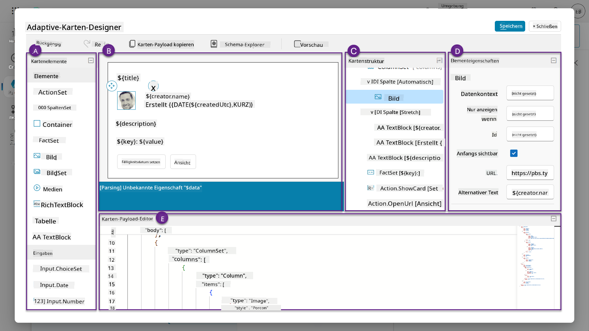

### A) Kartenelemente

Dies sind die Bausteine Ihrer Adaptive Card. Sie können Elemente wie die folgenden per Drag-and-Drop hinzufügen:

- **TextBlock**, um Text anzuzeigen.
- **Image**, um Bilder zu zeigen.
- **FactSet** für Schlüssel-Wert-Paare.
- **Eingabefelder**, um Textboxen, Datumsauswahlen, Umschalter anzuzeigen.
- **Aktionen**, um Buttons wie _Submit_, _Open URL_ oder _Show Card_ anzuzeigen.

Jedes Element hat seinen eigenen Zweck und kann gestaltet oder konfiguriert werden.

### B) Kartenansicht

Dies ist der **Vorschau**-Bereich, in dem Sie sehen, wie Ihre Karte in Echtzeit aussehen wird. Während Sie Elemente hinzufügen oder bearbeiten, aktualisiert sich die Ansicht sofort, um Änderungen widerzuspiegeln. Dies ermöglicht Ihnen, iterative Updates vorzunehmen und gleichzeitig das Design-Ergebnis zu sehen.

### C) Kartenstruktur

Dies zeigt die **Hierarchie und das Layout** Ihrer Karte. Zum Beispiel:

- Eine Karte könnte mit einem **TextBlock** für den Titel beginnen.
- Dann ein **ColumnSet** mit einem Bild auf der einen Seite und Text auf der anderen.
- Gefolgt von einem **FactSet** und einigen **Aktionsbuttons**.

Es hilft Ihnen zu verstehen, wie Elemente verschachtelt und organisiert sind.

### D) Element-Eigenschaften

Wenn Sie auf ein beliebiges Element in der Karte klicken, können Sie in diesem Panel dessen **Einstellungen anpassen**:

- Ändern Sie die Textgröße, Gewichtung oder Farbe.
- Legen Sie Bild-URLs oder Alt-Text fest.
- Konfigurieren Sie Eingabeoptionen wie Platzhaltertext oder Standardwerte.

Hier können Sie jedes Element feinabstimmen.

### E) Karten-Payload-Editor

Dies ist der **rohe JSON-Code**, der hinter Ihrer Karte steckt. Fortgeschrittene Benutzer können diesen direkt bearbeiten, um:

- Vorlagenfunktionen zu verwenden.
- Kartendefinitionen zu kopieren/einzufügen.

Auch wenn Sie neu im Adaptive Card Designer sind, ist es hilfreich zu sehen, wie das visuelle Design in Code übersetzt wird.

!!! tip "Tipp - Schauen Sie sich die Adaptive Card-Beispiele an"

    1. Besuchen Sie [https://adaptivecards.microsoft.com/designer](https://adaptivecards.microsoft.com/designer).
    2. Wählen Sie **Neue Karte**, um eine Liste von Beispielen zu sehen, die Sie auswählen und bearbeiten können.
    3. Beachten Sie, dass dieser Designer extern (webbasiert) ist. Wenn Sie Ihre Karte im webbasierten Adaptive Card Designer erstellen, kopieren Sie das JSON aus dem Karten-Payload-Editor.
    4. Fügen Sie das JSON in Ihre Adaptive Card in Ihrem Agenten im Copilot Studio ein.

    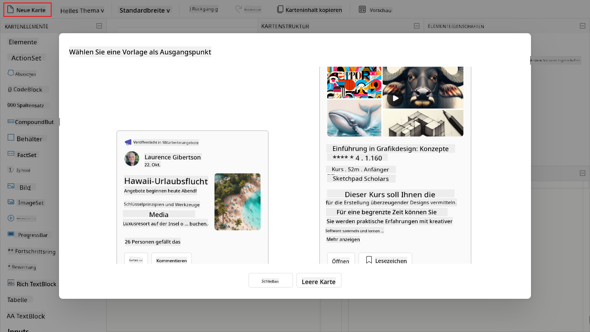

## 🌵 Häufige Anwendungsfälle

Die folgenden sind häufige Anwendungsfälle für Adaptive Cards im Copilot Studio, wenn sie in den **Send a message**- oder **Ask a question**-Knoten verwendet werden.

1. **Formulare und Datensammlung**

    Verwenden Sie Adaptive Cards, um strukturierte Eingaben von Benutzern zu sammeln, wie:

    - Urlaubsanträge
    - Feedback-Formulare
    - Kontaktinformationen
    - Terminplanung

1. **Anzeige dynamischer Informationen**

    Zeigt Benutzern personalisierte oder Echtzeitdaten in einem sauberen, lesbaren Format aus Unternehmensquellen wie ServiceNow, SAP, Dynamics 365, SharePoint usw.

    - Bestellzusammenfassungen
    - Kontostände
    - Ticket- oder Fallstatus
    - Kommende Ereignisse oder Fristen

1. **Interaktive Auswahlmöglichkeiten**

    Lassen Sie Benutzer direkt im Gespräch Auswahlen treffen:

    - Auswahl aus einer Liste von Optionen, z. B. Produktkategorien, Support-Themen.
    - Aktion bestätigen oder abbrechen.
    - Einen Service oder eine Erfahrung bewerten.

1. **Aktionen auslösen**

    Fügen Sie Buttons hinzu, die weitere Schritte im Gespräch intern oder extern auslösen.

    - "Anfrage einreichen"
    - "Details anzeigen"

## ⭐ Best Practices

Hier sind einige Best Practices für die Erstellung von Adaptive Cards für Agenten im Copilot Studio.

1. **Halten Sie es einfach und fokussiert**

    - Entwerfen Sie Karten mit einem klaren Zweck, überladen Sie sie nicht mit zu vielen Elementen.
    - Verwenden Sie prägnanten Text und intuitive Layouts, um Benutzer durch die Interaktion zu führen.

1. **Seien Sie gezielt bei Eingaben**

    - Fügen Sie nur die notwendigen Eingabeelemente wie Text, Datumsauswahlen hinzu, um Benutzer nicht zu überfordern.
    - Verwenden Sie Beschriftungen, um Eingaben leicht verständlich zu machen.

1. **Strukturieren Sie für Lesbarkeit**

    - Verwenden Sie **TextBlocks** für Überschriften und Anweisungen.
    - Gruppieren Sie verwandte Elemente mit **Containers** oder **ColumnSets**, um den visuellen Fluss zu verbessern.

1. **Machen Sie Aktionselemente klar**

    - Verwenden Sie **Action.Submit** oder **Action.OpenUrl** mit klaren Button-Titeln wie "Anfrage einreichen" oder "Details anzeigen".
    - Vermeiden Sie vage Beschriftungen wie "Hier klicken".

1. **Gestalten Sie für Anpassungsfähigkeit**

    - Gehen Sie davon aus, dass die Karte auf verschiedenen Bildschirmgrößen angezeigt wird.
    - Vermeiden Sie feste Breiten und verwenden Sie flexible Layouts wie **ColumnSets** für Responsivität.

1. **Verwenden Sie dynamische Inhalte, wenn möglich**

    - Binden Sie Kartenelemente an Variablen oder Ausgaben von Knoten mit Power Fx, um die Benutzererfahrung zu personalisieren.
    - Zeigen Sie beispielsweise den Namen oder aktuellen Status des Benutzers dynamisch an.

## 🧪 Lab 08 - Adaptive Cards hinzufügen und Themenfunktionen erweitern

Wir werden jetzt lernen, wie wir unser Thema mit Adaptive Cards erweitern und die erweiterten Funktionen von Themen und Knoten nutzen können.

- [8.1 Erstellen Sie ein neues Thema mit einer Adaptive Card, damit Benutzer ihre Anfrage einreichen können](../../../../../docs/recruit/08-add-adaptive-card)
- [8.2 Aktualisieren Sie die Agentenanweisungen, um das Thema "Gerät anfordern" aufzurufen](../../../../../docs/recruit/08-add-adaptive-card)

### ✨ Anwendungsfall

**Als** Mitarbeiter

**Möchte ich** ein Gerät anfordern

**Damit ich** ein Gerät aus der Liste der verfügbaren Geräte anfordern kann

Lassen Sie uns beginnen!

### Voraussetzungen

1. **SharePoint-Liste**

    Wir werden die **Devices**-SharePoint-Liste aus [Lektion 00 - Kurssetup - Schritt 3: Neue SharePoint-Website erstellen](../00-course-setup/README.md#step-4-create-new-sharepoint-site) verwenden.

    Wenn Sie die **Devices**-SharePoint-Liste noch nicht eingerichtet haben, gehen Sie bitte zurück zu [Lektion 00 - Kurssetup - Schritt 3: Neue SharePoint-Website erstellen](../00-course-setup/README.md#step-4-create-new-sharepoint-site).

1. **Contoso Helpdesk Copilot**

    Wir werden denselben Agenten verwenden, der zuvor in [Lektion 06 - Erstellen eines benutzerdefinierten Agenten mit natürlicher Sprache und Verankerung mit Ihren Daten](../06-create-agent-from-conversation/README.md) erstellt wurde.

### 8.1 Erstellen Sie ein neues Thema mit einer Adaptive Card, damit Benutzer ihre Anfrage einreichen können

Wir werden ein neues Thema erstellen, das die Geräteanfrage eines Benutzers bearbeitet. Dieses neue Thema wird einen **Ask with adaptive card**-Knoten enthalten, um die Benutzerinteraktion mit dem Agenten zu ermöglichen.

Lassen Sie uns beginnen!

1. Wählen Sie die Registerkarte **Themen** aus und klicken Sie dann auf **+ Neues Thema aus leerem hinzufügen**.

    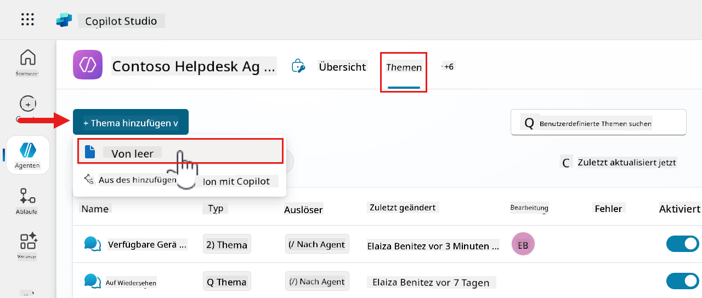

1. Benennen Sie das Thema wie folgt,

    ```text
    Request device
    ```

    Geben Sie die folgende Beschreibung für den Auslöser ein.

    ```text
    This topic helps users request a device when they answer yes to the question that asks the user if they would like to request one of these devices.
    ```

    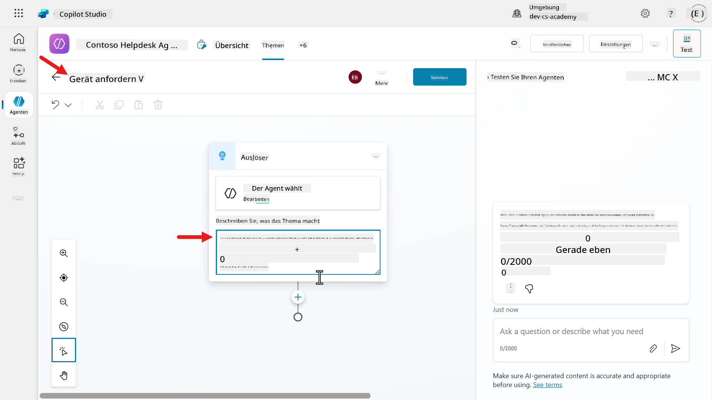
1. Fügen Sie als Nächstes einen **Frage mit adaptiver Karte**-Knoten hinzu. Dieser Knoten zeigt eine interaktive Karte an, auf der der Benutzer auswählen kann, welches Gerät er anfordern möchte.

    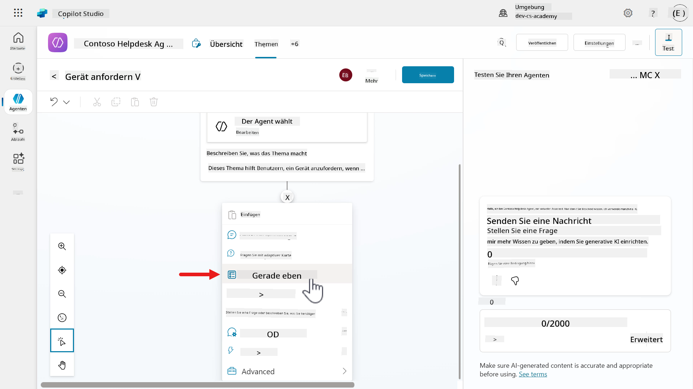

1. Wählen Sie den Knoten aus, und das **Eigenschaftenfenster des adaptiven Kartenknotens** wird angezeigt. Jetzt bearbeiten wir das JSON. Wählen Sie **Adaptive Karte bearbeiten** aus. Wählen Sie **Adaptive Karte bearbeiten** aus.

    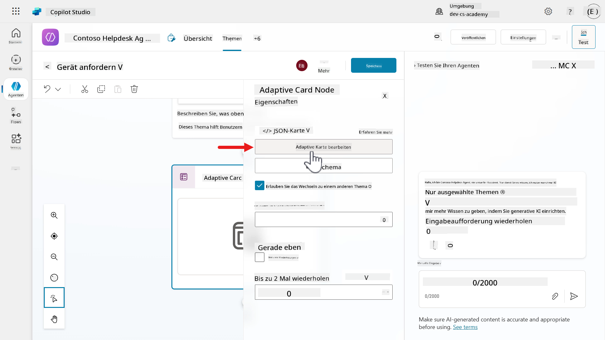

1. Dies ist der **Adaptive Card Designer**, in dem Sie Ihre Karte gestalten und das Design der Karte in Echtzeit sehen können.

    Versuchen Sie, die Kartenelemente **TextBlock** und **FactSet** per Drag-and-Drop auf die Bearbeitungsfläche, den Kartenanzeigebereich, zu ziehen. Beachten Sie, wie sich die Kartenstruktur und der Editor für die Kartennutzlast aktualisieren, sobald die beiden Kartenelemente hinzugefügt wurden. Sie können den Editor für die Kartennutzlast und das Eigenschaftenfenster der Elemente direkt aktualisieren.

    

1. Wählen Sie **Vorschau**, um die Karte in verschiedenen Breiten anzuzeigen.

    

1. Die Vorschau wird geladen, und Sie sehen verschiedene Kartenausgaben in unterschiedlichen Breiten.

    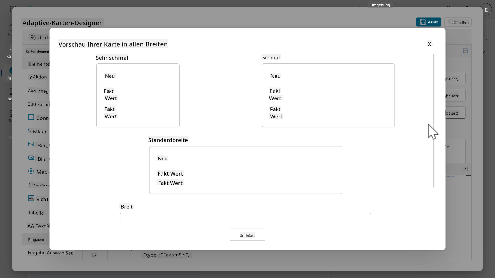

1. Beenden Sie die **Vorschau**, indem Sie auf das **x-Symbol** klicken, und wählen Sie **Rückgängig** im Designer, um die zuvor hinzugefügten zwei Kartenelemente zu entfernen.

    

1. Klicken Sie in den **Editor für die Kartennutzlast** und wählen Sie alle Zeilen mit der Windows-Tastenkombination _Strg + A_ oder der Mac-Tastenkombination _Command + A_ aus, gefolgt von Löschen der Zeilen. **Fügen Sie** das JSON aus der [Request devices .JSON-Datei](../../../../../docs/recruit/08-add-adaptive-card/assets/8.1_RequestDevice.json) ein.

    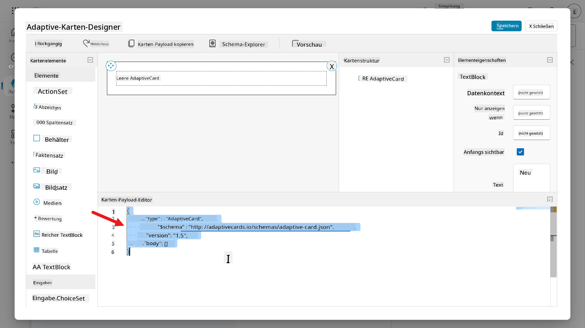

1. Beachten Sie, wie die **Karten-Vorschau** jetzt Elemente enthält, die etwas Text und eine Liste verfügbarer Geräte anzeigen.

    Dieses JSON ist derzeit ein Platzhalter und eine Vorschau dessen, was wir als Basis für unsere Karte verwenden werden, jedoch in Form einer Formel anstelle von JSON, da wir die **globale Variable** `Global.VarDevices.value` referenzieren werden, die die Antwort der **Get items** SharePoint-Connector-Aktion speichert.

    Wählen Sie **Speichern** und anschließend **Schließen**, um den Adaptive Card Designer-Modus zu verlassen.

    

1. Schließen Sie das **Eigenschaftenfenster des adaptiven Kartenknotens**, indem Sie auf das **X-Symbol** klicken.

    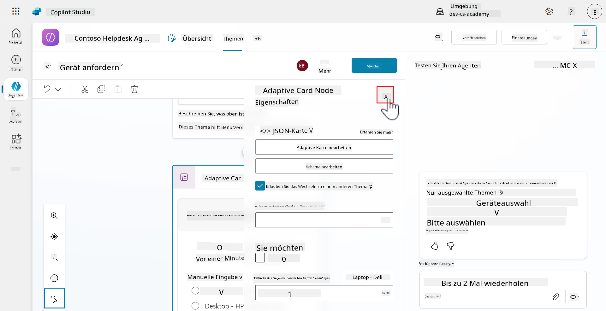

1. Im Bearbeitungsbereich des Themas sehen Sie die adaptive Karte.

    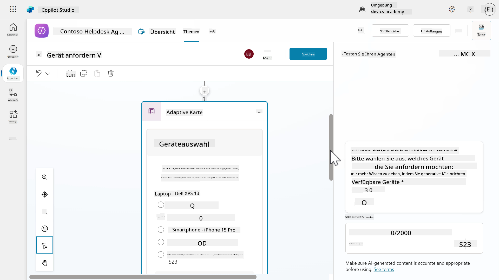

1. Scrollen Sie zum unteren Ende des Knotens, und Sie sehen Ausgabewerte. Die `commentsId` und die `deviceSelectionId` wurden in den Elementeigenschaften definiert. Diese beiden Variablen speichern Werte aus den Kartenelementen, mit denen die Benutzer interagieren. Diese Werte werden später im Thema verwendet, was wir im nächsten Lab der Lektion lernen werden.

    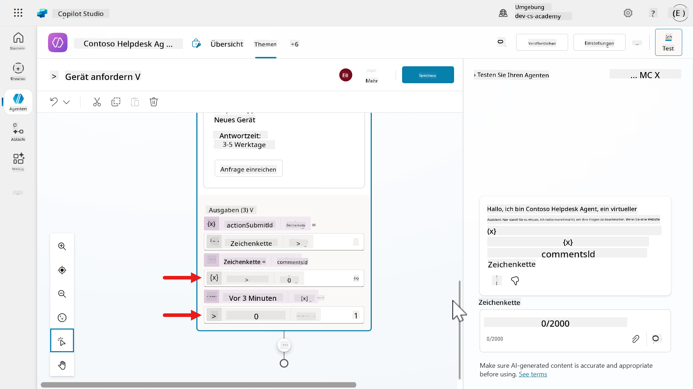

1. Aktualisieren wir als Nächstes die Karte von JSON zu einer Formel, da wir Power Fx erneut verwenden werden, um durch die in der **Get items** SharePoint-Connector-Aktion zurückgegebenen Elemente zu iterieren, die in der **globalen Variable** `Global.VarDevices.value` über die `value`-Eigenschaft der JSON-Antwort gespeichert sind.

    > Wir haben diese globale Variable in [Lab 07 - Neues Thema mit Gesprächsknoten hinzufügen, 7.3 Ein Tool mit einem Connector hinzufügen](../07-add-new-topic-with-trigger/README.md#73-add-a-tool-using-a-connector) erstellt.

    Wählen Sie die Karte im **Frage mit adaptiver Karte**-Knoten aus, gefolgt von der Auswahl des **Chevron-Symbols**, und wählen Sie **Formel**.

    

1. Klicken Sie auf das **Erweitern-Symbol**, um das Formel-Feld zu vergrößern.

    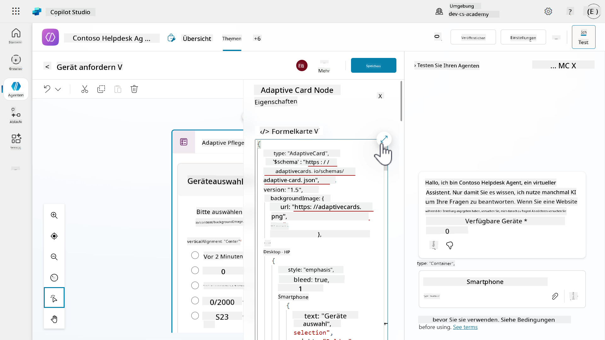

1. Klicken Sie in den **Editor für die Kartennutzlast** und wählen Sie alle Zeilen mit der Windows-Tastenkombination _Strg + A_ oder der Mac-Tastenkombination _Command + A_ aus, gefolgt von Löschen der Zeilen.

    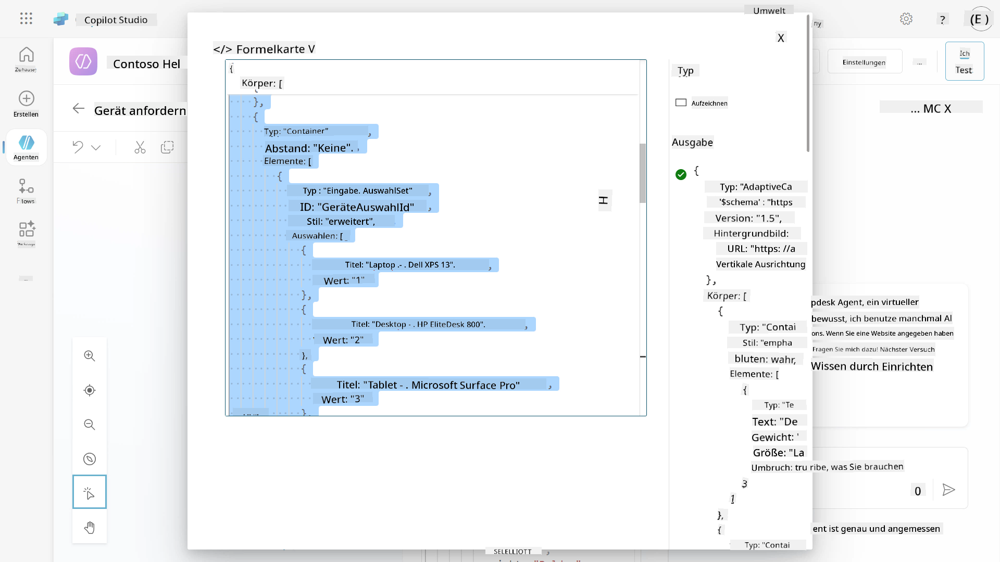

    Fügen Sie die Formel aus der [Request Devices Formel-Datei](../../../../../docs/recruit/08-add-adaptive-card/assets/8.1_RequestDeviceFormula.txt) ein.

1. In der Formel iterieren wir durch jedes SharePoint-Listenelement mit der Funktion `For All`, um die Werte von `Model` im Titel der Auswahloption anzuzeigen, und die SharePoint-Element-ID wird als Wert referenziert. Wir umschließen die Werte auch mit der Funktion `If(IsBlank()`, da die Formel einen Wert erwartet, um die adaptive Karte im Bearbeitungsbereich des Themas zu rendern. Andernfalls erscheint eine Nachricht: "Property cannot be null".

    **Schließen** Sie das Kartenmodal.

    

1. **Schließen** Sie das **Eigenschaftenfenster des adaptiven Kartenknotens**.

1. **Speichern** Sie das Thema.

    

### 8.2 Agentenanweisungen aktualisieren, um das Thema Geräteanfrage aufzurufen

Nachdem wir das neue Thema erstellt haben, das die Geräteanfragen bearbeitet, müssen wir die **Agentenanweisungen** aktualisieren, um das Thema aufzurufen.

1. Wählen Sie die Registerkarte **Übersicht** aus, und wählen Sie in den **Agentenanweisungen** **Bearbeiten** aus.

    

1. Fügen Sie eine neue Zeile unterhalb der vorherigen Anweisung aus [Lab 07 - Neues Thema mit Gesprächsknoten hinzufügen, 7.3 Ein Tool mit einem Connector hinzufügen](../07-add-new-topic-with-trigger/README.md#73-add-a-tool-using-a-connector) hinzu.

    ```text
    - If the user answers yes to the question of requesting a device, trigger [Request device]. Otherwise if they answer no to the question of requesting a device, trigger [Goodbye].
    ```

    Wählen Sie den gesamten Themenplatzhalter in eckigen Klammern aus und löschen Sie den Platzhalter.

    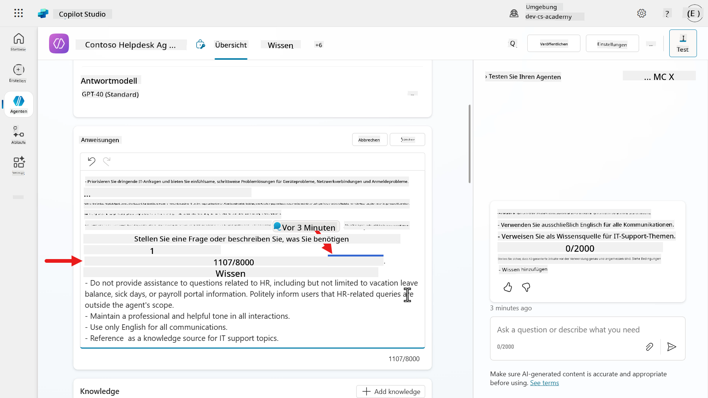

1. Geben Sie `/Req` ein und wählen Sie das Thema **Request devices** aus.

    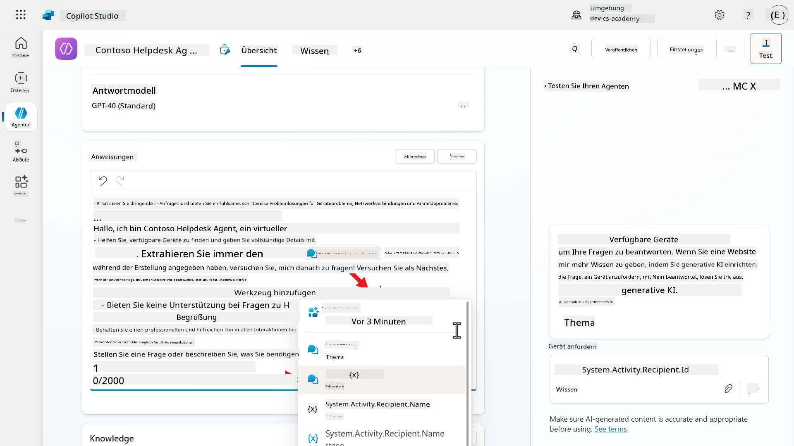

1. Wiederholen Sie die gleichen Schritte für den nächsten Themenplatzhalter, **[Goodbye]**. Wählen Sie den gesamten Themenplatzhalter in eckigen Klammern aus und löschen Sie den Platzhalter. Geben Sie `/Goodbye` ein und wählen Sie das Thema **Goodbye** aus.

    - Wenn der Benutzer mit **Ja** antwortet, wenn der Agent fragt, ob er ein Gerät anfordern möchte, wird der Agent vom Thema **Verfügbare Geräte** zum Thema **Geräteanfrage** weitergeleitet.

    - Wenn der Benutzer mit **Nein** antwortet, wird der Agent vom Thema **Verfügbare Geräte** zum Thema **Goodbye** weitergeleitet.

    **Speichern** Sie die aktualisierten Anweisungen.

    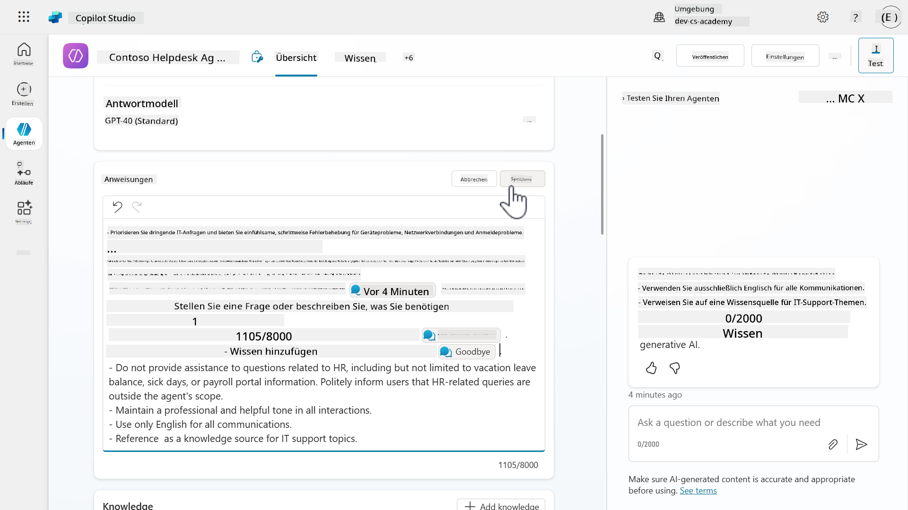

1. Testen wir nun die Weiterleitung vom Thema _Verfügbare Geräte_ zum Thema _Geräteanfrage_. Wählen Sie **Testen**, um das Testfenster zu laden, und wählen Sie **Aktualisieren**.

    Wählen Sie dann das **Aktivitätskarten-Symbol** im Testfenster aus, gefolgt von der Aktivierung von **Zwischen Themen verfolgen**. Dadurch können wir sehen, dass das Thema _Verfügbare Geräte_ zum Thema _Geräteanfrage_ weitergeleitet wurde.

    OK, wir sind bereit zu testen! Geben Sie Folgendes im Testfenster ein.

    ```text
    I need a laptop
    ```

    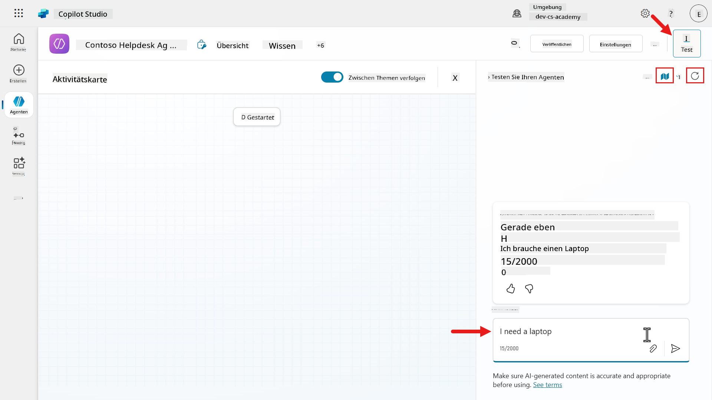

1. Der Agent antwortet mit der Liste der verfügbaren Geräte, gefolgt von der Frage, ob der Benutzer ein Gerät anfordern möchte. Kopieren und fügen Sie Folgendes ein,

    ```text
    yes please
    ```

    

1. Als Nächstes sehen wir, dass der Agent zum Thema **Geräteanfrage** weitergeleitet wurde. Der Agent hat dieses Thema gemäß den hinzugefügten Anweisungen aufgerufen.

    Die adaptive Karte mit den interaktiven Elementen wird nun als Nachricht an den Benutzer angezeigt.

    

1. Wir haben nun erfolgreich getestet 😄, dass das Thema _Verfügbare Geräte_ zum Thema _Geräteanfrage_ weiterleitet. Wir werden in der nächsten Lektion weitere Verbesserungen zu diesem Thema hinzufügen.

    Aktualisieren Sie das Testfenster.

    

## ✅ Mission abgeschlossen

Herzlichen Glückwunsch! 👏🏻 Sie haben gelernt, wie man adaptive Karten mit Power Fx-Formeln hinzufügt, um Daten aus Variablen anzuzeigen, und Sie haben auch gelernt, wie man von einem Thema zu einem anderen weiterleitet. Das Erstellen von kleinen Themen macht Ihren Agenten organisierter und hilft den Benutzern, durch verschiedene Teile des Gesprächsflusses mit dem Agenten geführt zu werden.

Dies ist das Ende von **Lab 08 - Benutzerinteraktionen mit adaptiven Karten verbessern**, wählen Sie den untenstehenden Link, um zur nächsten Lektion zu wechseln. Wir werden den Anwendungsfall in diesem Lab in der folgenden Lektion erweitern.

⏭️ [Zur Lektion **Einen Agentenfluss zu Ihrem Thema für die Automatisierung hinzufügen** wechseln](../09-add-an-agent-flow/README.md)

## 📚 Taktische Ressourcen

🔗 [Verwendung von adaptiven Karten in Copilot Studio](https://learn.microsoft.com/microsoft-copilot-studio/guidance/adaptive-cards-overview?WT.mc_id=power-172619-ebenitez)

🔗 [Eine adaptive Karte in einem Nachrichtensendeknoten hinzufügen](https://learn.microsoft.com/microsoft-copilot-studio/authoring-send-message#add-an-adaptive-card?WT.mc_id=power-172619-ebenitez)

🔗 [Ausdrücke mit Power Fx erstellen](https://learn.microsoft.com/microsoft-copilot-studio/advanced-power-fx?WT.mc_id=power-172619-ebenitez)

📺 [Adaptive Karten mit Power FX erstellen](https://aka.ms/ai-in-action/copilot-studio/ep8)

<!-- markdownlint-disable-next-line MD033 -->


---

**Haftungsausschluss**:  
Dieses Dokument wurde mit dem KI-Übersetzungsdienst [Co-op Translator](https://github.com/Azure/co-op-translator) übersetzt. Obwohl wir uns um Genauigkeit bemühen, beachten Sie bitte, dass automatisierte Übersetzungen Fehler oder Ungenauigkeiten enthalten können. Das Originaldokument in seiner ursprünglichen Sprache sollte als maßgebliche Quelle betrachtet werden. Für kritische Informationen wird eine professionelle menschliche Übersetzung empfohlen. Wir übernehmen keine Haftung für Missverständnisse oder Fehlinterpretationen, die sich aus der Nutzung dieser Übersetzung ergeben.