<!--
CO_OP_TRANSLATOR_METADATA:
{
  "original_hash": "dcbcd9396b076da0a0f5d389e9ec1b12",
  "translation_date": "2025-10-17T19:08:05+00:00",
  "source_file": "docs/recruit/08-add-adaptive-card/README.md",
  "language_code": "es"
}
-->
# 🚨 Misión 08: Mejora las interacciones de usuario en Temas con Adaptive Cards

## 🕵️‍♂️ NOMBRE CLAVE: `OPERACIÓN MEJORA DE INTERFAZ`

> **⏱️ Ventana de Tiempo de la Operación:** `~45 minutos`

🎥 **Mira el Tutorial**

[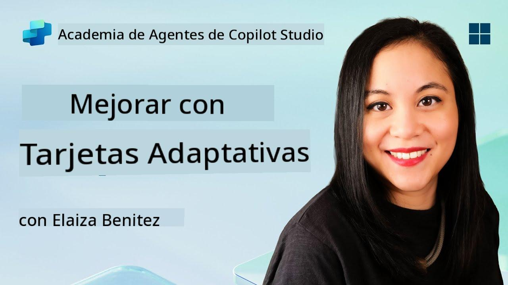](https://www.youtube.com/watch?v=RhIlzYHPCXo "Mira el tutorial en YouTube")

## 🎯 Resumen de la Misión

Agentes, su misión es infiltrarse en la experiencia de usuario estática y reemplazarla con Adaptive Cards dinámicas, ricas y accionables. Implementarán cargas útiles JSON y fórmulas Power Fx para transformar las conversaciones en Copilot Studio de preguntas y respuestas básicas a interacciones completamente interactivas. Su objetivo es recopilar información del usuario, presentar datos de manera atractiva y dirigir las conversaciones con precisión y estilo. Si no se adaptan, sus usuarios podrían migrar a interfaces menos inteligentes.

## 🔎 Objetivos

En esta misión, aprenderán:

1. Comprender qué son las Adaptive Cards y cómo mejoran las interacciones de usuario en Copilot Studio.
1. Aprender a construir tarjetas interactivas usando JSON y fórmulas Power Fx para contenido dinámico.
1. Explorar el Diseñador de Adaptive Cards y sus componentes clave para la creación visual de tarjetas.
1. Crear formularios ricos e interactivos y experiencias de recopilación de datos dentro de los temas de los agentes.
1. Implementar mejores prácticas para diseñar tarjetas adaptativas receptivas y fáciles de usar.

## 🤔 ¿Qué es una Adaptive Card?

Una **Adaptive Card** es una forma de crear elementos de interfaz de usuario interactivos y visualmente atractivos que pueden integrarse en aplicaciones como Microsoft Teams, Microsoft Outlook o agentes. Es un objeto JSON estructurado que define el diseño y contenido de una tarjeta:

- Qué elementos aparecen en la tarjeta: texto, imágenes, botones.
- Cómo se organizan esos elementos.
- Qué acciones pueden realizar los usuarios, como enviar un formulario o abrir un enlace.

    

### Por qué las Adaptive Cards son importantes en Copilot Studio

Imagina que estás creando un agente que solicita a los usuarios su nombre, correo electrónico o comentarios. Si solo usas texto plano, la conversación puede parecer aburrida o difícil de seguir. ¡Ahí es donde entran las Adaptive Cards!

1. **Hacen las conversaciones interactivas**: en lugar de enviar texto como mensajes al usuario, puedes mostrar botones, formularios, imágenes y más.
    - Ejemplo: una tarjeta puede pedir al usuario que complete su nombre y correo electrónico en un formulario limpio.

1. **Se ven bien en todas partes**: las Adaptive Cards se adaptan automáticamente al estilo de la aplicación en la que están, como el chat de Microsoft 365 Copilot o Microsoft Teams. No necesitas preocuparte por el modo oscuro, fuentes o diseños: se adaptan.

1. **Fáciles de construir con JSON**: defines la tarjeta usando código JSON (piensa en una _receta_ para la interfaz de usuario). Copilot Studio te ayuda a previsualizar tu tarjeta antes de agregarla al tema.

1. **Recopila y utiliza datos**: puedes usar la tarjeta para hacer preguntas, recopilar respuestas y usar esos datos en el flujo de la conversación.
    - Ejemplo: Solicita el número de teléfono de un usuario y luego muestra una tarjeta de confirmación con su número.

1. **Mejora la experiencia del usuario**: las tarjetas hacen que tu agente se sienta más interactivo. Es una interfaz más limpia, clicable y fácil de usar.

## 🐱 ¿Es _JSON_ una persona?

Se pronuncia como "Jason", pero no es una persona 😅

JSON, también conocido como _JavaScript Object Notation_, es un formato ligero utilizado para estructurar datos. Es fácil de leer y escribir, y parece una serie de pares clave-valor dentro de llaves {}.

Esta es una de las opciones para usar al agregar una tarjeta adaptativa a tu tema.

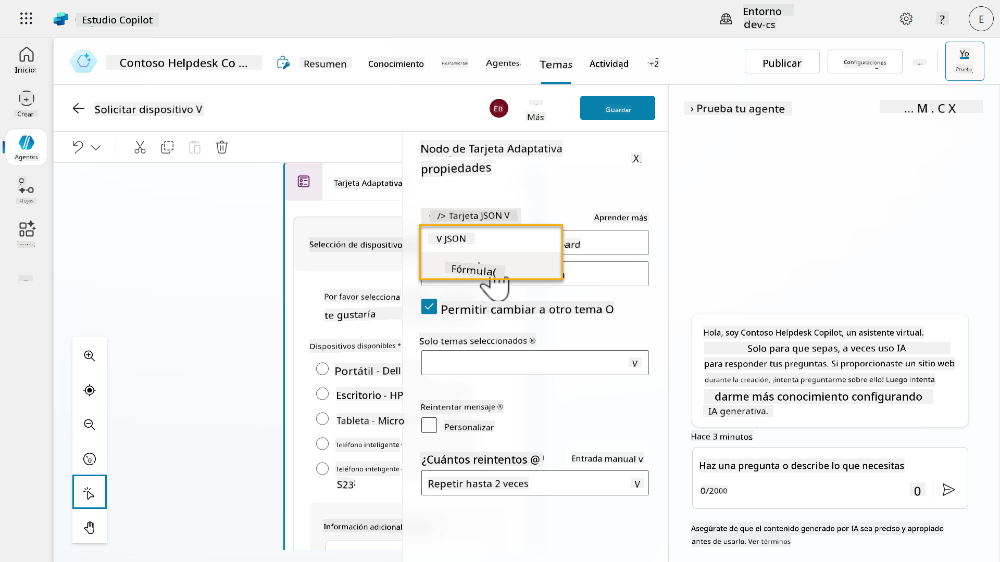

## 👀 Veo otra opción para construir una tarjeta adaptativa usando _fórmulas_

¿Recuerdas cómo aprendimos sobre Power Fx en [Misión 07 - Usar Power Fx en tus nodos](../07-add-new-topic-with-trigger/README.md#what-power-fx-can-do-in-topics)? Lo mismo se puede aplicar en las Adaptive Cards dentro de Copilot Studio.

Como recordatorio,

!!! note
    Power Fx es un lenguaje de programación de bajo código utilizado para agregar lógica y comportamiento dinámico a tu agente. Es el mismo lenguaje utilizado en Microsoft Power Apps, y está diseñado para ser simple y similar a Excel, lo que lo hace fácil para desarrolladores y no desarrolladores.

### Cómo funciona Power Fx en las Adaptive Cards

Cuando diseñas una Adaptive Card en Copilot Studio, puedes usar fórmulas Power Fx para:

- Insertar dinámicamente valores como nombres de usuario, fechas o estados.
- Formatear texto o números, como mostrar moneda o redondear números.
- Mostrar u ocultar elementos según condiciones.
- Personalizar respuestas basadas en la entrada del usuario, variables, salidas de nodos de conversación.

Por ejemplo,

"`Hola`" & `System.User.DisplayName`

Esta fórmula combina la palabra "Hola" con el nombre del usuario de manera dinámica.

### Por qué es útil

1. **Personalización**

    Puedes adaptar el mensaje a cada usuario, haciendo que las interacciones se sientan más naturales y relevantes.

1. **Contenido dinámico**

    Las tarjetas pueden mostrar datos reales de variables y salidas de nodos de conversación.

1. **Lógica inteligente**

    Puedes controlar lo que los usuarios ven o interactúan según condiciones, mejorando la usabilidad y reduciendo errores.

1. **Amigable con el bajo código**

    Power Fx es un lenguaje de programación de bajo código. Como se mencionó anteriormente, es legible, intuitivo y similar a las fórmulas de Excel.

## 👷🏻‍♀️ Construyendo con el Diseñador de Adaptive Cards

El **Diseñador de Adaptive Cards** es una herramienta visual que te permite construir tarjetas de mensajes interactivas utilizando elementos de arrastrar y soltar como texto, imágenes, botones y entradas. Su propósito es ayudarte a crear mensajes ricos y dinámicos sin escribir código complejo, facilitando el diseño de interfaces fáciles de usar.

La herramienta de diseño te ayuda a construir la tarjeta visualmente, pero detrás de escena, está generando el objeto JSON por ti. También puedes cambiar a _fórmulas_, lo que permite usar expresiones Power Fx en la tarjeta para mostrar datos de otros lugares.

## 🎨 Entendiendo el Diseñador de Adaptive Cards

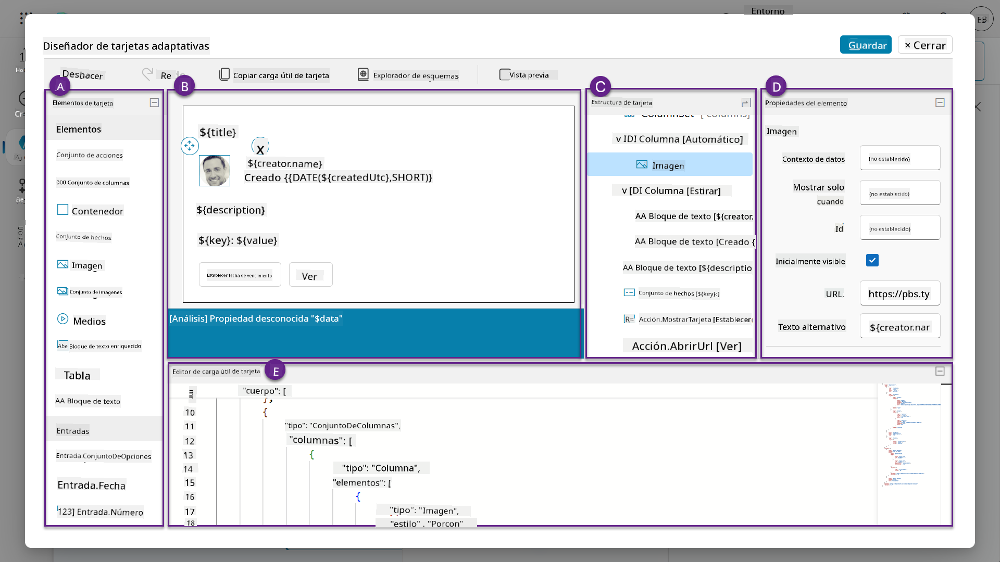

### A) Elementos de la tarjeta

Estos son los bloques de construcción de tu tarjeta adaptativa. Puedes arrastrar y soltar elementos como los siguientes:

- **TextBlock** para mostrar texto.
- **Image** para mostrar imágenes.
- **FactSet** para pares clave-valor.
- **Campos de entrada** para mostrar cuadros de texto, selectores de fecha, interruptores.
- **Acciones** para mostrar botones como _Enviar_, _Abrir URL_ o _Mostrar tarjeta_.

Cada elemento tiene su propio propósito y puede ser estilizado o configurado.

### B) Visor de la tarjeta

Esta es el área de **Vista previa** donde ves cómo se verá tu tarjeta en tiempo real. A medida que agregas o editas elementos, el visor se actualiza instantáneamente para reflejar los cambios. Esto te permite hacer actualizaciones iterativas y ver el resultado del diseño al mismo tiempo.

### C) Estructura de la tarjeta

Esto muestra la **jerarquía y diseño** de tu tarjeta. Por ejemplo:

- Una tarjeta puede comenzar con un **TextBlock** para el título.
- Luego un **ColumnSet** con una imagen en un lado y texto en el otro.
- Seguido por un **FactSet** y algunos **botones de acción**.

Te ayuda a entender cómo se anidan y organizan los elementos.

### D) Propiedades del elemento

Cuando haces clic en cualquier elemento de la tarjeta, este panel te permite **personalizar sus configuraciones**:

- Cambiar el tamaño, peso o color del texto.
- Establecer URLs de imágenes o texto alternativo.
- Configurar opciones de entrada como texto de marcador de posición o valores predeterminados.

Aquí es donde ajustas cada elemento.

### E) Editor de carga útil de la tarjeta

Este es el **código JSON en bruto** detrás de tu tarjeta. Los usuarios avanzados pueden editar esto directamente para:

- Usar funciones de plantillas.
- Copiar/pegar definiciones de tarjetas.

Incluso si eres nuevo en el Diseñador de Adaptive Cards, es útil ver cómo el diseño visual se traduce en código.

!!! tip "Consejo - Explora los ejemplos de Adaptive Cards"

    1. Navega a [https://adaptivecards.microsoft.com/designer](https://adaptivecards.microsoft.com/designer).
    2. Selecciona **Nueva tarjeta** para ver una lista de ejemplos que puedes elegir y modificar.
    3. Ten en cuenta que este diseñador es externo (basado en la web). Cuando construyas tu tarjeta en el Diseñador de Adaptive Cards basado en la web, copia el JSON del Editor de carga útil de la tarjeta.
    4. Pega el JSON en tu tarjeta adaptativa en tu agente en Copilot Studio.

    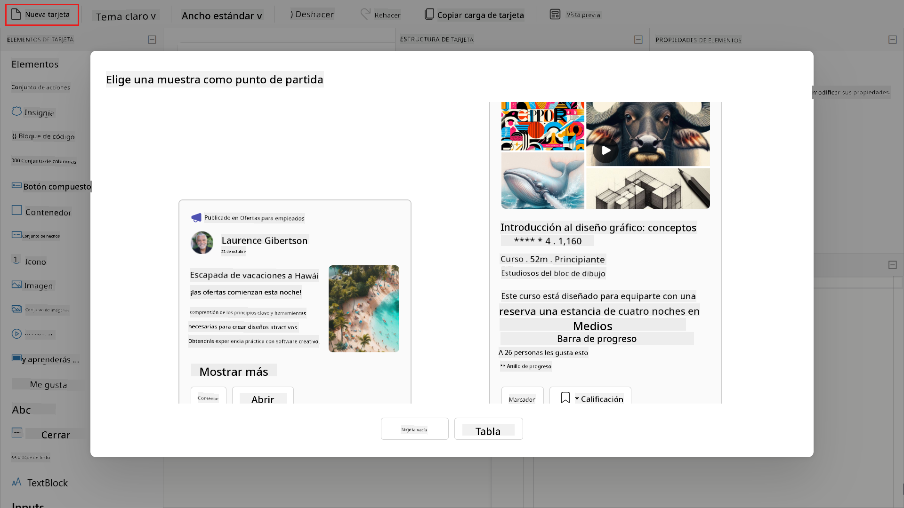

## 🌵 Casos de uso comunes

Los siguientes son casos de uso comunes para las Adaptive Cards en Copilot Studio cuando se utilizan en los nodos **Enviar un mensaje** o **Hacer una pregunta**.

1. **Formularios y recopilación de datos**

    Usa tarjetas adaptativas para recopilar información estructurada de los usuarios, como:

    - Solicitudes de permiso.
    - Formularios de comentarios.
    - Información de contacto.
    - Programación de citas.

1. **Mostrar información dinámica**

    Muestra a los usuarios datos personalizados o en tiempo real en un formato limpio y legible desde fuentes empresariales como ServiceNow, SAP, Dynamics 365, SharePoint, etc.

    - Resúmenes de pedidos.
    - Saldos de cuentas.
    - Estado de tickets o casos.
    - Próximos eventos o fechas límite.

1. **Opciones interactivas**

    Permite a los usuarios hacer selecciones directamente en la conversación:

    - Elegir de una lista de opciones, por ejemplo, categorías de productos, temas de soporte.
    - Confirmar o cancelar una acción.
    - Calificar un servicio o experiencia.

1. **Acciones desencadenantes**

    Incluye botones que desencadenan pasos adicionales en la conversación interna o externamente.

    - "Enviar solicitud".
    - "Ver detalles".

## ⭐ Mejores prácticas

Aquí hay algunas mejores prácticas para crear Adaptive Cards para agentes en Copilot Studio.

1. **Mantén la tarjeta simple y enfocada**

    - Diseña tarjetas con un propósito claro, no las sobrecargues con demasiados elementos.
    - Usa texto conciso y diseños intuitivos para guiar a los usuarios a través de la interacción.

1. **Sé intencional con las entradas**

    - Incluye solo los elementos de entrada necesarios, como texto, opciones de fecha, para evitar abrumar a los usuarios.
    - Usa etiquetas para que las entradas sean fáciles de entender.

1. **Estructura para la legibilidad**

    - Usa **TextBlocks** para encabezados e instrucciones.
    - Agrupa elementos relacionados usando **Containers** o **ColumnSets** para mejorar el flujo visual.

1. **Haz que los elementos de acción sean claros**

    - Usa **Action.Submit** y/o **Action.OpenUrl** con títulos de botones claros como "Enviar solicitud" o "Ver detalles".
    - Evita etiquetas vagas como "Haz clic aquí".

1. **Diseña para la adaptabilidad**

    - Asume que la tarjeta puede ser vista en diferentes tamaños de pantalla.
    - Evita anchos fijos y usa diseños flexibles como **ColumnSets** para mayor adaptabilidad.

1. **Usa contenido dinámico cuando sea posible**

    - Vincula elementos de la tarjeta a variables o salidas de nodos usando Power Fx para personalizar la experiencia del usuario.
    - Por ejemplo, muestra el nombre del usuario o el estado actual de manera dinámica.

## 🧪 Laboratorio 08 - Agregar tarjetas adaptativas y mejorar las capacidades del tema

Ahora vamos a aprender cómo mejorar nuestro tema con tarjetas adaptativas y usar funcionalidades avanzadas de temas y nodos.

- [8.1 Crear un nuevo tema con una tarjeta adaptativa para que el usuario envíe su solicitud](../../../../../docs/recruit/08-add-adaptive-card)
- [8.2 Actualizar las instrucciones del agente para invocar el tema Solicitar dispositivo](../../../../../docs/recruit/08-add-adaptive-card)

### ✨ Caso de uso

**Como** empleado

**Quiero** solicitar un dispositivo

**Para que** pueda pedir un dispositivo de la lista de dispositivos disponibles

¡Comencemos!

### Requisitos previos

1. **Lista de SharePoint**

    Usaremos la lista de **Dispositivos** de SharePoint de [Lección 00 - Configuración del curso - Paso 3: Crear nuevo sitio de SharePoint](../00-course-setup/README.md#step-4-create-new-sharepoint-site).

    Si no has configurado la lista de **Dispositivos** de SharePoint, por favor regresa a [Lección 00 - Configuración del curso - Paso 3: Crear nuevo sitio de SharePoint](../00-course-setup/README.md#step-4-create-new-sharepoint-site).

1. **Contoso Helpdesk Copilot**

    Vamos a usar el mismo agente creado previamente en [Lección 06 - Crear un agente personalizado usando lenguaje natural con Copilot y conectándolo con tus datos](../06-create-agent-from-conversation/README.md).

### 8.1 Crear un nuevo tema con una tarjeta adaptativa para que el usuario envíe su solicitud

Crearemos un nuevo tema que manejará la solicitud de dispositivo de un usuario. Este nuevo tema contendrá un nodo **Preguntar con tarjeta adaptativa** para habilitar la interacción del usuario con el agente.

¡Comencemos!

1. Selecciona la pestaña **Temas**, luego selecciona **+ Agregar un tema desde cero**.

    

1. Nombra el tema de la siguiente manera,

    ```text
    Request device
    ```

    Ingresa lo siguiente como la descripción para el disparador.

    ```text
    This topic helps users request a device when they answer yes to the question that asks the user if they would like to request one of these devices.
    ```

    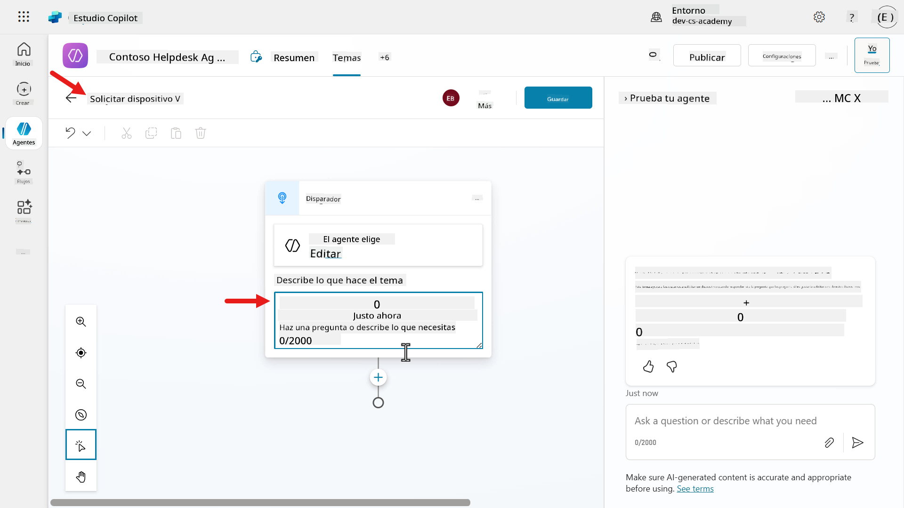
1. A continuación, agrega un nodo **Preguntar con tarjeta adaptativa**. Este nodo mostrará una tarjeta interactiva para que el usuario seleccione qué dispositivo desea solicitar.

    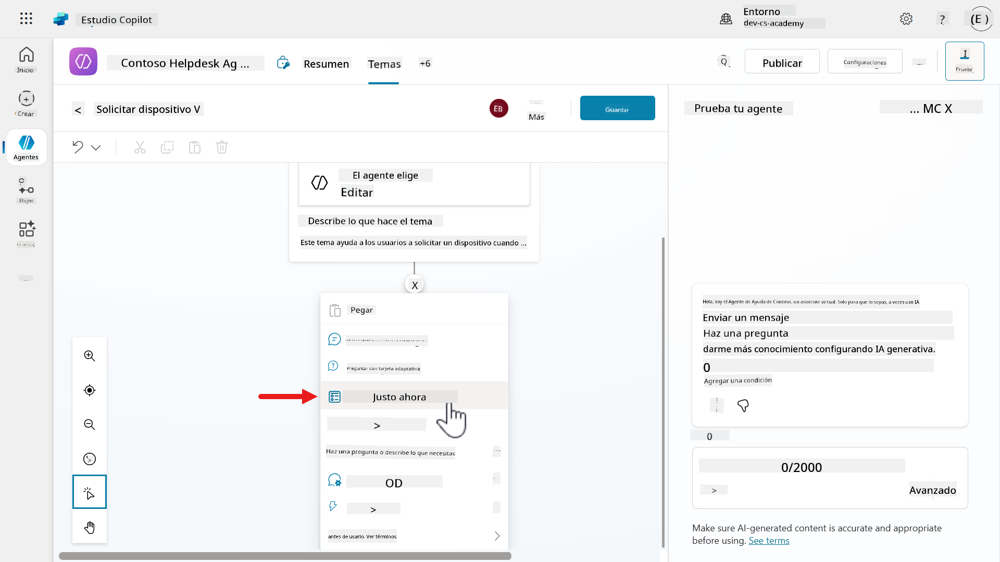

1. Selecciona el nodo y aparecerá el panel de **Propiedades del nodo de tarjeta adaptativa**. Ahora vamos a editar el JSON. Selecciona **Editar tarjeta adaptativa**.

    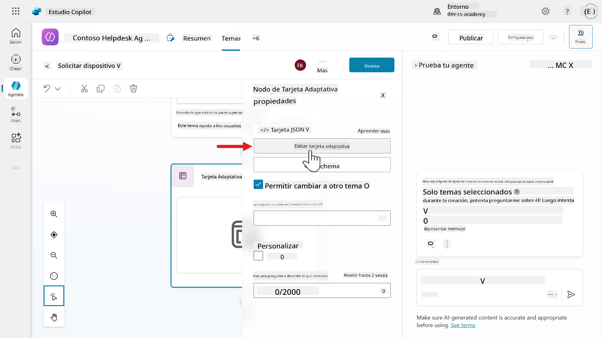

1. Este es el **Diseñador de tarjetas adaptativas**, donde puedes diseñar tu tarjeta y ver el diseño en tiempo real.

    Intenta arrastrar y soltar los elementos de tarjeta **TextBlock** y **FactSet** en el lienzo de creación, el área de visualización de la tarjeta. Observa cómo se actualizan la estructura de la tarjeta y el editor de carga útil de la tarjeta a medida que se agregan los dos elementos. Puedes actualizar directamente el editor de carga útil de la tarjeta y el panel de propiedades de los elementos.

    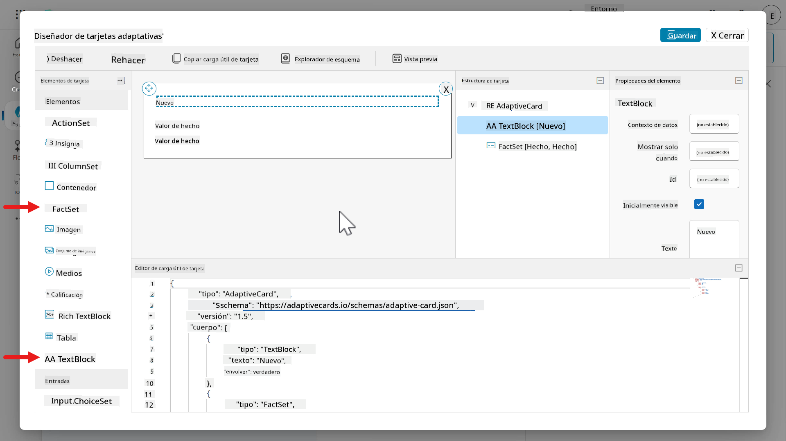

1. Selecciona **Vista previa** para ver la tarjeta en diferentes anchos.

    

1. La vista previa se cargará y podrás ver diferentes resultados de la tarjeta según el ancho.

    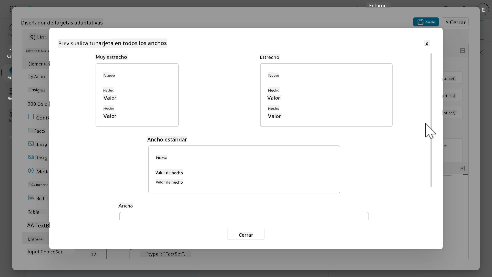

1. Sal de la **Vista previa** seleccionando el **icono x** y selecciona **Deshacer** en el diseñador para eliminar los dos elementos de tarjeta agregados previamente.

    

1. Haz clic en el **Editor de carga útil de la tarjeta** y selecciona todas las líneas usando el atajo de teclado de Windows _Ctrl + A_ o el atajo de teclado de Mac _Command + A_, seguido de eliminar las líneas. **Pega** el JSON del archivo [Request devices .JSON file](../../../../../docs/recruit/08-add-adaptive-card/assets/8.1_RequestDevice.json).

    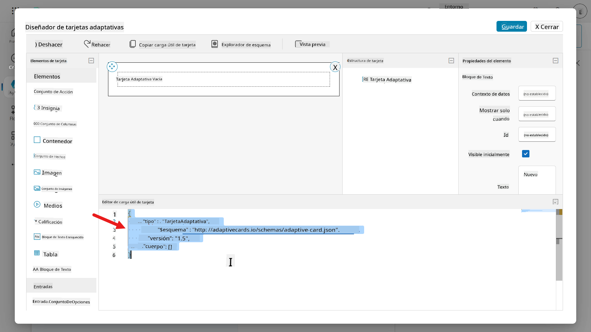

1. Observa cómo la **Vista previa de la tarjeta** ahora incluye elementos que muestran algo de texto y una lista de dispositivos disponibles.

    Este JSON es actualmente un marcador de posición y una vista previa de lo que usaremos como base para nuestra tarjeta, pero en forma de fórmula en lugar de JSON, ya que vamos a referenciar la **variable global**, `Global.VarDevices.value`, que almacena la respuesta de la acción del conector de SharePoint **Obtener elementos**.

    Selecciona **Guardar** y luego **Cerrar** para salir del modal del diseñador de tarjetas adaptativas.

    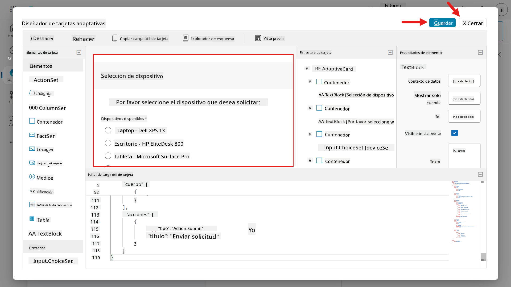

1. Cierra el panel de **Propiedades del nodo de tarjeta adaptativa** seleccionando el **icono X**.

    

1. En el lienzo de creación del tema, verás la tarjeta adaptativa.

    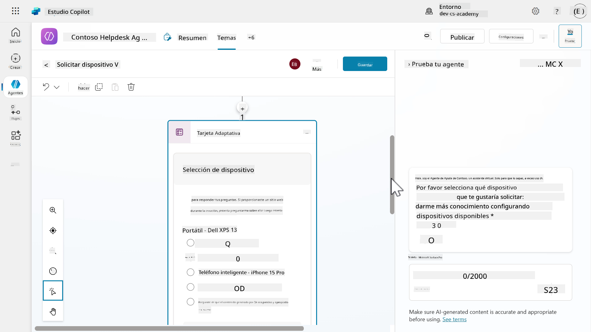

1. Desplázate hasta la parte inferior del nodo y verás las variables de salida. Los `commentsId` y el `deviceSelectionId` se definieron en las propiedades del elemento. Estas dos variables almacenarán valores de los elementos de la tarjeta con los que interactúan los usuarios. Estos valores se utilizarán más adelante en el tema, lo cual aprenderemos en el laboratorio de la próxima lección.

    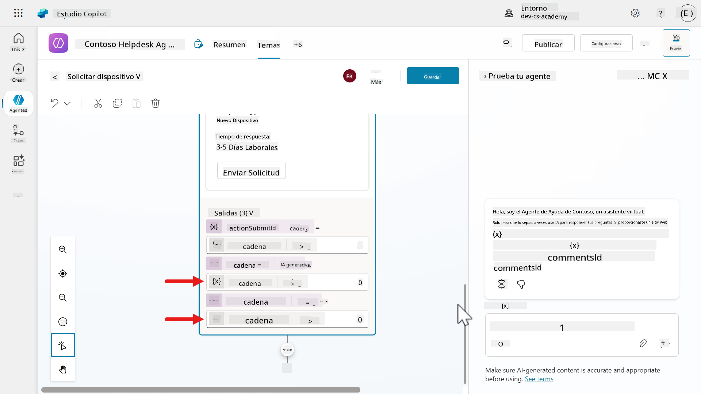

1. Ahora actualizaremos la tarjeta de JSON a fórmula, ya que usaremos Power Fx nuevamente para recorrer los elementos devueltos en la acción del conector de SharePoint **Obtener elementos**, almacenados en la **variable global**, `Global.VarDevices.value`, a través de la propiedad `value` de la respuesta JSON.

    > Creamos esta variable global en [Laboratorio 07 - Agregar un nuevo tema con nodos de conversación, 7.3 Agregar una herramienta usando un conector](../07-add-new-topic-with-trigger/README.md#73-add-a-tool-using-a-connector).

    Selecciona la tarjeta en el nodo **Preguntar con tarjeta adaptativa**, seguido de seleccionar el **icono de cheurón** y luego selecciona **Fórmula**.

    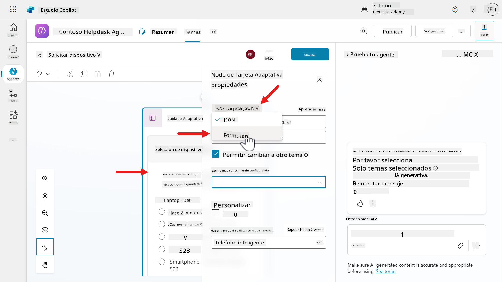

1. Haz clic en el **icono de expandir** para agrandar el campo de Fórmula.

    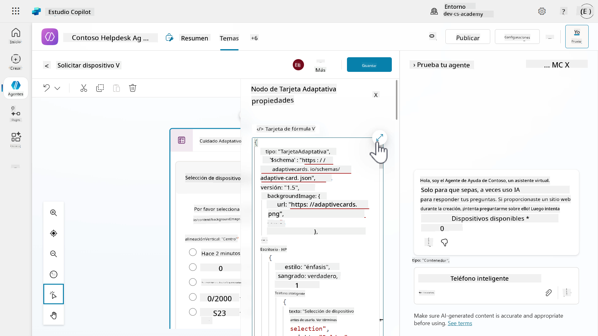

1. Haz clic en el **Editor de carga útil de la tarjeta** y selecciona todas las líneas usando el atajo de teclado de Windows _Ctrl + A_ o el atajo de teclado de Mac _Command + A_, seguido de eliminar las líneas.

    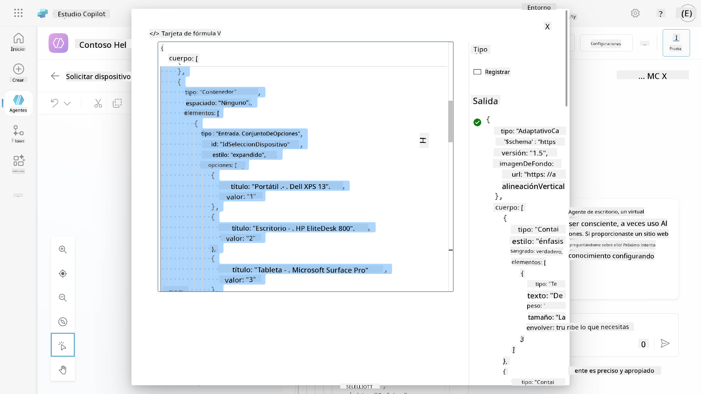

    Pega la fórmula del archivo [Request Devices formula file](../../../../../docs/recruit/08-add-adaptive-card/assets/8.1_RequestDeviceFormula.txt).

1. En la fórmula, recorreremos cada elemento de la lista de SharePoint usando la función `For All` para mostrar los valores de `Model` en el título de la opción de elección, y el `ID` del elemento de SharePoint se referencia como el valor. También envolvemos los valores con las funciones `If(IsBlank()` ya que la fórmula espera un valor para renderizar la tarjeta adaptativa en el lienzo de creación del tema. De lo contrario, aparecerá un mensaje que dice "La propiedad no puede ser nula".

    **Cerrar** el modal de la tarjeta.

    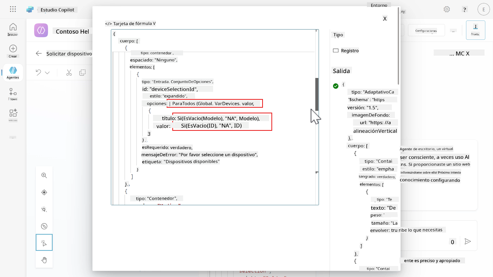

1. **Cerrar** el panel de **Propiedades del nodo de tarjeta adaptativa**.

1. **Guardar** el tema.

    

### 8.2 Actualizar las instrucciones del agente para invocar el tema de Solicitud de dispositivo

Ahora que hemos creado el nuevo tema que gestiona las solicitudes de dispositivos, necesitamos actualizar las **instrucciones del agente** para invocar el tema.

1. Selecciona la pestaña **Resumen** y en las **instrucciones del agente** selecciona **Editar**.

    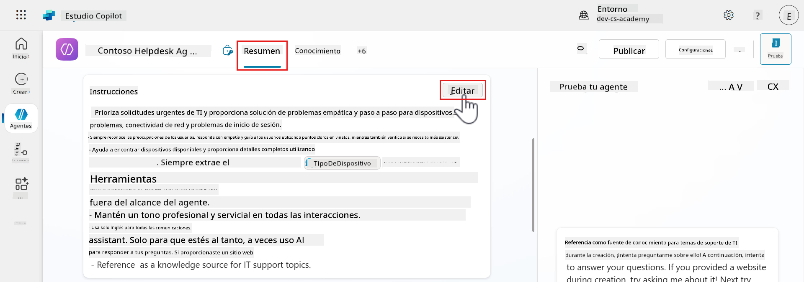

1. Agrega una nueva línea debajo de la instrucción anterior del [Laboratorio 07 - Agregar un nuevo tema con nodos de conversación, 7.3 Agregar una herramienta usando un conector](../07-add-new-topic-with-trigger/README.md#73-add-a-tool-using-a-connector).

    ```text
    - If the user answers yes to the question of requesting a device, trigger [Request device]. Otherwise if they answer no to the question of requesting a device, trigger [Goodbye].
    ```

    Selecciona todo el marcador de posición del tema entre corchetes y elimina el marcador de posición.

    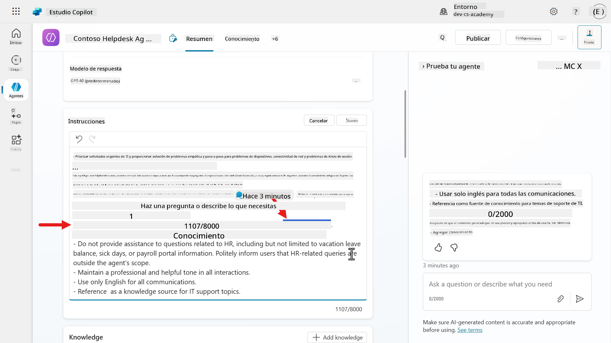

1. Escribe `/Req` y selecciona el tema **Solicitar dispositivos**.

    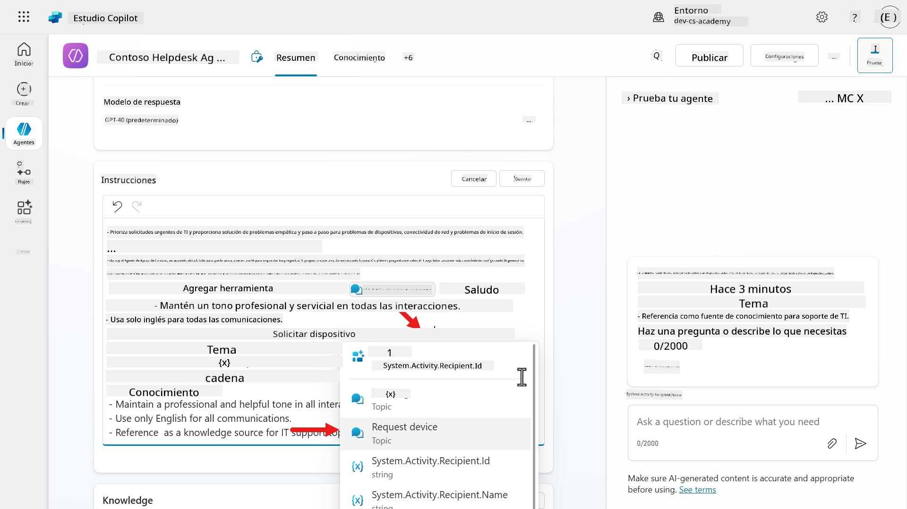

1. Repite los mismos pasos para el siguiente marcador de posición del tema, **[Adiós]**. Selecciona todo el marcador de posición del tema entre corchetes y elimina el marcador de posición. Escribe `/Goodbye` y selecciona el tema **Adiós**.

    - Cuando el usuario responde **Sí** a la pregunta del agente sobre si desea solicitar un dispositivo, el agente redirigirá del tema **Dispositivos disponibles** al tema **Solicitar dispositivos**.

    - De lo contrario, si el usuario responde **No**, el agente redirigirá del tema **Dispositivos disponibles** al tema **Adiós**.

    **Guardar** las instrucciones actualizadas.

    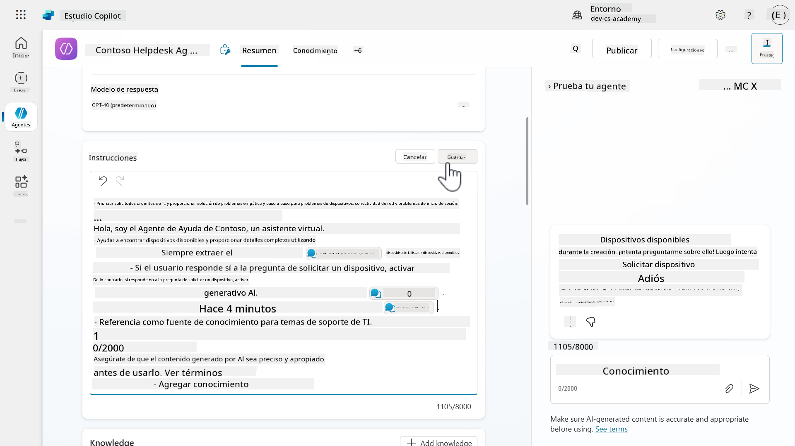

1. Ahora probemos la redirección del tema _Dispositivos disponibles_ al tema _Solicitar dispositivos_. Selecciona **Probar** para cargar el panel de pruebas y selecciona **Actualizar**.

    Luego selecciona el icono **Mapa de actividad** en el panel de pruebas, seguido de habilitar **Rastrear entre temas**. Esto nos permitirá ver que el tema _Dispositivos disponibles_ se ha redirigido al tema _Solicitar dispositivos_.

    ¡Listo, estamos listos para probar! Ingresa lo siguiente en el panel de pruebas.

    ```text
    I need a laptop
    ```

    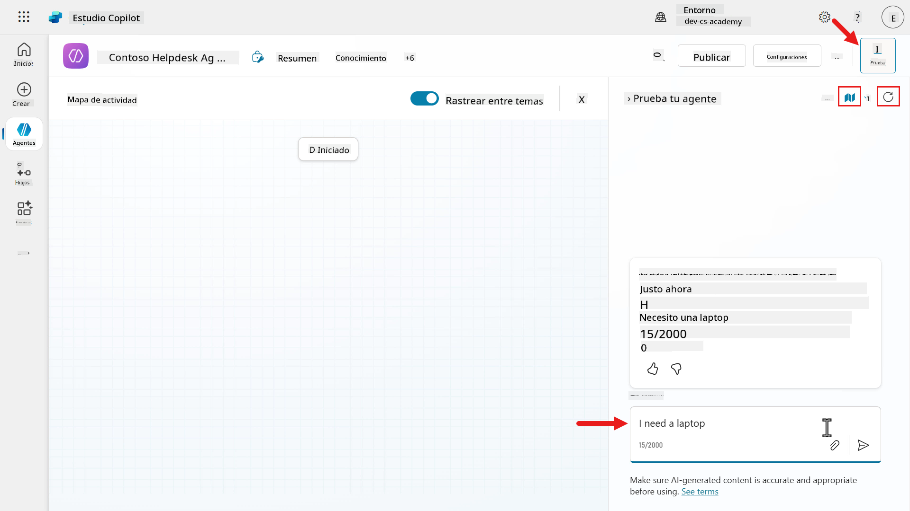

1. El agente responderá con la lista de dispositivos disponibles seguido de la pregunta sobre si el usuario desea solicitar un dispositivo. Copia y pega lo siguiente,

    ```text
    yes please
    ```

    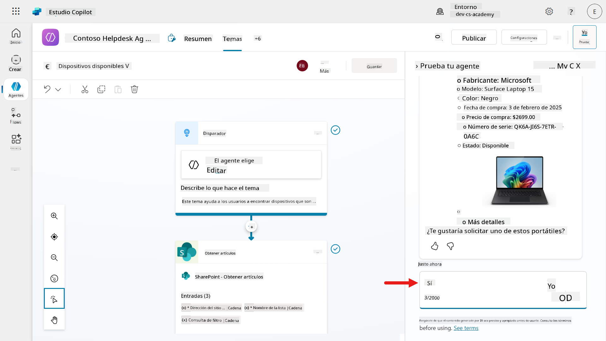

1. Luego veremos que el agente ha redirigido al tema **Solicitar dispositivo**. El agente invocó este tema según las instrucciones que agregamos.

    La tarjeta adaptativa con los elementos interactivos ahora se mostrará como mensaje al usuario.

    

1. Ahora hemos probado exitosamente 😄 la redirección del tema _Dispositivos disponibles_ al tema _Solicitar dispositivos_. Agregaremos más mejoras a este tema en el laboratorio de la próxima lección.

    Actualiza el panel de pruebas.

    

## ✅ Misión completada

¡Felicidades! 👏🏻 Has aprendido cómo agregar tarjetas adaptativas usando fórmulas de Power Fx para mostrar datos de variables, y también aprendiste cómo redirigir de un tema a otro. Crear temas pequeños hace que tu agente sea más organizado, pero también ayuda a guiar a los usuarios a través de diferentes partes del flujo de conversación con el agente.

Este es el final de **Laboratorio 08 - Mejorar las interacciones del usuario con tarjetas adaptativas**, selecciona el enlace a continuación para pasar a la siguiente lección. Ampliaremos el caso de uso de este laboratorio en el laboratorio de la siguiente lección.

⏭️ [Ir a la lección **Agregar un flujo de agente a tu tema para automatización**](../09-add-an-agent-flow/README.md)

## 📚 Recursos tácticos

🔗 [Usar tarjetas adaptativas en Copilot Studio](https://learn.microsoft.com/microsoft-copilot-studio/guidance/adaptive-cards-overview?WT.mc_id=power-172619-ebenitez)

🔗 [Agregar una tarjeta adaptativa en el nodo Enviar un mensaje](https://learn.microsoft.com/microsoft-copilot-studio/authoring-send-message#add-an-adaptive-card?WT.mc_id=power-172619-ebenitez)

🔗 [Crear expresiones usando Power Fx](https://learn.microsoft.com/microsoft-copilot-studio/advanced-power-fx?WT.mc_id=power-172619-ebenitez)

📺 [Construyendo tarjetas adaptativas con Power FX](https://aka.ms/ai-in-action/copilot-studio/ep8)


---

**Descargo de responsabilidad**:  
Este documento ha sido traducido utilizando el servicio de traducción automática [Co-op Translator](https://github.com/Azure/co-op-translator). Aunque nos esforzamos por lograr precisión, tenga en cuenta que las traducciones automáticas pueden contener errores o imprecisiones. El documento original en su idioma nativo debe considerarse la fuente autorizada. Para información crítica, se recomienda una traducción profesional realizada por humanos. No nos hacemos responsables de malentendidos o interpretaciones erróneas que surjan del uso de esta traducción.