<!--
CO_OP_TRANSLATOR_METADATA:
{
  "original_hash": "4fb913dfc3bbc71506dd3602c4b8e6ed",
  "translation_date": "2025-10-21T17:42:22+00:00",
  "source_file": "docs/operative-preview/02-multi-agent/README.md",
  "language_code": "fa"
}
-->
# 🚨 مأموریت ۰۲: عوامل متصل

--8<-- "disclaimer.md"

## 🕵️‍♂️ نام رمز: `عملیات سمفونی`

> **⏱️ زمان عملیات:** `~۴۵ دقیقه`

## 🎯 خلاصه مأموریت

خوش آمدید، مأمور. در مأموریت ۰۱، شما عامل اصلی استخدام خود را ساختید - یک پایه محکم برای مدیریت جریان‌های کاری استخدام. اما یک عامل تنها نمی‌تواند همه کارها را انجام دهد.

وظیفه شما، اگر تصمیم به پذیرش آن دارید، **عملیات سمفونی** است - تبدیل عامل تک‌نفره شما به یک **سیستم چندعاملی**: یک تیم هماهنگ از عوامل تخصصی که با هم کار می‌کنند تا چالش‌های پیچیده استخدام را مدیریت کنند. این را مانند ارتقاء از یک اپراتور تنها به فرماندهی یک نیروی وظیفه تخصصی تصور کنید.

مانند یک ارکستر سمفونی که هر نوازنده نقش خود را با هماهنگی کامل ایفا می‌کند، شما دو متخصص حیاتی به عامل استخدام موجود خود اضافه خواهید کرد: یک عامل پذیرش درخواست برای پردازش خودکار رزومه‌ها و یک عامل آماده‌سازی مصاحبه برای ایجاد مواد جامع مصاحبه. این عوامل به طور یکپارچه تحت فرماندهی اصلی شما کار خواهند کرد.

## 🔎 اهداف

در این مأموریت، شما یاد خواهید گرفت:

1. زمان استفاده از **عوامل فرعی** در مقابل **عوامل متصل**
1. نحوه طراحی **معماری‌های چندعاملی** که قابلیت گسترش دارند  
1. ایجاد **عوامل فرعی** برای وظایف متمرکز
1. برقراری **الگوهای ارتباطی** بین عوامل
1. ساخت عامل پذیرش درخواست و عامل آماده‌سازی مصاحبه

## 🧠 عوامل متصل چیستند؟

در Copilot Studio، شما محدود به ساخت عوامل تک‌نفره و یکپارچه نیستید. شما می‌توانید **سیستم‌های چندعاملی** ایجاد کنید - شبکه‌هایی از عوامل تخصصی که با هم کار می‌کنند تا جریان‌های کاری پیچیده را مدیریت کنند.

این را مانند یک سازمان واقعی تصور کنید: به جای اینکه یک نفر همه کارها را انجام دهد، شما متخصصانی دارید که در وظایف خاصی مهارت دارند و در صورت نیاز همکاری می‌کنند.

### چرا سیستم‌های چندعاملی مهم هستند

- **قابلیت گسترش:** هر عامل می‌تواند به طور مستقل توسط تیم‌های مختلف توسعه، آزمایش و نگهداری شود.  
- **تخصص:** عوامل می‌توانند بر روی کاری که بهترین انجام می‌دهند تمرکز کنند. شاید یکی برای پردازش داده‌ها، دیگری برای تعامل با کاربر، و دیگری برای تصمیم‌گیری.  
- **انعطاف‌پذیری:** شما می‌توانید عوامل را ترکیب و تطبیق دهید، آنها را در پروژه‌های مختلف استفاده کنید و سیستم خود را به تدریج تکامل دهید.  
- **نگهداری‌پذیری:** تغییرات در یک عامل لزوماً بر دیگران تأثیر نمی‌گذارد، که به‌روزرسانی‌ها را ایمن‌تر و آسان‌تر می‌کند.

### مثال واقعی: فرآیند استخدام

در نظر بگیرید که جریان کاری استخدام ما - عوامل مختلف ممکن است با مسئولیت‌های زیر با هم کار کنند:

- **پذیرش رزومه** نیاز به مهارت‌های تجزیه و تحلیل اسناد و استخراج داده دارد
- **امتیازدهی** شامل ارزیابی رزومه‌های کاندیداها و تطبیق آنها با الزامات شغلی است
- **آماده‌سازی مصاحبه** نیاز به استدلال عمیق درباره تناسب کاندیدا دارد  
- **ارتباط با کاندیدا** نیاز به توانایی‌های ارتباطی همدلانه دارد

به جای ساخت یک عامل عظیم که تلاش می‌کند همه این مهارت‌های مختلف را مدیریت کند، شما می‌توانید عوامل تخصصی برای هر بخش ایجاد کنید و آنها را با هم هماهنگ کنید.

## 🔗 عوامل فرعی در مقابل عوامل متصل: تفاوت کلیدی

Copilot Studio دو روش برای ساخت سیستم‌های چندعاملی ارائه می‌دهد، هر کدام با موارد استفاده خاص خود:

### ↘️ عوامل فرعی

عوامل فرعی **متخصصان سبک‌وزن** هستند که درون عامل اصلی شما زندگی می‌کنند. آنها را مانند تیم‌های تخصصی در یک بخش تصور کنید.

#### جزئیات فنی کلیدی

- عوامل فرعی درون عامل اصلی زندگی می‌کنند و یک صفحه تنظیمات واحد دارند.
- ابزارها و دانش **در عامل اصلی ذخیره می‌شوند**، اما برای عامل فرعی "در دسترس" تنظیم می‌شوند.
- عوامل فرعی **موضوعات عامل اصلی خود را به اشتراک می‌گذارند**. موضوعات می‌توانند توسط دستورالعمل‌های عامل فرعی ارجاع شوند.
- عوامل فرعی **نیاز به انتشار جداگانه ندارند** - آنها به طور خودکار درون عامل اصلی خود در دسترس هستند. این کار آزمایش را آسان‌تر می‌کند زیرا تغییرات در عامل اصلی و عوامل فرعی می‌توانند در **همان فضای کاری مشترک** انجام شوند.

#### از عوامل فرعی استفاده کنید وقتی که

- یک تیم واحد کل راه‌حل را مدیریت می‌کند
- شما می‌خواهید ابزارها و دانش را به طور منطقی به عوامل فرعی سازماندهی کنید
- نیازی به احراز هویت یا استقرار جداگانه برای هر عامل ندارید
- عوامل به طور جداگانه منتشر نمی‌شوند یا به طور مستقل استفاده نمی‌شوند
- نیازی به استفاده مجدد از عوامل در چندین راه‌حل ندارید

**مثال:** یک عامل میز کمک IT با عوامل فرعی برای:

- روش‌های بازنشانی رمز عبور
- عیب‌یابی سخت‌افزار  
- راهنمای نصب نرم‌افزار

### 🔀 عوامل متصل

عوامل متصل **عوامل مستقل و کامل** هستند که عامل اصلی شما می‌تواند با آنها همکاری کند. آنها را مانند بخش‌های جداگانه‌ای تصور کنید که با هم روی یک پروژه کار می‌کنند.

#### جزئیات فنی کلیدی

- عوامل متصل **موضوعات و جریان‌های مکالمه خود را دارند**. آنها به طور مستقل با تنظیمات، منطق و چرخه عمر استقرار خود عمل می‌کنند.
- عوامل متصل **باید منتشر شوند** قبل از اینکه بتوانند به عامل‌های دیگر اضافه شوند و استفاده شوند.
- در طول آزمایش، تغییرات در عامل متصل باید منتشر شوند قبل از اینکه بتوانند توسط عامل فراخواننده استفاده شوند.

#### از عوامل متصل استفاده کنید وقتی که

- تیم‌های مختلف عوامل مختلف را به طور مستقل توسعه و نگهداری می‌کنند
- عوامل نیاز به تنظیمات، احراز هویت و کانال‌های استقرار خود دارند
- شما می‌خواهید عوامل را به طور جداگانه منتشر و نگهداری کنید با مدیریت چرخه عمر برنامه مستقل برای هر عامل
- عوامل باید در چندین راه‌حل استفاده شوند

**مثال:** یک سیستم خدمات مشتری که به:

- یک عامل صورتحساب جداگانه که توسط تیم مالی نگهداری می‌شود
- یک عامل پشتیبانی فنی جداگانه که توسط تیم محصول نگهداری می‌شود
- یک عامل بازگشت جداگانه که توسط تیم عملیات نگهداری می‌شود

!!! tip "نکته"
    شما می‌توانید هر دو روش را ترکیب کنید! به عنوان مثال، عامل اصلی شما می‌تواند به عوامل خارجی از تیم‌های دیگر متصل شود در حالی که عوامل فرعی خود را برای وظایف داخلی تخصصی داشته باشد.

## 🎯 الگوهای معماری چندعاملی

هنگام طراحی سیستم‌های چندعاملی، چندین الگو بر اساس نحوه تعامل عوامل ظاهر می‌شوند:

| الگو                | توضیحات                                                                 | بهترین برای                                                      |
|----------------------|-------------------------------------------------------------------------|-------------------------------------------------------------------|
| **مرکز و شعاع**     | یک عامل هماهنگ‌کننده اصلی با چندین عامل تخصصی هماهنگی می‌کند. هماهنگ‌کننده تعامل کاربر را مدیریت می‌کند و وظایف را به عوامل فرعی یا متصل واگذار می‌کند. | جریان‌های کاری پیچیده که یک عامل وظایف تخصصی را هماهنگ می‌کند |
| **خط لوله**         | عوامل کار را به صورت متوالی از یکی به دیگری منتقل می‌کنند، هر کدام قبل از انتقال به مرحله بعدی ارزش اضافه می‌کنند. | فرآیندهای خطی مانند پردازش درخواست (پذیرش → غربالگری → مصاحبه → تصمیم‌گیری) |
| **همکاری**          | عوامل به طور همزمان روی جنبه‌های مختلف یک مشکل کار می‌کنند، زمینه و نتایج را به اشتراک می‌گذارند. | تحلیل پیچیده که نیاز به دیدگاه‌ها یا حوزه‌های تخصصی متعدد دارد |

!!! tip "نکته"
    شما حتی ممکن است ترکیبی از دو یا چند الگو داشته باشید.

## 💬ارتباط عوامل و اشتراک‌گذاری زمینه

وقتی عوامل با هم کار می‌کنند، باید اطلاعات را به طور مؤثر به اشتراک بگذارند. در اینجا نحوه کار این موضوع در Copilot Studio آمده است:

### تاریخچه مکالمه

به طور پیش‌فرض، وقتی یک عامل اصلی یک عامل فرعی یا متصل را فراخوانی می‌کند، می‌تواند **تاریخچه مکالمه** را منتقل کند. این به عامل تخصصی زمینه کامل درباره آنچه کاربر در حال بحث است می‌دهد.

شما می‌توانید این را به دلایل امنیتی یا عملکردی غیرفعال کنید - به عنوان مثال، اگر عامل تخصصی فقط نیاز به انجام یک وظیفه خاص بدون نیاز به زمینه کامل مکالمه دارد. این می‌تواند یک دفاع خوب در برابر **نشت داده‌ها** باشد.

### دستورالعمل‌های صریح

عامل اصلی شما می‌تواند **دستورالعمل‌های خاصی** به عوامل فرعی یا متصل بدهد. به عنوان مثال: "این رزومه را پردازش کن و مهارت‌های آنها را برای نقش توسعه‌دهنده ارشد خلاصه کن."

### مقادیر بازگشتی

عوامل می‌توانند اطلاعات ساختاریافته‌ای را به عامل فراخواننده بازگردانند، که به عامل اصلی اجازه می‌دهد از آن اطلاعات در مراحل بعدی استفاده کند یا آن را با عوامل دیگر به اشتراک بگذارد.

### یکپارچگی با Dataverse

برای سناریوهای پیچیده‌تر، عوامل می‌توانند اطلاعات را از طریق **Dataverse** یا سایر ذخیره‌گاه‌های داده به اشتراک بگذارند، که امکان اشتراک‌گذاری زمینه پایدار در چندین تعامل را فراهم می‌کند.

## ↘️عامل فرعی: عامل پذیرش درخواست

بیایید سیستم چندعاملی استخدام خود را شروع کنیم. متخصص اول ما **عامل پذیرش درخواست** خواهد بود - یک عامل فرعی مسئول پردازش رزومه‌ها و اطلاعات کاندیداهای ورودی.

```mermaid
---
config:
  layout: elk
  look: neo
---
flowchart TB
 subgraph People["People"]
    direction TB
        HiringManager["Hiring Manager"]
        Interviewers["Interviewers"]
  end
 subgraph Agents["Agents"]
    direction LR
        ApplicationIntakeAgent["Application Intake Agent<br>(Child)"]
        InterviewAgent["Interview Agent<br>(Connected)"]
        HRAgent["HR Agent"]
  end
    HiringManager -- Upload CV --> HRAgent
    HRAgent -- Upload Resume, Create Candidate, Match to Job Roles --> ApplicationIntakeAgent
    ApplicationIntakeAgent -- Create Resume, Upsert Candidate, Create Job Application --> Dataverse["Dataverse"]
    ApplicationIntakeAgent -- Store Resume file in file column --> Dataverse
    HiringManager -- Ask for summaries --> HRAgent
    Interviewers -- Request interview pack --> HRAgent
    HRAgent -- Generate interview pack and summarize data --> InterviewAgent
    InterviewAgent -- Read all Candidate, Resume, Job Roles, Evaluation Criteria Data --> Dataverse
     HiringManager:::person
     Interviewers:::person
     ApplicationIntakeAgent:::agent
     InterviewAgent:::agent
     HRAgent:::agent
     Dataverse:::data
    classDef person fill:#e6f0ff,stroke:#3b82f6,color:#0b3660
    classDef agent fill:#e8f9ef,stroke:#10b981,color:#064e3b
    classDef data  fill:#f3f4f6,stroke:#6b7280,color:#111827
```

### 🤝مسئولیت‌های عامل پذیرش درخواست

- **تجزیه محتوای رزومه** از فایل‌های PDF ارائه‌شده از طریق چت تعاملی (در مأموریت آینده یاد خواهید گرفت که چگونه رزومه‌ها را به صورت خودکار پردازش کنید).
- **استخراج داده‌های ساختاریافته** (نام، مهارت‌ها، تجربه، تحصیلات)
- **تطبیق کاندیداها با نقش‌های باز** بر اساس صلاحیت‌ها و نامه پوششی
- **ذخیره اطلاعات کاندیدا** در Dataverse برای پردازش بعدی
- **حذف تکرار درخواست‌ها** برای جلوگیری از ایجاد کاندیدای مشابه، تطبیق با سوابق موجود با استفاده از آدرس ایمیل استخراج‌شده از رزومه.

### ⭐چرا این باید یک عامل فرعی باشد

عامل پذیرش درخواست کاملاً به عنوان یک عامل فرعی مناسب است زیرا:

- برای پردازش اسناد و استخراج داده‌ها تخصصی است
- نیازی به انتشار جداگانه ندارد  
- بخشی از راه‌حل کلی استخدام ما است که توسط همان تیم مدیریت می‌شود
- بر روی یک محرک خاص (رزومه جدید دریافت‌شده) تمرکز دارد و از عامل استخدام فراخوانی می‌شود.

## 🔀عامل متصل: عامل آماده‌سازی مصاحبه  

متخصص دوم ما **عامل آماده‌سازی مصاحبه** خواهد بود - یک عامل متصل که به ایجاد مواد جامع مصاحبه و ارزیابی پاسخ‌های کاندیدا کمک می‌کند.

### 🤝مسئولیت‌های عامل آماده‌سازی مصاحبه

- **ایجاد بسته‌های مصاحبه** با اطلاعات شرکت، الزامات نقش و معیارهای ارزیابی
- **تولید سوالات مصاحبه** متناسب با نقش‌های خاص و پیشینه کاندیداها
- **پاسخ به سوالات عمومی** درباره نقش‌های شغلی و درخواست‌ها برای ارتباط با ذینفعان

### ⭐چرا این باید یک عامل متصل باشد

عامل آماده‌سازی مصاحبه به عنوان یک عامل متصل بهتر عمل می‌کند زیرا:

- تیم جذب استعداد ممکن است بخواهد از آن به طور مستقل در چندین فرآیند استخدام استفاده کند
- نیاز به پایگاه دانش خود درباره بهترین روش‌های مصاحبه و معیارهای ارزیابی دارد
- مدیران استخدام مختلف ممکن است بخواهند رفتار آن را برای تیم‌های خود سفارشی کنند
- می‌تواند برای موقعیت‌های داخلی، نه فقط استخدام خارجی، استفاده شود

## 🧪آزمایشگاه ۲.۱: افزودن عامل پذیرش درخواست

آماده‌اید تا نظریه را به عمل تبدیل کنید؟ بیایید اولین عامل فرعی خود را به عامل استخدام موجود اضافه کنیم.

### پیش‌نیازها برای تکمیل این مأموریت

شما باید **یکی از موارد زیر را داشته باشید**:

- **مأموریت ۰۱ را تکمیل کرده باشید** و عامل استخدام خود را آماده داشته باشید، **یا**
- **راه‌حل شروع مأموریت ۰۲ را وارد کنید** اگر تازه شروع می‌کنید یا نیاز به جبران دارید. [دانلود راه‌حل شروع مأموریت ۰۲](https://aka.ms/agent-academy)

!!! note "وارد کردن راه‌حل و داده‌های نمونه"
    اگر از راه‌حل شروع استفاده می‌کنید، به [مأموریت ۰۱](../01-get-started/README.md) مراجعه کنید برای دستورالعمل‌های دقیق درباره نحوه وارد کردن راه‌حل‌ها و داده‌های نمونه به محیط خود.

### ۲.۱.۱ تنظیم راه‌حل

1. در Copilot Studio، علامت سه نقطه (...) زیر ابزارها در ناوبری سمت چپ را انتخاب کنید.
1. **راه‌حل‌ها** را انتخاب کنید.  
    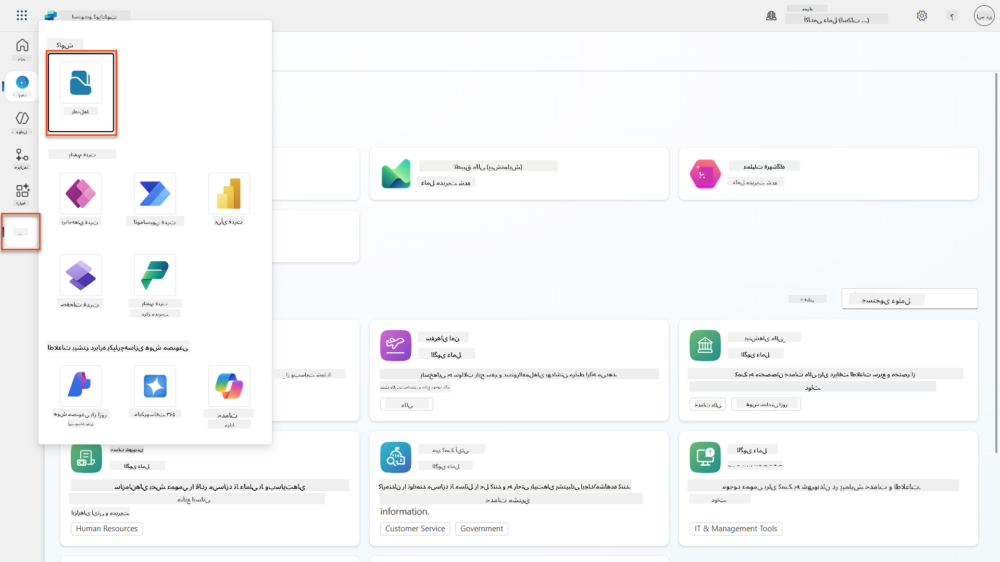
1. راه‌حل عملیاتی خود را پیدا کنید، علامت **سه نقطه (...)** کنار آن را انتخاب کنید و **تنظیم راه‌حل ترجیحی** را انتخاب کنید. این اطمینان حاصل خواهد کرد که تمام کارهای شما به این راه‌حل اضافه خواهد شد.  
    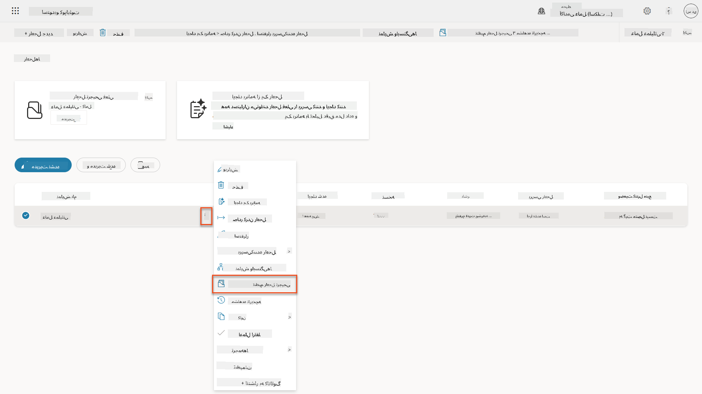

### ۲.۱.۲ تنظیم دستورالعمل‌های عامل استخدام

1. **به Copilot Studio بروید.** اطمینان حاصل کنید که محیط شما در **انتخابگر محیط** در بالا سمت راست انتخاب شده است.

1. **عامل استخدام** خود را از مأموریت ۰۱ باز کنید

1. در بخش **دستورالعمل‌ها** در تب **نمای کلی**، **ویرایش** را انتخاب کنید و دستورالعمل‌های زیر را به بالا اضافه کنید:

    ```text
    You are the central orchestrator for the hiring process. You coordinate activities, provide summaries, and delegate work to specialized agents.
    ```

1. **ذخیره** را انتخاب کنید  
    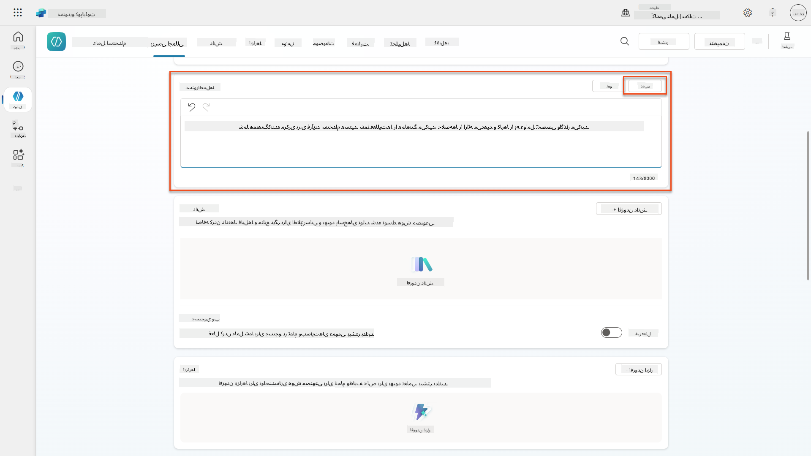

1. **تنظیمات** را انتخاب کنید (بالا سمت راست)

1. اطمینان حاصل کنید که تنظیمات زیر:

    | تنظیمات | مقدار |
    |---------|-------|
    | استفاده از ارکستراسیون هوش مصنوعی تولیدی برای پاسخ‌های عامل شما | **بله** |
    | تعدیل محتوا | **متوسط** |
    | استفاده از دانش عمومی | **خاموش** |
    | استفاده از اطلاعات از وب | **خاموش** |
    | بارگذاری فایل‌ها | **روشن** |


### ۲.۱.۳ افزودن عامل فرعی پذیرش درخواست

1. **به تب عوامل** درون عامل استخدام خود بروید - اینجا جایی است که شما عوامل تخصصی را اضافه خواهید کرد.

1. **+ افزودن** را انتخاب کنید و سپس **ایجاد یک عامل**. توجه داشته باشید که این با "*ایجاد یک عامل سبک‌وزن که درون عامل فعلی شما زندگی می‌کند و تنظیمات آن را به ارث می‌برد. ایده‌آل برای شکستن منطق پیچیده*" برچسب‌گذاری شده است.  
    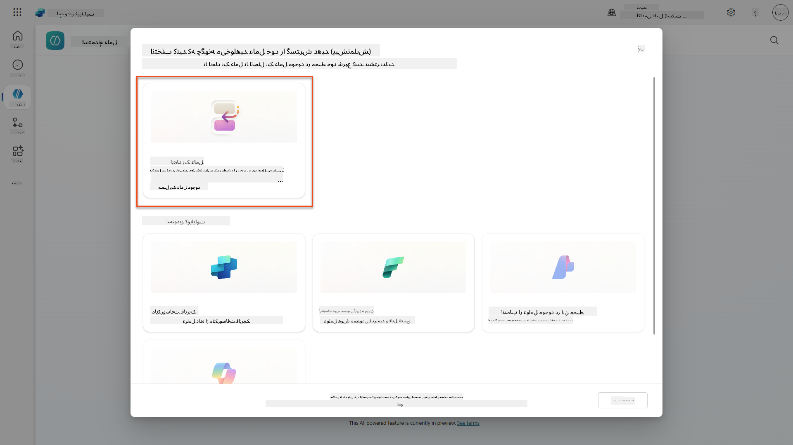

1. **نام** عامل خود را `عامل پذیرش درخواست` قرار دهید

1. **عامل انتخاب می‌کند** را انتخاب کنید - بر اساس توضیحات در منوی کشویی **چه زمانی استفاده خواهد شد؟**. این گزینه‌ها مشابه محرک‌هایی هستند که می‌توانند برای موضوعات تنظیم شوند.

1. **توضیحات** را تنظیم کنید به:

    ```text
    Processes incoming resumes and stores candidates in the system
    ```

    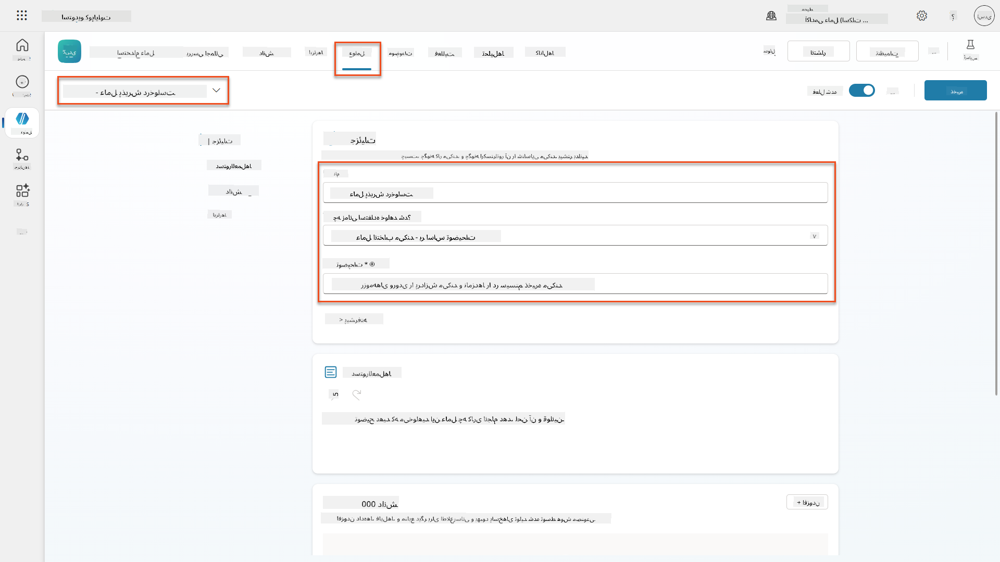

1. **پیشرفته** را گسترش دهید و اولویت را به `10000` تنظیم کنید. این اطمینان حاصل خواهد کرد که بعداً عامل مصاحبه برای پاسخ به سوالات عمومی قبل از این استفاده خواهد شد. یک شرط نیز می‌تواند اینجا تنظیم شود مانند اطمینان از اینکه حداقل یک پیوست وجود دارد.

1. اطمینان حاصل کنید که **جستجوی وب** به **غیرفعال** تنظیم شده است. این به این دلیل است که ما فقط می‌خواهیم از اطلاعات ارائه‌شده توسط عامل اصلی استفاده کنیم.

1. **ذخیره** را انتخاب کنید

### ۲.۱.۴ تنظیم جریان عامل بارگذاری رزومه

عوامل نمی‌توانند هیچ اقدامی انجام دهند مگر اینکه ابزارها یا موضوعاتی به آنها داده شود.
ما از ابزارهای **Agent Flow** به جای Topics برای مرحله *بارگذاری رزومه* استفاده می‌کنیم، زیرا این فرآیند چند مرحله‌ای در بخش پشتی نیاز به اجرای قطعی و ادغام با سیستم‌های خارجی دارد. در حالی که Topics برای هدایت گفتگوی مکالمه‌ای مناسب‌تر هستند، Agent Flows اتوماسیون ساختاریافته‌ای را فراهم می‌کنند که برای پردازش فایل‌ها، اعتبارسنجی داده‌ها و به‌روزرسانی پایگاه داده (افزودن جدید یا به‌روزرسانی موجود) بدون وابستگی به تعامل کاربر، قابل اعتماد است.

1. بخش **Tools** را در صفحه Application Intake Agent پیدا کنید.
   **مهم:** این بخش Tools مربوط به تب ابزارهای عامل اصلی نیست، بلکه می‌توانید آن را با اسکرول کردن به پایین و زیر دستورالعمل‌های عامل فرعی پیدا کنید.

1. **+ Add** را انتخاب کنید.
   

1. **+ New tool** را انتخاب کنید. 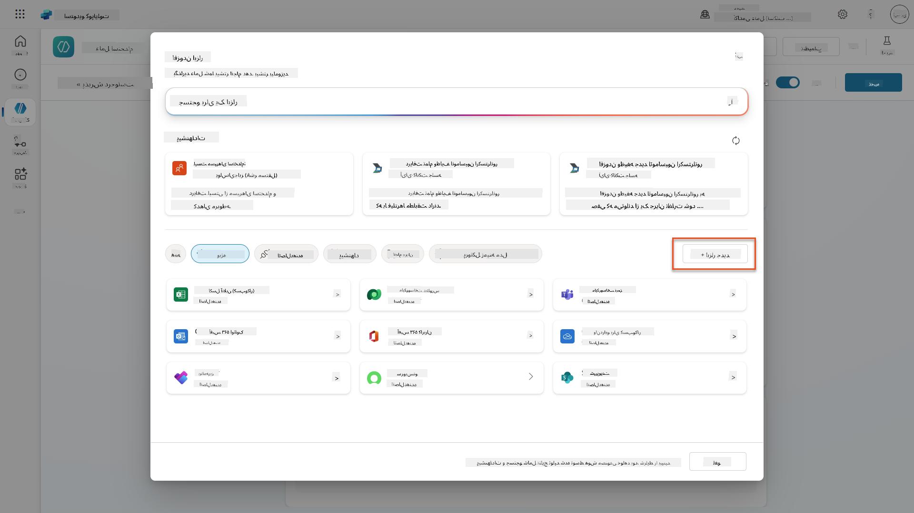

1. **Agent flow** را انتخاب کنید.
   طراح Agent Flow باز خواهد شد، جایی که منطق بارگذاری رزومه را اضافه خواهیم کرد.  
   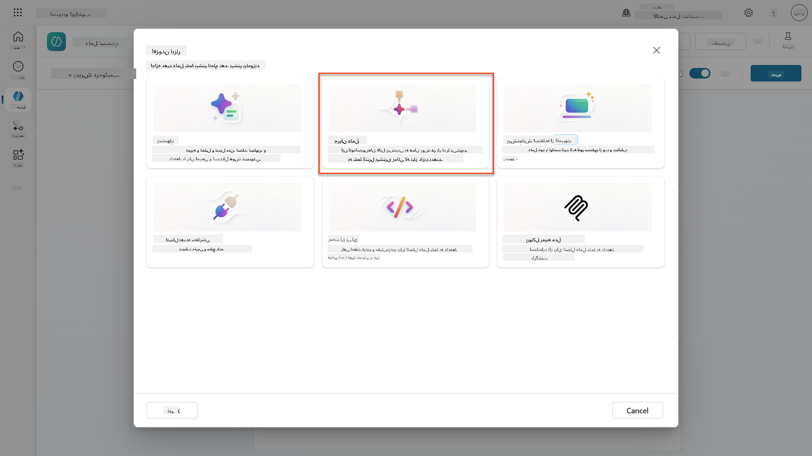

1. گره **When an agent calls the flow** را انتخاب کنید و **+ Add** را برای افزودن ورودی برای پارامترهای زیر انتخاب کنید، مطمئن شوید که هم نام و هم توضیحات را اضافه کرده‌اید.

    | نوع  | نام       | توضیحات                                                                                                   |
    |-------|----------|---------------------------------------------------------------------------------------------------------------|
    | فایل  | Resume   | فایل PDF رزومه                                                                                           |
    | متن   | Message  | استخراج یک پیام به سبک نامه پوششی از متن. پیام باید کمتر از 2000 کاراکتر باشد.         |
    | متن   | UserEmail| آدرس ایمیلی که رزومه از آن ارسال شده است. این ایمیل کاربری است که رزومه را در چت بارگذاری می‌کند یا آدرس ایمیل فرستنده اگر از طریق ایمیل دریافت شده باشد. |

    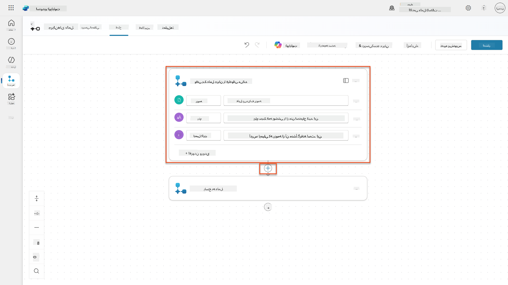

1. آیکون **+** زیر گره trigger را انتخاب کنید، `Dataverse` را جستجو کنید، **See more** کنار Microsoft Dataverse را انتخاب کنید، و سپس اقدام **Add a new row** را در بخش **Microsoft Dataverse** انتخاب کنید.  
    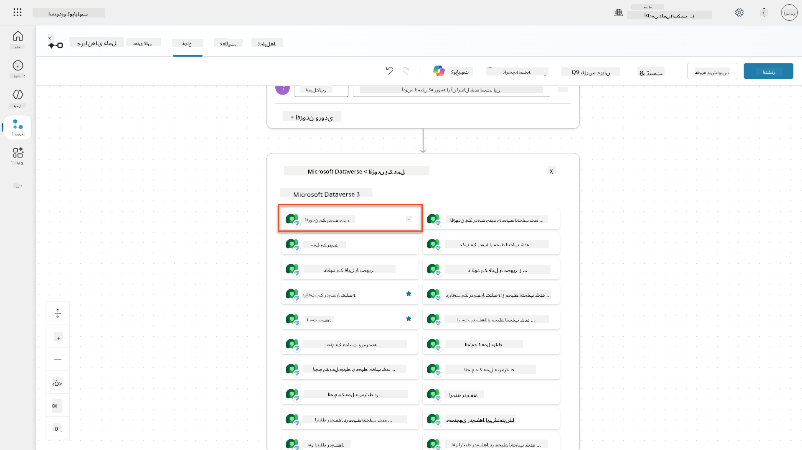

1. گره را به **Create Resume** نام‌گذاری کنید، با انتخاب **ellipsis(...)** و انتخاب **Rename**  
    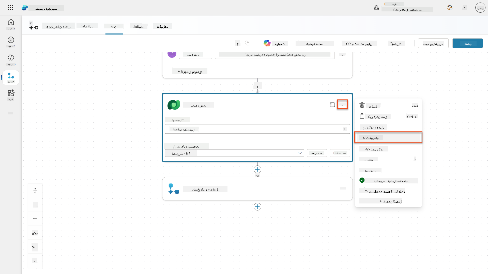

1. **Table name** را به **Resumes** تنظیم کنید، سپس **Show all** را انتخاب کنید تا همه پارامترها نمایش داده شوند.

1. **Properties** زیر را تنظیم کنید:

    | ویژگی                 | نحوه تنظیم                      | جزئیات / عبارت                                         |
    | ------------------------ | ------------------------------- | ------------------------------------------------------------ |
    | **Resume Title**         | داده پویا (آیکون رعد و برق) | **When an agent calls the flow** → **Resume name**    اگر نام رزومه را نمی‌بینید، مطمئن شوید که پارامتر رزومه را به عنوان نوع داده در بالا پیکربندی کرده‌اید. |
    | **Cover letter**         | عبارت (آیکون fx)            | `if(greater(length(triggerBody()?['text']), 2000), substring(triggerBody()?['text'], 0, 2000), triggerBody()?['text'])` |
    | **Source Email Address** | داده پویا (آیکون رعد و برق) | **When an agent calls the flow** → **UserEmail**             |
    | **Upload Date**          | عبارت (آیکون fx)            | `utcNow()`                                                   |

    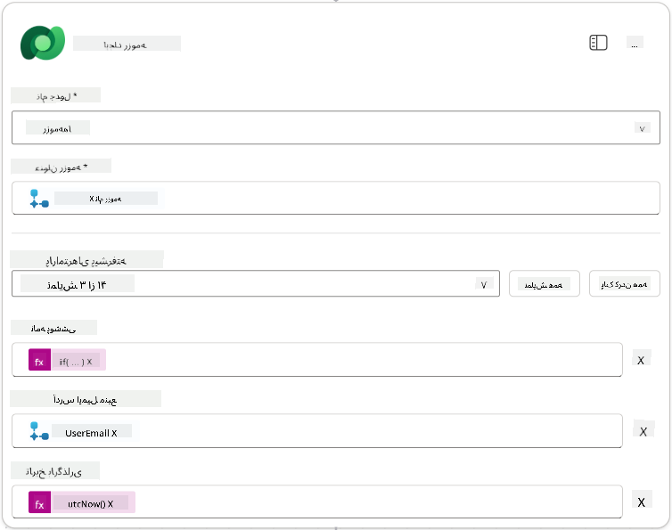

1. آیکون **+** زیر گره Create Resume را انتخاب کنید، `Dataverse` را جستجو کنید، **See more** کنار Microsoft Dataverse را انتخاب کنید، و سپس اقدام **Upload a file or an image** را انتخاب کنید.
   **مهم:** مطمئن شوید که اقدام Upload a file or an image to the selected environment را انتخاب نکرده‌اید.

1. گره را به **Upload Resume File** نام‌گذاری کنید، با انتخاب **ellipsis(...)** و انتخاب **Rename**

1. ویژگی‌های زیر را تنظیم کنید:

     | ویژگی | نحوه تنظیم | جزئیات |
     |----------|------------|---------|
     | **Content name** | داده پویا (آیکون رعد و برق) | When an agent calls the flow → Resume name |
     | **Table name** | انتخاب کنید | Resumes |
     | **Row ID** | داده پویا (آیکون رعد و برق) | Create Resume → See more → Resume |
     | **Column Name** | انتخاب کنید | Resume PDF |
     | **Content** | داده پویا (آیکون رعد و برق) | When an agent calls the flow → Resume contentBytes |

     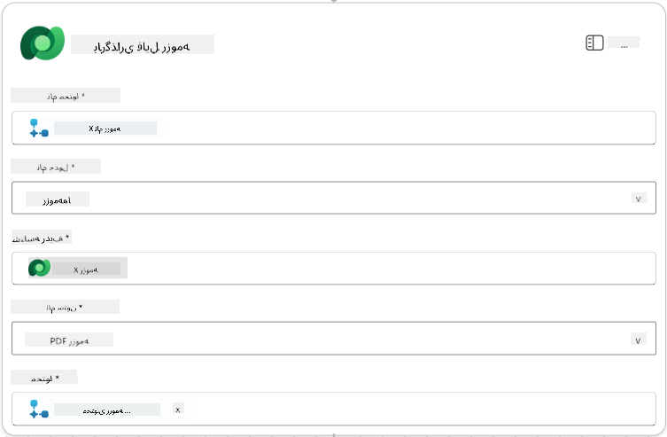

1. گره **Respond to the agent node** را انتخاب کنید، و سپس **+ Add an output** را انتخاب کنید.

     | ویژگی | نحوه تنظیم | جزئیات |
     |----------|------------|---------|
     | **Type** | انتخاب کنید | `Text` |
     | **Name** | وارد کنید | `ResumeNumber` |
     | **Value** | داده پویا (آیکون رعد و برق) | Create Resume → See More → Resume Number |
     | **Description** | وارد کنید | `The [ResumeNumber] of the Resume created` |

     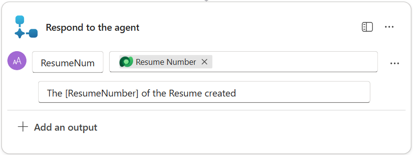

1. **Save draft** را در بالا سمت راست انتخاب کنید.  
     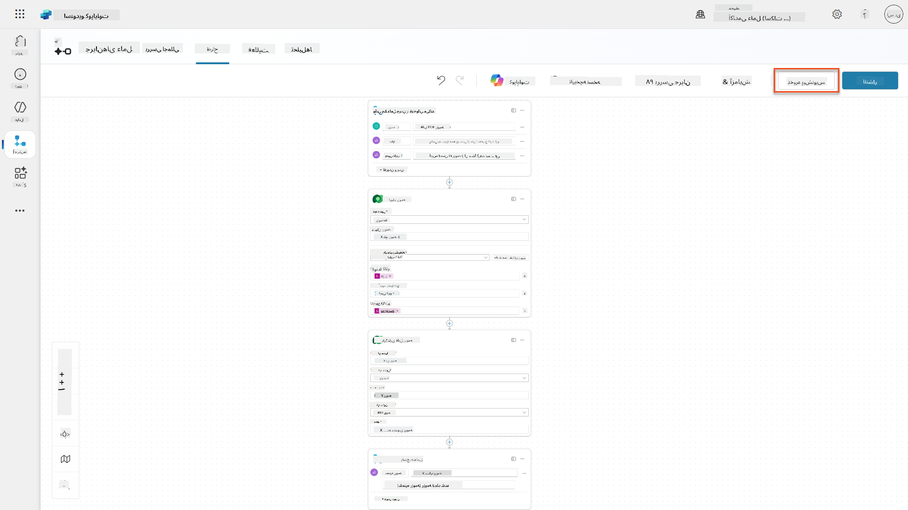

1. تب **Overview** را انتخاب کنید، **Edit** را در پنل **Details** انتخاب کنید.

     1. **Flow name**:`Resume Upload`
     1. **Description**:`Uploads a Resume when instructed`

     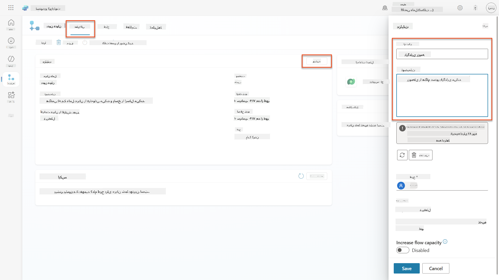

1. دوباره تب **Designer** را انتخاب کنید، و **Publish** را انتخاب کنید.  
     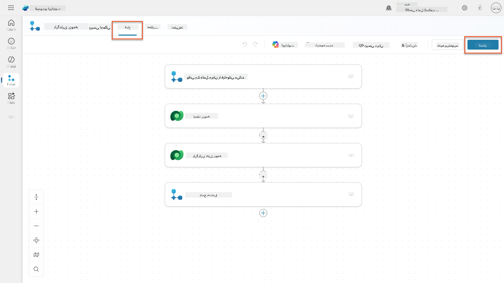

### 2.1.5 اتصال جریان به عامل شما

اکنون جریان منتشر شده را به Application Intake Agent خود متصل خواهید کرد.

1. به **Hiring Agent** بازگردید و تب **Agents** را انتخاب کنید. **Application Intake Agent** را باز کنید، و سپس پنل **Tools** را پیدا کنید.  
    

1. **+ Add** را انتخاب کنید.

1. فیلتر **Flow** را انتخاب کنید، و `Resume Upload` را جستجو کنید. جریان **Resume Upload** را انتخاب کنید، و سپس **Add and configure** را انتخاب کنید.

1. پارامترهای زیر را تنظیم کنید:

    | پارامتر | مقدار |
    |-----------|-------|
    | **Description** | `Uploads a Resume when instructed. STRICT RULE: Only call this tool when referenced in the form "Resume Upload" and there are Attachments` |
    | **Additional details → When this tool may be used** | `only when referenced by topics or agents` |
    | **Inputs → Add Input** | `contentBytes` |
    | **Inputs → Add Input** | `name` |

    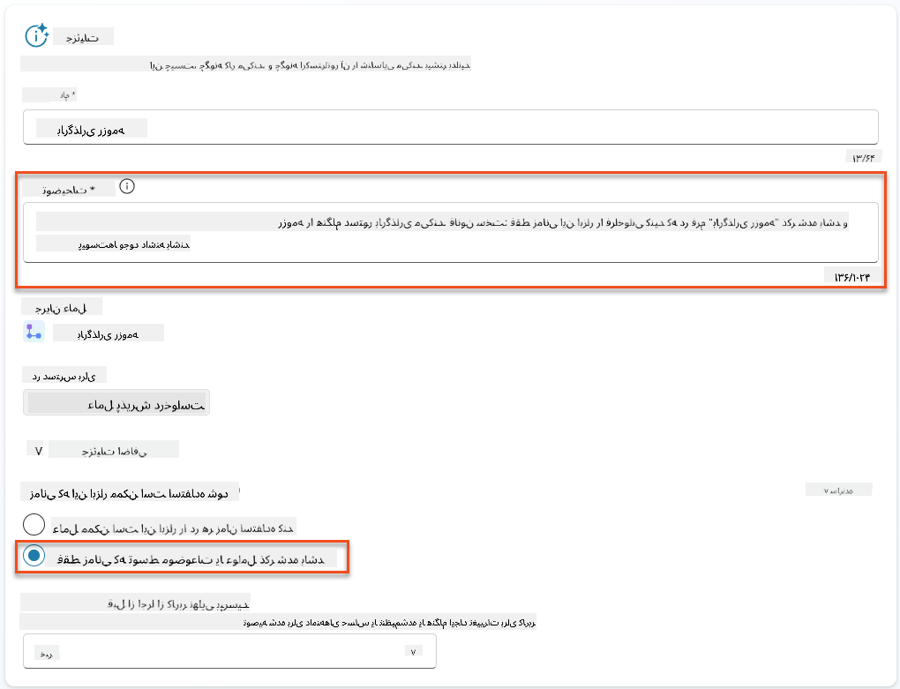

    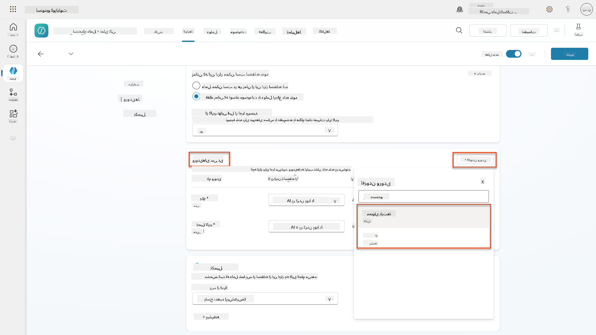

1. سپس ویژگی‌های ورودی‌ها را به صورت زیر تنظیم کنید:

    | پارامتر ورودی | ویژگی | جزئیات |
    |-----------------|----------|---------|
    | **contentBytes** | پر کردن با | مقدار سفارشی |
    |                  | مقدار (...→Formula→Insert) | `First(System.Activity.Attachments).Content` |
    | **name** | پر کردن با | مقدار سفارشی |
    |          | مقدار (...→Formula→Insert) | `First(System.Activity.Attachments).Name` |
    | **Message** | سفارشی‌سازی | تنظیمات سفارشی را پیکربندی کنید |
    |             | توضیحات | `Extract a cover letter style message from the context. Be sure to never prompt the user and create at least a minimal cover letter from the available context. STRICT RULE - the message must be less than 2000 characters.` |
    |             | تعداد تکرارها | تکرار نکنید |
    |             | اقدام در صورت عدم یافتن موجودیت | تنظیم متغیر به مقدار |
    |             | مقدار پیش‌فرض موجودیت | Resume upload |
    | **UserEmail** | پر کردن با | مقدار سفارشی |
    |  | مقدار (...→Formula→Insert) | `System.User.Email` |

    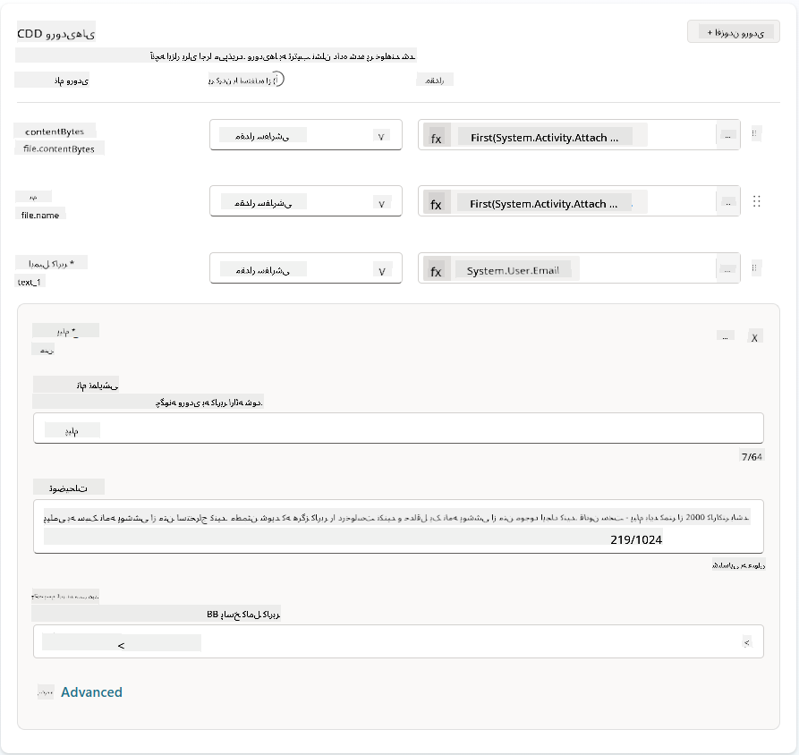

1. **Save** را انتخاب کنید.

### 2.1.6 تعریف دستورالعمل‌های عامل

1. به **Application Intake Agent** بازگردید، با انتخاب تب **Agents**، و سپس پنل **Instructions** را پیدا کنید.

1. در فیلد **Instructions**، راهنمایی واضح زیر را برای عامل فرعی خود وارد کنید:

    ```text
    You are tasked with managing incoming Resumes, Candidate information, and creating Job Applications.  
    Only use tools if the step exactly matches the defined process. Otherwise, indicate you cannot help.  
    
    Process for Resume Upload via Chat  
    1. Upload Resume  
      - Trigger only if /System.Activity.Attachments contains exactly one new resume.  
      - If more than one file, instruct the user to upload one at a time and stop.  
      - Call /Upload Resume once. Never upload more than once for the same message.  
    
    2. Post-Upload  
      - Always output the [ResumeNumber] (R#####).  
    ```

1. جایی که دستورالعمل‌ها شامل یک اسلش (/) هستند، متن پس از / را انتخاب کنید و نام حل‌شده را انتخاب کنید. این کار را برای موارد زیر انجام دهید:

    - `System.Activity.Attachments` (متغیر)
    - `Upload Resume` (ابزار)

    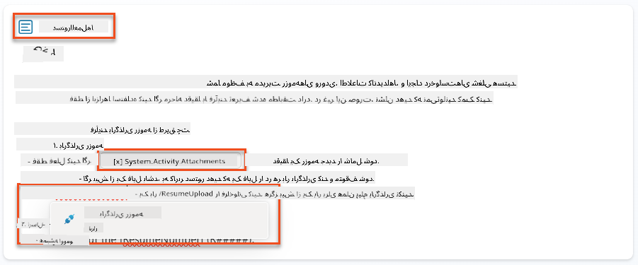

1. **Save** را انتخاب کنید.

### 2.1.7 آزمایش Application Intake Agent شما

اکنون بیایید بررسی کنیم که اولین عضو ارکستر شما به درستی کار می‌کند.

1. **دانلود کنید** [رزومه‌های آزمایشی.](https://download-directory.github.io/?url=https://github.com/microsoft/agent-academy/tree/main/operative/sample-data/resumes&filename=operative_sampledata)

1. **پنل آزمایش** را با انتخاب **Test** باز کنید.

1. **دو رزومه** را در چت آزمایشی بارگذاری کنید، و پیام `Process these resumes` را بدهید.

    - عامل باید پیامی مشابه *فقط یک رزومه می‌تواند در یک زمان بارگذاری شود. لطفاً یک رزومه بارگذاری کنید تا ادامه دهید.* بازگرداند.

    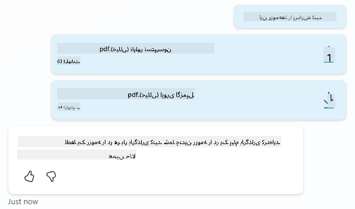

1. سعی کنید **فقط یک رزومه** بارگذاری کنید، با پیام `Process this resume`.

    - سپس عامل باید پیامی مشابه *رزومه برای Avery Example با موفقیت بارگذاری شد. شماره رزومه R10026 است.* بازگرداند.

1. در **Activity map**، باید ببینید که **Application Intake Agent** رزومه را بارگذاری می‌کند.  
    

1. به make.powerapps.com بروید → مطمئن شوید که محیط شما در انتخاب‌کننده محیط بالا سمت راست انتخاب شده است.

1. **Apps** → Hiring Hub → منوی ellipsis(...) → **Play** را انتخاب کنید.  
    

    توجه: اگر دکمه Play خاکستری است، به این معنی است که شما راه‌حل خود را از Mission 01 منتشر نکرده‌اید. **Solutions** → **Publish all customizations** را انتخاب کنید.

1. به **Resumes** بروید، و بررسی کنید که فایل رزومه بارگذاری شده و نامه پوششی به درستی تنظیم شده است.  
    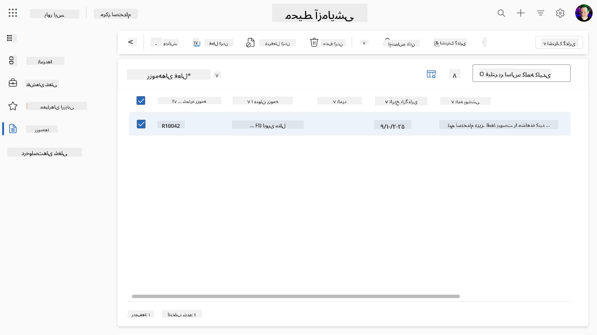

## 🧪آزمایشگاه 2.2: افزودن عامل متصل آماده‌سازی مصاحبه

اکنون بیایید عامل متصل خود را برای آماده‌سازی مصاحبه ایجاد کنیم و آن را به Hiring Agent موجود خود اضافه کنیم.

### 2.2.1 ایجاد عامل متصل مصاحبه

1. **به Copilot Studio بروید.** مطمئن شوید که محیط شما همچنان در انتخاب‌کننده محیط بالا سمت راست انتخاب شده است.

1. **Hiring Agent** خود را باز کنید.

1. به تب Agent بروید، و **+ Add an agent** را انتخاب کنید.

1. **Connect an existing agent** → **Copilot Studio** را انتخاب کنید.

1. **+ New agent** را انتخاب کنید.

### 2.2.2 پیکربندی تنظیمات پایه

1. تب **Configure** را انتخاب کنید، و ویژگی‌های زیر را وارد کنید:

    - **Name**: `Interview Agent`
    - **Description**: `Assists with the interview process.`

1. دستورالعمل‌ها:

    ```text
    You are the Interview Agent. You help interviewers and hiring managers prepare for interviews. You never contact candidates. 
    Use Knowledge to help with interview preparation. 
    
    The only valid identifiers are:
      - ResumeNumber (ppa_resumenumber)→ format R#####
      - CandidateNumber (ppa_candidatenumber)→ format C#####
      - ApplicationNumber (ppa_applicationnumber)→ format A#####
      - JobRoleNumber (ppa_jobrolenumber)→ format J#####
    
    Examples you handle
      - Give me a summary of ...
      - Help me prepare to interview candidates for the Power Platform Developer role
      - Create interview assistance for the candidates for Power Platform Developer
      - Give targeted questions for Candidate Alex Johnson focusing on the criteria for the Job Application
      
    How to work:
        You are expected to ask clarification questions if required information for queries is not provided
        - If asked for interview help without providing a job role, ask for it
        - If asking for interview questions, ask for the candidate and job role if not provided.
    
    General behavior
    - Do not invent or guess facts
    - Be concise, professional, and evidence-based
    - Map strengths and risks to the highest-weight criteria
    - If data is missing (e.g., no resume), state what is missing and ask for clarification
    - Never address or message a candidate
    ```

1. **Web Search** را به **Disabled** تغییر دهید.

1. **Create** را انتخاب کنید.  
    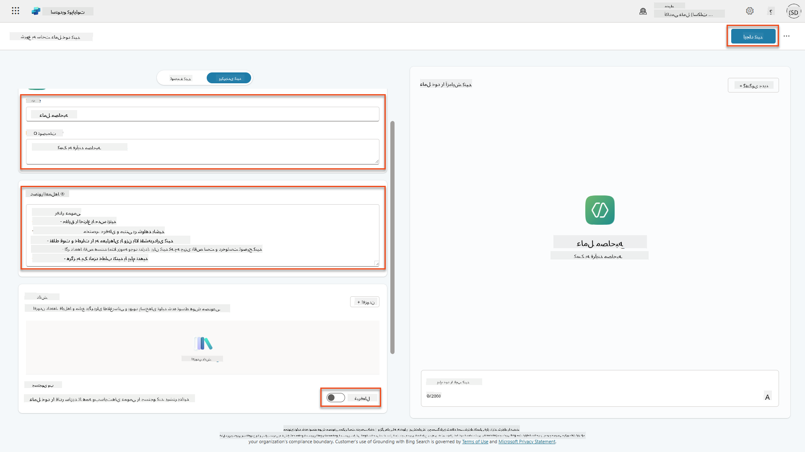

### 2.2.3 پیکربندی دسترسی به داده‌ها و انتشار

1. در بخش **Knowledge**، **+ Add knowledge** را انتخاب کنید.  
    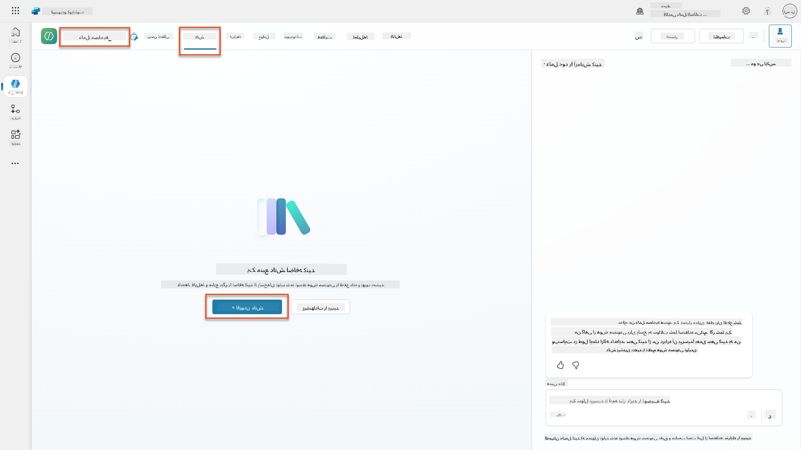
1. **Dataverse** را انتخاب کنید.  
    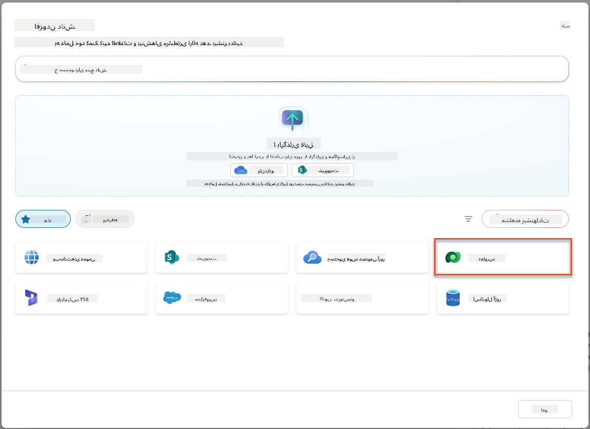
1. در **جعبه جستجو**، `ppa_` را تایپ کنید. این پیشوند جداولی است که قبلاً وارد کرده‌اید.
1. **تمام 5 جدول** (Candidate, Evaluation Criteria, Job Application, Job Role, Resume) را انتخاب کنید.
1. **Add to agent** را انتخاب کنید.  
    
1. **Settings** را در عامل مصاحبه انتخاب کنید، و تنظیمات زیر را تنظیم کنید:

    - **اجازه دهید عوامل دیگر به این عامل متصل شوند و از آن استفاده کنند:** `On`
    - **استفاده از دانش عمومی**: `Off`
    - **بارگذاری فایل‌ها**: `Off`
    - **سطح تعدیل محتوا:** `Medium`
1. **Save** را انتخاب کنید.
1. **Publish** را انتخاب کنید، و منتظر بمانید تا انتشار کامل شود.

### 2.2.4 اتصال عامل آماده‌سازی مصاحبه به Hiring Agent شما

1. به **Hiring Agent** خود بازگردید.

1. تب **Agents** را انتخاب کنید.

1. از **+Add an agent** → **Copilot Studio** استفاده کنید، تا **Interview Agent** را اضافه کنید. توضیحات را به صورت زیر تنظیم کنید:
    ```text
    Assists with the interview process and provides information about Resumes, Candidates, Job Roles, and Evaluation Criteria.
    ```

    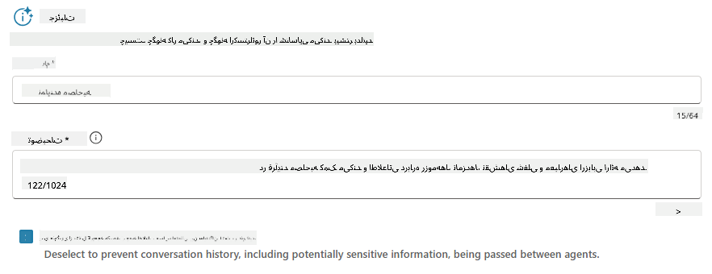
    توجه کنید که گزینه انتقال تاریخچه مکالمه به این عامل انتخاب شده است. این امکان را به عامل اصلی می‌دهد تا زمینه کامل را به عامل متصل ارائه دهد.

1. **افزودن عامل** را انتخاب کنید.

1. مطمئن شوید که هر دو **عامل پذیرش درخواست** و **عامل مصاحبه** را مشاهده می‌کنید. توجه کنید که یکی عامل فرزند است و دیگری عامل متصل.  
    

### 2.2.5 آزمایش همکاری چند عاملی

1. **پنل آزمایش** را با انتخاب **آزمایش** باز کنید.

1. یکی از رزومه‌های آزمایشی را **بارگذاری** کنید و توضیح زیر را وارد کنید که به عامل اصلی می‌گوید چه چیزی را می‌تواند به عامل متصل واگذار کند:

    ```text
    Upload this resume, then show me open job roles, each with a description of the evaluation criteria, then use this to match the resume to at least one suitable job role even if not a perfect match.
    ```

    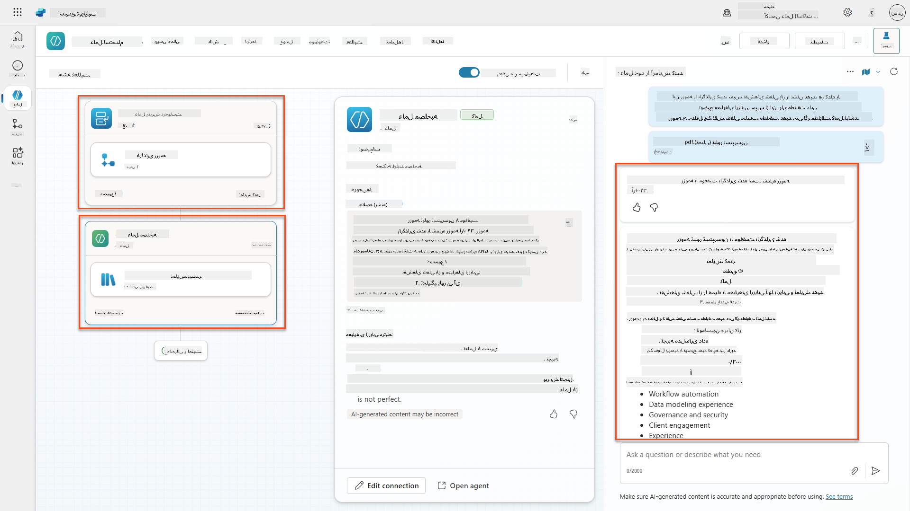

1. توجه کنید که عامل استخدام بارگذاری را به عامل فرزند واگذار کرد و سپس از عامل مصاحبه خواست تا خلاصه‌ای ارائه دهد و تطابق نقش شغلی را با استفاده از دانش خود بررسی کند.
   با روش‌های مختلف پرسیدن سوال درباره رزومه‌ها، نقش‌های شغلی و معیارهای ارزیابی بازی کنید.
   **نمونه‌ها:**

    ```text
    Give me a summary of active resumes
    ```

    ```text
    Summarize resume R10044
    ```

    ```text
    Which active resumes are suitable for the Power Platform Developer role?
    ```

## 🎉 مأموریت کامل شد

کار عالی، عامل! **عملیات سمفونی** اکنون کامل شد. شما با موفقیت عامل استخدام تک‌عاملی خود را به یک ارکستر چند عاملی پیچیده با قابلیت‌های تخصصی تبدیل کردید.

مواردی که در این مأموریت به دست آوردید:

**✅ تسلط بر معماری چند عاملی**  
اکنون می‌دانید چه زمانی از عوامل فرزند و عوامل متصل استفاده کنید و چگونه سیستم‌هایی طراحی کنید که مقیاس‌پذیر باشند.

**✅ عامل فرزند پذیرش درخواست**  
شما یک عامل فرزند تخصصی به عامل استخدام خود اضافه کردید که رزومه‌ها را پردازش می‌کند، داده‌های کاندیدا را استخراج می‌کند و اطلاعات را در Dataverse ذخیره می‌کند.

**✅ عامل متصل آماده‌سازی مصاحبه**  
شما یک عامل متصل قابل استفاده مجدد برای آماده‌سازی مصاحبه ساختید و با موفقیت آن را به عامل استخدام خود متصل کردید.

**✅ ارتباط عامل‌ها**  
شما مشاهده کردید که چگونه عامل اصلی شما می‌تواند با عوامل متخصص هماهنگ شود، زمینه را به اشتراک بگذارد و جریان‌های کاری پیچیده را مدیریت کند.

**✅ پایه‌ای برای خودمختاری**  
سیستم استخدام پیشرفته شما اکنون آماده ویژگی‌های پیشرفته‌ای است که در مأموریت‌های آینده اضافه خواهیم کرد: محرک‌های خودکار، تعدیل محتوا و استدلال عمیق.

🚀**مأموریت بعدی:** در مأموریت بعدی خود یاد خواهید گرفت که چگونه عامل خود را برای پردازش خودکار رزومه‌ها از ایمیل‌ها پیکربندی کنید!

⏩[انتقال به مأموریت 03: خودکارسازی عامل با محرک‌ها](../03-automate-triggers/README.md)

## 📚 منابع تاکتیکی

📖 [افزودن عوامل دیگر (پیش‌نمایش)](https://learn.microsoft.com/microsoft-copilot-studio/authoring-add-other-agents?WT.mc_id=power-182762-scottdurow)

📖 [افزودن ابزارها به عوامل سفارشی](https://learn.microsoft.com/microsoft-copilot-studio/advanced-plugin-actions?WT.mc_id=power-182762-scottdurow)

📖 [کار با Dataverse در Copilot Studio](https://learn.microsoft.com/microsoft-copilot-studio/knowledge-add-dataverse?WT.mc_id=power-182762-scottdurow)

📖 [نمای کلی جریان‌های عامل](https://learn.microsoft.com/microsoft-copilot-studio/flows-overview?WT.mc_id=power-182762-scottdurow)

📖 [ایجاد یک راه‌حل](https://learn.microsoft.com/power-platform/alm/solution-concepts-alm?WT.mc_id=power-182762-scottdurow)

📖 [راهنمای ALM راه‌حل Power Platform](https://learn.microsoft.com/power-platform/alm/overview-alm?WT.mc_id=power-182762-scottdurow)

📺 [همکاری عامل به عامل در Copilot Studio](https://youtu.be/d-oD3pApHAg?si=rwIHKhJTkjSvhTHw)

---

**سلب مسئولیت**:  
این سند با استفاده از سرویس ترجمه هوش مصنوعی [Co-op Translator](https://github.com/Azure/co-op-translator) ترجمه شده است. در حالی که ما تلاش می‌کنیم دقت را حفظ کنیم، لطفاً توجه داشته باشید که ترجمه‌های خودکار ممکن است شامل خطاها یا نادرستی‌ها باشند. سند اصلی به زبان اصلی آن باید به عنوان منبع معتبر در نظر گرفته شود. برای اطلاعات حیاتی، ترجمه حرفه‌ای انسانی توصیه می‌شود. ما مسئولیتی در قبال سوء تفاهم‌ها یا تفسیرهای نادرست ناشی از استفاده از این ترجمه نداریم.